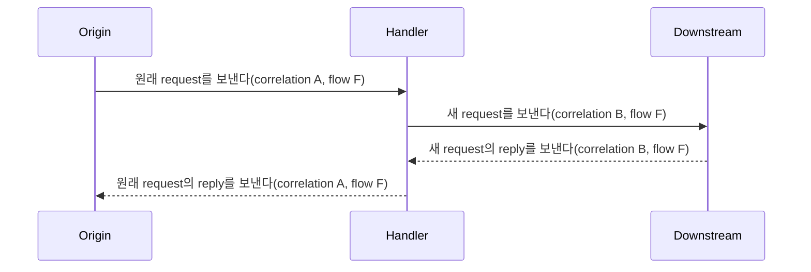

# Request 연결과 업무 흐름 식별

[스펙 목차](README.ko.md) · [이전: Message flow tracing](26-message-flow-tracing.ko.md) · [다음: Host Relocate와 Shutdown](28-graceful-drain-handoff.ko.md)

> **이 장이 정의하는 것** — request와 terminal reply를 연결하고, 같은 원인에서 이어진
> 여러 message를 하나의 업무 흐름으로 식별하는 계약.

## 1. 무엇을 식별하는가

이 문서는 Framework가 request와 terminal reply를 정확히 연결하고, 같은 원인에서
이어진 여러 message를 하나의 업무 흐름으로 식별하는 계약을 정의한다.
Application은 이 식별자를 생성하거나 reply를 연결하는 데 사용하지 않는다.

Request를 보낼 때 만들고 terminal reply까지 같은 값을 유지하는 식별 정보를
[reply correlation](01-glossary.ko.md#reply-correlation)이라고 하며, 공개 field 이름은
`correlation_id`다. 여러 hop과 fan-out branch가 같은 원인에서 시작되었음을 나타내는
값은 `flow_id`다. `flow_origin`은 그 흐름이 처음 시작된 위치를 나타낸다.

이 문서는 세 field의 생성, 형식, 전파, 소유권과 수명만 정의한다. Application이
message와 함께 보내는 metadata의 소유권과 크기는
[Message model](04-message-model.ko.md)이 정의한다. Trace에 field를 넣는 조건과
sampling은 [Message flow tracing](26-message-flow-tracing.ko.md)이 정의한다.
세 field는 Framework가 관리하는 context이며 application metadata key가 아니다.

## 2. 두 식별자의 역할

| 식별자 | 연결하는 범위 | 만드는 주체 | 유효한 기간 |
|---|---|---|---|
| `correlation_id` | Request 하나와 그 response 또는 error 하나 | Request를 시작한 Framework runtime | Request가 terminal 완료될 때까지 |
| `flow_id` | 같은 원인에서 파생된 여러 message와 fan-out branch | 그 흐름의 첫 작업을 처리하는 Framework runtime | 관련 branch에 전파할 작업이 끝날 때까지 |

Framework는 `correlation_id`만 사용하여 reply를 현재 대기 중인 request와 연결한다.
`flow_id`는 관측을 위한 값이며 message 중복 제거, idempotency와 현재 owner 검증에
사용하지 않는다.

Handler가 원래 request를 처리하면서 다른 target에 새 request를 보내는 작업을
[downstream request](01-glossary.ko.md#downstream-request)라고 한다. Downstream
request마다 새 `correlation_id`를 만들지만 같은 원인에서 이어졌다면 `flow_id`는
유지한다. Reply가 없는 one-way message에는 `correlation_id`를 만들지 않는다.

## 3. 형식과 소유권

| Field | 형식과 값의 범위 |
|---|---|
| `correlation_id` | Framework가 만드는 `1..64 byte` opaque ASCII 값이다. 값을 만든 runtime의 같은 lifecycle에서 동시에 대기 중인 request 사이에 중복할 수 없다. |
| `flow_id` | 소문자와 hyphen으로 표기한 UUIDv7이며 정확히 `36 ASCII byte`다. |
| `flow_origin` | `inbound`, `timer`, `application`, `lifecycle` 중 하나다. 흐름을 처음 만들 때 정한 값을 이후 hop에서도 유지한다. |

Application은 세 값을 해석하거나 조립하지 않는다. `flow_id`와 `flow_origin`은 함께
존재하거나 함께 없어야 한다.

형식이 잘못된 `flow_id`, byte 길이가 0인 `correlation_id`, 두 field 중 하나만 있는
flow 정보는 protocol error다.

| 잘못된 값이 들어온 위치 | Framework가 완료하는 방법 |
|---|---|
| Framework message envelope | 해당 operation을 `ProtocolError`로 완료한다. |
| STREAM frame | Connection을 `ProtocolError`로 종료한다. |

## 4. Flow를 만드는 시점

Inbound message에 형식이 올바른 `flow_id`와 `flow_origin`이 있으면 그대로
사용한다. 단, 현재 runtime의 message-flow tracing이 켜져 있을 때만 두 field를
읽고 flow context에 넣는다. 두 field가 없으면 Framework는 다음 작업을 새 흐름의
시작으로 보고 값을 만든다.

- STREAM ingress와 Node·Channel·Spot·Instance Spot·Actor의 inbound 처리
- Timer callback과 lifecycle callback
- Framework callback 밖의 application code가 시작한 첫 outbound operation

Diagnostics level이 `off`이면 관측 전용 flow 처리를 모두 생략한다. 새
`flow_id`를 만들지 않고 inbound message의 flow field를 flow context로 만들거나
다음 message에 복사하지 않는다. Outbound envelope에도 두 field를 추가하지 않는다.
Client connector가 시작한 outbound request도 같은 규칙을 따른다.

`correlation_id`는 request와 terminal reply를 연결하는 protocol 정보다. Diagnostics
level이 `off`여도 request마다 만들고 reply까지 보존한다. 이 값은 tracing을 끌 때
제거할 수 없다.

Framework는 callback 실행을 시작할 때 현재 flow context를 설정한다. Callback의
terminal completion에서는 실행 전에 있던 context로 복원한다. Tracing이
`off`이면 이 context를 만들거나 async-local storage에 넣지 않는다.

실행 중 diagnostics level을 바꾸는 규칙은
[Message flow tracing](26-message-flow-tracing.ko.md#41-실행-중에-기록-수준-변경)을
따른다. 각 처리 지점이 `off`를 확인한 뒤에는 flow ID 생성, validation, context
capture, envelope field 추가와 전파용 내부 message 생성을 하지 않는다. 이미
만들어진 outbound frame에는 변경을 소급 적용하지 않는다.

## 5. 전파 규칙

Message-flow tracing이 켜져 있으면 Framework는 한 작업에서 원인과 결과가 이어지는
동안 `flow_id`와 `flow_origin`을 함께 전달한다. `off`일 때는 §4의 생략 규칙을
적용한다.

| 처리 경계 | 두 flow field를 보존하는 범위 |
|---|---|
| [Node direct](01-glossary.ko.md#node-direct)와 Channel | MeshName과 target RID로 지정했거나 Channel에서 선택한 RouteMesh·ClientServer target의 handler context까지 보존한다. |
| [Spot direct](01-glossary.ko.md#spot-direct) | Global Spot ID로 찾은 target Spot의 application turn까지 보존한다. |
| Instance Spot direct | Source 조회, Spot 생성 message, target의 생성 권한 확보와 application 처리를 열기 전 대기를 지나 첫 application turn까지 보존한다. |
| Actor direct와 STREAM Actor dispatch | Target Actor queue와 request reply까지 보존한다. |
| Actor relocation | Relocation control과 target Actor의 관련 lifecycle 작업까지 보존한다. |
| 현재 session에 연결된 push | 현재 Actor operation에서 파생된 push까지 보존한다. |
| [Logical Multicast](01-glossary.ko.md#logical-multicast)와 [Classic fanout](01-glossary.ko.md#classic-fanout) | 모든 remote branch와 local branch가 같은 `flow_id`를 사용한다. |

Logical Multicast는 ChannelName과 topic으로 여러 Spot에 message를 보내고, Classic
fanout은 별도 PUB/SUB 경로로 event를 보낸다. 두 방식은 branch마다 target
identity나 local sequence가 다르지만 `flow_id`는 같다.

중간 runtime이 원래 request를 전달할 때는 terminal reply까지 원래
`correlation_id`를 보존한다. Downstream request에는 새 `correlation_id`를
사용한다. Tracing이 켜져 있고 현재 flow context가 있으면 두 flow field도
전달한다.

Instance Spot을 처음 선택한 target이 생성 권한을 얻지 못하면 현재 요청을 받을 수
있는 [Ready](01-glossary.ko.md#ready) owner로 message를 한 번 전달할 수 있다. 이때
원래 `correlation_id`를 유지한다. Tracing이 켜져 있으면 `flow_id`와
`flow_origin`도 유지한다. Target queue가 message를 수락한 뒤에는 Framework가
자동으로 다시 전송하지 않는다.

## 6. Async 작업과 execution context

Framework가 기다리는 비동기 continuation에는 현재 flow context를 보존한다.
Framework와 분리하여 실행한 task, 별도 executor와 외부 callback에는 context를
암묵적으로 전달하지 않는다. 명시적으로 전달한 context가 없으면 새 application
flow로 처리한다. 단, tracing이 켜져 있을 때만 새 flow를 만들고 context를
보존한다.

Async-local context를 안전하게 지원할 수 없는 언어는 context를 명시적으로
capture하는 public interface를 제공한다. Process-global 변수, thread ID와 변경
가능한 connector field로 현재 flow를 추정하지 않는다.

## 7. Reply와 실패

Response와 error는 request의 `correlation_id`를 보존한다. Reply를 만드는 시점에
tracing이 켜져 있고 request flow context가 있으면 `flow_id`와 `flow_origin`도
보존한다. Request가 reply, error, timeout, cancellation 또는 shutdown으로 terminal
완료되면 Framework는 해당 `correlation_id`를 더 이상 reply 연결에 사용하지 않는다.

Timeout이나 cancellation 뒤에 도착한 reply는 다른 pending request와 연결하지
않는다. 연결이 교체된 뒤 이전 [STREAM session](01-glossary.ko.md#stream-session)의
reply와 push도 새 session의 flow와 연결하지 않는다. Actor와 현재 STREAM session의
연결을 식별하는 [binding token](01-glossary.ko.md#binding-token)이 더 이상
유효하지 않은 경우에도 reply와 push를 새 session의 flow에 연결하지 않는다.
Dispatch failure를 기록할 수 있으면 실패한 message에서 읽은 correlation과 flow
정보를 유지한다. Invalid frame에서 식별자를 읽지 못하면 새 식별자를 만들어 원래
request의 기록처럼 표시하지 않는다.

Downstream terminal completion은 이를 시작한 원래 activation에 정확히 한 번만
전달한다. 해당 operation이 확인한 generation이 바뀌거나 owner가 종료되면 stale
결과로 끝낸다. Timeout, cancellation과 늦은 reply는 handler 분배를 다시
실행하거나 route를 다시 선택하게 하지 않는다.

`flow_id`가 같다는 사실은 retry를 허용하지 않는다. Retry 여부와 새
`correlation_id` 발급은 해당 messaging surface의 계약을 따른다.

## 8. 관측과 privacy

Tracing은 `correlation_id`, `flow_id`와 `flow_origin`을 기록한다. 정확한 포함
조건과 structured log key는
[Message flow tracing](26-message-flow-tracing.ko.md#32-attribute-포함-조건)이
정의한다. Metric label에는 세 값을 모두 사용하지 않는다.

세 field에는 user ID, Actor ID, Spot ID, endpoint, payload와 application metadata를
encode하지 않는다. 외부 trace adapter도 Framework가 정한 형식과 소유권을 바꾸지
않는다.

## 9. 구현 및 contract test 검증 요구

- Request와 terminal reply가 같은 `correlation_id`를 사용하고 request를 정확히 한
  번 완료하는지 확인한다.
- 같은 원인에서 이어진 Node, Channel, Spot, Actor와 STREAM hop이 같은 `flow_id`와
  `flow_origin`을 사용하는지 확인한다.
- Instance Spot의 source 조회, Spot 생성 message, target의 생성 권한 확보,
  application 처리를 열기 전 대기와 첫 handler가 같은 correlation과 flow 정보를
  유지하는지 확인한다.
- 생성 권한을 얻지 못한 target이 Ready owner로 message를 전달해도 새 식별자를
  만들지 않는지 확인한다.
- Tracing이 켜져 있을 때 Logical Multicast와 Classic fanout의 모든 branch가 원래
  `flow_id`를 보존하는지 확인한다.
- Tracing을 끈 runtime이 trace 전용 `flow_id`, `flow_origin`, flow context와
  전파용 내부 message를 만들지 않는지 확인한다.
- Tracing을 끈 runtime도 request/reply용 `correlation_id`는 만들고 terminal
  reply까지 보존하는지 확인한다.
- 실행 중 tracing을 끈 뒤 새 처리 지점이 기존 flow 정보를 context나 outbound
  envelope에 추가하지 않고, 다시 켠 뒤에는 이전 단계를 소급하여 기록하지 않는지
  확인한다.
- Callback 종료 뒤 관련 없는 callback에 이전 flow context가 남지 않는지 확인한다.
- 이전 STREAM session의 reply와 늦은 reply가 새 correlation에 연결되지 않는지
  확인한다.
- Downstream request가 새 `correlation_id`를 사용하고 원래 Spot·Actor activation에는
  terminal completion이 정확히 한 번만 전달되는지 확인한다.
- Correlation과 flow 정보가 metric label이나 application metadata 값으로 사용되지
  않는지 확인한다.
