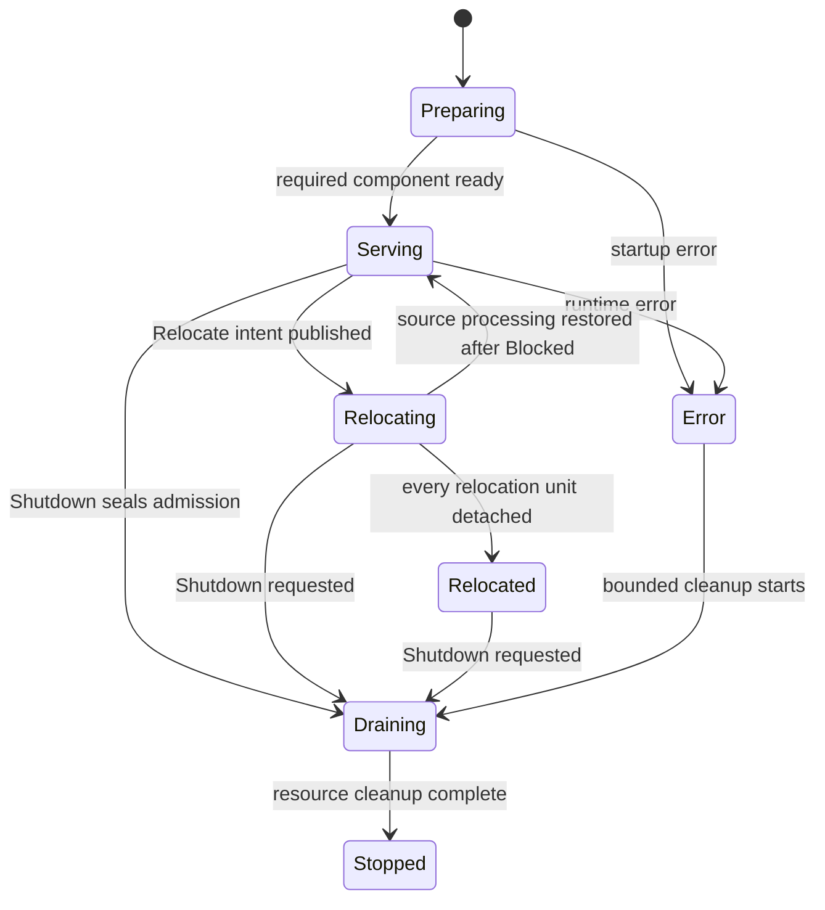
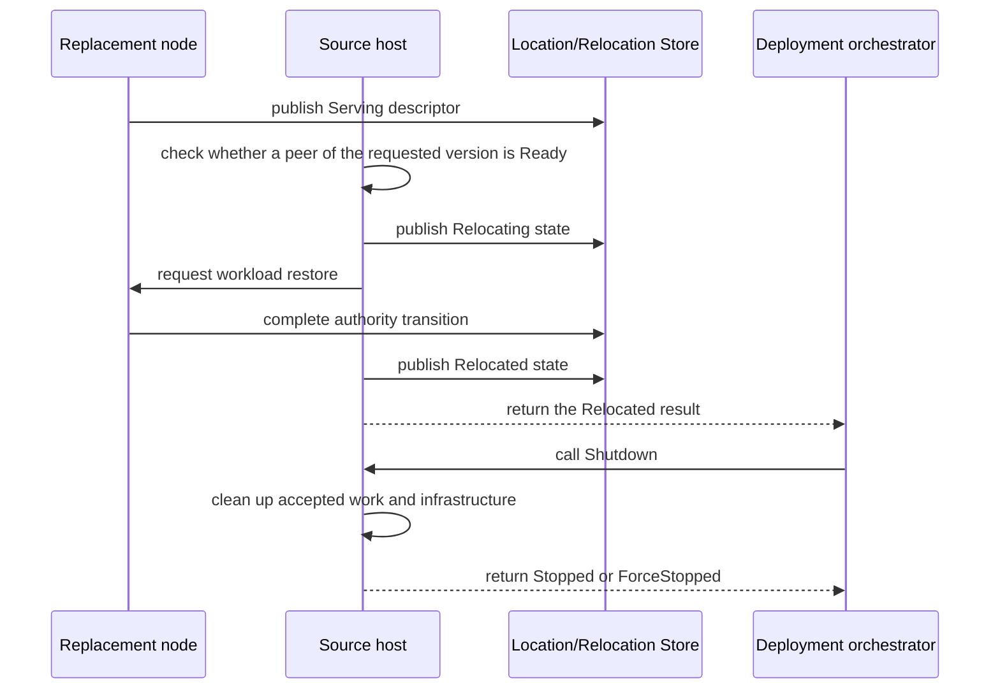
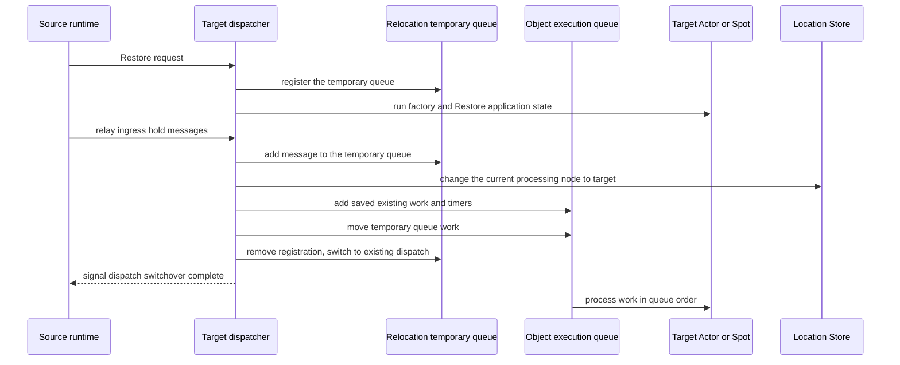
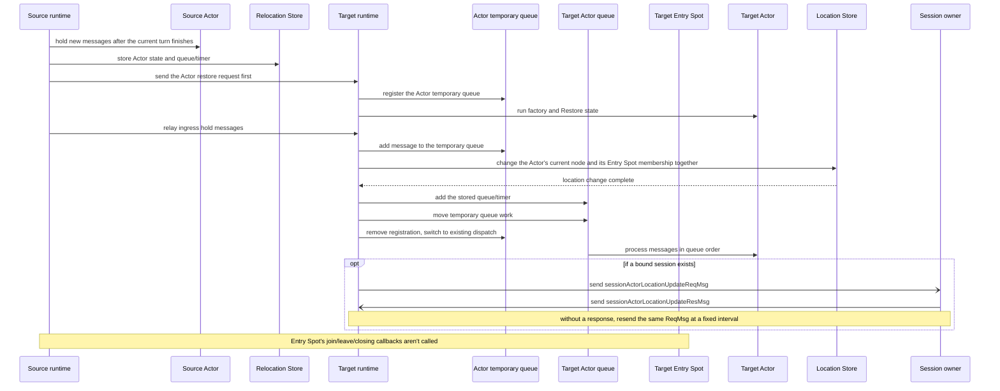
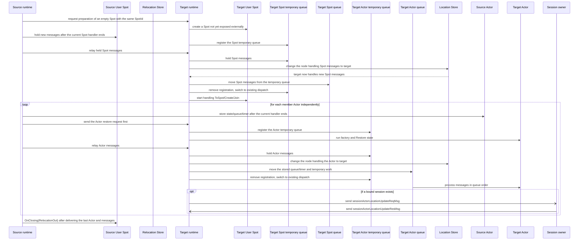
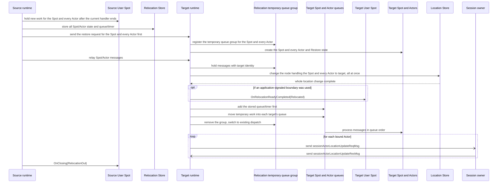
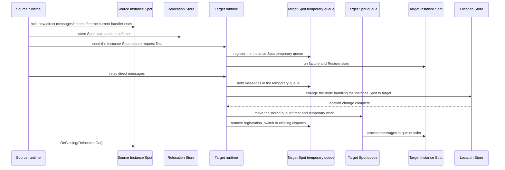

# Host Relocate And Shutdown

[Spec table of contents](README.en.md) · [Previous: Request Correlation And Business Flow Identification](27-flow-correlation.ko.md) · [Next: Transport Connection Liveness](29-transport-liveness.ko.md)

> **What this chapter defines** — the call sequence and outcomes when moving a host's
> stateful workload to another node, or shutting a host down.


## 1. Questions This Document Answers

This document defines which operations the application calls when moving a host's
stateful workload to another node or shutting the host down, the order in which the
framework processes them, and what result each call ends with.

The unit that runs message handlers and Actors is called a
[Spot](01-glossary.en.md#spot). In this document, stateful workload means the Actors/
Spots a host is processing and the not-yet-finished messages and timers.

To inspect or reboot a node while keeping the application version, call `Relocate` with
`PlannedMaintenance`. To switch to a prepared new application version, call it with
`RollingUpdate`. The way the target version is chosen is called a
[relocation mode](01-glossary.en.md#relocation-mode).

On success, both modes only detach the stateful workload from the source host. The host
and infrastructure connections are kept. The application or deployment orchestrator
confirms this result and then separately calls
[Shutdown](01-glossary.en.md#shutdown).

To shut down a host without guaranteeing stateful workload continuity, call `Shutdown`
alone, without `Relocate`.

### 1.1 Failure-Handling Scope

`Relocate` only supports a graceful handoff that runs until the source runtime, the
chosen target runtime, the Location Store, and the Relocation Store finish the
operation. A transient Store or transport error within the same process can be retried
within the deadline. But once the source or target process terminates, a different
runtime doesn't take over the relocation, and there's no automatic recovery by picking a
different target. This capability is defined in a future version's object failover
contract.

Even in this version, the rule against ever creating two owners at once must be kept. If
a Location Store change's result isn't received, success or failure isn't guessed — the
same record is re-read. Source admission isn't reopened, and target application message
processing isn't started, before confirming the actual owner.

The name distinguishing a RouteMesh group of nodes connected under the same name is
called a [MeshName](01-glossary.en.md#meshname). The name selecting a target among nodes
participating in the same Channel is [ChannelName](01-glossary.en.md#channelname). The
application doesn't directly assemble a shutdown sequence by picking only some
components via MeshName, ChannelName, or node RID.

A [RouteMesh](01-glossary.en.md#routemesh), the connection group where several nodes
exchange messages, a runtime node participating in that group
([MeshNode](01-glossary.en.md#meshnode)), a ClientServer server, and a
[Classic fanout](01-glossary.en.md#classic-fanout) publisher are all coordinated
together at the host level.

This document owns the host lifecycle and handoff results the application observes. The
node currently processing an Actor/Spot is called the
[owner](01-glossary.en.md#owner). The record by which multiple nodes together judge an
Actor/Spot's owner and location is called
[authority](01-glossary.en.md#authority). The order in which the framework uses
authority and the two Stores is defined by
[40 Location Runtime](21-location-runtime.ko.md). The provider contract for the
[Location Store](01-glossary.en.md#location-store), which stores the current owner and
location, is defined by
[41 Location Store Provider](22-location-store-redis.ko.md). The provider contract for
storing the payload to restore is defined by
[42 Relocation Store Provider](23-relocation-store-redis.ko.md). This document doesn't
repeat storage format — it only defines the public order of host operations.

## 2. Operations The Application Chooses

### 2.1 Choosing A Relocate Mode

The caller must specify a mode when calling `Relocate`. The only difference between the
two modes is the target application version. The subsequent queue seal, state restore,
authority transition, and session handoff rules are the same.

| Value | Mode | Value the caller specifies | Target the framework selects |
|---:|---|---|---|
| 0 | `PlannedMaintenance` | Doesn't specify `TargetApplicationVersion`. | Selects only a node whose application version exactly matches the source. |
| 1 | `RollingUpdate` | Specifies a `TargetApplicationVersion` greater than the source. | Selects only a node whose application version exactly matches what the caller specified. |

`PlannedMaintenance`'s effective target version is the source's `ApplicationVersion`.
Specifying a target version alongside it is an argument error. `RollingUpdate` is an
argument error if there's no target version or it's at or below the source version. The
framework rejects these invalid combinations before changing runtime state or admission.

The final time an operation must finish is called a
[deadline](01-glossary.en.md#deadline). Both modes use 30 seconds if `Deadline` is
omitted. A specified value must be greater than 0.

### 2.2 Public Operation

The following .NET declaration is one expression of the common contract. The exact name
and signature in other languages is defined by that language's interface document.

```csharp
public enum ZLinkFrameworkRelocationMode
{
    PlannedMaintenance = 0,
    RollingUpdate = 1
}

public sealed record ZLinkFrameworkRelocationOptions
{
    // choose whether this is maintenance at the same version or a new version rollout.
    public required ZLinkFrameworkRelocationMode Mode { get; init; }

    // only for RollingUpdate — specify the exact version, greater than the source.
    public long? TargetApplicationVersion { get; init; }

    // uses 30 seconds if omitted.
    public TimeSpan? Deadline { get; init; }
}

public readonly record struct ZLinkFrameworkRelocationResult(
    ZLinkFrameworkRelocationMode Mode,
    long TargetApplicationVersion,
    ZLinkFrameworkRelocationOutcome Outcome,
    ZLinkFrameworkRelocationReason Reason);

public interface IZLinkFrameworkRuntime
{
    // provides the current host lifecycle state and last result.
    ZLinkFrameworkRuntimeStatus Status { get; }

    // observes host state and terminal result changes in order.
    IAsyncEnumerable<ZLinkObservedStatus<ZLinkFrameworkRuntimeStatus>> ObserveAsync(
        CancellationToken cancellationToken = default);

    // moves stateful workload; stays in the Relocated state on success.
    ValueTask<ZLinkFrameworkRelocationResult> RelocateAsync(
        ZLinkFrameworkRelocationOptions options,
        CancellationToken cancellationToken = default);

    // cleans up accepted work and host resources without a new relocation.
    ValueTask<ZLinkFrameworkTerminationResult> ShutdownAsync(
        TimeSpan? deadline = null,
        CancellationToken cancellationToken = default);
}
```

A typical rolling-update call sequence looks like this.

```csharp
var relocation = await runtime.RelocateAsync(
    new ZLinkFrameworkRelocationOptions
    {
        // only use nodes prepared as N+1 as target candidates.
        Mode = ZLinkFrameworkRelocationMode.RollingUpdate,
        TargetApplicationVersion = currentVersion + 1,
        Deadline = TimeSpan.FromSeconds(30)
    },
    cancellationToken);

if (relocation.Outcome == ZLinkFrameworkRelocationOutcome.Relocated)
{
    // once relocation success is confirmed, clean up host resources separately.
    await runtime.ShutdownAsync(cancellationToken: cancellationToken);
}
```

A `Relocate` result always includes the mode and effective target version. Even when no
target is found, the same values are preserved so the caller can confirm what condition
it was waiting on. If `Relocate` ends `Blocked`, the caller can retry, or `Shutdown`
without continuity.

## 3. Host State And Completion Results

The host lifecycle is owned by a single `FrameworkRuntimeState`.

Information a host publishes to the Store — its endpoint, run generation, and
capabilities — is called a [descriptor](01-glossary.en.md#descriptor). The state where
it's ready to accept new application work is called
[ready](01-glossary.en.md#ready).

| Value | State | Meaning |
|---:|---|---|
| 0 | `Preparing` | Proceeds with registration, bind, descriptor verification, and recovery; doesn't accept application messages. |
| 1 | `Serving` | The host is ready and accepts new application work. |
| 2 | `Relocating` | Excluded from new placement and selection, but local units not yet sealed keep processing messages and timers. |
| 3 | `Relocated` | Every stateful object has been detached from source dispatch. Host and infrastructure connections are kept. |
| 4 | `Draining` | `Shutdown` has closed new admission and is cleaning up already-accepted work and resources. |
| 5 | `Stopped` | Application resource, infrastructure resource, and listener cleanup are finished. |
| 6 | `Error` | Can't serve due to a startup or runtime error. |

`IsReady` is true only in `Serving`.
A component lifecycle snapshot is information observing each component's state and
doesn't substitute for host state. Per-component `Drain`, `AwaitDrained`, `Stop`, or a
public operation targeting only some Meshes isn't provided.



A failure before the first relocation commit cleans up tentative work and returns to
`Serving`. Even a failure after commit can restore processing of source workload not yet
committed, so the host can return to `Serving`. In this case units already committed
remain on the target owner. Returning to `Serving` doesn't mean every unit rolled back
to the source.

Relocation outcome is fixed to the following values.

| Value | Outcome | Allowed reason | Meaning |
|---:|---|---|---|
| 0 | `Relocated` | `None` | Every stateful object has been detached from source dispatch. |
| 1 | `Blocked` | `TargetUnavailable`, `StoreUnavailable`, `RelocationDisabled`, `StateIncompatible`, `DeadlineExceeded`, `RelocationFailed`, `RuntimeNotReady`, `ManualTopologyUnsupported`, `ShutdownRequested`, `OperationInProgress` | Relocation couldn't start, or the whole workload move didn't finish. |

The wire values are `Relocated=0`, `Blocked=1`. Reason is `None=0`,
`TargetUnavailable=1`, `StoreUnavailable=2`, `RelocationDisabled=3`,
`StateIncompatible=4`, `DeadlineExceeded=5`, `RelocationFailed=6`,
`RuntimeNotReady=7`, `ManualTopologyUnsupported=8`, `ShutdownRequested=9`,
`OperationInProgress=10`. An undefined outcome/reason combination is a protocol error.

Shutdown outcome is `Stopped=0`, `ForceStopped=1`, and reason is `None=0`,
`DeadlineExceeded=1`, `TeardownFailed=2`. `ForceStopped` isn't a separate host state — it's
the result of finishing cleanup via bounded teardown, with host state `Stopped`.
Relocation failure is owned by the relocation result and isn't mixed into the
termination reason.

## 4. Conditions Checked Before Selecting A Target

`Relocate` started from `Serving` checks the whole host at once before changing host
state and application admission. At this point it doesn't block new work for the moving
targets or pre-secure target capacity.

The way of saving application state as bytes and restoring it on the target is the
[Preserve-state relocation policy](01-glossary.en.md#preserve-state-relocation-policy).
The period during which a host keeps current owner eligibility is called an
[owner lease](01-glossary.en.md#owner-lease).

| Check item | Passing condition |
|---|---|
| Concurrently in-progress work | If there's new object creation, join, Instance placement, session binding, or inbound relocation, the work to finish first is confirmed. |
| Local workload | Checks every MeshNode's Actors, Spots, timers, sessions, and in-progress infrastructure operations. |
| The two Stores | The Location Store's current location record, and the needed Relocation Store and target descriptor's owner lease, must be usable. |
| Unit compatibility | The relocation policy and state adapter used by an explicitly-created [User Spot](01-glossary.en.md#entry-user-instance-spot), an [Instance Spot](01-glossary.en.md#entry-user-instance-spot) created on demand by its first message, and the Actors within them, are all compatible with the target [factory](01-glossary.en.md#factory) and capacity. |
| Topology | Every service topology the host uses finds remote endpoints via Store descriptors. This method is called [automatic discovery](01-glossary.en.md#automatic-discovery). |

If even one manual RouteMesh peer, ClientServer client endpoint, fanout subscriber
endpoint, or manual fanout publisher not publishing a descriptor is registered, it's
`Blocked/ManualTopologyUnsupported`. Registration is checked, not current connection
status. A setting where an automatic component explicitly binds a listener address isn't
manual topology.

The scope the runtime checks is local registration. It doesn't check connections another
process made outside the framework, so the condition that the whole set of participating
processes uses only automatic discovery is guaranteed by the deployment.

## 5. Selecting A Target Matching The Mode

The framework narrows down targets in this order.

| Order | Condition |
|---:|---|
| 1 | `PlannedMaintenance` keeps only the same application version as the source. `RollingUpdate` keeps only the version the caller specified, excluding both lower and higher versions. |
| 2 | Keeps only an Object Server that isn't the source and is in `Serving` state. |
| 3 | Keeps only nodes compatible in [factory](01-glossary.en.md#factory) — the function the application registered to create objects — [stable type](01-glossary.en.md#stable-type) — the language-independent object type name — relocation policy, and state adapter. |
| 4 | Keeps only nodes with sufficient remaining capacity, and, if the source has a [maintenance wave](01-glossary.en.md#maintenance-wave) set, only nodes with a different value. Maintenance wave is an application setting distinguishing hosts in the same maintenance operation. |
| 5 | Keeps only nodes whose RID and [lifecycle generation](01-glossary.en.md#lifecycle-generation) both match in the same-point-in-time descriptor list and the Core peer table. Lifecycle generation distinguishes different process runs using the same RID. That peer must be `Admitted` and `Ready`. |

Version is checked before capacity and placement weight. So a different-version node's
remaining space or higher weight doesn't affect the selection result. The relative share
by which new work is assigned among several candidates is called
[weight](01-glossary.en.md#weight). This value only applies when there are multiple
targets satisfying the conditions.

A descriptor being published, or a connect intent having been made, alone doesn't judge
a target as ready. The result of copying state at a specific point in time into a
read-only value is called a [snapshot](01-glossary.en.md#snapshot). If the descriptor
snapshot is empty, contains only the source itself, or every remote peer is draining,
there's no target.

### 5.1 When There's No Target Yet

Before searching for a target, whether there's a unit to move is checked first. If the
source owns no Actor, User Spot, or Instance Spot, there's nothing to move, so a target
isn't searched for and it ends with `Relocated/None`. Relocation's purpose is workload
migration — a host with no workload to move isn't blocked just because it has no target.
Even in this case, the host state transition and admission closing are the same as any
other relocation.

If there's a unit to move but no target of the requested version exists, source state
and admission are kept while waiting up to the deadline for the descriptor and Core peer
table to converge. A process with multiple Meshes must satisfy the condition on every
Mesh. If no target is secured by the deadline, tentative coordination is cleaned up and
`Blocked/TargetUnavailable` is returned.



`Relocated` keeps descriptor, connection, listener, and infrastructure resources. This
diagram shows the normal flow when a target is ready. Without a target, the deadline
rule from the previous section returns `Blocked/TargetUnavailable`.

Automatic ClientServer clients and fanout subscribers build new connections using the
replacement descriptor and reflect the source's state in selection. An existing
connection with accepted work and a remaining barrier isn't closed immediately just
because the descriptor changed.

## 6. Concurrent Calls And Cancellation

| Situation | Result |
|---|---|
| Concurrent `Relocate` with the same mode and effective target version | Shares the deadline of the first operation. A later call doesn't change the deadline. |
| Concurrent `Relocate` with a different mode or effective target version | `Blocked/OperationInProgress` without waiting. |
| `Relocate` again after `Blocked` | `Blocked` isn't stored, so host conditions are re-checked from the start. |
| `Relocate` again in `Relocated` | Returns the first `Relocated/None`'s mode and effective target version. |
| Concurrent `Shutdown` | Shares the same operation and stores the terminal result. |
| `Shutdown` again in `Stopped` | Returns the stored result. If none, `Stopped/None` with no new work. |
| `Relocate` in `Preparing`, `Error`, or `Stopped` | `Blocked/RuntimeNotReady` without changing admission. |

Caller cancellation ends only that waiter — it doesn't cancel the shared operation.
`Shutdown` interrupts startup in `Preparing` and starts bounded cleanup in `Error`.

## 7. Relocation Units And Concurrency Limits

The bundle of Actors or a Spot the framework can move independently is called a
[relocation unit](01-glossary.en.md#relocation-unit). The relationship of which Entry
Spot or User Spot an Actor currently belongs to is
[Actor membership](01-glossary.en.md#actor-membership).

| Relocation unit | Boundary |
|---|---|
| `SpotWide` User Spot aggregate | The User Spot and every member Actor at the moment new work is blocked |
| Actor | One Actor belonging to an Entry Spot or `PerActor` User Spot |
| `PerActor` Spot authority transition | The target's stateless Spot shell and Spot-level queue authority |
| Instance Spot | One Spot with no Actor membership |

The Entry Spot itself doesn't move. A source Entry Spot's Actor moves as an Actor unit
to the target node's Entry Spot. A `PerActor` User Spot also moves its Actors as the
same unit without moving Spot application state.

The framework puts move-preparation work into each unit's queue. Once the current
application turn ends, it moves from units that have secured both the concurrency count
and memory limits. If even one limit can't be secured, already-secured limits are
returned and it's retried later. A unit that hasn't started moving yet keeps processing
messages and timers.

[`SpotWide`](01-glossary.en.md#user-spot-execution-mode), where the whole User Spot uses
one execution gate, becomes ready once the current turn ends. `PerActor`, which splits
an execution lane per Actor, and Entry Spot become ready starting from units whose
per-Actor current turn has ended. Different Actors can move concurrently, but one
Actor's queue order is preserved. A `PerActor` Spot lane is only briefly blocked during
authority transition and doesn't wait for every member Actor to be ready at the same
time.

If a `SpotWide` factory's
[`Spot relocation readiness mode`](01-glossary.en.md#spot-relocation-readiness-mode) is
`AnyTurnBoundary`, it uses the regular turn boundary above. This mode is also the
default. Under `ApplicationSignaled`, only a relocation that finished preflight, target,
and permit preparation consumes the boundary the application registered with
`RelocationReady().Defer()`. If no relocation is ready, the `Continued` completion
callback runs on the source on the next application turn.

If a relocation that consumed the boundary is canceled before commit, the source queue
is restored and then the `Continued` callback runs. After commit, the `Relocated`
callback runs as the first application turn on the same target runtime's object
execution queue. Before the callback completes, application handlers aren't run for the
restored existing work, messages relayed from the source, or messages that arrive
directly at the target. The callback itself is a no-op default implementation in the
Spot interface, and an override must be retry-safe.

The application can specify the following five caps as positive values in Location
settings. A setting change applies starting from new relocation admission. The table
below shows the common meaning, .NET public member, and default together. Other
languages' names are set by that language's interface document. See
[.NET Location Settings](server/languages/dotnet/interfaces/08-location-maintenance.ko.md#2-location-option)
for the `ConfigureLocations()` registration location and exact declaration.

| Limited item | .NET public member | Default cap |
|---|---|---:|
| Units the source moves concurrently | `MaxActiveOutboundRelocations` | 64 |
| Units the target restores concurrently | `MaxActiveInboundRelocations` | 64 |
| Encoded payload the process holds for relocation | `MaxRelocationPayloadInFlightBytes` | 256 MiB |
| Concurrently running `Capture` callbacks | `MaxConcurrentRelocationCaptures` | 8 |
| Concurrently running `Restore` callbacks | `MaxConcurrentRelocationRestores` | 8 |

Callback concurrency is computed separately from unit count and payload byte limits.
Before starting a move, memory is secured by summing one `PreserveStateWith` object's
max 64 MiB and the max stored size of queue, journal, timer, list info, and framing. It
doesn't take an expected size from the application. If the actual size after `Capture`
is smaller, the reservation can shrink but not grow. If the adapter exceeds 64 MiB, it's
`Blocked/StateIncompatible`.

A whole `SpotWide` User Spot larger than 256 MiB proceeds alone, only when no other
payload move is happening. Even if the actual size shrinks, no other payload move starts
until that move finishes using memory. A single Actor and Instance Spot only proceed
within the 256 MiB limit.

### 7.1 Service Interruption Time Target Per Relocation Unit

| Target | Measurement unit |
|---|---|
| Entry Spot Actor | One Actor |
| `PerActor` User Spot | One Spot direct admission and each Actor |
| `SpotWide` User Spot | One aggregate including the Spot and member Actors |
| Instance Spot | One Spot |

Measurement starts when source admission seal is applied. Wait time before securing
target reservation, inbound unit permit, Restore execution slot, expected payload
memory permit, current turn, and an application safe point is excluded. This
preparation must finish before source admission is blocked. Capture, encoding, Store
recording, authority change, target Restore, and queue/timer restore run after the seal
and are all included in measurement. Measurement ends once the target signals to the
source that it has restored held work and can start message processing.

Each unit targets under 1 second by default. 1 second isn't a timeout or a correctness
condition. Exceeding it doesn't cancel the relocation or roll back to the source. The
framework keeps the same operation going until target message processing starts, and
records a warning and the `zlink.relocation.interruption` histogram. The source
application close happens after the target signals restore completion and processing
start.

Once the host operation deadline ends, no new unit relocation is started. A unit already
started performs a safe abort before the owner change. After the owner change, the
current stage is processed to completion only while the same target process is running.
If the target process terminates, that unit is left unavailable and the host relocation
fails. If any unit remains on the source, the host doesn't become `Relocated`.

## 8. The Order For Relocating One Unit

Once host relocation starts, the framework moves the source host's workload to the
target node without the application calling a separate move API per Actor or Spot.
Actor and Spot IDs are kept, and once moved, a target continues message processing in
existing queue order. One Actor or bundle of Spots the framework moves at once is called
a [relocation unit](01-glossary.en.md#relocation-unit).

### 8.1 Who Does What

| Actor | What it does |
|---|---|
| Application | Calls the host's `Relocate`. Only a `SpotWide` User Spot that chose `ApplicationSignaled` signals a safe move moment via `RelocationReady().Defer()`. |
| Source runtime | Finishes currently running work and briefly holds new work. Stores state and not-yet-executed work, then requests restore on the target. |
| Target runtime | Creates an Actor or Spot using the same ID and restores the stored state and work. Once the location change is confirmed, starts message processing. |
| Location Store | Records which node currently processes an Actor or Spot. When multiple values must change together, changes all or none. |
| Relocation Store | Holds application state and not-yet-executed messages/timers until the target reads them. |

### 8.2 The Common Order Every Actor And Spot Follows

1. The source runtime first checks whether the Actor or Spot can be created on the
   target, and whether the needed memory and concurrency slots remain. New work on the
   source isn't blocked before this check finishes.
2. Once ready, it finishes only currently running handlers and timer callbacks up to
   that point. Messages arriving afterward, and timers not yet started, are held in the
   source runtime's size-bounded ingress hold. This hold is temporary storage kept only
   on the source, for relocation.
3. The source runtime stores not-yet-executed messages, timer information, and
   application state in the Relocation Store. If `PreserveStateWith` was chosen, the
   state the application adapter's `Capture` returned is also stored.
4. The source runtime sends a Restore request to the target runtime first. Before
   dispatching the next packet, the target dispatcher registers a
   [relocation temporary queue](01-glossary.en.md#relocation-temporary-queue) for that
   object kind, ID, and `ObjectGeneration`. Afterward, incoming messages for that object
   go into the temporary queue without looking up the real instance.
5. The target creates the Actor or Spot and Restores application state. Saved existing
   work and timers aren't executed yet. The source runtime keeps relaying the ingress
   hold's messages and later messages arriving on the previous route to the target. The
   target dispatcher also puts relayed messages into the temporary queue.
6. Once the target finishes Restore, the Location Store changes the node processing the
   Actor or Spot from source to target. If the Actor belongs to a Spot, the node
   processing the Actor and the Spot the Actor belongs to change together. If either
   can't be changed, neither value changes.
7. A `SpotWide` User Spot with `ApplicationSignaled` calls
   `OnRelocationReadyCompleted(Relocated)` on the target after the owner change. Any
   other needed lifecycle work also finishes at this stage.
8. The target puts saved existing work and timers into the real object queue first, then
   moves the temporary queue's work in behind it. Once the real queue accepts all of
   this work, the temporary queue registration is removed and it switches to the
   existing dispatch path. After this switchover, application messages are processed in
   queue order, and the source is notified of switchover completion. The source keeps
   the ingress hold original until it receives this notification.
9. If the moved Actor is bound to a Session, the target runtime sends the Session owner
   a `sessionActorLocationUpdateReqMsg` asking it to change the current Actor location.
   The target Actor keeps processing messages while waiting for this response. The
   resend interval when there's no response is defined by
   [Session-Actor Dispatch §5.1](20-session-actor-dispatch.ko.md#51-session-actor-위치-갱신-message).
10. `OnClosing(RelocationOut)` is called on an instance remaining at a User Spot's or
    Instance Spot's previous location, after the Location Store's location change. The
    Entry Spot itself doesn't move, so the Entry Spot's closing callback isn't called.

Dispatch switchover must be atomic. A message arriving before the switch stays in the
temporary queue; a message arriving after the switch goes directly to the real object
queue. A state where a message being switched over ends up duplicated in both queues, or
in neither, isn't allowed.

One relocation unit's temporary queue is at most 1,024 records and 16 MiB. A request
exceeding this limit ends with `Unavailable`; a one-way operation ends with a moving
drop. The framework doesn't create an additional temporary queue for the same object to
raise the limit.



This diagram shows only the normal path. Before commit, the source keeps the ingress
hold original. If Restore or the owner change fails, the target temporary queue is
discarded without running, and the source restores work to the original queue. After
commit, the same target process continues the remaining procedure moving the temporary
queue into the real queue. If the same Restore request arrives again, the temporary
queue and Restore aren't recreated — the existing progress state is used. Messages
aren't put into the temporary queue of a previous target attempt or a different
`ObjectGeneration`.

| Policy | Handling |
|---|---|
| `DisableRelocation` | If that object remains, `Blocked/RelocationDisabled`. |
| `RecreateOnRelocation` | Runs the target factory with the same object ID. Application state isn't moved, but not-yet-finished framework work is moved. |
| `PreserveStateWith` | Stores the bytes the adapter returned and `Restore`s them into the target factory instance. The application manages the bytes' format, version, and migration. |

The framework doesn't add a separate state contract ID or generic state type.

### 8.3 An Actor Belonging To An Entry Spot

An Entry Spot instance belongs to the Object Server lifecycle, so it isn't moved to
another node. Only Actors belonging to a source Entry Spot are moved, each as an
independent relocation unit. The target runtime restores the Actor into the Entry Spot
the target node already created at startup. Since this move isn't a join the
application requested, it doesn't call the target Entry Spot's `OnJoinedActor` or the
source Entry Spot's `OnLeaveActor`/`OnActorJoin`.



### 8.4 PerActor User Spot

A `PerActor` User Spot changes the node handling Spot messages and each Actor
separately. So even while some Actors are still on the source, already-moved Actors and
new Spot messages can be handled on the target.

1. The target runtime creates an empty Spot instance using the same SpotId and
   ObjectGeneration as the source. Before the Location Store's current location
   changes, this instance isn't returned as an external lookup result.
2. The source runtime finishes the current Spot handler and in-progress Actor
   Create/Join. Spot messages arriving afterward are briefly held on the source.
3. The target runtime registers a Spot relocation temporary queue. The source runtime
   keeps relaying held Spot messages and later messages arriving on the previous route
   to this queue.
4. Once the target's Spot is ready, the Location Store changes the node handling Spot
   messages from source to target. Held Spot messages move to the real Spot queue, the
   temporary queue registration is removed, and new `ToSpot`, Actor Create, and Join are
   handled via the existing dispatch path.
5. Each source member Actor finishes its current turn and then moves to the target as
   an Actor unit. `ToActor` for a not-yet-moved Actor goes to the source; for a moved
   Actor it goes to the target.
6. Once the last Actor and all messages held on the source are delivered to the target,
   `OnClosing(RelocationOut)` is called on the source Spot.

The framework doesn't create a temporary SpotId during the move. Once the Location
Store records the target as the current node handling Spot messages, the source Spot
no longer handles new `ToSpot`, Create, or Join. The source Spot only continues
handling not-yet-moved Actors and delivering messages during the move.



The empty Spot created on the target doesn't restore the source Spot's application
fields, so it doesn't call the Spot relocation adapter. Each member Actor uses its own
relocation policy and Actor adapter. A Session location update response doesn't block
processing of each Actor or the next Actor relocation.

### 8.5 SpotWide User Spot

A `SpotWide` User Spot moves the Spot and every member Actor, as of the moment new work
is blocked, as a single move operation. If even one Actor fails to satisfy the
relocation policy, state adapter, or target capacity condition, the Location Store
isn't changed and the whole move is aborted. The ID distinguishing this move is a
non-zero 128-bit value.

The target registers the Spot and every member Actor in the same relocation temporary
queue group. Each record preserves the actual target Spot or Actor identity. Only after
every participant's Restore, the aggregate owner change, and
`OnRelocationReadyCompleted` finish are records split into the real Spot queue and Actor
queues and moved. If one participant fails, no work in the temporary queue is run and
the whole group is discarded.

There's no 1,024 cap on the total number of Actors belonging to a User Spot. The
framework splits the relocation target list across multiple Location Store pages. One
page records at most 1,024 entries, and one encoded page's size is at most 1 MiB. For
example, with 2,500 Actors, at least three pages are used. The framework confirms the
total Actor count and each page's content matches the originally stored list. Only when
everything matches does it change the node processing the User Spot and all Actors from
source to target, all at once. If a conflict occurs mid-way, only some Actors' location
isn't changed. This method — changing everything or nothing, only if the first-read
Store version is unchanged — is called
[CAS](01-glossary.en.md#compare-and-set).



Member Actors' `OnActorJoin`, `OnJoinedActor`, and `OnLeaveActor` aren't called. Bound
Session location updates proceed per Actor after the Spot and Actors start message
processing, and one Session owner's response doesn't block processing of a different
Actor or Spot.

### 8.6 Instance Spot

An Instance Spot can't contain Actors, so one Spot is the relocation unit. Once the
source's current handler finishes, direct messages and timers are held. The target
runtime creates the Instance Spot with the same SpotId, and if it's
`PreserveStateWith`, restores stored application state via `Restore`. Once the Location
Store records the target as the current processing node, the target processes the
restored queue and timers. Since an Instance Spot has no Actor, Actor location or
Session binding isn't updated.



Host relocation only moves an Instance Spot already existing on the source. It doesn't
start [cold activation](01-glossary.en.md#cold-activation), which creates an Instance
Spot not on the source from its first message.

### 8.7 Callbacks Not Called During The Move

Entry Spot and `PerActor` User Spot Actor relocation isn't a join or leave the
application requested. So `OnActorJoin`, `OnJoinedActor`, and `OnLeaveActor` aren't
called. The framework moves Actor state, not-yet-executed queue, and timers, and
changes the current processing node.

A `SpotWide` User Spot also only changes the processing node without changing which
Spot each Actor belongs to, so member Actors' join/joined/leave callbacks aren't
called. If `ApplicationSignaled` was used, only `OnRelocationReadyCompleted(Relocated)`
is called first on the target.

`OnClosing(RelocationOut)` is called on a User Spot's or Instance Spot's source instance
after the Location Store's location change. Since an Entry Spot instance doesn't move,
the Entry Spot's closing callback isn't called. An Instance Spot has no Actor, so there's
no Actor lifecycle callback at all.

A cross-node Actor join uses the same policy and adapter, but the exact lifecycle is
owned by [23 Spot Actor](15-spot-actor.ko.md). A same-node join doesn't call the
adapter. Instance Spot maintenance relocation doesn't newly create an Instance Spot not
present on the source.

### 8.8 Which Location Is Kept On A Mid-Way Failure

The sequence diagrams above show only the normal path where the location change
succeeds. If it fails before the Location Store changes the current processing node,
the source keeps processing messages. The framework doesn't expose the instance created
on the target externally. Before commit, since the source keeps execution ownership of
the ingress hold record, the target temporary queue is discarded and the source's
messages and timers are restored to the original queue. The target doesn't create a
request's terminal result or run a one-way message from a record in the temporary
queue.

Once the Location Store records the target as the current processing node, it isn't
rolled back to the source. If the target runtime is still running, the failed stage can
be retried within the deadline. If the source or target process terminates, a different
runtime doesn't take over this relocation. If the target terminates after commit, it
isn't rolled back to the source — that object is left unavailable. Automatic recovery
afterward isn't part of the contract. Even without a Session location update response,
the Actor move isn't canceled — only the running target runtime resends
`sessionActorLocationUpdateReqMsg`. The exact failure result the application observes is
defined by [§10 Relocate Completion And Failure](#10-relocate-completion-and-failure).

## 9. Moving Pending Messages, Timers, And Sessions

The number distinguishing whether an object under the same ID was deleted and
re-created is called [ObjectGeneration](01-glossary.en.md#objectgeneration). The value
distinguishing one operation, to avoid processing a message or request twice, is
[operation identity](01-glossary.en.md#operation-identity).
The window during which the source temporarily holds new messages during a move is
called [relocation ingress hold](01-glossary.en.md#relocation-ingress-hold).

| Resource | Move rule |
|---|---|
| A message arriving after new work is blocked | The source temporarily holds up to 1,024 records and 16 MiB stored size. If the owner change succeeds, operation identity and ObjectGeneration are kept and delivered to the target. If the change is canceled, it's restored to the source queue in arrival order. |
| Exceeding the hold limit | A request ends with `Unavailable`; a one-way operation ends with a moving drop. The framework doesn't create a new operation identity and automatically resubmit. |
| `SpotWide`/Instance Spot timer | The runtime handle and continuation aren't moved. Logical registration, next fire time, and pending tick are moved, and the target automatically restores them in queue order. The application doesn't duplicate-capture a timer or re-register it in restore. |
| Entry/`PerActor` Actor timer | Moves with the Actor queue to the Actor owner. Spot-level application timers aren't moved — a schedule that must be kept is managed in the application's external state. |
| A session connected to an Actor | The physical connection of a [STREAM session](01-glossary.en.md#stream-session), which exchanges request/reply and push on the same connection, is kept. Within the same ObjectGeneration, the target runtime sends `sessionActorLocationUpdateReqMsg` to change that Actor's [binding route](01-glossary.en.md#binding-route) and the bound-session's current Actor location snapshot to the target MeshName/NodeRid. The response comes as a separate `sessionActorLocationUpdateResMsg`, and the target Actor keeps processing messages while waiting for it. ActorId/ObjectGeneration are kept, and the route and location snapshot of other Actors on the same Session not included in the relocation don't change. |

Operation identity and authority generation are also kept when delivering a
late-arriving message to the target via the previous owner. Even before a Session
location update response, a Message Follow route only delivers packets arriving on the
previous route to the target Actor within `MessageFollowDuration`. Packets and replies
of a previous generation are rejected. A newly created Actor under the same ActorId
must be rebound by the application. The detailed route-change order is defined by
[31 Session-Actor Dispatch](20-session-actor-dispatch.ko.md#5-actor-relocation-route-barrier).

An Instance Spot's `Close` and relocation are ordered within the same authority commit.
If `Closing` comes first, close finishes and it isn't moved. If relocation comes first,
a late `Close` is a moving result and isn't automatically resubmitted.

## 10. Relocate Completion And Failure

Once every unit is detached from source dispatch and the relocation ingress hold is
cleaned up via commit or abort, the host transitions to `Relocated` and returns
`Relocated/None`. Descriptor lease, listener, peer connection, and raw transport
resources aren't cleaned up at this point.

The result when an operation doesn't satisfy its completion condition by the deadline
is called [`DeadlineExceeded`](01-glossary.en.md#deadlineexceeded).

| Timing and cause | Result |
|---|---|
| No target of the requested application version is ready by the deadline. | `Blocked/TargetUnavailable` |
| Store read, write, or owner lease check fails before the first owner change. | Cleans up temporary records without changing owner and returns `Blocked/StoreUnavailable` |
| A `DisableRelocation` policy remains. | `Blocked/RelocationDisabled` |
| Version, type, or state adapter is incompatible, or `Capture` and `Restore` both fail across every allowed retry. | `Blocked/StateIncompatible` |
| The framework cancels a callback due to the deadline, or pre-owner-change work exceeds the deadline. | `Blocked/DeadlineExceeded` |
| The same target runtime fails to finish relocation after the first owner change. | Doesn't roll back to the source — leaves that object unavailable and returns `Blocked/RelocationFailed` |

A failure before the first owner change cleans up temporary records and lets source
authority and queue accept new work again. A failure after the first owner change keeps
the current owner recorded in the Location Store. Already-changed owner and Actor
membership aren't rolled back to the source, and it isn't automatically moved to a
different target either. Only not-yet-moved source workload is reprocessed before the
host transitions to `Serving`.

If the payload the Location Store points to is permanently missing, or the checksum or
the relocation target list's content checksum differs, it's an unrecoverable `DataLost`
even on retry. It doesn't guess a previous payload or roll back to the source.
Determination and recovery are defined by
[42 Relocation Store](23-relocation-store-redis.ko.md).

If some MeshNodes' `Relocating` descriptor write result can't be confirmed, every
attempted descriptor is rolled back to `Serving`. Only once every rollback is confirmed
is it `Blocked/StoreUnavailable`. If even one can't be confirmed, no new work is
accepted, cleanup proceeds for a fixed maximum time, and it ends as
`ForceStopped/TeardownFailed`.

## 11. The Race Between Shutdown And Relocate

`Shutdown` isn't blocked by an absent target, policy, capacity, or Relocation Store.
The action that changes state to stop accepting new application work is called
[admission seal](01-glossary.en.md#admission-seal). Shutdown first applies an admission
seal to the whole host. It doesn't guarantee stateful workload continuity and completes
within a fixed time, in this order.

1. Changes the host to `Draining` and closes new application admission and relocation
   reservation.
2. Publishes a `Draining` descriptor, excluding it from new selection and placement.
3. Processes already-accepted handlers, request completions, relocation units, and
   session barriers up to the deadline.
4. Doesn't start new object relocation. While Actor membership and local instances
   remain valid, delivers a `HostShutdown` closing context to every Entry, User, and
   Instance Spot. Per-Actor closing callbacks aren't called.
5. After Spot callbacks, cleans up local Actor and Spot scope, owner record, descriptor,
   listener, and transport, in order.
6. If finished within the deadline, ends with `Stopped/None`; if not, ends with
   `ForceStopped/DeadlineExceeded` or `ForceStopped/TeardownFailed` after bounded
   teardown.

| Operation confirmed first | Handling |
|---|---|
| `Shutdown`'s admission seal | Returns capacity secured on the target, and ends a pending Relocate call with `Blocked/ShutdownRequested`. |
| `Relocating` publication | Only confirms the current unit to a terminal state and doesn't start the rest. Preserves published authority; the waiter gets `Blocked/ShutdownRequested`. |

`Shutdown` in `Relocated` only cleans up accepted work and infrastructure. Calling it
directly from `Serving` doesn't move objects.

Descriptor and owner lease keep renewing during `Draining`. To avoid losing owner
eligibility before already-accepted requests, relocation, and session route changes
finish, lease use ends only after all work finishes. The cleanup order is as follows.

Information a fanout publisher publishes to the Store — its endpoint, identity, and run
generation — is called a
[fanout publisher descriptor](01-glossary.en.md#fanout-publisher-descriptor).

1. While keeping Actor membership and local instances, finishes the Spot closing
   callback and cleans up local scope.
2. Only the source holding current authority changes or removes owner and relocation
   target records to the next state.
3. Releases the MeshNode, ClientServer server, and fanout publisher descriptor and
   owner lease.
4. Closes peer connections, listeners, executors, and binding transport.

A language supporting standard cooperative cancellation passes a cleanup cancellation
signal representing the remaining deadline to the Spot closing callback. An
already-accepted handler's token isn't reused.
A callback exception is `ForceStopped/TeardownFailed`; deadline expiry is
`ForceStopped/DeadlineExceeded`. Callback execution isn't guaranteed on hardware
failure or `SIGKILL`. It doesn't guarantee that a different runtime automatically takes
over an interrupted relocation or cleanup.

## 12. Admission Per State

The way the framework picks one Server candidate among several under the same
ChannelName is called [select-one](01-glossary.en.md#select-one). A call where the
caller directly specifies a node RID is [Node direct](01-glossary.en.md#node-direct). A
feature that sends a message to several Spots participating in the same Channel is
[Logical Multicast](01-glossary.en.md#logical-multicast).

The path from the source runtime to the current owner is called an
[owner route](01-glossary.en.md#owner-route).

| Public feature | `Relocating` | `Relocated` | `Draining` |
|---|---|---|---|
| ChannelName select-one | Excluded from new selection, but existing direct owner routes are kept. | Excluded from new selection; infrastructure connections are kept. | Closes new admission; only already-submitted operations process to a terminal state. |
| Logical Multicast | Excluded from the new target snapshot; already-accepted submissions are kept. | Excluded from the new target snapshot. | Closes new admission; only already-accepted submissions are processed. |
| Node direct application request | An existing owner's requests are accepted until unit seal. | No local stateful owner, so new requests aren't accepted. | New requests end with a shutdown result. |
| Node direct infrastructure control | Keeps accepting relocation, completion, binding, and recovery control. | Keeps accepting monitoring and shutdown control. | Only accepts the control needed for the termination barrier, up to the deadline. |
| Spot/Actor direct | Keeps processing payload and timers until unit seal. | No local stateful owner, so new payload isn't accepted. | Rejects new payload; only already-accepted turns are processed. |
| Spot/Actor create and join | Rejects new owner and membership admission. | Keeps the same rejection. | Keeps the same rejection. |
| Instance Spot placement | Excluded from new target claims; existing direct routes are kept until seal. | Excluded from new target claims. | Only activations accepted before seal are processed to a terminal state. |
| STREAM | Excluded from new binding; existing sessions are handled via unit barrier. | Excluded from new binding; infrastructure connection is kept. | Doesn't accept new sessions; only pending reply and binding barrier are processed. |
| ClientServer server | Excluded from new selection; accepted handlers and reply routes are kept. | Service connection is kept but excluded from new selection. | Closes handler admission; only accepted requests' reply routes are kept. |
| Classic fanout publisher | Doesn't create new automatic subscriber connections; processes accepted events. | Infrastructure is kept but new publish admission isn't accepted. | Closes publish admission; only accepted events are processed. |

An already-accepted request only ends once, via reply, error, timeout, or shutdown.
Even while an application callback waits, infrastructure execution keeps proceeding
with request completion, peer lifecycle, recovery, and session binding. An observer or
monitoring callback doesn't own a claim that blocks maintenance.

## 13. Observability Information

State and relocation result changes are observed via
`zlink.runtime.host.relocation_changed`; shutdown result changes via
`zlink.runtime.host.termination_changed`. Terminal events aren't lost to observer
overflow. Relocation events and a limited set of diagnostic states include mode and
effective target version. Version isn't added as a metric label.

Host state and terminal results are checked in host status and structured logs. When
aggregation is needed, host state, relocation mode/outcome/reason, and shutdown
outcome/reason are recorded on the instruments defined by
[51 Runtime Metrics](25-runtime-metrics.ko.md#5-host-relocation과-shutdown). Object
relocation instruments and host-wide operation instruments use different names.

The global string address for finding a Spot system-wide is called a
[Spot ID](01-glossary.en.md#spot-id). Metric labels don't include Actor ID, Spot ID,
node RID, endpoint, session ID, or relocation ID. Individual blocker and relocation
state is checked via count-limited diagnostic queries and traces. Telemetry provider
failure doesn't block operation progress. The full observability contract is owned by
[50 Runtime Monitoring](24-runtime-monitoring.ko.md) and
[51 Runtime Metrics](25-runtime-metrics.ko.md).

## 14. Contract Test Verification Requirements

| Scope | Item that must be verified |
|---|---|
| Mode and target | Verify that planned maintenance only selects the same version, and rolling update only selects the requested higher exact version. Version must apply before capacity and weight, exclude the same wave, and only proceed once the exact Core peer is ready on every Mesh. It must wait when there's no target, and block on manual topology. |
| Lifecycle | Verify that a blocked preflight keeps `Serving`, and success becomes `Relocated` with infrastructure kept. `Shutdown` is called separately, with a default deadline of 30 seconds. Caller cancellation must only end the waiter, and mustn't change admission in an invalid runtime state. |
| Concurrency | Verify that relocation and concurrent shutdown with the same option each share one operation. A different relocation option ends with `OperationInProgress`; shutdown during relocation ends with `ShutdownRequested`; and repeated calls must return the same terminal result. |
| Unit gate | Verify outbound 64, inbound 64, payload 256 MiB, `Capture` and `Restore` each 8, and 64 MiB per participant. Permits must all be obtained at once, and an oversized aggregate must only run alone when there's no other payload. |
| Handoff | Verify that a `SpotWide` User Spot aggregate commits at once and moves queue, journal, timer, and pending tick together. Hold and temporary queue must each stay within 1,024 records and 16 MiB. The target dispatcher must register the Spot and every member Actor in the same relocation temporary queue group while preserving each record's actual target. After every Restore, aggregate commit, and `OnRelocationReadyCompleted` finish, saved existing work must be added first and temporary work moved into each target's real queue. No participant's application work may run before the switchover. A Message Follow route must be removed after `MessageFollowDuration` even without a location update response. An Instance Spot must not be secretly re-created. |
| PerActor handoff | Verify that Entry Spot and `PerActor` User Spot move only Actors independently, without calling a Spot adapter or membership callback. After the Spot authority transition, `ToSpot`/Create/Join must use the target, and `ToActor` must use each Actor's current owner. Spot and Actor relocation temporary queues must be registered independently. The order of saved existing work, temporary work, and post-switchover direct work must be preserved, and resending the same relocation request must not create the temporary queue and Restore twice. |
| Interruption target | Measure 1 second, for each of Actor, Instance Spot, `SpotWide` User Spot, and `PerActor` Spot direct message, from when the source blocks new work until the target signals it can start message processing. Don't use exceeding this as a failure, rollback, or retry condition. After the host deadline, don't start a new unit, and process an already-started unit to a safe terminal state. |
| Failure | On an abort before commit, the target temporary queue must be discarded without running, and only the source original restored to the queue. A request's terminal result must not be duplicated across two runtimes. If the same target runtime fails after commit, don't roll back to the source or automatically pick a different target. Return the exact `Blocked` reason, complete the terminal result exactly once, and perform bounded teardown if descriptor rollback can't be confirmed. Automatic relocation resumption after process termination isn't a verification target. |
| Cleanup and observability | Verify that lease keeps renewing until the barrier finishes, and an accepted request completes exactly once. Callback failure must be classified with a defined reason, and state, outcome, reason, event, and metric must match the wire values. Topology cleanup must not change a different authority. |
