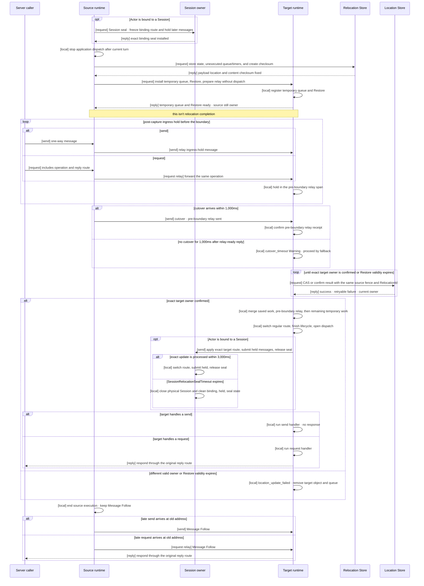

# Complete Actor And Spot Relocation Flow

[Spec index](README.en.md) · [Previous: Request Correlation And Business Flow Identification](27-flow-correlation.en.md) · [Next: Transport Connection Liveness](29-transport-liveness.en.md)

> **What this chapter defines** — the common sequence that changes owner, queue, and a
> bound Session route while messages continue arriving as one Actor or Spot moves from a
> source node to a target node.

## 1. Result Visible To The Application

This document defines the common contract from the start of Actor or Spot relocation
until message processing resumes on the target. Host `Relocate`, cross-node Actor Join,
and User Spot authority transfer have different start conditions and callbacks, but use
the same owner-switch and message-handling sequence here.
[Complete Host relocation flow](30-host-relocation-flow.en.md) defines how a Host operation applies
this unit flow to multiple Actors and Spots and the source-side completion condition for returning
`Relocated`.

The node currently processing an Actor or Spot is called its
[owner](01-glossary.en.md#owner). On successful relocation, the Location Store owner
changes once from source to target, and the target continues under the same object ID and
`ObjectGeneration`. The application doesn't manage target node, Store version, relay
connection, or cutover control message directly.

This contract covers planned graceful relocation. It doesn't automatically resume an
in-progress relocation on another runtime after the source or target process terminates.
[Failure Handling And Failover Scope](31-failure-failover-policy.en.md) defines the full
failure and automatic-reselection boundary.

## 2. Responsibility Of Each Participant

| Participant | Responsibility |
|---|---|
| Application | Requests host relocation or registers an Actor Join. Provides a relocation adapter for the object kind when application state must be preserved. |
| Source runtime | Finishes the current application turn and stops new dispatch. Stores existing work and keeps relaying messages arriving at the old address to the target. Doesn't change Location Store owner. |
| Target runtime | Prepares the temporary queue first, then creates and restores the object. After receiving cutover or waiting 1,000ms from the relay-ready reply, runs the Location Store CAS and opens the target queue only on success. For a bound Actor, then tells the Session owner to apply the target route and release the seal. |
| Session owner | Keeps the bound Actor's physical Session. Seals that binding before relocation, changes its route after target cutover, then releases the seal. Doesn't select the target or change the Location Store. |
| Location Store | Stores current owner, object generation, and membership. Applies all requested target values only when expected source values still match. |
| Relocation Store | Holds application state, not-yet-executed existing work, and timer information until the target restores them. Doesn't decide owner. |
| Transport | Validates authenticated peer, node run generation, and frame shape. Preserves the order of relay and cutover boundary sent on the same TCP connection. |

One participant doesn't repeat another participant's decision. Transport peer
validation, the target's Location Store CAS, and the Session owner's current-binding
validation are different responsibilities.

## 3. What Moves As One Unit

One independently movable Actor or Spot bundle is called a
[relocation unit](01-glossary.en.md#relocation-unit).

| Target | Relocation unit |
|---|---|
| Actor belonging to an Entry Spot | One Actor |
| `PerActor` User Spot | One Spot-level authority and each member Actor separately |
| `SpotWide` User Spot | The User Spot and every member Actor at the cutover point |
| Instance Spot | One Instance Spot |

An Entry Spot instance belongs to node lifecycle and doesn't move. An Entry Spot Actor
moves into an Entry Spot already present on the target node. A `PerActor` User Spot may
change Spot authority first; each member Actor then moves through the same common flow.
A `SpotWide` User Spot changes the Spot and member Actor owners in one conditional
operation.

Relocation isn't object deletion and recreation, so `ObjectGeneration` is preserved.
`AuthorityOwnerGeneration` distinguishes owner changes. A non-zero relocation identity
made by the runtime distinguishes control messages belonging to the same move. The
application neither creates nor interprets this identity.

## 4. Normal Processing Order

### 4.1 Prepare The Target Before Stopping The Source

The framework first confirms that the target node supports the object kind and
application version. If no target is usable, source application dispatch isn't blocked
and relocation doesn't start.

If the Actor is bound to a Session, the Session owner seals that binding before source
application dispatch stops. Requests and pushes arriving from that Session after the
seal are held by the Session owner. Other Actors bound to the same Session aren't
affected.

### 4.2 Stop Source Execution, Not Message Reception

The source finishes the running handler and timer callback, then starts no new
application turn. It stores already-accepted but not-yet-executed work, timer
information, and application state in the Relocation Store.

Once storage is confirmed, the saved queue prefix and timers have one handoff source of
truth: the Relocation Store payload. The source doesn't put that prefix on the relay
lane again. An explicit failure before the relay-ready reply reaches its accepted state
also restores source from that payload in the original queue order.

The source doesn't wait for its mailbox to become empty because messages can keep
arriving on the mailbox or previous route. After sending Restore, it keeps placing new
messages in the source ingress hold until the target reports that relay reception is
ready. Transport reception continues while target preparation is pending.

### 4.3 Restore The Target Without Running It

The target registers a temporary queue for the relocation target before looking up the
real application instance. It then runs the factory and restores application state,
existing queue work, and timers. A message arriving directly at the target during
Restore enters the temporary queue and isn't delivered to an application handler.
Restored queue work and timers remain in a dispatch-closed saved-work span and aren't
mixed with source relay.

The temporary queue and saved-work span form an ordered durable backlog before dispatch
opens. An ordinary Restore, relay, or direct-ingress record in this span still acquires
the Application Job Queue's shared reserved permit before receive. The target returns
that reservation immediately after a finite handoff of the record and payload-lifetime
retained-byte ownership into the backlog. A backlog item that isn't runnable yet neither
keeps a queued-job permit nor starts an application handler.

Once the temporary queue and Restore are ready, the target reports **ready to receive
relay** to the source. This isn't relocation completion. Location Store owner is still
the source and the target doesn't run an application handler. The target doesn't send
this reply until target-side retained-byte ownership exists for every staged payload.

The Restore request does more than ask the target to restore state. It asks the target
to **install the temporary queue first, restore saved state, existing queue work, and
timers, and finish relay preparation without opening application dispatch**. Its
`relay reception ready` reply confirms only that preparation. It doesn't confirm an
owner change or an open queue.

### 4.4 Ordered Relay And One-Way Cutover

After the target's relay-ready reply, the source relays only messages accepted by the
post-capture ingress hold on the same TCP connection. It doesn't relay saved queue work
or timers again because the target already restored them from the Relocation Store. At
the serialized relay point, it inserts a one-way
cutover control as `[send]` after every message accepted so far. Cutover tells the target
that **all pre-boundary relay was sent, so it may run the Location Store owner CAS, merge
queues, and open application dispatch**. The target sends no cutover reply. Messages
accepted during this work enter the post-boundary span, so cutover doesn't wait for
mailbox drain.

The relay-ready reply reaching its accepted state is the irreversible boundary after
which source restoration is forbidden. The source then submits cutover once as
`[send]`. It retains its queued-job permit and retained-byte owner for the source payload
until that submit reaches a terminal result, then permanently closes source dispatch
and releases both owners exactly once regardless of success or failure. A target
completion reply is not added as a condition for this cleanup. Only an explicit failure
before relay-ready preserves source ownership and removes the target staged owner by
abort cleanup. A cutover-submit failure after relay-ready doesn't restore source; the
target proceeds through the existing 1,000ms fallback.

Receiving cutover means the ingress-hold relay preceding its boundary on that
connection have all arrived. The target starts CAS and queue opening immediately.

The target waits 1,000ms for cutover from the time it sends the relay-ready reply. If
cutover doesn't arrive, it records a `cutover_timeout` Warning and proceeds with CAS and
queue opening. A cutover arriving after that fallback, or a duplicate cutover, changes no
state and records only a `late_cutover` Warning.

The source can still receive a late message at the old address after this boundary.
Before owner change it relays that message to the temporary queue; after owner change it
uses Message Follow.

### 4.5 Only The Prepared Target Changes The Location Store

The target runs the Location Store CAS only after all these conditions hold:

- Factory and Restore completed.
- The temporary queue is registered.
- Cutover was received, or 1,000ms elapsed after the relay-ready reply.
- Current owner, `ObjectGeneration`, owner generation, and membership still match the
  source values first read.

The conditional change that records new values only while the original values still
match is called [CAS](01-glossary.en.md#compare-and-set). In one CAS, the target changes
every required owner and membership value. If any condition differs, no value changes
and the target queue doesn't open.

If the Store returns a retryable error or an indeterminate response, the target retries
with the same expected source fence and `RelocationId`. This doesn't add another timeout:
the retry deadline is the absolute validity deadline already carried by the relocation
payload and Restore operation. A retry neither restarts nor extends it. After a missing
response, the target first reads the Store to
determine whether the exact target owner was already recorded.

If target ownership isn't confirmed before Restore validity expires, relocation ends in
failure. The target records a `location_update_failed` Error and removes the prepared
Actor or Spot instance, temporary queue, and relocation state. It doesn't open the target
queue or send a Session route update. A late Store response for the terminal
`RelocationId` cannot reactivate the object. A different valid owner or generation ends
the stale relocation immediately rather than waiting for the deadline.

For an Actor relocation unit, target removes only the prepared target Actor. For a Spot
relocation unit, it removes the prepared target Spot scope and every staging Actor in
that unit. Source application execution doesn't reopen after the relay-ready reply
reaches its accepted state, and Message Follow ends after its defined duration.

Neither the source nor the Session owner changes the Location Store on the target's
behalf. If the target isn't prepared, no CAS occurs.

### 4.6 Open The Target Queue Progressively With Existing Work First

After CAS succeeds, the target fixes an ordered durable backlog in this order:

1. Work and timers already accepted by the source queue before relocation.
2. Work the source relayed before the cutover boundary.
3. Work accepted into the temporary queue afterward.

It then switches the temporary route to the regular dispatch route and finishes required
lifecycle callbacks. Once application dispatch is runnable, it acquires one shared
queued-job permit in order for each backlog application-handler turn and places that turn
on the live execution queue. Actual handler start returns the permit so the next item can
progress. The target doesn't reserve permits for the whole backlog first, and this order
continues when the target limit is smaller than the number of backlog items. An item
waiting for a permit remains owned by the backlog's retained-byte owner. A timer keeps its
original timer lifecycle and follows the relevant ingress rule when its callback turn
becomes runnable.

The target sends no separate completion reply after owner change, queue merge, and
application dispatch opening. For a bound Actor, the target runtime sends a one-way
control telling the Session owner to apply the target binding route, submit held
messages, and release the seal.

### 4.7 Target Session Route Update And Seal Timeout

The source waits for no target completion reply after cutover submit reaches a terminal
success or failure result. It ends source application execution and forwards old-address
messages through Message Follow. The same cleanup applies when the target uses the
cutover timeout fallback.

For a bound Actor, after CAS and target queue opening, the target runtime sends the
Session owner a one-way route update. The Session owner validates the exact Session and
binding, changes the binding route and current `ActorRef` location snapshot to target,
submits messages held during the seal, and releases the seal.

The Session owner applies `SessionRelocationSealTimeout` from seal installation. Its
default is 3,000ms and server configuration can change it. If no exact target route
update arrives in time, it closes the physical Session connection and cleans that
Session's bindings, held messages, and seal state. Timeout and route update run in the
same serialized Session-owner span; the one processed first wins. A route update after
timeout records only a `late_session_route_update` Warning and is ignored.

On an explicit failure before the relay-ready reply reaches its accepted state, after
restoring the source queue the source coordinator sends an exact-seal abort one-way. The
Session owner submits held messages to the source route, releases only the matching seal,
and sends no response. After relay-ready is accepted, this abort isn't sent and the
source route isn't reopened.

An inter-component arrow in a diagram includes its completion kind. `[send]` is one-way
and has no reply. `[request]` always has a corresponding `[reply]`. `[request relay]`
forwards the original request without making a new operation. `[local]` is runtime-local
processing rather than a network message.

Normal relocation requests and replies mean the following.

| Request | Requested operation | What the normal reply confirms |
|---|---|---|
| Session binding seal | Freeze route change for the current binding and hold later Session messages. | The seal was installed on the exact binding. |
| Store relocation payload | Store application state, unexecuted queue work, and timers. | A readable payload location and content checksum are fixed. |
| Restore and prepare relay | Install the temporary queue and restore the payload without opening dispatch. | Target is ready for pre-boundary relay while source remains owner. |

Relocation control sends wait for no reply.

| Send | Meaning | Receiver processing |
|---|---|---|
| Cutover | Reports that all pre-boundary relay was sent on the same connection. | Target starts CAS and queue opening. A late or duplicate control after the 1,000ms fallback records only a Warning. |
| Session route update | Reports that target owner and queue are ready. | Session owner changes the exact binding route, submits held messages, and releases the seal. |
| Session seal abort | Reports that source queue was restored after an explicit failure before relay-ready was accepted. | Session owner submits held messages to the source route and releases only the matching seal. |

This diagram shows both normal cutover and the cutover-timeout fallback. §9 defines an
explicit failure before relay-ready is accepted and a missing Store response.

## 5. Message Order And Completion Meaning

### 5.1 Order That Is Guaranteed

Relay and cutover boundary sent by the source on the same TCP connection arrive in that
order. The target execution queue places saved existing work first, relay before the
cutover boundary next, and later accepted work after that. Once the target queue accepts
work, existing Actor or Spot serialization rules apply.

There's no global ordering guarantee between messages arriving over different TCP
connections. For example, the relative arrival order of a message passing through
Message Follow and a message sent directly to the new address is unspecified.

### 5.2 `send` And `request`

| Kind | Values retained during relay | Result awaited by caller |
|---|---|---|
| `send` | Target identity and payload | Confirms only the transport submit result. There is no target application response. |
| `request` | Operation identity, correlation, reply route, payload, and deadline | Waits for the target response or existing request timeout. |

Relocation adds no application ACK to `send`. It doesn't turn a `request` into a new
operation or hidden-retry it against another target. Both kinds use the same queue order,
without a per-message ACK, numeric high-water, or durable delivery journal.

When a diagram or contract test marks `[request]`, it also shows the corresponding
`[reply]` on the normal path. A timeout or failure reply is a failure result of that same
request, not a new request.

### 5.3 No Relocation-Specific Capacity Limit

Relocation adds no correctness cap on concurrent units, participant count, relay-queue
records, or in-flight bytes. Limits that also apply outside relocation — runtime memory,
negotiated frame size, Location Store record/page size, and Relocation Store payload
limits — still apply.

If a resource isn't immediately ready, the runtime waits before blocking source
dispatch. It doesn't fail an already-started relocation because a
relocation-specific capacity was reached.

The application job queue's shared permit capacity isn't a relocation-specific capacity. Ordinary target
staging ingress uses a shared reservation before receive and returns it after durable
handoff; only runnable handler turns after CAS and lifecycle completion hold live
queued-job permits. An ordered backlog larger than the target live-job limit therefore
executes progressively without failure or an all-at-once reservation. Backlog payload
retained-byte ownership continues until the last item transfers to ordinary terminal
ownership or is cleaned up.

## 6. Location Store Transition Contract

The Location Store CAS is the boundary that prevents source and target from both being
owner. The target supplies expected source owner/generation and requests its own node and
new owner generation as new values.

| CAS result | Handling |
|---|---|
| Change succeeds | The target is owner. It opens the target queue and doesn't roll back to the source. |
| Condition differs | No value changes. Store keeps its current owner, and target removes the object and queue. Source dispatch doesn't reopen after relay-ready is accepted. |
| Store returns a retryable failure | The target doesn't execute its queue and retries the same CAS until Restore validity expires. |
| Target receives no CAS response | It doesn't guess. It re-reads with the same key and first-read version to check exact target ownership, then retries until Restore validity expires if needed. |
| A different valid owner or generation is confirmed | Ends the stale relocation immediately and removes the prepared target object and queue. |
| Owner change isn't confirmed before Restore validity expires | Records `location_update_failed`, removes the prepared Actor or Spot, queue, and relocation state, and doesn't update the Session route. |

Cutover and Session route update have no completion reply. Source and Session owner don't
write the Location Store on target's behalf.

## 7. Bound Session Transition Contract

The Session doesn't control the whole Actor relocation. The Session owner controls only
the physical Session and binding route.

It validates only these values:

- Current physical Session identity and SessionRid
- Current binding generation
- ActorId and `ObjectGeneration` referenced by the binding
- Identity distinguishing whether seal and route change belong to the same relocation

The Session owner doesn't re-read the Location Store or Actor authority mirror. Target
authority was already decided by the target's Location Store CAS. Transport already
validated peer and node run generation.

After CAS and queue opening, target runtime sends the Session route update one-way. The
Session owner applies it once to the exact binding and sends no response. A duplicate
update doesn't mutate state again. If `SessionRelocationSealTimeout` expires without an
exact update, it closes the physical Session and cleans Session state. Detailed binding
API and failure results are defined by
[Session Actor Dispatch](20-session-actor-dispatch.en.md#5-actor-relocation-route-barrier).

## 8. Differences By Actor And Spot Kind

The common owner transition and queue order remain the same; only prepared state and
callbacks differ.

| Target | Additional values prepared or changed | Callback |
|---|---|---|
| Cross-node Actor Join | Changes Actor owner and source/target Spot membership in the same CAS. | Proceeds according to target User Spot admission, then runs Join lifecycle callbacks after commit. |
| Entry Spot Actor host relocation | Changes Actor owner and target Entry Spot membership. | Since this isn't an application-requested Join, membership callbacks aren't called. |
| `PerActor` User Spot authority | Changes the owner handling the Spot-level queue. Member Actors move as separate units. | Spot authority transition itself doesn't call a member Actor callback. |
| `SpotWide` User Spot | Changes Spot and cutover-time member Actor owner/membership in one conditional batch. | With `ApplicationSignaled`, runs relocation-ready completion before opening the target queue. |
| Instance Spot | Moves Spot owner, state, queue, and timers. Has no Actor or Session stage. | Opens the queue after target Restore and applies `OnClosing(RelocationOut)` to the source. |

Target selection, membership callbacks, and completion payload of each API are defined
by [Spot And Actor Membership](15-spot-actor.en.md). Host operation mode and final result
are defined by [Complete Host Relocation Flow](30-host-relocation-flow.en.md).

## 9. Timeout, Failure, And Cancellation

| Timing | Owner and queue retained | Result and follow-up |
|---|---|---|
| Target selection or pre-preparation failure | Source | Doesn't block source dispatch and fails the operation. |
| Explicit failure after Session seal but before relay-ready is accepted | Source | Doesn't execute the target temporary queue. Restores source queue and matching Session seal. |
| Target CAS condition differs after relay-ready | Owner last confirmed in Store | Target removes the object and queue and sends no Session update. Source dispatch doesn't reopen. |
| Target receives no CAS response | Owner confirmed by re-reading the Store | Target reads and retries until Restore validity expires. It doesn't open its queue before confirming target ownership. |
| Location Store retry fails until Restore validity expires | Last owner confirmed in the Store | Records `location_update_failed`, removes the prepared target Actor or Spot, queue, and relocation state, and sends no Session update. |
| Cutover doesn't arrive for 1,000ms after relay-ready reply | Target | Target records a Warning and proceeds with CAS and queue opening. A late cutover is ignored. This fallback doesn't guarantee order between late relay and a new direct target message. |
| Target process terminates after successful CAS | Target authority remains, but object is unavailable | Doesn't roll back to source or automatically resume on another target. |
| No route update arrives within `SessionRelocationSealTimeout` | Target owner, Session connection closed | Session owner closes the physical connection and cleans bindings, held messages, and seal. A late update is ignored with a Warning. |
| Caller cancellation | Shared relocation continues under its current phase rule | Ends only that waiter. A safe abort starts only on an explicit failure before relay-ready is accepted; source isn't restored afterward. |
| Source shutdown races relocation | The operation that sealed first | After owner change, relocation performs only Message Follow cleanup. If shutdown sealed first, no new relocation starts. |

Before relay-ready is accepted, an explicit failure can restore source. After
relay-ready is accepted, source dispatch doesn't reopen regardless of cutover-submit
success or failure. A later target-CAS failure removes prepared target state, while the
Session cleans under its own timeout.

The 1,000ms cutover fallback isn't a loss-recovery protocol replacing TCP retransmission.
Without cutover, target can't confirm every pre-boundary relay arrived. This path favors
relocation progress and doesn't guarantee order between late relay and a new direct
target message.

When Store failure continues until Restore validity expires, the Session may close under
its independent seal timeout. After Store recovery, a new Session connection doesn't
restore the previous binding; it runs normal location validation and Actor/Spot creation
or recovery again. An expired owner lease or terminal relocation state isn't reused as
authority for the new connection.

## 10. Message Follow And Cleanup

A sender can briefly use the old address after owner change. The previous owner path
that forwards such a message to the current owner is called
[Message Follow](01-glossary.en.md#message-follow).

Message Follow preserves original operation identity, `ObjectGeneration`, payload,
deadline, and reply route. It doesn't re-read the Store or run an application handler on
the source. Once `MessageFollowDuration` ends, the old route is removed, and a request
arriving there ends with `Unavailable`.

A late cutover or Session route update doesn't extend Message Follow
indefinitely. Conversely, applying the Session route first doesn't immediately discard
server messages already sent to the old address.

The source cleans up its instance, temporary state, and Relocation Store reference except
for the route needed by Message Follow. The target keeps owner and application dispatch.
A cleanup failure isn't a condition for changing owner back to source.

## 11. Guarantees And Non-Guarantees

| Guarantee | Scope |
|---|---|
| Owner isn't simultaneously source and target. | Before target-only Location Store CAS succeeds, source is owner; afterward, target is owner. |
| Target doesn't execute a message before preparation. | Factory, Restore, and temporary queue must be ready; then cutover receipt or the 1,000ms fallback and successful CAS precede dispatch opening. |
| Relocation backlog doesn't bypass the live-job limit. | Ordinary staging receive uses a shared reservation and returns it after durable handoff; runnable post-CAS turns acquire live permits in order. |
| Normal cutover preserves order on one relay connection. | Cutover arrives after pre-boundary relay on the same TCP connection. |
| A bound Session's physical connection is conditionally kept. | An exact route update within `SessionRelocationSealTimeout` changes only the route. Timeout closes the connection. |
| Global order across connections isn't guaranteed. | Relative order of Message Follow relay and direct target message is unspecified. |
| Exactly-once across process crash isn't guaranteed. | Application callbacks or external side effects can run more than once even during same-process retry. |
| No cutover or Session-update ACK is awaited. | Both controls are one-way. Cutover has a 1,000ms fallback; Session seal has a configurable 3,000ms default timeout. |

## 12. Implementation And Contract-Test Verification Requirements

- Actor, `PerActor`/`SpotWide` User Spot, and Instance Spot use the same target-only CAS boundary.
- Source keeps relaying old-address messages to target without waiting for an empty queue.
- Source sends no ingress-hold relay before the target reports relay reception ready.
- Source relay never resends the saved queue prefix and timers owned by the Relocation Store.
- Relay-ready is the only reply; cutover and Session route update are one-way controls.
- Target records no relocation Location Store record, including `Prepared`, before preparing the temporary queue and Restore.
- Target neither changes Location Store owner/membership/authority nor opens application dispatch before receiving cutover or waiting 1,000ms after relay-ready. A post-Restore `Prepared` record that retains source ownership is not such a change.
- Source and Session owner don't change Location Store owner.
- On CAS conflict, target doesn't run a queued message or one-way handler.
- A retryable Store error or indeterminate response retries the same CAS until Restore
  validity expires and converges to success when exact target ownership is already stored.
- If owner transition isn't confirmed before Restore validity expires, target removes
  the prepared Actor or Spot and queue and sends no Session route update.
- A late Store response for a terminal `RelocationId` doesn't reactivate an object or queue.
- Saved existing work enters the target queue before relay preceding the cutover boundary.
- A target backlog larger than the live-job limit progressively runs ordered turns without reserving every permit first.
- Target retained-byte ownership exists before relay-ready. Source permits and byte ownership remain until the post-acceptance cutover submit reaches a terminal result, and each owner cleans exactly once regardless of submit success or failure.
- `send` is handled without an application response, while `request` retains operation identity, reply route, and deadline.
- Relocation requires no numeric high-water, per-message ACK journal, or separate capacity gate.
- Bound Session messages are held during seal, submitted after target route change, then the seal is released.
- A late or duplicate cutover records only a Warning and doesn't mutate owner or queue again.
- Without a Session route update, the default 3,000ms seal timeout closes the physical Session and cleans state.
- A route update after timeout records only a Warning and doesn't mutate route or seal again.
- Only an explicit failure before relay-ready is accepted restores source. A later failure
  doesn't reopen source dispatch regardless of cutover-submit result and removes prepared target state.
- A bound-Session abort before relay-ready is accepted is one-way, releases only the matching seal, and awaits no application reply.
- Contract tests and operational logs distinguish the absence of global cross-connection order and exactly-once behavior across process crash.
