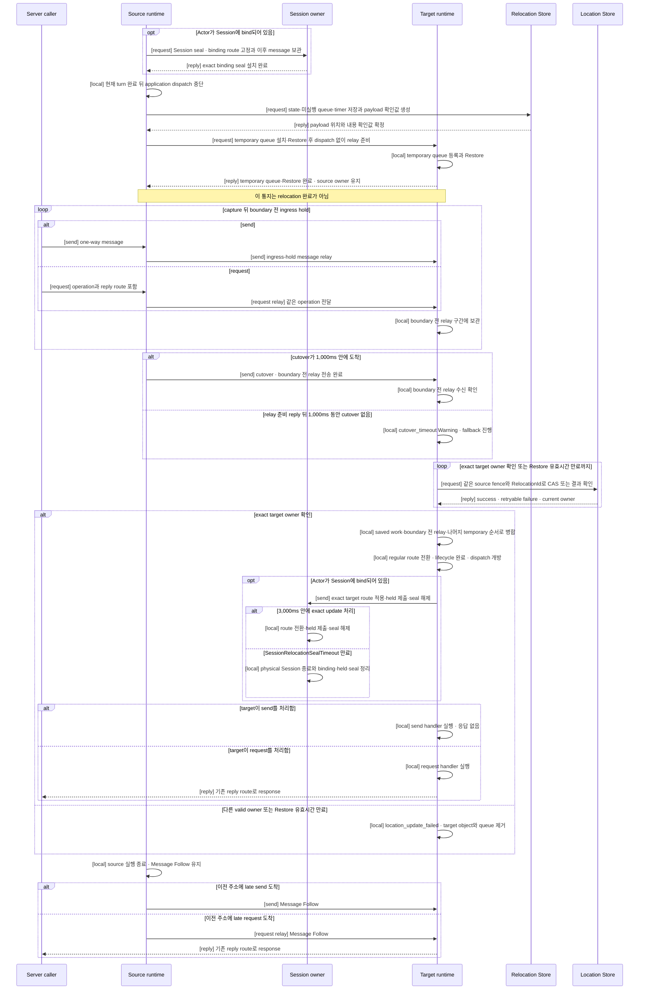

# Actor와 Spot relocation 전체 흐름

[스펙 목차](README.ko.md) · [이전: Request 연결과 업무 흐름 식별](27-flow-correlation.ko.md) · [다음: Transport 연결 상태 확인](29-transport-liveness.ko.md)

> **이 장이 정의하는 것** — Actor나 Spot 하나를 source node에서 target node로 옮길 때
> message를 계속 받아들이면서 owner, queue와 bound Session route를 바꾸는 공통 순서.

## 1. Application에서 보이는 결과

이 문서는 Actor와 Spot relocation이 시작된 뒤 target에서 message 처리를 다시 시작할
때까지의 공통 계약을 정의한다. Host `Relocate`, cross-node Actor Join과 User Spot authority
이전은 시작 조건과 callback은 다르지만 이 문서의 owner 전환과 message 처리 순서를 함께
사용한다.
[Host relocation 전체 흐름](30-host-relocation-flow.ko.md)은 Host operation이 이 unit 흐름을
여러 Actor와 Spot에 적용하고 `Relocated`를 반환하는 source 측 완료 조건을 정의한다.

Actor나 Spot을 현재 처리하는 node를
[owner](01-glossary.ko.md#owner)라고 한다. Relocation이 성공하면 Location Store가 가리키는
owner가 source에서 target으로 한 번 바뀌고, target은 같은 object ID와
`ObjectGeneration`으로 처리를 계속한다. Application은 target node, Store version, relay
connection이나 전환 제어 message를 직접 관리하지 않는다.

이 계약은 계획된 graceful relocation을 다룬다. Source 또는 target process가 종료된 뒤 다른
runtime이 진행 중인 relocation을 자동으로 이어받는 기능은 제공하지 않는다. 장애와 자동
재선택의 전체 범위는
[장애 대응과 failover 범위](31-failure-failover-policy.ko.md)가 정의한다.

## 2. 각 주체의 책임

| 주체 | 책임 |
|---|---|
| Application | Host relocation을 요청하거나 Actor Join을 등록한다. State 보존이 필요하면 object 종류에 맞는 relocation adapter를 제공한다. |
| Source runtime | 현재 application turn을 끝내고 새 dispatch를 중단한다. 기존 작업을 저장하고 이전 주소로 계속 도착하는 message를 target에 relay한다. Location Store owner는 변경하지 않는다. |
| Target runtime | Temporary queue를 먼저 준비하고 object를 생성·복원한다. Cutover를 받거나 relay 준비 reply 뒤 1,000ms가 지나면 Location Store CAS를 실행하고, 성공한 경우에만 target queue를 연다. Bound Actor라면 그 뒤 Session owner에 target route 적용과 seal 해제를 알린다. |
| Session owner | Bound Actor의 physical Session을 유지한다. Relocation 전에 해당 binding을 seal하고, target 전환 뒤 route를 바꾸고 seal을 해제한다. Target을 선택하거나 Location Store를 변경하지 않는다. |
| Location Store | 현재 owner, object generation과 membership을 보관한다. 예상한 source 값이 그대로일 때만 target이 요청한 값을 한 번에 반영한다. |
| Relocation Store | Application state, 실행하지 않은 기존 작업과 timer 정보를 target이 복원할 때까지 보관한다. Owner를 결정하지 않는다. |
| Transport | Authenticated peer, node 실행 세대와 frame 형식을 확인한다. 같은 TCP connection으로 보낸 relay와 전환 경계의 순서를 유지한다. |

한 주체가 다른 주체의 결정을 반복해서 검증하지 않는다. Transport의 peer 검증, target의
Location Store CAS와 Session owner의 current binding 검증은 서로 다른 책임이다.

## 3. 무엇을 한 번에 옮기는가

Framework가 독립적으로 옮기는 Actor 하나 또는 Spot 묶음을
[relocation unit](01-glossary.ko.md#relocation-unit)이라고 한다.

| 대상 | Relocation unit |
|---|---|
| Entry Spot에 속한 Actor | Actor 하나 |
| `PerActor` User Spot | Spot-level authority 하나와 member Actor 각각 |
| `SpotWide` User Spot | User Spot과 전환 시점의 member Actor 전체 |
| Instance Spot | Instance Spot 하나 |

Entry Spot instance 자체는 node lifecycle에 속하므로 옮기지 않는다. Entry Spot Actor는 target
node에 이미 존재하는 Entry Spot으로 이동한다. `PerActor` User Spot은 Spot authority를 먼저
바꿀 수 있으며, member Actor는 각각 같은 공통 흐름으로 이동한다. `SpotWide` User Spot은
Spot과 member Actor owner를 한 번의 조건부 변경으로 함께 바꾼다.

Relocation은 object를 삭제하고 다시 만드는 작업이 아니므로 `ObjectGeneration`을 유지한다.
Owner가 바뀐 순서는 `AuthorityOwnerGeneration`으로 구분한다. 여러 control message가 같은
이동에 속하는지는 runtime이 만든 0이 아닌 relocation identity로 구분한다. Application은 이
identity를 만들거나 해석하지 않는다.

## 4. 정상 처리 순서

### 4.1 Source를 멈추기 전에 target을 준비한다

Framework는 target node가 object 종류와 application version을 지원하는지 먼저 확인한다.
Target을 사용할 수 없으면 source application dispatch를 막지 않고 relocation을 시작하지
않는다.

Actor가 Session에 bind되어 있으면 source application dispatch를 중단하기 전에 Session owner가
그 binding을 seal한다. Seal 뒤 Session에서 들어온 request와 push는 Session owner가 보관한다.
같은 Session에 bind된 다른 Actor는 영향을 받지 않는다.

### 4.2 Source는 실행을 멈추지만 message 수신은 멈추지 않는다

Source는 현재 실행 중인 handler와 timer callback을 끝낸 뒤 새 application turn을 시작하지
않는다. 그 전에 queue가 수락했지만 아직 실행하지 않은 작업, timer 정보와 application state를
Relocation Store에 저장한다.

저장이 확정된 기존 queue prefix와 timer는 Relocation Store payload가 유일한 handoff 원본이다.
Source는 이 prefix를 relay lane에 다시 넣지 않는다. Relay 수신 준비 reply가 accepted 상태가 되기
전 명시적인 실패에서 source를 복원할 때도 저장한 payload를 원래 queue 순서로 되돌린다.

Source mailbox나 이전 route로 새 message가 계속 도착할 수 있으므로 queue가 비기를 기다리지
않는다. Restore 요청을 보낸 뒤 target이 relay 수신 준비를 알릴 때까지 새 message를 source
ingress hold에 계속 넣는다. Target 준비를 기다리는 동안에도 transport 수신은 멈추지 않는다.

### 4.3 Target은 실행하지 않은 상태로 복원한다

Target은 실제 application instance를 찾기 전에 relocation 대상의 temporary queue를 등록한다.
그다음 factory를 실행하고 application state, 기존 queue와 timer를 복원한다. Restore 중 target에
직접 도착한 message는 temporary queue에 넣고 application handler에는 전달하지 않는다.
복원한 기존 queue와 timer는 dispatch가 닫힌 saved-work 구간에 유지하며 source relay와 섞지
않는다.

Temporary queue와 saved-work 구간은 dispatch가 열리기 전의 ordered durable backlog다. 이 구간의
ordinary Restore·relay·direct-ingress record도 Application Job Queue의 shared reserved permit을 얻은
뒤 receive한다. Target은 record와 payload lifetime을 덮는 retained-byte ownership을 backlog에 유한하게
handoff한 직후 reservation을 반환한다. 아직 runnable하지 않은 backlog item이 queued-job permit을 계속
점유하거나 application handler를 시작해서는 안 된다.

Temporary queue와 Restore가 준비되면 target은 source에 **relay 수신 준비 완료**를 알린다.
이 통지는 relocation 완료가 아니다. Location Store owner는 아직 source이며 target은
application handler를 실행하지 않는다. Target은 staged payload마다 target-side retained-byte owner를
확정하기 전에는 이 reply를 보내지 않는다.

여기서 Restore request는 단순히 state 복원만 요청하지 않는다. Source는 target에
**temporary queue를 먼저 설치하고, 저장한 state·기존 queue·timer를 복원한 뒤, application
dispatch를 열지 않은 상태에서 relay를 받을 준비를 끝내라**고 요청한다. 이에 대한
`relay 수신 준비 완료` reply는 이 준비가 끝났다는 뜻이며 owner 변경이나 queue 개방을
뜻하지 않는다.

### 4.4 Ordered relay와 one-way cutover

Source는 target의 relay 수신 준비 reply를 받은 뒤, capture 뒤 ingress hold가 수락한 message만
같은 TCP connection으로 relay한다. 저장한 기존 queue와 timer는 target이 Relocation Store에서
이미 복원했으므로 다시 relay하지 않는다. Relay를 직렬화하는 지점에서 현재까지 수락한 message 뒤에
one-way cutover control을 `[send]`로 넣는다. Cutover는 target에 **boundary보다 앞선 relay를
모두 보냈으므로 Location Store owner CAS, queue 병합과 application dispatch 개방을 진행할 수
있다**고 알린다. Target은 cutover reply를 보내지 않는다. 이 control을 보내는 동안 새 message가
계속 도착해도 boundary 뒤 구간에 넣으므로 cutover가 mailbox drain을 기다리지 않는다.

Relay 수신 준비 reply가 accepted 상태가 된 시점은 source 복구가 금지되는 비가역 경계다. Source는
그 뒤 cutover `[send]`를 한 번만 submit한다. Source queued-job permit과 source payload의 retained-byte
owner는 이 submit이 terminal result에 도달할 때까지 유지하고, 성공과 실패 어느 쪽이든 source
dispatch를 영구 종료하면서 정확히 한 번 정리한다. Target completion reply를 이 정리 조건으로
추가하지 않는다. Relay 수신 준비 reply 전 명시적인 failure에서만 source owner를 유지하고 target
staged owner를 abort cleanup으로 정리한다. Reply가 accepted 상태가 된 뒤의 cutover submit 실패는
source를 복원하지 않으며 target은 기존 1,000ms fallback으로 진행한다.

Cutover가 target에 도착하면 같은 connection에서 boundary보다 앞서 보낸 ingress-hold relay가
모두 도착한 것이다. Target은 즉시 CAS와 queue 개방을 시작한다.

Target은 relay 수신 준비 reply를 보낸 시점부터 1,000ms 동안 cutover를 기다린다. 이 시간이
끝나도 cutover가 도착하지 않으면 `cutover_timeout` Warning을 기록하고 CAS와 queue 개방을
진행한다. Timeout 뒤 도착한 cutover와 이미 처리한 duplicate cutover는 state를 다시 바꾸지
않으며 `late_cutover` Warning만 기록한다.

Source는 이 경계 뒤에도 이전 주소로 늦게 도착하는 message를 받을 수 있다. Owner 변경 전에는
temporary queue로 relay하고, owner 변경 뒤에는 Message Follow 경로로 target에 전달한다.

### 4.5 준비를 끝낸 target만 Location Store를 변경한다

Target은 다음 조건을 모두 만족한 뒤에만 Location Store CAS를 실행한다.

- Factory와 Restore를 완료했다.
- Temporary queue가 등록되어 있다.
- Source가 보낸 cutover를 받았거나 relay 수신 준비 reply 뒤 1,000ms가 지났다.
- 현재 owner, `ObjectGeneration`, owner generation과 membership이 처음 확인한 source 값과 같다.

처음 읽은 값이 그대로일 때만 새 값을 기록하는 조건부 변경을
[CAS](01-glossary.ko.md#compare-and-set)라고 한다. Target은 CAS 한 번으로 필요한 owner와
membership을 모두 바꾼다. 조건 하나라도 다르면 아무 값도 변경하지 않고 target queue도 열지
않는다.

Store가 일시적인 오류를 반환하거나 응답이 불확정이면 target은 같은 expected source fence와
`RelocationId`로 retry한다. Retry deadline은 별도 timeout을 만들지 않고 relocation payload와
Restore operation이 가진 absolute deadline을 그대로 사용한다. Retry할 때 deadline을 다시
시작하거나 연장하지 않는다. 응답을 받지 못한 경우에는 Store를 다시 읽어 exact target owner가
이미 기록됐는지 먼저 확인한다.

Restore 유효시간까지 target owner를 확인하지 못하면 relocation은 실패로 끝난다. Target은
`location_update_failed` Error를 기록하고 준비한 Actor 또는 Spot instance, temporary queue와
relocation state를 제거한다. Target queue를 열거나 Session route update를 보내지 않는다. 이미
종료한 `RelocationId`에 대한 늦은 Store 응답은 object를 다시 활성화하지 않는다. Location Store가
다른 valid owner나 generation을 반환하면 deadline을 기다리지 않고 stale relocation으로
종료한다.

Actor relocation unit이면 준비한 target Actor만 제거한다. Spot relocation unit이면 target에
준비한 Spot scope와 그 unit에 포함된 staging Actor를 함께 제거한다. Source application 실행은
relay 수신 준비 reply가 accepted 상태가 된 뒤 다시 열지 않으며 Message Follow도 정해진 기간에
끝난다.

Source와 Session owner는 Location Store를 대신 변경하지 않는다. Target이 준비되지 않았으면
CAS 자체가 일어나지 않는다.

### 4.6 Target은 기존 작업부터 점진적으로 queue를 연다

CAS가 성공하면 target은 다음 순서의 ordered durable backlog를 확정한다.

1. Relocation 전에 source queue가 이미 수락했던 작업과 timer
2. Source가 전환 경계보다 앞에 relay한 작업
3. 그 뒤 temporary queue가 수락한 작업

그다음 temporary route를 기존 dispatch route로 전환하고 필요한 lifecycle callback을 끝낸다. Application
dispatch가 runnable해지면 backlog의 application handler turn마다 shared queued-job permit을 순서대로
하나씩 얻어 live execution queue에 넣는다. Actual handler start가 permit을 반환하면 다음 item이 같은
방식으로 진행한다. Target은 backlog 전체의 permit을 먼저 예약하지 않으며, target limit가 backlog item
수보다 작아도 이 순서로 진행한다. Permit을 기다리는 item은 backlog retained-byte owner가 계속 소유한다.
Timer는 원래 timer lifecycle을 유지하고 callback turn이 runnable할 때 해당 ingress 규칙을 따른다.

Target은 owner 변경, queue 병합과 application dispatch 개방을 끝낸 뒤 source에 별도의 완료
reply를 보내지 않는다. Bound Actor라면 target runtime이 Session owner에 target binding route
적용, held message 제출과 seal 해제를 one-way control로 알린다.

### 4.7 Target의 Session route 적용과 seal timeout

Source는 cutover submit이 성공 또는 실패의 terminal result에 도달한 뒤 target 완료 reply를
기다리지 않는다. Source application 실행을 끝내고 이전 주소로 들어오는 message를 Message
Follow로 전달한다. Target이 cutover timeout으로 진행한 경우에도 같은 정리 규칙을 사용한다.

Bound Actor가 있으면 target runtime은 CAS와 target queue 개방을 끝낸 뒤 Session owner에 one-way
route update를 보낸다. Session owner는 exact Session과 binding을 확인하고 binding route와 current
`ActorRef` location snapshot을 target으로 바꾼다. Seal 중 보관한 Session message를 target route로
제출한 뒤 seal을 해제한다.

Session owner는 seal을 설치한 시점부터 `SessionRelocationSealTimeout`을 적용한다. 기본값은
3,000ms이며 server 설정으로 변경할 수 있다. Exact target route update가 이 시간 안에 도착하지
않으면 physical Session connection을 종료하고 해당 Session의 binding, held message와 seal state를
정리한다. Timeout과 route update는 Session owner의 같은 직렬 실행 구간에서 처리하며 먼저 처리한
결과가 유효하다. Timeout 뒤 도착한 route update는 `late_session_route_update` Warning만 기록하고
무시한다.

Relay 수신 준비 reply가 accepted 상태가 되기 전 명시적인 실패에서 bound Session seal이 있으면
source queue를 복원한 뒤 source coordinator가 exact seal abort를 one-way로 보낸다. Session owner는
held message를 source route에 제출하고 matching seal만 해제하며 response를 보내지 않는다.
Relay 수신 준비 reply가 accepted 상태가 된 뒤에는 이 abort를 보내거나 source route를 다시 열지
않는다.

Diagram의 inter-component 화살표는 message 완료 방식을 함께 표시한다. `[send]`는 one-way라
reply가 없고, `[request]`는 반드시 대응하는 `[reply]`가 있다. `[request relay]`는 original
request를 새 operation으로 만들지 않고 전달한다. `[local]`은 network message가 아닌 runtime
내부 처리다.

정상 경로의 relocation request와 reply 의미는 다음과 같다.

| Request | 요청하는 동작 | 정상 reply가 확정하는 결과 |
|---|---|---|
| Session binding seal | 현재 binding의 route 변경을 막고 이후 Session message를 보관한다. | Exact binding에 seal이 설치됐다. |
| Relocation payload 저장 | Application state, 실행하지 않은 queue와 timer를 저장한다. | 다시 읽을 수 있는 payload 위치와 내용 확인값이 확정됐다. |
| Restore와 relay 준비 | Temporary queue를 설치하고 payload를 복원하되 dispatch는 열지 않는다. | Target이 boundary 전 relay를 받을 준비를 끝냈다. Owner는 아직 source다. |

Relocation control send는 reply를 기다리지 않는다.

| Send | 의미 | 수신 측 처리 |
|---|---|---|
| Cutover | 같은 connection에서 boundary 전 relay를 모두 보냈다고 알린다. | Target은 즉시 CAS와 queue 개방을 시작한다. 1,000ms fallback 뒤의 late·duplicate control은 Warning만 기록한다. |
| Session route update | Target owner와 queue가 준비됐다고 알린다. | Session owner는 exact binding route를 target으로 바꾸고 held message를 제출한 뒤 seal을 해제한다. |
| Session seal abort | Relay 수신 준비 reply가 accepted 상태가 되기 전 실패에서 source queue가 복원됐다고 알린다. | Session owner는 held message를 source route로 제출하고 matching seal만 해제한다. |

이 diagram은 정상 cutover와 cutover timeout fallback을 함께 보여준다. Relay 수신 준비 reply가
accepted 상태가 되기 전 명시적인 실패와 Store 응답을 받지 못한 경우는 §9에서 정의한다.

## 5. Message 순서와 완료 의미

### 5.1 보장하는 순서

Source가 같은 TCP connection으로 보낸 relay와 전환 경계는 target에 같은 순서로 도착한다.
Target execution queue에는 저장한 기존 작업, 전환 경계 전 relay, 그 뒤 수락한 작업 순으로
넣는다. Target queue가 수락한 뒤에는 Actor·Spot의 기존 직렬 실행 규칙을 따른다.

서로 다른 TCP connection에서 도착한 message 사이의 전역 순서는 보장하지 않는다. 예를 들어
이전 주소를 거친 Message Follow와 새 주소로 직접 보낸 message 중 어느 것이 먼저 target에
도착할지는 보장하지 않는다.

### 5.2 `send`와 `request`

| 종류 | Relay할 때 유지하는 값 | Caller가 기다리는 결과 |
|---|---|---|
| `send` | 대상 identity와 payload | Transport submit 결과까지만 확인한다. Target application response는 없다. |
| `request` | Operation identity, correlation, reply route, payload와 deadline | Target response 또는 기존 request timeout을 기다린다. |

Relocation은 `send`에 application ACK를 추가하지 않는다. `request`를 새로운 operation으로
바꾸거나 다른 target에 숨겨서 다시 제출하지 않는다. 두 종류 모두 같은 queue 순서를 사용하며,
message마다 ACK, 숫자 high-water나 durable delivery journal을 추가하지 않는다.

Diagram이나 contract test에서 `[request]`를 표시하면 정상 경로의 대응 `[reply]`도 함께
표시한다. Timeout과 failure reply는 같은 request의 실패 결과이며 새 request가 아니다.

### 5.3 Relocation 전용 capacity 제한을 두지 않는다

Relocation은 동시 unit 수, participant 수, relay queue의 record 수 또는 in-flight byte 수에
별도 correctness 상한을 두지 않는다. Runtime memory, negotiated frame 크기, Location Store
record/page 크기와 Relocation Store payload 제한처럼 relocation 밖에서도 적용되는 제한은
그대로 유지한다.

Resource가 즉시 준비되지 않으면 source dispatch를 막기 전에 기다린다. 이미 시작한 relocation을
relocation 전용 capacity에 도달했다는 이유만으로 실패시키지 않는다.

Application job queue의 shared permit capacity는 relocation 전용 capacity가 아니다. Target의 ordinary staging ingress도
receive 전에 shared reservation을 사용하고 durable handoff 직후 반환하며, CAS와 lifecycle 뒤 runnable
handler turn만 live queued-job permit을 점유한다. 따라서 ordered backlog 크기가 target의 live job limit보다
커도 failure나 all-at-once reservation 없이 점진적으로 실행한다. Backlog payload의 retained-byte ownership은
마지막 item이 ordinary terminal ownership으로 이전되거나 정리될 때까지 유지한다.

## 6. Location Store 전환 계약

Location Store CAS는 owner가 동시에 source와 target 두 곳에 존재하지 않게 만드는 전환점이다.
Target은 예상한 source owner와 generation을 조건으로 주고, 자기 node와 새 owner generation을
새 값으로 요청한다.

| CAS 결과 | 처리 |
|---|---|
| 변경 성공 | Target이 owner다. Target queue를 열고 source로 rollback하지 않는다. |
| 조건 불일치 | 아무 값도 변경하지 않는다. Store의 current owner를 유지하고 target object와 queue를 제거한다. Relay-ready reply가 accepted 상태가 된 뒤에는 source dispatch를 다시 열지 않는다. |
| Store가 retry 가능한 실패를 반환 | Target queue를 실행하지 않고 Restore 유효시간까지 같은 CAS를 retry한다. |
| Target이 CAS 응답을 받지 못함 | 성공이나 실패를 추측하지 않는다. 같은 key와 처음 읽은 version으로 Store를 다시 읽어 exact target owner인지 확인하고, 아니면 Restore 유효시간까지 retry한다. |
| 다른 valid owner나 generation이 확인됨 | Stale relocation으로 즉시 종료하고 준비한 target object와 queue를 제거한다. |
| Restore 유효시간까지 owner 변경을 확인하지 못함 | `location_update_failed` Error를 기록한다. 준비한 Actor 또는 Spot, queue와 relocation state를 제거하고 Session route를 갱신하지 않는다. |

Cutover와 Session route update에는 완료 reply가 없다. Source와 Session owner는 Location Store를
대신 쓰지 않는다.

## 7. Bound Session 전환 계약

Session은 Actor relocation 전체를 제어하지 않는다. Session owner가 제어하는 범위는 physical
Session과 binding route뿐이다.

Session owner는 다음 값만 확인한다.

- Current physical Session identity와 SessionRid
- Current binding generation
- Binding이 가리키는 ActorId와 `ObjectGeneration`
- 같은 relocation의 seal과 route 변경인지 구분하는 identity

Session owner는 Location Store나 Actor authority mirror를 다시 읽지 않는다. Target authority는
target의 Location Store CAS가 이미 결정했다. Transport peer와 node 실행 세대는 transport가
이미 확인했다.

Target runtime은 CAS와 queue 개방 뒤 Session route update를 one-way로 보낸다. Session owner는
exact binding에 한 번 적용하고 response를 보내지 않는다. Duplicate update는 state를 다시
바꾸지 않는다. `SessionRelocationSealTimeout`이 끝난 뒤에도 exact update가 없으면 physical
Session을 종료하고 Session state를 정리한다. 자세한 binding API와 실패 결과는
[Session Actor dispatch](20-session-actor-dispatch.ko.md#5-actor-relocation-route-barrier)가
정의한다.

## 8. Actor와 Spot별 차이

공통 owner 전환과 queue 순서는 모두 같고, 준비하는 state와 callback만 다르다.

| 대상 | 추가로 준비하거나 변경하는 값 | Callback |
|---|---|---|
| Cross-node Actor Join | Actor owner와 source·target Spot membership을 같은 CAS에서 바꾼다. | Target User Spot의 admission 결과에 따라 진행하며, commit 뒤 Join lifecycle callback을 실행한다. |
| Entry Spot Actor host relocation | Actor owner와 target Entry Spot membership을 바꾼다. | Application이 요청한 Join이 아니므로 membership callback을 호출하지 않는다. |
| `PerActor` User Spot authority | Spot-level queue를 처리할 owner를 바꾼다. Member Actor는 각자 별도 unit으로 이동한다. | Spot authority 전환 자체는 member Actor callback을 호출하지 않는다. |
| `SpotWide` User Spot | Spot과 전환 시점의 member Actor owner·membership을 조건부 batch 하나로 바꾼다. | `ApplicationSignaled`이면 target queue를 열기 전에 relocation-ready completion callback을 실행한다. |
| Instance Spot | Spot owner와 state·queue·timer를 옮긴다. Actor와 Session 단계는 없다. | Target Restore 뒤 queue를 열고 source에 `OnClosing(RelocationOut)`을 적용한다. |

각 API의 target 선택, membership callback과 completion payload는
[Spot과 Actor membership](15-spot-actor.ko.md), host operation의 mode와 최종 결과는
[Host relocation 전체 흐름](30-host-relocation-flow.ko.md)이 정의한다.

## 9. Timeout, failure와 cancellation

| 발생 시점 | 유지하는 owner와 queue | 결과와 후속 처리 |
|---|---|---|
| Target 선택 또는 준비 전 실패 | Source | Source dispatch를 막지 않고 operation을 실패시킨다. |
| Session seal 뒤, relay 수신 준비 reply가 accepted 상태가 되기 전 명시적인 실패 | Source | Target temporary queue를 실행하지 않는다. Source queue와 matching Session seal을 복원한다. |
| Relay 수신 준비 reply 뒤 target CAS가 조건 불일치로 실패 | Store가 마지막으로 확인한 owner | Target object와 queue를 제거하고 Session update를 보내지 않는다. Source dispatch는 다시 열지 않는다. |
| Target이 CAS 응답을 받지 못함 | Store를 다시 읽어 확인한 owner | Restore 유효시간까지 read/retry한다. Target owner를 확인하기 전에는 queue를 열지 않는다. |
| Location Store retry가 Restore 유효시간까지 실패 | Store에 마지막으로 확인된 owner | `location_update_failed` Error를 기록하고 target의 준비된 Actor 또는 Spot, queue와 relocation state를 제거한다. Session update는 보내지 않는다. |
| Relay 준비 reply 뒤 1,000ms 동안 cutover가 도착하지 않음 | Target | Target은 Warning을 기록하고 CAS와 queue 개방을 진행한다. 늦은 cutover는 무시한다. Timeout 경로에서는 late relay와 새 target message 사이의 순서를 보장하지 않는다. |
| CAS 성공 뒤 target process 종료 | Target authority를 유지하지만 object는 unavailable | Source로 rollback하거나 다른 target에서 자동 재개하지 않는다. |
| `SessionRelocationSealTimeout` 안에 route update가 없음 | Target owner, Session connection 종료 | Session owner는 physical connection을 종료하고 binding, held message와 seal을 정리한다. 늦은 update는 Warning만 기록하고 무시한다. |
| Caller cancellation | Shared relocation은 현재 phase 규칙을 계속 따름 | 해당 waiter만 끝낸다. Relay 수신 준비 reply가 accepted 상태가 되기 전 명시적으로 실패한 경우에만 안전한 취소를 시작하며, 그 뒤에는 source를 복원하지 않는다. |
| Source shutdown과 경쟁 | 먼저 seal한 operation | Relocation이 owner 전환 뒤라면 Message Follow 정리만 수행한다. Shutdown이 먼저면 새 relocation을 시작하지 않는다. |

Relay 수신 준비 reply가 accepted 상태가 되기 전에는 명시적 실패로 source를 복원할 수 있다.
Reply가 accepted 상태가 된 뒤에는 cutover submit의 성공·실패와 관계없이 source dispatch를 다시
열지 않는다. 이후 target CAS가 실패하면 target은 준비한 unit을 제거하고 Session은 자체 timeout으로
정리한다.

1,000ms cutover fallback은 TCP retransmission을 대신하는 유실 복구 protocol이 아니다. Cutover
없이 진행하면 target은 boundary 전 relay가 모두 도착했는지 확인할 수 없다. 이 경로는 relocation
진행을 우선하며 late relay와 새 target message 사이의 순서를 보장하지 않는다.

Store 장애가 Restore 유효시간까지 계속되면 Session은 별도의 seal timeout으로 종료될 수 있다.
Store가 정상화된 뒤 새 Session connection은 이전 binding을 복원하지 않고 일반 location validation과
Actor·Spot 생성 또는 복구 절차를 다시 수행한다. 만료된 owner lease나 terminal relocation state를
새 연결의 authority로 사용하지 않는다.

## 10. Message Follow와 정리

Owner 변경 뒤에도 sender가 잠시 이전 주소를 사용할 수 있다. 이전 owner가 이 message를 현재
owner에게 전달하는 경로를
[Message Follow](01-glossary.ko.md#message-follow)라고 한다.

Message Follow는 original operation identity, `ObjectGeneration`, payload, deadline과 reply route를
유지한다. Store를 다시 읽거나 application handler를 source에서 실행하지 않는다. 정해진
`MessageFollowDuration`이 끝나면 이전 route를 제거하고, 그 뒤 이전 주소로 도착한 request는
`Unavailable`로 끝낸다.

Late cutover나 Session route update가 늦었다는 이유로 Message Follow 기간을 무기한 연장하지
않는다. 반대로 Session route가 먼저 적용됐다는 이유로 이미 이전 주소로 전송된 server message를
즉시 폐기하지 않는다.

Source는 Message Follow에 필요한 route를 제외한 source instance, temporary state와 Relocation
Store reference를 정리한다. Target은 owner와 application dispatch를 유지한다. Cleanup 실패는
target owner를 source로 되돌리는 조건이 아니다.

## 11. 보장하는 것과 보장하지 않는 것

| 보장 | 범위 |
|---|---|
| Owner가 동시에 둘이 되지 않는다. | Target-only Location Store CAS가 성공하기 전에는 source, 성공한 뒤에는 target을 owner로 인정한다. |
| Target은 준비 전에 message를 실행하지 않는다. | Factory, Restore와 temporary queue가 준비되고, cutover 수신 또는 1,000ms fallback 뒤 CAS가 성공해야 dispatch를 연다. |
| Relocation backlog가 live job limit를 우회하지 않는다. | Ordinary staging receive는 shared reservation을 사용해 durable handoff 뒤 반환하고, post-CAS runnable turn은 순서대로 live permit을 얻는다. |
| 정상 cutover에서 같은 relay connection의 순서를 유지한다. | TCP connection 안에서 boundary 전 relay 뒤 cutover가 도착한다. |
| Bound Session의 physical connection을 조건부로 유지한다. | Exact route update가 `SessionRelocationSealTimeout` 안에 도착하면 route만 바꾼다. Timeout이면 connection을 종료한다. |
| 서로 다른 connection의 전역 순서는 보장하지 않는다. | Message Follow relay와 target direct message의 상대 순서는 정의하지 않는다. |
| Process crash 구간의 exactly-once는 보장하지 않는다. | Application callback이나 외부 side effect는 같은 process의 retry에서도 두 번 실행될 수 있다. |
| Cutover나 Session update ACK를 기다리지 않는다. | 두 control은 one-way다. Cutover는 1,000ms fallback, Session seal은 기본 3,000ms timeout으로 끝난다. |

## 12. 구현 및 contract test 검증 요구

- Actor, `PerActor`·`SpotWide` User Spot과 Instance Spot이 같은 target-only CAS 경계를 사용한다.
- Source가 queue가 빌 때까지 기다리지 않고 이전 주소의 message를 target에 계속 relay한다.
- Target의 relay 수신 준비 통지 전에 source가 ingress-hold relay를 보내지 않는다.
- Relocation Store가 소유한 saved queue prefix와 timer를 source relay로 다시 보내지 않는다.
- Relay 수신 준비만 reply로 처리하고 cutover와 Session route update는 one-way로 처리한다.
- Target이 temporary queue와 Restore를 준비하기 전에 `Prepared`를 포함한 relocation Location Store record를 기록하지 않는다.
- Target은 cutover를 받거나 relay 준비 reply 뒤 1,000ms가 지나기 전에 Location Store owner·membership·authority를 변경하거나 application dispatch를 열지 않는다. Restore 뒤 source owner를 유지한 `Prepared` record는 이 변경이 아니다.
- Source와 Session owner가 Location Store owner를 변경하지 않는다.
- CAS conflict에서는 target queue의 message와 one-way handler를 실행하지 않는다.
- Retry 가능한 Store 오류와 불확정 응답은 Restore 유효시간까지 같은 CAS로 retry하며, 이미 exact
  target owner이면 성공으로 수렴한다.
- Restore 유효시간까지 owner 전환을 확인하지 못하면 target의 준비된 Actor 또는 Spot과 queue를
  제거하고 Session route update를 보내지 않는다.
- Terminal `RelocationId`의 늦은 Store 응답이 object나 queue를 다시 활성화하지 않는다.
- 저장한 기존 작업이 전환 경계 전 relay보다 먼저 target queue에 들어간다.
- Target backlog가 live job limit보다 커도 전체 permit을 선예약하지 않고 ordered turn을 점진 실행한다.
- Relay-ready 전 target retained-byte owner가 있고, accepted 상태 뒤 cutover submit이 terminal result에
  도달할 때까지 source permit·byte owner가 유지되며 성공·실패 어느 쪽이든 두 owner가 각각 정확히
  한 번 정리된다.
- `send`는 application response 없이 처리하고, `request`는 operation identity·reply route·deadline을 유지한다.
- Relocation이 numeric high-water, message별 ACK journal이나 별도 capacity gate를 요구하지 않는다.
- Bound Session message가 seal 중 보관되고 target route 변경 뒤 제출된 다음 seal이 해제된다.
- Late·duplicate cutover는 Warning만 기록하고 owner와 queue를 다시 변경하지 않는다.
- Session route update가 기본 3,000ms 안에 없으면 physical Session을 종료하고 state를 정리한다.
- Timeout 뒤 route update는 Warning만 기록하고 route와 seal을 다시 변경하지 않는다.
- Relay-ready reply가 accepted 상태가 되기 전 명시적인 failure만 source를 복원한다. 그 뒤 failure는
  cutover submit 결과와 관계없이 source dispatch를 다시 열지 않고 target 준비 state를 제거한다.
- Relay-ready reply가 accepted 상태가 되기 전 bound Session abort는 one-way이며 matching seal만
  해제하고 적용 reply를 기다리지 않는다.
- 서로 다른 connection 사이의 전역 순서와 process crash 구간의 exactly-once를 보장하지 않는다는
  결과가 contract test와 운영 log에서 구분된다.
