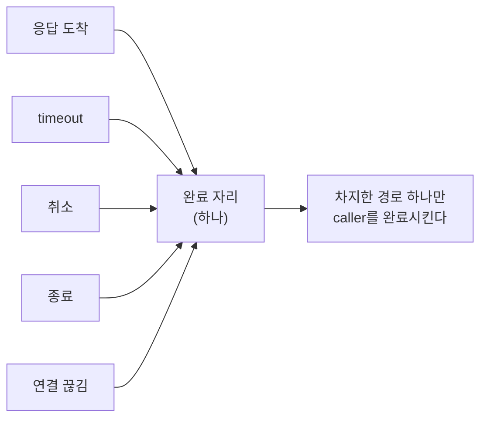
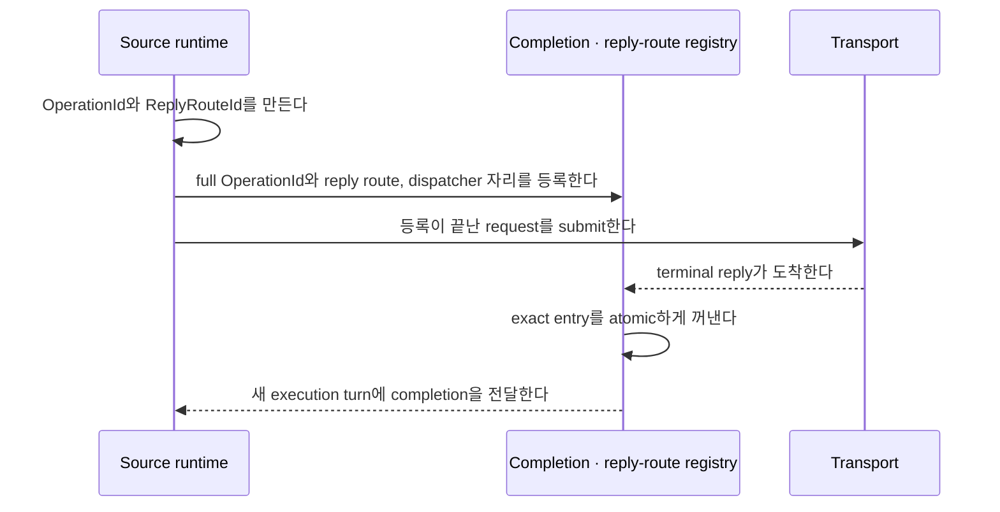

# 43. operation 완료 확정 — 한 번만 확정한다

> **문서 성격 — 공개 규범 스펙이 아닌 내부 설계 문서.** 이 장은 연결된 공개 계약을 만족시키는 구현 구조를 설명한다. Application이 관찰하는 동작을 추가하거나 변경하지 않는다.

[내부 구조 목차](README.ko.md) · [이전: 42. application과 infrastructure 실행 분리](42-internal-progress-isolation.ko.md) · [다음: 44. 이동 중 message 연속성](44-internal-relocation-continuity.ko.md)

> **이 장이 답하는 것** — 응답·timeout·취소·종료·연결 끊김이 동시에 도착할 때 무엇이 caller를 완료시키는가.
>
> **계약 소유** — 오류 kind는 [Framework 오류 모델](32-framework-error-model.ko.md)이,
> 수락 이후 재전송 금지는 [Transport liveness](29-transport-liveness.ko.md)가 소유한다.
> 이 장은 그 계약을 만족시키는 **구조**와, 완료 경쟁에서 나타나는 실패를 다룬다.

응답을 기다리는 호출 하나에 대해 응답·timeout·취소·종료·연결 끊김이 **동시에** 도착할
수 있다. 이 문서는 그중 하나만 caller를 완료시키도록 만드는 구조와, 그 과정에서 응답을
잃지 않는 방법을 다룬다.

## 1. 핵심 결정 — 완료 자리를 먼저 차지한 경로만 이긴다

호출마다 완료 자리를 하나 두고, 여러 경로가 그 자리를 두고 경쟁한다. 차지한 경로만
caller의 대기를 푼다. 진 경로는 아무것도 하지 않는다.

### 완료 권한 확정 방식

**결정 — 진행 중 호출 표에서 항목을 atomic하게 꺼내는 연산을 완료 경쟁 지점으로
사용한다.** 응답, timeout, 취소와 종료 경로가 같은 항목을 꺼내려고 시도한다. 꺼내기에
성공한 경로만 완료 권한을 얻고, 나머지 경로는 이미 완료됐음을 확인하고 끝난다.

이 연산은 완료 권한 확정과 진행 중 호출 정리를 함께 수행한다. 따라서 별도 완료 표시나
두 번째 자리 예약이 필요하지 않다. 모든 완료 경로가 같은 방식을 사용해야 새 경로를
추가해도 경쟁 규칙이 달라지지 않는다.

## 2. 완료 callback의 execution turn

완료를 확정할 때 잡은 잠금 안에서 application callback을 실행하면, callback이 다시
runtime을 호출할 때 같은 잠금을 요구해 교착이 된다. timer 취소와 payload 정리도 그
바깥에서 한다.

잠금을 놓은 직후 같은 호출 stack에서 callback을 바로 실행하는 것만으로는 충분하지 않다.
그렇게 하면 transport의 응답 처리나 timeout 처리가 끝나기 전에 application code가 runtime에
다시 진입할 수 있다. 완료 callback은 process가 공유하는 completion dispatcher에 넣고, 현재
처리가 반환된 뒤 새 execution turn에서 실행한다.

순서는 이렇다 — **완료 권한을 확정한다 → 잠금을 놓는다 → callback을 dispatcher에 넣는다
→ 새 execution turn에서 callback을 실행한다.**

Terminal winner가 진행 중 호출 표의 항목을 꺼낸 뒤 dispatcher admission에 실패하면
application completion을 잃는다. 따라서 operation을 수락할 때 completion dispatcher 자리도
함께 예약한다. 이 예약은 callback이 반환할 때까지 유지한다. 진행 중 operation과 dispatcher에서
대기·실행 중인 callback을 합친 수는 4,096개를 넘지 않으므로 callback queue가 제한 없이
증가하지 않는다.

예약할 자리가 없으면 request를 보내기 전에 `CapacityExceeded`로 거부한다. 한 번 수락한
operation의 completion enqueue에는 거부하거나 버리는 경로가 없다. Dispatcher는 callback마다
thread를 만드는 대신 process가 공유하는 lane을 사용하며, shutdown에서는 이미 수락한 callback을
모두 실행한 뒤 종료한다. 한 callback의 exception은 뒤 callback의 실행을 막지 않는다.

## 3. Operation identity와 reply 경로를 분리한다

Service wire의 request는 서로 다른 두 값을 함께 보존한다. 둘 다 Framework 내부 값이며
application에는 노출하지 않는다.

| 값 | 형식 | 맡는 일 |
|---|---|---|
| `OperationId` | `{ high: u64, low: u64 }` | operation 하나의 terminal deduplication identity다. Relocation과 reply relay를 거쳐도 같은 값을 유지한다 |
| `ReplyRouteId` | non-zero `u64` | terminal reply를 source lifecycle 안의 대기 항목과 연결한다. Operation identity를 대신하지 않는다 |

Terminal 결과가 필요한 operation의 `OperationId`는 두 word가 모두 0일 수 없다. Registry와
durable completion record는 두 word 전체를 보존한다. `low` word만 key로 쓰면 서로 다른
operation을 같은 항목으로 판단할 수 있다. `ReplyRouteId`도 source owner lifecycle 안에서
대기 중인 request 사이에 중복할 수 없지만, 이 값만으로 relocation 이후의 terminal
deduplication을 판단하지 않는다.

보내는 runtime은 `OperationId`와, reply 경로가 필요한 경우 `ReplyRouteId`를 먼저 만든다.
그런 다음 full `OperationId`를 key로 pending completion entry와 dispatcher 자리를
등록하고, `ReplyRouteId`가 가리키는 reply 경로도 확정한다. 그 다음에만 transport에
submit한다. Wire request는 두 값을 각각의 field로 보존하며 한 값을 다른 값의 별칭으로
사용하지 않는다.

이 순서에서는 대상이 같은 process에 있어 즉시 응답해도 등록보다 reply가 먼저 처리되지
않는다. 따라서 먼저 도착한 응답을 위한 별도 보관 map과, 그 map을 pending table과
교차 확인하는 경쟁 처리가 필요하지 않다.

## 4. 수락한 뒤에는 다시 보내지 않는다

전송이 message를 수락한 뒤에는 **대상이 실행했는지 알 수 없다.** 이 상태에서 다른
대상으로 다시 보내면 두 번 실행될 수 있다.

**결정 — 수락 이후에는 runtime이 자동으로 다시 보내지 않는다.** 연결이 끊겨도
마찬가지다([Transport liveness 「5. Ready와 장애 판정」](29-transport-liveness.ko.md#5-ready와-장애-판정)).
Application이 새 호출을 시작할 수는 있으며, 그때 중복 실행 위험은 application이
판단한다.

이 규칙 때문에 "보낸 뒤 실패"와 "보내기 전 실패"를 구분해야 한다.

| 실패 시점 | 다시 보내도 되는가 |
|---|---|
| 전송이 수락하기 전 | 된다. 대상이 받지 않았음이 확실하다 |
| 전송이 수락한 뒤 | **안 된다.** 실행 여부를 알 수 없다 |

## 5. 응답을 기다리지 않는 호출의 완료 지점

응답을 기다리지 않는 호출은 **이 process의 송신 경로가 message를 수락한 시점**에
정상 완료한다. 원격 queue가 받았는지, handler가 실행했는지는 이 결과로 알 수 없다
([Framework API 「12. Spot, Actor와 STREAM owner」](06-framework-api.ko.md#12-spot-actor와-stream-owner)).

"로컬 수락"과 "전송 수락"은 서로 다른 사건이 아니다. 이 제품에서 송신 경로는 곧
socket의 송신 큐이므로 같은 완료 경계를 가리킨다. 문서와 코드 주석에서는 send acceptance
한 표현만 사용한다.

## 6. 실패를 문자열로 분류하지 않는다

완료 경로는 취소·시간 초과·종료를 구분해야 한다. 이 구분이 caller가 받는 결과를
정한다.

**오류 메시지 문자열에 정규식을 걸어** 취소를 판정하면 메시지 표현이 바뀔 때 분류도
조용히 바뀐다. 반대로 "cancel"이 들어간 업무 오류는 취소로 잘못 분류되어 삼켜진다.

**결정 — 실패는 타입이나 전용 값으로 분류한다.** 메시지 문자열은 사람이 읽는 용도이며
분기 조건이 아니다.

## 7. 확인할 결과

- 응답·timeout·취소·종료가 동시에 발생해도 caller가 정확히 한 번 완료된다.
- 뒤늦게 도착한 응답이 caller를 다시 완료시키지 않는다.
- 완료 callback은 확정 잠금과 현재 transport 호출 stack 밖의 새 execution turn에서 실행된다.
- Dispatcher 자리를 operation 수락 전에 예약하고, 수락한 completion enqueue는 거부하거나
  버리지 않는다. 진행 중 operation과 대기·실행 중 callback의 합은 4,096개를 넘지 않는다.
- Dispatcher는 callback마다 thread를 만들지 않는 process 공유 lane이며, shutdown에서 수락한
  callback을 모두 실행한다.
- Completion table은 wire `OperationId`의 두 `u64` word 전체를 key로 사용하고,
  `ReplyRouteId`는 별도 reply 경로 identity로 유지한다.
- Full operation identity, reply route와 dispatcher 자리를 등록한 뒤 request를 submit한다.
- 전송이 수락한 뒤 연결이 끊겨도 runtime이 다른 대상에 다시 보내지 않는다.
- 완료 확정 방식이 runtime 안에서 하나다.
- 취소·시간 초과·종료 분류가 오류 메시지 문자열에 의존하지 않는다.

## Completion과 shared capacity

Pre-receive에 terminal reply/error completion으로 식별되는 supply만 우회한다. Completion이 아닌 control과 새 request의 permit은 [수신과 dispatch loop](46-internal-dispatch-loop.ko.md), payload lease는 [Payload 소유권](50-internal-message-ownership.ko.md)을 따른다.

---

[내부 구조 목차](README.ko.md) · [이전: 42. application과 infrastructure 실행 분리](42-internal-progress-isolation.ko.md) · [다음: 44. 이동 중 message 연속성](44-internal-relocation-continuity.ko.md)
