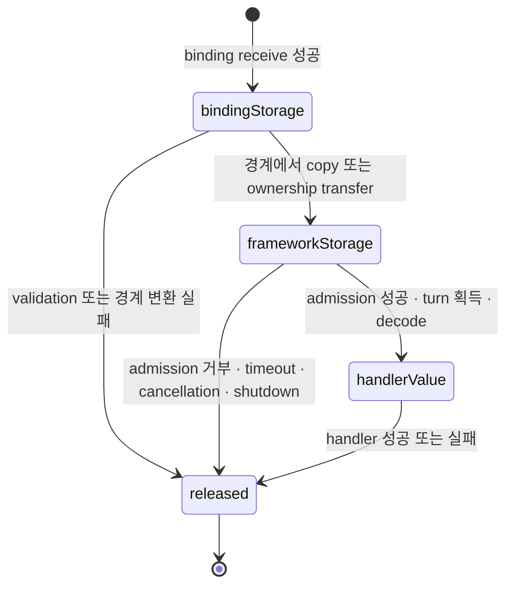
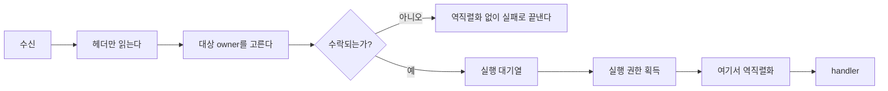

# 50. Payload 소유권과 복사

> **문서 성격 — 공개 규범 스펙이 아닌 내부 설계 문서.** 이 장은 연결된 공개 계약을 만족시키는 구현 구조를 설명한다. Application이 관찰하는 동작을 추가하거나 변경하지 않는다.

[내부 구조 목차](README.ko.md) · [이전: 49. Liveness와 상태 공개](49-internal-liveness-and-state.ko.md) · [다음: 51. Service wire protocol](51-internal-service-wire-protocol.ko.md)

> **이 장이 답하는 것** — message 하나가 socket에서 handler까지 가는 동안 byte를 몇 번 복사하는가.
>
> **계약 소유** — payload 크기 회계는 [Framework API](06-framework-api.ko.md)가,
> 전달 형식은 [Channel 메시징](08-channel-messaging.ko.md)이 소유한다.
> 이 장은 그 계약을 만족시키는 **구조**와, payload 소유권을 어겼을 때 나타나는 실패를 다룬다.

message 하나가 socket에서 handler까지 가는 동안 **byte를 몇 번 복사하는가**를 정한다.
복사 횟수는 처리량에 직접 영향을 준다. 소유권을 넘길 때마다 전체 buffer를 복사하면
payload 크기에 비례하는 메모리 작업이 message 경로에 반복된다.

## 1. 두 종류의 복사를 구분한다

복사에는 성격이 다른 두 가지가 있다.

| 종류 | 예 | 없앨 수 있나 |
|---|---|---|
| **binding이 강제하는 복사** | 그 언어에서 native 버퍼를 안전하게 유지할 수 없어 관리 메모리로 옮기는 복사 | 없앨 수 없다 |
| **framework가 만드는 복사** | 큐를 넘기려고, 형식을 바꾸려고, 나중에 쓸지 모르니 미리 만들어 두려고 하는 복사 | **없앨 수 있다** |

binding이 "native queue의 수명을 그 언어 객체의 도달 가능성과 안전하게 묶을 수 없다"는
제약 때문에 **빌려 쓰는 view를 제공하지 않을 수 있다.** 그런 언어 mapping에서는 첫 복사가
강제된다.

**결정 — framework가 추가로 만드는 복사는 0을 목표로 한다.** binding이 강제하는 복사는
언어별 사실로 인정하고, 그 위에 framework가 몇 번을 더하는지로 구현을 평가한다.

## 2. 없앨 수 있는 복사

Framework 내부에서 다음 복사를 만들지 않는다.

| 유형 | 무엇을 하는가 | 왜 없앨 수 있나 |
|---|---|---|
| **경계 왕복** | `message → byte 배열 → message`로 되돌린다 | 같은 표현으로 돌아오므로 중간 단계가 순수한 낭비다 |
| **접근자 복사** | 목록을 돌려주는 접근자가 **호출될 때마다** 복사본을 만든다 | 읽기 전용이면 복사할 이유가 없고, 읽는 횟수만큼 복사가 늘어난다 |
| **큐를 넘기려는 복사** | 실행 대기열에 넣기 전에 소유권을 확보하려고 복사한다 | 소유권은 복사가 아니라 이동으로 옮길 수 있다 |
| **이중 보관** | 같은 payload를 서로 다른 표현 두 벌로 **동시에** 들고 있다 | 소유 표현 하나만 유지하면 된다 |
| **미리 만드는 이동 기록** | 다음 절에서 따로 다룬다 | 이동이 실제로 시작될 때 만들면 된다 |

## 3. 이동 기록을 hot path에서 만들지 않는다

수락한 route message마다 **relocation 대비 기록을 미리 만들면** relocation 발생 여부와
관계없이 모든 message 처리에 이 비용이 추가된다. 원본과 중간 표현을 함께 유지하는 경로에서는
**같은 payload가 네 벌 동시에 상주**할 수 있다.

**결정 — 이동 기록은 봉인이 시작된 뒤에 만든다.** 이동은 드문 사건이고, 봉인 시점에는
그 owner의 대기열에 남은 작업이 이미 확정되어 있으므로 그때 만들 수 있다.

미리 만들어야 한다고 판단한다면 그 이유는 "seal 시점 전에 원본을 이미 해제한다"여야
한다. 그렇다면 먼저 고칠 문제는 **원본의 해제 시점**이지 사전 복사가 아니다.

## 4. 큐에 있는 동안의 소유자

**결정 — 실행 대기열에 들어간 message의 payload는 framework가 소유한다.** 대기 중에
전송 계층이나 application이 그 버퍼를 만지지 않는다.

**결정 — 해제는 handler가 끝난 뒤에 한다.** handler 실행 중에 payload를 해제하면
handler가 사용하던 view가 무효가 된다.

**무엇을 해제하는지**는 binding이 소유권을 표현하는 방법에 따라 달라질 수 있다. Native
버퍼를 유지하면 그 버퍼를, 관리 메모리로 옮기면 그 사본을 해제한다. 어느 쪽이든
**해제 시점은 handler 완료 이후**다.

소유권 전이는 다음 한 방향으로만 진행한다. Binding receive callback이 끝난 뒤에도
payload를 보관해야 하면 그 경계에서 한 번만 복사하거나 소유권을 옮긴다. Queue에 넣은 뒤에는
encoded payload를 Framework가 소유하며, handler가 받는 decoded value는 native storage의
소유권이나 해제 책임을 포함하지 않는다.

모든 terminal 경로는 같은 release 지점으로 모인다. Handler exception, timeout,
cancellation, shutdown과 relocation 정리에서도 release를 건너뛰거나 두 번 실행하지 않는다.
C++과 .NET은 이 전이가 `close`·`Dispose` 호출로 드러난다. JVM의 managed object와 Node의
`Buffer`처럼 실제 해제가 garbage collection에 맡겨지는 mapping도 queue와 handler가 더는
그 storage를 참조하지 않는 같은 논리적 release 지점을 유지한다.

## 5. Handler에 무엇을 넘기는가

**결정 — handler에는 역직렬화된 소유 객체를 넘긴다. native 저장소나 해제 책임을 넘기지
않는다.**

이 결정 때문에 **역직렬화 복사 한 번은 불가피**하다. typed handler를 제공하는 이상 wire
표현을 그 언어의 객체로 만들어야 한다.

따라서 §1의 "framework가 만드는 복사 0"은 **역직렬화를 제외한 값**이다. 목표는
`binding 강제 복사 + 역직렬화 1회`이고, 그 사이의 모든 것이 줄일 대상이다.

### 세는 단위를 섞지 않는다

**결정 — 복사 회계는 세 종류를 따로 센다.** 하나로 합치면 비교가 왜곡된다.

| 단위 | 무엇 | 왜 따로 세는가 |
|---|---|---|
| buffer 전체 복사 | byte 배열을 통째로 새로 만드는 것 | 크기에 비례하는 비용. 줄이면 그대로 이득 |
| view·slice | 같은 buffer를 가리키는 참조를 만드는 것 | 비용이 거의 없다. 복사로 세면 없는 문제를 만든다 |
| 객체 생성 | 역직렬화가 만드는 문자열·배열·객체 그래프 | buffer 복사 한 번이 아니다. codec과 payload 모양에 좌우된다 |

"역직렬화 1회"는 **buffer 복사 축의 값**이다. 역직렬화가 만드는 객체 수를 buffer 복사와
같은 숫자로 세면, codec을 바꿔서 얻는 이득과 복사를 없애서 얻는 이득을 구분할 수 없다.

**불변 payload의 이중 복사 위험.** 불변 payload 타입은 생성할 때 한 번,
접근자를 부를 때 또 한 번 배열을 복사하기 쉽다. 접근자마다 복사하면 handler가 payload를
두 번 읽는 것만으로 복사가 두 번 늘어난다. 공개 API의 불변성은 유지하되, runtime 내부
소유권 이전에는 복사하지 않는 경로를 따로 둔다.

raw byte를 다루는 API는 **transport 검사와 codec extension 구현에만** 쓴다
([메시지 모델 「1. Typed 메시지」](04-message-model.ko.md#1-typed-메시지)). 업무 handler 인자로 raw payload를
받게 하면 계약 위반이다.

## 6. 역직렬화를 언제 하는가

**결정 — 헤더는 먼저 읽고, payload 역직렬화는 실행 권한을 얻은 뒤 handler 직전에
한다.**

헤더를 먼저 읽는 것은 선택이 아니다 — 어느 owner에게 보낼지 정하려면 필요하다. 반면
payload는 handler가 실행되기 전까지 아무도 보지 않는다.

**결정 — 실행 대기열에 수락되지 못한 message는 역직렬화하지 않는다.** Object·channel admission
규칙이나 current owner 불일치로 거부할 message는 handler에 도달하지 않는다. 이런 message를
미리 역직렬화하면 **부하가 높은 시점에 결국 거부할 message에도 비용이 큰 작업을 수행한다.**

Application Job Queue 포화는 여기서 말하는 거부가 아니다. 일반 ingress는 receive·claim 전에
host-wide permit을 취소 가능하게 기다리며 reject·drop하지 않는다. Permit을 얻은 뒤에는 별도의
object·channel admission 계약이 encoded message를 실행 대기열에 넣을지 결정한다.

Relocation seal 뒤 도착한 message는 거부하지 않는다. Framework는 encoded payload와 reply
정보를 보류하고, relay-ready reply가 accepted되기 전 명시 abort에서는 source에서 재개하며 그
뒤에는 cutover submit 결과와 관계없이 target handoff 또는 Message Follow로 넘긴다. 이 message도
실행 권한을 얻기 전에는 역직렬화하지 않는다. 따라서 이동 중 보류는 message를 잃지 않으면서
handler가 실제로 실행되는 시점까지 역직렬화 비용을 미룬다.

**실행 권한을 얻기 전에** 역직렬화하면 권한 안에서 거절된 message에도 역직렬화 비용이
발생한다. Object·channel admission 판단 전에 복사하면 해당 계약이 허용한 거절에도 복사 비용이 남는다.

**결정 — 형식을 판별하려고 전체를 두 번 해석하지 않는다.** payload를 시험 삼아 한 번
해석한 뒤 실제 처리를 위해 **또 해석하면** 비용과 실패 지점이 중복된다. 형식은 헤더가 알려
주는 것이지 본문을 시험 삼아 해석해서 알아낼 것이 아니다.

**결정 — 수락한 message의 typed payload는 최대 한 번만 역직렬화한다.** 첫 typed 접근이
만든 값이나 실패를 message에 저장한다. 같은 type이나 다른 type으로 다시 접근해도 codec을
다시 호출하지 않는다. 저장한 값을 요청한 type으로 사용할 수 없으면 언어별 type mismatch로
끝나고, 첫 접근이 실패했다면 같은 실패를 다시 전달한다. 읽기 전용 raw view나 명시적인 byte
복사본을 얻는 동작은 이 typed 결과를 만들지 않는다.

## 7. Codec 선택을 message 경로에서 계산하지 않는다

### 계약 — 선택은 있고, 송신과 수신이 다르다

codec은 하나가 아니다. **여러 serializer가 동시에 등록되어 있는 것이 전제**이며, 그래서
message마다 어느 것을 쓸지 정해야 한다.

이 선택을 표현하는 **API 모양은 언어마다 다르다.** .NET은 content-type과 타입별 술어를
함께 받는다(`AddSerializer(contentType, serializer, canSerialize)`,
[.NET 직렬화 계약](server/languages/dotnet/interfaces/11-serialization.ko.md)).
Node의 구체적인 TypeScript 표현은
[Node foundation 계약](server/languages/node/interfaces/01-foundation-configuration.ko.md)이
정한다. Internals는 한 언어의 API 모양을 공통 구조로 단정하지 않는다. 아래 결정은
**선택의 의미**에만 적용된다.

그리고 **송신과 수신은 서로 다른 경계**다.

| 방향 | 무엇으로 고르는가 | 못 찾으면 |
|---|---|---|
| 송신 | 호출 지점에 선언된 **message type** | JSON codec을 쓴다 |
| 수신 | envelope에 실린 정규화된 **content-type** | JSON으로 다시 해석하지 않고 `ProtocolError`로 끝낸다 |

근거는 [Framework API 「9. Codec」](06-framework-api.ko.md#9-codec)이며, "송신 타입 선택의
기본값과 수신 wire content-type 검증은 서로 다른 경계이므로 같은 fallback 규칙을 적용하지
않는다"고 명시한다.

송신 selector에는 실제 instance의 concrete type이 아니라 호출 지점에 선언된 message type을
전달한다. 둘 이상의 selector가 일치하면 나중 등록을 우선한다. 수신측은 wire의 정규화된
content-type을 registry key와 정확히 비교한다. 등록되지 않았거나 정규화 규칙에 맞지 않는
값은 `ProtocolError`로 완료한다.

### 그래서 무엇이 internals의 몫인가

같은 문서가 "내부 registry, **codec 선택 cache**와 dispatch 구현은 이 문서의 계약이
아니다"라고 명시한다. 즉 **선택이 일어난다는 사실은 계약이고, 그 비용은 internals가
정한다.**

### message마다 반복하면 안 되는 작업

codec 선택은 조회할 수 있지만, 조회 과정의 문자열·배열·호출 객체를 **message마다 새로
만들면 안 된다.**

| 반복 작업 | message마다 생기는 것 |
|---|---|
| 타입을 키로 조회하고 호출 객체를 만든다 | 조회 2회 + 객체 2개 |
| content-type을 프레임에서 꺼내 문자열로 만들고 자르고 다듬어 비교한다 | 문자열 여러 개 |
| 후보 목록을 배열로 만들어 훑는다 | 배열 2개 |
| 기본 형식인지 문자열로 비교한다 | 비교 1~2회 |

마지막 비교의 비용은 작다. 나머지는 처리량에 비례해 임시 객체와 문자열을 만든다.

### 그래서 internals가 정하는 것

**결정 — registry는 시작 뒤 바뀌지 않으므로 선택 결과를 캐시한다.** 다만 송신과 수신의
캐시 키가 다르다.

| 방향 | 캐시 키 | 언제 채워지는가 |
|---|---|---|
| 수신 | wire의 정규화된 content-type | content-type 종류가 유한하므로 시작 시점에 전부 계산해 둘 수 있다 |
| 송신 | 호출 지점에 선언된 message type | 타입을 미리 열거할 수 없다. 처음 만난 타입에서 한 번 계산하고 캐시한다 |

송신 캐시를 **시작 시점에 전부 확정할 수는 없다.** Channel API가 호출마다 임의의 타입을
받고([Channel 메시징](08-channel-messaging.ko.md)), 선택자 술어도 실행 중 처음 만난
declared type descriptor를 평가하기 때문이다. Registry 자체는 불변이므로 캐시에 들어간
type의 결과는 한 번 계산한 뒤 바뀌지 않는다.

송신 캐시는 선언 type 1,024개의 선택 결과까지만 저장한다. 한도에 도달해도 기존 entry를
제거하지 않는다. 이후 처음 보는 type은 송신할 때마다 등록 목록을 다시 평가하고, 그 결과는
캐시에 넣지 않는다. 이 방식은 이미 자주 쓰는 type의 lookup 비용을 유지하면서 캐시 크기를
제한한다.

[40. 계층 경계와 식별자 「5. 등록 선언은 시작할 때 한 번만 검증한다」](40-internal-layering.ko.md#5-등록-선언은-시작할-때-한-번만-검증한다)의 "등록 선언은 시작할 때 한 번만 검증한다"가
여기 그대로 적용된다 — 시작 뒤 불변이면 미리 계산해 두고 **잠금 없이** 읽으면 된다.
조회 결과를 실행 중에 동시 접근을 견디지 못하는 사전에 쓰면 race가 생긴다. 미리 확정하면
runtime 중 쓰기와 그에 따른 race가 없어진다.

**결정 — content-type을 비교하려고 문자열을 새로 만들지 않는다.** 다듬기·잘라내기가
필요하면 등록 시점에 해 두고, message 경로에서는 이미 다듬어진 값끼리 비교한다.

**결정 — 후보를 고르려고 목록이나 임시 객체를 새로 만들지 않는다.** 등록된 codec이 하나뿐인
상황에서도 매번 만들면 모든 message에서 할당이 발생한다.

**결정 — 수신 content-type을 못 찾으면 JSON으로 되돌리지 않고 `ProtocolError`로 끝낸다.**
이건 spec이 이미 정한 값이다. 되돌리면 다른 형식의 byte를 JSON으로 해석하려다 엉뚱한
오류가 난다.

### 수신 codec 선택의 필수 입력

수신 content-type은 전달만 하는 metadata가 아니라 **codec을 고르는 입력**이다. 선택에
사용하지 않으면 non-JSON payload를 구분하지 못하고, 등록되지 않은 content-type에서
`ProtocolError`도 발생하지 않는다.

## 8. 확인할 결과

- 같은 payload가 서로 다른 표현 두 벌로 동시에 유지되지 않는다.
- `message → byte 배열 → message` 왕복이 없다.
- 목록을 돌려주는 접근자가 호출마다 복사본을 만들지 않는다.
- 이동이 시작되지 않은 message에 대해 이동 기록을 만들지 않는다.
- 대기 중인 payload를 전송 계층이나 application이 만지지 않는다.
- payload 해제가 handler 완료 이후에 일어난다.
- 성공·거부·예외·timeout·cancellation·shutdown의 모든 terminal 경로가 payload release를
  정확히 한 번 실행한다.
- handler가 native 저장소나 해제 책임을 받지 않는다.
- 대기열 가득참이나 owner 불일치로 거절된 message가 역직렬화되지 않는다.
- 이동 중 보류한 message가 commit replay 또는 abort 재개 뒤 실행 권한을 얻기 전에는
  역직렬화되지 않는다.
- payload 역직렬화가 실행 권한을 얻은 뒤에 일어난다.
- 형식 판별을 위해 payload 전체를 두 번 해석하지 않는다.
- 첫 typed 접근의 값이나 실패를 message에 저장하며, 같은 message에서는 codec을 최대 한 번만
  호출한다.
- 수신 codec table이 시작 시점에 확정되어 있다.
- 송신 codec 선택 결과를 선언 type 1,024개까지 저장하며 기존 entry를 제거하지 않는다.
- 송신 cache 한도 뒤 처음 보는 type은 결과를 저장하지 않고 message마다 다시 평가한다.
- codec 관련 처리에서 message마다 문자열·배열·호출 객체가 새로 생기지 않는다.
- 수신 content-type과 일치하는 codec이 없으면 JSON으로 되돌리지 않고 `ProtocolError`로
  끝난다.
- codec 정보를 읽는 데 잠금이 필요하지 않다.

## Retained Core lease와 1:N child 소유권

Core receive에서 retain한 record는 payload와 Core receive-credit lease의 shared owner 하나를 가진다.
Application shared permit은 각 exact-target child callback의 실제 첫 instruction에서 반환하고, pre-start
terminal child는 permit을 정확히 한 번 반환한다. 첫 child를 enqueue한 뒤 remaining child permit은
[dispatch loop](46-internal-dispatch-loop.ko.md)의 FIFO를 통해 lazy하게 확보하며, 확보하지 않은 child payload를
별도 무제한 queue에 복제하지 않는다.

Shared retained owner는 모든 child terminal과 필요한 record-level reply attempt가 terminal이 된 뒤 Core
lease를 정확히 한 번 반환한다. Partial child acquire/enqueue 중 cancellation, decode failure, owner close나
shutdown이 발생하면 아직 enqueue하지 않은 permit은 즉시 반환하고, enqueue한 child는 각자의 pre-start 또는
handler-start 경계에서 정리한다. Reply attempt가 필요하지 않은 one-way record는 모든 child terminal이
record terminal이다.

---

[내부 구조 목차](README.ko.md) · [이전: 49. Liveness와 상태 공개](49-internal-liveness-and-state.ko.md) · [다음: 51. Service wire protocol](51-internal-service-wire-protocol.ko.md)
