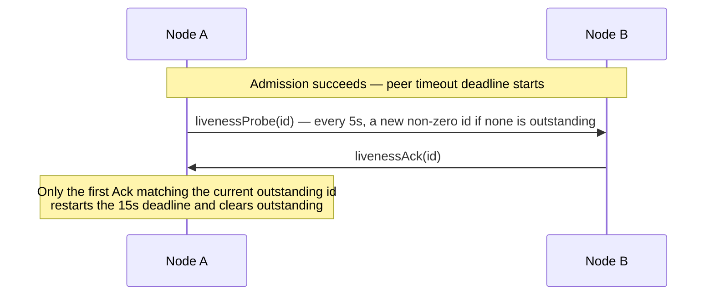

# 51. Service wire protocol

> **Document status — internal design, not normative public specification.** This chapter explains implementation structure used to satisfy the linked public contracts. It does not add or change application-visible behavior.

[Internals index](README.en.md) · [Previous: 50. Payload Ownership and Copying](50-internal-message-ownership.en.md) · [Next: 52. Relocation Handoff State Transitions](52-internal-relocation-handoff.en.md)

> **What this chapter answers** — the byte format and command list exchanged between nodes.
>
> **Contract owner** — `framework/runtime/protocol/service-wire-v1.schema.json` is
> authoritative. This chapter explains the field relationships and validation order the
> schema defines, and unlike other chapters it does not apply the decision/discretion/
> confirmable-result distinction.
>
> **Related contracts** — [Layer Boundaries and Identifiers](40-internal-layering.en.md) ·
> [Location runtime](21-location-runtime.en.md) ·
> [Redis Relocation Store](23-relocation-store-redis.en.md) ·
> [Transport liveness](29-transport-liveness.en.md) ·
> [Relocation Handoff State Transitions](52-internal-relocation-handoff.en.md)

| Section | Covers |
|---|---|
| [1. Schema and generation boundary](#1-schema-and-generation-boundary) | The schema as single source of generation, the validator, the Location Store authority key format |
| [2. Record framing and decode](#2-record-framing-and-decode) | Multipart frame layout, decode validation, payload size limits |
| [3. Command space](#3-command-space) | The list of 42 commands and their roles, Message Follow and session-replacement notifications |
| [4. Admission and connection fence](#4-admission-and-connection-fence) | The hello/admit/reject procedure, DescriptorRevision ordering, ClientServer direction |
| [5. Service liveness](#5-service-liveness) | The livenessProbe/Ack cycle, the Classic fanout beacon, subscriber-ready determination |
| [6. Typed application message JSON](#6-typed-application-message-json) | The `framework-json-v1` profile rules |
| [7. Durable authority and explicit creation](#7-durable-authority-and-explicit-creation) | Generation separation, the creation record, factory failure handling |
| [8. Instance Spot cold activation recovery](#8-instance-spot-cold-activation-recovery) | The Missing+Instance intent envelope, first-activation recovery on the same target, User Spot terminal service operations |
| [9. Maintenance capture and relocation envelope](#9-maintenance-capture-and-relocation-envelope) | The Retiring seal, the byte reservation gate, relocation envelope encoding |
| [10. Relocation, Actor membership, and Ready](#10-relocation-actor-membership-and-ready) | The authority phase state machine, aggregate relocation commit, the moment of Ready |
| [11. Request terminal identity](#11-request-terminal-identity) | OperationId/ReplyRouteId, terminal completion tracking, root replacement |
| [12. Implementation verification](#12-implementation-verification) | The invariants an implementation must uphold |

## 1. Schema and generation boundary

### Generation boundary

`framework/runtime/protocol/service-wire-v1.schema.json` is the single source
of generation for the Framework service wire. This schema fixes command IDs,
frame layout, enum values, field bounds, the durable format, and semantic
constraints. The C++/.NET/JVM/Node.js runtimes generate their constants and
codec tables from the schema, and never redefine the same values in source.

### Validator

Generators and fixture builders run the validator before producing a file.

```bash
node framework/runtime/protocol/validate-service-wire-schema.mjs \
  --self-test framework/runtime/protocol/service-wire-v1.schema.json
```

The wire major is `1` and the required capability is `framework-service-v12`.
The build stops if the schema and golden fixtures diverge, or if the
validator finds an undefined type, a duplicate ID, or an invalid
enum/bound/conditional field.

### Location Store authority key format

The store that records which node an object currently lives on is called the
[Location Store](01-glossary.en.md#location-store). The rule for
building its authority key is fixed by the same schema and golden fixtures.

| Object | Key format |
|---|---|
| Actor | `zla1:a:<byte-length>:<encoded-ActorId>` |
| [Spot](01-glossary.en.md#spot) | `zla1:s:<byte-length>:<encoded-SpotRid>` |

- MeshName is not part of the key — it is stored only as the authority payload's current placement attribute.
- Percent encoding leaves RFC 3986 unreserved bytes as-is and represents everything else as uppercase hex.

## 2. Record framing and decode

### Frame layout

A ROUTER routing identity is the transport envelope the raw binding
consumes; the service codec does not copy it into the application frame. A
service record is a multipart message in the following order:

```text
+------------------------------------------+
| Frame 0: Head Prefix and Command Body    |
+------------------------------------------+
| Frame 1: Metadata when flag 0x01         |
+------------------------------------------+
| Next: Typed Payload Envelope if allowed  |
+------------------------------------------+
```

- Frame 0's prefix is, in order, `Z`, `M`, the wire major, the command ID, and flags. Multi-byte integers are in network byte order.
- Metadata, the bound session, the source Spot RID, and extension flags can only be used on commands the schema permits or requires them for.
- An undefined flag, an unexpected frame count, a conditional tail, or a trailing byte is rejected as a protocol error before application dispatch.

### Decode validation and size limits

- The decoder checks the complete record length, item count, UTF-8 validity, and every bound before allocating.
- A metadata frame cannot exceed 1,024 bytes.
- The application payload's absolute schema limit is `applicationPayloadAbsoluteBytes`, 4,294,966,774 bytes.
- RouteMesh ServerServer applies only the absolute schema and wire representation bounds; it has no Framework-level message-size cap.
- On ClientServer, the actual allowed payload size is whichever is smaller: that absolute limit, or `normalizedEffectiveMaxMessageBytes` minus the real envelope overhead.
- No separate, hidden 16 MiB cap applies to the application payload.

The ClientServer complete-message limit is fixed at startup admission.

- The sender uses the smaller of the local and remote `normalizedEffectiveMaxMessageBytes`, and the receiver uses its own admitted limit.
- This value cannot change during the admitted connection's lifetime, and is applied before allocation.
- If both sides' limits are 32 MiB, a 17 MiB payload is allowed, since the complete message stays within 32 MiB.
- RouteMesh admission doesn't carry this field, and an SS sender or receiver doesn't reject a message because of this value. HWM, mailbox byte budgets, and protocol representation bounds remain separate resource and wire guards.

### Typed payload envelope

A typed payload preserves the packet name, contract information, and
serializer payload together in one envelope. Application code is never
exposed to raw frame assembly, codec tables, or maintenance fields.

### Framework multipart application profile

Service messaging commands that carry several Framework message parts as a
single application payload use a common profile for the outer application
envelope. This envelope's packet name is fixed as `ZLinkFrameworkMultipart`
and its content type as `application/x-zlink-multipart`. The actual
application message's packet name and bytes are preserved by part order
inside the envelope's payload.

Operations where the command itself defines a separate
application-payload envelope, such as Actor creation, are not subject to
this profile — that operation's own contract governs its packet name and
content type.

The payload is encoded in the following order.

1. A 4-byte big-endian part count
2. Each part's 4-byte big-endian byte length
3. That many bytes of opaque payload

The part count must be at least 1. Before building the result list, the
decoder confirms the count is representable by the remaining bytes, and
that each length does not exceed the remaining range. It rejects the
record if any bytes remain after all parts are read. The Framework does
not interpret a part's contents for business meaning — it restores the
original bytes into each Message as-is.

The framework does not recompute this profile's count, lengths, outer
envelope, content-type frame, or framework metadata as a separate
application byte HWM. The credit lease for the complete message retained
from Core receive maintains byte backpressure until payload ownership ends.

## 3. Command space

Wire v1 uses the following IDs. `7..15`, `32`, `35`, `41`, `45`, and `52..255` are
reserved and never reused for another meaning. A previous command name in parentheses
is diagnostic compatibility text, not a command that is decoded or sent.

| ID | Command | Role |
|---:|---|---|
| 1 | `hello` | Proposes this connection be accepted by offering its own descriptor |
| 2 | `admit` | Approves the selected connection |
| 3 | `reject` | Rejects admission |
| 4 | `update` | Updates the admitted descriptor revision |
| 5 | `livenessProbe` | Confirms the current connection's round trip |
| 6 | `livenessAck` | Responds to the same probe ID |
| 16 | `nodeSend` | Node one-way |
| 17 | `nodeRequest` | Node request |
| 18 | `channelSend` | Channel one-way |
| 19 | `channelRequest` | Channel request |
| 20 | `reply` | Request terminal result |
| 21 | `spotSend` | Spot one-way |
| 22 | `spotRequest` | Spot request |
| 23 | `logicalMulticast` | Logical multicast |
| 24 | `actorSend` | Actor one-way |
| 25 | `actorRequest` | Actor request |
| 26 | `actorLookup` | Actor route lookup |
| 27 | `actorDestroy` | Actor destroy coordination |
| 28 | `actorJoin` | Actor membership proposal |
| 29 | `actorLeft` | Actor leave commit |
| 30 | `relocationReady` | Temporary queue, Restore, and relay-reception-ready reply |
| 31 | `relocationData` | Post-capture ingress-hold relay record transfer |
| 32 | reserved (`relocationAck`) | Removed per-message ACK/numeric-high-water command |
| 33 | `replyRelay` | Terminal completion relay |
| 34 | `relocationCutover` | One-way control reporting all pre-boundary relay sent |
| 35 | reserved (`relocationComplete`) | Removed target-completion-reply command |
| 36 | `boundSessionSend` | Bound STREAM session egress |
| 37 | `actorJoined` | Actor join commit |
| 38 | `boundSessionBind` | Session binding commit |
| 39 | `instanceSpot` | Logical Instance Spot operation |
| 40 | `relocationPrepare` | Request to install temporary queue, Restore the Relocation Store payload, and prepare relay |
| 41 | reserved (`relocationReserved`) | Removed relocation-specific capacity-reservation ACK |
| 42 | `sessionRelocationSeal` | Session ingress seal request |
| 43 | `sessionRelocationSealed` | Session seal response |
| 44 | `sessionRelocationRoute` | One-way Session-route control for target commit or source abort before relay-ready is accepted |
| 45 | reserved (`sessionRelocationRouted`) | Removed Session-route application response command |
| 46 | `replyRelayAck` | Relayed terminal result ACK |
| 47 | `userSpotCreate` | Creates a remote User Spot in an already-reserved slot |
| 48 | `userSpotClose` | Closes only the specified generation's remote User Spot |
| 49 | `actorCreate` | Creates a remote Actor in an already-reserved slot |
| 50 | `messageFollow` | The location-cache invalidation notice sent to the source runtime after a successful relay |
| 51 | `boundSessionReplaced` | Notifies the previous exact session after the new binding becomes current |

Each command's body, whether it allows metadata/payload, and its direction
follow the schema's closed definition. An unknown command, an
infrastructure command going the wrong direction, or a command the current
topology does not allow is not placed on the application queue.

### 3.1 Message Follow notification

#### Body layout

`messageFollow` is an infrastructure record that does not wait for a
response. It allows neither flags nor an application payload — a single
service record carries a body closed by version `1` and its length. The
body carries the source route, the target route, the hop count, the queue
count/bytes at relay time, the original operation ID, and the original
reply route ID. The two queue values are saturating `u32` diagnostic
snapshots. `UINT32_MAX` means the actual count or retained byte size is at
least that value; the snapshot never controls payload admission.

#### Route validation

- The source and target routes must share the same object kind and object identity.
- Each route carries the object generation, the target node RID and generation, the authority owner generation, and the owner lease generation; the receiver first confirms the source route's target node is a currently admitted peer.
- Only a hop count of 1..8 is allowed. One control envelope is at most 16 MiB. This
  envelope bound and the saturating diagnostic fields do not impose a message-count or
  stored-byte bound on the retained payload queue.
- A record that points at a different object, or whose route fence doesn't match, ends as a protocol error before application dispatch.

#### Suppressing duplicate notifications

A runtime that completed a relay may send `messageFollow` to the source runtime. The source
runtime invalidates its current cache entry only when it points at the same exact route fence
as the source route. It does not erase a newer route. Even if the notification is lost, the
cache lifetime must eventually expire the stale route.

The sender's dedicated suppression registry uses the complete source and target route fences
as its key. Its state moves through `idle → inFlight → sentUntilExpiry`, and only a send
failure returns it from `inFlight` to `idle`. Route-cache expiry or replacement also removes
the marker. The registry does not own the original operation's payload, reply route, or
terminal completion. [45. Target Selection And Route Cache](45-internal-routing-and-cache.en.md#2-where-a-move-meets-the-cache--a-performance-cliff)
shows the state flow.

### 3.2 Bound Session Replacement Notification

`boundSessionReplaced` is a one-way infrastructure record sent to the previous session owner after
the new Actor binding becomes current. It carries an Actor-authority source fence and the previous
session owner's exact lifecycle and binding identity, and uses no flags, application payload, or
acknowledgment. The receiver verifies that the sending node matches the Actor-authority target and
uses the previous session-owner identity as the local target fence. Delivery and the previous owner's
callback or connection close neither delay nor roll back the new bind terminal. The previous owner
applies only a record matching the exact retired identity. The framework closes the connection
`100 ms` after the callback reaches a successful or failed terminal; an empty outbound queue does
not shorten this delay.

## 4. Admission and connection fence

### Admission procedure

- RouteMesh and ClientServer approve the current physical connection as a service route via `hello → admit|reject`.
- A manually configured lifecycle token is a non-zero opaque equality token generated by a CSPRNG.
- New values are not judged by numeric magnitude — a previous token is blocked instead by the current physical connection's handover and liveness.
- For a peer whose owner is recorded in the store, the runtime also checks whether that host is still the owner and whether its lease is still valid.

### DescriptorRevision ordering

- Only `DescriptorRevision` has strictly increasing ordering within the same lifecycle.
- Identical bytes at the same revision are idempotent; different bytes at the same revision, or a lower revision, are a protocol error.
- `update` can only change the existing channel weight, runtime state, placement capacity, and maintenance wave.
- RID, topology, security identity, capability, application version, and the normalized message limit only change by re-admitting the connection.

### Physical connection replacement

Descriptor admission and physical transport replacement use the same fence.
Once descriptor expectations are complete, an endpoint-only manual intent with
generation 0 cannot overwrite them. The runtime uses the
`transportPairId`/`transportPairGeneration` from the monitor event to mark all
lanes in the current pair for termination, and does not create a new
connection for the same endpoint before observing that pair's close snapshot
or disconnect event. An endpoint-level disconnect is a fallback for an initial
transport whose pair identity is unavailable, but a successful call does not
replace observation of the physical close. A late event from the previous
pair is fenced by its pair identity and cannot change admission or ready state
of the new connection.

### ClientServer direction

- A ClientServer connection fixes a single application-attached channel name, the [ChannelName](01-glossary.en.md#channelname), and a client-to-server direction.
- The client sends only send/request and liveness commands; the server sends only reply, liveness, update, and reject.
- Reusing a [RouteMesh](01-glossary.en.md#routemesh) record — where multiple nodes find each other by name — for a ClientServer connection, or the reverse, is a protocol error.

## 5. Service liveness

### The probe/Ack cycle



- Each connection has only one outstanding ID at a time; if one is already outstanding, the same ID is sent again.
- A stale ID, a duplicate ACK, an ACK from a different connection, and other inbound traffic are recorded only as diagnostic activity — they do not extend the deadline.
- An orderly disconnect or a raw transport failure switches to not-ready immediately, without waiting for the deadline.
- The probe, ACK, and timer are handled by the infrastructure reserve and are not delivered to the application queue or a handler.

### Classic fanout beacon

A one-way delivery style where the receiving side never responds is called
[Classic fanout](01-glossary.en.md#classic-fanout). Since this kind
of publisher can't receive an ACK, it sends a separate beacon every 5
seconds. The beacon is sent periodically, independent of application
publish traffic.

```text
Topic:   01 5A 4C 46 31
Payload: 5A 46 01 01
```

### Determining subscriber readiness

- A subscriber uses a dedicated SUB socket per publisher.
- It becomes Ready on the first valid application record, or a beacon from that publisher, and switches only that publisher to not-ready once 15 seconds pass since the last valid receive.
- An incorrect frame count or payload on the reserved topic is an immediate protocol error.
- If a derived public topic happens to exactly match the reserved topic, that is rejected as an application argument or configuration error, before transport.

## 6. Typed application message JSON

### `framework-json-v1` profile rules

The public encoding and validation rules for the `framework-json-v1` profile used by default
typed application messages are owned exclusively by
[Message Model §2.3](04-message-model.en.md#23-the-framework-json-v1-typed-payload-profile). The runtime validates
the payload and converts it to a typed value under that profile. This document defines no second rule
set; parser choice, buffer reuse, and transport delivery of the original UTF-8 bytes remain internal
implementation details.

### Relocation adapter state is outside the profile

Application state returned by an Actor/Spot relocation adapter is not
subject to this profile. The Framework stores relocation state as opaque
bytes, and does not perform JSON parsing or compare a state contract ID or
an application-specific version.

## 7. Durable authority and explicit creation

### Generation and Authority

- Store-backed authority keeps the provider-issued `StoreVersion`, `ObjectGeneration`, and `AuthorityOwnerGeneration` separate from the current host's `OwnerId` and `OwnerLeaseGeneration`.
- The object generation changes only when a new object is created under the same key after a delete.
- The current owner recorded by the store, and its standing, is called [Authority](01-glossary.en.md#authority); the authority owner generation increases every time that object's owner changes, blocking changes from a stale owner.
- The host owner lease token is shared across the whole process.

### Creation record

Actor and User Spot manager create, and target-owned Instance activation,
use a generic reservation to create the final object/owner generation and
a `Creating` row.

- A creation record preserves the object kind, global key, stable type, target descriptor, capacity delta, provider-issued fence, and the content reference/hash of a complete request envelope up to 1 MiB.
- This value, preserved in the pending current row, is called the `stored creation intent`. During recovery, this record can be scanned to confirm the fence value and receipt still match exactly, and used to restore state.
- The application code that actually creates the object is called the [Factory](01-glossary.en.md#factory). Once Factory, initialize, and initial membership finish, the reservation commit and the `Ready` CAS run under the same fence.
- Only target-owned Instance cold activation additionally fixes the durable activation inbox's first record before commit.
- Manager `Find` and ID-only messaging use only `Ready`.
- Entry Spot is published after startup initialization, before the host becomes `Serving`, and is never created by a caller.

### Factory failure handling

- A Factory failure seals the local barrier as failed and terminal-processes the waiting request exactly once.
- A one-way operation records a drop event.
- The runtime deletes the row and reconciles an ambiguous result by reading, only if the StoreVersion, object/owner generation, and owner lease it read earlier are all still unchanged.
- The local registry stays failed until `Missing` is confirmed, and only then can a caller start a new `NewObject`.

### Object role

The `Client` and `Server` object roles require a Location Store. The `None`
object role creates neither authority nor a hidden local runtime.

## 8. Instance Spot cold activation recovery

The recovery scope and caller-visible result are defined by
[Failure Handling And Failover Scope §4.4](31-failure-failover-policy.en.md#44-distinguishing-instance-spot-cold-activation-from-owner-failure).
This section describes only the wire-record, durable-root, and scan structure
that implements that scope.

Recovery in this section is not general owner-loss reactivation. It resumes an operation on the
same target node and lifecycle generation only when the first cold activation published Ready but
didn't finish recording that operation's terminal completion and removing the recovery pointer. A
steady `Ready` owner process termination or owner-lease expiry doesn't use this root, select another
node, or run a factory.

### Missing+Instance intent envelope

A normal Instance send/request carries only the global SpotRid and is not a
create command. The target of a Missing+Instance intent stores a complete
`instance-activation-recovery-v1` envelope — one that preserves even
command 39's optional metadata presence/frame — in the Relocation Store,
and links the receipt to the Reserve. This format, and the durable
activation inbox, are used only for target-owned Instance cold activation,
never for Actor/User Spot generic create.

### Command 39 route kind

A command 39 route is a closed union of a first byte and a `u16` body
length.

| Kind | Purpose | Contents |
|---|---|---|
| `1` | Delivers to an existing [Ready](01-glossary.en.md#ready) authority | The object/owner/lease generation and StoreVersion of a state that can accept new work |
| `2` | Missing cold activation only | The target Mesh/node RID/lifecycle, Spot RID, stable type, descriptor version, and deadline — an authority fence is forbidden |

If a kind `2` route's operation identity or metadata presence/bytes differ
from the ZLIA's target Mesh/stable type/descriptor version/deadline, it is
rejected as a protocol error before reservation.

### Target host scan and recovery

- During the startup first scan and a rate-limited background scan, the target host resumes any Pending record it owns, or a Ready Instance activation recovery root that points to an incomplete first operation. The authority's target node RID and lifecycle generation must exactly match the current host.
- The scan and late control records converge on a single local barrier, keyed by object key, object/owner generation, and owner lease.
- It fixes the durable inbox's first record before Ready, blocks the handler with the barrier, and startup does not publish Serving until the queue head is restored.
- The recovery pointer is removed via Preserve CAS only after the first handler terminal completion is durably recorded and the replay cursor is advanced to the inbox sequence.
- Queue admission alone does not remove the pointer.

### Cold activation recovery failure handling

- A cold activation recovery failure seals the local barrier, terminal-processes the request exactly once, and records a one-way drop event.
- It is then deleted only once the fence value matches, in an order that reads the deleted result back to reconcile.
- If the process ends before the delete, the target scan can safely re-run the retry-safe factory.
- No new activation starts before `Missing` is confirmed.

### 8.1 User Spot terminal service operations

#### Command 47 — remote create

- A User Spot remote create uses command 47.
- After a generic Reserve, the source sends a correlation/operation ID, the source node lifecycle, the global Spot RID/stable type, and the provider-issued reservation fence and deadline to a single specified target.
- The reservation fence together preserves the expected StoreVersion, object/owner generation, target node lifecycle/owner lease, and pending capacity.
- Since the target reads the immutable content of the Pending creation projection from the Location Store, command 47 carries no application payload or metadata.

#### Command 48 — remote close

- A User Spot remote close uses command 48.
- Besides the source node lifecycle and operation identity, it sends the `SpotRef` that exactly identifies the target to close, the target node lifecycle, the AuthorityOwnerGeneration, and the StoreVersion.
- Before deciding whether to accept, the target checks the current authority and [Actor membership](01-glossary.en.md#actor-membership) — which Spot each active Actor belongs to — and the relocation state.
- Both commands are RouteMesh infrastructure commands and allow neither flags nor a payload.

#### Reply envelope

Both operations return their results in the command 20 reply envelope.

- The success tail for Create is the `Existing`/`Created`/`Rejected` discriminator plus the `SpotRef` that identifies the target; the success tail for Close is a single `closed` bool.
- Create's application reply is forbidden on `Existing`, and only optionally allowed on `Created` or `Rejected`.
- The source operation table guarantees terminal-once by source RID/lifecycle and operation ID.
- Neither Location row polling nor a control message built from an application packet substitutes for a reply.

## 9. Maintenance Capture And Relocation Envelope

### Session Seal And Source Relay

- Before stopping source application dispatch, the relocation coordinator seals a bound
  Session binding with command 42. Command 43 reports the seal result.
- The Session owner validates only current Session identity, binding generation,
  ActorId/ObjectGeneration, and relocation identity. It doesn't create a numeric
  high-water or re-read Actor authority.
- Requests and pushes arriving after the seal are held by the Session owner until route
  change or abort. No relocation-specific record-count or byte bound is added.
- Ordinary server messages arriving on the source object route keep being relayed to the
  target temporary queue. This uses ordering and retransmission of the same TCP
  connection, without a per-message ACK or durable journal.

### Relocation Envelope And Cutover

- Source sends command 40, `relocationPrepare`, as `[request]` to request temporary-queue
  installation and Restore from the Relocation Store payload. Target sends command 30,
  `relocationReady`, as `[reply]` only after that preparation. This pair negotiates no
  message/byte allowance or participant reservation.
- Command 31, `relocationData`, carries only post-capture ingress-hold application records
  on the same ordered connection. It contains no saved queue prefix or timers and creates
  no per-record ACK or numeric high-water.
- Source inserts command 34, `relocationCutover`, as `[send]` after the current
  ingress-hold relay prefix. Target sends no response. Reserved IDs 32, 35, and 41 are
  neither sent nor accepted.
- The source stores application state, queue work not yet executed before relocation,
  and timer information in the relocation envelope. Native timer handles and callback
  continuations aren't encoded.
- The target registers a temporary queue, then runs factory and Restore. It doesn't run
  application handlers until this work finishes.
- After relaying every message received before cutover, the source sends cutover as a
  `[send]` on the same ordered connection. It is the boundary proving that every earlier
  relay on that connection reached the target. It has no reply.
- Ordinary server-to-server `send` adds no relocation-specific application ACK. A
  `request` keeps its existing operation identity, correlation, deadline, and caller
  retry.

### Store CAS And Manifest

- After Restore and temporary queue registration finish, receipt of cutover starts the
  target CAS of Location Store owner and membership from source to target. If cutover
  doesn't arrive within 1,000 ms after the Restore-ready reply, the target records a
  `cutover_timeout` Warning and starts the same CAS. Only the target performs this CAS.
- Neither the source nor the Session owner changes the Location Store based on a timeout,
  local mirror, or Session route result.
- The Relocation Store manifest is a projection used to find application state and saved
  queue work; it isn't owner or membership authority. The two Stores don't use a
  distributed transaction or 2PC.
- If CAS fails, the target doesn't open its queue and retries the same CAS until the
  Restore operation's validity deadline. After an indeterminate response, it first reads
  the Store to determine whether the exact target is already owner. A different valid
  owner or generation makes the relocation stale immediately.
- If the target owner isn't confirmed before Restore validity expires, the target records
  a `location_update_failed` Error and removes the prepared Actor or Spot, temporary
  queue, and relocation state. It doesn't update the Session route. A late Store response
  cannot reactivate the terminal `RelocationId`.
- After successful CAS, the move isn't rolled back to the source.

## 10. Relocation, Actor Membership, And Ready

### `RelocationId`

`RelocationId` is a non-zero 128-bit value made by the runtime. It distinguishes
repeated control messages for the same relocation and isn't exposed to the application.

### Authority And Target-Only CAS

Before CAS, the source is owner. The target has only a prepared instance after Restore
while waiting for cutover or the 1,000 ms fallback, and doesn't run application messages. The target
becomes owner when the target-only CAS succeeds. The Actor or Spot's
`ObjectGeneration` stays the same while owner generation increases.

One Actor, a `PerActor` Spot authority, a `SpotWide` aggregate, and an Instance Spot
follow the same rule. When several owners and memberships must change together, the
target changes all or none in one conditional batch. Relocation adds no separate runtime
capacity gate for participant count, relay record count, or bytes. Existing Store
provider and transport frame/page size limits still apply.

### Post-Commit Queue And Ready

After CAS succeeds, the target opens queue and lifecycle in this order.

1. Put saved existing work and timers into the target execution queue.
2. Put work relayed before cutover behind it.
3. Add further work from the temporary queue and switch the dispatch route.
4. Finish required lifecycle callbacks and open application dispatch.
5. Send command 44 route update from the target runtime to the Session owner.

There's no global ordering promise between messages arriving over different TCP
connections. Only order accepted into the target queue is preserved. After owner change,
Message Follow sends messages arriving at the old address to the target.

After cutover submit reaches a success or failure terminal, the source doesn't wait for
a target completion response. Only an explicit target failure before relay-ready is
accepted aborts and restores source queue and Session seal. A later submit failure doesn't
restore source. A late
or duplicate cutover only records a `late_cutover` Warning and doesn't mutate state
again. When the 1,000 ms fallback opens the queue, the contract doesn't guarantee that
late relay runs before new direct target messages.

### Session Route

- Session route is validated only against the Session owner's current Session and
  binding.
- Command 42 seals the current binding; command 43 returns only the exact seal-install
  result. Command 43 carries no Session-message sequence or high-water.
- Command 44 is sent by target runtime for commit and by source coordinator for an abort
  before relay-ready is accepted. Commit carries relocation identity, current binding generation,
  ActorId/ObjectGeneration, and target route. The Session owner doesn't re-read the
  Location Store or Actor authority mirror.
- The Session owner changes the route and current `ActorRef` snapshot to the target,
  submits messages held during the seal to the target route, and releases the seal.
- Command 44 has no reply, and reserved command 45 is neither sent nor accepted.
- `SessionRelocationSealTimeout` defaults to 3,000 ms. If exact command 44 doesn't arrive
  in time, the Session owner closes the physical Session and cleans binding,
  held-message, and seal state.
- A late command 44 or exact duplicate after timeout only records a Warning and doesn't
  change route, seal, or authority again.
- If target explicitly fails before relay-ready is accepted, only the matching seal is
  released and held Session messages are submitted to the source route. A later failure,
  including cutover-submit failure, doesn't reopen source route.

Authenticated peer/node-generation/frame validation in the transport adapter, owner CAS
on the target, and binding-route validation on the Session owner each run once. Actor
join, host relocation, Message Follow, and callback paths don't repeat these decisions.

## 11. Request terminal identity

### `OperationId` and `ReplyRouteId`

- `OperationId` is a non-zero identity made of two `u64` words (`high`, `low`).
  `ReplyRouteId` is a separate non-zero `u64`. Both are unique within the source owner's
  lifecycle; wrapping or reusing either is a terminal runtime error.
- The operation ID is a deduplication identity and does not substitute for the reply route.
  Registries and durable records do not reduce `OperationId` to one word.
- Durable terminal identity is the combination of the unchanging `RelocationId`, the fence of the side that started the request, and the `OperationId`.

### Terminal completion tracking

- The target writes terminal completion and delivery state to a new immutable relocation root, then updates `TerminalCompletionCount` and `PendingRelayCount` together via an authority CAS.
- `replyRelay` uses the original reply route and the source lease fence that identifies that request.
- The source sends an authenticated `replyRelayAck` after accepting the terminal result, or after confirming it is already terminal.
- A closed physical connection is not evidence of terminal delivery.

### The `Completed` condition

`Completed` is allowed only when the accepted request count equals the
terminal completion count and pending relay is 0. If the ACK cannot be
confirmed while the source lease is still valid, Retire ends as
`ForceStopped`, preserving the relocation root and reply bytes for the
retention period.

### Root replacement

- Root replacement verifies a new immutable root's reference/checksum/inventory digest, then links it via an authority CAS.
- A conflict loser root is cleaned up as an orphan.
- Cleanup releases the reference from Location authority, then performs the Relocation Store delete.
- A published reference's permanent missing state, a checksum mismatch, or an inventory digest mismatch is a non-retriable `RelocationDataLost`, and does not roll back a committed owner/membership back to the source.

## 12. Implementation verification

- The generated output and the checked-in codec tables match the schema.
- Every decoder checks the complete length, count, enum, flag, and topology direction before allocating.
- A manual lifecycle token is never compared by numeric order — only `DescriptorRevision` is used for ordering.
- Application traffic does not extend the probe round-trip deadline.
- Connection-bound accepted work never ends up in a relocation envelope.
- A crash before the `Captured` CAS is not treated as durable replay.
- Writing and verifying the top-level record happens before the authority CAS, and the authority releasing that reference happens before the record is deleted.
- If the digest of the participant list the store knows about differs from the list relocation recorded, it ends as `RelocationDataLost`.
- Actor relocation commit changes the owner and the target Entry Spot membership atomically.
- Ready is never published before the owner commit, the restore/replay and timer restoration, the queue merge, and the dispatch switch have finished.
- Every runtime must produce the same value and failure from the `framework-json-v1` golden fixture for typed application messages.
- Relocation adapter bytes are never interpreted as JSON or as a typed state contract.
- Pending relay is never completed by a physical disconnect alone, without a `replyRelayAck`.

## Wire Records And Shared Capacity

A wire command does not grant bypass; ordinary control and malformed records also use shared permits. [Receive and Dispatch Loop](46-internal-dispatch-loop.en.md) owns pre-classification permits; [Payload Ownership](50-internal-message-ownership.en.md) owns retained-record lifetime.

---

[Internals index](README.en.md) · [Previous: 50. Payload Ownership and Copying](50-internal-message-ownership.en.md)
