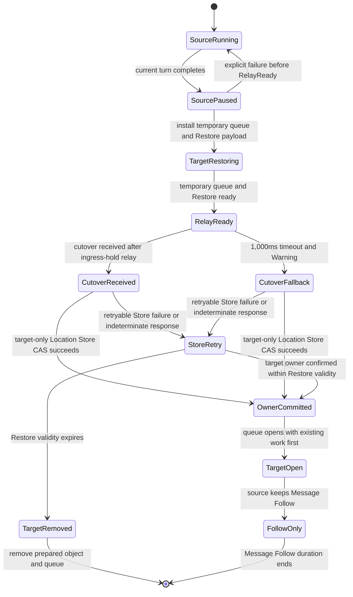
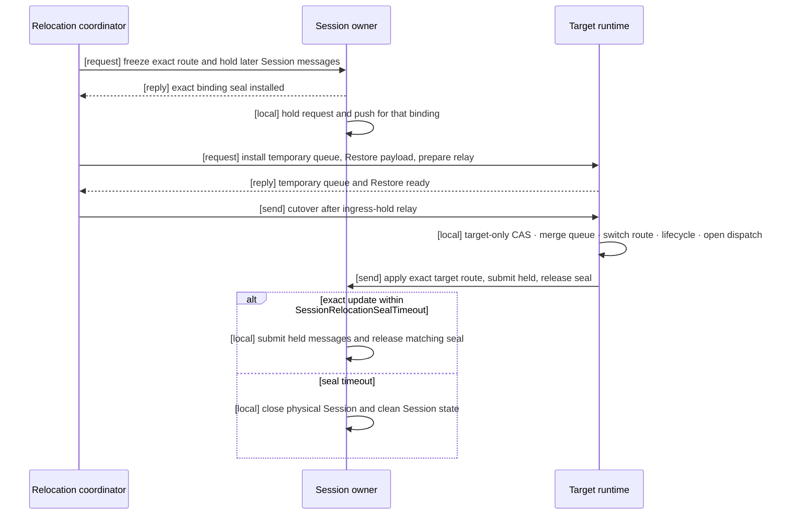

# 52. Relocation Handoff State Transitions

> **Document status — internal design, not normative public specification.** This chapter explains implementation structure used to satisfy the linked public contracts. It does not add or change application-visible behavior.

[Internals index](README.en.md) · [Formal contract](28-relocation-flow.en.md) · [Previous: 51. Service Wire Protocol](51-internal-service-wire-protocol.en.md)

> **What this chapter explains** — the source, target, and Session state transitions and
> queue ownership that the C++, .NET, JVM, and Node.js runtimes use to implement Actor
> and Spot relocation in the same order.

This document creates no new public behavior. The application-visible result is owned by
[Complete Actor And Spot Relocation Flow](28-relocation-flow.en.md). This chapter
explains the internal decisions that must not diverge while the four runtimes produce
that result.

## 1. Decision: Use One Common Handoff

Actor Join, host relocation, User Spot authority transfer, and Instance Spot relocation
have different initiating APIs and lifecycle callbacks. Their source-to-target owner
change uses one handoff.

**Decision**: before `OwnerCommitted`, only the source is owner; afterward, only the
target is owner. The source-restoration boundary is the earlier point at which
`RelayReady` is accepted. Only an explicit failure before it can return to
`SourceRunning`; afterward, no cutover-submit result rolls back to source.

**Per-language discretion**: each runtime may represent phase as one enum or several
immutable records, and may serialize it with a lock, actor loop, or executor. It may not
change the transition order or allowed reversal above.

## 2. Values Owned By The Handoff

One handoff state per relocation unit owns these values.

| Value | Purpose |
|---|---|
| Object identity | Fixes ActorId or SpotId and `ObjectGeneration`. |
| Source fence | Fixes source node RID/node generation and the initially read owner generation. |
| Target fence | Fixes target node RID/node generation and the requested new owner generation. |
| Relocation identity | Distinguishes retries and late completions belonging to the same handoff. |
| Saved-work reference | Refers to state, existing queue, and timers in the Relocation Store. |
| Relay connection | Fixes TCP order between source relay and the cutover boundary. |
| Temporary queue | Holds work arriving before target dispatch opens. |

This state doesn't own a per-message ACK or numeric high-water. Two transmissions with
the same payload are two accepted messages. Existing duplicate rules apply only where
the transport or request contract already provides a distinct operation identity.

## 3. Source Processing

### 3.1 Stop Order

**Decision**: after target preflight, the source stops in this order.

1. For a bound Actor, ask the Session owner to seal that binding.
2. Finish one running handler or timer callback.
3. Start no new application turn.
4. Capture not-yet-executed queue work, timers, and application state.
5. Start target Restore and hold new old-address messages in the ingress hold.
6. Wait for the target's relay-ready notification.
7. Send only ingress hold over the same target relay connection. The target restores the
   captured queue and timers from the Relocation Store payload; they aren't relayed.
8. Insert cutover one-way into the relay lane. Cutover tells target that all
   pre-boundary relay was sent. Place later arrivals after its boundary.

It doesn't wait for the mailbox to become empty. Stopping source application dispatch
and receiving transport messages are separate operations.

### 3.2 Ordered Relay Boundary

The source sends no ingress-hold relay before the target's relay-ready notification. After that
notification, it sends only post-capture ingress hold on the same TCP connection,
then inserts cutover as `[send]` after the relay lane's current prefix. Cutover reports
that all pre-boundary relay was sent and has no reply. New messages
remain accepted but enter the post-boundary span, so cutover doesn't wait for an empty
mailbox. Once the target reads this boundary, it has read every earlier relay on that
connection.

The saved-work reference exclusively owns the captured existing queue prefix and timers.
Source relay must not recreate those records, and target must not deduplicate saved work
against relay records.

Once relay-ready is accepted, source restoration is forbidden. Every source queued-job
permit and saved-work byte owner remains held until the subsequent one-way cutover submit,
attempted once, reaches a success or failure terminal. That terminal permanently closes
source dispatch and releases these owners exactly once without waiting for a target
completion reply. Only an explicit abort before relay-ready preserves source ownership
and cleans the target staged owner. A later submit failure converges through the target's
1,000ms fallback and doesn't restore source.

A message arriving at the old address after the boundary isn't discarded. Before CAS it
is relayed to the target temporary queue; after CAS it is forwarded through Message
Follow. No global sequence is made to order different connections.

### 3.3 `send` And `request` Relay

The relay lane preserves message kind. It doesn't turn a `send` into a `request` or make
a relayed `request` into a new operation.

| Kind | Relay record | Target handling |
|---|---|---|
| `send` | Retains target identity and payload. | Runs the handler in queue order and creates no response. |
| `request` | Retains operation identity, correlation, reply route, payload, and deadline. | Runs the handler in queue order and sends the response through the original reply route. |

Source isn't the caller of a relayed request. The caller's pending request ends through
the target response or existing deadline. Source must not recreate the request after a
timeout.

## 4. Target Processing

### 4.1 Install The Temporary Queue First

**Decision**: before application-instance lookup or factory invocation, the target
registers a temporary queue for the object identity. A direct message or source relay
arriving during Restore enters this queue without finding a handler.

The temporary queue group keeps the pre-cutover source-relay span separate from the
remaining temporary span. Saved work isn't copied into this group and is restored
separately from the Relocation Store payload.

This group and saved work form an ordered durable backlog before dispatch. Receiving an
ordinary record uses a shared Application Job Queue reservation, which is returned after
a finite handoff of the record and retained-byte ownership into the backlog. A backlog
item holds no live queued-job permit while it isn't runnable.

A target without a temporary queue must neither start Restore nor change the Location
Store.

Once the temporary queue and Restore are ready, target replies that relay reception is
ready. The Restore request asks for temporary-queue installation, payload Restore, and
relay preparation without opening dispatch. Cutover and Session route update are
one-way and have no completion reply.
The target doesn't reply relay-ready until target-side retained-byte ownership exists for
every staged payload.

### 4.2 Only The Target Runs The Location Store CAS

The target confirms this evidence in one place:

- Factory and Restore completed.
- The temporary queue is installed.
- Ordered relay cutover arrived, or 1,000ms elapsed after relay-ready reply.
- Initially read source owner, node generation, `ObjectGeneration`, owner generation,
  and membership still match.

When all match, the target coordinator runs one Location Store CAS. Source, Session
owner, Message Follow, and route cache never run this CAS on its behalf.

| Result | Internal handling |
|---|---|
| CAS succeeds | Confirms `OwnerCommitted` and opens the target queue. |
| Condition differs | Cleans target state and temporary queue. Source dispatch doesn't reopen after cutover. |
| Retryable Store failure | Doesn't open the queue; retries with the same fence and `RelocationId` until Restore validity expires. |
| Response is lost | Re-reads the same key and initially read version to check exact target ownership, then retries until Restore validity expires if needed. |
| Different valid owner or generation | Ends the stale relocation immediately and removes the target object and temporary queue. |
| Restore validity expires | Records a `location_update_failed` Error and removes the prepared Actor or Spot, temporary queue, and relocation state. Sends no Session route update. |

Without cutover for 1,000ms, target records a `cutover_timeout` Warning and runs CAS. A
later or duplicate cutover records only a `late_cutover` Warning and is ignored.

Store retry creates neither another timeout nor a new public setting. Its deadline is
the validity already carried by the relocation payload and Restore operation. A late
Store response for a terminal `RelocationId` doesn't reactivate a cleaned object or queue.

### 4.3 Ordered Backlog And Progressive Queue Admission

After CAS succeeds, target fixes these three spans in one ordered durable backlog:

1. Work and timers the source queue accepted but didn't execute before Capture
2. Work relayed on the same connection before the cutover boundary
3. Remaining work accepted by the target temporary queue during Restore and cutover

It then replaces the temporary route with regular dispatch, finishes required lifecycle
callbacks, and makes application dispatch runnable. Each backlog application-handler turn
acquires one shared queued-job permit before entering the live execution queue, and actual
handler start returns that permit. It must neither reserve permits for the whole backlog
nor open the queue and append existing work afterward. A payload waiting for a permit
remains owned by the target retained-byte owner.

## 5. The Session Owner's Only Responsibility

The Session owner isn't the relocation coordinator. It owns only the physical Session
and binding route.
Inter-component arrows use the formal spec's `[send]`, `[request]`, `[request relay]`,
and `[reply]` notation. Every `[request]` includes its normal-path `[reply]`; runtime-local
processing is marked `[local]`.

**Decision**: only the Session owner validates physical Session identity, SessionRid,
binding generation, ActorId/`ObjectGeneration`, and relocation identity. This confirms
that one binding's seal and route change refer to the same target.

The Session owner doesn't:

- select a target;
- read or write the Location Store;
- revalidate Actor authority;
- decide ordinary server-relay order; or
- seal other bindings on the same Session.

Held Session messages are submitted in their held order after applying the target route.
The matching seal is released after every submission settles as accepted or failed.
Route update produces no response. A duplicate is a no-op; an update after timeout
records only a Warning.

On an explicit failure before relay-ready is accepted, durable abort and source-queue
restoration are fixed first, then source coordinator sends command 44 abort one-way.
Session owner submits the matching seal's held messages to the source route and releases
only that seal. It creates no reply or ACK. An abort after relay-ready, or a late/duplicate
abort for a terminal handoff, doesn't mutate state.

## 6. Validate Once At The Responsible Boundary

| Boundary | Values validated once | Places that don't revalidate them |
|---|---|---|
| Transport ingress | Authenticated peer RID/node generation and frame shape | Target queue, Session owner |
| Target handoff | Source owner fence, target fence, Store version, Restore and cutover or 1,000ms fallback | Source, Message Follow |
| Session owner | Physical Session, SessionRid, binding generation, Actor identity, relocation identity | Actor Join, host relocation, route cache |

A runtime must not reread a value already confirmed by another component from a current
route or mutable cache and invent another rejection condition. Such revalidation makes
languages disagree when the value changes during retry.

## 7. Cutover And Session Seal Timeout

Target waits 1,000ms for cutover after its relay-ready reply. Without cutover, it records
a Warning and runs CAS and queue opening. This fallback doesn't guarantee order between
late relay and a new direct target message. Late or duplicate cutover doesn't mutate
state.

Session owner applies `SessionRelocationSealTimeout` from seal installation. Its default
is 3,000ms and server configuration can change it. If the exact route update is processed
first, Session owner changes route, submits held messages, and releases the seal. If the
timeout is processed first, it closes the physical Session and cleans bindings, held
messages, and seal state. A late update records only a
`late_session_route_update` Warning.

## 8. Relocation Techniques That Must Not Be Added

The following aren't part of this handoff:

- waiting for a mailbox to drain completely;
- a relay protocol requiring a separate ACK per message;
- comparing source and target queues with a numeric high-water;
- rechecking normal TCP delivery with a durable delivery journal;
- a record-count, byte-count, or concurrent-unit capacity gate specific to relocation;
- reserving Application Job Queue permits for the entire pre-dispatch backlog;
- Location Store owner changes performed by source or Session owner;
- guessed rollback to source after an ACK timeout; or
- global ordering across different TCP connections.

Existing resource limits that apply to all features — runtime memory, frame size, Store
page size, and payload size — still apply. They aren't duplicated as relocation state or
a new public setting.

## 9. Adapter By Object Kind

The common handoff doesn't branch on object kind. Each adapter provides only these
values.

| Adapter | Values it provides |
|---|---|
| Entry Spot Actor | Actor state and source/target membership CAS values |
| `PerActor` User Spot authority | Spot authority state and owner CAS values |
| `PerActor` member Actor | Actor state and independent membership CAS values |
| `SpotWide` User Spot | Spot/member Actor state and atomic batch CAS values |
| Instance Spot | Spot state, queue, timers, and owner CAS values |

The adapter handles factory, callback, and membership representation. Queue merge,
target-only CAS, timeout, and Session responsibility aren't reimplemented per adapter.

## 10. Language-Parity Confirmation

Each runtime verifies the same scenario table through its production path.

- Cutover completes while source mailbox input continues.
- Ingress-hold relay count is zero before target reports relay reception ready.
- The saved queue prefix and timers are restored once from the Relocation Store and never made into relay records.
- Relay-ready and final relocation completion aren't merged into one state or callback.
- Relocation Location Store write count is zero before Restore, and owner/membership/authority change count is zero before the cutover boundary. A post-Restore `Prepared` write that retains source ownership is allowed.
- CAS attempts run only at target and zero times at source and Session. Retries keep the
  same fence and `RelocationId`.
- CAS conflict runs zero target handlers and performs zero Session route changes.
- Saved work, pre-boundary relay, and later temporary work retain that order.
- A staging receive reservation returns after durable handoff, and the post-CAS backlog acquires live permits in order.
- A backlog larger than the live-job limit reaches terminal without reserving every permit first.
- Target byte ownership exists before relay-ready. Source permits and byte ownership remain until the post-acceptance cutover submit reaches a success or failure terminal, and each owner cleans once.
- In the same queue, `send` produces zero responses and `request` produces one response through the original reply route.
- Request operation identity and deadline don't change during relocation.
- Bound Session work is held during seal and submitted after target route application.
- Cutover and Session route update are one-way and wait for no reply.
- Failure to confirm owner transition before Restore validity expires removes the target
  object and queue.
- A late or duplicate cutover, Session update, or terminal Store response performs zero
  state mutation and only logs.
- The flow works without a separate high-water, per-message ACK journal, or relocation capacity gate.
- Actor, all three User Spot units, and Instance Spot use the same handoff implementation.

**Per-language discretion** covers queue container, synchronization primitive, async
result type, and log backend. Phase order, CAS writer, queue merge order, Session
validation scope, and failure direction aren't discretionary.
