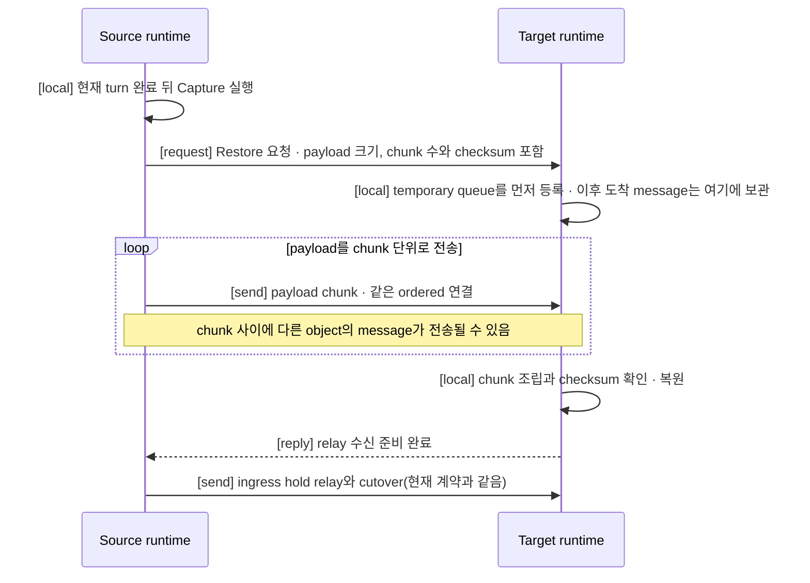

# Relocation 중단 시간 개선 제안

> **이 문서는 구현 전 초안이며 현재 계약이 아니다.** 정식 계약은
> [Actor와 Spot relocation 전체 흐름](../server/28-relocation-flow.ko.md)과
> [Host relocation 전체 흐름](../server/30-host-relocation-flow.ko.md)이 소유한다.
> 이 문서의 제안이 확정되면 해당 정식 스펙을 갱신하고 이 초안은 폐기한다.

## 1. 목적과 범위

이 문서는 Actor·Spot relocation에서 application이 관찰하는 서비스 중단 시간을
줄이는 여섯 가지 변경을 제안한다. 중단 시간은 source admission seal이 적용된
시점부터 cutover submit이 끝날 때까지를 뜻하며, 측정 규칙은
[Host relocation 전체 흐름 §7.1](../server/30-host-relocation-flow.ko.md#71-relocation-unit별-서비스-중단-시간-목표)이
정의한다.

모든 제안은 다음 결과를 바꾸지 않는다.

- Owner는 target만 실행하는 Location Store CAS 한 번으로 바뀐다. Source와
  Session owner는 Location Store를 변경하지 않는다. 이 문서가 바꾸는 것은
  application state payload의 전달 경로이며, owner를 기록하는 Location Store
  계약이 아니다.
- Relay와 cutover에 message별 ACK, 숫자 high-water 또는 durable delivery
  journal을 추가하지 않는다.
- Source 또는 target process가 종료된 뒤 다른 runtime이 relocation을 이어받지
  않는다. Crash 구간의 exactly-once는 보장하지 않는다.

두 가지 선행 조건이 있다. 첫째, §3의 유효 예산·chunk 계산은 Core 공개 계약
확장(pipe별 적용 HWM·accounted charge 조회)을 전제한다(§3.3). 확장 전에 도입하는
배치는 1단계로 관찰 없이 role별 하한 기반의 고정 보수 예산을 사용하고, 확장이
도입되면 동적 계산으로 전환한다. 둘째, chunk header·checksum·cutover 확인 값은
여러 언어 runtime이 같은 wire를 사용하는 새 형식이다 — mesh에서 source와 target이
서로 다른 언어 runtime인 relocation은 정상 경우이므로, 이 형식은 언어 중립 단일
정의와 교차 언어 검증(§11)을 요구한다.

| 제안 | 줄이는 시간 | 변경하는 계약 |
|---|---|---|
| §3 payload를 source에서 target으로 직접 전송 | 중단 구간 안의 Relocation Store 왕복 2회 | Relocation payload 전달 경로와 Relocation Store의 역할 |
| §4 Join 승인 왕복에 target 준비를 함께 싣기 | Seal 뒤 Restore 처리에 포함되는 target 준비 시간. 왕복 횟수는 줄지 않는다 | Cross-node Actor Join 순서 |
| §5 고정 timeout의 설정화 | 직접 줄이지 않음. 순서 미보장 경로와 Session 종료 빈도를 줄인다 | Timeout 상수의 소유 위치 |
| §6 cutover에 완전성 확인 값을 싣기 | 직접 줄이지 않음. 검증 없이 진행하는 fallback 빈도를 줄인다 | Cutover payload와 fallback 진행 조건 |
| §7 source 정지와 서비스 재개의 분리 측정 | 직접 줄이지 않음. 실제 중단 시간을 관찰 가능하게 만든다 | 중단 시간 지표와 완료 뒤 관찰 상태 |
| §8 base/delta capture(선택 capability) | 큰 state에서 seal 뒤 전송량을 변경분으로 축소 | Relocation adapter의 선택 capability |

## 2. 현재 중단 구간에 어떤 왕복이 들어 있는가

현재 계약에서 seal 뒤 cutover까지 network 왕복은 다음 순서다. 번호 2와 4가
Relocation Store 왕복이고, 두 왕복 모두 중단 시간 측정에 포함된다.

1. Source가 현재 application turn을 끝내고 `Capture`를 실행한다.
2. Source가 application state, 실행하지 않은 queue와 timer를 Relocation Store에
   기록하고 확인 reply를 받는다.
3. Source가 target에 Restore 요청을 보낸다.
4. Target이 Relocation Store에서 payload를 읽어 복원하고 source에 relay 수신 준비
   완료 reply를 보낸다.
5. Source가 ingress hold의 message를 relay하고 cutover를 보낸다.

이 경로에서 payload는 network를 두 번 지나간다 — source에서 저장소로 한 번,
저장소에서 target으로 한 번. Source와 target 사이에는 Restore 요청과 relay가
사용하는 ordered mesh 연결이 이미 존재하므로, 같은 payload를 그 연결로 한 번만
보내면 저장소 왕복 2회와 중복 전송이 모두 사라진다.

## 3. 제안 1 — payload를 source에서 target으로 직접 전송한다

### 3.1 제안하는 결과

Source는 `Capture` 결과, 실행하지 않은 queue와 timer 정보를 Relocation Store에
기록하지 않고, target에 보내는 Restore 요청과 함께 source–target ordered mesh
연결로 직접 전송한다. Payload 크기와 관계없이 전달 경로는 이 한 가지다.
크기에 따라 저장소 경로와 직접 경로를 나누지 않는다 — 나누지 않는 이유는 §9가
설명한다.

큰 payload가 공유 연결을 막지 않도록 두 가지 상한을 함께 도입한다.

| 상한 | 제한하는 것 | 정하는 값 |
|---|---|---|
| Chunk 크기 (§3.2) | Frame 하나가 같은 연결의 다른 message를 기다리게 하는 시간 | `RelocationPayloadChunkLimit` |
| In-flight payload 예산 (§3.3) | 진행 중인 모든 relocation payload가 연결 대역폭에서 차지하는 몫 | `RelocationInFlightPayloadBudget` |

Relocation Store는 payload 전달 원본에서 물러나 운영 진단 기록으로 역할이
줄어든다(§3.5).



이 diagram은 정상 경로만 보여준다. 실패 경로는 §3.4가 정의한다.

### 3.2 Chunk 크기

Payload는 설정한 크기 이하의 chunk로 나눠 여러 frame으로 보낸다. 같은 연결에는
다른 relocation의 chunk와 일반 message가 섞여 흐를 수 있으므로, 각 chunk에는
`RelocationId`, target attempt, chunk 순번과 encoded 길이를 붙인다. Target은 이
값으로 chunk가 어느 조립에 속하는지 결정하고, 순번 누락·중복, 이미 종료한
attempt의 chunk와 선언한 길이 초과는 조립에 넣지 않고 명시적 실패로 처리한다.
전체 payload의 checksum은 Restore 요청에 포함해 조립 결과를 검증한다. Checksum은
단일 알고리즘으로 고정하고, 대상은 조립 완료된 payload의 encoded byte 전체다 —
chunk header는 대상에 넣지 않으며 배치는 header의 순번·길이로 확정한다. 제안
알고리즘은 CRC-32C이며 규약을 값으로 고정한다: 다항식 `0x1EDC6F41`(Castagnoli),
초기값 `0xFFFFFFFF`, 입력·출력 bit 반전 사용, 최종 XOR `0xFFFFFFFF` — ASCII
`"123456789"`의 결과가 `0xE3069283`인 표준 규약이다. 언어별 library가 이 규약과
다르게 기본 설정된 경우가 흔하므로, §11의 golden fixture는 알려진 입력의 기대
값을 포함해 차이를 즉시 드러낸다. Header field의 배치와 byte 순서를 포함한 wire 표현은 내부 wire 문서가
언어 중립으로 한 번만 정의하고, 각 언어 runtime은 그 정의를 그대로 사용한다.
언어별로 알고리즘이나 표현이 갈리면 서로 다른 언어 사이의 relocation이 항상
checksum 불일치로 실패하므로, 교차 언어 검증(§11)이 이 정의를 지킨다. 현재
계약에서 Relocation Store가 manifest·chunk·checksum으로 하던 분할·검증을 저장소
대신 전송 구간에서 수행하는 것이다.

| 항목 | 값 |
|---|---|
| 설정 이름(제안) | `RelocationPayloadChunkLimit` |
| 소유 | Server 설정이다. 배치별로 변경할 수 있고, runtime이 자동으로 조정하지 않는다. |
| 적용 대상 | Relocation payload를 나눈 chunk 하나의 encoded 크기 |
| 기본값(제안) | 256 KiB |
| 상한 | Transport가 협상한 frame 한도를 넘을 수 없다. 넘게 설정하면 startup configuration error다. |

Chunk 크기는 저장소 왕복과의 손익 경계가 아니라, frame 하나가 같은 mesh 연결을
사용하는 다른 message를 기다리게 하는 시간의 허용치다. 연결 대역폭에서 chunk
하나의 전송 시간이 그 연결의 message 지연 목표를 침범하면 값을 내린다. Pipe의
적용 HWM이 설정한 chunk 크기보다 작은 배치(예: Compact profile의 좁은 pipe)에서는
유효 chunk 크기를 §3.3의 유효 예산 이하로 함께 낮춰, chunk 하나가 pipe HWM의
oversize 예외에 의존하지 않게 한다.

적용 HWM은 노드마다 다르다. Core의 auto HWM budget은 runtime memory hint를 입력으로
받으므로, VM 기반 언어 runtime은 VM에 할당된 memory 한도를, native runtime은 감지된
시스템 memory를 기준으로 서로 다른 pipe HWM을 계산한다. 각 노드의 유효 chunk와
유효 예산은 자기 적용 HWM을 따라가므로 언어별 차이는 노드 안에서 자동 반영된다.
남는 것은 source와 target의 비대칭이다 — source는 target의 적용 HWM을 알 수
없으므로, target은 seal 전에 이미 존재하는 reply(Join은 §4의 승인 reply, host
relocation은 seal 전 target 준비 확인)에 자기 유효 수신 chunk 상한을 실어 보내고,
source는 자기 유효 chunk 크기와 target이 알린 값 중 작은 값으로 전송한다. 이
협상에 새 왕복은 추가되지 않는다.

광고한 상한이 낡는 문제는 계산 기준으로 막는다. 적용 HWM은 연결 증가나 memory
한도 감소로 광고 뒤에 줄어들 수 있으므로, target은 광고값을 현재 적용 HWM이
아니라 재계산에도 낮아지지 않는 안정 하한(pipe role별 하한 기반의 보수값)으로
계산한다. 그래도 광고값이 낡은 경우의 최후 안전망은 빈 pipe oversize 예외이며,
전송이 직렬화되어 느려질 뿐 잘못되지 않는다. Chunk 설정값과 협상한 frame 한도의
비교는 startup 검사이고, 유효 chunk의 HWM·예산 clamp는 runtime 계산이다 — 서로
다른 두 검사이며 하나가 다른 하나를 대신하지 않는다.

협상 reply가 존재하지 않는 경로도 있다 — `JoinEntrySpot`은 승인 왕복 자체가
없다(§4). 협상 값이 없는 경로에서는 어느 profile에서도 보장되는 role별 하한의
최솟값 이하의 보수 chunk 크기를 사용해, 협상 없이도 oversize 예외에 의존하지
않는다. 하한 값의 출처는 Core auto HWM planner의 profile별 하한 표
([Context](../../../../../../core/doc/spec/core/01-context.ko.md))이며, 현재 표
기준으로 일반 data 역할의 최솟값은 Compact profile의 32 KiB다.

Target은 chunk를 받으면 Framework가 소유하는 조립 buffer로 복사하고 그 chunk의
Core retained-credit lease를 즉시 해제한다. Core의 byte HWM은 pipe의 frame
charge와 그 pipe에서 이전된 retained lease charge의 합을 pipe 단위로 계상하므로
([Core byte HWM](../server/33-core-hwm-application-job-flow.ko.md)), lease를 조립
buffer 수명에 묶으면 payload 전체가 restore와 owner 전환이 끝날 때까지 pipe
HWM을 점유해 같은 pipe의 일반 message 수신을 막는다. 즉시 복사·해제로 pipe에
남는 relocation charge는 전송 중인 chunk 몇 개로 상한된다. Chunk당 복사 1회는
저장소 경로가 저장소에서 읽어 조립할 때 지불하던 비용과 같다. 조립 buffer의
memory는 Core HWM이 아니라 Framework relocation staging의 retained-byte
ownership이 소유한다.

이 즉시 해제에 Core 계약 변경은 필요 없다. Core는 수신 message의 lease를 별도
handle로 반환하고 임의 시점에 해제할 수 있는 public API
(`zlink_recv_with_hwm_budget_lease`, `zlink_hwm_budget_lease_release`)를 이미
제공하며, lease 해제는 exact origin queue의 read credit을 반환해 막혀 있던 송신을
다시 진행시킨다.

Framework Application Job Queue와의 관계도 기존 계약 그대로다. Job queue는 job
개수 기준이고 payload 크기로 job을 가중하지 않으므로 직접 전송이 job 모델에 새
압력을 더하지 않는다. Chunk 수신은
[Core byte HWM과 Application job flow](../server/33-core-hwm-application-job-flow.ko.md)의
relocation staging 경계를 그대로 따른다 — shared reservation으로 receive하고 조립
buffer로 유한하게 handoff한 직후 reservation을 반환하며, application handler를
만들지 않는다. 이때 chunk마다 shared permit을 일시 사용하므로 handler가 포화된
target에서는 chunk 유입이 job queue 여유에 묶여 느려질 수 있다. 이것은 포화를
우회하지 않는다는 job flow 계약이 요구하는 backpressure이며, permit 대기는
oldest-waiter 순서라 일반 message와 공정하게 섞인다.

### 3.3 In-flight payload 예산

Source runtime은 peer 연결별로, Core가 아직 계상 중인 relocation chunk charge의
합계를 관찰한다. 계상 기준은 encoded payload byte가 아니라 frame별 metadata
charge를 포함한 Core accounted charge다. Transport submit이 끝나도 frame이 send
queue에 남아 있는 동안 Core charge는 유지되므로, submit terminal을 반환 시점으로
쓰면 예산이 실제 pipe 점유를 과소평가한다 — 반환 시점은 Core가 그 chunk의
charge를 해제한 것을 관찰한 시점이다. 합계가 예산에 차 있으면 새 relocation
unit은 source admission seal을 적용하기 전에 대기하고, 이미 시작한 unit의 다음
chunk 제출은 여유가 생길 때까지 기다린다. Seal 전 대기이므로 대기하는
Actor·Spot은 그동안 message를 정상적으로 처리하며, 이 대기는 중단 시간 측정에
포함되지 않는다.

이 charge 관찰과 pipe별 현재 적용 HWM 조회는 현재 Core public API에 없다 — 공개
snapshot은 context 합계만 제공한다. 따라서 이 초안의 §3.2와 §3.3은 pipe별 적용
HWM·accounted charge를 조회하거나 변경을 통지받는 Core 공개 계약 확장을
전제하며, 그 확장은 §3.5의 갱신 목록에 포함한다.

예산은 payload 전체 크기가 아니라 동시에 전송 중인 byte를 제한한다. 따라서
예산보다 큰 payload도 chunk가 순서대로 흘러가며 시작하고 완료할 수 있다 —
예산 때문에 시작하지 못하는 payload 크기는 없다. Source가 payload 전체를 cutover
submit terminal까지 memory에 유지하는 규칙은 현재 계약과 같으며, 이 예산은 연결
점유를 제한할 뿐 그 memory 유지량을 제한하지 않는다.

이 예산은 해당 pipe의 Core byte HWM보다 작아야 한다. 같으면 relocation 전송만으로
pipe HWM이 차서 같은 pipe의 일반 message 송신이 함께 멈춘다. 그런데 pipe의 적용
HWM은 auto HWM planner가 context budget과 연결 수에 따라 동적으로 계산하고
profile별 상한(예: Balanced 일반 data 역할 4 MiB)이 있으므로, 이 관계를 startup의
고정 검사로 확정할 수 없다. 대신 pipe마다 유효 예산을 `min(설정값, 그 pipe의 현재
적용 HWM의 1/2)`로 계산한다 — 적용 HWM이 재계산되면 유효 예산도 따라 변하고,
어떤 설정에서도 relocation 전송이 pipe HWM의 절반을 넘게 점유하지 않는다.

경계 값은 다음과 같이 처리한다. 설정값 0은 min 계산에 넣지 않고 예산 검사
자체를 생략한다는 뜻이다. Pipe의 HWM이 수동 무제한이면 HWM 항을 빼고 유효
예산은 설정값 그대로다. 좁은 pipe에서 유효 예산이 유효 chunk 크기보다 작아져도
전송을 막지 않는다 — 이 경우 chunk 하나씩의 직렬 전송을 항상 허용해 어떤
조합에서도 진행 불능이 생기지 않는다. §3.2의
target 즉시 복사·해제와 이 조건이 함께 성립할 때, relocation 전송이 pipe HWM을
통해 일반 message를 막는 경로가 양방향 모두에서 상한된다 — 이것이 최초 설계가
payload를 Relocation Store로 우회시켜 얻던 성질이며, 직접 전송은 이 두 규칙으로
같은 성질을 유지한다.

Host relocation의 동시 이동량도 이 예산이 정한다. Host `Relocate`가 unit들을
이전할 때 같은 target으로 가는 unit들은 그 peer 연결의 유효 예산 안에서만 chunk를
전송하고, 예산이 차 있으면 다음 unit은 seal 전에 대기한다 — coordinator가 동시
unit 수 상한을 별도로 정할 필요가 없다. 예산은 연결당이므로 placement가 unit을
여러 target으로 분산하면 target 수만큼 예산이 병렬로 적용되고, 한 target으로
몰리면 그 연결의 예산이 이전 속도의 병목이 된다. Auto HWM은 peer 연결이 많은
노드일수록 pipe당 몫을 하한 쪽으로 낮추므로 이전 처리량도 함께 낮아질 수 있다.
실제 처리량은 mesh 대역폭, Core queue drain 속도와 target의 복사·조립 속도에
좌우되며 유효 예산은 그 상한 중 하나일 뿐이므로, host operation deadline 산정은
계산식이 아니라 해당 배치에서 관측한 이전 처리량을 입력으로 사용한다.

이 구조에는 명시할 역설이 하나 있다. Target이 이미 포화 상태이면 chunk 유입이
느려지고, 그만큼 source 예산 해제가 늦어 다음 unit의 시작도 늦어진다 — 부하를
덜어내려는 이동이 부하 때문에 느려지는 것이다. 이것은 포화를 우회하지 않는다는
backpressure 계약의 의도된 결과이며, relocation을 위해 우회로를 만들지 않는다.
회피가 목적인 host relocation이 deadline 안에 끝나지 않으면 새 unit을 시작하지
않는 기존 규칙이 적용되므로, 운영자는 deadline 연장 또는 target 부하 완화를 먼저
판단한다.

전송 통로의 memory 점유도 예산으로 상한된다. Socket buffer와 core queue는 지나간
byte 총량이 아니라 동시에 들어 있는 byte만 차지하며, 그 양은 송신 방향에서 예산
이하, 수신 방향에서 즉시 복사·해제로 전송 중인 chunk 범위 이하다. Source와
target이 payload 전체 사본을 유지하는 비용은 저장소 경로와 같고, 통로 점유는
저장소 client 연결에서 mesh 연결로 옮겨 온 것이지 새 비용이 아니다. 예산은 peer
연결당이므로 노드 전체의 동시 relocation 통로 점유는 예산과 활성 peer 연결 수의
곱까지 커질 수 있다. 노드 전체 상한이 필요한 배치를 위해 node-wide 예산(제안 이름
`RelocationNodeInFlightPayloadBudget`, 기본값 0 = 미적용)을 함께 제공한다. 계상
단위는 peer 예산과 같은 Core accounted charge 합계이고, chunk 제출은 peer 예산과
node 예산을 모두 만족해야 하며 대기는 oldest-waiter 순서다. 이미 전송을 시작한
unit을 node 예산 도달을 이유로 실패시키지 않는다.

| 항목 | 값 |
|---|---|
| 설정 이름(제안) | `RelocationInFlightPayloadBudget` |
| 소유 | Server 설정이다. 배치별로 변경할 수 있고, runtime이 자동으로 조정하지 않는다. |
| 적용 대상 | Source 노드 하나가 peer 연결 하나에 대해 Core가 아직 계상 중인 relocation chunk의 accounted charge 합계(frame metadata charge 포함). Chunk를 제출할 때 더하고, Core가 그 chunk의 charge를 해제한 것을 관찰하면 뺀다. |
| 기본값(제안) | 16 MiB |
| 0 설정 | 예산을 적용하지 않는다. |

이 예산은 전역 조정 없이 동작한다. 제한하는 자원이 source 노드 자신의 연결
대역폭과 memory이므로, 각 source 노드가 자기가 보내는 byte만 세면 된다. Host
`Relocate`처럼 조정자 하나가 unit을 순서대로 이전하는 경우뿐 아니라, application
요청으로 여러 node에서 동시에 시작되는 Actor Join relocation에도 같은 방식으로
적용된다.

현재 계약은 relocation에 전용 capacity 제한을 두지 않고, 이미 시작한 relocation을
capacity 도달을 이유로 실패시키지 않는다고 정한다
([28 §5.3](../server/28-relocation-flow.ko.md#53-relocation-전용-capacity-제한을-두지-않는다)).
이 예산은 그 규칙 중 뒤쪽은 유지하고 앞쪽을 바꾼다 — seal 전에 시작을 늦출
뿐이며, 이미 chunk 전송을 시작한 relocation은 예산을 이유로 실패시키지 않는다.
28 §5.3의 문구는 확정 시 이 경계에 맞게 갱신해야 한다(§3.5).

예산이 계속 차 있는 지속 과부하에서는 대기 중인 relocation이 operation deadline에
도달해 `DeadlineExceeded`로 끝날 수 있다. 이것은 저장소 경로의 결과와 다르지 않다
— 같은 과부하에서 저장소 경로는 저장소 요청 대기 행렬에서 같은 deadline에
도달하며, payload를 network에 두 번 실어 총 전송량은 더 크다.

### 3.4 실패했을 때 무엇이 남는가

직접 전송의 실패 규칙은 현재 계약의 "relay 수신 준비 reply가 accepted 상태가
되기 전 명시적인 실패" 경계를 그대로 사용한다. Source는 relay-ready reply가
accepted 상태가 될 때까지 payload 전체의 retained-byte owner이므로, reply 전
실패의 복원 원본은 저장소가 아니라 source memory다.

| 발생 시점 | 결과 |
|---|---|
| Target이 명시적인 실패 reply를 보냄 | Source는 payload를 다른 target에 다시 보내지 않는다. Memory에 유지한 payload로 source queue를 복원하고 operation을 실패로 끝낸다. Target은 조립 중인 chunk와 준비한 자원을 제거한다. |
| Checksum 불일치 | Target은 복원을 시작하지 않고 relay-ready reply를 보내지 않으며 명시적 실패로 응답한다. Source는 위와 같이 복원한다. 부분 조립 payload로 복원을 시도하지 않는다. TCP 위에서 checksum 불일치는 일시적 전송 오류가 아니라 구현 결함이나 memory 손상의 신호이므로 재시도하지 않는다. |
| Relay 수신 준비 reply를 받지 못한 채 connection이 끊김 | 현재 계약의 불확정 규칙과 같다. Target이 이미 reply를 보내고 fallback으로 진행했을 수 있으므로 source dispatch를 다시 열지 않는다. 명시적인 실패 reply를 받은 경우만 복원 대상이다. Target이 owner 전환에 도달하지 못하면 Restore 유효시간 규칙으로 준비 자원을 정리한다. |
| Relay 수신 준비 reply가 accepted 상태가 된 뒤의 실패 | 현재 계약과 같다. Source dispatch를 다시 열지 않고 target이 owner 전환을 계속한다. |
| Source 또는 target process 종료 | Target 종료는 connection 단절로 관찰되므로 위의 불확정 규칙을 따른다. Source 종료는 그 node의 다른 object와 같은 owner process 장애 결과를 따른다. 현재 계약도 진행 중인 relocation을 다른 runtime이 이어받지 않으므로, 복구 가능 범위는 현재 계약과 같다. |

조립 buffer 할당 실패, 부분 복사, validation 실패, cancellation과 shutdown에서는
아직 해제하지 않은 chunk lease와 이미 조립 buffer로 복사된 byte가 서로 다른
owner이며, 각각 정확히 한 번 정리한다. 한 owner의 정리가 다른 owner의 조기
반환이나 double release를 만들지 않는다 — Core byte HWM과 application job flow
계약의 공통 정리 규칙을 그대로 따른다.

### 3.5 Payload identity 결합과 Relocation Store에 남는 역할

현재 계약은 Location Store의 `Captured` record가 payload 위치와 checksum을
가리키고, target은 그 record가 가리키는 payload만 사용해 "이 bytes가 이 이동의
공식 snapshot"임을 확정한다. 직접 전송에서는 이 결합을 Restore 대화의 exact
identity가 대체한다 — Restore 요청, 각 chunk와 target의 Location Store CAS는 같은
`RelocationId`, target attempt와 source fence로 결합되고, target은 exact identity가
아닌 Restore와 chunk를 staging에 연결하지 않고 폐기한다. 늦게 도착한 이전
attempt의 payload가 현재 이동에 섞이는 경로는 없다. 귀속 판정의 입력은 message의
종류나 방향 추론이 아니다 — chunk와 Restore가 어느 이동에 속하는지는 도착한
connection과 message가 실은 exact identity로만 판정한다. 같은 exact identity의 Restore
재전송은 선언한 payload 길이와 checksum이 처음 값과 같을 때만 기존 staging을
재사용한다. 같은 identity에 다른 길이나 checksum이 도착하면 기존 staging을
재사용하지도 덮어쓰지도 않고 명시적 conflict 실패로 끝낸다 — 저장소 경로가 같은
reference의 다른 bytes를 conflict로 처리하던 결과와 같다.

이 제안이 Relocation Store에서 제거하는 것은 Actor·Spot relocation의
state·queue·timer handoff 경로 하나다. Relocation Store가 소유하는 다른 정상 실행
책임은 그대로 남고, relocatable factory 또는 Instance Spot factory가 있는 배치의
provider 등록 요구도 그대로 유지된다.

- Instance Spot cold activation의 최초 message와 생성 정보 저장
- Relocation 뒤 완료되는 pending request의 reply payload와 terminal 결과 기록

운영자의 이동 이력 관찰은 저장소 record가 아니라 §7의 구간 지표와 trace가
담당한다. Relocation Store SPI에 이력 조회를 추가하지 않는다.

Handoff payload를 저장소에 보관하지 않으므로 그 보관 기간 개념도 사라진다.
현재 계약이 "relocation payload와 Restore operation이 가진 absolute deadline"으로
정하던 CAS retry와 Restore 유효시간의 기준은 Restore operation의 absolute
deadline 하나가 된다.

확정 시 다음 정식 문서를 함께 갱신해야 한다.

| 문서 | 갱신할 내용 |
|---|---|
| [Location runtime](../server/21-location-runtime.ko.md) | `Captured` record의 payload 위치·checksum 결합을 Restore 대화의 exact identity로 교체. Instance Spot activation과 pending request terminal 기록 책임은 유지 명시 |
| [Relocation Store provider](../server/23-relocation-store-redis.ko.md) | Provider 계약에서 relocation handoff payload를 제거하고 남는 책임으로 범위 축소 |
| [Actor와 Spot relocation 전체 흐름](../server/28-relocation-flow.ko.md) | "Relocation Store payload가 유일한 handoff 원본" 규칙을 source memory와 직접 전송으로 교체. §5.3의 capacity 규칙에 in-flight 예산의 seal 전 대기 경계 반영. Restore 유효시간의 기준을 Restore operation deadline으로 단일화. Cutover 재전송 창(§6) 반영 |
| [Spot과 Actor membership](../server/15-spot-actor.ko.md) | Join 준비 동승 순서(§4), 변경분 capture capability(§8)와 Restore 실패 계약의 payload 원본 서술 |
| [Spot·Actor routing](../server/18-object-routing.ko.md) | Temporary queue 설치 시점과 relay 서술에서 저장소 payload 참조 갱신 |
| [Host relocation 전체 흐름](../server/30-host-relocation-flow.ko.md) | Preflight의 Store 확인 조건, unit 이전 순서의 저장 단계, 중단 시간 지표(§7)와 `Relocated`·`Shutdown` 관계 |
| [Runtime monitoring](../server/24-runtime-monitoring.ko.md) · [Runtime metrics](../server/25-runtime-metrics.ko.md) | S0–S4 구간 지표, `SafeToShutdown` 관찰 상태와 `cutover_timeout` counter의 정식 소유 |
| [Core byte HWM과 Application job flow](../server/33-core-hwm-application-job-flow.ko.md) | State chunk는 durable backlog로 retained lease를 이전하지 않고 조립 buffer 복사 직후 반환한다는 ingress 서술 추가(§3.2). Lease 해제는 기존 public API로 충분하다 |
| Core 공개 계약([Context](../../../../../../core/doc/spec/core/01-context.ko.md), socket public header) | Pipe별 현재 적용 HWM과 accounted charge를 조회하거나 변경을 통지받는 public API 추가. §3.2·§3.3의 유효 예산·chunk 계산이 이 확장을 전제한다 |
| [용어집](../server/01-glossary.ko.md) | 새 설정 이름, 변경분 capture capability와 관찰 상태 용어 |
| 언어별 exact interface | Server 설정, relocation adapter surface와 runtime 관찰 표면의 선언 |

Restore·chunk·cutover의 wire 형식을 소유하는 내부 설계 문서
([51](../server/51-internal-service-wire-protocol.ko.md))도 갱신 후보다.

### 3.6 무엇과 바꾸는가

| 얻는 것 | 잃는 것 |
|---|---|
| 모든 크기의 payload에서 중단 구간 안의 저장소 왕복 2회 제거. Payload가 network를 한 번만 지나간다. | Payload 전달 계약 자체를 교체하므로 §3.5의 갱신 목록에 있는 정식 문서를 함께 갱신해야 한다. |
| 전달 경로가 하나이므로 contract test 표면이 늘지 않는다. | 저장소의 durable payload 사본이 사라진다. 현재 계약에서도 이 사본은 crash 복구에 사용되지 않으므로(진행 중 relocation을 이어받지 않음) 잃는 것은 진단 조회 편의이며, §7의 구간 지표와 trace가 이를 대신한다. |
| Relocation Store 부하와 provider 의존이 준다. | Chunk 조립과 in-flight 예산 관리가 transport 구현에 추가된다. |

"Payload가 network를 지나는 횟수가 준다"와 "모든 배치에서 전송 시간이 준다"는
다른 주장이다. 현재 저장소 경로는 chunk를 병렬 stripe로 저장·복원하므로,
저장소가 mesh와 분리된 고대역폭 network에 있는 배치에서는 매우 큰 payload의
전송 시간이 단일 mesh 연결을 쓰는 직접 경로보다 짧을 수 있다. 그런 배치가
실제 요구가 되면 benchmark로 §9의 단일 경로 결정을 재검토한다.

## 4. 제안 2 — Join 승인 왕복에 target 준비를 함께 싣는다

### 4.1 제안하는 결과

Cross-node Actor Join은 이동을 시작하기 전에 target User Spot의 `OnActorJoin`
callback으로 수용 여부를 묻는 request를 이미 target node에 보낸다. 순서는
[Spot과 Actor membership §4.2](../server/15-spot-actor.ko.md#42-다른-node의-spot으로-actor를-join하는-순서)가
정의한다. 이 제안은 그 승인 request에 relocation temporary queue 등록과 factory
준비 요청을 함께 싣는다.

- 승인 request를 처리한 target은 `Accepted`를 반환하기 전에 해당 ActorId와
  `ObjectGeneration`의 temporary queue를 등록하고 factory 실행을 준비한다.
- 승인 뒤 source가 보내는 Restore 요청에서 target은 준비를 반복하지 않고 복원만
  실행한다. Restore request와 relay-ready reply 왕복 자체는 그대로 남는다 — 이
  제안이 줄이는 것은 그 왕복의 처리에 포함되던 target 준비 시간이지 왕복 횟수가
  아니다.
- `Rejected`를 반환하는 경우 target은 같은 처리 안에서 등록한 temporary queue와
  준비한 factory 자원을 제거한다. 거절이 소수 경로이므로 정리 비용은 승인 경로의
  이득보다 작다.

이 제안은 target이 User Spot일 때만 적용된다. `JoinEntrySpot`은 target에서
`OnActorJoin`을 호출하지 않아 함께 실을 승인 왕복 자체가 없으므로, Entry Spot
join은 현재 계약대로 Restore 요청에서 준비를 수행한다. 준비만을 위한 별도
request를 추가하면 왕복이 줄지 않고 늘어난다.

### 4.2 바꾸지 않는 것

- 승인 결과와 membership commit 규칙은 바꾸지 않는다. `Accepted`는 여전히 수용
  결정일 뿐이고 owner 전환이 아니다.
- Temporary queue가 등록되어 있어도 Location Store CAS 전에는 application handler를
  실행하지 않는다. 이 규칙은 현재 계약과 같다.
- 승인 뒤 이동이 시작되기 전에 source가 실패하면, target은 Restore 유효시간 규칙과
  같은 방식으로 준비한 자원을 제거한다. 준비만 된 target이 owner가 되는 경로는
  없다.
- 승인이 `Accepted`여도 그 뒤의 relocation policy 검사(`DisableRelocation`),
  capacity 충돌이나 state 호환성 실패로 이동이 시작되지 않을 수 있다. 준비 자원은
  `RelocationId`와 target attempt를 포함한 exact identity로 식별하고, 이동이
  시작되지 않으면 준비 유효시간이 지난 뒤 target이 제거한다. Exact identity가
  다른 중복 승인이나 Restore는 기존 준비 상태를 재사용하지 않는다.
- 같은 object의 relocation temporary queue는 하나만 존재한다. 기존 준비가 정리되기
  전에 다른 exact identity의 승인이나 Restore가 도착하면, target은 기존 준비
  상태를 먼저 abort·정리한 뒤 새 identity의 준비를 만든다 — 나중 attempt가
  유효하다. 이전 identity의 늦은 chunk와 Restore는 §3.5의 규칙대로 폐기된다.

## 5. 제안 3 — 고정 timeout을 server 설정으로 옮긴다

### 5.1 무엇이 문제인가

현재 계약은 두 상수를 고정값으로 정의한다.

| 상수 | 현재 값 | 초과했을 때의 결과 |
|---|---|---|
| Cutover 대기 | 1,000ms 고정 | Target이 Warning을 기록하고 CAS를 진행한다. 이 경로는 boundary 전 relay와 새 message 사이의 순서를 보장하지 않는다. |
| `SessionRelocationSealTimeout` | 기본 3,000ms, server 설정 가능 | Session owner가 physical Session을 종료한다. Client는 재접속과 explicit bind를 다시 수행한다. |

Cutover 대기 1,000ms는 순서 보장을 포기하는 경로로 들어가는 조건인데 network
왕복 시간과 무관하게 고정되어 있다. 왕복 시간이 짧은 배치에서는 필요 이상으로
길고, 왕복 시간이 긴 배치에서는 fallback이 자주 발생해 순서 미보장 경로가 일반
경로처럼 동작한다.

### 5.2 제안하는 결과

- Cutover 대기를 `SessionRelocationSealTimeout`과 같은 방식의 server 설정으로
  옮긴다. 기본값은 현재와 같은 1,000ms를 유지하므로 설정하지 않은 배치의 동작은
  바뀌지 않는다.
- `cutover_timeout` Warning의 발생 횟수를
  [Runtime metrics](../server/25-runtime-metrics.ko.md)의 counter로 추가한다.
  이 값이 0이 아니면 해당 배치에서 순서 미보장 경로가 실제로 사용되고 있다는
  뜻이므로, 운영자가 설정을 조정하는 판단 기준으로 사용한다.
- 두 설정 모두 runtime이 왕복 시간을 관찰해 자동으로 조정하지 않는다. 자동 조정은
  같은 mesh 안에서 node마다 다른 경계 값을 만들기 때문이다.

## 6. 제안 4 — cutover에 완전성 확인 값을 싣는다

### 6.1 무엇이 문제인가

현재 계약에서 target은 relay 수신 준비 reply 뒤 1,000ms 동안 cutover가 오지 않으면
Warning을 기록하고 CAS를 진행한다. 이 fallback 경로는 boundary 전 relay가 모두
도착했는지 확인할 방법 없이 진행하므로, late relay와 새 target message 사이의
순서를 보장하지 않는다. 이 초안 전체에서 정합성이 약해지는 유일한 경로가 이곳이다.

### 6.2 제안하는 결과

Cutover control에 다음 확인 값을 함께 싣는다. Message별 ACK나 target completion
reply는 추가하지 않는다.

| 값 | 확인하는 것 |
|---|---|
| `RelocationId` | 어느 이동의 boundary인지 |
| Boundary 전 relay record 수 | 수신한 relay 개수와 일치하는지 |
| Boundary 전 relay 전체의 checksum | 수신한 내용이 완전한지 |

Target의 진행 조건은 다음과 같이 바뀐다.

1. Cutover가 도착하면 record 수와 checksum을 수신 relay와 대조한다. 일치하면
   현재 계약대로 즉시 CAS를 진행한다. Ordered connection에서 cutover가 도착했다면
   앞선 relay도 도착한 것이므로 이 대조는 정상 경로에서 항상 성공하며, 대조
   실패는 구현 결함을 뜻하는 Error다.
2. Connection이 끊겨 cutover가 유실된 경우, source process가 실행 중이면 source는
   새 connection으로 ingress hold의 boundary 전 batch와 cutover를 다시 보낸다.
   Target은 부분 수신한 boundary 전 relay 구간을 폐기하고 재전송 batch 전체로
   원자적으로 교체한다 — 개별 중복 제거나 부분 병합이 아니라 전체 교체이므로,
   새 connection에서도 구간 안의 순서가 batch 순서로 확정된다. 확인 값이 일치하면
   CAS를 진행한다.
3. 재전송도 받지 못한 채 cutover 대기 시간이 끝나면 현재 계약과 같이 Warning을
   기록하고 CAS를 진행한다. 이 경로의 순서 미보장은 남지만, 재전송이 대부분의
   connection 장애를 흡수하므로 이 경로에 들어가는 빈도가 줄어든다.

§5의 cutover 대기 설정은 이 제안과 함께 "blind 진행까지의 대기"에서 "재전송을
기다리는 상한"으로 의미가 바뀐다. §5의 `cutover_timeout` counter는 순서 미보장
경로의 실제 사용 빈도를 그대로 보여준다.

이 제안은 순서 미보장 경로를 제거하는 correctness 강화가 아니라, 그 경로에
들어가는 빈도를 재전송으로 줄이는 복구 경로 추가다. 확인 값이 정상 도착하는
경로에서는 ordered connection이 이미 완전성을 보장하므로 대조는 방어 검사이고,
재전송까지 실패한 마지막 fallback은 여전히 검증 없이 진행한다.

재전송을 위해 source는 boundary 전 batch와 cutover의 사본을 최초 cutover submit
terminal 뒤에도 cutover 대기 설정(§5)과 같은 시간 동안 유지한 뒤 정리한다. 이는
현재 계약이 cutover submit terminal에서 source retained-byte owner를 정리하는
규칙을 그 시간만큼 늦추는 변경이다. §7의 S1과 Host `Relocated`의 의미는 최초
submit terminal 그대로 유지한다. Source가 이미 정리되거나 종료된 뒤에는 재전송이
불가능하고 target은 위 3의 경로로 진행한다 — `Relocated` 직후 `Shutdown`을
호출하는 배치에서는 재전송 창이 사라질 수 있으며, 이를 피하려는 orchestrator는
§7의 관찰 상태를 확인한 뒤 종료한다. 이 안내가 성립하도록 `SafeToShutdown` 게시 조건에 재전송 창을 포함한다 — 게시는
모든 unit의 S4 도달과 각 unit 재전송 창 종료를 모두 요구한다. S4(Message Follow
route 제거 가능)와 재전송 창 종료는 둘 다 source에서 일어나는 사건이므로 이
판정에 다른 node의 시각은 필요 없다(§7). S4의 정의 자체는 follow 기간 만료
기준 그대로이며 재전송 창에 영향받지 않는다.

재전송을 위해 유지하는 batch 사본은 pipe를 점유하지 않는 Framework memory이므로
§3.3의 예산(pipe 점유 charge)에 계상하지 않는다. 이 보관은 source가 cutover
submit terminal까지 유지하던 retained-byte ownership을 재전송 창만큼 연장한
것이고, 창이 cutover 대기 설정(기본 1,000ms) 길이라 별도 상한을 두지 않는다.
보관량을 줄여야 하는 배치는 재전송 창, 즉 cutover 대기 설정을 줄인다.

재전송은 batch 하나를 다시 보내는 것이며 message별 journal이나 ACK가 아니다.
Source process가 종료된 경우 재전송은 불가능하고, 이 한계는 현재 계약의 crash
범위와 같다.

## 7. 제안 5 — source 정지와 서비스 재개를 나눠서 측정한다

### 7.1 무엇이 문제인가

현재 중단 시간 측정은 source admission seal에서 시작해 cutover submit의 terminal
result에서 끝난다. 그런데 target은 그 뒤에 CAS, backlog 병합, lifecycle callback과
dispatch 개방을 수행한다. 즉 현재 지표는 source가 멈춘 시간이며, application이
실제로 관찰하는 서비스 중단 시간(다시 message가 처리되기까지)이 아니다.

또한 Host `Relocated`는 모든 unit의 cutover 전송 시도를 뜻할 뿐 target의 처리
재개를 뜻하지 않는데, 공개 예제는 `Relocated` 직후 `Shutdown`을 호출한다. Source가
Message Follow route를 유지해야 하는 기간과 이 호출 시점의 관계를 운영자가 관찰할
수단이 없다.

### 7.2 제안하는 결과

Relocation unit마다 다음 시점을 기록하고, 구간별 지표로 분리해 게시한다.

| 시점 | 뜻 |
|---|---|
| S0 | Source admission seal 적용 |
| S1 | Cutover submit terminal |
| S2 | Target의 Location Store CAS 확인 |
| S3 | Target application dispatch 개방 |
| S4 | Message Follow route 제거 가능 시점 |

| 지표 | 구간 | 현재 지표와의 관계 |
|---|---|---|
| Source 정지 시간 | S0→S1 | 현재 `zlink.relocation.interruption`과 같다. |
| Target 재개 시간 | S2→S3 | 새 지표. Target dispatch 개방까지의 target-local 구간이다. |
| Route 수렴 시간 | S1→S4 | 새 지표. Source-local 구간이며 Message Follow 유지 기간의 근거가 된다. |

S0·S1·S4는 source가, S2·S3은 target이 각자 자기 clock으로 기록해 자기 지표로
게시한다 — Message Follow route는 source가 소유하므로 S4는 source-local 시점이다. 서로 다른 node의 시각을 직접 빼는 지표는 만들지
않는다 — S0→S3처럼 node를 가로지르는 전체 중단 구간은
[message flow tracing](../server/26-message-flow-tracing.ko.md)의 같은 flow 상관으로
관찰하며, 시각 결합 방법은 tracing 계약이 소유한다. 개별 relocation을 metric
label로 구분하지 않는 현재 관측 규칙도 유지한다. S3은 dispatch 개방 시점이므로,
backlog와 permit 순서 때문에 application이 첫 handler 결과를 관찰하는 시점은
이보다 늦을 수 있다 — S0→S3은 중단 시간의 하한이다.

추가로 source runtime은 자기가 시작한 relocation operation에 대해, 모든 unit이
S4에 도달하고 각 unit의 재전송 창(§6)이 끝난 뒤 관찰 상태(제안 이름
`SafeToShutdown`)를 자기 runtime status에 게시한다. 두 조건 모두 source-local
사건이다. Target의 dispatch 개방(S3)은
target이 처리할 준비가 됐다는 뜻일 뿐 source를 종료해도 된다는 뜻이 아니다 —
Message Follow 기간 전에 source를 종료하면 남은 follow route가 transport와 함께
사라지고, 아직 이전 route를 cache한 sender의 request는 `Unavailable`로 끝난다.
Deployment orchestrator는 이 상태를
[Runtime monitoring](../server/24-runtime-monitoring.ko.md)의 상태 조회·변화
관찰로 확인한 뒤 `Shutdown`을 호출할 수 있다. 이 상태는 완료 ACK가 아니라
source가 게시하고 다른 주체가 관찰하는 값이며, 게시 전에 `Shutdown`을 호출하는
것도 현재 계약대로 허용된다 — 그 경우의 결과(follow route 소실)가 현재와 같을
뿐이다.

## 8. 제안 6 — 변경분만 이전하는 capture (선택 capability)

`PreserveStateWith`의 `Capture`는 seal 뒤에 전체 state를 한 번에 만든다. State가
큰 object는 §3의 직접 전송에서도 seal 뒤 전송량이 state 크기에 비례한다.

Adapter에 선택 capability를 추가한다. 등록한 factory에서만 사용하고, 등록하지
않으면 현재 `Capture`/`Restore` 동작이 그대로 유지된다.

```text
contract pseudocode이며 실제 API가 아니다.

CaptureBase()   // seal 전 turn 경계에서 기준 snapshot을 만든다. 만든 뒤 source는 처리를 계속한다.
CaptureDelta()  // seal 뒤, 기준 snapshot 이후의 변경분만 만든다.
RestoreBase()   // target이 기준 snapshot을 미리 복원한다.
ApplyDelta()    // seal 뒤 도착한 변경분을 적용해 최종 state를 만든다.
```

기준 snapshot 전송도 §3.2의 chunk 규칙과 §3.3의 예산을 그대로 사용한다 — seal 전
전송이므로 같은 연결의 다른 relocation과 예산을 경쟁하며, 이것은 통로 총량 제어의
의도된 결과다. 기준 snapshot은 source가 처리를 계속하는 동안 미리 전송하므로 중단
구간에는 변경분 전송만 남는다. Application state가 구분 불가능한 opaque byte sequence
하나뿐이면 Framework가 변경분을 대신 계산할 수 없으므로, 변경분의 의미는
application이 소유한다. 기준 snapshot 전송 뒤 relocation이 실패하면 target은
기준 snapshot을 제거하며, 부분 적용된 state로 복원하지 않는다.

실패와 재시도는 현재 Restore 계약과 같은 방식을 따른다.

- `ApplyDelta`가 실패하면 그 instance를 폐기하고 새 instance에 `RestoreBase`부터
  반복한다. 부분 적용된 instance를 재사용하지 않는다.
- 변경분은 자신이 참조하는 기준 snapshot의 checksum을 포함한다. Target의 기준
  snapshot과 다르면 적용하지 않고 기준 snapshot부터 다시 전송한다.
- `CaptureDelta` 실패는 seal 뒤의 명시적 실패이므로 §3.4의 복원 규칙을 따른다.
- 기준 snapshot에는 application state만 담는다. Framework queue와 timer는 현재
  계약대로 seal 경계에서 한 번만 확정한다.
- 여러 번의 기준 snapshot 전송 attempt는 §3.5의 exact identity로 구분하며,
  identity가 다른 기준 snapshot에 변경분을 적용하지 않는다.

## 9. 채택하지 않는 변경

검토했지만 이 초안에 포함하지 않는 변경과 이유를 남긴다.

| 변경 | 채택하지 않는 이유 |
|---|---|
| 작은 payload만 직접 전송하고 큰 payload는 Relocation Store를 유지하는 크기별 이중 경로 | 직접 전송은 payload가 network를 지나는 횟수를 절반으로 줄이고, 이중 경로는 같은 실패 규칙을 두 벌 검증해야 한다. 큰 payload의 공유 연결 점유는 chunk 상한(§3.2)과 in-flight 예산(§3.3)이 해결한다. 분리된 저장소 network의 병렬 stripe가 대형 payload에서 더 빠른 배치가 실제 요구로 확인되면 §3.6의 benchmark 재검토로 다시 판단한다. |
| Session route update를 CAS 직후, target queue 개방 전에 보낸다 | Bound push 정지 시간을 줄이지만, route update가 "target owner와 queue가 준비됐다"는 뜻이라는 현재 계약을 약하게 만든다. 줄어드는 시간이 queue 개방 시간뿐이라 이득이 작다. |
| Relay에 message별 ACK 또는 delivery journal을 추가한다 | Crash 구간 exactly-once를 넓히지만 relay 왕복이 message 수에 비례해 늘어난다. 현재 계약이 명시적으로 거부한 결정이며 유지한다. |
| 경계를 오가는 잦은 왕복 이동 자체를 줄이는 지연 규칙 | 이동을 언제 시작할지는 application의 결정이다. Framework 계약이 아니라 각 sample과 application 안내 문서가 다룬다. |
| Location Store를 `Owned → Transferring → Owned` 2단계 상태로 바꾸고 source와 target이 각각 CAS하는 방식 | Crash 뒤 조정자가 이어받을 근거는 생기지만, target-only CAS를 포기하고 정상 경로에 Store 왕복이 늘어난다. 중단 시간을 줄이려는 이 초안의 목적과 반대 방향이다. |
| CAS 성공 뒤 새 owner generation을 모든 후보 sender에 능동 broadcast하는 route cache 무효화 | 현재 계약이 이미 Message Follow relay 통지로 sender cache를 무효화한다. 수시 relocation이 발생하는 application에서 broadcast 비용이 절감되는 Follow 구간보다 크다. |

## 10. 이 초안의 범위 밖으로 분리한 항목

중단 시간이 아닌 다른 목표를 가지거나 다른 문서가 소유해야 하는 항목이다.
별도 초안 또는 내부 설계 문서에서 다룬다.

| 항목 | 분리 이유 |
|---|---|
| Host relocation의 batch 순서를 전역 barrier 대신 unit 의존성 단위로 병렬화 | Unit 하나의 중단 시간이 아니라 host 전체 이전 시간을 줄이는 변경이다. [Host relocation 전체 흐름](../server/30-host-relocation-flow.ko.md) §7의 batch 계약 개정으로 다룬다. |
| CAS 뒤 target-local 단계(backlog 병합, route 전환, lifecycle, dispatch 개방)를 `RelocationId` 기준으로 재시도 안전하게 구성 | 공개 계약이 아니라 내부 실행 구조의 견고성이다. 내부 설계 문서([44](../server/44-internal-relocation-continuity.ko.md))가 소유한다. |
| Ingress hold와 temporary queue의 memory 상한을 위한 저장소 spill | 장애 시 운영 안정성 항목이다. 상한 도달로 relocation을 실패시키지 않는 규칙과의 관계를 별도로 설계해야 한다. |

## 11. 구현 및 contract test 검증 요구

이 초안이 정식 계약이 되면 다음 결과를 검증한다.

- Chunk 하나로 끝나는 payload와 여러 chunk로 나뉘는 payload가 같은 owner 전환
  결과, 같은 실패 규칙과 같은 Message Follow 동작을 보인다.
- Relay 수신 준비 reply 전의 명시적 실패만 source memory에서 queue를 복원한다.
  Reply 전달 결과가 불확정한 connection 단절과 reply accepted 뒤의 실패는 source
  dispatch를 다시 열지 않는다.
- Chunk의 exact identity(`RelocationId`, target attempt, 순번)가 다르면 staging에
  연결되지 않고 폐기된다.
- 예산보다 큰 payload도 시작하고 완료할 수 있으며, Core가 계상 중인 relocation
  chunk accounted charge 합계가 유효 예산을 넘지 않는다.
- 같은 exact identity에 다른 길이나 checksum의 Restore가 도착하면 기존 staging을
  덮어쓰지 않고 명시적 conflict 실패로 끝난다.
- 기존 준비가 남은 상태에서 다른 exact identity의 승인·Restore가 도착하면 기존
  준비가 먼저 정리되고 나중 attempt가 유효하다.
- 조립 실패, cancellation과 shutdown에서 chunk lease와 조립 buffer byte가 각각
  정확히 한 번 정리된다.
- Checksum이 불일치하면 target이 부분 payload로 복원하지 않고 명시적 실패로
  응답한다.
- Chunk 전송 중에 같은 연결의 다른 object message가 chunk 사이에서 전달된다.
- Target이 chunk 수신 직후 Core retained lease를 해제하고, payload 크기와 관계없이
  pipe HWM에 남는 relocation charge가 전송 중인 chunk 범위를 넘지 않는다.
- Chunk 수신이 shared reservation을 receive 전에 얻고 조립 buffer handoff 직후
  반환하며, application job permit을 유지하거나 handler를 시작하지 않는다.
- Pipe별 유효 예산이 그 pipe의 현재 적용 HWM의 절반을 넘지 않고, 적용 HWM
  재계산이 유효 예산에 반영된다.
- Source의 전송 chunk 크기가 target이 seal 전 reply로 알린 유효 수신 상한을 넘지
  않는다.
- In-flight 예산을 넘는 새 relocation unit이 seal 전에 대기하고, 대기 중 해당
  Actor·Spot이 message를 계속 처리한다.
- Join 승인이 `Rejected`이면 target에 temporary queue와 준비한 factory 자원이
  남지 않는다.
- 승인 왕복에서 준비를 마친 target도 Location Store CAS 전에는 application
  handler를 실행하지 않는다.
- Cutover 대기 설정을 바꾼 배치에서 fallback 경로의 결과가 현재 계약의 1,000ms
  경로와 같고, `cutover_timeout` counter가 fallback 발생 횟수와 일치한다.
- Cutover의 record 수 또는 checksum이 수신 relay와 일치하지 않으면 CAS를
  진행하지 않는다. Connection 재수립 뒤에는 부분 수신 staging이 재전송 batch로
  전체 교체되어 record가 한 번만 staging된다.
- 확인 값 검증 없이 진행한 fallback CAS는 Warning과 counter를 남긴다.
- Source 정지 시간 지표가 현재 `zlink.relocation.interruption`과 같은 구간을,
  target 재개 시간 지표가 S2→S3 구간을 각자 local clock으로 측정한다.
- `SafeToShutdown`이 모든 unit의 S4 도달과 각 unit 재전송 창 종료보다 먼저
  게시되지 않으며, 두 판정에 다른 node의 시각을 사용하지 않는다.
- 재전송 창이 끝나면 source의 boundary batch 사본이 정리되고, 그 뒤 재전송이
  발생하지 않는다.
- 서로 다른 node의 시각을 직접 뺀 지표가 없고, node를 가로지르는 구간은 flow
  상관으로만 관찰된다.
- 변경분 capture capability를 등록한 factory에서 seal 뒤에는 변경분만 전송되고,
  등록하지 않은 factory는 현재 `Capture`/`Restore` 동작과 같다.
- 기준 snapshot 전송 뒤 relocation이 실패하면 target에 기준 snapshot이 남지
  않는다.
- Chunk header, checksum과 cutover 확인 값의 wire 표현이 언어 중립 golden
  fixture로 검증되고, 언어 runtime별 재구현 차이가 없다.
- Source와 target이 서로 다른 언어 runtime인 relocation이 교차 언어 harness에서
  chunk 전송, checksum 검증과 owner 전환을 통과한다.
- 협상 reply가 없는 경로의 chunk 크기가 role별 하한의 최솟값을 넘지 않는다.
- 재전송 batch가 부분 수신 staging을 전체 교체하고, 교체 뒤 구간 순서가 batch
  순서와 일치한다.
- 재전송 창 동안의 batch 사본이 §3.3 예산에 계상되지 않고, 창이 끝나면 정확히
  한 번 정리된다.
- Golden fixture가 CRC-32C 규약의 알려진 입력·기대 값을 포함하고, 각 언어
  runtime의 계산 결과가 그 값과 일치한다.
- Checksum 불일치와 exact identity conflict가 source와 target이 서로 다른 언어인
  조합에서도 같은 명시적 실패로 끝난다.
