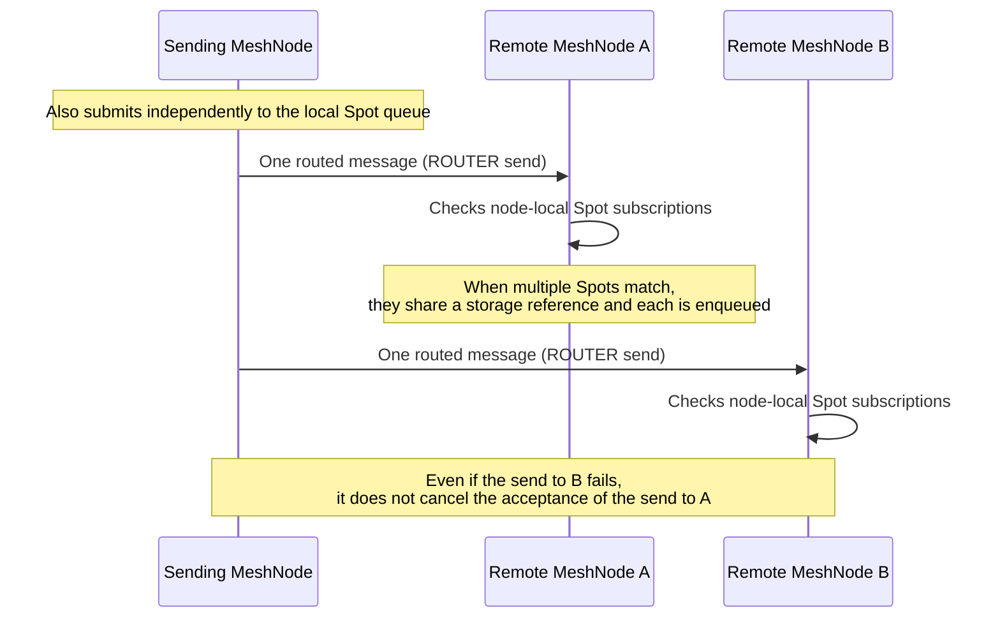

# Framework Overview

[Foundation topic index](README.en.md) · [Spec index](../README.en.md) · [Previous: 02. Framework Messaging Glossary](02-glossary.en.md) · [Next: 04. Interaction Model](04-interaction-model.en.md)

> Defines what upper layer the Framework is, what basic concepts that identify
> mesh and channel scopes refer to, and how a message target is decided and
> which execution owner it is delivered to.

## 1. What The Framework Does

The ZLink Framework is the upper layer that connects a typed message handler, mesh and
channel messaging, [Spot](02-glossary.en.md#spot), Actor, connection sessions, PUB/SUB-style
broadcast, and the location runtime to an application host's lifecycle and DI.

- **The C++, .NET, JVM, and Node.js Frameworks each implement the service
  runtime independently in their own language.** This runtime uses only
  the installed public raw socket API of that language's binding.
- **What the languages share is the public contract, the versioned
  protocol schema, and verification fixtures; they do not share a common
  native runtime or a service C ABI.** This is because the observable
  contract must stay the same even when each language implementation has
  a different binary.
- **Java and Kotlin share one JVM runtime.**

## 2. MeshName, ChannelName, And RouteMesh

[RouteMesh](02-glossary.en.md#routemesh) is the physical connection scope of the
[MeshNode](02-glossary.en.md#meshnode)s that share the same
[MeshName](02-glossary.en.md#meshname) — the name that identifies the physical mesh and RID
namespace that can message each other.

One MeshNode has one routing ID and one ROUTER endpoint.

A MeshNode that
provides a channel handler participates as a Server in one or more immutable
[ChannelName](02-glossary.en.md#channelname)s — the name that identifies the Channel scope a
message is sent to.

A call-only MeshNode, or one dedicated to
[Node direct](02-glossary.en.md#node-direct) — sending by designating a MeshName and target RID
together — can operate without any ChannelName membership.

`MeshName` and `ChannelName` play different roles.

| Name | Meaning |
|---|---|
| [MeshName](02-glossary.en.md#meshname) | The physical mesh and RID namespace that can message each other |
| [ChannelName](02-glossary.en.md#channelname) | A process-local logical address that selects a [RouteMesh](02-glossary.en.md#routemesh) or ClientServer send path |

- **One process can have multiple MeshNodes with different MeshNames.**
  Each mesh is independent and provides no automatic relay.
- **Adding a RouteMesh ChannelName does not add a socket or endpoint.**
  This is because a ChannelName is only a process-local logical address
  and does not create a physical connection.
- **Within the same process, one ChannelName maps to only one RouteMesh
  or ClientServer topology.** In a call role, it points to one send path
  of that topology.

## 3. Message Target Selection

Messaging on a MeshNode is distinguished by how the target is selected.

- [Node direct](02-glossary.en.md#node-direct) designates one RID within the same MeshName.
- A channel send/request finds a process-local send path by ChannelName, and selects one [ready](02-glossary.en.md#ready) target among that RouteMesh's members or that ClientServer's servers.
- Spot [Logical Multicast](02-glossary.en.md#logical-multicast) targets the remote MeshNodes of a ChannelName and their node-local Spot [subscriptions](02-glossary.en.md#subscription).
- A Spot or Actor message designates a global logical address that identifies a Spot,
  [Spot ID](02-glossary.en.md#spot-id), or an Actor ID. The Framework looks up which node
  currently holds that ID from the value recorded in the Location Store, then places the
  message on the mailbox of the object on that node. The value that records "who currently
  holds it" is called [authority](02-glossary.en.md#authority).
- Spot/Actor create and get-or-create are explicit manager operations the application calls
  directly. The Framework picks the node to create on by object role, remaining capacity,
  [stable type](02-glossary.en.md#stable-type), and per-node placement weight, then returns an
  immutable ref once the object is ready to receive messages.

**Selection and submit are one operation.** An application does not
receive a peer list or a selected RID and repeat send calls itself.

## 4. Logical Multicast And Classic Fanout

Spot Logical Multicast delivers an event to a logical Spot whose
location can change, such as a room, stage, or zone. The sending
MeshNode sends one routed message per remote MeshNode of the target
channel, and the receiving MeshNode checks its own node's subscriptions.

- **When multiple Spots match on the same node, they share a reference
  to the immutable message storage and each is enqueued to its own Spot
  queue.** This is so the message body is not duplicated once per Spot.
- **The HWM, send timeout, and backpressure of a remote send follow the
  ordinary ROUTER rules as-is.** This is because Logical Multicast does
  not have a separate flow-control path.
- **A later target's failure does not cancel a submit an earlier target
  already accepted.** This is because each target is submitted
  independently.

[Classic fanout](02-glossary.en.md#classic-fanout) is an independent
PUB/SUB capability that sends an event to a subscriber that is connected
and has finished subscription setup.

- **A publisher using automatic discovery publishes its actual endpoint
  to a dedicated location descriptor, and an automatic subscriber
  connects to every live publisher of the same ChannelName.**
- **A publisher and subscriber using only manual endpoints can be
  configured without a location store.** A host that does not need a
  MeshNode or Spot can also use this method.
- **Classic fanout does not guarantee storage or replay.** It delivers
  only events published after the connection and subscription are
  finished.

## 5. Execution Owner

The Framework delivers a message to the execution unit that actually
owns the state.

| [Owner](02-glossary.en.md#owner) | Responsibility |
|---|---|
| Node | RID direct and ChannelName handlers, node-initiated completions |
| Spot | [Spot direct](02-glossary.en.md#spot-direct) — send/request delivered by one global Spot ID — Logical Multicast subscription, timers, and Spot state. An Instance Spot uses only direct and timer, not Actor [membership](02-glossary.en.md#membership) or Logical Multicast subscription. |
| Actor | Actor direct messages, Actor lifecycle, and the per-Actor mailbox |
| [STREAM session](02-glossary.en.md#stream-session) — the server-side execution unit kept alive from accepting one STREAM connection until it closes | Connection lifecycle, packet dispatch, and Actor-binding ingress |

- **An application is not required to redistribute a Spot or Actor
  message from a Node handler.** This is because the Framework service
  runtime drains the per-owner bounded mailbox and connects it directly
  to the registered handler's execution context.
- **Transport readiness and the service protocol frame are not exposed
  to an application callback.** This is so an application can continue
  processing using only the per-owner execution state.

## 6. Connection Management

Automatic discovery uses a [location store](02-glossary.en.md#location-store)'s
[descriptor](02-glossary.en.md#descriptor) and lease.

- **RouteMesh looks up a MeshNode descriptor with the same MeshName, and
  a ClientServer client looks up a dedicated server descriptor with the
  same ChannelName.** Neither descriptor is substituted for the other.
- **A host that uses an Object Client/Server role or distributed
  discovery explicitly registers the official Redis location store
  instance.**

A manual peer is a connection intent the application provides, either
as an endpoint or as an expected RID plus endpoint.

- **A manual peer also passes the same MeshName, RID, ChannelName,
  generation, and security admission checks as an automatic-discovery
  peer.** Being manual does not change the message path or handler
  meaning.

A [ClientServer Channel](02-glossary.en.md#clientserver-channel) is a
separate service connection where a client initiates a business call
and a server provides the handler and request reply. It is used for a
one-way service boundary that does not need Node direct, Spot, Actor,
or Logical Multicast. The detailed roles and discovery contract are
owned by [ClientServer Channel](../02-channel-transport/03-client-server-channel.en.md).

## 7. What The Framework Hides

The Framework internally manages transport address selection, peer
reconnect, multipart framing, packet codec, reply correlation, and the
backpressure queue. An application handler uses a typed payload and
context, and does not configure raw socket wiring itself.

Authentication, quota, WAF, public API versioning, and billing for an
external edge gateway are not within this framework's contract scope.

## 8. Verification Requirements

Using only the public messaging API (node direct, channel send/request,
Spot Logical Multicast, Spot/Actor message, classic fanout
publish/subscribe, manual peer registration), verify the following.

**Target Selection And Submit**

- Target selection and submit finish in one call — the caller does not
  receive a peer list or a selected RID and repeat send calls itself.
- In Spot Logical Multicast, even if the send to a later target fails,
  the submit for an earlier target that was already accepted is not
  canceled.

**Classic Fanout**

- A classic fanout subscriber receives only events published after the
  connection and subscription are finished — an event published before
  that is not redelivered.

**Connection Admission**

- A manual peer connects only after passing the same MeshName, RID,
  ChannelName, generation, and security admission checks as an
  automatic-discovery peer.

---

[Foundation topic index](README.en.md) · [Spec index](../README.en.md) · [Previous: 02. Framework Messaging Glossary](02-glossary.en.md) · [Next: 04. Interaction Model](04-interaction-model.en.md)
