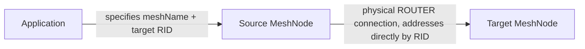
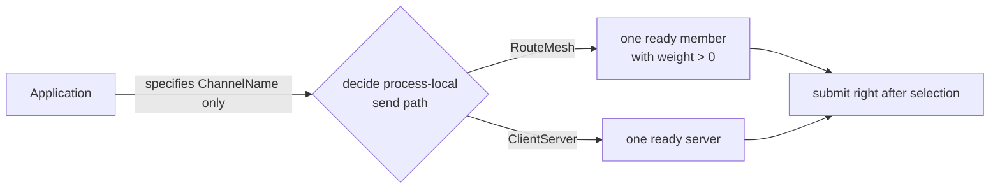
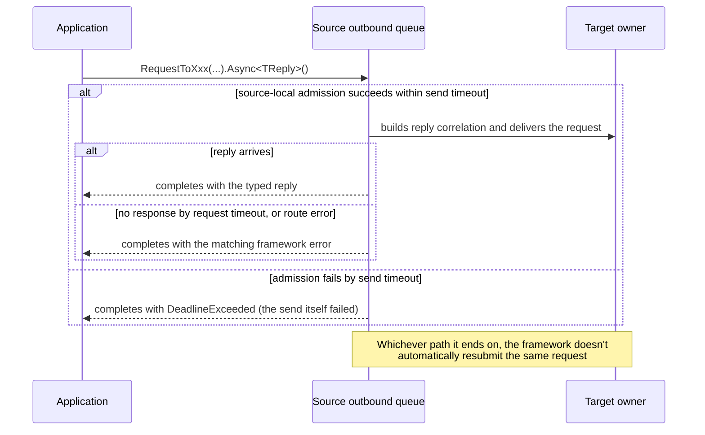
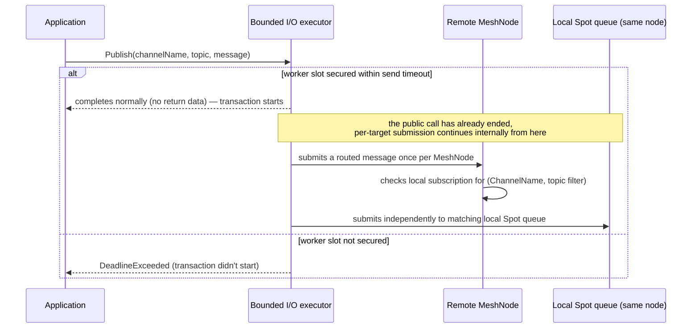

# Interaction Model

[Foundation topic index](README.en.md) · [Spec table of contents](../README.en.md) · [Previous: 03. Framework Overview](03-overview.en.md) · [Next: 05. Message Model](05-message-model.en.md)

> Defines how the target of a framework operation is selected, when the
> completion observed by the application occurs, and which owner performs the
> execution.

## 1. Common Model — Target Selection and Completion

The method of publishing one message to several remote nodes participating in the
same Channel and to a local [Spot](02-glossary.en.md#spot) is called
[Logical Multicast](02-glossary.en.md#logical-multicast). The value the Location Store records for which node
currently processes a global Spot or Actor is called
[authority](02-glossary.en.md#authority).

| Model | Target selection | Completion the caller observes |
|---|---|---|
| node direct send | The caller directly specifies one RID belonging to the same [MeshName](02-glossary.en.md#meshname) — a name identifying one [RouteMesh](02-glossary.en.md#routemesh) physical connection group. | Completes with no return data once the source-local queue accepts the message. |
| [node direct](02-glossary.en.md#node-direct) request | The caller directly specifies one RID belonging to the same MeshName. | Completes with one of reply, timeout, or route error. |
| channel send | The framework selects one ready target from the [RouteMesh](02-glossary.en.md#routemesh) — a scope in which multiple MeshNodes participate and exchange node and Channel messages — or ClientServer send paths registered under [ChannelName](02-glossary.en.md#channelname) — a name identifying the Channel scope a message is sent to. | Completes with no return data once the selected send path's source-local queue accepts it. |
| channel request | The framework selects one [ready target](02-glossary.en.md#ready-target) from the [RouteMesh](02-glossary.en.md#routemesh) or ClientServer send paths registered under `ChannelName`. | Completes with one of reply, timeout, or route error. |
| [Logical Multicast](02-glossary.en.md#logical-multicast) | The framework selects matching targets among `ChannelName`'s remote members and local Spots. | Completes with no return data once it secures a bounded worker and source-local capacity and starts the publish transaction. Doesn't wait for per-target submission or handler completion. |
| Spot message | The caller specifies a global [Spot ID](02-glossary.en.md#spot-id) — a globally unique logical address identifying a Spot — and the framework finds the [owner](02-glossary.en.md#owner) of the current [Ready](02-glossary.en.md#ready) — the state where a Spot can receive application messages — [authority](02-glossary.en.md#authority). | Send completes with no return data after source-local queue acceptance; request completes with the reply result. |
| Actor message | The caller specifies a global Actor ID and the framework finds the current [Ready](02-glossary.en.md#ready) authority's owner. | Send completes with no return data after source-local queue acceptance; request completes with the reply result. |
| Object create/get-or-create | The caller specifies a global ID and stable type, adding placement intent if needed. | Returns an `ActorRef`/`SpotRef` pointing at the created object, or a typed creation error. |
| classic fanout | The framework uses the ready subscriber set as the target. | Completes with no return data once the local publisher queue accepts it. |
| STREAM | The caller uses the connection identified by session RID. | A one-way packet completes with no return data after local queue acceptance; a request returns a reply. |

The method by which the framework picks one matching target in a Channel operation
is called `select-one`.

This table's "completion" is the completion boundary of each interaction
*model*. The summary of message *kinds* (Send, Request, Logical Multicast,
[Classic fanout](02-glossary.en.md#classic-fanout) publish, STREAM send/request) and their completion conditions is
defined by
[Message Model "2. Message Kinds And Completion"](05-message-model.en.md#2-message-kinds-and-completion).

## 2. The Public Interface That Starts an Interaction

The following table shows where the application starts each interaction. `client`
is obtained via DI or the current handler context — the application doesn't
directly select a transport socket or endpoint.

| Interaction | Starting interface | Target the caller specifies |
|---|---|---|
| Node direct/Channel select-one | `IZLinkRouteClient` | Node direct: MeshName and target RID; Channel: ChannelName |
| Spot send/request | `IZLinkSpotClient` | Global Spot ID |
| Actor send/request | `IZLinkActorClient` | Global Actor ID |
| User Spot create/lookup | `IZLinkSpotManager` | Stable Spot type and, if needed, global Spot ID |
| Actor create/lookup | `IZLinkActorManager` | Global Actor ID and stable Actor type |
| Logical Multicast | `IZLinkSpotPublisherClient` | ChannelName and topic |
| Classic fanout | `IZLinkFanoutClient` | Fanout ChannelName and optional topic |
| STREAM send/reply | `IZLinkSessionClient` | The current [STREAM session](02-glossary.en.md#stream-session) — a server-side execution unit maintained from the time one STREAM client connection is accepted until it closes |

The code below is an explanatory declaration, abbreviated in .NET notation, to show
the shape of a common interaction. It doesn't require the same signature in other
languages — the precise per-language signature is owned by
[.NET Channel Messaging](../languages/dotnet/interfaces/04-channel-messaging.en.md),
[.NET Spot](../languages/dotnet/interfaces/05-spots.en.md),
[.NET Actor](../languages/dotnet/interfaces/06-actors.en.md), and
[.NET STREAM Session](../languages/dotnet/interfaces/07-stream-session.en.md).

```csharp
public interface IZLinkRouteClient
{
    // a direct operation where the caller specifies both Mesh and target node.
    IZLinkSendCall SendToNode<T>(string meshName, RoutingId targetNodeRid, T message);
    IZLinkRequestCall RequestToNode<T>(string meshName, RoutingId targetNodeRid, T request);

    // a select-one operation where the framework picks one ready target for ChannelName.
    IZLinkSendCall SendToChannel<T>(string channelName, T message);
    IZLinkRequestCall RequestToChannel<T>(string channelName, T request);
}

public interface IZLinkSpotClient
{
    // the framework finds the global Spot ID's current owner and sends.
    IZLinkSpotSendCall SendToSpot<T>(string spotId, T message);
    IZLinkSpotRequestCall RequestToSpot<T>(string spotId, T request);
}

public interface IZLinkActorClient
{
    // the framework finds the global Actor ID's current owner and sends.
    IZLinkActorSendCall SendToActor<T>(string actorId, T message);
    IZLinkActorRequestCall RequestToActor<T>(string actorId, T request);
}

public interface IZLinkSpotPublisherClient
{
    // publishes together to matching remote MeshNode and local Spot subscriptions.
    IZLinkPublishCall Publish<T>(string channelName, string topic, T message);
}

public interface IZLinkSpotManager
{
    // Create issues a new RID; GetOrCreate uses the RID the application specifies.
    IZLinkSpotCreateCall Create(string spotType);
    IZLinkSpotGetOrCreateCall GetOrCreate(string spotId, string spotType);
}

public interface IZLinkActorManager
{
    // the Actor create family always takes a global Actor ID and stable Actor type together.
    IZLinkActorCreateCall Create(string actorId, string actorType);
    IZLinkActorGetOrCreateCall GetOrCreate(string actorId, string actorType);
}

public interface IZLinkFanoutClient
{
    // builds a call to submit an event to the classic-fanout-only publisher transport.
    IZLinkFanoutPublishCall Publish<T>(string channelName, string topic, T message);
}

public interface IZLinkSessionClient
{
    // Send is a server-initiated packet; Reply is the current STREAM request's reply.
    IZLinkSessionSendCall Send<T>(T message);
    IZLinkSessionReplyCall Reply<T>(T message);
}
```

A `Send...` call waits up to local outbound admission via `Async()` and completes
with no return value. A `Request...` call waits for a reply via `Async<TReply>()`.
Even in a language declaring `Yield<TReply>()`, this operation can only be used on
the shared turn of a `SpotWide` User Spot or Instance Spot.

## 3. Node Direct and Channel Select-One

Node direct uses the physical `MeshName` topology as-is, while channel
select-one layers a process-local logical address on top of it. We look at the
two layers separately.





The physical diagram shows that node direct uses the actual ROUTER connection of
the RID the caller specified, as is. The logical diagram shows that channel
select-one only rides that physical connection after picking one from the
process-local candidate pool. A channel call isn't fixed to any physical
connection until the logical diagram's selection finishes.

- **Node direct is used for infrastructure and explicit owner routing.** If the
  target RID isn't a current Mesh member, it ends with `NotFound`; if it's a
  member but the pipe isn't ready, it waits up to the send-readiness limit and
  then ends with `Unavailable`. A Node direct operation doesn't automatically
  resend a failed request to a different node.
- **A global Spot/Actor message only uses a cached Ready route and a committed
  [Message Follow](02-glossary.en.md#message-follow) — the action of forwarding a
  message that arrives at the previous owner node, on behalf of the new owner,
  after relocation — route.** If it can't relay to the current owner within the
  Message Follow limit, it ends with `Unavailable`, and the source doesn't read
  the Store and resubmit the same operation to a different owner.
- **A Channel operation first decides the process-local send path by
  ChannelName.** A RouteMesh path picks one, with weight greater than 0, from
  the ready members at the moment of the call; a ClientServer path picks one
  from ready servers. No application callback sits between selection and
  submit.
- **[Weight](02-glossary.en.md#weight) 0 excludes it from new channel
  selection, and on RouteMesh also excludes it from Logical Multicast remote
  targets.** It doesn't affect RID direct or an already-submitted operation.
- **Immediately before starting the first binding operation, select-one picks
  one current eligible member of the same
  [ChannelName](02-glossary.en.md#channelname).** Once the binding operation
  starts, the selected target is fixed and Core owns HWM retry and completion. The
  framework neither reselects the target for capacity nor replays the
  operation. A direct call doesn't use this selection rule.
- **Node direct keeps RID, Spot/Actor keeps global ID, and session keeps a
  binding token — physical peer lifecycle generation isn't exposed as public
  target identity.**
- **The same ChannelName can't be registered under multiple physical send
  paths.** So the caller doesn't specify MeshName or ClientServer kind.
  Registering ChannelName under different topologies in the same process fails
  host startup as a configuration error.
- **Node direct keeps using [MeshName](02-glossary.en.md#meshname)/RID.** A
  Logical Multicast caller only specifies ChannelName and topic — the
  process-local channel index decides the owner RouteMesh's MeshNode. The
  selected owner MeshName is only observed in internal routing and runtime
  monitoring.

## 4. Send and Request

`send` is a one-way operation with no reply, and `request` is an operation that
completes with a reply or an error. Both calls can target a non-node-local
destination, so the timeout/route-error branch splits between the caller and the
remote owner.



- **`send` provides only a single async submit — it doesn't provide a
  synchronous terminator that tries once immediately.** The return isn't
  confirmation that the destination handler ran — it indicates whether the
  framework accepted the message onto the local outbound queue.
- **If the queue is temporarily full, it waits for admission up to a finite
  send timeout.** A one-way error occurring after acceptance is reported
  through the standard logger/telemetry provider configured by the application
  and through monitoring. The framework provides no dedicated runtime error
  sink.
- **Global Spot/Actor send also uses the same async terminator.** The source
  resolves the current Ready authority and completes the submit via local
  outbound admission. A cache hit also keeps the same public meaning, so it
  neither provides a synchronous submit depending on cache state, nor requires
  the caller to supply an owner node and generation.
- **A message call doesn't create a Missing object's creation intent by
  default.** Only when Instance intent is specified on a Spot-specific fluent
  call, and no Instance Spot is running, is a new Spot created and prepared to
  process the first message. This process is called
  [cold activation](02-glossary.en.md#cold-activation). The starting method
  still only takes a global [Spot ID](02-glossary.en.md#spot-id) — an optional
  [stable type](02-glossary.en.md#stable-type) and initial Mesh are cold
  activation options on the fluent call.
- **A valid one-way call completes with no return value once source-local
  admission succeeds.**
  - If capacity isn't secured by the send timeout, it
    completes with [`DeadlineExceeded`](02-glossary.en.md#deadlineexceeded) — a
    framework exception raised when an operation's completion condition isn't
    met by its allowed deadline.
  - A missing target/route and runtime
    shutdown complete with an operation-specific exception.
  - Invalid
    argument/handle/state and a duplicate submit are also local exceptional
    completions.
  - Cancellation is expressed as that language's cancelled
    awaitable.
  - The framework never automatically resubmits the operation after
    any terminal completion.
- **`request` builds reply correlation on the selected send path and delivers
  the terminal result exactly once.** Request timeout is the time waiting for
  a reply, and send-stage backpressure is handled by send timeout. The
  framework doesn't automatically resend a request that ended in route error
  or timeout. Each language's transport error is converted into one of this
  document's closed framework results — a transport-specific result isn't
  exposed on the public call.
- **A request started from a Spot preserves the original activation and
  generation in the completion record.** It doesn't re-dispatch the reply as a
  new application message. A request sent to a different RouteMesh or
  ClientServer Channel also follows the same single terminal-completion rule.
- **Messages successfully submitted by the same origin to the same destination
  pipe are FIFO.** A global order across different destinations, origins, or
  sessions isn't guaranteed.

The precise meaning of the common kinds returned by `Send` and `Request`, and of
timeout and cancellation, is defined by the
[Framework Error Model](07-framework-error-model.en.md).

## 5. Spot Logical Multicast

A Logical Multicast publish takes the target ChannelName,
[topic](02-glossary.en.md#topic), and typed payload. At publish time it
snapshots the remote [MeshNode](02-glossary.en.md#meshnode) and local Spot
matches.

- Submits a routed message once per remote MeshNode.
- The receiving MeshNode checks its local subscription for
  `(ChannelName, topic filter)`.
- Matching Spot queues on the same node share a reference to immutable payload
  storage.
- Doesn't relay to a different MeshNode or replay a past event.



- **The framework service runtime submits the publish transaction to a bounded
  I/O executor.** If a worker slot isn't secured by the send timeout, the
  transaction doesn't start and it fails with `DeadlineExceeded`. Once handoff
  succeeds and the transaction starts, the public terminal completes normally
  with no return data, and the runtime keeps submitting to each remote target
  and local Spot queue internally.
- **The transaction start is the commit point of the
  [snapshot](02-glossary.en.md#snapshot) operation.** Cancellation or shutdown
  doesn't stop processing of remaining targets. An earlier-accepted remote
  target or local Spot queue isn't canceled because a later target failed.
- **It completes normally even if the snapshot has 0 targets.** Remote
  unreachability, insufficient outbound capacity, and local Spot queue drops
  occurring after the transaction starts don't roll back already-accepted
  targets or retry the whole publish. Per-target accept/failure results
  aren't returned as a public result or aggregated into publish-only
  monitoring values.
- **Publish's normal completion means the transaction started.** It doesn't
  guarantee submission to the fixed snapshot's targets, Spot handler
  execution, subscriber receipt, or local Spot queue acceptance on the
  receiving MeshNode after the remote ROUTER accepts it.

## 6. Classic Fanout

[Classic fanout](02-glossary.en.md#classic-fanout) is a publisher/subscriber
channel independent of MeshNode. It only delivers a new event to a subscriber
whose current connection and [subscription](02-glossary.en.md#subscription)
are ready. The publisher doesn't store an event before connection or during a
disconnection, and doesn't replay it after reconnecting.

- **The publisher call provides only a single async terminator that waits for
  local admission up to the publisher socket's send timeout.** Even with 0
  subscribers, it completes normally with no return value once the local
  publisher queue accepts the event. This completion doesn't mean subscriber
  receipt or handler completion.
- **Publish's common input is ChannelName, topic, and typed event.** A
  convenience call using the typed event's packet name as the topic also
  builds the same operation. Both calls use the same publisher transport,
  timeout, and async completion rules; subscriber dispatch selects the handler
  by [packet name](02-glossary.en.md#packet-name) and preserves topic in the
  handler context.
- **The publisher publishes ChannelName and the actual endpoint to a dedicated
  location descriptor.** An automatic subscriber connects to every live
  publisher for the same ChannelName and doesn't connect to a different
  ChannelName or a different [descriptor](02-glossary.en.md#descriptor) kind.
  A manual subscriber only connects to the specified endpoint.

Logical Multicast and classic fanout both offer a publish/subscribe usage
experience, but since their delivery targets and guarantees differ, they're
registered as separate features.

## 7. Spot and Actor

A Spot is a logical mailbox owned by a MeshNode. Messages sent to that Spot pile up in the
mailbox, and the framework takes them out one at a time and hands them to a handler.

### Three Kinds of Spot

Spots come in three kinds, split by how they are created. The split governs the execution
order and the Actor membership rules that follow, so it comes first. In familiar terms:

- **Entry Spot** — the place where Actors are born and destroyed. It is where a connecting
  player's Actor first sets foot, and where an Actor that has not joined any room yet stays.
  In a game this is the **lobby**; in a web service, the **entry session** right after login.
- **User Spot** — a place where several Actors gather and exchange messages. The application
  opens it when it needs one and closes it when it is done. In a game this is a **game room**;
  in a web service, a **single collaborative document** or chat room several participants have
  joined. Player Actors move here from the lobby and exchange messages inside the same room.
- **Instance Spot** — a place where no Actor lives. Use it when requests about one subject
  arrive from several places and must be lined up and handled one at a time. In a game this is
  ranking aggregation or a mailbox; in a web service, the place that handles the requests
  converging on a single order number without overlap.

The analogies are only aids. The contract is what the table and the sections below state.

| Kind | When to use it | Who creates it, and when | Do Actors belong to it? |
|---|---|---|---|
| Entry Spot | When you need a place to create and destroy Actors (lobby) | The framework creates it when the Object Server starts and issues the Spot ID. | Yes |
| User Spot | When several Actors must gather and exchange messages (game room) | The application creates it explicitly through the manager when needed. | Yes |
| Instance Spot | When requests on one subject must be handled in turn without overlap | No separate create call — it is prepared when the first message addressed to that Spot arrives. | No |

The exact creation API is owned by
[Entry Spot, User Spot, and Instance Spot](02-glossary.en.md#entry-user-instance-spot), and the
detailed comparison of the three kinds by
[Spot Model §3](../03-spot-actor/01-spot-model.en.md#3-similarities-and-differences).

### The Unit That Runs One Thing at a Time

A Spot's direct messages, [Logical Multicast](02-glossary.en.md#logical-multicast), timers, and
lifecycle callbacks run **in turn, never overlapping**. The place that grants "your turn now"
is called the execution gate.

The question is which scope shares a turn. Sharing one means that while one side runs the other
waits; separate ones run at the same time. It splits by Spot kind and by the User Spot's mode.

| In this Spot | What shares a turn | So |
|---|---|---|
| Entry Spot, Instance Spot | That Spot's messages, timers, and lifecycle callbacks | These three never overlap |
| User Spot, default `SpotWide` mode | The Spot itself + all member Actors + timers + lifecycle callbacks | While one member Actor runs, the other Actors of the same Spot wait |
| User Spot, `PerActor` mode (optional) | Per Actor, plus a separate one for the Spot itself and for timers | Actors of the same Spot can run at the same time |

A Node handler does not read a Spot's mailbox on its behalf. A Spot's work runs only on the
Spot's own turn.

### Creating a Missing Instance Spot by Message

A target Instance Spot that does not exist yet is created only when the
[Spot direct](02-glossary.en.md#spot-direct) call states
[Instance intent](02-glossary.en.md#instance-intent). Without it, nothing is created.

Even when several nodes try to create the same Spot at once, only one actually does. The order
is as follows.

1. The one node that won creation rights from the
   [Location Store](02-glossary.en.md#location-store) runs the
   [factory](02-glossary.en.md#factory).
2. That node confirms the first record in the durable activation inbox.
3. It commits a location `Ready` carrying the recovery root and cursor needed for recovery.
4. The framework restores the first record to the head of the local queue, then opens the
   activation barrier.

A node that loses the race takes the winner's result as is. It neither runs the factory
separately nor re-sends the message.

### `ActorRef` and `SpotRef` — A Snapshot of Where It Was

`ActorRef` and `SpotRef` are values that **capture where the object was when it was looked up**,
and they never change once created. They hold three things.

- the global ID
- [ObjectGeneration](02-glossary.en.md#objectgeneration) — the number that distinguishes an
  object re-created under the same ID from the earlier one
- the `MeshName` and `NodeRid` at lookup time

They do not hold endpoints, internal frames, or runtime resources.

After an Actor moves to another node, reading a bound session's `Ref`/`ref()` again returns a
**new value** holding the same ActorId and ObjectGeneration with the `MeshName` and `NodeRid` of
the node it moved to. A value already obtained stays as it is — so a value kept around and used
later can point at the old location.

To send an ordinary message, specify the global ID, not this value. The framework finds which
node currently holds the object at that moment.

### How a Message Sent to an Actor Travels

An Actor message resolves the node that currently holds the Actor from the global Actor ID, then
places the message directly in that Actor's mailbox. **It does not pass through the Spot's
message queue.**

The execution turn follows the first table in §7 — an Entry Spot's Actors and a `PerActor` User
Spot's Actors each have their own turn, while a `SpotWide` User Spot's member Actors share a turn
with the Spot.

When an Actor handler must read or change state the Spot owns, it submits a separate send or
request to the Spot. That work runs on the Spot's turn.

### What Keeps Going While a Handler Waits

Completion handling for Node, Spot, and Actor calls and for binding operations keeps going even
while an application handler is waiting on something. This handling happens in an execution area
separate from the handler.

## 8. STREAM Session

A STREAM session owns connection lifecycle and packet order.

- **The framework's internal recv loop puts a packet on a managed queue and
  then runs the session callback.** The same session's packets and lifecycle
  callbacks run serially — a global order across different sessions isn't
  guaranteed.
- **Once a Session and Actor are bound, session ingress submits complete
  messages to the Actor mailbox.** A message an Actor sends to the client uses
  the current binding's session FIFO. During an Actor move, a session barrier
  distinguishes old-epoch from new-epoch order.
- **The server package's bound session send, session Actor relay, and
  explicit STREAM send/reply also return the same async-only one-way
  admission result.** A separate stream connector package's send builder
  follows the connector package's contract. A STREAM reply uses that STREAM
  socket's send timeout and doesn't use the caller's request timeout as the
  reply admission deadline.
- **If the reply sequence or one-shot token is invalid, or the same reply call
  is submitted twice, it ends as a local exceptional completion.** The first
  valid reply terminator atomically consumes the token before transport
  admission. Even if this terminator completes via backpressure, timeout, or
  cancellation, the token isn't reused. If two calls built from the same token
  race, only one starts transport admission.

Connection acceptance, registration, and dispatch context for a STREAM session
are defined by
[STREAM Server Session](../04-session/01-stream-session.en.md); responsibilities
during Session/Actor bind, rebind, and relocation are defined by
[Session And Actor Binding](../04-session/02-session-actor-binding.en.md).

## 9. Representative Public Call Examples

The following code compares how the interactions from the previous sections
specify a target and which terminal method they end with. It doesn't require
the same signature in other languages — the precise signature is defined by each
language's per-language interface. `routes`, `spots`, `actors`, manager, and publisher
are public clients obtained via DI, and RID and ID are assumed already held by
the application. The business message types are illustrative examples.

### 9.1 Node Direct and Channel Select-One

```csharp
// Node direct: the application specifies a particular node RID in the "world" Mesh.
await routes
    .SendToNode("world", targetNodeRid, new ReloadConfig())
    .Async(cancellationToken);

// Channel select-one: the framework picks one ready server in the "game" Channel.
MatchFound match = await routes
    .RequestToChannel("game", new FindMatch(playerId))
    .Timeout(TimeSpan.FromSeconds(2))    // upper bound for waiting on reply. Send admission is handled separately by send timeout.
    .Async<MatchFound>(cancellationToken);
```

The first call doesn't pick a different node if the specified RID fails. The
second call can pick a different eligible target under the same ChannelName only
until one target accepts the operation.

### 9.2 Spot/Actor Messages and Creation

```csharp
// Existing Spot: the framework finds the Spot ID's current Ready owner and sends the request.
RoomState room = await spots
    .RequestToSpot(roomId, new GetRoomState())
    .Timeout(TimeSpan.FromSeconds(1))
    .Async<RoomState>(cancellationToken);

// Missing Instance Spot: only prepares the Spot when explicit intent is given, and processes the same first request.
ShardState shard = await spots
    .RequestToSpot(shardRid, new LoadShard())
    .InstanceSpot("world-shard")         // starts cold activation only when this intent is present.
    .InMesh("world")                     // initial Mesh for the newly created Instance Spot.
    .Async<ShardState>(cancellationToken);

// A User Spot is either explicitly created via a manager call or joins an existing creation attempt.
ZLinkSpotCreateResult createdSpot = await spotManager
    .GetOrCreate(roomId, "room")
    .InMesh("world")
    .Async(cancellationToken);

// An Actor message goes directly into the Actor queue without going through the member Spot's message queue.
PlayerState player = await actors
    .RequestToActor("player-42", new GetPlayerState())
    .Async<PlayerState>(cancellationToken);

// Actor creation specifies the global Actor ID and stable Actor type together.
// The result distinguishes an existing-Actor lookup, new-creation approval, and application decline.
ZLinkActorCreateResult actorCreation = await actorManager
    .GetOrCreate("player-42", "player")
    .InMesh("world")
    .Async(cancellationToken);
```

A regular Spot/Actor message doesn't take a target node or endpoint. Even though
`SpotRef` and `ActorRef` have a NodeRid, it isn't used as a regular message's
address — the framework re-confirms the global ID's current authority.

### 9.3 Logical Multicast and Classic Fanout

```csharp
// Logical Multicast: publishes together to matching remote nodes and local Spot subscriptions.
await spotPublisher
    .Publish("world-events", "zone.7", new WeatherChanged("rain"))
    .Async(cancellationToken);

// Classic fanout: targets subscribers currently connected on an independent publisher transport.
await fanout
    .Publish("telemetry", "server.health", new HealthSample(cpu, memory))
    .Async(cancellationToken);
```

Neither publish waits for handler completion. Per-target submission results
aren't returned as a public result or aggregated into publish-only monitoring.

### 9.4 STREAM Session

```csharp
// submits a server-initiated one-way packet to the current session FIFO.
await sessionClient
    .Send(new ServerNotice("maintenance"))
    .Async(cancellationToken);

// only consumes the current request's reply capability, exactly once, from within a STREAM request handler.
await sessionClient
    .Reply(new LoginAccepted(playerId))
    .Async(cancellationToken);

// bound Actor relay submits to the Actor mailbox using the current session binding.
await sessionActor
    .RelayAsync(
        ZLinkMessage.From(new ClientInput(sequence, command)),
        cancellationToken);
```

`Reply(...)` isn't an API for sending an arbitrary server-initiated message. It
consumes the reply capability of the STREAM request the current handler received.
A regular server-initiated packet uses `Send(...)`.

## 10. Handler Failure

- **A request whose reply route can be restored completes with a structured
  error reply.** A message whose reply route can't be restored, and a
  one-way message, are dropped, leaving a structured log and metric matching
  the cause.
- **An application handler exception is also recorded as an error on the
  one-way path.** A logger or telemetry-provider failure doesn't change the
  original reply or drop result.

## 11. How Termination Affects Interaction

- **Once `Relocate` publishes a `Relocating` intent or
  [`Shutdown`](02-glossary.en.md#shutdown) — the state where the runtime is
  proceeding with shutdown and can't accept new operation admission — starts an
  admission seal, new channel selection, Logical Multicast targets, and new
  state assignment are restricted.** A relocation unit that hasn't obtained a
  permit under `Relocating` keeps processing existing messages and timers,
  and only seals once it obtains a permit at a queue-turn boundary.
- **After `Draining`, only already-admitted messages, request completion,
  Actor relocation, and [STREAM session](02-glossary.en.md#stream-session)
  barriers proceed, up to the configured
  [deadline](02-glossary.en.md#deadline).** Remaining operations after the
  deadline complete with a per-owner terminal
  [shutdown](02-glossary.en.md#shutdown) result.
- **A draining MeshNode is excluded from new Instance placement candidates.**
  `Shutdown` doesn't move an existing Instance Spot to a different node — it
  processes accepted turns up to the deadline and then cleans up. `Relocate`
  only materializes on the target the existing owner allowed by the per-type
  maintenance policy and authority transaction.
- **Both operations verify the framework admission seal and current location
  authority, preventing a stale owner from applying `Closing` or release.**

## 12. Verification Requirements

Using only the completion values returned by `Send`/`Request`/`Publish`/create
calls of the public client interfaces (`IZLinkRouteClient`, `IZLinkSpotClient`,
`IZLinkActorClient`, `IZLinkSpotManager`, `IZLinkActorManager`,
`IZLinkSpotPublisherClient`, `IZLinkFanoutClient`, `IZLinkSessionClient`),
verify the following. Each item maps to one test.

**Target selection**

- Node direct is sent only to the RID the caller specified, and doesn't
  automatically pick a different node even if that RID fails.
- Channel select-one picks one ready target at the moment of each call, and a
  member with weight 0 is excluded from new channel selection and from
  RouteMesh Logical Multicast remote targets.
- Registering the same ChannelName under different topologies
  (RouteMesh/ClientServer) fails host startup as a configuration error.
- A Spot/Actor message is delivered by resolving the current Ready authority
  from the global ID, and the NodeRid held in `SpotRef`/`ActorRef` isn't used
  as a regular message's address.

**Completion**

- A node direct send, channel send, Spot/Actor send, and STREAM one-way packet
  complete with no return data once the source-local queue accepts them.
- A node direct request, channel request, Spot/Actor request, and STREAM
  request complete with one of reply, timeout, or route error.
- Object create/get-or-create returns an `ActorRef`/`SpotRef` pointing at the
  created object, or a typed creation error.
- Logical Multicast publish and classic fanout publish complete with no
  return data solely on the publish transaction starting (or local publisher
  queue acceptance), without waiting for per-target handler execution or
  receipt — they complete normally even with 0 subscribers.
- Messages successfully submitted by the same origin to the same destination
  pipe arrive in FIFO order.

**Failure**

- If the queue is full and admission doesn't succeed by the send timeout, it
  ends with `DeadlineExceeded`.
- The framework doesn't automatically resubmit a request that ended in route
  error or timeout.
- If a reply is submitted twice with the same reply token, the second call
  ends as a local exceptional completion.
- A request whose reply route can be restored completes with a structured
  error reply; a message whose reply route can't be restored, and a one-way
  message, are dropped and remain only as a log/metric.
- During `Relocating`/`Draining`, only already-admitted messages and
  in-progress completion proceed up to the configured deadline, and remaining
  operations after that complete with a per-owner terminal shutdown result.

---

[Foundation topic index](README.en.md) · [Spec table of contents](../README.en.md) · [Previous: 03. Framework Overview](03-overview.en.md) · [Next: 05. Message Model](05-message-model.en.md)
