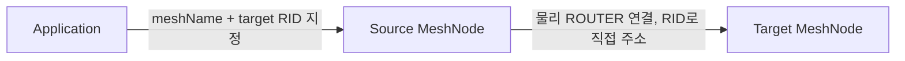
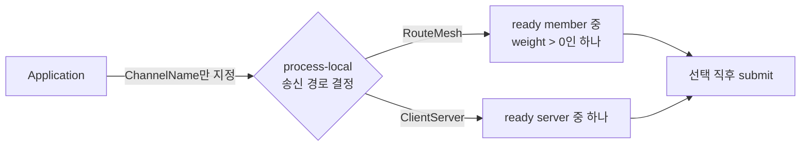
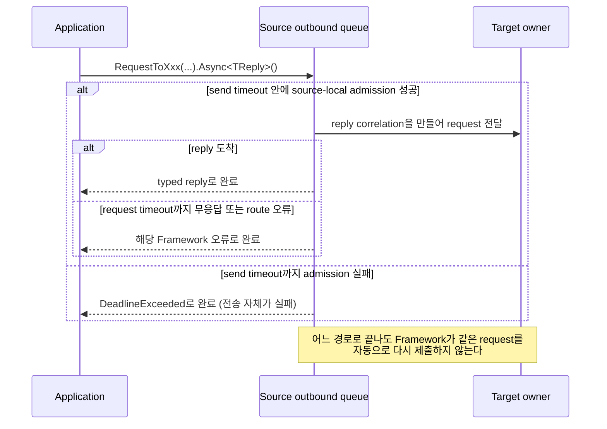
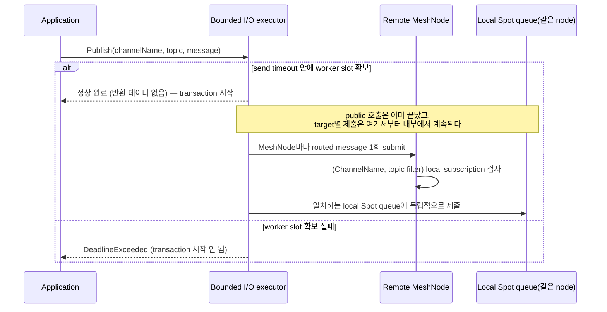

# 상호작용 모델

[Foundation 주제 목차](README.ko.md) · [스펙 목차](../README.ko.md) · [이전: 03. Framework 개요](03-overview.ko.md) · [다음: 05. 메시지 모델](05-message-model.ko.md)

> Framework operation의 대상을 어떻게 선택하고, application이 관찰하는 완료가 어느 시점에
> 일어나며, 그 실행을 어느 owner가 맡는지를 정의한다.

## 1. 공통 모델 — 대상 선택과 완료

같은 Channel에 참여한 여러 remote node와 local [Spot](02-glossary.ko.md#spot)에 message
하나를 게시하는 방식을 [Logical Multicast](02-glossary.ko.md#logical-multicast)라 한다.
Location Store가 global Spot이나 Actor를
현재 어느 node가 처리하는지 기록한 값을 [authority](02-glossary.ko.md#authority)라 한다.

| 모델 | 대상 선택 | 호출자가 관찰하는 완료 |
|---|---|---|
| node direct send | Caller가 같은 [MeshName](02-glossary.ko.md#meshname) — 하나의 [RouteMesh](02-glossary.ko.md#routemesh) 물리 연결 그룹을 식별하는 이름 — 에 속한 RID 하나를 직접 지정한다. | Source-local queue가 message를 수락하면 반환 데이터 없이 완료한다. |
| [node direct](02-glossary.ko.md#node-direct) request | Caller가 같은 MeshName에 속한 RID 하나를 직접 지정한다. | Reply, timeout 또는 route 오류 가운데 하나로 완료한다. |
| channel send | Framework가 [ChannelName](02-glossary.ko.md#channelname) — message를 보낼 Channel 범위를 식별하는 이름 — 에 등록된 [RouteMesh](02-glossary.ko.md#routemesh) — 여러 MeshNode가 참여해 node와 Channel message를 주고받는 범위 — 또는 ClientServer 송신 경로에서 ready target 하나를 선택한다. | 선택한 송신 경로의 source-local queue가 수락하면 반환 데이터 없이 완료한다. |
| channel request | Framework가 `ChannelName`에 등록된 RouteMesh 또는 ClientServer 송신 경로에서 [ready target](02-glossary.ko.md#ready-target) 하나를 선택한다. | Reply, timeout 또는 route 오류 가운데 하나로 완료한다. |
| Logical Multicast | Framework가 `ChannelName`의 remote member와 local Spot 중에서 조건에 맞는 대상을 선택한다. | Bounded worker와 source-local capacity를 확보해 publish transaction을 시작하면 반환 데이터 없이 완료한다. Target별 제출과 handler 완료를 기다리지 않는다. |
| Spot message | Caller가 global [Spot ID](02-glossary.ko.md#spot-id) — Spot을 식별하는 전역 논리 주소 — 를 지정하고 Framework가 current [Ready](02-glossary.ko.md#ready) — Spot이 message를 받을 수 있는 상태 — [authority](02-glossary.ko.md#authority)의 [owner](02-glossary.ko.md#owner)를 찾는다. | Send는 source-local queue 수락 뒤 반환 데이터 없이, request는 reply 결과로 완료한다. |
| Actor message | Caller가 global Actor ID를 지정하고 Framework가 current [Ready](02-glossary.ko.md#ready) authority의 owner를 찾는다. | Send는 source-local queue 수락 뒤 반환 데이터 없이, request는 reply 결과로 완료한다. |
| Object create·get-or-create | Caller가 global ID와 stable type을 지정하고 필요하면 placement intent를 추가한다. | 생성한 object를 가리키는 `ActorRef`·`SpotRef` 또는 typed creation 오류를 반환한다. |
| classic fanout | Framework가 준비된 subscriber 집합을 대상으로 사용한다. | Local publisher queue가 수락하면 반환 데이터 없이 완료한다. |
| STREAM | Caller가 session RID로 식별되는 연결을 사용한다. | One-way packet은 local queue 수락 뒤 반환 데이터 없이 완료하고 request는 reply를 반환한다. |

Channel operation에서 Framework가 조건에 맞는 target 하나를 고르는 방식을 `select-one`이라
한다.

이 표의 "완료"는 각 상호작용 *모델*의 완료 경계다. 메시지 *종류*(Send·Request·Logical
Multicast·[Classic fanout](02-glossary.ko.md#classic-fanout) publish·STREAM send/request)와 그 완료 조건의 요약은
[메시지 모델 「2. 메시지 종류와 완료」](05-message-model.ko.md#2-메시지-종류와-완료)가
정의한다.

## 2. 상호작용을 시작하는 public interface

다음 표는 application이 각 상호작용을 어디서 시작하는지 보여준다. `client`는 DI나 현재
handler context를 통해 얻으며, application이 transport socket이나 endpoint를 직접 선택하지
않는다.

| 상호작용 | 시작 interface | 호출자가 지정하는 대상 |
|---|---|---|
| Node direct·Channel select-one | `IZLinkRouteClient` | Node direct는 MeshName과 target RID, Channel은 ChannelName |
| Spot send·request | `IZLinkSpotClient` | Global Spot ID |
| Actor send·request | `IZLinkActorClient` | Global Actor ID |
| User Spot 생성·조회 | `IZLinkSpotManager` | Stable Spot type과 필요하면 global Spot ID |
| Actor 생성·조회 | `IZLinkActorManager` | Global Actor ID와 stable Actor type |
| Logical Multicast | `IZLinkSpotPublisherClient` | ChannelName과 topic |
| Classic fanout | `IZLinkFanoutClient` | Fanout ChannelName과 optional topic |
| STREAM send·reply | `IZLinkSessionClient` | 현재 [STREAM session](02-glossary.ko.md#stream-session) — STREAM client connection 하나를 수락한 때부터 닫을 때까지 유지하는 서버 실행 단위 |

아래 코드는 공통 상호작용의 모양을 보여 주기 위해 .NET 표기로 줄인 설명용 선언이다. 다른
언어에 같은 signature를 요구하지 않으며, 언어별 정확한 시그니처는
[.NET Channel messaging](../languages/dotnet/interfaces/04-channel-messaging.ko.md),
[.NET Spot](../languages/dotnet/interfaces/05-spots.ko.md),
[.NET Actor](../languages/dotnet/interfaces/06-actors.ko.md)와
[.NET STREAM session](../languages/dotnet/interfaces/07-stream-session.ko.md)이 소유한다.

```csharp
public interface IZLinkRouteClient
{
    // Caller가 Mesh와 target node를 모두 지정하는 direct operation이다.
    IZLinkSendCall SendToNode<T>(string meshName, RoutingId targetNodeRid, T message);
    IZLinkRequestCall RequestToNode<T>(string meshName, RoutingId targetNodeRid, T request);

    // Framework가 ChannelName의 ready target 하나를 선택하는 select-one operation이다.
    IZLinkSendCall SendToChannel<T>(string channelName, T message);
    IZLinkRequestCall RequestToChannel<T>(string channelName, T request);
}

public interface IZLinkSpotClient
{
    // Framework가 global Spot ID의 current owner를 찾아 전송한다.
    IZLinkSpotSendCall SendToSpot<T>(string spotId, T message);
    IZLinkSpotRequestCall RequestToSpot<T>(string spotId, T request);
}

public interface IZLinkActorClient
{
    // Framework가 global Actor ID의 current owner를 찾아 전송한다.
    IZLinkActorSendCall SendToActor<T>(string actorId, T message);
    IZLinkActorRequestCall RequestToActor<T>(string actorId, T request);
}

public interface IZLinkSpotPublisherClient
{
    // 조건에 맞는 remote MeshNode와 local Spot subscription에 함께 게시한다.
    IZLinkPublishCall Publish<T>(string channelName, string topic, T message);
}

public interface IZLinkSpotManager
{
    // Create는 새 RID를 발급하고, GetOrCreate는 application이 지정한 RID를 사용한다.
    IZLinkSpotCreateCall Create(string spotType);
    IZLinkSpotGetOrCreateCall GetOrCreate(string spotId, string spotType);
}

public interface IZLinkActorManager
{
    // Actor create 계열은 global Actor ID와 stable Actor type을 항상 함께 받는다.
    IZLinkActorCreateCall Create(string actorId, string actorType);
    IZLinkActorGetOrCreateCall GetOrCreate(string actorId, string actorType);
}

public interface IZLinkFanoutClient
{
    // Classic fanout 전용 publisher transport에 event를 제출할 call을 만든다.
    IZLinkFanoutPublishCall Publish<T>(string channelName, string topic, T message);
}

public interface IZLinkSessionClient
{
    // Send는 server-initiated packet, Reply는 현재 STREAM request의 reply다.
    IZLinkSessionSendCall Send<T>(T message);
    IZLinkSessionReplyCall Reply<T>(T message);
}
```

`Send...` call은 `Async()`로 local outbound admission까지 기다리고 결과값 없이 완료한다.
`Request...` call은 `Async<TReply>()`로 reply를 기다린다. `Yield<TReply>()`가 선언된 언어에서도
이 operation은 `SpotWide` User Spot 또는 Instance Spot의 shared turn에서만 사용할 수 있다.

## 3. Node direct와 channel select-one

Node direct는 physical `MeshName` topology를 그대로 사용하는 반면 channel select-one은 그 위에
process-local 논리 주소를 얹는다. 두 층을 구분해서 본다.





물리 diagram은 node direct가 caller가 지정한 RID의 실제 ROUTER 연결을 그대로 쓴다는 것을,
논리 diagram은 channel select-one이 process-local 후보 풀에서 하나를 고른 뒤에만 그 물리
연결에 올라탄다는 것을 보여준다. Channel 호출은 논리 diagram의 선택이 끝나기 전까지 어떤
물리 연결에도 확정되지 않는다.

- **Node direct는 infrastructure와 명시적 owner routing에 사용한다.** Target RID가 현재 Mesh
  member가 아니면 `NotFound`, member이지만 pipe가 준비되지 않았으면 send readiness 한계까지
  기다린 뒤 `Unavailable`로 끝난다. Node direct operation은 실패한 request를 다른 node에
  자동으로 다시 보내지 않는다.
- **Global Spot·Actor message는 cached Ready route와 committed
  [Message Follow](02-glossary.ko.md#message-follow) — relocation된 뒤에도 이전 owner node로
  도착한 message를 새 owner에게 대신 전달하는 동작 — route만 사용한다.** Message
  Follow 제한 안에서 current owner로 relay할 수 없으면 `Unavailable`로
  끝내며 source가 Store를 읽어 다른 owner에게 같은 operation을 다시 제출하지 않는다.
- **Channel operation은 ChannelName으로 process-local 송신 경로를 먼저 결정한다.** RouteMesh
  경로는 호출 순간의 ready member 가운데 weight가 0보다 큰 하나를 고르고, ClientServer 경로는
  ready server 가운데 하나를 고른다. 선택과 submit 사이에 application callback을 두지 않는다.
- **[Weight](02-glossary.ko.md#weight) 0은 새 channel 선택에서 제외하며, RouteMesh에서는
  Logical Multicast remote target에서도 제외한다.** RID direct와 이미 제출한 operation에는
  영향을 주지 않는다.
- **Select-one은 첫 binding operation을 시작하기 직전에 같은
  [ChannelName](02-glossary.ko.md#channelname)의 현재 eligible member 하나를 선택한다.**
  Binding operation이 시작되면 선택한 target이 확정되고 Core가 HWM 재시도와 completion을
  소유한다. Framework는 capacity를 이유로 target을 다시 선택하거나 operation을 다시 실행하지
  않는다. Direct call은 이 선택 규칙을 사용하지 않는다.
- **Node direct는 RID, Spot·Actor는 global ID, session은 binding token을 유지하며 물리 peer
  lifecycle generation을 public target identity로 노출하지 않는다.**
- **같은 ChannelName을 여러 물리 송신 경로에 등록할 수 없다.** 그래서 호출자는 MeshName이나
  ClientServer 종류를 지정하지 않는다. 같은 process에서 ChannelName을 서로 다른 topology에
  등록하면 host startup이 설정 오류로 실패한다.
- **Node direct는 [MeshName](02-glossary.ko.md#meshname)·RID를 계속 사용한다.** Logical
  Multicast 호출자는 ChannelName과 topic만 지정하며 process-local channel index가 owner
  RouteMesh의 MeshNode를 결정한다. 선택된 owner MeshName은 내부 routing과 runtime
  monitoring에서만 관측한다.

## 4. Send와 request

`send`는 reply가 없는 one-way operation이고 `request`는 reply 또는 오류로 완료하는 operation이다.
두 호출 모두 non-node-local 대상일 수 있어 timeout·route 오류 분기가 caller와 remote owner
사이에서 갈린다.



- **`send`는 비동기 submit 하나만 제공하며, 즉시 한 번만 시도하는 동기 terminator는 제공하지
  않는다.** 반환은 destination handler가 실행되었다는 확인이 아니라 Framework가 message를
  local outbound queue에 받아들였는지를 나타낸다.
- **Queue가 일시적으로 가득 차면 유한한 send timeout까지 admission을 기다린다.** 이미 수락한
  뒤 발생한 one-way 오류는 application이 구성한 standard logger·telemetry provider와
  monitoring으로 보고한다. Framework 전용 runtime error sink는 제공하지 않는다.
- **Global Spot·Actor send도 같은 비동기 terminator를 사용한다.** Source는 current Ready
  authority가 무엇인지 찾고 local outbound admission으로 submit을 완료한다. Cache hit도 같은
  public 의미를 유지하므로 cache 상태에 따라 동기 submit을 제공하거나 caller에게 owner
  node와 generation을 요구하지 않는다.
- **Message call은 Missing object의 creation intent를 기본적으로 만들지 않는다.** Spot 전용
  fluent call에서 Instance intent를 명시한 경우에만 실행 중인 Instance Spot이 없을 때 새
  Spot을 만들고 최초 message를 처리할 수 있게 준비한다. 이 과정을
  [cold activation](02-glossary.ko.md#cold-activation)이라 한다. 시작 method는 계속 global
  [Spot ID](02-glossary.ko.md#spot-id)만 받으며 optional [stable type](02-glossary.ko.md#stable-type)과 initial Mesh는 fluent
  call의 cold activation option이다.
- **유효한 one-way call은 source-local admission이 성공하면 결과값 없이 완료한다.**
  - Send timeout까지 capacity를 확보하지 못하면 operation에 허용된 deadline까지 완료 조건을
    만족하지 못했을 때 발생하는 [`DeadlineExceeded`](02-glossary.ko.md#deadlineexceeded)로
    완료한다.
  - target·route 부재와 runtime shutdown은 operation-specific exception으로 완료한다.
  - 잘못된 argument·handle·state와 중복 submit도 local exceptional completion이다.
  - Cancellation은 언어별 cancelled awaitable로 표현한다.
  - 어느 terminal 완료 뒤에도 Framework가 operation을 자동으로 다시 제출하지 않는다.
- **`request`는 선택한 송신 경로에 reply correlation을 만들고 terminal 결과를 정확히 한 번
  전달한다.** request timeout은 reply를 기다리는 시간이고, 전송 단계의 backpressure는 send
  timeout이 담당한다. route 오류나 timeout으로 끝난 request를 Framework가 자동 재전송하지
  않는다. 언어별 transport 오류는 이 문서의 닫힌 Framework 결과 가운데 하나로 변환하며
  transport 전용 결과를 public call에 노출하지 않는다.
- **Spot에서 시작한 request는 원래 activation과 generation을 completion record에 보존한다.**
  reply를 새 application message로 다시 dispatch하지 않는다. 다른 RouteMesh 또는 ClientServer
  Channel로 보낸 request도 같은 단일 terminal completion 규칙을 따른다.
- **같은 origin이 같은 destination pipe에 성공적으로 제출한 message는 FIFO다.** 서로 다른
  destination, origin 또는 session 사이의 전역 순서는 보장하지 않는다.

`Send`와 `Request`가 반환하는 공통 kind, timeout과 cancellation의 정확한 의미는
[Framework 오류 모델](07-framework-error-model.ko.md)이 정의한다.

## 5. Spot Logical Multicast

Logical Multicast publish는 target ChannelName, [topic](02-glossary.ko.md#topic)과 typed
payload를 받는다. Publish 시점에 remote [MeshNode](02-glossary.ko.md#meshnode)와 local Spot
match를 snapshot한다.

- remote MeshNode마다 routed message를 한 번 제출한다.
- 수신 MeshNode가 `(ChannelName, topic filter)`의 local subscription을 검사한다.
- 같은 node의 일치하는 Spot queue는 immutable payload storage의 reference를 공유한다.
- 다른 MeshNode로 relay하거나 과거 event를 다시 보내지 않는다.



- **Framework service runtime은 bounded I/O executor에 publish transaction을 제출한다.** Send
  timeout까지 worker slot을 확보하지 못하면 transaction을 시작하지 않고
  `DeadlineExceeded`로 실패한다. Handoff에 성공해 transaction이 시작되면 public terminal은
  반환 데이터 없이 정상 완료하고, runtime은 각 remote target과 local Spot queue의 제출을
  내부에서 계속한다.
- **Transaction 시작이 [snapshot](02-glossary.ko.md#snapshot) operation의 commit point다.**
  Cancellation이나 shutdown으로 남은 target 제출을 중단하지 않는다. 앞에서 수락된 remote
  target과 local Spot queue는 뒤 target의 실패 때문에 취소되지 않는다.
- **Snapshot target이 모두 0이어도 정상 완료한다.** Transaction이 시작된 뒤 발생한 remote
  연결 불가, outbound capacity 부족과 local Spot queue drop은 이미 수락된 target을 rollback하거나
  전체 publish를 다시 시도하지 않는다. Target별 수락·실패 결과는 public 결과로 반환하거나 publish
  전용 monitoring 값으로 집계하지 않는다.
- **Publish 정상 완료는 transaction을 시작했다는 뜻이다.** 고정한 snapshot의 target 제출,
  Spot handler 실행, subscriber 수신 또는 remote ROUTER가 수락한 뒤 수신 MeshNode의 local
  Spot queue 수락을 보장하지 않는다.

## 6. Classic fanout

[Classic fanout](02-glossary.ko.md#classic-fanout)은 MeshNode와 독립된 publisher/subscriber
channel이다. 현재 연결과 [subscription](02-glossary.ko.md#subscription) 준비가 완료된
subscriber에게만 새 event를 전달한다. Publisher는 연결 전 또는 연결 단절 중 event를 저장하지
않고, 다시 연결된 뒤 다시 보내지 않는다.

- **Publisher call은 publisher socket send timeout까지 local admission을 기다리는 비동기
  terminator 하나만 제공한다.** Subscriber가 0이어도 local publisher queue가 event를 수락하면
  결과값 없이 정상 완료한다. 이 완료는 subscriber 수신이나 handler 완료를 뜻하지 않는다.
- **Publish의 공통 입력은 ChannelName, topic과 typed event다.** Typed event의
  [packet name](02-glossary.ko.md#packet-name)을 topic으로 사용하는 편의 호출도 같은
  operation을 만든다. 두 호출은 같은 publisher transport, timeout과 비동기 완료 규칙을
  사용하며 subscriber dispatch는 packet name으로 handler를 선택하고 topic을 handler context에
  보존한다.
- **Publisher는 전용 location descriptor에 ChannelName과 실제 endpoint를 게시한다.** Automatic
  subscriber는 같은 ChannelName의 live publisher를 모두 연결하고 다른 ChannelName이나 다른
  [descriptor](02-glossary.ko.md#descriptor) kind는 연결하지 않는다. Manual subscriber는 명시한
  endpoint만 연결한다.

Logical Multicast와 classic fanout은 모두 publish/subscribe 사용 경험을 제공하지만 전달 대상과
보장이 다르므로 별도 기능으로 등록한다.

## 7. Spot과 Actor

Spot은 MeshNode 하나가 소유하는 논리적 mailbox다. 그 Spot으로 보낸 message는 이 mailbox에
쌓이고, 한 번에 하나씩 꺼내 handler로 들어간다.

### Spot 세 종류

Spot은 만들어지는 방식에 따라 세 종류로 나뉜다. 이 구분이 뒤에 나오는 실행 순서와 Actor
소속 규칙을 갈라 놓으므로 먼저 짚는다. 익숙한 예에 붙여 보면 이렇다.

- **Entry Spot** — Actor가 태어나고 사라지는 장소다. 접속한 player의 Actor가 처음 발을 딛는
  자리이고, 아직 어느 방에도 들어가지 않은 Actor가 머무는 곳이다. 게임으로 치면 **lobby**,
  웹 서비스로 치면 로그인 직후의 **진입 세션**이다.
- **User Spot** — 여러 Actor가 한자리에 모여 서로 주고받는 장소다. Application이 필요할 때
  열고 끝나면 닫는다. 게임으로 치면 **game room**, 웹 서비스로 치면 여러 참가자가 함께
  들어와 있는 **협업 문서 하나**나 채팅방이다. player Actor들이 lobby에서 이리로 옮겨 와 같은
  방 안에서 message를 주고받는다.
- **Instance Spot** — Actor가 살지 않는 자리다. 주제 하나에 여러 곳에서 들어오는 요청을 한
  줄로 세워 하나씩 처리할 때 쓴다. 게임으로 치면 ranking 집계나 우편함, 웹 서비스로 치면
  주문 번호 하나에 몰리는 요청을 겹치지 않게 처리하는 자리다.

비유는 이해를 돕는 예일 뿐이다. 실제 계약은 아래 표와 이어지는 절이 정한다.

| 종류 | 언제 쓰는가 | 누가 언제 만드는가 | Actor가 소속되는가 |
|---|---|---|---|
| Entry Spot | Actor를 만들고 없애는 자리가 필요할 때 (lobby) | Object Server가 시작할 때 Framework가 만들고 Spot ID를 발급한다. | 소속된다 |
| User Spot | 여러 Actor를 한자리에 모아 서로 주고받게 할 때 (game room) | Application이 필요할 때 manager로 직접 만든다. | 소속된다 |
| Instance Spot | 한 주제로 들어오는 요청을 겹치지 않게 차례로 처리할 때 | 따로 만드는 호출 없이, 그 Spot으로 보낸 첫 message가 도착할 때 준비된다. | 소속되지 않는다 |

정확한 생성 API는
[Entry Spot, User Spot과 Instance Spot](02-glossary.ko.md#entry-spot-user-spot과-instance-spot)이,
세 종류의 자세한 비교는
[Spot 모델 §3](../03-spot-actor/01-spot-model.ko.md#3-공통점과-차이점)이 소유한다.

### 한 번에 하나씩 처리하는 단위

Spot에 들어온 direct message, [Logical Multicast](02-glossary.ko.md#logical-multicast), timer와
lifecycle callback은 **서로 겹치지 않게 차례로** 실행된다. 이 "지금 실행할 차례"를 주는 자리를
execution gate라고 한다.

차례를 어느 범위가 함께 쓰는지가 문제다. 함께 쓰면 한쪽이 실행되는 동안 다른 쪽은 기다리고,
따로 쓰면 동시에 실행된다. Spot 종류와 User Spot의 설정에 따라 다음처럼 갈린다.

| 이 Spot에서는 | 차례를 함께 쓰는 범위 | 그래서 |
|---|---|---|
| Entry Spot, Instance Spot | 그 Spot의 message·timer·lifecycle callback | 이 셋은 서로 겹치지 않는다 |
| User Spot, 기본 `SpotWide` 모드 | Spot 자신 + 소속 Actor 전부 + timer + lifecycle callback | member Actor 하나가 실행 중이면 같은 Spot의 다른 Actor도 기다린다 |
| User Spot, `PerActor` 모드(선택) | Actor마다 따로, Spot 자신 따로, timer 따로 | 같은 Spot의 Actor들이 동시에 실행될 수 있다 |

Node handler가 Spot의 mailbox를 대신 읽어 처리하지 않는다. Spot의 일은 Spot의 차례에서만
실행된다.

### 없는 Instance Spot을 message로 만드는 경우

대상 Instance Spot이 아직 없을 때 새로 만드는 것은 [Spot direct](02-glossary.ko.md#spot-direct) 호출이
[Instance intent](02-glossary.ko.md#instance-intent)를 명시했을 때뿐이다. 지정하지 않으면
만들지 않는다.

여러 node가 동시에 같은 Spot을 만들려 해도 실제로 만드는 것은 하나다. 순서는 다음과 같다.

1. [Location Store](02-glossary.ko.md#location-store)에서 생성 권한을 얻은 node 하나가
   [factory](02-glossary.ko.md#factory)를 실행한다.
2. 그 node가 최초 record를 durable activation inbox에 확정한다.
3. 복구에 필요한 recovery root와 cursor를 함께 담아 location `Ready`를 commit한다.
4. Framework가 최초 record를 local queue 맨 앞으로 되돌린 뒤 activation barrier를 연다.

같은 Spot을 만들려다 진 node는 이긴 node가 낸 결과를 그대로 받는다. factory를 따로 실행하거나
message를 다시 보내지 않는다.

### `ActorRef`와 `SpotRef` — 조회 시점의 위치 사진

`ActorRef`와 `SpotRef`는 그 객체를 **조회한 시점의 위치를 찍어 둔 값**이며 한 번 만들어지면
바뀌지 않는다. 담는 것은 세 가지다.

- global ID
- [ObjectGeneration](02-glossary.ko.md#objectgeneration) — 같은 ID로 다시 만들어진 객체를 이전
  객체와 구분하는 번호
- 조회 시점의 `MeshName`과 `NodeRid`

endpoint, 내부 frame, runtime resource는 담지 않는다.

Actor가 다른 node로 옮겨 간 뒤 bound session의 `Ref`/`ref()`를 다시 읽으면, 같은
ActorId·ObjectGeneration에 옮겨 간 node의 `MeshName`·`NodeRid`를 담은 **새 값**을 돌려준다.
이미 받아 둔 값은 그대로 남는다 — 그래서 값을 보관해 두고 나중에 쓰면 옛 위치를 가리킬 수 있다.

일반 message를 보낼 때는 이 값이 아니라 global ID를 지정한다. 지금 어느 node가 그 객체를 맡고
있는지는 Framework가 그때 찾는다.

### Actor에게 보낸 message가 가는 길

Actor message는 global Actor ID로 지금 그 Actor를 맡은 node를 찾은 다음, 그 Actor의 mailbox에
바로 넣는다. **Spot의 message queue를 거치지 않는다.**

실행 차례는 §7의 첫 표를 따른다 — Entry Spot의 Actor와 `PerActor` User Spot의 Actor는 Actor마다
자기 차례를 갖고, `SpotWide` User Spot의 member Actor는 Spot과 차례를 함께 쓴다.

Actor handler에서 Spot이 소유한 상태를 읽거나 바꿔야 하면 Spot에 send/request를 따로 제출한다.
그 일은 Spot의 차례에서 실행된다.

### handler가 기다리는 동안에도 진행하는 것

Node·Spot·Actor 호출과 binding operation의 완료 처리는 application handler가 무언가를 기다리고
있어도 계속 진행한다. 이 처리는 handler와 분리된 실행 영역에서 이루어진다.

## 8. STREAM session

STREAM session은 연결 lifecycle과 packet 순서를 소유한다.

- **Framework 내부 recv loop는 packet을 관리 queue에 넣은 뒤 session callback을 실행한다.**
  같은 session의 packet과 lifecycle callback은 직렬로 실행하며 서로 다른 session 사이의
  전역 순서는 보장하지 않는다.
- **Session과 Actor가 bind되면 session ingress는 Actor mailbox로 complete message를
  제출한다.** Actor에서 client로 보내는 message는 현재 binding의 session FIFO를 사용한다.
  Actor 이동 중에는 session barrier가 old epoch와 new epoch의 순서를 구분한다.
- **Server package의 bound session send, session Actor relay와 명시적인 STREAM send·reply도
  같은 async-only one-way admission 결과를 반환한다.** 별도 stream connector package의 send
  builder는 connector package 계약을 따른다. STREAM reply는 해당 STREAM socket의 send
  timeout을 사용하며 caller request timeout을 reply admission deadline으로 사용하지 않는다.
- **Reply sequence 또는 one-shot token이 유효하지 않거나 같은 reply call을 두 번 제출하면
  local exceptional completion으로 끝난다.** 유효한 첫 reply terminator는 transport admission
  전에 token을 원자적으로 소비한다. 이 terminator가 backpressure, timeout 또는 cancellation으로
  완료되어도 token은 재사용하지 않는다. 같은 token에서 만든 두 call이 경쟁하면 하나만
  transport admission을 시작한다.

STREAM session의 연결 수락, 등록과 dispatch context는
[STREAM 서버 session](../04-session/01-stream-session.ko.md)이, session과 Actor의 bind·rebind·
relocation 중 책임은
[Session과 Actor binding](../04-session/02-session-actor-binding.ko.md)이 정의한다.

## 9. 대표 public 호출 예제

다음 코드는 앞 절의 상호작용이 target을 어떻게 지정하고 어떤 terminal method로 끝나는지
비교하는 설명용 예시다. 다른 언어에 같은 signature를 요구하지 않으며, 정확한 signature는
언어별 interface가 정의한다. `routes`, `spots`, `actors`, manager와 publisher는 DI로
받은 public client이고, RID와 ID는 application이 이미 가지고 있다고 가정한다. 업무 message
type은 설명을 위한 예시다.

### 9.1 Node direct와 Channel select-one

```csharp
// Node direct: application이 "world" Mesh의 특정 node RID를 지정한다.
await routes
    .SendToNode("world", targetNodeRid, new ReloadConfig())
    .Async(cancellationToken);

// Channel select-one: Framework가 "game" Channel의 ready server 하나를 선택한다.
MatchFound match = await routes
    .RequestToChannel("game", new FindMatch(playerId))
    .Timeout(TimeSpan.FromSeconds(2))    // reply 대기 상한. 전송 admission은 send timeout이 따로 담당한다.
    .Async<MatchFound>(cancellationToken);
```

첫 번째 호출은 지정한 RID가 실패해도 다른 node를 선택하지 않는다. 두 번째 호출은 한
target이 operation을 수락하기 전까지만 같은 ChannelName의 다른 eligible target을 선택할 수
있다.

### 9.2 Spot·Actor message와 생성

```csharp
// Existing Spot: Framework가 Spot ID의 current Ready owner를 찾아 request를 보낸다.
RoomState room = await spots
    .RequestToSpot(roomId, new GetRoomState())
    .Timeout(TimeSpan.FromSeconds(1))
    .Async<RoomState>(cancellationToken);

// Missing Instance Spot: 명시한 intent가 있을 때만 Spot을 준비하고 같은 첫 request를 처리한다.
ShardState shard = await spots
    .RequestToSpot(shardRid, new LoadShard())
    .InstanceSpot("world-shard")         // 이 intent가 있을 때만 cold activation을 시작한다.
    .InMesh("world")                     // 새로 만들 Instance Spot의 initial Mesh.
    .Async<ShardState>(cancellationToken);

// User Spot은 manager call로 명시적으로 만들거나 기존 creation attempt에 합류한다.
ZLinkSpotCreateResult createdSpot = await spotManager
    .GetOrCreate(roomId, "room")
    .InMesh("world")
    .Async(cancellationToken);

// Actor message는 member Spot의 message queue를 거치지 않고 Actor queue로 직접 들어간다.
PlayerState player = await actors
    .RequestToActor("player-42", new GetPlayerState())
    .Async<PlayerState>(cancellationToken);

// Actor 생성은 global Actor ID와 stable Actor type을 함께 지정한다.
// 결과는 기존 Actor 조회, 새 생성 승인, application 거절을 구분한다.
ZLinkActorCreateResult actorCreation = await actorManager
    .GetOrCreate("player-42", "player")
    .InMesh("world")
    .Async(cancellationToken);
```

일반 Spot·Actor message는 target node나 endpoint를 받지 않는다. `SpotRef`와 `ActorRef`에
NodeRid가 있어도 일반 message의 주소로 사용하지 않으며 Framework가 global ID의 current
authority를 다시 확인한다.

### 9.3 Logical Multicast와 Classic fanout

```csharp
// Logical Multicast: 조건에 맞는 remote node와 local Spot subscription에 함께 게시한다.
await spotPublisher
    .Publish("world-events", "zone.7", new WeatherChanged("rain"))
    .Async(cancellationToken);

// Classic fanout: 독립 publisher transport에 현재 연결된 subscriber를 대상으로 한다.
await fanout
    .Publish("telemetry", "server.health", new HealthSample(cpu, memory))
    .Async(cancellationToken);
```

두 publish 모두 handler 완료를 기다리지 않는다. Target별 제출 결과는 public 결과로 반환하거나
publish 전용 monitoring으로 집계하지 않는다.

### 9.4 STREAM session

```csharp
// 현재 session FIFO에 server-initiated one-way packet을 제출한다.
await sessionClient
    .Send(new ServerNotice("maintenance"))
    .Async(cancellationToken);

// STREAM request handler에서만 현재 request의 reply capability를 정확히 한 번 소비한다.
await sessionClient
    .Reply(new LoginAccepted(playerId))
    .Async(cancellationToken);

// Binding된 Actor relay는 현재 session binding을 사용해 Actor mailbox에 제출한다.
await sessionActor
    .RelayAsync(
        ZLinkMessage.From(new ClientInput(sequence, command)),
        cancellationToken);
```

`Reply(...)`는 임의의 server-initiated message를 보내는 API가 아니다. 현재 handler가 받은
STREAM request의 reply capability를 소비한다. 일반 server-initiated packet은 `Send(...)`를
사용한다.

## 10. Handler 실패

- **Reply route를 복원할 수 있는 request는 구조화된 error reply로 완료한다.** Reply route를
  복원할 수 없는 message와 one-way message는 버리고 원인에 맞는 structured log와 metric을
  남긴다.
- **Application handler 예외는 one-way 경로에서도 error로 기록한다.** Logger·telemetry
  provider 실패는 원래 reply 또는 drop 결과를 바꾸지 않는다.

## 11. 종료가 상호작용에 미치는 영향

- **`Relocate`가 `Relocating` intent를 게시하거나, runtime이 종료를 진행하고 있어 새 operation
  admission을 받을 수 없는 상태인 [`Shutdown`](02-glossary.ko.md#shutdown)이 admission seal을
  시작하면 새 channel 선택, Logical Multicast target과 새 상태 배정을 제한한다.** `Relocating`에서
  permit을 얻지 못한 relocation unit은 기존 message와 timer를 계속 처리하며 queue turn
  경계에서 permit을 얻은 뒤에만 seal한다.
- **`Draining` 뒤에는 이미 admission을 마친 message, request completion, Actor relocation과
  [STREAM session](02-glossary.ko.md#stream-session) barrier만 설정된
  [deadline](02-glossary.ko.md#deadline)까지 진행한다.** Deadline 뒤 남은 operation은 owner별
  terminal [shutdown](02-glossary.ko.md#shutdown) 결과로 완료한다.
- **Draining MeshNode는 새 Instance placement 후보에서 제외된다.** `Shutdown`은 기존 Instance
  Spot을 다른 node로 이동시키지 않고 수락된 turn을 deadline까지 처리한 뒤 정리한다.
  `Relocate`는 type별 maintenance policy와 authority transaction이 허용한 기존 owner만
  target에 만든다.
- **두 operation 모두 Framework admission seal과 current location authority를 검증하며 stale
  owner가 `Closing`이나 release를 적용하지 못하게 한다.**

## 12. 검증 요구

공개 client interface(`IZLinkRouteClient`, `IZLinkSpotClient`, `IZLinkActorClient`,
`IZLinkSpotManager`, `IZLinkActorManager`, `IZLinkSpotPublisherClient`, `IZLinkFanoutClient`,
`IZLinkSessionClient`)의 `Send`·`Request`·`Publish`·create 호출이 반환하는 완료값만으로 다음을
확인한다. 각 항목은 test 하나로 이어진다.

**대상 선택**

- Node direct는 caller가 지정한 RID로만 전송되고, 그 RID가 실패해도 다른 node를 자동으로
  선택하지 않는다.
- Channel select-one은 호출마다 그 순간의 ready target 하나를 고르며, weight 0인 member는
  새 channel 선택과 RouteMesh Logical Multicast remote target에서 제외된다.
- 같은 ChannelName을 서로 다른 topology(RouteMesh·ClientServer)에 등록하면 host startup이
  설정 오류로 실패한다.
- Spot·Actor message는 global ID로 current Ready authority를 resolve해 전달되고, `SpotRef`·
  `ActorRef`에 담긴 NodeRid를 일반 message의 주소로 사용하지 않는다.

**완료**

- node direct send·channel send·Spot/Actor send·STREAM one-way packet은 source-local queue가
  수락하면 반환 데이터 없이 완료한다.
- node direct request·channel request·Spot/Actor request·STREAM request는 reply, timeout 또는
  route 오류 가운데 하나로 완료한다.
- Object create·get-or-create는 생성한 object를 가리키는 `ActorRef`·`SpotRef` 또는 typed creation 오류를 반환한다.
- Logical Multicast publish와 classic fanout publish는 target별 handler 실행이나 수신을 기다리지
  않고 publish transaction 시작(또는 local publisher queue 수락)만으로 반환 데이터 없이
  완료한다 — subscriber가 0이어도 정상 완료한다.
- 같은 origin이 같은 destination pipe에 성공적으로 제출한 message는 FIFO 순서로 도착한다.

**실패**

- Queue가 가득 차 send timeout까지 admission을 마치지 못하면 `DeadlineExceeded`로 끝난다.
- Route 오류나 timeout으로 끝난 request를 Framework가 자동으로 다시 제출하지 않는다.
- 같은 reply token으로 reply를 두 번 제출하면 두 번째 호출은 local exceptional completion으로
  끝난다.
- Reply route를 복원할 수 있는 request는 구조화된 error reply로 완료하고, 복원할 수 없는
  message와 one-way message는 drop되어 로그·metric으로만 남는다.
- `Relocating`·`Draining` 중에는 이미 admission을 마친 message와 진행 중인 completion만 설정된
  deadline까지 진행되고, 그 뒤 남은 operation은 owner별 terminal shutdown 결과로 완료한다.

---

[Foundation 주제 목차](README.ko.md) · [스펙 목차](../README.ko.md) · [이전: 03. Framework 개요](03-overview.ko.md) · [다음: 05. 메시지 모델](05-message-model.ko.md)
