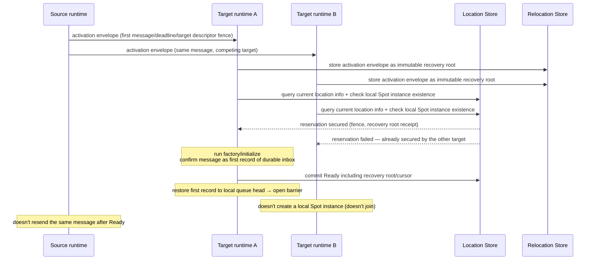

# ZLink Framework API

[Foundation Topic Table Of Contents](README.en.md) · [Spec Table Of Contents](../README.en.md) · [Previous: 05. Message Model](05-message-model.en.md) · [Next: 07. Framework Error Model](07-framework-error-model.en.md)

> Defines Framework's language-neutral public API family and registration rules.

## 1. The Boundary Between Public Contract And Runtime Implementation

This document defines ZLink Framework's language-neutral public API family and registration
rules. Actual types, generic constraints, overloads, and async return types are owned by
each package's per-language spec. The .NET per-language interface for
[RouteMesh](02-glossary.en.md#routemesh) — the scope in which multiple MeshNodes participate to
exchange node and Channel messages — and [MeshNode](02-glossary.en.md#meshnode) — a runtime node
that participates in a RouteMesh to send or receive messages — follows
[.NET RouteMesh/MeshNode Interfaces](../languages/dotnet/interfaces/03-configuration-topology.en.md).

This document and each package's common spec own public behavior that must be the same
regardless of language. Each language's per-language interface document fixes that behavior into
that language's types, methods, return values, and error representation. Internal runtime
sockets, queues, dispatch tables, and adapter types aren't part of the public contract and
aren't exposed in the per-language interface. Every language's per-language interface projects the same
public behavior without narrowing the common contract.

## 2. Root Registration

The framework root is registered once with the process's host lifecycle and DI. Root
configuration provides the following capabilities.

| Capability | Registration result |
|---|---|
| [RouteMesh](02-glossary.en.md#routemesh) | Registers one [MeshNode](02-glossary.en.md#meshnode) under a MeshName |
| [ClientServer Channel](02-glossary.en.md#clientserver-channel) | Registers, as one client or server role under a ChannelName, a separate service connection where a client initiates a business call and a server provides the handler and reply |
| classic fanout | Registers a publisher/subscriber channel independent of MeshNode |
| STREAM node | Registers a STREAM endpoint and session handler |
| [Location Store](02-glossary.en.md#location-store) | Registers an instance to atomically store owner, location, generation, relocation authority, and aggregates |
| [Relocation Store](02-glossary.en.md#relocation-store) | Registers an instance to store the activation envelope an Instance [Spot](02-glossary.en.md#spot)'s cold activation needs and cross-node relocation's immutable state/journal/replay payload completed after relocation |
| codec extension | Registers a typed-payload serializer |
| handler and filter | Registers dispatch handlers, filters, and metadata policy |
| worker | Configures the bounded worker scheduler's concurrency, idle timeout, and queue cap |
| network identity | Configures the bind host and advertised host common to listeners |
| deployment identity | Configures the application version and maintenance wave used for target eligibility |
| inbound dispatch | Configures the forwarded [Core HWM budget](02-glossary.en.md#core-hwm-budget) values — the byte budget forwarded to Core for directional queue HWMs — and the host-wide [Application job queue](02-glossary.en.md#application-job-queue) profile/capacity — the shared supply-permit queue held until an application callback actually starts |

Configuring the same root twice in a process, or registering the same
[MeshName](02-glossary.en.md#meshname) twice, causes a configuration error at startup.
Registering the same [ChannelName](02-glossary.en.md#channelname) on different RouteMesh or
ClientServer topologies also fails at startup regardless of role.
The transport component in the current process that binds a network endpoint and accepts
remote connections, the [Network listener](02-glossary.en.md#network-listener)'s common identity
values and per-listener overrides are owned by
[13 Network Listener Identity](../02-channel-transport/04-network-listener-identity.en.md).

Root registration provides one framework runtime singleton per process. This runtime
performs a host-wide `Relocate`, which requires a mode, and a separate `Shutdown` that moves the
runtime into the [Shutdown](02-glossary.en.md#shutdown) state where it stops accepting new
operation admission.
`PlannedMaintenance` moves to the same application version as the source, and
`RollingUpdate` moves to a version, greater than the source's, that the caller
specifies. It doesn't provide a drain operation per MeshName, ChannelName, or node RID.
State, per-mode target selection, terminal result, default deadline, repeated calls, and
cancellation contract are owned by
[54 Host Relocate, Shutdown & Handoff](../05-location-relocation/05-host-relocation-flow.en.md).

The framework builder doesn't expose the service liveness interval and
[deadline](02-glossary.en.md#deadline). The service runtime applies a common profile
internally and distinguishes orderly disconnect from half-open failure. The fixed values,
service liveness message, and reconnect contract are owned by
[55 Transport Liveness](../02-channel-transport/05-transport-liveness.en.md).

## 3. Core Memory Budget And Application Job Queue Configuration

Framework doesn't compute a separate message byte cap. One Core context owns one messaging
budget for the Core queue, and Framework forwards the following settings as the same
binding context option. This forwarding is only startup configuration — it doesn't make
Framework the owner of Core HWM calculation.

```text
// contract pseudocode, not an actual API — the actual per-language types and signatures are owned by the target language's per-language interface.
RootInboundDispatchOptions {
    // Optional. The raw available memory bytes used to calculate the Core budget.
    CoreHwmMemoryLimitBytes: long,
    // Optional. The precise Core-managed messaging budget that skips profile calculation.
    CoreHwmBudgetBytes: long,
    // Optional. The profile Core uses to calculate the memory budget and per-queue byte HWM. Default is `Balanced`.
    CoreHwmProfile: Compact | LowLatency | Balanced | Throughput = Balanced,
}
```

If `CoreHwmBudgetBytes` and `CoreHwmMemoryLimitBytes` are both specified, the manual budget
takes precedence.

If either exceeds the finite process/container hard limit Core detected,
or isn't positive, it fails as a configuration error before socket bind — this error is
delivered immediately at the call site as a per-language configuration exception, and never
turns into a remote error reply ([Framework Error Model "3. Errors Checkable Before The
Call"](07-framework-error-model.en.md#3-errors-checkable-before-the-call)).

Every
`configuration error` and `startup configuration error` elsewhere in this document is
delivered the same way.

Without an
explicit value, a managed binding forwards the raw runtime memory hint from the GC, JVM, or
V8 to Core, and a native binding uses Core's container/process/OS detection.

Framework and
the binding don't apply a profile ratio or divide the budget by connection count.

When a Core queue hands an application record to the binding, that Core byte charge ends.
The payload then follows the ordinary message lifetime from [Payload Ownership And
Copying](../01-execution/05-payload-ownership-and-codec.en.md); it isn't Core HWM credit or a separate
capacity token. Framework doesn't use retained receive to extend this charge through the
handler or reply terminal. RouteMesh ROUTER-ROUTER replies and error replies
use a separate [Completion connection](02-glossary.en.md#completion-connection) and don't traverse the ordinary Core
byte-HWM path. ClientServer DEALER-ROUTER replies and error replies traverse the
single Application connection's Core HWM and `PAUSED` state before Core
identifies them as completions. In both topologies, once Core identifies the
record as a completion, it doesn't use an Application Job Queue permit.

The framework host instance limits the number of application jobs waiting for a handler to
start using a separate permit. The root's inbound-dispatch options provide the following
values.

```text
// contract pseudocode, not an actual API.
RootInboundDispatchOptions {
    // Optional. The automatic job-cap profile. Default is `Balanced`. (Jobs per processor follow the Profile table below.)
    ApplicationJobQueueProfile: Compact | LowLatency | Balanced | Throughput = Balanced,
    // Optional. The precise cap that fully replaces profile calculation. Range `1..2,147,483,647`.
    MaxQueuedApplicationJobs: int,
    // Optional. Range `1..100`. Default is `80`.
    ApplicationJobQueuePauseThresholdPercent: int = 80,
    // Optional. Range `0..99`. Default is `60`, and it must be smaller than the pause value.
    ApplicationJobQueueResumeThresholdPercent: int = 60,
    // Read-only. The actual host-instance cap determined at startup (a status value).
    EffectiveMaxQueuedApplicationJobs: int,
}
```

A manual range violation is a startup configuration error, and there's no unlimited mode.
Without a manual value, the effective processor count is the minimum of the known positive
startup values — runtime constrained logical count, affinity/cpuset count,
`floor(quota/period)` (minimum 1), and explicit executor maximum. If no value is known, it's
1.

Jobs per processor for each `ApplicationJobQueueProfile` value are as follows.

```text
Compact     -> 32
LowLatency  -> 64
Balanced    -> 128
Throughput  -> 256
```

Multiplication overflow is a startup configuration error before socket bind. Values are
fixed at startup and aren't automatically changed based on runtime CPU/TPS measurements.
`CoreHwmProfile` and `ApplicationJobQueueProfile` use the same labels but don't share a
type, owner, unit, or calculation. Each profile's default is `Balanced` independently, and
selecting one doesn't change the other.

Framework computes the pause permit count by rounding effective maximum × pause percent /
100 up, and the resume permit count by rounding effective maximum × resume percent / 100
down. Startup validates both percent ranges together with `resume < pause`; a violation
fails as a configuration error before socket bind. The pressure count is permits in use —
the sum of reserved supply permits and queued application jobs.

Permit acquisition and return timing differ by record kind.

| Record kind | Permit behavior |
|---|---|
| Supply identifiable before receive as terminal reply or error-reply completion | doesn't use a queue permit |
| A record first received on an ordinary connection and then classified as the above supply | doesn't bypass it |
| Every other ordinary-ingress record (application, control, and malformed alike) | acquires the same shared permit immediately before receive/claim |
| A control or malformed record | returns the permit immediately after internal processing |
| An application record | uses one permit per final handler turn and holds it while waiting in the executor, mailbox, or serial gate. The common invocation wrapper returns the permit exactly once, immediately before executing the user callback's first instruction |
| Asynchronous waits and continuations after the handler has started | don't reacquire the permit |

At the cap, new ordinary-ingress supply waits for a permit through a cancellable wait. It
isn't turned into reject/drop, a separate LWM, polling, busy-spin, or an unbounded temporary
queue. A returned permit is handed directly to the longest-waiting live source, and a new
acquire doesn't jump ahead of an existing waiter. Batch and 1:N local dispatch also can't
create more handler jobs than the permits they secured. When the Core receive queue fills,
the existing per-origin byte HWM propagates backpressure to the sender.

The only runtime feedback Framework job pressure gives Core is the absolute `RUNNING`/
`PAUSED` receive-flow state on supported sockets. Framework doesn't change Core HWM settings
or queued-byte counters through this transition. Core snapshot projection is read-only
observation and isn't an input to pressure calculation.

[Core Byte HWM And Application Job Flow](../01-execution/04-application-job-queue-and-backpressure.en.md) defines
why the two capacities are separate, the permit release boundary, and the exception for
relocation durable staging.

The root Location options own the startup-only `SessionRelocationSealTimeout`. It defaults
to `3,000 ms` and accepts only a finite positive duration. Zero, negative, infinite, and a
value the language-specific interface can't represent as finite milliseconds are all a
configuration error before socket bind. It bounds how long a session owner waits for
terminal cutover/abort of a relocation seal, and it isn't changed at runtime.

The root Location options also own the following server settings applied to the direct
transmission of Actor/Spot relocation payloads. The source runtime splits a relocation
payload into chunks and transmits them directly over the source–target mesh connection.

```text
// contract pseudocode, not an actual API.
RootLocationOptions {
    // The size cap of one encoded chunk a relocation payload is split into. Default 256 KiB.
    // Configuring it above the frame limit the transport negotiated is a startup configuration error before socket bind.
    RelocationPayloadChunkLimit: bytes = 256_KiB,
    // The cap on the sum of relocation chunk bytes one source node is concurrently transmitting on one peer connection.
    // Default 16 MiB. `0` means this budget isn't applied.
    RelocationInFlightPayloadBudget: bytes = 16_MiB,
    // The cap limiting the same sum for the whole source node instead of one peer connection.
    // Default 0 (not applied). When positive, chunk submission must satisfy both the peer budget and this budget.
    RelocationNodeInFlightPayloadBudget: bytes = 0,
    // How long the target waits for cutover after sending the relay-ready reply,
    // and also how long the source keeps the boundary batch and cutover copy for retransmission. Default 1,000 ms.
    RelocationCutoverWaitTimeout: duration = 1000_ms,
}
```

The sums for the two budgets are based not on encoded payload bytes but on the accounted
charge (including the per-frame metadata charge) of chunks Core is still accounting. All
four settings can be changed per deployment, and the runtime doesn't adjust them
automatically by observing round-trip time or load. The behavioral contract for chunk
splitting and negotiation, budget accounting and waiting, and the cutover fallback and
retransmission window is owned by
[Complete Actor And Spot Relocation Flow](../05-location-relocation/04-relocation-flow.en.md).

## 4. RouteMesh Registration

RouteMesh registration takes one MeshName and returns a MeshNode builder. The MeshNode
builder owns the following configuration.

- a fixed routing ID for explicit manual topology, or a diagnostic prefix for automatic
  topology
- the ROUTER bind endpoint and transport options
- zero or more immutable ChannelName server memberships and outbound Channel route
  declarations
- manual peer connection intents
- node direct and channel handlers
- an object role, one of `None`, `Client`, `Server`
- the Object Server's Entry Spot, user Spot, typed Actor, and actor-free Instance Spot
  factories
- the `DisableRelocation`, `RecreateOnRelocation`, `PreserveStateWith` policy chosen in
  every object factory callback
- per-node Actor/Spot counts and per-Spot-type capacity, and node-wide placement weight
- route cache age and, the duration during which the Framework delivers a message that
  arrives at a former owner node after relocation to the new owner instead,
  [Message Follow](02-glossary.en.md#message-follow) duration
- [Logical Multicast](02-glossary.en.md#logical-multicast) publish policy — delivering one
  message to multiple Spots whose location can change, such as a room, stage, or zone

MeshName is the physical mesh's name and ChannelName is a logical
[membership](02-glossary.en.md#membership). Several ChannelNames can be registered on the
same MeshNode. A `ChannelName` call doesn't create a separate socket. Once the host starts,
MeshName, [routing ID](02-glossary.en.md#routing-id), endpoint, and the membership set can't
be changed.

The location option `RouteCacheMaxAge` defaults to 15 seconds and `MessageFollowDuration`
defaults to 30 seconds. Setting both to 0 turns off route cache and Message Follow. If
positive, cache age must be at least 5 seconds smaller than the period during which Message
Follow stays valid, [Message Follow duration](02-glossary.en.md#message-follow-duration). A
runtime value change applies starting from new cache entries and new relocations. A stale
route past the Message Follow duration fails with a stale-location error, and Framework
doesn't automatically resend it.

The RouteMesh Channel builder distinguishes `Client` and `Server` roles. `Client` registers
ChannelName as that MeshNode's outbound send path but doesn't advertise it to peers as
target membership, and has no [weight](02-glossary.en.md#weight) or handler. `Server`
registers target membership and a handler namespace, and provides weight and handler
configuration. Since Server can also start outbound calls under the same ChannelName, the
Client role isn't registered twice under the same name.

Channel Server weight ranges from 0 to 10000, with a default of 100. Only server weight can
be changed at runtime. `SetWeight(0)` is a drain setting that excludes the server from new
selection — it doesn't represent the Client role. Topology and socket settings, including the
byte cap a listener can receive on a complete transport message,
[`MaxMessageSize`](02-glossary.en.md#max-message-size), can't be changed after startup.

Object role is a closed value.

| Object role | What it does |
|---|---|
| `None` | Doesn't create an object manager, factory, or placement runtime |
| `Client` | Can start global Actor/Spot operations but doesn't provide a factory or placement target |
| `Server` | Includes Client capability and provides a factory and placement target |

`Client` and `Server` both require a [location store](02-glossary.en.md#location-store). A
factory is only registered on an Object Server builder; registering the same stable type
twice fails startup.

Object Client is outbound-only in terms of object functionality. It can register a
RouteMesh Channel Server on the same MeshNode but can't register an application
[Node direct](02-glossary.en.md#node-direct) handler — the way of sending by designating a
MeshName and target RID together. The peer connection is skipped only when both MeshNodes are
Object Client and
neither has RouteMesh Channel Server membership. Server membership creates a connection
requirement even at weight `0`.

When choosing which node to place a new Actor/Spot on or relocate one to, Object Server uses
a [weight](02-glossary.en.md#weight) that applies to the node as a whole (node-wide placement
weight), independent of Channel weight. It ranges from 0 to 10000, with a default of 100.

A node with `0` is excluded from new placement and relocation targets but keeps
[Ready](02-glossary.en.md#ready) objects — ones whose creation and initialization finished
and can now receive application messages — and attempts that already secured a reservation.

There's no whole-node active-object cap that combines Actors and Spots of different costs.

Per-node limits for Actors overall, User/Instance Spots overall, and per Spot stable type
default to `0`, meaning no limit. A positive value is the max count for that node in
`1..2^31-1`; a negative value is a startup configuration error.

Entry Spot is fixed at one per Object Server node and isn't included in the configurable
Spot count. However, the Actor present in the Entry Spot is included in the overall Actor
limit. A per-Actor-stable-type limit isn't provided.

Cap enforcement counts active count together with the reserved slots secured before the
factory finishes. The Location Store confirms reservation and authority in the same
transaction, and descriptor count is a projection for candidate selection. If no candidate
satisfies capacity, it completes with `CapacityExceeded`.

The existing pending-activation
`128` limit isn't an object population limit — it's a separate admission limit protecting
concurrently in-flight activations. The activation concurrency default is `128` per node,
and only a positive value is allowed. The permit is returned once factory and
initialization finish, and doesn't change the active/reserved population count.

All the capacity needed to create or relocate one object is reserved as a single typed
bundle. An Actor bundle contains one Actor slot. A Spot bundle contains one overall Spot
slot, plus — if a stable-type limit is configured — one slot for that
[Spot kind](02-glossary.en.md#spot-kind) — the value marking whether a Spot is Entry, User, or
Instance — and stable
type. Relocating a User Spot aggregate secures the Spot slot, Spot type slot, and one Actor
slot per member Actor, all in one transaction. A state where only some slots are secured
isn't exposed externally.

RouteMesh Channel Server, ClientServer Server, and node-wide placement weight all use the
integer range `0..10000` with a default of `100`. A negative value or a value greater than
`10000` is a configuration error, both at startup configuration and at runtime change.
Weighted selection computes the candidate weight sum using at least a 64-bit integer.
Logical Multicast includes an eligible remote member exactly once regardless of the
magnitude of its positive weight, and excludes members with weight `0`.

The Create call doesn't provide a target RID, predicate, or selection callback.

Framework's `MaxMessageSize = 0` means Framework doesn't impose a separate cap smaller than
the transport default. A positive value applies as the same byte cap, and a negative value
is a configuration error. Binding-option representation and conversion are owned by each
language's implementation and aren't exposed in the application public API.

The ClientServer application listener's `MaxMessageSize` default is `16,777,216` bytes
(16 MiB). `MaxMessageSize` is a single-message cap independent of the Core memory budget and
Application job queue capacity. `0` means Framework adds no separate cap, and it isn't
cross-validated with another HWM or queue setting.

This regular application-listener rule applies to ClientServer, not RouteMesh ServerServer.
RouteMesh SS provides no Framework-level message-size setting or cap.

The StreamNode Core STREAM inbound cap is separate from this regular application-listener
rule and defaults to `64 KiB`. It checks the complete client-to-server message as header
plus payload bytes, excluding the 6-byte prefix. `0` is converted to Core `-1`, and it
doesn't apply to server-to-client outbound messages.

The MeshNode builder doesn't add a drain policy or lifecycle command. The framework
runtime's `Relocate` performs continuity maintenance of the host, and ordinary termination
is performed by `Shutdown`. The caller chooses `PlannedMaintenance` for node maintenance and
`RollingUpdate`, with the target version specified, for deploying a new version. Each host lifecycle state has a different meaning.

| State | Meaning |
|---|---|
| `Relocating` | A state that proceeds starting with relocation units that obtained a permit while keeping application processing going for the remaining units |
| `Relocated` | A state where every stateful object's relocation has finished but the host and infrastructure are kept |
| `Draining` | A state where a separately called `Shutdown` is cleaning up resources |

Channel weight 0 isn't used in place of a lifecycle state.

## 5. Manual Peer

The manual peer API provides two intents.

- specifying only an endpoint lets the admission handshake determine the remote RID.
- specifying an expected RID together with an endpoint only admits when the handshake RID
  matches.

Runtime control provides adding a connect intent, releasing an intent by endpoint, and
querying the current intent list. Manual peer also verifies the same MeshName, RID,
generation, immutable ChannelName set, and security identity. Transport reconnection to the
same endpoint is managed by the framework service runtime using the binding's raw socket
reconnect contract. The application doesn't configure the reconnect loop, pipe identity, or
transport backoff.

## 6. Messaging API Family

Public messaging takes a typed payload, and Framework determines the packet name and codec.

| API family | Required target | [handler namespace](02-glossary.en.md#handler-namespace) |
|---|---|---|
| [Node direct](02-glossary.en.md#node-direct) send/request | MeshName context and target RID | MeshNode route handler |
| Channel send/request | ChannelName | ChannelName handler |
| [Spot](02-glossary.en.md#spot) send/request | the global logical address identifying a Spot, global [Spot ID](02-glossary.en.md#spot-id) | current [Ready](02-glossary.en.md#ready) Spot |
| Actor send/request | global Actor ID | current Ready Actor context |
| [Logical Multicast](02-glossary.en.md#logical-multicast) publish | ChannelName and topic | local Spot subscription |
| [classic fanout](02-glossary.en.md#classic-fanout) publish | fanout channel name | fanout subscriber handler |
| STREAM send/request | session or connector context | session packet handler |

Node direct and channel operations perform target selection and submit in one call. There's
no public `selectNode`, `selectOne`, or `selectMany` stage.

The Channel client looks up ChannelName in the process-local route index and selects one
RouteMesh MeshNode or ClientServer client. A name not in the index ends with `NotFound` and
doesn't search or relay to a different MeshNode or ClientServer client. If a registered send
path has no ready target pipe, it uses `Unavailable`; if the
[ready target](02-glossary.en.md#ready-target) snapshot itself doesn't exist, it uses
`NotFound`.

Logical Multicast also looks up ChannelName in the same process-local route index and
selects the [owner](02-glossary.en.md#owner) RouteMesh MeshNode. The caller doesn't provide
a MeshName or endpoint. The selected owner MeshName and physical route remain in runtime
monitoring and message-flow observation but aren't returned into the application call
argument.

Application calls use business objects instead of raw `Message`. Raw message is kept only
for bindings' low-level transport API and explicit encoded-payload extensions. A handler
receives a typed payload and read-only context, and doesn't assemble a routing envelope
directly.

## 7. Call Operation

A per-operation call object provides only the settings valid for that capability.

- one-way send and session Actor relay asynchronously wait for source-local admission and
  don't return a normal-completion value.
- request provides metadata, reply timeout, cancellation, and a typed reply.
- Logical Multicast publish uses metadata, ChannelName,
  [topic](02-glossary.en.md#topic), and a single async submit.
- Spot and Actor message calls preserve the global ID and resolve the current Ready
  [authority](02-glossary.en.md#authority) internally in the framework.
- the ref returned by Create/lookup is used to change that specific incarnation or bind to a
  session, and isn't used as the target of a regular message.
- STREAM calls preserve session identity and packet correlation.

The server package's one-way send/publish/explicit STREAM reply follows the async-only
admission contract of the
[Async Execution Policy](../01-execution/01-submit-and-completion.en.md). Public calls don't also
provide a synchronous terminator that tries once immediately. The separate stream connector
package's send builder follows the connector package's contract. Request timeout applies
only to waiting for a reply; send timeout applies to waiting for transport admission. If the
initial non-blocking transport submit is accepted immediately, an already-completed or
resolved language-specific awaitable is returned without adding to the framework scheduler
or a separate work queue.

Metadata is delivered to the handler as an immutable, framework-validated
[snapshot](02-glossary.en.md#snapshot). Setting the same key multiple times uses the last
value. The UTF-8 encoded size of all metadata can't exceed 1024 bytes. A reply doesn't
auto-copy request metadata.

## 8. Logical Multicast Completion

The MeshNode and Spot publish APIs don't provide a publish-only delivery-policy option.
Framework's bounded I/O executor admits a publish operation up to the send timeout. If it
can't start before the timeout, it completes with whichever is confirmed first — the Framework
exception raised when an operation's allowed deadline passes before its completion condition is
met, [`DeadlineExceeded`](02-glossary.en.md#deadlineexceeded), cancellation, or `ShuttingDown`.
Once started, it processes the
confirmed target snapshot exactly once, and doesn't stop submitting to remaining targets due
to cancellation or shutdown.

Per-target accept/failure results aren't returned as a public publish result or aggregated
into publish-only monitoring values. It completes normally even with 0 snapshot targets.
Remote capacity/connection failure and local Spot queue drops after the transaction starts
don't roll back the whole publish or turn it into an exceptional completion. Targets
accepted earlier aren't canceled because a later target failed.

## 9. Handler Registration And Dispatch

The handler key includes an owner and a message kind.

| owner | dispatch key |
|---|---|
| Node direct | MeshName, route kind, [packet name](02-glossary.en.md#packet-name) |
| Channel | ChannelName, send/request kind, packet name |
| Spot packet | Spot type, packet kind, packet name |
| Spot [subscription](02-glossary.en.md#subscription) | Spot type, ChannelName, topic filter, packet name |
| Actor | Actor type, packet kind, packet name |
| [STREAM session](02-glossary.en.md#stream-session) — the server-side execution unit kept alive from accepting one STREAM connection until it closes | stream node, session type, packet name |

Registering the same key twice is a startup configuration error. The same packet name can
be registered under different ChannelNames or owners. Packet name is decided once by the
registration descriptor, and codec doesn't participate in it.

The base context every handler shares doesn't require a MeshName. Channel handler context
provides ChannelName, [message kind](02-glossary.en.md#message-kind), packet name,
metadata, and correlation information. Node direct handler context keeps MeshName and
source/target RID in a separate context, since the physical RID namespace is the actual
target contract. The selected RouteMesh or ClientServer kind and endpoint are provided by
monitoring and message-flow observation, not by the application handler.

A language providing runtime reflection can locate handlers within a specified assembly,
module, or package scope. C++ uses compile-time type and explicit builder registration.
Whichever method is used, the same dispatch key and duplicate-verification rules apply.

## 10. Handler Filter

A handler filter applies to a process-level handler registered on the framework root.

| dispatch | filter |
|---|---|
| RouteMesh/ClientServer Channel send/request | applies |
| Node direct send/request | applies |
| classic fanout subscription handler | applies |
| Spot/Actor handler | doesn't apply |
| Logical Multicast subscription handler registered by a Spot | doesn't apply |
| [STREAM session](02-glossary.en.md#stream-session) handler | doesn't apply |

The filter context provides current message information together with the dispatch kind.
Dispatch kind has five values: Node direct send/request, Channel send/request, and classic
fanout. The Channel value represents RouteMesh and ClientServer together. RouteMesh and
Node direct provide a MeshName; ClientServer and classic fanout don't. An unregistered
placeholder MeshName isn't inserted just to distinguish classic fanout. Socket kind,
endpoint, and the internal dispatch table aren't disclosed.

Filters run in front of the handler, in the order registered on the root. When each filter
calls `next`, the next filter runs; when the last filter calls `next`, the handler runs.
After `next` completes, each filter's remaining code runs in reverse registration order. A
filter can call `next` at most once. A second call is rejected as an application code error
without re-running the handler, and isn't automatically retried.

If a filter doesn't call `next`, that handler doesn't run.

| dispatch | result |
|---|---|
| Node direct/Channel send | ends the current dispatch. No additional result is sent to the sender |
| classic fanout | ends only the current subscription handler. Other subscription handlers keep running |
| Node direct/Channel request | sends a `Rejected` error reply. `null` isn't serialized as a normal business reply |

A filter doesn't directly build or substitute a request's business reply. Even in a language
where the filter returns a value, that return value only conveys the handler result `next`
produced. A request where `next` wasn't called is `Rejected` even if the filter returns a
value.

A new scope is created for every dispatch that runs one handler. The handler and each
filter instance are created once in that scope and provided with the same scoped
dependencies. A DI lifetime the application assigned to the handler or filter type doesn't
change this lifetime. A cancellation signal the framework passes to a filter call is also
passed to the handler of the same dispatch. Normal completion, an exit without calling
`next`, an exception, and cancellation all clean up the instance and scope exactly once.

If a classic fanout message matches multiple subscription handlers, a separate dispatch and
scope is created per handler. One handler's filter interruption or failure doesn't cancel
other handlers. An already-started separate fanout dispatch also isn't canceled by the
current dispatch's cancellation.

An exception raised in a filter or handler follows that dispatch's existing failure-handling
rules. Each language's per-language interface owns the concrete types of the filter context and
`next`, the async return type, and error type names. Since scope and execution order are
owned by this section, a per-language implementation must not arbitrarily extend filters to
a different dispatch owner.

## 11. Handler Execution Object And Dependency Lifetime

The scope of ownership for the execution object and dependencies is set by handler kind.

| Handler kind | Execution object and dependency ownership scope |
|---|---|
| Channel handler and filter | from dispatch start to terminal completion |
| Spot packet/request/subscription/timer handler | from that Spot activation's start to its end |
| Actor send/request handler | from that Actor activation's start to its end |

A language using a separate handler class creates the Spot and Actor handler instance once
for that activation and reuses it across subsequent dispatches. Since the handler type isn't
resolved directly from application DI, a singleton/scoped/transient setting the application
assigned to the handler type can't change this lifetime. A separate handler-lifetime option
also isn't provided.

A language like C++ that represents handlers as Spot member functions doesn't add a separate
handler object. A Spot method must not store per-Actor mutable state in a Spot field —
per-Actor state and execution resources are owned by the Actor activation. This
representational difference doesn't allow sharing mutable handler state or scoped
dependencies between different Actors.

A Spot handler's constructor dependencies are resolved in the Spot activation scope. An
Actor handler's constructor dependencies are resolved in the Actor activation scope.
Different Actors don't share the same mutable handler state or scoped dependency.
`SpotWide` and `PerActor` don't change this lifetime rule either.

Application state that needs to be recovered is owned by the Spot or Actor, not by a handler
field. The handler instance and dependencies aren't placed into the relocation payload.
Spot relocation cleans up the source Spot handler and scope and re-creates them in the
target Spot activation. Actor relocation and cross-node Join clean up the source Actor
handler and scope and re-create them in the target Actor activation. A same-node Join keeps
the Actor activation, so the handler and scope are kept too. On leave/destroy/close as well,
the framework cleans up that handler and scope exactly once.

Ending an activation blocks new dispatch first. Once a handler already accepted by the queue
or already running reaches terminal completion, the handler and dependency scope are cleaned
up. Dependencies must not be cleaned up first while an async handler is still running, and a
handler must not be re-created in an activation whose termination has started. Even when the
handler itself starts the termination operation, it must not create a circular wait on the
current dispatch.

The framework scheduler partially drains a ready owner's bounded mailbox and calls Node,
Spot, and Actor handlers in that application's execution context.

The mailbox limit **enforces both a count axis and a pending-bytes-total axis.** Whichever
triggers first applies. With only one axis, the other can be bypassed — with only a count
limit, the same count can occupy thousands of times more memory depending on payload size;
with only a byte limit, empty payloads can pile up indefinitely without ever hitting the
limit.

Byte accounting doesn't count only payload size. It **adds together** the envelope,
metadata, and queue node one pending job occupies — `payload size + metadata size + a fixed
per-job cost`. Even for a large payload, the fixed cost is still added. Even with an empty
payload, one job isn't 0 bytes. If the sum exceeds the representable range, it's clamped to
the maximum and that submission is rejected.

**Both axes are reserved as one operation.** Checking count and bytes separately can leave a
state where only one passed. If either axis exceeds its limit, both axes must fail
unchanged. The return works the same way — the return point is **after the handler
finishes, not when the job is pulled off the queue**, because the memory a running job
occupies isn't freed yet. So the limit counts pending and executing jobs together.

There's a cap on how long one owner continuously occupies the scheduler. Once the cap is
reached, remaining work is returned to the ready state and execution is handed to another
ready owner. This cap sets the maximum wait time other owners on the same node experience.
A single running handler that runs past the cap isn't covered by this contract — it's only
checked at handler boundaries.

The scheduler wakes on arrival when waiting for work to arrive. If a language runtime can't
provide blocking wait or callback wakeup and uses periodic polling instead, that period is
published in that language's documentation, since it becomes the best-case lower bound on
one message's latency. Transport readiness isn't an application callback argument.
RouteMesh request completion and liveness/admission/relocation/reply-recovery
service control are received on the ROUTER-ROUTER Completion connection.
ClientServer request completion is received after Core identifies a reply on
the DEALER-ROUTER single Application connection, and can be delayed behind
earlier DATA. The Core HWM retry result is received as per-operation binding
completion. This infrastructure work proceeds in an execution area an application handler
can't occupy. Jobs that call application callbacks, like Actor/Spot lifecycle, are processed
in the application execution area.

## 12. Codec

JSON is the default codec for typed messages. An application using only JSON doesn't
register a codec per message type. Protobuf, MessagePack, and custom codecs are registered
in the root codec registry as optional extension packages.

A codec extension registers its content type as an ASCII media type in the form
`type/subtype`, without parameters. The `type` and `subtype` may contain only the media-type
token characters defined by the RFC.

When the host starts, the registry validates each registration and converts it to one
representation in this order.

1. Remove leading and trailing SP and TAB.
2. Convert ASCII uppercase letters in `type` and `subtype` to lowercase.

This result is the canonical form.

A
parameter, whitespace inside the value, a non-ASCII character, or an empty token is a
configuration error.

If several registrations have the same canonical form, the last
registration replaces the earlier one.

Framework writes only the canonical form to the service wire. The receive path doesn't
transform a wire content type; it compares the received value directly with a registry key.
Therefore, a value that differs in case, whitespace, or parameters, or that is absent from
the registry, completes with `ProtocolError` instead of being processed as JSON. This rule
lets the receive table remain immutable after startup and use verbatim string lookup
(an immutable, byte-for-byte lookup).

The HTTP client handles response media-type parameters at its own boundary. It parses the
parameters first and passes only the parameter-free media type through the same
canonicalization procedure.

If no extension matches the outgoing business type, the JSON codec is chosen. Conversely,
if no codec in the registry matches the non-JSON content-type the receiving envelope
specifies, the payload isn't reinterpreted as JSON — it completes with `ProtocolError`.

The input to send-side codec selection is **the message type declared at the call site**,
not the concrete type of the actually-passed instance. Even if a subtype instance is passed
where a base type or interface was declared, the declared type is used for selection. This
keeps the same call-site code from using a different codec and content-type depending on
what value happened to be passed at runtime.

If multiple conditions match simultaneously, **the one registered later takes priority.** If
none match, the JSON codec is used.

Framework stores send-selection results for up to 1,024 declared types. When that storage is
full, it doesn't evict existing results. Each type first seen after the limit is
re-evaluated against the registration list on every send, and its result isn't stored.

Node.js accounts for TypeScript static types not being retained at runtime. An ordinary class
instance uses its constructor as the declared type. If a call-site base class differs from
the instance's runtime subtype, the second argument to
`ZLinkMessage.from(value, declaredType)` supplies the base-class constructor. A TypeScript
interface has no runtime constructor, so representing an interface contract requires an
explicit constructor token for an application-defined class compatible with that interface.

C++ uses the compile-time `TPayload` in
`codec_registration_context_t::add_serializer<TPayload>(...)` as the declared payload
descriptor. It doesn't select again from the instance's concrete runtime type.

The default for send-type selection and receive-side wire content-type validation are
different boundaries, so the same fallback rule doesn't apply to both.

Codec is responsible only for conversion between business objects and payload bytes. Packet
name, routing, correlation, and handler selection are owned by Framework. Application
metadata and payload ownership follow the [Message Contract](05-message-model.en.md). The
internal multipart structure isn't exposed in the public Framework API.

The codec registration surface for each language's server root and
[Stream Connector](02-glossary.en.md#stream-connector) is owned by the following
language-specific interfaces.

This table is a summary; the actual symbols are ultimately owned by each language's
language-specific interface.

| Language | server root registration | Stream Connector registration | per-language interface owner |
|---|---|---|---|
| `.NET` | `Codecs.Use(extension)` | `ZlinkStreamConnectorOptions.PayloadCodec` | [server](../languages/dotnet/interfaces/11-serialization.en.md), [connector](../../stream-connector/languages/dotnet/03-stream-connector.en.md) |
| Java | `codecs().use(extension)` | connector's `typedCodec` option | [server](../languages/java/interfaces/README.en.md), [connector](../../stream-connector/languages/java/03-stream-connector.en.md) |
| Kotlin | `codecs().use(extension)` | connector's `typedCodec` option | [server](../languages/kotlin/interfaces/README.en.md), [Java/Kotlin connector](../../stream-connector/languages/java/03-stream-connector.en.md) |
| Node.js | `codecs().use(extension)` | connector's `codec` option | [server](../languages/node/interfaces/README.en.md), [connector](../../stream-connector/languages/typescript/03-stream-connector.en.md) |
| C++ | `codecs().use(extension)` | `connector_options_t::typed_codec` | [server](../languages/cpp/interfaces/02-configuration-host.en.md), [connector](../../stream-connector/languages/cpp/03-stream-connector.en.md) |

Both registration surfaces project the same typed-payload contract, but that doesn't mean
the concrete types of the server extension object and connector option must also match. The
default JSON codec is used without separate registration, and other codecs are also
registered once on the root or connector instance, not per message.

## 13. Location Store And Relocation Store Registration

A host using a classic fanout publisher participating in automatic discovery, an endpoint-
less fanout subscriber, or the Object Client/Server role explicitly registers a location
store. The official production store is a Redis extension provided as a separate package.
The application builds a Redis store instance and passes it to the root's general
location-store registration API. A dedicated Redis registration function isn't provided.

Redis connection and key prefix are configured when the store instance is built. The
detailed contract is owned by [Redis Location Store](../05-location-relocation/02-location-store-redis.en.md). A
process-local in-memory store can only be used in contract tests within one process.

A host with object role `None` that only uses manual peer can configure a MeshNode without
a store. If an Object Server factory has even one `RecreateOnRelocation` or
`PreserveStateWith` policy, or even one
[Instance Spot](02-glossary.en.md#entry-spot-user-spot-and-instance-spot) factory, exactly
one opaque Relocation Store must be registered. A same-node Actor join doesn't create a
relocation payload, but this condition isn't relaxed because a future cross-node join and
host `Relocate` can't be ruled out at factory registration time. Only a same-node
configuration with no Instance Spot factory and every factory `DisableRelocation` can omit
the Relocation Store, and cross-node relocation is rejected before capture.

If the location provider doesn't provide owner/relocation authority compare-exchange,
generic placement reservation/aggregate commit, and store clock capability, or the required
Relocation Store is missing or duplicated, it fails as a startup configuration error before
socket bind. A dedicated API to register both Stores together, or to register a Redis
implementation directly, isn't provided. The official Redis Relocation Store and cross-store
rules are owned by [Redis Relocation Store](../05-location-relocation/03-relocation-store-redis.en.md); the Store
interface and per-operation usage conditions are owned by
[40 Location Runtime](../05-location-relocation/01-location-runtime.en.md).

The Location Store interface and Relocation Store interface don't inherit from each other.
The root independently provides two registration operations, each taking its own generic
Store instance. A per-Actor/Spot Store, a bundle registering both Stores at once, and a
Redis-only registration operation aren't part of the public contract.

## 14. Classic Fanout Registration

Classic fanout is registered on the root as an independent channel. A Publisher role that
registered a location store fixes a Publisher RID or obtains one via RID allocation, and
publishes the listener endpoint — once actual bind finishes — as a fanout-specific
[descriptor](02-glossary.en.md#descriptor). A publisher without a store can be used by
having the application pass the endpoint to manual subscribers, and doesn't publish a
descriptor. The Subscriber role chooses either automatic discovery, which takes no
endpoint, or manual mode, which registers one or more endpoints directly. Mixing both modes
in the same subscriber registration is a startup configuration error.

An automatic subscriber connects to every live publisher descriptor for the same
ChannelName, and creates a dedicated SUB socket and receive loop per publisher. A manual
subscriber also uses a dedicated SUB socket per endpoint. A different ChannelName, a
different descriptor kind, a draining publisher, and an expired owner lease aren't
connected.

An automatic subscriber, and a publisher configured with RID allocation, fail at
startup without a location store. A manual subscriber and a publisher providing only a fixed
endpoint connect to only the specified endpoint without a location store, as long as no
other distributed feature is used.

The fanout handler namespace is distinguished by packet
name. A topic the publisher set is preserved in handler context and observation information
but isn't used as a handler-selection key. A per-subscriber transport topic filter isn't
provided as a separate public setting.

Framework reserves the fixed topic bytes `01 5A 4C 46 31`, used for fanout liveness, for
internal use. Passing this topic to a public fanout publish is a call-argument error. This
topic's beacon isn't delivered to handlers or application observers. Beacon and
per-publisher ready determination are owned by
[Transport Liveness](../02-channel-transport/05-transport-liveness.en.md).

The endpoint set a manual subscriber builder registers is also provided as a common
endpoint connection handle. The application can use this handle to connect/disconnect
endpoints at runtime and query the current manual connection list. This handle isn't a
surface for modifying [automatic discovery](02-glossary.en.md#automatic-discovery) results,
and doesn't switch the same channel into automatic mode.

The current connection intent and ready state of an automatic subscriber registered without
an endpoint is observed only through
[Runtime Monitoring](../06-observability/01-runtime-monitoring.en.md)'s fanout runtime snapshot and events. A
publisher-changed event requires a publisher entry, and a location-changed event requires a
Location snapshot — the two payloads aren't mixed into nullable fields. This surface is
read-only and doesn't provide endpoint connect/disconnect operations. A
[Manual endpoint](02-glossary.en.md#manual-endpoint) — a remote endpoint an application
registers directly through configuration — connection handle can't change an entry in the
automatic snapshot or event.

Fanout publish completion means the local publisher transport accepted the event. It doesn't
confirm subscriber receipt or handler completion. The detailed delivery contract is owned by
[Channel Messaging](../02-channel-transport/02-channel-messaging.en.md#7-the-boundary-with-classic-fanout-reserved-liveness-beacon-topic).

Classic fanout publish's common inputs are ChannelName, topic, and typed event. Each
language's per-language interface provides both a call that specifies topic and a typed convenience
call that omits topic. The convenience call uses the framework-determined packet name as the
topic, without removing or changing the meaning of the explicit-topic call. Framework
determines packet name and codec at typed-message registration. The publish call provides
only a single async terminator that waits for admission up to the publisher socket's finite
send timeout. Normal completion has no public return value, and there's no Logical Multicast
publish result aggregating per-remote/per-local target counts either. It completes normally
even with 0 subscribers, as long as the local publisher queue accepts the event. Monitoring
doesn't include subscriber count, receipt, or handler-completion information.

## 15. User/Instance Spot And Actor Factory Registration

Spot factories and typed Actor factories are registered on the Object Server builder. A
User/Instance Spot type is a case-sensitive stable name, UTF-8, 1-255 bytes, and doesn't use
a language class name as wire/Store identity. The Entry Spot ID is issued by Framework
per Object Server MeshNode lifecycle in the form
`<prefix>-entry-<lowercase-canonical-uuid-v4>`, and isn't generated by the caller. MeshNode
and Entry Spot use the same diagnostic prefix but each generates its own separate UUID v4.
The same Entry Spot ID is kept within the same lifecycle, and a new RID is issued on a
replacement lifecycle. The MeshNode descriptor publishes the relationship between that
Entry Spot ID and lifecycle generation, and Actor placement and Entry Spot join use this
mapping. Node relationships aren't inferred by parsing the Spot ID string.

If the Entry Spot ID conflicts with global Spot ID authority, startup ends immediately with
`AlreadyExists` instead of generating a new UUID or reservation. If a caller specifies the
reserved format `<prefix>-entry-<lowercase-canonical-uuid-v4>` as a User/Instance Spot ID,
it's rejected as a startup configuration error before starting a Store operation or factory.
Instance Spot uses an actor-free lifecycle and can't register an Actor handler, Actor
membership, or Logical Multicast subscription.

The Actor manager and User Spot manager provide `Create`, `GetOrCreate`, `Find` families
that take a global ID. Actor `Create`/`GetOrCreate` require an Actor ID and stable type; User
Spot `GetOrCreate` requires a caller-specified [Spot ID](02-glossary.en.md#spot-id) and
stable type. User Spot `Create` has Framework generate the global Spot ID. Optional
fluent settings are the initial Mesh, a creation request encoded to at most 1 MiB, and a
deadline. Setting the same option twice is a startup configuration error; running terminal
submit twice is `InvalidOperation`.

The result depends on how the initial Mesh is specified.

| Initial Mesh specification | Result |
|---|---|
| Specified | That Mesh is used |
| Omitted, and there's exactly one object-role Mesh | That Mesh is auto-selected |
| Omitted, and there's no object-role Mesh | `NotConfigured` |
| Omitted, there are two or more object-role Meshes, and none is selected | `InvalidOperation` |
| A Mesh that doesn't exist is specified | `NotFound` |

Instance Spot doesn't provide a manager create family. Only when Instance intent
is specified on the [Spot direct](02-glossary.en.md#spot-direct) — send/request delivered by a
single global Spot ID — fluent call does it start cold activation of Missing
authority. If stable type is omitted, it's auto-selected only when exactly one distinct
Instance type is registered in the selected Mesh's serving descriptor. With multiple types,
the caller must specify a stable type.

## 16. Creating A Missing Object — Cold Activation Sequence

On a Missing Instance Spot call, the source framework puts the first message together with
operation identity/reply correlation/deadline, optional metadata presence/frame, the
selected Mesh/stable type, and target descriptor fence into an activation envelope and sends
it to an eligible target.
The source doesn't first create an owner claim or reservation.

Even if multiple targets or duplicate messages compete, only one runtime actually proceeds
with creation. The sequence is as follows.

1. The target runtime stores the complete [activation envelope](02-glossary.en.md#activation-envelope)
   in the Relocation Store as an immutable recovery root.
2. The same target runtime checks the Location Store's current location information and
   whether the same Spot instance already exists on this node.
3. If neither exists, it secures, in a single reservation, the authority to proceed with
   creation on this node together with the needed capacity. The location provider returns a
   fence identifying the reservation and a recovery root receipt, together with the
   in-progress location information.
4. Even if multiple targets or duplicate messages compete, only the runtime that secures
   this reservation first runs the factory and initialize, and confirms the activation
   envelope's message as the first record of the durable activation inbox.
5. While keeping the handler barrier, it commits a `Ready` including the recovery
   root/cursor, restores the first record to the local queue head, and then opens the
   barrier.

A runtime that loses the race doesn't create a local Spot instance, and the source doesn't
resend the same message after `Ready`. This sequence doesn't split the public call into
check and create, and doesn't expose the target node to the application.

The recovery pointer is only removed via a Preserve CAS after durably recording the first
handler's terminal completion and updating the cursor to the inbox sequence — it isn't
removed by queue admission alone.

The following diagram shows a race in which two targets receive the same Missing Instance
Spot message at the same time — only one secures the reservation and proceeds with
creation, and the other doesn't join.



## 17. Create/GetOrCreate Results And Relocation Policy

Create ends with an already-exists error if a Ready incarnation of the same ID exists.
GetOrCreate returns a Ready incarnation of the same stable type as `Existing`. If a Creating
[attempt](02-glossary.en.md#creation-attempt) exists, it waits for the authority change up
to the deadline. A different object kind or stable type is a type-mismatch error.

A caller
that loses the reservation CAS doesn't start a separate factory or pick a different owner.

The creation request is stored as an immutable content reference and hash before
reservation.

The factory must converge to the same result even when it runs at-least-once,
based on the logical key, the number distinguishing different logical incarnations of the same
ID, [ObjectGeneration](02-glossary.en.md#objectgeneration), and attempt.

The Actor creation callback's outcome is handled as follows.

| Callback outcome | Handling |
|---|---|
| Approves | Publishes `Created` |
| Normally declines | Publishes `Rejected` |
| Callback exception | Distinguished as `Failed` |
| Recovery cleanup | Distinguished as `Abort`, which doesn't create a terminal |

A different operation that was waiting on Creating
returns `Existing` once it becomes Ready, and competes for a new reservation once it becomes
Missing via rejection/failure cleanup. It doesn't share an earlier attempt's application
reply.

Only a resend with the same source Node RID/lifecycle generation/`OperationId` reads
the retained terminal. The terminal record stores a `creation-operation-terminal-v1`
semantic envelope with no request correlation or reply route, and a resent reply is newly
encoded with the current correlation and reply route.

`Rejected` and `Failed` don't create
Ready authority or active capacity — they return reserved capacity.

The terminal record is
removed by TTL 5 minutes after the original deadline.

Actor/User Spot/Instance Spot factories fix options and relocation policy together in the
configure callback. The callback must choose exactly one of `DisableRelocation`,
`RecreateOnRelocation`, `PreserveStateWith(adapter)`. Omitting it or choosing more than one
is a startup configuration error before socket bind. `DisableRelocation` rejects cross-node
relocation; `RecreateOnRelocation` runs the typed factory for the same logical ID without an
application state payload. `PreserveStateWith` specifies an `ActorRelocationAdapter` for an
Actor factory and a `SpotRelocationAdapter` for a User/Instance Spot factory. The adapter's
`Capture` returns an opaque byte sequence from the source instance, and `Restore` applies the
same byte sequence to the instance the target factory built. The application manages byte
format, version, and migration; Framework doesn't provide a state contract ID, state
type, or relocation codec registration API. Relocation policy doesn't apply to a same-node
Actor join. Relocation ID, target RID, relocation reference, journal cursor, and authority
revision aren't exposed to the application callback.

Create and lookup return an immutable `ActorRef` or `SpotRef`. A ref is a location snapshot
holding the global ID, a non-zero unsigned 63-bit `ObjectGeneration`, and the MeshName and
NodeRid at lookup time. JSON encodes generation as a decimal string. A ref doesn't own a
runtime resource or local object. A bound-session accessor returns a new immutable ActorRef
snapshot, holding the same ActorId/ObjectGeneration and the target MeshName/NodeRid, after a
relocation route switch, without changing a previously returned ref value. A regular message
resolves current authority by global ID and doesn't pin the ref's location as the target.
Destroy and Close take a ref pinned to a specific incarnation. If that incarnation doesn't exist, it's `false`; if the
generation differs, `InvalidOperation`; during a relocation seal, `Unavailable` — and it
doesn't re-look-up the current ref to end a different incarnation.

Manager `Find` returns the current Ready ref for a global ID. The operation for looking up
which User Spot an Actor currently belongs to also returns only the current `SpotRef`.
Location operational queries return a bounded page respecting page size 1..1000 and an
encoded page max of 4 MiB. A public object handle, directory, resolver, or unbounded list
isn't provided.

## 18. Finishing `Yield` And STREAM/Actor Registration

An Actor factory builds the Actor lifecycle, and Actor handlers are registered on the Actor
context's handler registry. Actor messages dispatch directly to the Actor mailbox. Actor
messages aren't re-classified by a Node callback or Spot packet handler.

The `Yield` terminator is provided for Channel requests, Spot requests, Actor requests,
CPU/I/O worker calls, and Actor/Spot create/get-or-create calls. It isn't provided for
Actor join, send, publish, timer registration, close, or destroy.
`Yield` is valid only in a context where the shared execution gate of a `SpotWide` User Spot
or Instance Spot can be briefly given back. A language that uses a common call type callable
from Entry Spot, `PerActor` User Spot, Node/Channel handlers, and a client outside an owner
turn checks the context before submitting the operation, and completes with
`InvalidOperation` for an unsupported context — without outbound admission, queue change, or
turn return.

When a `SpotWide` User Spot's member Actor yields a request or worker call, only the User
Spot execution gate is returned, while the right to run the current Actor queue head is
kept. So other Actor/Spot handlers/timers/lifecycle callbacks can proceed, but the same
Actor's next job doesn't run until the current continuation regains the gate and completes.
A request the same Actor sends to itself also doesn't bypass the queue or run inline.

The [Spot direct](02-glossary.en.md#spot-direct) starter method takes a global Spot ID and
payload and returns a Spot-specific send/request call. Besides metadata and a terminal, this
call can configure [Instance intent](02-glossary.en.md#instance-intent), an optional stable
type, and initial Mesh. A call without Instance intent is existing-only and `NotFound` on
Missing. A call with Instance intent doesn't separate Location resolve from
[cold activation](02-glossary.en.md#cold-activation) claim — it performs them as one
terminal operation. If existing authority is present, the stored kind/type and current Mesh
are used, and the cold-activation option doesn't restrict or move the current owner.

A STREAM node can be registered independently of a MeshNode. When Session and Actor binding
are used, the STREAM session service owns the relationship between raw STREAM and MeshNode.
Session ingress is delivered to the bound Actor mailbox, and Actor egress uses the bound
session FIFO. Configuration enabling Actor-dispatch capability doesn't take a MeshName. At
startup, the same root must have at least one
[Object Client](02-glossary.en.md#object-client-and-object-server-role) or Server role and a
location store.

## 19. Error Kinds

Per-language exceptions and error objects use 13 common `ErrorKind` values. A retry flag
isn't added to a public error. The precise kinds and numbers, `Send`/`Request` completion
conditions, and the distinction between a typed `Rejected` result and an exception are
defined by the [Framework Error Model](07-framework-error-model.en.md).

## 20. Operation Result Conversion

Framework converts target-selection and transport-admission results into the following
common results. A Node direct call keeps a Node RID; a Spot/Actor message keeps a global ID;
a session binding keeps the object generation it was bound to, and a binding token. Physical peer
lifecycle generation isn't a public commitment.
A RouteMesh/ClientServer select-one ChannelName picks one current eligible member
immediately before starting the first binding operation. It may pick another eligible
member only while checking route eligibility or source-local admission before a binding
operation starts. After that boundary, Core owns HWM retry and completion; Framework doesn't
reselect for capacity or resubmit the same binding operation.

| Observed condition | Framework result |
|---|---|
| The source outbound admission of that operation family accepted the operation | one-way send/publish completes normally with no return value; request transitions to pending completion |
| A regular one-way's first submit | the binding's per-operation completion awaitable completes with Core's HWM-retry result. Framework doesn't wait for a separate readiness callback or retry; if the deadline ends first, it completes with a `DeadlineExceeded` exception |
| Submission to some targets fails after Logical Multicast has started | already-accepted targets are kept. Per-target failures aren't turned into a public result or publish-only monitoring, and the whole operation isn't rolled back or automatically retried |
| A known direct target's route isn't ready | `Unavailable` |
| No Actor/Spot authority, or no Node/Channel send path | `NotFound` |
| Rejected by target admission seal, filter, or runtime policy with no typed result | `Rejected` |
| New admission closed by host [shutdown](02-glossary.en.md#shutdown) | `ShuttingDown` |
| Invalid argument/state, an unsupported operation, or an internal invariant violation | a language-specific local call error. Not turned into a remote error reply |

`DeadlineExceeded` is an exception Framework creates when a regular one-way admission
waiter isn't accepted by the per-family send timeout. Cancellation is expressed as that
language's cancelled awaitable. Invalid argument/handle/state, an already-used reply token,
and duplicate terminator execution are exceptional completions. A STREAM reply's first valid
terminator atomically consumes the one-shot token before attempting transport. Even if it
completes via the send-rate-limiting flow control that caps a send queue,
[backpressure](02-glossary.en.md#backpressure), timeout, or cancellation, that token can't be
reused. If two
calls race on the same token, only one starts transport admission.
A direct pending one-way operation keeps a Node RID, global Spot/Actor ID, or session
[binding token](02-glossary.en.md#binding-token). Once the binding operation starts, its
target selection is fixed and Core owns that operation's HWM retry. A later detach or
timeout is terminal; Framework doesn't re-query the current route or replay to another
logical target.
A [Select-one](02-glossary.en.md#select-one) ChannelName follows the binding-operation-start
boundary above. A later new operation can select from the then-eligible members, but an
operation that has started isn't replayed to a different target.

Missing/route/incarnation-mismatch results for a global object message are distinguished as
follows.

| Operation | missing authority | route unavailable | ref generation mismatch | pre-commit seal |
|---|---|---|---|---|
| Actor one-way | `NotFound` | `Unavailable` | N/A | N/A |
| Actor request | `NotFound` | `Unavailable` | N/A | N/A |
| Spot one-way | `NotFound` | `Unavailable` | N/A | N/A |
| Spot request | `NotFound` | `Unavailable` | N/A | N/A |
| ActorRef-addressed session bind | `NotFound` | `Unavailable` | `InvalidOperation` | `Unavailable` |
| ActorRef-addressed destroy | idempotent `false` | `Unavailable` | `InvalidOperation` | `Unavailable` |
| SpotRef-addressed close | idempotent `false` | `Unavailable` | `InvalidOperation` | `Unavailable` |

The failure conditions of Create/GetOrCreate map to error kinds as follows.

| Condition | Error kind |
|---|---|
| No eligible node, or insufficient capacity | `CapacityExceeded` |
| An owner route that secured a reservation but isn't ready | `Unavailable` |
| Store resolve/reservation/commit and activation-infrastructure failures | `InternalFailure` |
| An object kind/stable-type conflict | `TypeMismatch` |
| A stale authority fence | `Unavailable` |

If the
application creation callback normally declines, it completes as a typed `Rejected` result,
not an exception. It isn't automatically resubmitted to a different owner.

This request failure completes exactly once with that error kind, regardless of when it's
detected. A one-way send can only return an exceptional completion of the kinds above when
the failure is confirmed before the source's local outbound admission. Once the source
accepts the record and completes with no return data, a remote activation or admission
failure confirmed afterward doesn't change the already-completed call. This failure is
observed via drop metrics and structured message-flow records, and doesn't build an error
reply or replay to a different owner.

After request admission, exactly one of a typed reply, typed Framework error, timeout,
cancellation, shutdown, or protocol error becomes the terminal result. A generation
conflict is a Spot/Actor stale result; target busy and insufficient capacity are admission
errors. Framework doesn't automatically resubmit to a different logical owner because
of this result. Caller cancellation is a waiter result, and a transport completion arriving
after cancellation cleans up correlation but doesn't create a second terminal result.

## 21. Dispatch Failure Action Owner

The single owner for how a dispatch-failure structured record's reason and action map to
the caller's result is
[Message Flow Tracing §3](../06-observability/03-message-flow-tracing.en.md#3-common-attributes).
Each language's logger/telemetry-provider integration records those closed values with the
same strings, without adding to or reducing the values. No public event DTO or observer enum
is provided for this value set.

## 22. Hosted Service

Background work an application ties to the host lifecycle is a hosted service. The framework
starts them in registration order at startup and stops them in reverse order at shutdown.

- **Starting is an asynchronous operation.** A start may query a Store or make a remote call, so
  the framework waits for one hosted service to finish starting before it starts the next. An
  application must not have to build a blocking wait inside its start — it returns the
  framework's own asynchronous representation.
- **One hosted service failing to start fails startup.** Whatever already started is stopped in
  reverse order and the host never reaches serving.
- **Stop request and stop are separate.** A stop request signals that no new work is accepted;
  stop finishes in-flight work and releases resources.

| Stage | When | On failure |
|---|---|---|
| Start | Before the host reaches serving, in registration order | Startup fails. Only what started is stopped, in reverse |
| Stop request | At the beginning of shutdown, in reverse order | Recorded, and shutdown continues |
| Stop | After the stop request, in reverse order | Recorded, and shutdown continues |

**Per-language discretion** — the asynchronous representation is each language's own (`Task`,
`task_t`, `Promise`, `CompletionStage`). What is observed is the same: the next start begins
only after the previous one finishes, and a failure fails startup.

## 23. Startup Validation

Framework validates at least the following configuration before a host can receive
messages.

- duplication of root, MeshName, ChannelName, and stream node names
- MeshNode routing ID and bind endpoint. A MeshNode providing a Channel handler must have
  at least one Server membership, but a MeshNode used only for calling or Node direct allows
  zero memberships
- duplicate Client/Server roles for a RouteMesh Channel, and weight/handler settings on a
  non-Server role
- an invalid combination of Object Client and an application Node direct handler
- [ClientServer Channel](02-glossary.en.md#clientserver-channel)'s Client/Server roles, and
  location-store registration when automatic discovery is used
- duplicate process-local ChannelName send paths and empty ChannelName registration
- duplicate handler keys and missing required handlers
- matching of channel kind and handler kind
- location-store registration when using Object Client/Server or automatic location
  features
- manual peer endpoint and expected RID format
- a fixed RID is only used in explicit manual topology with Object role `None`; the
  automatic RID prefix is restricted to ASCII `[A-Za-z0-9._-]`, 1-64 characters
- matching of Object role with manager/factory/placement target
- the owner relationship of Spot, Actor, and STREAM session factories
- duplicate User/Instance Spot stable types, actor-free Instance lifecycle, and per-node/
  per-type active/pending capacity
- a single chosen policy across every Actor/User Spot/Instance Spot factory callback,
  matching of state adapter kind to target type, and exactly one Relocation Store when even
  one Instance Spot factory exists or `RecreateOnRelocation`/`PreserveStateWith` is used
- authority CAS/store clock capability when using a distributed owner or relocation
- placement reservation/aggregate commit capability and object descriptor limits
- the combination of route cache age/Message Follow duration and host termination deadline
- validity of application version, maintenance wave, and relocation adapter registration
- completeness of TLS certificate, key, and trust settings
- validity of the endpoint built from bind host, advertised host, and the actual bound port

A configuration error fails host startup rather than deferring to a lazy first call.

## 24. Runtime Query And Monitoring

Runtime query is a general public service available from DI. It returns MeshNode status,
peer admission, RouteMesh Channel membership and weight, object role/placement weight/
active/pending capacity, ClientServer server readiness/weight/state, a bounded location
page, lifecycle state, and backlog, as caller-owned snapshots.

A monitoring event provides source kind, ChannelName, a conditional MeshName or server
identity, [lifecycle generation](02-glossary.en.md#lifecycle-generation), and a structured
error. Identifiers with a very large value space — like topic, Actor ID, and Spot ID —
aren't used as metric labels.

## 25. Verification Requirements

The following is confirmed using only the root builder's registration result (startup
success or configuration error), the completion value a messaging call object returns,
handler-filter execution order, and the codec registry's send/receive results. Each item
maps to one test. §22 Startup Validation owns the complete list of individual verification
conditions this section summarizes.

**Registration and startup failure conditions**

- Configuring the same root twice in a process, or registering the same MeshName twice,
  fails startup with a configuration error.
- Registering the same ChannelName on different RouteMesh or ClientServer topologies fails
  startup regardless of role.
- If `CoreHwmBudgetBytes`/`CoreHwmMemoryLimitBytes` exceeds the detected process/container
  hard limit, or isn't positive, it fails as a configuration error before socket bind.
- If `ApplicationJobQueuePauseThresholdPercent`/`ApplicationJobQueueResumeThresholdPercent`
  is out of range, or the resume value is greater than or equal to the pause value, it fails
  as a configuration error before socket bind.
- Registering a factory for the same stable type twice on the Object Server builder fails
  startup.
- If an Actor/User Spot/Instance Spot factory doesn't choose exactly one of
  `DisableRelocation`, `RecreateOnRelocation`, `PreserveStateWith`, startup fails.
- If even one Instance Spot factory exists, or a factory uses
  `RecreateOnRelocation`/`PreserveStateWith`, and exactly one Relocation Store isn't
  registered, startup fails.
- If Object Client/Server role or automatic discovery is used and a location store isn't
  registered, startup fails.
- Registering a handler under the same dispatch key (owner and message kind) twice fails
  startup.

**Call surface**

- Node direct and channel operations perform target selection and submit in one call, and
  don't require a separate `selectNode`/`selectOne`/`selectMany` call.
- One-way send and session Actor relay don't provide a synchronous terminator that tries
  once immediately — they provide only asynchronous admission.
- Create/GetOrCreate calls don't take a target RID, predicate, or selection callback.
- An Actor/Spot manager's `Find` returns only the current Ready ref for a global ID.
- A location operational query returns only a bounded page respecting page size 1..1000 and
  an encoded page max of 4 MiB.
- Even when all Application Job Queue permits are in use, a reply for an
  already-started RouteMesh ROUTER-ROUTER request progresses on the Completion
  connection.
- After Core identifies a ClientServer DEALER-ROUTER reply as a completion, it
  uses no Application Job Queue permit, but it doesn't bypass earlier DATA,
  Core HWM, or `PAUSED`.

**Handler registration and dispatch**

- A registered handler filter applies to Node direct/Channel send/request and classic
  fanout subscription handlers, and doesn't apply to Spot/Actor handlers or STREAM session
  handlers.
- If a filter doesn't call `next`, that handler doesn't run, and a Node direct/Channel
  request completes with a `Rejected` error reply.
- If the same filter instance calls `next` twice, the handler isn't re-run — the second
  call is rejected as an application code error and isn't automatically retried.
- If a classic fanout message matches multiple subscription handlers, one handler's filter
  interruption or failure doesn't cancel another subscription handler's execution.

**Codec**

- If several registrations share the same canonical form of the registered content-type
  (`type/subtype`, trimmed and lowercased), the last registration replaces the earlier
  ones.
- If the receiving envelope's content-type doesn't exactly match a canonical form in the
  registry, it completes with `ProtocolError` instead of being reinterpreted as JSON.
- A declared type with no registered extension completes with the JSON codec on send.
- If multiple codec registrations match the same declared type simultaneously, the one
  registered later takes priority.

---

[Foundation Topic Table Of Contents](README.en.md) · [Spec Table Of Contents](../README.en.md) · [Previous: 05. Message Model](05-message-model.en.md) · [Next: 07. Framework Error Model](07-framework-error-model.en.md)
