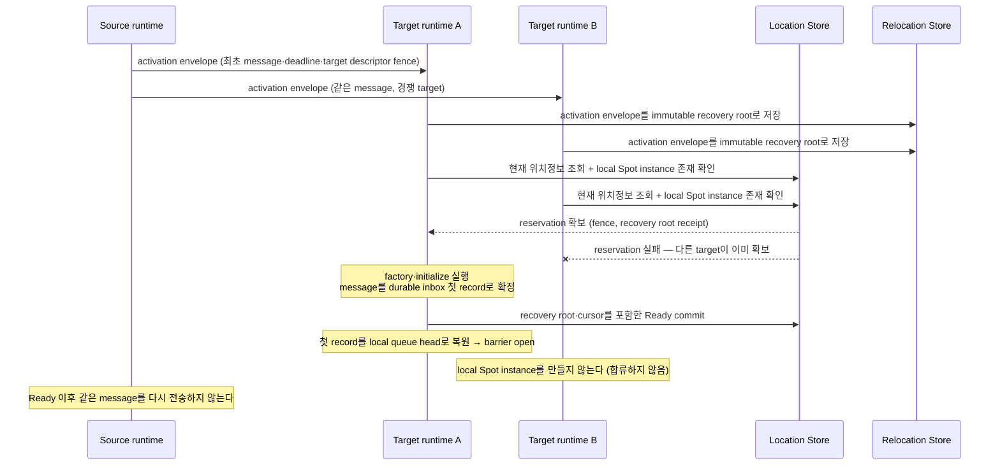

# ZLink Framework API

[Foundation 주제 목차](README.ko.md) · [스펙 목차](../README.ko.md) · [이전: 05. 메시지 모델](05-message-model.ko.md) · [다음: 07. Framework 오류 모델](07-framework-error-model.ko.md)

> Framework의 언어 중립 public API family와 등록 규칙을 정의한다.

## 1. Public contract와 runtime implementation의 경계

이 문서는 ZLink Framework의 언어 중립 public API family와 등록 규칙을 정의한다. 실제 타입,
generic 제약, overload와 비동기 반환 타입은 각 package의 언어별 스펙이 소유한다. 여러 MeshNode가
참여해 node와 Channel message를 주고받는 범위인 .NET
[RouteMesh](02-glossary.ko.md#routemesh)와, 그 RouteMesh에 참여해 message를 보내거나 받는 runtime
node인 [MeshNode](02-glossary.ko.md#meshnode)의 정확한 인터페이스는
[.NET RouteMesh·MeshNode 인터페이스](../languages/dotnet/interfaces/03-configuration-topology.ko.md)를 따른다.

이 문서와 package별 공통 스펙은 언어에 관계없이 같아야 하는 public 동작을 소유한다. 각 언어의
언어별 interface 문서는 그 동작을 해당 언어의 타입, method, 반환값과 오류 표현으로 고정한다.
Runtime 내부 socket, queue, dispatch table과 adapter type은 public contract가 아니며 언어별 interface에
노출하지 않는다. 모든 언어의 언어별 interface는 공통 계약을 축소하지 않고 같은 public 동작을 투영한다.

## 2. Root 등록

Framework root는 process의 host lifecycle과 DI에 한 번 등록한다. Root configuration은 다음 기능을
제공한다.

| 기능 | 등록 결과 |
|---|---|
| [RouteMesh](02-glossary.ko.md#routemesh) | MeshName으로 [MeshNode](02-glossary.ko.md#meshnode) 하나를 등록한다 |
| [ClientServer Channel](02-glossary.ko.md#clientserver-channel) | client가 업무 호출을 시작하고 server가 handler와 reply를 제공하는 별도 service 연결을, ChannelName으로 client 또는 server 역할 하나를 등록해 만든다 |
| classic fanout | MeshNode와 독립된 publisher/subscriber channel을 등록한다 |
| STREAM node | STREAM endpoint와 session handler를 등록한다 |
| [Location Store](02-glossary.ko.md#location-store) | owner, location, generation, relocation authority와 aggregate를 원자적으로 저장할 instance를 등록한다 |
| [Relocation Store](02-glossary.ko.md#relocation-store) | 주소와 상태를 가진 논리 instance인 [Spot](02-glossary.ko.md#spot)의 Instance 종류가 cold activation할 때 필요한 activation envelope와 relocation 뒤 완료되는 cross-node relocation의 immutable state·journal·replay payload를 저장할 instance를 등록한다 |
| codec extension | typed payload serializer를 등록한다 |
| handler와 filter | dispatch handler, filter와 metadata policy를 등록한다 |
| worker | bounded worker scheduler의 동시성, idle timeout과 queue 상한을 설정한다 |
| network identity | listener가 공통으로 사용할 bind host와 advertised host를 설정한다 |
| deployment identity | target eligibility에 사용할 application version과 maintenance wave를 설정한다 |
| inbound dispatch | Core가 messaging budget 계산에 사용하는 [Core HWM budget](02-glossary.ko.md#core-hwm-budget) 전달값과, handler 시작을 기다리는 application job 수를 제한하는 host 전체 [Application job queue](02-glossary.ko.md#application-job-queue) profile/capacity를 설정한다 |

같은 root를 process에 두 번 구성하거나 같은 [MeshName](02-glossary.ko.md#meshname)을 중복 등록하면 startup에서 설정 오류가 발생한다.
같은 [ChannelName](02-glossary.ko.md#channelname)을 서로 다른 RouteMesh 또는 ClientServer topology에 등록해도 역할과 관계없이 startup에서
실패한다.
현재 process에서 network endpoint를 bind하고 remote 연결을 받는 transport 구성 요소인
[Network listener](02-glossary.ko.md#network-listener)의 공통 identity 값과 listener별 override는
[13 Network listener identity](../02-channel-transport/04-network-listener-identity.ko.md)가 소유한다.

Root 등록은 process당 Framework runtime singleton 하나를 제공한다. 이 runtime은 host 전체를 대상으로
mode를 필수로 받는 `Relocate`와, runtime을 새 operation admission을 받지 않는
[Shutdown](02-glossary.ko.md#shutdown) 상태로 전환하는 별도의 `Shutdown`을 수행한다.
`PlannedMaintenance`는 source와 같은
application version으로 이전하고, `RollingUpdate`는 caller가 지정한, source보다 큰 version으로
이전한다. MeshName, ChannelName이나 node RID별 drain operation은 제공하지 않는다.
State, mode별 target 선택, terminal result, 기본 deadline, 반복 호출과 cancellation 계약은
[54 Host Relocate, Shutdown & Handoff](../05-location-relocation/05-host-relocation-flow.ko.md)가 소유한다.

Framework builder는 service liveness interval과 [deadline](02-glossary.ko.md#deadline)을 공개하지 않는다. Service runtime은 공통 profile을
내부에서 적용하며 orderly disconnect와 half-open 장애를 구분한다. 고정값, service liveness message와 reconnect
계약은 [55 Transport Liveness](../02-channel-transport/05-transport-liveness.ko.md)가 소유한다.

## 3. Core memory budget과 Application job queue 설정

Framework는 message byte 상한을 따로 계산하지 않는다. Core context 하나가 Core queue용 messaging
budget 하나를 소유하고, Framework는 다음 설정을 binding의 같은 context option으로 전달한다. 이
전달은 startup configuration일 뿐 Framework가 Core HWM 계산을 소유한다는 뜻이 아니다.

```text
// contract pseudocode이며 실제 API가 아니다 — 실제 언어별 타입과 시그니처는 대상 언어 언어별 interface가 소유한다.
RootInboundDispatchOptions {
    // 선택. Core budget 계산에 사용할 원본 가용 memory byte다.
    CoreHwmMemoryLimitBytes: long,
    // 선택. Profile 계산을 건너뛰는 정확한 Core-managed messaging budget이다.
    CoreHwmBudgetBytes: long,
    // 선택. Core가 memory budget과 queue별 byte HWM을 계산할 profile이다. 기본값은 `Balanced`다.
    CoreHwmProfile: Compact | LowLatency | Balanced | Throughput = Balanced,
}
```

`CoreHwmBudgetBytes`와 `CoreHwmMemoryLimitBytes`를 함께 지정하면 manual budget이 우선한다.

둘 중 하나가
Core가 확인한 finite process·container hard limit보다 크거나 값이 양수가 아니면 socket bind 전에
configuration error로 실패한다 — 이 오류는 언어별 configuration exception으로 호출 시점에 바로
전달되며 remote error reply로 바뀌지 않는다([Framework 오류 모델 「3. 호출 전에 확인할 수 있는
오류」](07-framework-error-model.ko.md#3-호출-전에-확인할-수-있는-오류)).

이 문서 전체에서 나오는
`configuration error`와 `startup configuration error`도 같은 방식으로 전달된다.

명시 값이 없으면
managed binding은 GC, JVM 또는 V8의 원본 runtime
memory hint를 Core에 전달하고, native binding은 Core의 container·process·OS 감지를 사용한다.

Framework와
binding은 profile 비율을 적용하거나 budget을 connection 수로 나누지 않는다.

Core queue가 application record를 binding에 넘기면 해당 Core byte charge는 끝난다. 이후 payload는
[Payload 소유권과 복사](../01-execution/05-payload-ownership-and-codec.ko.md)의 일반 message lifetime을 따르며 Core
HWM credit이나 별도 capacity token이 아니다. Framework는 retained receive를 사용해 이 charge를
handler 또는 reply terminal까지 연장하지 않는다. RouteMesh ROUTER-ROUTER reply와 error reply는
별도 [Completion connection](02-glossary.ko.md#completion-connection)을 사용하여 ordinary Core byte HWM 경로를 통과하지 않는다.
ClientServer DEALER-ROUTER reply와 error reply는 single Application connection의 Core HWM·PAUSED를
통과한 뒤 completion으로 식별된다. 두 topology 모두 completion으로 식별된 뒤에는 Application
Job Queue permit을 사용하지 않는다.

Framework host instance는 handler 시작을 기다리는 application job 수를 별도 permit으로 제한한다. Root의
inbound-dispatch option은 다음 값을 제공한다.

```text
// contract pseudocode이며 실제 API가 아니다.
RootInboundDispatchOptions {
    // 선택. 자동 job 상한 profile이다. 기본값은 `Balanced`다. (processor당 job 수는 아래 Profile 표를 따른다)
    ApplicationJobQueueProfile: Compact | LowLatency | Balanced | Throughput = Balanced,
    // 선택. Profile 계산을 완전히 대체하는 정확한 상한이다. 범위 `1..2,147,483,647`.
    MaxQueuedApplicationJobs: int,
    // 선택. 범위 `1..100`. 기본값은 `80`이다.
    ApplicationJobQueuePauseThresholdPercent: int = 80,
    // 선택. 범위 `0..99`. 기본값은 `60`이며 pause 값보다 작아야 한다.
    ApplicationJobQueueResumeThresholdPercent: int = 60,
    // 읽기 전용. Startup에서 확정한 실제 host instance 상한이다(status 값).
    EffectiveMaxQueuedApplicationJobs: int,
}
```

Manual 범위 위반은 startup configuration error이며 unlimited mode는 없다. Manual 값이 없으면 effective
processor 수는 startup에서 알려진 양수 값인 runtime constrained logical count, affinity/cpuset count,
`floor(quota/period)`(최소 1), explicit executor maximum의 최솟값이다. 알려진 값이 없으면 1이다.

`ApplicationJobQueueProfile` 값별 processor당 job 수는 다음과 같다.

```text
Compact     -> 32
LowLatency  -> 64
Balanced    -> 128
Throughput  -> 256
```

곱셈 overflow는 socket bind 전 startup configuration error다. 값은 startup에서 확정하고 runtime CPU·TPS
측정값에 따라 자동으로 바꾸지 않는다. `CoreHwmProfile`과 `ApplicationJobQueueProfile`은 같은 label을
사용하지만 type, owner, 단위와 계산을 공유하지 않는다. 두 profile의 기본값은 각각 `Balanced`이며
한쪽 선택이 다른 쪽 값을 바꾸지 않는다.

Framework는 effective maximum에 pause percent를 곱한 값을 올림하여 pause permit count를 정하고,
resume percent를 곱한 값을 내림하여 resume permit count를 정한다. Startup은 두 percent의 범위와
`resume < pause`를 함께 검증하며, 위반하면 socket bind 전에 configuration error로 실패한다.
Pressure count는 reserved supply permit과 queued application job의 합인 permits in use다.

Record 종류에 따라 permit 획득·반환 시점이 갈린다.

| Record 종류 | Permit 동작 |
|---|---|
| Pre-receive에 terminal reply 또는 error reply completion으로 식별되는 supply | queue permit을 사용하지 않는다 |
| Ordinary connection에서 먼저 받은 뒤 위 supply로 분류한 record | 우회하지 않는다 |
| 그 밖의 ordinary ingress(application, control, malformed 공통) | receive·claim 직전에 같은 shared permit을 얻는다 |
| Control·malformed record | 내부 처리 직후 permit을 반환한다 |
| Application record | 최종 handler turn마다 permit 하나를 사용하며 executor·mailbox·serial gate에서 기다리는 동안 유지한다. 공통 invocation wrapper가 사용자 callback의 첫 instruction을 실행하기 직전에 permit을 정확히 한 번 반환한다 |
| Handler가 시작한 뒤의 비동기 대기와 continuation | permit을 다시 얻지 않는다 |

상한에 도달하면 새 ordinary ingress supply는 permit을 cancellable하게 기다린다. Reject·drop, 별도 LWM,
polling, busy spin과 unbounded 임시 queue로 바꾸지 않는다. 가장 오래 기다린 live source에 반환 permit을
직접 넘기고, waiter가 있으면 새 acquire가 앞지르지 않는다. Batch와 1:N local dispatch도 획득한 permit보다
많은 handler job을 먼저 만들 수 없다. Core receive queue가 채워지면 기존 origin별 byte HWM이 sender까지
backpressure를 전달한다.

Framework job pressure가 Core에 주는 runtime feedback은 지원 socket의 receive-flow 절대 상태
`RUNNING`·`PAUSED`뿐이다. Framework는 이 전이로 Core HWM 설정이나 queued-byte counter를 바꾸지
않는다. Core snapshot 투영은 읽기 전용 관측이며 pressure 계산의 입력이 아니다.

두 capacity의 분리 의도, permit 반환 경계와 relocation durable staging의 예외는
[Core byte HWM과 Application job flow](../01-execution/04-application-job-queue-and-backpressure.ko.md)가 정의한다.

Root Location option은 startup-only `SessionRelocationSealTimeout`을 소유한다. 기본값은 `3,000 ms`이며
finite positive duration만 허용한다. 0, 음수, 무한대와 언어별 interface가 유한 millisecond로
표현할 수 없는 값은 socket bind 전에 configuration error다. Session owner가 relocation seal의 terminal
cutover/abort를 기다리는 상한이며 runtime 중 변경하지 않는다.

Root Location option은 Actor·Spot relocation payload의 직접 전송에 적용하는 다음 server 설정도
소유한다. Source runtime은 relocation payload를 chunk로 나눠 source–target mesh 연결로 직접 전송한다.

```text
// contract pseudocode이며 실제 API가 아니다.
RootLocationOptions {
    // Relocation payload를 나눈 encoded chunk 하나의 크기 상한이다. 기본 256 KiB.
    // Transport가 협상한 frame 한도를 넘게 설정하면 socket bind 전에 startup configuration error다.
    RelocationPayloadChunkLimit: bytes = 256_KiB,
    // Source 노드 하나가 peer 연결 하나에 대해 동시에 전송 중인 relocation chunk byte 합계의 상한이다.
    // 기본 16 MiB. `0`은 이 예산을 적용하지 않는다는 뜻이다.
    RelocationInFlightPayloadBudget: bytes = 16_MiB,
    // 같은 합계를 peer 연결 하나가 아니라 source 노드 전체에 대해 제한하는 상한이다.
    // 기본 0(미적용). 양수이면 chunk 제출은 peer 예산과 이 예산을 모두 만족해야 한다.
    RelocationNodeInFlightPayloadBudget: bytes = 0,
    // Target이 relay 수신 준비 reply를 보낸 뒤 cutover를 기다리는 시간이며,
    // source가 재전송을 위해 boundary batch와 cutover 사본을 유지하는 시간이기도 하다. 기본 1,000 ms.
    RelocationCutoverWaitTimeout: duration = 1000_ms,
}
```

두 예산의 합계는 encoded payload byte가 아니라 Core가 아직 계상 중인 chunk의 accounted
charge(frame별 metadata charge 포함) 기준이다. 네 설정 모두 배치별로 변경할 수 있고, runtime이 왕복
시간이나 부하를 관찰해 자동으로 조정하지 않는다. Chunk 분할·협상, 예산 계상과 대기, cutover
fallback과 재전송 창의 동작 계약은
[Actor와 Spot relocation 전체 흐름](../05-location-relocation/04-relocation-flow.ko.md)이 소유한다.

## 4. RouteMesh 등록

RouteMesh 등록은 MeshName 하나를 받고 MeshNode builder를 반환한다. MeshNode builder는 다음 설정을
소유한다.

- explicit manual topology의 고정 routing ID 또는 automatic topology의 diagnostic prefix
- ROUTER bind endpoint와 transport option
- 0개 이상의 immutable ChannelName server membership과 outbound Channel route 선언
- manual peer connection intent
- node direct와 channel handler
- `None`, `Client`, `Server` 중 하나인 object role
- Object Server의 Entry Spot, user Spot, typed Actor와 actor-free Instance Spot factory
- 모든 object factory callback에서 선택하는 `DisableRelocation`, `RecreateOnRelocation`, `PreserveStateWith` policy
- node별 Actor·Spot 수와 Spot type별 capacity, node-wide placement weight
- route cache age와, relocation 뒤에도 이전 owner node로 도착한 message를 새 owner에게 대신
  전달하는 [Message Follow](02-glossary.ko.md#message-follow) duration
- room·stage·zone처럼 위치가 바뀔 수 있는 대상에 message 하나를 여러 Spot으로 전달하는
  [Logical Multicast](02-glossary.ko.md#logical-multicast) publish policy

MeshName은 물리 mesh의 이름이고 ChannelName은 논리 [membership](02-glossary.ko.md#membership)이다. 같은 MeshNode에 ChannelName을 여러
개 등록할 수 있다. `ChannelName` 호출은 별도 socket을 만들지 않는다. host가 시작된 뒤 MeshName,
[routing ID](02-glossary.ko.md#routing-id), endpoint와 membership set은 바꿀 수 없다.

Location option의 `RouteCacheMaxAge` 기본값은 15초이고 `MessageFollowDuration` 기본값은 30초다. 둘 다
0이면 route cache와 Message Follow를 끈다. 양수이면 cache age가 Message Follow가 유효한 기간인
[Message Follow duration](02-glossary.ko.md#message-follow-duration)보다 최소 5초 작아야 한다.
실행 중 변경한 값은 새 cache entry와 새 relocation부터 적용한다. Message Follow duration이 끝난 stale route는
stale-location 오류로 실패하며 Framework가 자동으로 다시 보내지 않는다.

RouteMesh Channel builder는 `Client`와 `Server` 역할을 구분한다. `Client`는 ChannelName을 해당 MeshNode의
outbound 송신 경로로 등록하지만 peer에게 target membership으로 광고하지 않으며 [weight](02-glossary.ko.md#weight)와 handler를 갖지
않는다. `Server`는 target membership과 handler namespace를 등록하며 weight와 handler 설정을 제공한다.
Server도 같은 ChannelName으로 outbound 호출을 시작할 수 있으므로 같은 이름의 Client 역할을 중복 등록하지
않는다.

Channel Server weight 범위는 0부터 10000까지이며 기본값은 100이다. 실행 중에는 server weight만 바꿀 수 있다.
`SetWeight(0)`은 server를 새 선택에서 제외하는 drain 설정이며 Client 역할을 표현하지 않는다.
Listener가 받을 수 있는 complete transport message의 byte 상한인
[`MaxMessageSize`](02-glossary.ko.md#max-message-size)를 포함한 topology와 socket 설정은 startup
뒤 바꿀 수 없다.

Object role은 닫힌 값이다.

| Object role | 하는 일 |
|---|---|
| `None` | object manager, factory와 placement runtime을 만들지 않는다 |
| `Client` | global Actor·Spot operation을 시작할 수 있지만 factory와 placement target을 제공하지 않는다 |
| `Server` | Client capability를 포함하며 factory와 placement target을 제공한다 |

`Client`와 `Server`는 [location store](02-glossary.ko.md#location-store)가 필수다. Factory는 Object
Server builder에만 등록하며 같은 stable type을 중복 등록하면 startup이 실패한다.

Object Client는 object 기능에서만 outbound-only다. 같은 MeshNode에 RouteMesh Channel
Server를 등록할 수 있지만, MeshName과 target RID를 함께 지정해 특정 MeshNode에 보내는 application
[Node direct](02-glossary.ko.md#node-direct) handler는 등록할 수 없다. 두
MeshNode가 모두 Object Client이고 양쪽 모두 RouteMesh Channel Server membership이
없을 때만 peer connection을 생략한다. Server membership은 weight가 `0`이어도 연결
필요성을 만든다.

Object Server는 새 Actor·Spot을 배치하거나 relocation할 node를 고를 때, Channel weight와는
독립적으로 node 전체에 적용하는 [weight](02-glossary.ko.md#weight)(node-wide placement
weight)를 사용한다. 범위는 0부터 10000까지이고 기본값은 100이다.

0인 node는 새 placement와 relocation target에서 제외하지만, 생성과 초기화가 끝나
application message를 받을 수 있는 상태인 [Ready](02-glossary.ko.md#ready) object와 이미
reservation을 확보한 attempt는 유지한다.

비용이 다른 Actor와 Spot을 합산하는 node 전체 active object 제한은 두지 않는다.

Node별 Actor, User·Instance Spot 전체와 Spot stable type별 limit은 `0`이 기본값이며 제한 없음을 뜻한다.
양수이면 `1..2^31-1` 범위에서 해당 node의 최대 개수이고 음수이면 startup configuration 오류다.

Entry Spot은 Object Server node마다 하나로 고정하며 configurable Spot count에 포함하지 않는다.
다만 Entry Spot에 존재하는 Actor는 Actor 전체 limit에 포함한다. Actor stable type별 limit은 제공하지 않는다.

상한 판정은 Active count와 factory가 완료되기 전에 확보한 reserved slot을 함께 계산한다. Location Store가
reservation과 authority를 같은 transaction에서 확정하며 descriptor count는 후보 선택용 projection이다.
Capacity를 만족하는 후보가 없으면 `CapacityExceeded`로 완료한다.

기존 pending activation `128`
제한은 object population limit이 아니라 동시에 진행되는 activation을 보호하는 별도 admission 제한이다.
Activation concurrency 기본값은 node당 `128`이고 양수만 허용한다. Permit은 factory와 initialization이
끝나면 반환하며 active·reserved population count를 바꾸지 않는다.

하나의 object를 만들거나 relocation할 때 필요한 모든 capacity는 하나의 typed bundle로 예약한다.
Actor bundle에는 Actor slot 하나가 들어간다. Spot bundle에는 Spot 전체 slot 하나와, stable type limit을
설정했다면 Entry·User·Instance 중 어떤 종류의 Spot인지 나타내는 값인
[Spot kind](02-glossary.ko.md#spot-kind)·stable type slot 하나가 함께 들어간다. User Spot
aggregate를 relocation할
때는 Spot slot, Spot type slot과 member Actor 수만큼의 Actor slot을 한 transaction에서 모두 확보한다.
일부 slot만 확보한 상태는 외부에 공개하지 않는다.

RouteMesh Channel Server, ClientServer Server와 node-wide placement weight는 모두 정수 `0..10000`, 기본값
`100`을 사용한다. Startup 설정과 runtime 변경에서 음수나 `10000`보다 큰 값은 configuration error다.
Weighted selection은 후보 weight 합계를 최소 64-bit 정수로 계산한다. Logical Multicast는 positive weight의
크기와 관계없이 eligible remote member를 한 번만 포함하며 weight `0`인 member는 제외한다.

Create call은 target RID, predicate나 selection callback을 제공하지 않는다.

Framework의 `MaxMessageSize = 0`은 Framework가 transport 기본값보다 작은 별도 상한을 두지 않는다는
뜻이다. 양수는 같은 byte 상한으로 적용하고 음수 값은 설정 오류다. Binding option 표현과 변환은
언어별 구현이 소유하며 application public API에 노출하지 않는다.

ClientServer application listener의 `MaxMessageSize` 기본값은 `16,777,216` bytes(16 MiB)다.
`MaxMessageSize`는 Core memory budget과 Application job queue capacity에서 독립된 단일 message
상한이다. `0`은 Framework가 별도 상한을 두지 않는다는 뜻이며 다른 HWM 또는 queue 설정과 결합 검증하지 않는다.

이 일반 application listener 규칙은 ClientServer에 적용하고 RouteMesh ServerServer에는 적용하지 않는다.
RouteMesh SS는 Framework-level message-size 설정이나 상한을 제공하지 않는다.

StreamNode의 Core STREAM inbound 상한은 이 일반 application listener 규칙과 별도로 `64 KiB`를
기본값으로 사용한다. client→server complete message의 header와 payload 합을 검사하고 6-byte prefix는
제외한다. `0`은 Core `-1`로 변환하며 server→client outbound에는 적용하지 않는다.

MeshNode builder에는 drain policy나 lifecycle command를 추가하지 않는다. Host의 continuity maintenance는
Framework runtime의 `Relocate`, 일반 종료는 `Shutdown`이 수행한다. Caller는 node 점검에는
`PlannedMaintenance`, 새 version 배포에는 지정한 target version을 가진 `RollingUpdate`를 선택한다.
Host lifecycle state마다 의미가 다르다.

| State | 의미 |
|---|---|
| `Relocating` | permit을 얻은 relocation unit부터 진행하면서 나머지 unit의 application 처리를 유지하는 state |
| `Relocated` | 모든 stateful object의 relocation을 마쳤지만 host와 infrastructure를 유지하는 state |
| `Draining` | 별도로 호출한 `Shutdown`이 resource를 정리하는 state |

Channel weight 0을 lifecycle state 대신 사용하지 않는다.

## 5. Manual peer

Manual peer API는 두 가지 intent를 제공한다.

- endpoint만 지정하면 admission handshake가 remote RID를 확정한다.
- expected RID와 endpoint를 함께 지정하면 handshake RID가 일치할 때만 받아들인다.

Runtime control은 connect intent 추가, endpoint 기준 intent 해제와 현재 intent 목록 조회를 제공한다.
Manual peer도 같은 MeshName, RID, generation, immutable ChannelName set과 security identity를 검증한다.
같은 endpoint의 transport 재접속은 Framework service runtime이 binding의 raw socket reconnect 계약을
사용해 관리한다. Application은 reconnect loop, pipe identity와 transport backoff를 구성하지 않는다.

## 6. 메시징 API family

Public messaging은 typed payload를 받고 Framework가 packet name과 codec을 결정한다.

| API family | 필요한 대상 | [handler namespace](02-glossary.ko.md#handler-namespace) |
|---|---|---|
| [Node direct](02-glossary.ko.md#node-direct) send/request | MeshName context와 target RID | MeshNode route handler |
| Channel send/request | ChannelName | ChannelName handler |
| [Spot](02-glossary.ko.md#spot) send/request | Spot을 식별하는 전역 논리 주소인 global [Spot ID](02-glossary.ko.md#spot-id) | current [Ready](02-glossary.ko.md#ready) Spot |
| Actor send/request | global Actor ID | current Ready Actor context |
| [Logical Multicast](02-glossary.ko.md#logical-multicast) publish | ChannelName과 topic | local Spot subscription |
| [classic fanout](02-glossary.ko.md#classic-fanout) publish | fanout channel name | fanout subscriber handler |
| STREAM send/request | session 또는 connector context | session packet handler |

Node direct와 channel operation은 target selection과 submit을 한 호출로 수행한다. 공개 `selectNode`,
`selectOne`, `selectMany` 단계는 제공하지 않는다.

Channel client는 ChannelName을 process-local route index에서 찾아 RouteMesh MeshNode 또는 ClientServer
client 하나를 선택한다. Index에 없는 이름은 `NotFound`로 끝내고 다른 MeshNode나
ClientServer client를 검색하거나 relay하지 않는다. 등록된 송신 경로에 ready target pipe가 없으면
`Unavailable`, [ready target](02-glossary.ko.md#ready-target) snapshot 자체가 없으면 `NotFound`를 사용한다.

Logical Multicast도 ChannelName을 같은 process-local route index에서 찾아 [owner](02-glossary.ko.md#owner) RouteMesh MeshNode를
선택한다. 호출자는 MeshName이나 endpoint를 제공하지 않는다. 선택된 owner MeshName과 물리
route는 runtime monitoring과 message-flow 관측에 남지만 application 호출 인자로 되돌리지 않는다.

Application 호출은 raw `Message` 대신 업무 객체를 사용한다. Raw message는 bindings의 low-level
transport API와 명시적인 encoded payload 확장에만 둔다. Handler는 typed payload와 읽기 전용 context를
받으며 routing envelope를 직접 조립하지 않는다.

## 7. Call operation

Operation별 call object는 해당 기능에 유효한 설정만 제공한다.

- one-way send와 session Actor relay는 source-local admission을 비동기로 기다리며 정상 완료 값을 반환하지
  않는다.
- request는 metadata, reply timeout, 취소와 typed reply를 제공한다.
- Logical Multicast publish는 metadata, ChannelName, [topic](02-glossary.ko.md#topic)과 비동기 submit 하나를 사용한다.
- Spot과 Actor message 호출은 global ID를 보존하고 current Ready [authority](02-glossary.ko.md#authority)를 Framework 내부에서 찾는다.
- Create·lookup이 반환한 ref는 그 incarnation을 변경하거나 session에 bind할 때 사용하며 일반 message의
  target으로 사용하지 않는다.
- STREAM 호출은 session identity와 packet correlation을 보존한다.

Server package의 one-way send·publish·명시적 STREAM reply는
[비동기 실행 정책](../01-execution/01-submit-and-completion.ko.md)의 async-only admission 계약을 따른다. Public call은
즉시 한 번만 시도하는 동기 terminator를 함께 제공하지 않는다. 별도 stream connector package의 send
builder는 connector package 계약을 따른다. Request timeout은 reply 대기에만 적용하고 send timeout은
transport admission 대기에 적용한다.
최초 non-blocking transport submit이 즉시 수락되면 Framework scheduler나 별도 work queue에 추가하지
않고 이미 완료되었거나 resolved된 언어별 awaitable을 반환한다.

Metadata는 Framework가 검증한 immutable [snapshot](02-glossary.ko.md#snapshot)으로 handler에 전달한다. 같은 key를 여러 번 설정하면
마지막 값이 사용된다. metadata 전체의 UTF-8 encoded 크기는 1024 bytes를 넘을 수 없다. reply는 request
metadata를 자동 복사하지 않는다.

## 8. Logical Multicast 완료

MeshNode와 Spot publish API는 publish 전용 전달 정책 option을 제공하지 않는다. Framework의 bounded I/O
executor는 publish operation의 admission을 send timeout까지 기다린다. Timeout 전에 시작하지 못하면,
operation에 허용된 deadline까지 완료 조건을 만족하지 못했을 때 발생하는 Framework exception인
[`DeadlineExceeded`](02-glossary.ko.md#deadlineexceeded), cancellation 또는 `ShuttingDown` 중
먼저 확정된 예외로 완료한다. 시작한 뒤에는
확정한 target snapshot을 정확히 한 번 처리하며 cancellation이나 shutdown으로 나머지 target 제출을
중단하지 않는다.

Target별 수락·실패 결과는 public publish 결과로 반환하거나 publish 전용 monitoring 값으로 집계하지
않는다. Snapshot target이 0개여도 정상 완료한다. Transaction 시작 뒤 remote capacity·연결 실패와 local
Spot queue drop은 전체 publish를 rollback하거나 exceptional completion으로 바꾸지 않는다. 앞에서 수락한
target은 뒤 target의 실패 때문에 취소하지 않는다.

## 9. Handler 등록과 dispatch

Handler key는 owner와 message kind를 포함한다.

| owner | dispatch key |
|---|---|
| Node direct | MeshName, route kind, [packet name](02-glossary.ko.md#packet-name) |
| Channel | ChannelName, send/request kind, packet name |
| Spot packet | Spot type, packet kind, packet name |
| Spot [subscription](02-glossary.ko.md#subscription) | Spot type, ChannelName, topic filter, packet name |
| Actor | Actor type, packet kind, packet name |
| [STREAM session](02-glossary.ko.md#stream-session) — STREAM 연결 하나를 수락한 때부터 닫을 때까지 유지하는 서버 실행 단위 | stream node, session type, packet name |

같은 key의 중복 등록은 startup 설정 오류다. 서로 다른 ChannelName이나 owner에는 같은 packet name을
등록할 수 있다. Packet name은 registration descriptor가 한 번 결정하며 codec은 packet name에 관여하지
않는다.

모든 handler가 공유하는 base context는 MeshName을 요구하지 않는다. Channel handler context는
ChannelName, [message kind](02-glossary.ko.md#message-kind), packet name, metadata와 correlation 정보를 제공한다. Node direct handler
context는 물리 RID namespace가 실제 대상 계약이므로 MeshName과 source·target RID를 별도 context에
유지한다. 선택된 RouteMesh 또는 ClientServer 종류와 endpoint는 application handler가 아니라 monitoring과
message-flow 관측에서 제공한다.

Runtime reflection을 제공하는 언어는 명시한 assembly, module 또는 package 범위에서 handler를 찾을 수
있다. C++는 compile-time type과 명시 builder 등록을 사용한다. 어떤 방식을 사용해도 같은 dispatch key와
중복 검증 규칙을 적용한다.

## 10. Handler filter

Handler filter는 Framework root에 등록한 process-level handler에 적용한다.

| dispatch | filter |
|---|---|
| RouteMesh·ClientServer Channel send/request | 적용한다 |
| Node direct send/request | 적용한다 |
| classic fanout 구독 handler | 적용한다 |
| Spot·Actor handler | 적용하지 않는다 |
| Spot이 등록한 Logical Multicast 구독 handler | 적용하지 않는다 |
| [STREAM session](02-glossary.ko.md#stream-session) handler | 적용하지 않는다 |

Filter context는 current message 정보와 dispatch 종류를 함께 제공한다. Dispatch 종류는 Node direct
send/request, Channel send/request와 classic fanout의 다섯 값이다. Channel 값은 RouteMesh와 ClientServer를
함께 나타낸다. RouteMesh와 Node direct는 MeshName을 제공하고 ClientServer와 classic fanout은 제공하지
않는다. Classic fanout을 구분하려고 등록되지 않은 가짜 MeshName을 넣지 않는다. Socket 종류, endpoint와
내부 dispatch table은 공개하지 않는다.

Filter는 root에 등록한 순서대로 handler 앞에서 실행한다. 각 filter가 `next`를 호출하면 다음 filter가
실행되고 마지막 filter가 `next`를 호출하면 handler가 실행된다. `next`가 완료된 뒤에는 등록의 반대
순서로 각 filter의 나머지 코드를 실행한다. Filter는 `next`를 최대 한 번 호출할 수 있다. 두 번째 호출은
handler를 다시 실행하지 않고 application 코드 오류로 거부하며 자동 재시도하지 않는다.

Filter가 `next`를 호출하지 않으면 그 handler를 실행하지 않는다.

| dispatch | 결과 |
|---|---|
| Node direct·Channel send | 현재 dispatch를 끝낸다. 송신자에게 추가 결과를 보내지 않는다 |
| classic fanout | 현재 구독 handler만 끝낸다. 다른 구독 handler는 계속 실행한다 |
| Node direct·Channel request | `Rejected` 오류 reply를 보낸다. `null`을 정상 업무 reply로 직렬화하지 않는다 |

Filter는 request 업무 reply를 직접 만들거나 대체하지 않는다. 값을 반환하는 언어에서도 filter 반환값은
`next`가 만든 handler 결과를 전달하는 데만 사용한다. `next`를 호출하지 않은 request는 filter가 값을
반환해도 `Rejected`다.

Handler 하나를 실행하는 dispatch마다 scope를 새로 만든다. Handler와 각 filter instance를 그 scope에서
한 번씩 만들고 같은 scoped dependency를 제공한다. Application이 handler나 filter type에 지정한 DI
lifetime은 이 수명을 바꾸지 않는다. Framework가 filter 호출에 전달한 cancellation 신호는 같은 dispatch의
handler에도 전달한다. 정상 완료, `next`를 호출하지 않은 종료, 예외와 cancellation 모두 instance와 scope를
정확히 한 번 정리한다.

Classic fanout message가 여러 구독 handler와 일치하면 handler마다 별도 dispatch와 scope를 만든다. 한
handler의 filter 중단이나 실패는 다른 handler를 취소하지 않는다. 이미 시작한 다른 fanout dispatch도
현재 dispatch의 cancellation로 취소하지 않는다.

Filter 또는 handler에서 발생한 예외는 해당 dispatch의 기존 실패 처리 규칙을 따른다. 언어별
interface는 filter context와 `next`의 구체적인 타입, 비동기 반환 타입과 오류 type 이름을 소유한다. 적용
범위와 실행 순서는 이 절이 소유하므로 언어별 구현이 다른 dispatch owner까지 filter를 임의로 확장하면
안 된다.

## 11. Handler 실행 객체와 dependency 수명

Handler 종류에 따라 실행 객체와 dependency의 소유 범위를 정한다.

| Handler 종류 | 실행 객체와 dependency 소유 범위 |
|---|---|
| Channel handler와 filter | dispatch 시작부터 terminal completion까지 |
| Spot packet·request·subscription·timer handler | 해당 Spot activation 시작부터 종료까지 |
| Actor send·request handler | 해당 Actor activation 시작부터 종료까지 |

별도 handler class를 사용하는 언어는 Spot과 Actor handler instance를 해당 activation에서
한 번 만들고 이후 dispatch에서 재사용한다. Handler type을 application DI에서 직접
찾지 않으므로 application이 handler type에 지정한 singleton·scoped·transient
설정으로 이 수명을 바꿀 수 없다. 별도의 handler lifetime option도 제공하지 않는다.

C++처럼 handler를 Spot member function으로 표현하는 언어는 별도 handler object를
추가하지 않는다. Spot method는 Actor별 mutable state를 Spot field에 저장하지 않아야
하며 Actor별 상태와 실행 resource는 Actor activation이 소유한다. 이 표현 차이가 서로
다른 Actor 사이의 mutable handler state나 scoped dependency 공유를 허용하지 않는다.

Spot handler의 생성자 dependency는 Spot activation scope에서 찾는다. Actor
handler의 생성자 dependency는 Actor activation scope에서 찾는다. 서로 다른
Actor는 같은 mutable handler state나 scoped dependency를 공유하지 않는다.
`SpotWide`와 `PerActor`도 이 수명 규칙을 바꾸지 않는다.

복구해야 하는 application state는 handler field가 아니라 Spot 또는 Actor가 소유한다.
Handler instance와 dependency는 relocation payload에 넣지 않는다. Spot relocation은
source Spot handler와 scope를 정리하고 target Spot activation에서 다시 만든다. Actor
relocation과 cross-node Join은 source Actor handler와 scope를 정리하고 target Actor
activation에서 다시 만든다. Same-node Join은 Actor activation을 유지하므로 handler와
scope도 유지한다. Leave·destroy·close에서도 Framework가 해당 handler와 scope를 정확히
한 번 정리한다.

Activation을 끝낼 때는 새 dispatch를 먼저 막는다. 이미 queue가 받아들였거나 실행 중인
handler가 terminal completion에 도달한 뒤 handler와 dependency scope를 정리한다. 비동기
handler가 실행 중인데 dependency를 먼저 정리하거나, 종료가 시작된 activation에서 handler를
다시 만들면 안 된다. Handler 자신이 종료 operation을 시작하는 경우에도 현재 dispatch를
기다리는 순환 대기가 생기지 않아야 한다.

Framework scheduler는 ready owner의 bounded mailbox를 부분 drain하고 Node, Spot과 Actor handler를 해당
application 실행 문맥에서 호출한다.

Mailbox 한도는 **건수와 대기 중 byte 합계 두 축을 모두 강제한다.** 먼저 걸리는 쪽을 적용한다.
한 축만 두면 다른 축으로 우회할 수 있다 — 건수만 두면 같은 건수가 payload 크기에 따라 수천 배의
memory를 점유하고, byte만 두면 빈 payload를 무한히 쌓아도 한도에 걸리지 않는다.

Byte 회계는 payload 크기만 세지 않는다. 대기 중인 작업 하나가 점유하는 envelope, metadata, queue
node를 **더한다** — `payload 크기 + metadata 크기 + 작업당 고정 비용`이다. 큰 payload에서도 고정
비용은 그대로 더한다. Payload가 비어 있어도 작업 하나는 0 byte가 아니다. 합이 표현 범위를 넘으면
최댓값으로 고정하고 그 제출을 거절한다.

**두 축은 하나의 작업으로 예약한다.** 건수와 byte를 각각 확인하면 한쪽만 통과한 상태가 생긴다.
어느 한 축이라도 한도를 넘기면 두 축 모두 바뀌지 않은 채로 실패해야 한다. 반환도 같다 — 반환
시점은 **작업을 대기열에서 꺼낼 때가 아니라 handler가 끝난 뒤**다. 실행 중인 작업이 점유한
memory는 아직 해제되지 않았기 때문이다. 따라서 한도는 대기 중 작업과 실행 중 작업을 함께 센다.

한 owner가 scheduler를 연속으로 점유하는 시간에는 상한이 있다. 상한에 도달하면 남은 작업을 ready
상태로 되돌리고 다른 ready owner에게 실행을 넘긴다. 이 상한은 같은 node의 다른 owner가 겪는 최대
대기 시간을 정한다. 실행 중인 handler 하나가 상한을 넘겨 실행되는 경우는 이 계약이 다루지 않는다 —
handler 경계에서만 확인한다.

Scheduler는 작업 도착을 기다릴 때 도착 기반으로 깨어난다. 언어 runtime이 blocking 대기나 callback
wakeup을 제공하지 못해 주기적 확인을 사용하는 경우에는 그 주기를 언어별 문서에 공표한다. 그 주기가
message 하나의 최선 지연 하한이 되기 때문이다. Transport readiness는 application callback 인자가 아니다.
RouteMesh의 request completion과 liveness·admission·relocation·reply recovery service control은
ROUTER-ROUTER Completion connection에서 받는다. ClientServer request completion은
DEALER-ROUTER single Application connection에서 Core가 reply로 식별한 뒤 받으며 앞선 DATA 뒤에서
늦을 수 있다. Core HWM 재시도 결과는 binding의 operation별 completion으로 받는다. 이 infrastructure 작업은 application handler가 점유할 수
없는 실행 영역에서 진행한다. Actor·Spot lifecycle처럼 application callback을 호출하는 job은 application
실행 영역에서 처리한다.

## 12. Codec

JSON은 typed message의 기본 codec이다. JSON만 사용하는 application은 메시지 타입마다 codec을 등록하지
않는다. Protobuf, MessagePack과 사용자 codec은 선택 extension package로 root codec registry에 등록한다.

Codec extension은 content-type을 parameter가 없는 ASCII media type인 `type/subtype`으로
등록한다. `type`과 `subtype`에는 RFC가 정한 media type token 문자만 사용할 수 있다.

Registry는 host를 시작할 때 등록 값을 검사하고 다음 순서로 한 가지 표기에 맞춘다.

1. 값 앞뒤의 SP와 TAB을 제거한다.
2. `type`과 `subtype`에 있는 ASCII 대문자를 소문자로 바꾼다.

이 결과를 canonical form이라고 한다.

Parameter, 값 내부의 공백, non-ASCII 문자 또는 비어 있는
token이 있으면 configuration error다.

여러 등록이 같은 canonical form이 되면 마지막 등록이
앞의 등록을 교체한다.

Framework는 service wire에 canonical form만 기록한다. 수신 경로는 wire의 content-type을 다시
변환하지 않고 registry의 key와 그대로 비교한다. 따라서 대소문자, 공백 또는 parameter 때문에
canonical form과 다르거나 registry에 없는 값은 JSON으로 처리하지 않고 `ProtocolError`로
완료한다. 이 규칙을 적용하면 startup 이후 바뀌지 않는 receive table에서 문자열을 그대로 비교해
codec을 찾을 수 있다(값을 그대로 비교하는 불변 lookup).

HTTP response의 media type parameter는 HTTP client가 먼저 처리한다. HTTP client는 parameter를
해석한 뒤 parameter가 없는 media type만 같은 정규화 절차에 전달한다.

송신할 업무 타입과 일치하는 extension이 없으면 JSON codec을 선택한다. 반면 수신 envelope가 명시한
non-JSON content-type과 일치하는 codec이 registry에 없으면 payload를 JSON으로 다시 해석하지 않고
`ProtocolError`로 완료한다.

송신 codec 선택의 입력은 **호출 지점에 선언된 message type**이다. 실제 전달한 instance의
concrete type이 아니다. Base type이나 interface로 선언한 자리에 subtype instance를 넘겨도
선언 type으로 고른다. 그래야 같은 호출 코드가 실행 시 넘어온 값에 따라 다른 codec과 다른
content-type을 쓰지 않는다.

여러 조건이 동시에 맞으면 **등록 순서가 늦은 것을 우선한다.** 어느 것도 맞지 않으면 JSON
codec을 쓴다.

Framework는 선언 type별 송신 선택 결과를 최대 1,024개까지 저장한다. 저장 공간이 차면 기존
결과를 제거하지 않는다. 그 뒤 처음 보는 type은 송신할 때마다 등록 목록을 다시 평가하며, 그
결과는 저장하지 않는다.

Node.js는 TypeScript의 static type이 runtime에 남지 않는 점을 보완한다. 일반 class instance는
constructor를 선언 type으로 사용한다. 호출 지점의 base class와 instance의 runtime subtype이
다르면 `ZLinkMessage.from(value, declaredType)`의 두 번째 인자로 base class constructor를
전달한다. TypeScript interface에는 runtime constructor가 없으므로, interface 계약을 나타내려면
그 interface와 호환되는 application-defined class의 constructor token을 명시한다.

C++는 `codec_registration_context_t::add_serializer<TPayload>(...)`의 compile-time `TPayload`를
declared payload descriptor로 사용한다. 실제 instance의 runtime type으로 다시 고르지 않는다.

송신 타입 선택의 기본값과 수신 wire content-type 검증은 서로 다른
경계이므로 같은 fallback 규칙을 적용하지 않는다.

Codec은 업무 객체와 payload bytes 사이의 변환만 담당한다. Packet name, routing, correlation과 handler
선택은 Framework가 소유한다. Application metadata와 payload ownership은
[메시지 계약](05-message-model.ko.md)을 따른다. 내부 multipart 구조는 public Framework API에 노출하지
않는다.

언어별 server root와 [Stream Connector](02-glossary.ko.md#stream-connector)의 codec 등록 표면은 다음 언어별 interface가 소유한다.

이 표는 요약이며 실제 심볼은 각 언어의 언어별 interface가 최종 기준이다.

| 언어 | server root 등록 | Stream Connector 등록 | 언어별 interface owner |
|---|---|---|---|
| `.NET` | `Codecs.Use(extension)` | `ZlinkStreamConnectorOptions.PayloadCodec` | [server](../languages/dotnet/interfaces/11-serialization.ko.md), [connector](../../stream-connector/languages/dotnet/03-stream-connector.ko.md) |
| Java | `codecs().use(extension)` | connector의 `typedCodec` option | [server](../languages/java/interfaces/README.ko.md), [connector](../../stream-connector/languages/java/03-stream-connector.ko.md) |
| Kotlin | `codecs().use(extension)` | connector의 `typedCodec` option | [server](../languages/kotlin/interfaces/README.ko.md), [Java/Kotlin connector](../../stream-connector/languages/java/03-stream-connector.ko.md) |
| Node.js | `codecs().use(extension)` | connector의 `codec` option | [server](../languages/node/interfaces/README.ko.md), [connector](../../stream-connector/languages/typescript/03-stream-connector.ko.md) |
| C++ | `codecs().use(extension)` | `connector_options_t::typed_codec` | [server](../languages/cpp/interfaces/02-configuration-host.ko.md), [connector](../../stream-connector/languages/cpp/03-stream-connector.ko.md) |

두 등록 표면은 같은 typed payload 계약을 투영하지만 server extension 객체와 connector option의 구체적인
타입까지 같아야 한다는 뜻은 아니다. JSON 기본 codec은 별도 등록 없이 사용하며, 다른 codec도 메시지마다
등록하지 않고 root 또는 connector instance에 한 번 등록한다.

## 13. Location Store와 Relocation Store 등록

자동 discovery에 참여하는 classic fanout publisher, endpoint 없는 fanout subscriber와 Object Client·Server
role을 사용하는 host는 location store를 명시적으로 등록한다. 공식 production store는 별도 package로
제공하는 Redis extension이다. Application은
Redis store instance를 만들고 root의 일반 location store 등록 API에 전달한다. 전용 Redis 등록 함수는
제공하지 않는다.

Redis connection과 key prefix는 store instance를 만들 때 설정한다. 자세한 계약은
[Redis location store](../05-location-relocation/02-location-store-redis.ko.md)가 소유한다. Process-local in-memory store는
한 process 안의 contract test에서만 사용할 수 있다.

Object role이 `None`이고 manual peer만 사용하는 host는 store 없이 MeshNode를 구성할 수 있다.
Object Server factory에 `RecreateOnRelocation` 또는 `PreserveStateWith` policy가 하나라도 있거나 [Instance Spot](02-glossary.ko.md#entry-spot-user-spot과-instance-spot) factory가 하나라도
있으면 opaque Relocation Store를 정확히 하나 등록해야 한다. Same-node Actor join은 Relocation payload를 만들지
않지만 factory 등록 시점에는 향후 cross-node join과 host `Relocate`를 배제할 수 없으므로 이 조건을 완화하지 않는다.
Instance Spot factory가 없고 모든 factory가 `DisableRelocation`인 same-node 구성만 Relocation Store를 생략할 수 있으며,
cross-node relocation은 capture 전에 거부한다.

Location provider가 owner·relocation authority compare-exchange, generic placement reservation·aggregate commit과
store clock capability를 제공하지 않거나 required Relocation Store가 없거나 둘 이상이면 socket bind 전에 startup
configuration error로 실패한다. 두 Store를 함께 등록하거나 Redis 구현을 직접 등록하는 전용 API는 제공하지
않는다. 공식 Redis Relocation Store와 cross-store 규칙은 [Redis Relocation Store](../05-location-relocation/03-relocation-store-redis.ko.md),
Store interface와 이동별 사용 조건은 [40 Location runtime](../05-location-relocation/01-location-runtime.ko.md)이 소유한다.

Location Store interface와 Relocation Store interface는 서로 상속하지 않는다. Root는 각각의 generic Store instance를
받는 두 registration operation을 독립적으로 제공한다. Actor·Spot별 Store, 두 Store를 한 번에 등록하는 bundle과
Redis 전용 registration operation은 public contract에 포함하지 않는다.

## 14. Classic fanout 등록

Classic fanout은 root에서 독립 channel로 등록한다. Location store를 등록한 Publisher 역할은 Publisher RID를
고정하거나 RID allocation으로 얻고, 실제 bind가 끝난 listener endpoint를 fanout 전용 [descriptor](02-glossary.ko.md#descriptor)로
게시한다. Store가 없는 publisher는 application이 endpoint를 manual subscriber에 전달하는
방식으로 사용할 수 있으며 descriptor를 게시하지 않는다. Subscriber 역할은 endpoint를 받지 않는 automatic discovery와 하나 이상의 endpoint를
직접 등록하는 manual mode 중 하나를 선택한다. 두 mode를 같은 subscriber registration에 섞으면 startup
설정 오류다.

Automatic subscriber는 같은 ChannelName의 live publisher descriptor를 모두 연결하고 publisher마다 전용
SUB socket과 receive loop를 하나씩 만든다. Manual subscriber도 endpoint마다 전용 SUB socket을 사용한다.
다른 ChannelName,
다른 descriptor 종류, draining publisher와 만료된 owner lease는 연결하지 않는다.

Automatic subscriber와
RID allocation을 설정한 publisher는 location store가 없으면 startup에서 실패한다. Manual subscriber와
고정 endpoint만 제공하는 publisher는 다른 분산
기능을 사용하지 않으면 location store 없이 명시한 endpoint만 연결한다.

Fanout handler namespace는
packet name으로 구분한다. Publisher가 정한 topic은 handler context와 관측 정보에 보존하지만
handler 선택 key로 사용하지 않는다. Subscriber별 transport topic filter를 별도 public 설정으로
제공하지 않는다.

Framework는 fanout liveness에 사용하는 고정된 topic byte `01 5A 4C 46 31`을 내부용으로 예약한다. Public
fanout publish에 이 topic을 전달하면 호출 인자 오류다. 이 topic의 beacon은 handler와 application observer에
전달하지 않는다. Beacon과 publisher별 ready 판정은
[Transport liveness](../02-channel-transport/05-transport-liveness.ko.md)가 소유한다.

Manual subscriber builder가 등록한 endpoint 집합은 공통 endpoint 연결 handle로도 제공한다. Application은
이 handle로 runtime 중 endpoint를 연결하거나 해제하고 현재 manual 연결 목록을 조회할 수 있다. 이 handle은
[automatic discovery](02-glossary.ko.md#automatic-discovery) 결과를 수정하는 표면이 아니며 같은 channel을 automatic mode로 전환하지 않는다.

Endpoint 없이 등록한 automatic subscriber의 current connection intent와 ready 상태는
[Runtime monitoring](../06-observability/01-runtime-monitoring.ko.md)의 fanout runtime snapshot과 event로만 관찰한다.
Publisher changed event는 publisher entry를, location changed event는 Location snapshot을 필수로 가지며 두
payload를 nullable field로 섞지 않는다. 이 표면은 읽기 전용이며 endpoint 연결·해제 operation을 제공하지
않는다. Application 설정으로 remote endpoint를 직접 등록하는 방식인
[Manual endpoint](02-glossary.ko.md#manual-endpoint) 연결 handle은 automatic snapshot이나
event의 entry를 변경할 수 없다.

Fanout publish 완료는 local publisher transport가 event를 받아들였다는 뜻이다. Subscriber 수신과 handler
완료는 확인하지 않는다. 자세한 전달 계약은
[Channel 메시징](../02-channel-transport/02-channel-messaging.ko.md#classic-fanout의-interface와-사용-예)이 소유한다.

Classic fanout publish의 공통 입력은 ChannelName, topic과 typed event다. 정확한 언어별 interface는
topic을 명시하는 호출과 topic을 생략하는 typed 편의 호출을 함께 제공한다. 편의 호출은
Framework가 결정한 packet name을 topic으로 사용하며, 명시적 topic 호출을 제거하거나 의미를
바꾸지 않는다. Framework는 typed message 등록에서 packet name과 codec을 결정한다. 발행 호출은 publisher socket의
유한한 send timeout까지 admission을 기다리는 비동기 terminator 하나만 제공한다. 정상 완료에는 public
결과값이 없으며 remote·local target별 count를 집계하는 Logical Multicast publish result도 없다.
Subscriber가 0이어도 local publisher queue가 event를 수락하면 정상 완료한다. Monitoring에는 subscriber
수, 수신 또는 handler 완료 정보를 포함하지 않는다.

## 15. User·Instance Spot과 Actor factory 등록

Spot factory와 typed Actor factory는 Object Server builder에 등록한다. User·Instance Spot type은 UTF-8
1..255 bytes의 case-sensitive stable name이며 언어 class 이름을 wire·Store identity로 사용하지 않는다.
Entry Spot ID는 Framework가 Object Server MeshNode lifecycle마다
`<prefix>-entry-<lowercase-canonical-uuid-v4>` 형식으로 발급하고 caller가 생성하지 않는다. MeshNode와
Entry Spot은 같은 diagnostic prefix를 사용하되 각각 별도의 UUID v4를 생성한다. 같은 lifecycle에서는 같은
Entry Spot ID를 유지하고 replacement lifecycle에서는 새 RID를 발급한다. MeshNode descriptor가 그 Entry
Spot ID와 lifecycle generation의 관계를 게시하며 Actor placement와 Entry Spot join은 이 mapping을
사용한다. Spot ID 문자열을 parsing하여 node 관계를 추론하지 않는다.

Entry Spot ID가 global Spot ID authority와 충돌하면 새 UUID나 reservation을 만들지 않고 startup을 즉시
`AlreadyExists`로 끝낸다. Caller가 User·Instance Spot ID로
`<prefix>-entry-<lowercase-canonical-uuid-v4>` 예약 형식을 지정하면 Store operation이나 factory를 시작하기
전에 startup configuration error로 거부한다. Instance Spot은 actor-free lifecycle을 사용하며 Actor handler,
Actor membership과 Logical Multicast subscription을 등록할 수 없다.

Actor manager와 User Spot manager는 global ID를 받는 `Create`, `GetOrCreate`, `Find` family를 제공한다. Actor
`Create`·`GetOrCreate`는 Actor ID와 stable type을, User Spot `GetOrCreate`는 caller가 정한 [Spot ID](02-glossary.ko.md#spot-id)와 stable
type을 필수로 받는다. User Spot `Create`는 Framework가 global Spot ID를 생성한다. Optional fluent 설정은 initial Mesh,
최대 1 MiB로 encode되는 creation request와 deadline이다. 같은 option을 두 번
설정하면 startup configuration error, terminal submit을 두 번 실행하면 `InvalidOperation`이다.

Initial Mesh 지정에 따른 결과는 다음과 같다.

| Initial Mesh 지정 | 결과 |
|---|---|
| 명시했다 | 해당 Mesh를 사용한다 |
| 생략했고 object role Mesh가 하나다 | 그 Mesh를 자동으로 선택한다 |
| 생략했고 object role Mesh가 없다 | `NotConfigured` |
| 생략했고 object role Mesh가 둘 이상인데 Mesh를 선택하지 않았다 | `InvalidOperation` |
| 존재하지 않는 Mesh를 명시했다 | `NotFound` |

Instance Spot은 manager create family를 제공하지 않는다. Global Spot ID 하나로
send·request를 전달하는 [Spot direct](02-glossary.ko.md#spot-direct) fluent call에서
Instance intent를 명시한 경우에만 Missing authority의 cold activation을 시작한다. Stable type을 생략하면
선택한 Mesh의 serving descriptor에 등록된 distinct Instance type이 하나일 때만 자동 선택한다. 여러 type이면
caller가 stable type을 명시해야 한다.

## 16. Missing object 생성 — cold activation 순서

Missing Instance Spot call에서 source Framework는 최초 message와 operation identity·reply correlation·deadline,
optional metadata presence·frame, 선택한 Mesh·stable type과 target descriptor fence를 activation envelope에 넣어
eligible target으로 전송한다. Source는 owner claim이나 reservation을 먼저 만들지 않는다.

여러 target이나 중복 message가 경쟁해도 실제로 생성을 진행하는 runtime은 하나다. 순서는 다음과 같다.

1. Target runtime이 complete [activation envelope](02-glossary.ko.md#activation-envelope)를 Relocation
   Store에 immutable recovery root로 저장한다.
2. 같은 target runtime이 Location Store의 현재 위치정보와 이 node에 같은 Spot instance가 이미 있는지
   확인한다.
3. 둘 다 없으면 이 node에서 생성을 진행할 권한과 필요한 capacity를 하나의 reservation으로 확보한다.
   Location provider는 생성 중인 위치정보와 함께 reservation을 식별하는 fence와 recovery root receipt를
   반환한다.
4. 여러 target이나 중복 message가 경쟁해도 이 reservation을 먼저 확보한 runtime만 factory와 initialize를
   실행하고, activation envelope의 message를 durable activation inbox의 첫 record로 확정한다.
5. Handler barrier를 유지한 상태에서 recovery root·cursor를 포함한 `Ready`를 commit하고, 첫 record를
   local queue head로 복원한 뒤 barrier를 연다.

경쟁에서 진 runtime은 local Spot instance를 만들지 않으며 source는 `Ready` 뒤 같은 message를 다시
전송하지 않는다. 이 순서는 public call을 check와 create로 나누거나 application에 target node를 노출하지
않는다.

Recovery pointer는 첫 handler terminal completion을 durable하게 기록하고 cursor를 inbox sequence까지 갱신한 뒤에만
Preserve CAS로 제거한다. Queue admission만으로 제거하지 않는다.

다음 그림은 두 target이 같은 Missing Instance Spot message를 동시에 받았을 때, 한 쪽만 reservation을
확보해 생성을 진행하고 다른 쪽은 합류하지 않는 경쟁 흐름을 보여준다.



## 17. Create·GetOrCreate 결과와 relocation policy

Create는 같은 ID의 Ready incarnation이 있으면 already-exists 오류로 끝난다. GetOrCreate는 같은 stable type의
Ready incarnation을 `Existing`으로 반환한다. Creating
[attempt](02-glossary.ko.md#creation-attempt)가 있으면 authority 변경을 deadline까지 기다린다.
다른 object kind나 stable type은 type-mismatch 오류다.

Reservation CAS에서 패배한 caller는 별도 factory를
시작하거나 다른 owner를 선택하지 않는다.

Creation request는 reservation 전에 immutable content reference와
hash로 저장한다.

Factory는 logical key, 같은 ID의 서로 다른 logical incarnation을 구분하는 번호인
[ObjectGeneration](02-glossary.ko.md#objectgeneration)과 attempt를 기준으로 at-least-once
실행되어도 같은 결과로 수렴해야 한다.

Actor creation callback의 결과는 다음과 같다.

| Callback 결과 | 처리 |
|---|---|
| 승인 | `Created`를 publish한다 |
| 정상적인 거절 | `Rejected`를 publish한다 |
| Callback exception | `Failed`로 구분한다 |
| Recovery cleanup | terminal을 만들지 않는 `Abort`로 구분한다 |

Creating을 기다린 서로 다른 operation은 Ready가 되면 `Existing`을
반환하고, rejection·failure cleanup으로 Missing이 되면 새 reservation을 경쟁한다.
앞선 attempt의 application reply를 공유하지 않는다.

같은 source Node RID·lifecycle
generation·`OperationId`의 재전송만 retained terminal을 읽는다. Terminal record에는
request correlation과 reply route가 없는 `creation-operation-terminal-v1` semantic
envelope를 저장하고, 재전송 reply는 현재 correlation과 reply route로 새로 encode한다.

`Rejected`와 `Failed`에서는 Ready authority와 active capacity를 만들지 않고 reserved
capacity를 반환한다.

Terminal record는 original deadline 뒤 5분에 TTL로 제거한다.

Actor·User Spot·Instance Spot factory는 configure callback에서 option과 relocation policy를 함께 고정한다.
Callback은 `DisableRelocation`, `RecreateOnRelocation`, `PreserveStateWith(adapter)` 중 정확히 하나를 선택해야
한다. 누락하거나 둘 이상 선택하면 socket bind 전에 startup configuration error다.
`DisableRelocation`은 cross-node relocation을 거부하고, `RecreateOnRelocation`은 application state payload 없이
같은 logical ID의 typed factory를 실행한다. `PreserveStateWith`는 Actor factory에
`ActorRelocationAdapter`, User·Instance Spot factory에 `SpotRelocationAdapter`를 지정한다.
Adapter의 `Capture`는 source instance에서 opaque byte sequence를 반환하고 `Restore`는 target factory가 만든
instance에 같은 byte sequence를 적용한다. Application이 byte format, version과 migration을 관리하며
Framework는 state contract ID, state type, relocation codec 등록 API를 제공하지 않는다. Same-node Actor join에는
relocation policy를 적용하지 않는다.
Relocation ID, target RID, relocation reference, journal cursor와 authority revision은 application callback에
노출하지 않는다.

Create와 lookup은 immutable `ActorRef` 또는 `SpotRef`를 반환한다. Ref는 global ID, non-zero unsigned 63-bit
`ObjectGeneration`, 조회 시점의 MeshName과 NodeRid를 담은 location snapshot이다. JSON generation은 decimal
string으로 encode한다. Ref는 runtime resource나 local object를 소유하지 않는다. Bound session accessor는
relocation route switch 뒤 같은 ActorId·ObjectGeneration과 target MeshName·NodeRid를 담은 새 immutable
ActorRef snapshot을 반환하며, 이전에 반환된 ref 값은 변경하지 않는다. 일반 message는 global ID로
current authority를 찾으며 ref의 location을 target으로 고정하지 않는다. Destroy와 Close는 특정 incarnation을 가리키는 ref를
받는다. 같은 incarnation이 없으면 `false`, generation이 다르면 `InvalidOperation`, relocation seal 중이면
`Unavailable`로 끝나며 current ref를 다시 찾아 다른 incarnation을 종료하지 않는다.

Manager `Find`는 global ID의 current Ready ref를 반환한다. Actor가 현재 속한 User Spot을 조회하는 operation도
current `SpotRef`만 반환한다. Location operational query는 page size 1..1000과 encoded page 최대 4 MiB를
지키는 bounded page를 반환한다. Public object handle, directory, resolver와 unbounded list는 제공하지 않는다.

## 18. `Yield`와 STREAM/Actor 등록 마무리

Actor factory는 Actor lifecycle을 만들고 Actor handler는 Actor context의 handler registry에 등록한다.
Actor message는 Actor mailbox로 직접 dispatch한다. Actor message를 Node callback이나 Spot packet handler가
다시 분류하지 않는다.

`Yield` terminator는 Channel request, Spot request, Actor request, CPU·I/O worker call과
Actor·Spot create·get-or-create call에 제공한다. Actor join, send, publish, timer 등록, close와
destroy에는 제공하지 않는다.
`Yield`는 `SpotWide` User Spot 또는 Instance Spot의 shared execution gate를 잠시 반납할 수 있는 문맥에서만
유효하다. Entry Spot, `PerActor` User Spot, Node·Channel handler와 owner turn 밖의 client에서 호출할 수 있는
공통 call type을 사용하는 언어는 operation 제출 전에 문맥을 검사하고, 지원하지 않는 문맥이면 outbound
admission·queue 변경·turn 반납 없이 `InvalidOperation`으로 완료한다.

`SpotWide` User Spot의 member Actor가 request나 worker call을 `Yield`하면 User Spot execution gate만
반납하고 현재 Actor queue head를 실행할 권한은 유지한다. 따라서 다른 Actor·Spot handler·timer·lifecycle
callback은 진행할 수 있지만 같은 Actor의 다음 job은 현재 continuation이 gate를 다시 얻어 완료할 때까지
실행하지 않는다. 같은 Actor 자신에게 보낸 request도 queue를 우회하거나 inline으로 실행하지 않는다.

[Spot direct](02-glossary.ko.md#spot-direct) 시작 method는 global Spot ID와 payload를 받고 Spot 전용 send/request call을 반환한다. 이 call은
metadata와 terminal 외에 [Instance intent](02-glossary.ko.md#instance-intent), optional stable type과 initial Mesh를
설정할 수 있다. Instance intent가 없는 call은 existing-only이며 Missing에서 `NotFound`다. Instance
intent를 가진 call은 Location resolve와 [cold activation](02-glossary.ko.md#cold-activation) claim을 분리하지 않고 하나의 terminal operation으로
수행한다. Existing authority가 있으면 저장된 kind·type과 current Mesh를 사용하며 cold activation option으로
현재 owner를 제한하거나 이동시키지 않는다.

STREAM node는 MeshNode와 독립적으로 등록할 수 있다. Session과 Actor binding을 사용하면 STREAM session
service가 raw STREAM과 MeshNode의 관계를 소유한다. Session ingress는 bound Actor mailbox로 전달되고,
Actor egress는 bound session FIFO를 사용한다. Actor dispatch capability를 활성화하는 설정은 MeshName을 받지
않는다. Startup 시 같은 root에 [Object Client](02-glossary.ko.md#object-client와-object-server-role) 또는 Server role과 location store가 하나 이상 있어야 한다.

## 19. 오류 kind

언어별 exception과 error object는 공통 13개 `ErrorKind`를 사용한다. Public 오류에는 재시도 여부를
추가하지 않는다. 정확한 kind와 숫자, `Send`·`Request` 완료 조건, typed `Rejected` 결과와 exception의
구분은 [Framework 오류 모델](07-framework-error-model.ko.md)이 정의한다.

## 20. Operation 결과 변환

Framework는 target selection과 transport admission 결과를 다음 공통 결과로 변환한다. Node direct call은
Node RID를, Spot·Actor message는 global ID를, session binding은 바인딩한 object generation과 binding token을
유지한다. 물리 peer lifecycle generation은 public commitment가 아니다.
RouteMesh·ClientServer select-one ChannelName은 첫 binding operation을 시작하기 직전에 현재 eligible
member 하나를 선택한다. Binding operation이 시작되기 전 route eligibility·source-local admission 확인
단계에서만 다른 eligible member를 선택할 수 있다. 시작 뒤에는 Core가 HWM 재시도와 완료를 소유하며
Framework는 용량을 이유로 target을 다시 선택하거나 같은 binding operation을 다시 제출하지 않는다.

| 관찰한 조건 | Framework 결과 |
|---|---|
| 해당 operation family의 source outbound admission이 operation을 수락함 | one-way send·publish는 결과값 없이 정상 완료하고 request는 pending completion으로 전환 |
| 일반 one-way의 첫 submit | Binding operation별 completion awaitable이 Core의 HWM 재시도 결과로 완료된다. Framework는 별도 readiness callback을 기다리거나 재시도하지 않으며, deadline이 먼저 끝나면 `DeadlineExceeded` exception으로 완료 |
| Logical Multicast를 시작한 뒤 일부 target에 제출하지 못함 | 이미 수락한 target은 유지한다. Target별 실패를 public 결과나 publish 전용 monitoring으로 만들지 않으며 전체 operation을 rollback하거나 자동으로 다시 시도하지 않음 |
| 알려진 direct target의 route가 준비되지 않음 | `Unavailable` |
| Actor·Spot authority 또는 Node·Channel 송신 경로가 없음 | `NotFound` |
| typed 결과가 없는 target admission seal, filter 또는 runtime policy가 거부함 | `Rejected` |
| host [shutdown](02-glossary.ko.md#shutdown)으로 신규 admission이 닫힘 | `ShuttingDown` |
| invalid argument·state, 지원하지 않는 operation 또는 내부 불변 조건 위반 | 언어별 local call 오류. remote error reply로 바꾸지 않음 |

`DeadlineExceeded`는 일반 one-way admission waiter가 family별 send timeout까지 수락되지 않았을 때
Framework가 만드는 exception이다. Cancellation은 해당 언어의 cancelled awaitable로 표현한다. Invalid
argument·handle·state, 이미 사용한 reply token과 중복 terminator 실행은 exceptional completion이다.
STREAM reply의 유효한 첫 terminator는 transport 시도 전에 one-shot token을 원자적으로 소비한다.
송신 queue의 상한으로 송신 속도를 제한하는 흐름 제어인
[Backpressure](02-glossary.ko.md#backpressure), timeout 또는 cancellation으로 완료되어도 해당
token을 다시 사용할 수 없다. 같은
token의 두 call이 경쟁하면 하나만 transport admission을 시작한다.
Direct pending one-way operation은 Node RID, global Spot·Actor ID 또는 session [binding token](02-glossary.ko.md#binding-token)을 유지한다.
첫 binding operation을 시작하면 target selection이 확정되고 Core가 그 operation의 HWM
재시도를 소유한다. 이후 detach나 timeout은 terminal이며 Framework는 현재 route를 다시 조회하거나
다른 logical target으로 다시 보내지 않는다.
[Select-one](02-glossary.ko.md#select-one) ChannelName의 target 선택은 위의 binding operation 시작 경계를
따른다. 이후 새 operation은 그때의 eligible member를 새로 선택할 수 있지만 시작된 operation을 다른
target으로 다시 보내지 않는다.

Global object message의 missing·route·incarnation 불일치 결과는 다음처럼 구분한다.

| Operation | missing authority | route unavailable | ref generation mismatch | pre-commit seal |
|---|---|---|---|---|
| Actor one-way | `NotFound` | `Unavailable` | 해당 없음 | 해당 없음 |
| Actor request | `NotFound` | `Unavailable` | 해당 없음 | 해당 없음 |
| Spot one-way | `NotFound` | `Unavailable` | 해당 없음 | 해당 없음 |
| Spot request | `NotFound` | `Unavailable` | 해당 없음 | 해당 없음 |
| ActorRef로 직접 지정한 session bind | `NotFound` | `Unavailable` | `InvalidOperation` | `Unavailable` |
| ActorRef로 직접 지정한 destroy | idempotent `false` | `Unavailable` | `InvalidOperation` | `Unavailable` |
| SpotRef로 직접 지정한 close | idempotent `false` | `Unavailable` | `InvalidOperation` | `Unavailable` |

Create·GetOrCreate의 실패 조건과 error kind는 다음과 같다.

| 조건 | Error kind |
|---|---|
| eligible node가 없거나 capacity가 부족하다 | `CapacityExceeded` |
| reservation을 확보한 owner route가 준비되지 않았다 | `Unavailable` |
| Store resolve·reservation·commit과 activation infrastructure가 실패했다 | `InternalFailure` |
| object kind·stable type이 충돌한다 | `TypeMismatch` |
| stale authority fence다 | `Unavailable` |

Application creation callback이 정상적으로 거부하면 exception이 아니라 typed `Rejected`
result로 완료한다. 다른 owner로 자동 재제출하지 않는다.

이 request 실패는 확인 시점과 관계없이 해당 error kind로 한 번만 완료한다. One-way send는 source의 local
outbound admission 전에 실패를 확인했을 때만 위 kind의 exceptional completion을 반환할 수 있다. Source가
record를 수락해 반환 데이터 없이 완료한 뒤 remote activation이나 admission 실패를 확인한 경우에는 이미
완료된 call을 바꾸지 않는다. 이 실패는 drop metric과 structured message-flow record로 관측하며 error reply를 만들거나 다른
owner에게 다시 보내지 않는다.

Request admission 뒤에는 typed reply, typed Framework error, timeout, cancellation, shutdown 또는 protocol
오류 가운데 하나만 terminal 결과가 된다. Generation 충돌은 Spot·Actor stale 결과이고, target busy와
capacity 부족은 admission 오류다. Framework는 이 결과를 이유로 다른 logical owner에 자동 재제출하지
않는다. 호출자 cancellation은 waiter 결과이며 cancellation 뒤 도착한 transport completion은 correlation을
정리하되 두 번째 terminal 결과를 만들지 않는다.

## 21. Dispatch 실패 action owner

Dispatch 실패 structured record의 reason, action과 caller 결과 대응은
[Message Flow Tracing §3](../06-observability/03-message-flow-tracing.ko.md#3-공통-attribute)가 단일 owner다.
언어별 logger·telemetry provider integration은 그 닫힌 값을 같은 문자열로 기록하며 값을 추가하거나
줄이지 않는다. 이 값 집합을 위한 public event DTO나 observer enum은 제공하지 않는다.

## 22. Hosted service

Application이 host lifecycle에 묶어 돌리는 background 작업을 hosted service라고 한다.
Framework는 startup에서 등록 순서대로 시작하고, 종료에서 역순으로 멈춘다.

- **시작은 비동기 operation이다.** 시작 절차가 Store 조회나 원격 호출을 포함할 수 있으므로
  Framework는 각 hosted service의 시작이 끝날 때까지 기다린 뒤 다음을 시작한다. Application이
  시작 안에서 blocking 대기를 만들 필요가 없어야 한다 — Framework의 비동기 표현을 그대로
  반환한다.
- **한 hosted service의 시작 실패는 startup 실패다.** 이미 시작한 service는 역순으로
  멈추고 host는 serving 상태로 가지 않는다.
- **정지 요청과 정지는 분리한다.** 정지 요청은 새 작업을 받지 않겠다는 신호이고, 정지는
  진행 중인 작업을 끝낸 뒤 자원을 놓는 단계다.

| 단계 | 언제 | 실패하면 |
|---|---|---|
| 시작 | host가 serving으로 가기 전, 등록 순서대로 | startup 실패. 시작한 것만 역순 정지 |
| 정지 요청 | 종료 시작 시 역순으로 | 기록하고 계속 진행한다 |
| 정지 | 정지 요청 뒤 역순으로 | 기록하고 계속 진행한다 |

**언어별 재량** — 비동기 표현은 각 언어의 것을 쓴다(`Task`, `task_t`, `Promise`,
`CompletionStage`). 관찰 결과는 같다 — 시작이 끝나야 다음이 시작하고, 실패하면 startup이
실패한다.

## 23. Startup validation

Framework는 host가 message를 받기 전에 최소한 다음 설정을 검증한다.

- root, MeshName, ChannelName과 stream node 이름의 중복
- MeshNode routing ID와 bind endpoint. Channel handler를 제공하는 MeshNode는 Server membership이 하나
  이상이어야 하지만 호출 또는 Node direct 전용 MeshNode는 membership 0개를 허용한다
- RouteMesh Channel의 Client·Server 역할 중복, Server가 아닌 역할의 weight·handler 설정
- Object Client와 application Node direct handler의 잘못된 조합
- [ClientServer Channel](02-glossary.ko.md#clientserver-channel)의 Client·Server 역할, automatic discovery 사용 시 location store 등록
- process-local ChannelName 송신 경로 중복과 빈 ChannelName 등록
- handler key 중복과 필요한 handler 누락
- channel 종류와 handler 종류의 일치
- Object Client·Server 또는 automatic location 기능을 사용할 때 location store 등록
- manual peer endpoint와 expected RID 형식
- fixed RID는 Object role `None`인 explicit manual topology에서만 사용하며 automatic RID prefix는
  ASCII `[A-Za-z0-9._-]` 1..64자로 제한
- Object role과 manager·factory·placement target의 일치
- Spot, Actor, STREAM session factory와 owner 관계
- User·Instance Spot stable type 중복, actor-free Instance lifecycle, node·type별 active·pending capacity
- 모든 Actor·User Spot·Instance Spot factory callback의 policy 단일 선택, state adapter kind와 대상 type의 일치,
  Instance Spot factory가 하나라도 있거나 `RecreateOnRelocation` 또는 `PreserveStateWith` 사용 시 정확히 하나의 Relocation Store
- 분산 owner 또는 relocation을 사용할 때 authority CAS·store clock capability
- placement reservation·aggregate commit capability와 object descriptor limit
- route cache age·Message Follow duration 조합과 host termination deadline
- application version, maintenance wave와 relocation adapter registration의 유효성
- TLS certificate, key와 trust 설정의 완전성
- bind host, advertised host와 실제 bound port로 만든 endpoint의 유효성

설정 오류는 lazy first call까지 미루지 않고 host startup을 실패시킨다.

## 24. Runtime query와 monitoring

Runtime query는 DI에서 사용할 수 있는 일반 public service다. MeshNode status, peer admission, RouteMesh
Channel membership과 weight, object role·placement weight·active·pending capacity, ClientServer server
readiness·weight·state, bounded location page, lifecycle state와 backlog를 caller-owned snapshot으로 반환한다.

Monitoring event는 source kind, ChannelName, 조건부 MeshName 또는 server identity, [lifecycle generation](02-glossary.ko.md#lifecycle-generation)과
구조화된 오류를 제공한다. Topic, Actor ID와 Spot ID처럼 값의 종류가 매우 많은 식별자는 metric label로
사용하지 않는다.

## 25. 검증 요구

Root builder 등록 결과(startup 성공 또는 설정 오류), 메시징 call object가 반환하는 완료값, handler
filter 실행 순서와 codec registry의 송수신 결과만으로 다음을 확인한다. 각 항목은 test 하나로
이어진다. §22 Startup validation은 이 절이 요약하는 개별 검증 조건의 전체 목록을 소유한다.

**등록과 startup 실패 조건**

- 같은 root를 process에 두 번 구성하거나 같은 MeshName을 중복 등록하면 startup이 설정 오류로
  실패한다.
- 같은 ChannelName을 서로 다른 RouteMesh 또는 ClientServer topology에 등록하면 역할과 관계없이
  startup이 실패한다.
- `CoreHwmBudgetBytes`·`CoreHwmMemoryLimitBytes`가 감지된 process·container hard limit보다 크거나
  양수가 아니면 socket bind 전에 configuration error로 실패한다.
- `ApplicationJobQueuePauseThresholdPercent`·`ApplicationJobQueueResumeThresholdPercent`가 범위를
  벗어나거나 resume 값이 pause 값 이상이면 socket bind 전에 configuration error로 실패한다.
- 같은 stable type의 factory를 Object Server builder에 중복 등록하면 startup이 실패한다.
- Actor·User Spot·Instance Spot factory가 `DisableRelocation`·`RecreateOnRelocation`·
  `PreserveStateWith` 가운데 정확히 하나를 선택하지 않으면 startup이 실패한다.
- Instance Spot factory가 하나라도 있거나 `RecreateOnRelocation`·`PreserveStateWith`를 쓰는
  factory가 있는데 Relocation Store를 정확히 하나 등록하지 않으면 startup이 실패한다.
- Object Client·Server role이나 automatic discovery 기능을 쓰는데 location store를 등록하지 않으면
  startup이 실패한다.
- 같은 dispatch key(owner와 message kind)로 handler를 중복 등록하면 startup이 실패한다.

**호출 표면**

- Node direct와 channel operation은 target selection과 submit을 한 호출로 수행하며, 별도의
  `selectNode`·`selectOne`·`selectMany` 호출을 요구하지 않는다.
- One-way send와 session Actor relay는 즉시 한 번만 시도하는 동기 terminator를 제공하지 않고
  비동기 admission만 제공한다.
- Create·GetOrCreate call은 target RID, predicate나 selection callback을 받지 않는다.
- Actor·Spot manager의 `Find`는 global ID의 current Ready ref만 반환한다.
- Location operational query는 page size 1..1000, encoded page 최대 4 MiB를 지키는 bounded page만
  반환한다.
- Application Job Queue permit을 모두 사용해도 RouteMesh ROUTER-ROUTER의 이미 시작한 request
  reply는 Completion connection으로 진행한다.
- ClientServer DEALER-ROUTER reply가 Core에서 completion으로 식별된 뒤에는 Application Job Queue
  permit을 사용하지 않지만, 앞선 DATA와 Core HWM·PAUSED를 건너뛰지는 않는다.

**Handler 등록과 dispatch**

- 등록한 handler filter는 Node direct·Channel send/request와 classic fanout 구독 handler에 적용되고
  Spot·Actor handler와 STREAM session handler에는 적용되지 않는다.
- Filter가 `next`를 호출하지 않으면 그 handler는 실행되지 않고, Node direct·Channel request는
  `Rejected` 오류 reply로 완료한다.
- 같은 filter instance가 `next`를 두 번 호출하면 handler를 다시 실행하지 않고 application 코드
  오류로 거부하며 자동 재시도하지 않는다.
- Classic fanout message가 여러 구독 handler와 일치하면 한 handler의 filter 중단이나 실패가 다른
  구독 handler의 실행을 취소하지 않는다.

**Codec**

- 등록한 content-type의 canonical form(앞뒤 공백 제거 후 소문자화한 `type/subtype`)이 같은 등록이
  여럿이면 마지막 등록이 이전 등록을 대체한다.
- 수신 envelope의 content-type이 registry의 canonical form과 정확히 일치하지 않으면 JSON으로
  재해석하지 않고 `ProtocolError`로 완료한다.
- 송신 시 등록된 extension이 없는 declared type은 JSON codec으로 완료된다.
- 같은 declared type에 여러 codec 등록이 동시에 맞으면 등록 순서가 늦은 것을 우선한다.

---

[Foundation 주제 목차](README.ko.md) · [스펙 목차](../README.ko.md) · [이전: 05. 메시지 모델](05-message-model.ko.md) · [다음: 07. Framework 오류 모델](07-framework-error-model.ko.md)
