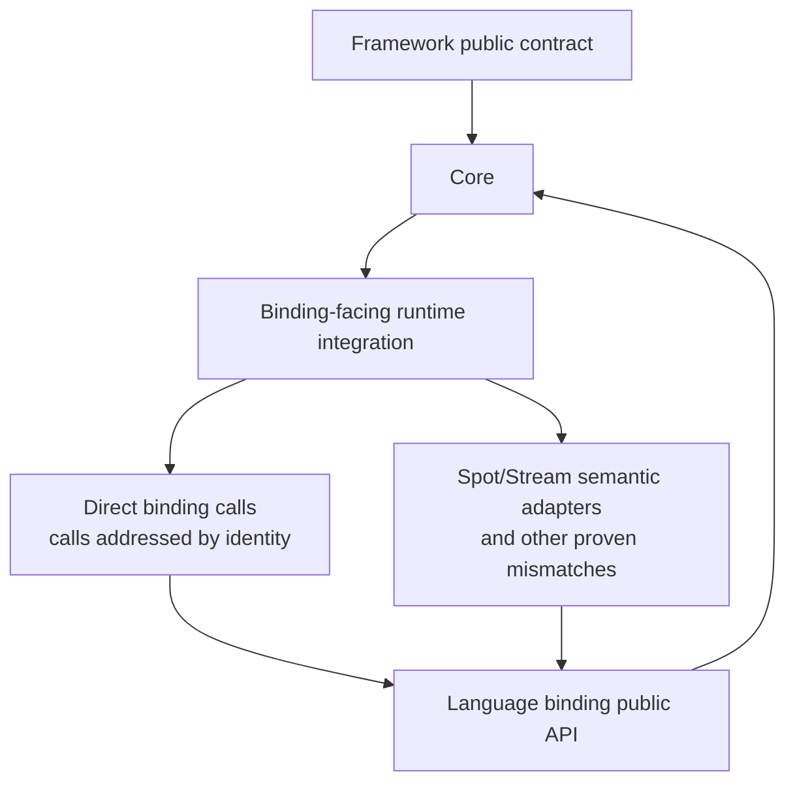
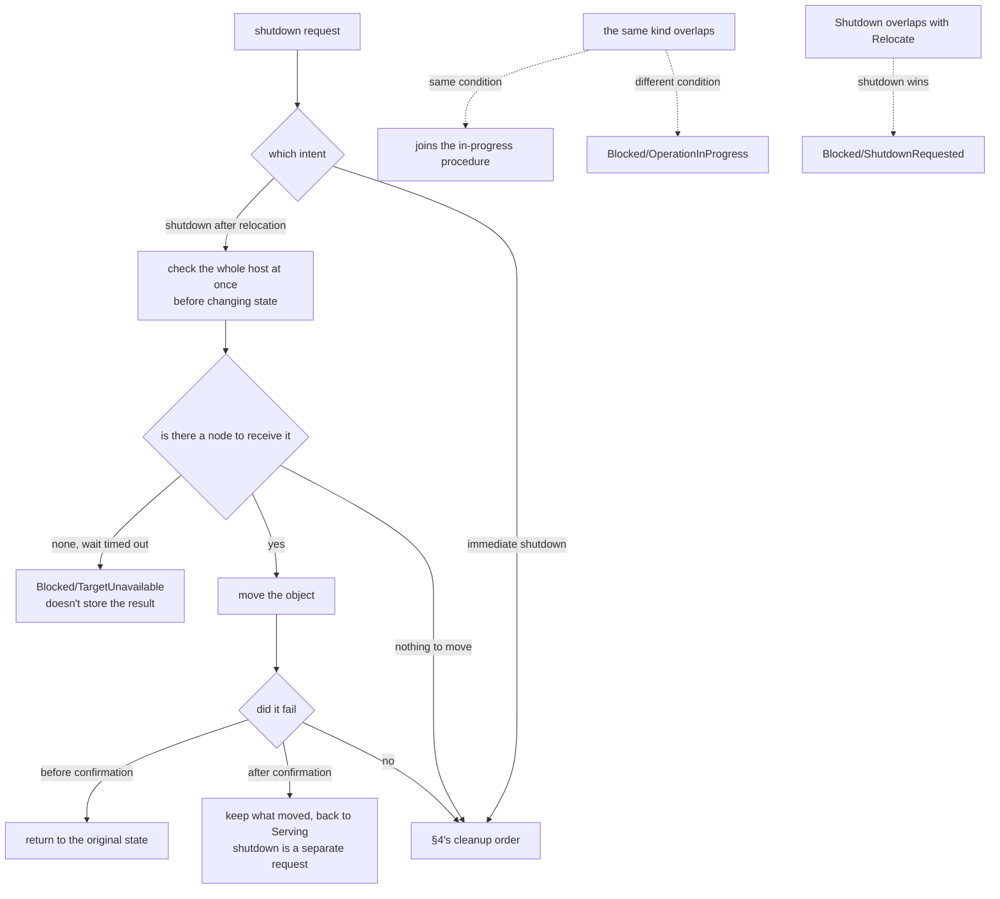
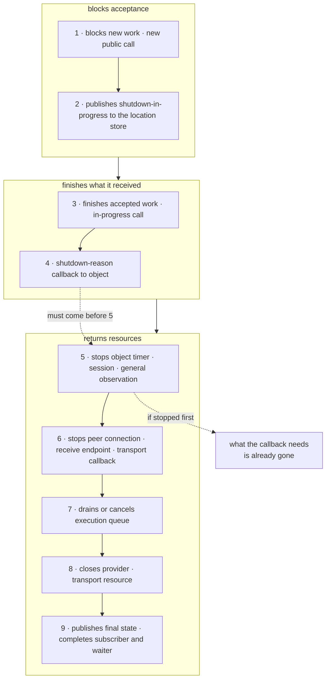
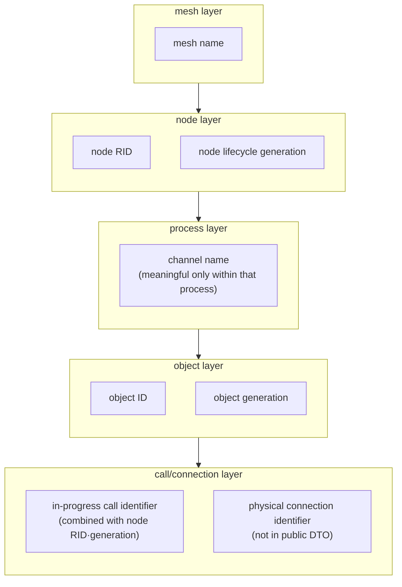

# Layering Boundaries And Identifiers

[Foundation topic index](README.en.md) · [Spec index](../README.en.md) · [Previous: 07. Framework Error Model](07-framework-error-model.en.md)

> This chapter defines the binding boundary every language runtime follows, the shutdown
> procedure and cleanup order, when a registration declaration is validated, and the
> criteria for separating identifiers.

The contract for the shutdown procedure and order is owned by [Complete Host Relocation
Flow](../05-location-relocation/05-host-relocation-flow.en.md), and the identifier's format and lifetime is owned
by the [glossary](02-glossary.en.md). This chapter defines the structure that satisfies
that contract, and a conflict between this chapter and that contract is a defect.

This chapter explains where runtime responsibilities are separated and how identifiers
with different lifetimes remain distinct. These boundaries determine dependency direction
throughout the codebase and are therefore difficult to change later. If identifiers with
different lifetimes are merged, the scope and period in which the value is valid can no
longer be determined.

## 1. Keep The Binding Boundary Semantic

**Every language implementation follows the same responsibility graph.** The graph is
defined by semantic ownership and runtime cost, not by a binding's type names, package
layout, or syntax. A binding changes on a cycle separate from Framework — if the binding
type and its ownership rules are scattered through the public contract, a binding change
becomes an API-wide edit, and if every binding method is hidden behind a one-to-one class,
the code gains more names without hiding any meaning.

The Framework is separated into a public contract, a runtime core that implements
Framework meaning, and an integration area that connects to the binding. Binding types are
not exposed by the public contract or runtime core.

The integration area calls a binding public API directly when the binding operation's
meaning, ownership, lifetime, readiness, and errors already match the Framework contract.
It adds a semantic adapter or port only when the two differ, or when several binding
objects must be combined into one Framework operation.

`SpotNode` and `Stream` are common examples of such composition. They are not a special
exemption: every other adapter must pass the same POSDDD and performance review below.

- **Only the integration area references a binding public type.** Copying the same type
  into a Framework domain contract merely to preserve the shape of an abstraction layer
  makes the two representations start to diverge. An adapter is also part of the runtime
  implementation, so it does not move a decision that belongs to Framework into the
  binding package.

This boundary protects meaning and ownership, rather than a particular class count. Every
language implementation keeps the same responsibility graph: use a binding API directly
when meanings match, and let an adapter handle a verified mismatch in one place. The
operation classification, POSDDD review gate, and performance gate below provide the
criteria for that choice.

### Classify The Operation

Classify the operation, not the language or the binding class.

| Question | Direct binding use | Semantic adapter or port |
|---|---|---|
| Does the binding operation already satisfy the Framework contract? | Use the binding public API directly | Translate the operation and document the mismatch |
| Is ownership and lifetime identical? | Pass the value through without a second owner | Own transfer, reuse, disposal, or retention explicitly |
| Are readiness and error results identical? | Preserve the binding result | Map them once into the Framework result |
| Are concurrency rules identical? | Do not add another gate | Own the required serialization or execution owner |
| Does one binding object provide the whole operation? | Call it directly | Combine several binding objects behind one semantic operation |

This table applies identically to every language. A different binding API is not by itself
a reason for a different Framework structure.

An adapter is justified when it owns a decision such as mapping a binding result to a
Framework result, closing resources in a defined order, preserving caller-provided receive
storage, or combining a MeshNode with a stream session into one operation. It is not
justified merely because a binding type is external.

### The POSDDD Review Gate

Before adding or retaining an adapter, review it from both POSD and DDD perspectives.

| Review question | Required result |
|---|---|
| Deep module | The adapter hides a substantial binding decision behind a smaller Framework operation. Its interface is not a copy of the binding API |
| Information hiding | Ownership, lifecycle, readiness, error mapping, and protocol decisions have one owner and do not leak into callers |
| Complexity downward | Callers do not supply binding options, decode binding errors, manage native storage, or coordinate adapter ordering |
| Error by construction | The adapter makes invalid combinations unrepresentable or classifies the remaining failure in one place |
| Bounded context | The adapter translates between two models without making binding vocabulary part of the Framework domain model |
| Two designs reviewed | Direct public binding use and a semantic adapter/port were compared before choosing one |

If the adapter has no substantial decision to hide, remove it. A test fake, a future
backend possibility, or a different namespace is not enough justification.

### The Performance Gate

The common structure is not considered complete if it adds a known hot-path cost. Check
the following on every message path and readiness path.

- Reuse caller-provided receive storage when the binding supports it.
- Do not copy message parts or convert bytes and message objects twice merely to cross an
  artificial layer.
- Do not create a wrapper, collection, task, or completion object per message when the
  ownership contract does not require it.
- Do not add a second lock around a binding operation. If serialization is required,
  define one owner or one gate and explain the contract.
- Reuse poll event storage. Keep task/future creation on operation and lifecycle paths
  rather than ordinary message paths.
- Measure throughput, p99 latency, allocation/GC, and lock contention for the relevant
  language before judging completion.

An adapter that is required for ownership or protocol correctness may remain even when it
has a cost, but the cost must be isolated and measured, and must not be duplicated by
another language implementation.

### Forbidden Shapes

The following shapes are a design failure in every language.

- A `*Wrapper` class whose methods have the same arguments and result as the binding
  object.
- An `IBackend*` interface that wraps one concrete target only for tests or a hypothetical
  backend.
- A facade that only renames binding methods or exposes a second copy of the binding
  options.
- Reflection, internal-member access, visibility hacks, or raw-frame workarounds that
  bypass the binding public API.
- A language-specific public API added solely because another language has that
  implementation detail.

Internal verification condition — whether binding-facing code uses only the binding public
API, whether there is no contract layer that merely forwards calls to a single concrete
target, and whether the five shapes above are absent from the code, is confirmed by code
review.

### Cross-Language Consistency

- **Language-specific class names and file layout do not need to be identical. Instead,
  the responsibility graph, public behavior, ownership rules, lifecycle order, and
  performance expectations must be the same.** Binding class names and file organization
  must follow each language's idiom so they blend naturally with the rest of that
  language's code.

When a language binding cannot express a required operation, record the semantic gap and
the required binding change. Do not compensate with a private wrapper, a raw-frame path,
or a language-only public contract.

The single criterion for judging whether this rule is followed is the result of applying
the **allowed dependency graph**, the POSDDD review gate, and the performance gate
together. A type-name search is only an auxiliary means to quickly find a spot that
violates them.

### Per-Language Discretion

Each language may choose an interface, abstract class, protocol, function bundle, or a
direct binding call. How many files a semantic adapter is split across is also free.
**Per-language discretion** — as long as the common rules (use only the public binding
API, do not create a pass-through wrapper, make ownership, meaning conversion, and
measured runtime cost explicit) are kept, the observable responsibility graph and
performance characteristics are the same regardless of the language's expression. The
confirmation criteria are the operation classification table, the POSDDD review gate, and
the performance gate above.

## 2. Don't Put Shutdown Per Topology

- **Put one host runtime per process, and put the per-topology runtime — such as
  [RouteMesh](02-glossary.en.md#routemesh)·ClientServer·fanout·STREAM, where multiple
  nodes find each other by name — under it. The shutdown order is owned by the host, and
  the method to close each resource is owned by the topology that built it.** If each
  topology also decides on its own when to close, the order differs every run.
  Conversely, if the host must know how to release a socket, worker, and subscription, the
  topology's internals leak into the host.

- **The host calls the common lifecycle procedure (stop accepting → drain → close) in a
  fixed order, and each topology closes its own resource on that call. Calling it
  repeatedly must give the same result.** If each topology closes on its own, the close
  order differs every run. If the [Spot](02-glossary.en.md#spot) side that the Actor
  belongs to closes first while a STREAM session still holds an Actor reference, the
  situation can't be reproduced and which side is at fault can't be judged.

- **The shutdown path does not branch by checking a concrete type to fix the order.**
  Because the order can no longer be expressed by the abstract type alone, each added
  topology adds another shutdown branch, and the same resource can close in a different
  order depending on the execution path.

Internal verification condition — whether the shutdown path has no code that branches by
checking a concrete type is confirmed by code review.

### Don't Put Shutdown Logic In The Host Integration Layer

- **Shutdown coordination is not put in a host integration layer such as a web framework
  integration package.** Putting shutdown coordination in the integration package prevents
  the runtime from completing its own cleanup by itself. In a spot that does not use that
  integration — a console host, a test, a different framework — shutdown then behaves
  differently, or doesn't happen at all. The integration layer only connects the runtime's
  start and stop to the host lifecycle, and what to clean up in what order is owned by the
  runtime.

### Don't Implement The Same Protocol Twice

- **The client connection library and the framework do not implement the same protocol
  stack separately.** If the same protocol stack is implemented separately by each,
  pending-request management, connection keep-alive, and close handling end up with two
  owners. If a fix applied to one side is not reflected in the other, the two stacks
  handle the same wire input differently. Protocol handling is implemented in one place,
  and both sides use it.

Internal verification condition — whether there is only one set of code handling the same
protocol in the repository is confirmed by code review.

### Observation Standard

Whether a call individually closing a topology resource skips the host shutdown procedure
is confirmed in [§7 Verification Requirement](#7-verification-requirement).

## 3. Shutdown Carries Two Intents

A shutdown request carries an intent of a different nature. Merging it into one makes even
an urgent shutdown wait for a relocation to finish.

| Intent | What It Does | When |
|---|---|---|
| Shutdown after relocation | Moves this node's objects to a different node, then goes down | A planned shutdown, like deployment/scale-down |
| Immediate shutdown | Cleans up only what's in progress with no move, then goes down | An urgent shutdown |

- **If requests of the same kind overlap, the side whose conditions match joins the
  procedure already in progress; if the conditions differ, it is rejected.** If the mode
  or target version matches, it joins the in-progress procedure; if they differ, it
  doesn't wait and ends with `Blocked/OperationInProgress`
  ([Complete Host Relocation Flow 「6. Concurrent Calls And
  Cancellation」](../05-location-relocation/05-host-relocation-flow.en.md#6-concurrent-calls-and-cancellation)).
  If two procedures of the same kind run overlapped with different conditions, which
  result is final cannot be decided.

- **If Relocate and Shutdown overlap, shutdown wins, and the side waiting for relocation
  ends with `Blocked/ShutdownRequested`.** Since shutdown cleans up everything belonging
  to this host anyway, there is no reason to finish the relocation
  ([Complete Host Relocation Flow 「11. The Race Between Shutdown And
  Relocate」](../05-location-relocation/05-host-relocation-flow.en.md#14-the-race-between-shutdown-and-relocate)).

- **A shutdown-after-relocation checks the whole host at once before changing state**
  ([Complete Host Relocation Flow 「4. Conditions Checked Before Selecting A
  Target」](../05-location-relocation/05-host-relocation-flow.en.md#4-conditions-checked-before-selecting-a-target)).
  If new work is blocked before this check, once it learns it can't move, that node turns
  out to have been stopped for no reason
  ([44. Message Continuity During A Move 「1. The Four
  Boundaries」](../05-location-relocation/04-relocation-flow.en.md#1-four-boundaries)).

It doesn't immediately reject just because there's no node to receive it right now. After
waiting for target information to spread up to a set time, it ends with
`Blocked/TargetUnavailable`
([Complete Host Relocation Flow 「5.1 When There's No Target
Yet」](../05-location-relocation/05-host-relocation-flow.en.md#51-when-theres-no-target-yet)).
Since the rejected result isn't stored, requesting again checks from the start
([Complete Host Relocation Flow 「6. Concurrent Calls And
Cancellation」](../05-location-relocation/05-host-relocation-flow.en.md#6-concurrent-calls-and-cancellation)).

If there is not a single target to move, it succeeds even with no node to receive it. Here
too, the host state transition and new-work blocking are the same as any other relocation
([Complete Host Relocation Flow 「5.1 When There's No Target
Yet」](../05-location-relocation/05-host-relocation-flow.en.md#51-when-theres-no-target-yet)).

- **Failure handling differs before and after confirmation, but neither ends the host.**
  - A failure before the first relocation is confirmed returns to the original state.
  - A failure after confirmation leaves what has already moved on the receiving node,
    reprocesses only the work not yet moved, and returns to `Serving`
    ([Complete Host Relocation Flow 「10. Relocate Completion And
    Failure」](../05-location-relocation/05-host-relocation-flow.en.md#13-relocate-completion-and-failure)).
  - Shutdown only happens if the caller separately requests it.

- **An observation subscriber cannot hold up the progress of the shutdown procedure.**
  Shutdown proceeds even if the subscriber doesn't respond.

Neither failure branch ends the host. Shutdown only happens if the caller separately
requests it. §4 below starts from this diagram's `CLEAN`.

## 4. Fix The Cleanup Order

- **The side that built a resource closes it.** While a child uses its parent's resource,
  it keeps a reference guaranteeing that the parent isn't closed yet. An outgoing
  reference must be checkable for whether it's already closed and whether the generation
  matches.

- **Cleanup happens in the following order.** Without a fixed order, a shutdown bug that
  isn't reproducible arises, differing every run.

1. Block new application work and new public calls.
2. Publish shutdown-in-progress to the location store so other nodes exclude this node
   from candidates.
3. Finish an already-accepted work item and in-progress call up to a set time.
4. Run the callback notifying the object of the shutdown reason.
5. Stop the object timer and session connection, and general observation emission. Keep a
   spot for the final notification.
6. Stop the peer connection and receive endpoint, and the transport layer callback.
7. Drain the execution queue or cancel it within a set time.
8. Close the provider and transport layer resource.
9. Publish the final state and shutdown notification, and complete the observation
   subscriber and waiter.

**Step 4 coming before step 5 is the key.** The callback receiving the shutdown reason
must run while that object's membership and local instance are still valid
([Complete Host Relocation Flow 「11. The Race Between Shutdown And
Relocate」](../05-location-relocation/05-host-relocation-flow.en.md#14-the-race-between-shutdown-and-relocate)).
If the timer and session are stopped first, what the callback needs is already gone.

- **After the final result is published, a new callback, timer, completion, or event is
  not started.** Because the publish is the last signal that this node has ended, anything
  newly started after it conflicts with a state already announced as finished.

## 5. Registration Declarations Are Validated Only Once, At Startup

- **A registration declaration is validated at startup, and does not change after passing
  validation.** If it could change while running, every lookup point would have to ask
  back whether the current value is valid. That cost is incurred per message, and it
  becomes impossible to know which point-in-time's configuration processed which message.

What validation must catch is a contradiction knowable before start — registering the same
name twice, a channel with no handler, a mutually exclusive option combination.
Discovering this after start means some messages have already been processed.

- **If validation fails, it does not start.** Starting with only part registered makes it
  impossible to predict what messages the part that failed to register might receive.

## 6. Identifiers Are Not Merged

- **A value with a different lifetime and scope is kept as a different identifier.**
  Merging them makes it impossible to judge in what scope and period the value is valid.

| Identifier | Valid Until |
|---|---|
| Mesh name | Fixed exactly as written in configuration |
| Node RID | That node's lifecycle |
| Node lifecycle generation | Increases per restart |
| Channel name | Only meaningful within that process |
| Object ID | The object's lifetime |
| Object generation | Increases every time the same ID is built again |
| In-progress call identifier | Until that call ends |
| Physical connection identifier | Until the connection drops |

Which layer can know each identifier follows its valid scope. The mesh layer needs to know
only the mesh name; the node layer knows that plus its own RID and lifecycle generation.
Below that, the channel name has meaning only within that process; the object layer knows
the object ID and generation; and only the innermost individual call/connection layer
knows the in-progress call identifier and the physical connection identifier. An inner
layer carries over and uses the outer layer's identifier as-is, and an outer layer does
not know an inner layer's identifier.

### Why Not Make Uniqueness A Single Value

If the in-progress call identifier is kept as a number that only increases within a
process, after a node restarts, the same number comes up again. A late reply to a call
sent before restart can match a different call after restart.

- **There is also a way to solve this by making the value itself large, but uniqueness is
  secured with a combination instead** — the `(sending node's RID, that node's lifecycle
  generation, call identifier)` combination. The value's length and internal format are
  not a public contract, so they can differ per language.

- **Keep only one in-progress call identifier format inside the runtime.** Having multiple
  formats creates code that converts between them, and knowing which path uses which
  format requires tracing the call graph.

### Typing Only Part Leaves The Rest As A String

Making only node RID a dedicated type, or keeping every identifier as a plain string,
creates the following problems.

First, **swapping different identifiers still compiles.** The type doesn't catch the
mistake of passing a channel name where an object ID belongs.

Second, **multiple representations of the same value arise.** If comparing a routing id
requires building several candidates with different case and hexadecimal notation and
checking them one at a time, that means the representation changed when crossing a
boundary. It also adds the cost of building candidates for every value.

- **Keep each identifier as its own dedicated type, and fix one representation.** If a
  spot must handle it as a string, convert only once at that boundary.

### Watch Out For Name Collision

`OperationId` is already a public term referring to **the value that handles Actor Join
completion without duplication**
([glossary](02-glossary.en.md#actor-join-operationid)). Using the same name for the
in-progress call identifier mixes the two concepts in the document and the code. The
implementation code uses a different name.

### A Value Not Exported

- **The physical connection identifier, store record version, and the execution queue's
  internal sequence number are not put in a public DTO.** These values are only used by
  the runtime to re-confirm the same target, and the moment they go outside, the
  application starts depending on that value's stability.

Internal verification condition — whether each identifier has a dedicated type and there
is no code comparing multiple representations for a value comparison, and whether the
in-progress call identifier format is one within the runtime, is confirmed by code review.

## 7. Verification Requirement

The following is confirmed through interface observation of the public surface (the
binding public API·public contract signature, the shutdown·relocation·startup public
operation and its result, the registration declaration API, and the throughput·latency·
allocation·lock contention observed by each language's benchmark) and through static
checks of that public surface's signature·DTO composition. Each item maps to one test or
one static check.

**Binding Boundary (Static Check)**

- Binding types do not appear in the signature of the Framework public contract and
  domain contract.

**Binding Boundary (Interface Observation)**

- A public call individually closing a topology resource does not skip the host shutdown
  procedure.
- The throughput, p99 latency, allocation/GC, and lock contention measured in the relevant
  language show no unexplained regression compared to the baseline.

**Shutdown (Interface Observation)**

- If shutdown-after-relocation and immediate shutdown are requested at the same time, only
  one procedure proceeds, and the other ends with `Blocked/OperationInProgress` or
  `Blocked/ShutdownRequested`.
- If judged unable to move, it rejects with `Blocked/TargetUnavailable` without changing
  host state.
- At the moment the shutdown-reason callback is invoked, that object's membership and
  local instance are still valid.
- After the final result is published, no new callback, timer, or event starts.
- The runtime finishes the shutdown procedure by itself, with no host integration package.

**Registration Validation (Interface Observation)**

- A registration declaration is validated at startup, and the validation result does not
  change after starting.
- If validation fails, it does not start with only part registered.

**Identifiers (Interface Observation And Static Check)**

- A call the same node sends after restarting does not match a pre-restart call by the
  same identifier (interface observation).
- The physical connection identifier, store record version, and execution queue internal
  sequence number do not appear in a public DTO (static check).

Conditions that can only be confirmed through internal structure — whether binding-facing
code uses only the binding public API, whether the code has no pass-through wrapper,
concrete-type branching, or duplicate protocol implementation, whether each identifier has
a dedicated type with one representation, and whether the call identifier format is one
within the runtime — are owned by §1, §2, and §6 as an "internal verification condition"
in each rule paragraph, and are not repeated here.

---

[Foundation topic index](README.en.md) · [Spec index](../README.en.md) · [Previous: 07. Framework Error Model](07-framework-error-model.en.md)
