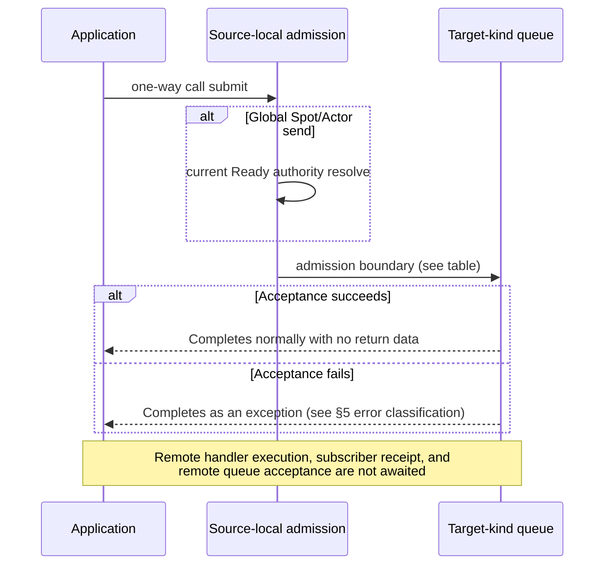
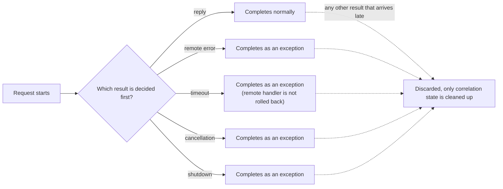
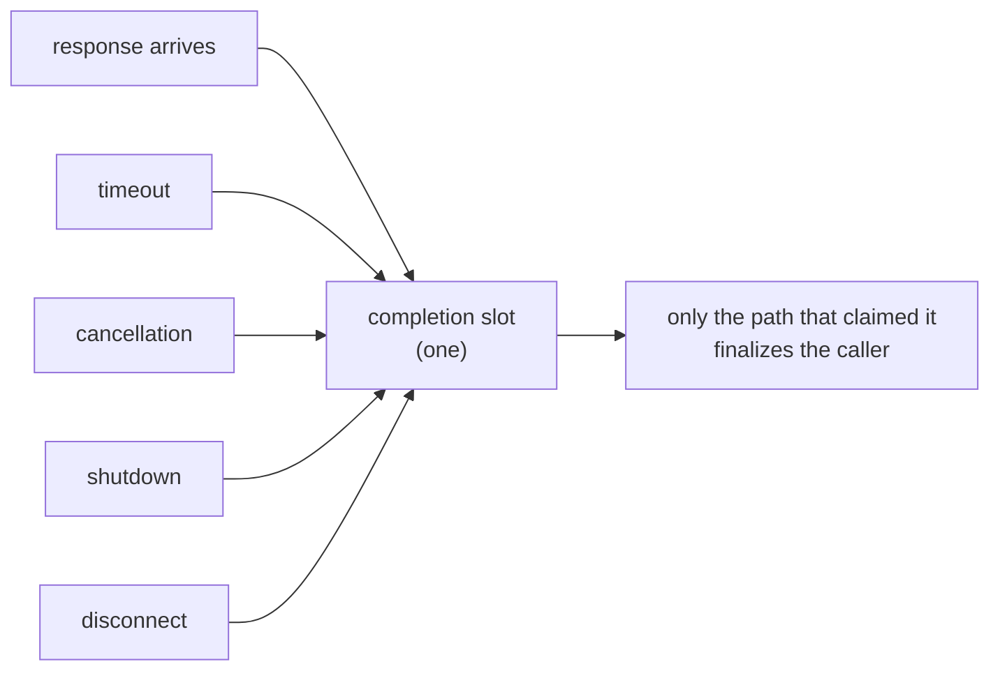
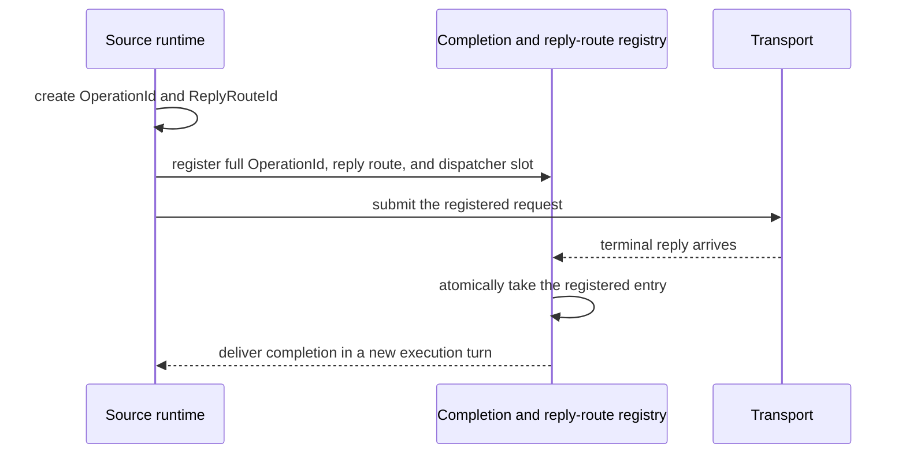

# Submit And Completion

[Execution topic table of contents](README.en.md) · [Spec table of contents](../README.en.md) · [Next: 02. Handler Turn And Execution Gate](02-handler-turn-and-execution-gate.en.md)

> This document defines when a ZLink Framework Messaging/Worker call completes, when a
> one-way submit is accepted, what confirms completion for a request, and the structure the
> runtime uses to confirm that completion exactly once. The order in which handlers run, and
> the scope a `Yield` releases, belongs to
> [Handler Turn And Execution Gate](02-handler-turn-and-execution-gate.en.md); what
> cancellation and shutdown do to work already accepted belongs to
> [Cancellation And Shutdown](03-cancellation-and-shutdown.en.md). Spot timer completion
> belongs to [Spot Timer](../03-spot-actor/10-spot-timer.en.md), and the relationship between the Core byte
> HWM and the Application Job Queue belongs to
> [Application Job Queue And Backpressure](04-application-job-queue-and-backpressure.en.md).

## 1. Messaging/Worker Call Overview And Scope

When an application calls a Messaging call builder or a Worker call builder, that call
completes with exactly one terminator this document defines. This document defines what
each terminator treats as completion, how far a one-way submit waits for admission, whether
a request completes with a reply, an error, a timeout, a cancellation, or a shutdown, and
the internal structure that confirms that completion.

This section's naming rules apply to Messaging call builders and to Worker call builders
returned by `RunCpuWorker`/`RunIoWorker`. Messaging calls include Framework Send/Request/
Publish/Reply, [Spot](../00-foundation/02-glossary.en.md#spot)/Actor Send/Request,
[Stream Connector](../00-foundation/02-glossary.en.md#stream-connector) Send/Request/Wait, and
HTTP request. Here a Spot is a logical instance with an address and state, reachable at the
same ID even when the executing node changes, and a Stream Connector is a client library that
connects to the server Framework's STREAM model to exchange packets. They do not apply to
network topology/endpoint/node connection, Host/runtime/
client configuration, handler/Channel membership/codec/security/retry registration, or
object lifecycle builders. Direct methods that don't return a builder, such as
`RelayAsync(...)`, are also out of scope.

## 2. Completion Meaning Per Terminator And Per-Language Names

A call object offers only the terminator that fits its operation kind. Each operation's
per-language interface defines single-use rules, what happens when the same option repeats, and
the error for re-invoking a terminal.

| terminator | completion meaning after acceptance | owner turn |
|---|---|---|
| one-way async terminal | Completes with no return data if source-local admission succeeds, or with an exception on failure | Does not make the current turn wait unless awaited |
| general async terminal | Waits until the request, worker, or create's application result reaches a terminal state | Holds the current [owner](../00-foundation/02-glossary.en.md#owner) turn until the completion continuation finishes |
| `Yield` | Submits the operation, then releases the shared [Spot turn](../00-foundation/02-glossary.en.md#spot-turn) — the unit in which a callback occupies the execution gate from an application queue to run — while waiting for the application result | The completion continuation re-acquires the same Spot gate and resumes in a new turn |

The general async terminal name per language is .NET `Async`, Java/Node.js/C++ `submit`,
and the dedicated Kotlin wrapper's `await`. An immediate submit that returns no async
completion uses `Submit`/`submit`. Only the terminal that actually releases the shared Spot
gate uses the name `Yield`/`yield`.

`Yield` is available only for Channel/Spot/Actor requests, CPU/I/O workers, and Actor/Spot
create/get-or-create calls running on a `SpotWide` User Spot or an Instance Spot. `Yield` on
create/get-or-create is not a rule that widens the naming scope — it's a separate
object-execution special case. Outside Entry Spot, `PerActor`, Entry Actor, Node/Channel
handlers, and the owner turn, a call ends with `InvalidOperation` before operation
submission or any queue change. It is not available for Actor join, send, publish, timer
registration, close, or destroy.

| Call kind | `SpotWide` User Spot / Instance Spot | Entry Spot / `PerActor` / Entry Actor / Node / Channel handler |
|---|---|---|
| Channel/Spot/Actor request | General async terminal or `Yield` | General async terminal only (no `Yield`) |
| CPU/I/O worker | General async terminal or `Yield` | General async terminal only |
| Actor/Spot create/get-or-create | General async terminal or `Yield` (special case) | General async terminal only |
| Actor join, send, publish, timer registration, close, destroy | `Yield` not available | `Yield` not available |
| Outside the owner turn | Not applicable | `InvalidOperation` before submission/queue change |

What claim a `Yield` keeps and what gate alone it releases is defined by
[Handler Turn And Execution Gate 「3. Gate And Claim On `Yield`」](02-handler-turn-and-execution-gate.en.md#3-gate-and-claim-on-yield).
Actor Join is not a terminator this section covers — the completion boundary for `Defer()`
is defined by
[Handler Turn And Execution Gate 「5. Actor Join And The `Defer()` Completion Boundary」](02-handler-turn-and-execution-gate.en.md#5-actor-join-and-the-defer-completion-boundary).

## 3. Worker Offload

- CPU work and async I/O work are submitted to a bounded worker scheduler owned by the
  Framework.
- A CPU execution slot is occupied only while an application CPU callback is actually
  running. Async I/O does not occupy a CPU execution slot while waiting for an
  operating-system, transport, or Store completion.
- I/O admission and completion bookkeeping also use bounded resources, but a full CPU worker
  queue does not turn an already-submitted I/O completion into `CapacityExceeded`.
- More I/O operations than the configured CPU-worker thread count may wait for completion.
  Their count is bounded by separate internal I/O admission, not by CPU execution slots or
  CPU queue length.
- This isolation contract does not require a separate public I/O thread-count or queue
  setting. A language runtime may implement it with native async I/O, an event loop, or a
  completion executor.
- A worker call keeps the type of the application result it computes, and in the permitted
  `SpotWide`/Instance contexts, that same result can be awaited with `Yield`.
- Completion is `CapacityExceeded` if the queue is full,
  [`DeadlineExceeded`](../00-foundation/02-glossary.en.md#deadlineexceeded) — the Framework
  exception raised when an operation's completion condition isn't met by its allowed
  [deadline](../00-foundation/02-glossary.en.md#deadline) — if the deadline is exceeded, and
  `InternalFailure` if the work itself fails.
- Work that finishes late, after a timeout or cancellation, does not produce a second
  terminal result.

## 4. One-Way Submit — The Admission Boundary

Send, publish, bound session send, session Actor relay, and explicit STREAM send/reply
provide exactly one async submit terminator, with no synchronous `TrySubmit` family. There
is no normal-completion value; completion only means the source-local admission boundary
defined by the operation family accepted the message. Remote handler execution, subscriber
receipt, remote Spot queue acceptance, or application callback completion are not awaited.

| Target kind | admission boundary |
|---|---|
| Remote target | Local transport queue |
| Local target | The matching mailbox or relay queue |
| [Classic fanout](../00-foundation/02-glossary.en.md#classic-fanout) — a separate PUB/SUB path that sends events only to targets that finished connecting and subscribing — /STREAM | The matching socket queue |

Global Spot/Actor send waits from the current [Ready](../00-foundation/02-glossary.en.md#ready) authority
resolve through this source-local admission.



## 5. Backpressure And Error Classification

When local Framework capacity is unavailable, the Framework waits up to that family's send
timeout. When a binding operation waits on Core HWM, Core owns the retry and completes the
per-operation completion awaitable. The Framework does not create a separate readiness
callback, retry waiter, or separate binding adapter, and follows these rules.

- [`Backpressured`](../00-foundation/02-glossary.en.md#backpressured) — an internal state in
  which a send path or queue's capacity is temporarily unavailable — is not a public terminal
  result.
- If capacity becomes available first, the message is submitted exactly once and completes
  normally.
- If a timeout, cancellation, or runtime shutdown is decided first, the call completes
  exactly once, as an exception, with no late admission.
- If the internal bounded waiter capacity is fully used, a new payload is not held — the
  call completes immediately with `DeadlineExceeded`.
- Even at this hard overload boundary, the `Backpressured` status is not exposed, nor is the
  message submitted later.

| Failure | Error classification |
|---|---|
| No Actor authority | `NotFound` |
| No Spot authority | `NotFound` |
| No Mesh or eligible Server | `NotFound` |
| No route available | `Unavailable` |
| Admission deadline expired | `DeadlineExceeded` |
| Runtime not accepting new admission | `ShuttingDown` |
| Same call's terminal invoked twice | `InvalidOperation` |

Pending admission keeps the caller-specified Node RID, global Spot/Actor ID, and session
binding token. A [RouteMesh](../00-foundation/02-glossary.en.md#routemesh) — the scope in which
multiple MeshNodes participate to exchange node and Channel messages —
/ClientServer select-one Channel picks one current eligible member
of the same [ChannelName](../00-foundation/02-glossary.en.md#channelname) immediately before starting the
first binding operation. It may choose another eligible member only while checking route
eligibility or source-local admission before any binding operation has started.

Starting the binding operation fixes the selected target. Core owns HWM retry and
completion; the Framework does not reselect for capacity or resubmit the binding operation.
There is no automatic resubmission after completion.

## 6. Logical Multicast And Classic Fanout

[Logical Multicast](../00-foundation/02-glossary.en.md#logical-multicast) follows these rules.

- It fixes a target snapshot when the operation starts and attempts each target exactly
  once.
- If the operation itself cannot be submitted to the local executor, it waits up to the send
  timeout.
- Once the bounded worker and source-local capacity secure the transaction start, the public
  terminal completes normally with no return data, and per-target submission continues
  internally.
- Once started, an individual target's failure does not roll back the whole publish or turn
  it into an exceptional completion.
- Per-target acceptance/failure results are not surfaced as a public return value or as
  publish-only monitoring values.
- It completes normally even with zero targets.

[Classic fanout](../00-foundation/02-glossary.en.md#classic-fanout) completes normally once the publisher
socket queue accepts the message, even with no subscribers. Subscriber count and receipt are
not exposed as a public result.

## 7. Admission Deadline — Owner And Value Rules

The one-way admission deadline is owned by the outbound socket or a
[MeshNode](../00-foundation/02-glossary.en.md#meshnode) — a runtime node that participates in a
RouteMesh to send or receive messages — that the operation actually uses.

| Operation family | deadline owner | Default rule |
|---|---|---|
| [RouteMesh](../00-foundation/02-glossary.en.md#routemesh) node/channel, Spot, Actor | The selected MeshNode's ROUTER send timeout | Includes global object route resolve time; 1 second if unset |
| ClientServer | The client's DEALER send timeout | 1 second if unset |
| Logical Multicast | The selected MeshNode ROUTER's per-target send timeout | Applies to each remote target of a committed publish transaction |
| classic fanout | The publisher socket's send timeout | 1 second if unset |
| bound session/session Actor relay | The Framework socket's send timeout | Same deadline even if the local/remote Actor route changes |
| STREAM send/reply | The matching STREAM socket's send timeout | The reply does not use the caller's request timeout |

The Framework's public send timeout follows these value rules.

- It must be a finite duration whose value, rounded up to milliseconds, falls in
  `1..INT_MAX`.
- A positive sub-millisecond value rounds up to 1ms.
- `0`, negative values, infinity, and values above the upper bound are rejected no later than
  host startup, and are never silently substituted with a valid default.
- If no value is specified, that family's 1-second default is chosen.
- An existing public root fallback, if present, applies with the same meaning, but that does
  not mean every language must add the same root option.
- If a runtime setter exists, an invalid value is rejected immediately at the setter call.

A STREAM one-way send call provides an optional per-call admission-timeout modifier. This
value is not reply wait time; it is the maximum time that send can wait for acceptance by
the STREAM transport queue.

- If omitted, the matching STREAM socket's send timeout is used.
- If specified, the earlier of the socket timeout and the per-call timeout is used. A
  per-call value never extends the socket timeout.
- Validation and millisecond rounding use the same `1..INT_MAX` rules above.
- If the deadline wins, the call completes once with `DeadlineExceeded`; later capacity does
  not admit or replay that send.
- This modifier does not apply to a STREAM reply call. A reply uses the socket send timeout
  and the one-shot token contract.
- Where a language separately provides cancellation, timeout and cancellation race to one
  terminal result.

## 8. STREAM Reply Token

Bound session and session Actor relay do not roll back a remote failure that occurs after
the local relay has accepted the message, and do not auto-replay it as the same submit's
failure.

The one-shot [reply token](../00-foundation/02-glossary.en.md#reply-token) rules for STREAM reply are:

- The request sequence and the token are preserved when the call is created.
- The first valid terminator invocation atomically claims and consumes the token before the
  transport admission attempt.
- Even if that terminator completes with a `DeadlineExceeded`, cancellation, or runtime
  shutdown exception, the token cannot be reused.
- If two calls made from the same token race, only the one that wins the claim starts
  transport admission; the other ends as an exceptional completion with no transport
  attempt.
- The caller's request timeout is not carried on the reply wire, so it is not used as the
  STREAM reply's admission deadline.
- Even if a late-accepted reply doesn't match on the client's correlation, the transport
  admission result does not become the request's result.

## 9. Request Completion — The Completion Race And Timeout Budget

A request completes exactly once, with whichever of reply, remote error, timeout,
cancellation, or shutdown is decided first. Timeout and cancellation end the caller's wait,
but do not roll back work the remote handler already started. A late-arriving reply is not
redelivered to the application handler — only the correlation state is cleaned up.



The global object request timeout covers the current Ready authority resolve, outbound
admission, handler, and reply as a whole. A source only passes the remaining time, after
subtracting what earlier stages used, to the next stage. Since there is no receipt proving a
remote target did not accept the request, it is not automatically resubmitted to a different
owner after a timeout or connection failure.

How a request sent within the same handler turn releases and reacquires the gate while
waiting is defined by
[Handler Turn And Execution Gate 「4. Waiting And Returning Within The Same Turn」](02-handler-turn-and-execution-gate.en.md#4-waiting-and-returning-within-the-same-turn).

When reply, timeout, cancellation, and Spot shutdown race, only the terminal result decided
first is used. If the Spot has already terminated, or a new generation was created under the
same Spot ID, a late reply from the previous activation is not delivered to the new Spot.
There is no automatic resend to a different RouteMesh member, ClientServer server, or send
path after a target connection closes or times out.

## 10. Operation Identity And Where Completion Happens (Implementation)

Each call has one completion slot, and several paths compete for it. Only the path that
claims it releases the caller's wait. The losing paths do nothing.



**Atomically taking an entry from the in-progress call table is the completion contention
point.** The response, timeout, cancellation, and shutdown paths all try to take the same
entry. Only the successful path gains completion authority; the others observe that the call
is already complete and stop. This operation confirms completion authority and removes the
in-progress call together. It therefore needs neither a separate completion marker nor a
second slot reservation. Every completion path uses the same approach so that adding a path
cannot introduce a different contention rule.

A service-wire request preserves two different values. Both are Framework-internal values
and are not exposed to the application.

| Value | Form | Responsibility |
|---|---|---|
| `OperationId` | `{ high: u64, low: u64 }` | Terminal-deduplication identity for one operation. It stays unchanged through relocation and reply relay |
| `ReplyRouteId` | non-zero `u64` | Connects a terminal reply to a pending entry within the source lifecycle. It does not replace operation identity |

An operation that expects a terminal result cannot have an `OperationId` with both words
zero.

Registries and durable completion records preserve both words. Using only the `low`
word as a key can make two different operations appear to be the same entry.

A
`ReplyRouteId` is also unique among requests pending in one source-owner lifecycle, but it
does not by itself decide terminal deduplication after relocation.

**The sending runtime first creates `OperationId`/`ReplyRouteId` and only submits to
transport after registering the pending completion entry, dispatcher slot, and reply route.**
This is so that even an immediate in-process response cannot be processed before
registration, avoiding the need for a separate early-response map and the race-handling that
would cross-check that map with the pending table. The wire request preserves the two values
in separate fields; neither value is used as an alias for the other.



## 11. The Execution Turn Of The Completion Callback (Implementation)

**An application callback does not run inside the lock held while confirming completion.**
If the callback calls back into the runtime, it would require the same lock, causing a
deadlock. Timer cancellation and payload cleanup are also done outside it.

Releasing the lock and immediately invoking the callback on the same call stack is still
insufficient. It lets application code re-enter the runtime before the current transport
response or timeout handling has returned. The completion callback is placed on a
process-shared completion dispatcher and runs on a new execution turn after the current
handling returns.

The order is as follows.

1. Confirm completion authority.
2. Release the lock.
3. Enqueue the callback on the dispatcher.
4. Run the callback on a new execution turn.

If the terminal winner takes the in-progress call table entry and dispatcher admission then
fails, the application completion is lost. The runtime therefore reserves a completion
dispatcher slot when it accepts the operation. That reservation remains until the callback
returns. The combined number of in-progress operations and callbacks waiting or running on
the dispatcher cannot exceed 4,096, so the callback queue cannot grow without a bound.

If no slot can be reserved, the operation is rejected with `CapacityExceeded` before the
request is sent. Once an operation is accepted, completion enqueue has no reject or drop
path.

The dispatcher uses a process-shared lane instead of creating a thread per callback,
and shutdown drains every accepted callback.

An exception from one callback does not stop
later callbacks from running.

## 12. Once Accepted, It Is Never Resent

Once transport has accepted a message, whether the target has executed it is unknowable.
Resending to a different target in this state can cause double execution.

**The runtime never automatically resends after acceptance.** This holds even if the
connection drops
([Transport Liveness 「5. Ready And Failure Determination」](../02-channel-transport/05-transport-liveness.en.md)).
The application can start a new call, and at that point the risk of duplicate execution is
judged by the application.

This rule requires distinguishing "failure after sending" from "failure before sending."

| Failure timing | May it be resent |
|---|---|
| Before transport accepts | Yes. It's certain the target never received it |
| After transport accepts | No. Whether it executed is unknowable |

## 13. The Completion Point Of A Call That Does Not Wait For A Reply

A call that does not wait for a reply completes normally at the moment this process's send
path accepts the message. Whether the remote queue received it or the handler executed it
can't be known from this result
([Framework API 「12. Spot, Actor, And STREAM Owner」](../00-foundation/06-framework-api.en.md#21-dispatch-failure-action-owner)).

"Local acceptance" and "transport acceptance" are not separate events. In this product the
send path is the socket's send queue, so both terms refer to the same completion boundary.
Documentation and code comments use the single term send acceptance.

## 14. Failures Are Not Classified By String (Implementation)

The completion path must distinguish cancellation, timeout, and shutdown. This distinction
decides the result the caller receives.

Judging cancellation by running a regex against the error message string makes
classification change silently when the message wording changes. Conversely, a business
error whose message contains "cancel" is misclassified as cancellation and swallowed.

**Failure is classified by type or a dedicated value.** The message string is for humans to
read, not a branch condition. The error kind value itself is owned by the
[Framework Error Model](../00-foundation/07-framework-error-model.en.md); this document only
defines which completion path picks that value.

## 15. Consuming Binding Send Terminals (Implementation)

When the framework runtime consumes a binding's HWM-managed send family
(PAIR send, routed send, `Received.send()`), it uses only the **async
terminal** (C++ `async()`, .NET `Async()`, `submit()` elsewhere). The
binding's sync(+flags) terminal is the binding's public surface, not a
framework-internal path. Core send-completion notification drives the
completion, so the framework doesn't wrap it in a separate executor or
offload. The binding terminal names, return types, and flags contract
themselves are owned by
[the binding routed-transfer contract and asynchronous completion surface policy](../../../../../../bindings/doc/spec/async-coroutine-policy.en.md)
— this section owns only the framework's consumption rule.

The following two cases legitimately use the sync terminal.

- **Immediate backpressure observation** — a path that must receive the
  admission result without waiting, via the `DONTWAIT` flag. The sync
  terminal is the only surface of that contract.
- **Implementing a public synchronous contract** — the internal
  implementation of a public synchronous surface whose preservation
  [State Ownership And Lanes §5](06-state-ownership-and-lanes.en.md#completion-guarantees-before-return)
  requires. Waiting at HWM saturation is then an observable property of
  that public contract, not a violation.

Publish and raw reply are HWM-free, so the synchronous terminal is
canonical for them (owned by the binding spec).

### Framework Typed Session Reply

The framework's typed Session reply is not a surface that turns the raw
binding reply into an async terminator. The framework runtime owns typed
serialization and the per-request one-shot reply token; the terminator
atomically claims the token and then waits for source-local admission. A
second reply on the same token ends as an exceptional completion without
attempting transport. Token claim rules are owned by
[§8](#8-stream-reply-token).

| Framework language | Typed Session reply terminal | Completion expression |
|---|---|---|
| C++ | `.reply_packet(...).submit()` | `co_await`-able framework task |
| .NET | `.Reply(...).Async(ct)` | `ValueTask` |
| Java | `.reply(...).submit()` | `CompletionStage<Void>` |
| Kotlin | `.reply(...).await()` | suspending `Unit` |
| Node | `.reply(...).submit(signal?)` | `Promise<void>` |

Even in languages that use the same `submit` name, the return type and
owning layer distinguish it from the raw binding reply (a synchronous
one-shot).

## 16. Per-Language Representation

The common contract does not mandate a specific async type name. This document owns
completion ordering, cancellation, and error semantics; each language's per-language interface owns
the specific return type and error representation.

| Language | General async completion | Returning the Spot turn | per-language interface owner |
|---|---|---|---|
| .NET | `Async(...)` returns `ValueTask` or `ValueTask<T>` | `Yield(...)` | [per-language interface index](../languages/dotnet/interfaces/README.en.md) |
| Java | `submit(...)` returns `CompletionStage<T>` | `yield(...)` | [Channel messaging](../languages/java/interfaces/channel-messaging.en.md) |
| Kotlin | Uses the dedicated call wrapper's suspending `await()` | The dedicated wrapper's `yield()` | [Channel messaging](../languages/kotlin/interfaces/channel-messaging.en.md) |
| Node.js | `submit(...)` returns `Promise<T>` | `yield(...)` | [interface index](../languages/node/interfaces/README.en.md) |
| C++ | `submit(...)` returns `task_t<T>` | `yield(...)` | [framework interfaces](../languages/cpp/interfaces/README.en.md) |

Each per-language interface fixes the return type, cancellation argument, and callback or coroutine
representation per terminator. Even when the language's standard idiom differs, the same
operation's completion timing, ordering, and error classification do not change.

Because C++'s `task_t` starts the operation when it's called, `submit()` can be used in the
following two ways depending on whether the result is consumed. The two lines below show two
distinct single-use calls.

```cpp
sendCall.submit();                      // Starts the operation only, with no result.
auto reply = co_await requestCall.submit(); // Awaits the async application reply.
```

No overload differing only by return type is created. The C++ Messaging call wrapper does
not offer a blocking `submit()` alongside a coroutine terminal for the same arguments — it
offers a single `task_t<T> submit()`. A callback overload can be provided as
`submit(callback)` since its parameter list differs.

## 17. Verification Requirements

The public surface (each language's terminator return type, returned error kind, one-way
submit's normal/exceptional completion, a request's reply/error/timeout/cancellation/
shutdown completion, STREAM reply token claim results) alone confirms the following. Each
item leads to one test. Conditions confirmable only through internal structure — that there
is one completion-confirmation approach within the runtime, and when the dispatcher slot is
reserved — are owned, with their rules, by §10/§11 and are not repeated here.

**Submit and admission**

- A one-way call completes with no return data once the admission boundary (§4 table)
  accepts it, and completes with one value from the §5 error classification table on
  failure.
- A send whose local capacity is unavailable waits up to the family send timeout; if
  capacity becomes available first it's submitted exactly once and completes normally; if
  the timeout is decided first it completes with `DeadlineExceeded`.
- A call submitted while the bounded waiter capacity is full completes immediately with
  `DeadlineExceeded`, with no wait.
- Logical Multicast completes normally with no return data even with zero targets, and an
  individual target's failure after starting does not change the public return value.
- Classic fanout publish completes normally once the publisher socket queue accepts it, even
  with no subscribers.

**Deadline and reply token**

- Setting the send timeout to `0`, a negative value, infinity, or a value above the upper
  bound is rejected at host startup or at the setter call.
- If a STREAM send call's admission-timeout modifier expires before the socket timeout, the
  call completes with `DeadlineExceeded`, and the same send is not later admitted or
  replayed.
- If two calls made from the same STREAM reply token are submitted at the same time, only
  one starts transport admission; the other ends as an exceptional completion with no
  transport attempt.

**Request completion**

- A request completes with whichever of reply, remote error, timeout, cancellation, or
  shutdown is decided first, and the remaining results are not delivered to the caller.
- A reply from a previous activation that arrives after the Spot has terminated, or after a
  new generation was created, is not delivered to the new Spot.
- The same request is not automatically resubmitted to a different owner after a timeout or
  connection failure.

**Completion confirmation and the ban on resending**

- Even if a response, timeout, cancellation, and shutdown occur at the same time for the
  same operation, the caller completes exactly once.
- The completion callback runs on a new execution turn, not the call stack at the moment of
  confirmation.
- If no slot is reserved among the in-progress operations and the dispatcher, the request is
  rejected with `CapacityExceeded` before it is sent.
- Even if the connection drops after transport has accepted the message, the runtime does
  not resend to a different target.
- A result completed by cancellation, timeout, or shutdown is distinguished by a dedicated
  type or value, not by the error message string.

---

[Execution topic table of contents](README.en.md) · [Spec table of contents](../README.en.md) · [Next: 02. Handler Turn And Execution Gate](02-handler-turn-and-execution-gate.en.md)
