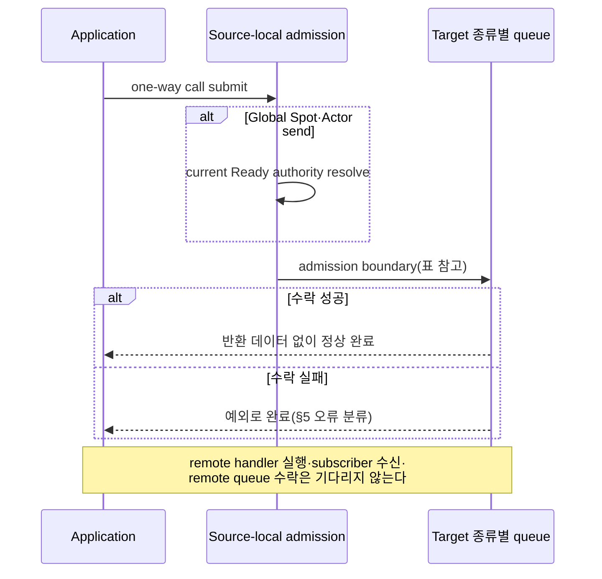
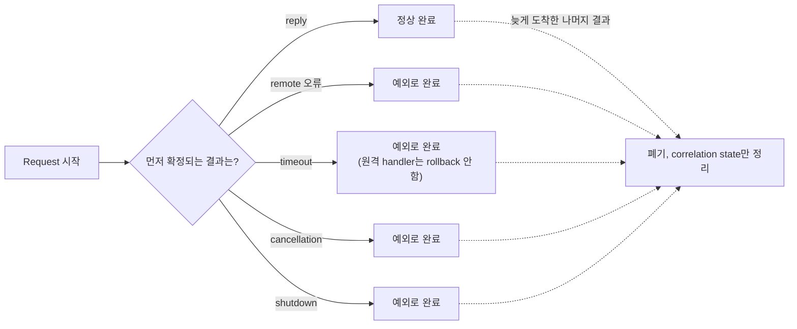
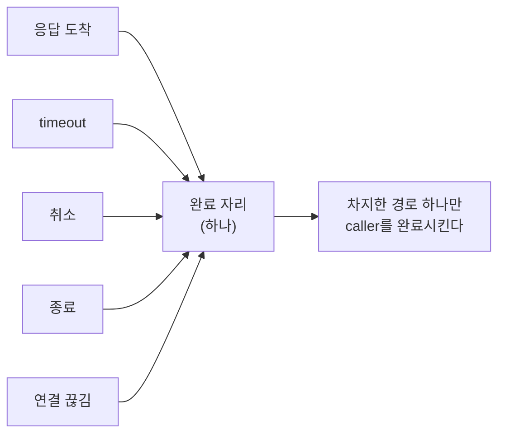
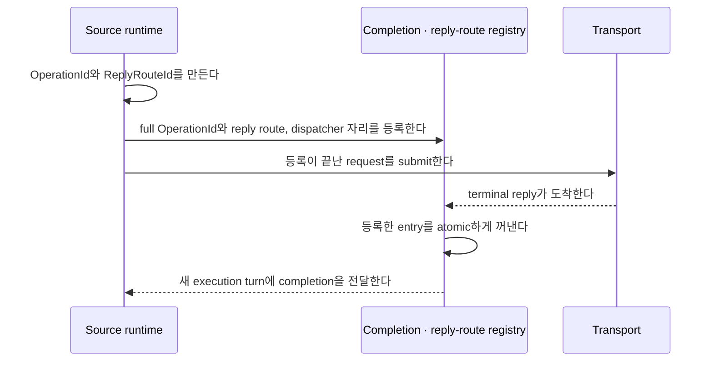

# Submit과 completion

[Execution 주제 목차](README.ko.md) · [스펙 목차](../README.ko.md) · [다음: 02. Handler turn과 execution gate](02-handler-turn-and-execution-gate.ko.md)

> 이 문서는 ZLink Framework의 Messaging·Worker call이 언제 완료되는지, one-way submit이
> 언제 수락되는지, request가 무엇으로 완료를 확정하는지, 그리고 그 완료를 runtime이 어떤
> 구조로 정확히 한 번만 확정하는지를 정의한다. Handler가 실행되는 순서와 `Yield`가
> 반납하는 범위는 [Handler turn과 execution gate](02-handler-turn-and-execution-gate.ko.md)가
> 소유하고, cancellation과 shutdown이 이미 수락한 작업에 하는 일은
> [Cancellation과 shutdown](03-cancellation-and-shutdown.ko.md)이 소유한다. Spot timer의
> 완료는 [Spot timer](../03-spot-actor/10-spot-timer.ko.md)가, Core byte HWM과 Application Job Queue의
> 관계는 [Application job queue와 backpressure](04-application-job-queue-and-backpressure.ko.md)가
> 소유한다.

## 1. Messaging·Worker call 개요와 적용 범위

Application이 Messaging call builder나 Worker call builder를 호출하면 그 call은 이
문서가 정의하는 terminator 하나로 완료된다. 이 문서는 그 terminator가 무엇을 완료로
보는지, one-way submit이 admission을 어디까지 기다리는지, request가 reply·오류·
timeout·cancellation·shutdown 중 어느 것으로 완료되는지, 그리고 그 완료를 확정하는
내부 구조를 정의한다.

이 절의 naming 규칙은 Messaging call builder와 `RunCpuWorker`·`RunIoWorker`가 반환하는
Worker call builder에 적용한다. Messaging call에는 Framework Send·Request·Publish·
Reply, [Spot](../00-foundation/02-glossary.ko.md#spot)·Actor Send·Request,
[Stream Connector](../00-foundation/02-glossary.ko.md#stream-connector) Send·Request·Wait와
HTTP request가 포함된다. 여기서 Spot은 주소와 상태를 가진 논리 instance로 실행 node가
바뀌어도 같은 ID로 접근할 수 있는 대상이며, Stream Connector는 서버 Framework의 STREAM
모델에 접속해 packet을 주고받는 client library다. Network topology·endpoint·node 연결,
Host·runtime·client 설정, handler·Channel membership·codec·security·retry 등록과 object
lifecycle builder에는 적용하지 않는다. `RelayAsync(...)`처럼 builder를 반환하지 않는 직접
method도 대상이 아니다.

## 2. Terminator별 완료 의미와 언어별 이름

Call object는 operation 종류에 맞는 terminator만 제공한다. Actor Create/GetOrCreate의
single-use, 중복 option과 terminal 재호출 오류는
[Actor 모델 §6.2](../03-spot-actor/04-actor-model.ko.md#62-create와-getorcreate-입력)가 소유한다.
언어별 interface는 이 계약의 이름과 타입을 투영한다. 다른 operation의 single-use 여부,
같은 option을 반복했을 때의 처리와 terminal 재호출 오류는 각 operation의 언어별 interface가 정의한다.

| terminator | 수락 뒤 완료 의미 | owner turn |
|---|---|---|
| one-way 비동기 terminal | 송신 측 수락 경계인 [source-local admission](../00-foundation/02-glossary.ko.md#source-local-admission)이 성공하면 반환 데이터 없이 완료하고 실패하면 예외로 완료한다 | await하지 않으면 현재 turn을 기다리게 하지 않는다 |
| 일반 비동기 terminal | Request, worker 또는 create의 application 결과가 terminal 상태가 될 때까지 기다린다 | 완료 continuation이 끝날 때까지 현재 실행 객체의 [handler turn](../00-foundation/02-glossary.ko.md#handler-turn)을 유지한다 |
| 동기 blocking 종결자 | application 결과(또는 one-way admission)까지 **호출 thread를 막는다**. runtime 실행 문맥에서는 `InvalidOperation`으로 즉시 실패한다(§4 F2-a) | application thread 전용 — runtime turn·gate를 쥐지 않는다 |
| `Yield` | Operation을 제출한 뒤 callback이 application queue에서 execution gate를 점유해 실행되는 단위인 shared [Spot turn](../00-foundation/02-glossary.ko.md#spot-turn)을 반납하고 application 결과를 기다린다 | 완료 continuation은 같은 Spot gate를 다시 얻어 새 turn에서 재개한다 |

언어별 일반 비동기 terminal 이름은 .NET `Async`, C++ `async`, Java·Node.js `submit`, Kotlin
전용 wrapper의 `await`다. 동기 blocking 종결자 이름은 binding 정책
[async-coroutine-policy §6](../../../../../../../bindings/doc/spec/async-coroutine-policy.ko.md#6-언어별-terminal-interface)을
따른다 — Java `submit_sync()`, .NET `Submit()`, C++ `submit()`(Kotlin은 추가 없이 Java 표면의
`submit_sync()`를 노출한다). **Node.js는 동기 blocking 종결자를 제공하지 않는다(§4.1).** 실제 shared
Spot gate를 반납하는 terminal만 `Yield`·`yield`라는 이름을 사용한다.

**Framework가 돌려주는 비동기 완료 표현에도 [binding의 제출 간 stage 격리 규칙](../../../../../../../bindings/doc/spec/async-coroutine-policy.ko.md#submission-stage-isolation)을 적용한다.** 이 문서가 다루는 비동기 종결자가 admission 또는 application 결과를 직접 반환하거나 binding 결과를 변환해서 반환할 때, 반환 표현이나 그것이 참조하는 상태의 공유 때문에 한 호출에 가한 완료 상태 변경·취소·소비·대기 해제가 다른 호출의 완료 상태나 소비 가능성에 전파되어서는 안 된다. 이미 완료된 결과를 공유하는 경우도 같다. 정상적인 자원 회수에 따른 다른 호출의 진행은 기존 admission·lifecycle 계약을 따른다.

검증은 Framework가 실제로 노출하는 종결자의 완료 표현과 관측 결과를 사용하여, 이미 반환된 다른 호출의 결과와 이후 호출의 결과가 공유 상태 때문에 오염되지 않는지 확인한다. Binding 결과 객체의 구조나 `Backpressured` 결과를 Framework에 노출하도록 요구하지 않는다.

격리의 책임은 그 완료 표현을 반환하는 계층에 있다. Framework queue 대기의 취소, binding operation의 caller wait 취소와 late completion 정리의 소유권은 [Cancellation과 shutdown §3](03-cancellation-and-shutdown.ko.md#3-cancellation의-경쟁-처리)을 따른다. 반환 표현의 격리를 위해 pending stage의 기존 cancellation 연결을 제거하거나, binding의 operation state·registry·재제출을 Framework에 추가하지 않는다.

`Yield`를 제공하는 실행 문맥과 call 목록은
[Handler turn과 execution gate §16](02-handler-turn-and-execution-gate.ko.md#yield-call-eligibility)이 소유한다.

`Yield`했을 때 어떤 claim을 유지하고 어떤 gate만 반납하는지는
[Handler turn과 execution gate 「3. `Yield` 시 gate와 claim」](02-handler-turn-and-execution-gate.ko.md#3-yield-시-gate와-claim)이
정의한다. Actor Join은 이 절의 terminator 대상이 아니다 — `Defer()`의 완료 경계는
[Handler turn과 execution gate 「5. Actor Join과 `Defer()` 완료 경계」](02-handler-turn-and-execution-gate.ko.md#5-actor-join과-defer-완료-경계)가
정의한다.

## 3. Worker offload

- CPU 작업과 비동기 I/O 작업은 Framework가 소유한 worker scheduler에 제출한다.
- CPU execution slot은 application CPU callback이 실제로 실행되는 동안만 점유한다.
  비동기 I/O가 operating system, transport 또는 Store completion을 기다리는 동안에는
  CPU execution slot을 점유하지 않는다.
- I/O admission과 completion bookkeeping도 bounded resource를 사용하지만, CPU worker
  queue가 가득 찼다는 이유만으로 이미 제출된 I/O completion을 오류로 바꾸지 않는다.
- CPU worker의 configured thread 수보다 많은 I/O operation이 completion을 기다릴 수 있다.
  이 개수를 Framework가 따로 제한하지 않는다 — I/O를 시작하려면 handler가 돌아야 하므로
  호출자의 동시성이 곧 상한이다.
- 이 격리 계약은 별도의 public I/O thread-count 또는 queue 설정을 요구하지 않는다.
  언어 runtime은 native async I/O, event loop 또는 completion executor로 구현할 수
  있다.
- Worker call이 계산한 application 결과 type은 유지하고, 허용된 `SpotWide`·Instance
  문맥에서는 같은 결과를 `Yield`로 기다릴 수 있다.
- Queue가 가득 차면 자리가 날 때까지 기다린다. 기다리다
  [deadline](../00-foundation/02-glossary.ko.md#deadline)을 넘기면
  [`DeadlineExceeded`](../00-foundation/02-glossary.ko.md#deadlineexceeded)로, 작업 자체가
  실패하면 `InternalFailure`로 끝난다.
- Timeout이나 cancellation 뒤 늦게 끝난 작업은 두 번째 terminal 결과를 만들지 않는다.

## 4. One-way submit — admission 경계

Send, publish, bound session send, session Actor relay와 명시적인 STREAM send·reply는
비동기 submit terminator와 §2 표의 동기 blocking 종결자를 제공하고, **nonblocking try 계열은
제공하지 않는다**. nonblocking 완료를 주는 유일한 대안은 callback인데 복잡하고 혼동을 주므로 동기
종결자는 blocking만 제공한다. 정상 완료 값은 없으며 operation family가 정의한 source-local admission
boundary가 message를 수락했다는 뜻이다. Remote handler 실행, subscriber 수신, remote Spot queue
수락 또는 application callback 완료는 기다리지 않는다.

<a id="41-nodejs는-동기-blocking-종결자를-제공하지-않는다"></a>
### 4.1 Node.js는 동기 blocking 종결자를 제공하지 않는다

Node.js runtime은 **단일 JS 스레드**다. 그 스레드를 막으면 framework가 완료를 배달할 방법이
없다. request의 대상 handler가 같은 process 안에 있으면 **호출자가 기다리는 응답을 호출자가
만들어야 하는 상태**가 되어 교착한다. Java·.NET·C++은 완료를 나르는 실행 문맥이 호출 thread와
분리돼 있어 이 문제가 없다(Java는 전용 platform-thread pump).

대상이 로컬인지 원격인지는 제출 시점에 항상 알 수 있는 것이 아니므로, "로컬일 때만 막는다"는
규칙도 세울 수 없다. **지킬 수 없는 약속을 표면에 두지 않는다** — Node.js framework 표면에는
동기 blocking 종결자가 없다. Node application은 비동기 종결자(`submit(...)` → `Promise`)를 쓴다.

이 결정은 framework 표면에만 적용된다. **binding Node의 `submit_sync()`는 그대로 있다**
([async-coroutine-policy §6](../../../../../../../bindings/doc/spec/async-coroutine-policy.ko.md#6-언어별-terminal-interface)) — binding은 framework runtime의 완료 배달에 의존하지 않는다.

**동기 blocking 종결자는 runtime 실행 문맥에서 부를 수 없다(F2-a).** handler turn·Spot turn·state
lane 위에서 blocking하면 gate를 쥔 채 완료를 기다려 교착한다. [상태 소유와 state lane §5](06-state-ownership-and-lanes.ko.md#반환-전-완료-보장)(반환 전 완료 보장)·[handler turn §2](02-handler-turn-and-execution-gate.ko.md)과 같은 원칙으로, runtime 실행 문맥에서 동기
종결자를 부르면 `InvalidOperation`으로 즉시 실패한다. 동기 종결자의 용도는 application
thread(main·테스트·스크립트)다.

Session callback이 사용하는 transport-facing stream write(동기 `bool` 반환)는 이 절의 call이
아니며 [STREAM session](../04-session/01-stream-session.ko.md)의 transport 실행 문맥 계약을 따른다.

| Target 종류 | admission boundary |
|---|---|
| Remote target | local transport queue |
| Local target | 해당 mailbox 또는 relay queue |
| [Classic fanout](../00-foundation/02-glossary.ko.md#classic-fanout) — 연결·구독이 끝난 대상에게만 event를 보내는 별도 PUB/SUB 경로 — ·STREAM | 해당 socket queue |

Global Spot·Actor send는 current [Ready](../00-foundation/02-glossary.ko.md#ready) authority
resolve부터 이 source-local admission까지 기다린다.



## 5. Backpressure와 오류 분류

Local Framework capacity가 부족하면 Framework가 해당 family의 send timeout까지
기다린다. Core HWM으로 binding operation이 대기하면 Core가 재시도를 소유하고
operation별 completion awaitable(binding 결과 객체의 `admitted`)을 완료한다. Framework는
별도 readiness callback, retry waiter 또는 binding adapter를 만들지 않으며 다음 규칙을 따른다.

- 송신 경로나 queue의 capacity가 일시적으로 부족한 내부 상태인
  [`Backpressured`](../00-foundation/02-glossary.ko.md#backpressured)는 public terminal result가
  아니다.
- Capacity가 먼저 확보되면 message를 정확히 한 번 제출하고 정상 완료한다.
- Binding에 넘기기 전 Framework queue 대기의 timeout·shutdown·cancellation 경쟁은
  [Cancellation과 shutdown §3](03-cancellation-and-shutdown.ko.md#3-cancellation의-경쟁-처리)을 따른다.
  Binding operation의 cancellation과 native completion 정리도 그 절의 소유 경계를 참조한다.
- Framework는 기다리는 줄을 따로 만들지 않으므로 "대기 자리가 없다"는 이유로 끝나는
  호출이 없다. 자리를 기다리다 시간이 다 되면 `DeadlineExceeded`로 끝난다.
- 어느 경우에도 `Backpressured` status를 공개하거나 나중에 message를 다시 제출하지 않는다.

| 실패 | 오류 분류 |
|---|---|
| Actor authority 없음 | `NotFound` |
| Spot authority 없음 | `NotFound` |
| Mesh나 선택 가능한 Server 없음 | `NotFound` |
| 사용할 route가 없음 | `Unavailable` |
| admission deadline 만료 | `DeadlineExceeded` |
| runtime이 새 admission을 받지 않음 | `ShuttingDown` |
| 같은 call의 terminal을 두 번 실행 | `InvalidOperation` |

Pending admission은 caller가 지정한 Node RID, global Spot·Actor ID와 session binding
token을 유지한다. 여러 MeshNode가 참여해 node와 Channel message를 주고받는 범위인
[RouteMesh](../00-foundation/02-glossary.ko.md#routemesh)·ClientServer select-one Channel은 첫 binding operation을
시작하기 직전에 같은 [ChannelName](../00-foundation/02-glossary.ko.md#channelname)의 현재 eligible
member 하나를 선택한다. Binding operation이 아직 시작되지 않은 route eligibility·
source-local admission 확인 단계에서만 다른 eligible member를 선택할 수 있다.

Binding operation이 시작되면 선택한 target이 확정된다. Core가 HWM 재시도와
완료를 소유하며 Framework는 용량을 이유로 target을 다시 선택하거나 binding operation을
다시 제출하지 않는다. 완료 뒤에는 자동 재제출하지 않는다.

## 6. Logical Multicast와 Classic fanout

[Logical Multicast](../00-foundation/02-glossary.ko.md#logical-multicast)의 동작 규칙은 다음과
같다.

- Operation을 시작할 때 target snapshot을 고정하고 각 target을 한 번씩 시도한다.
- Operation 자체를 local executor에 제출하지 못하면 send timeout까지 기다린다.
- Source-local 자리를 확보해 transaction이 시작되면 public
  terminal은 반환 데이터 없이 정상 완료하고 target별 제출은 내부에서 계속한다.
- 시작된 뒤 개별 target 실패는 전체 publish를 rollback하거나 exceptional completion으로
  바꾸지 않는다.
- Target별 수락·실패 결과는 public 반환값이나 publish 전용 monitoring 값으로 만들지
  않는다.
- Target이 0개여도 정상 완료한다.

[Classic fanout](../00-foundation/02-glossary.ko.md#classic-fanout)은 subscriber가 없어도 publisher
socket queue가 message를 수락하면 정상 완료한다. Subscriber 수와 수신 완료를 public
result로 만들지 않는다.

## 7. Admission deadline — owner와 값 규칙

One-way admission deadline은 operation이 실제로 사용하는 outbound socket 또는, RouteMesh에
참여해 message를 보내거나 받는 runtime node인
[MeshNode](../00-foundation/02-glossary.ko.md#meshnode)가 소유한다.

| Operation family | deadline owner | 기본 규칙 |
|---|---|---|
| [RouteMesh](../00-foundation/02-glossary.ko.md#routemesh) node·channel, Spot, Actor | 선택한 MeshNode ROUTER send timeout | global object route resolve 시간을 포함하며 설정이 없으면 1초 |
| ClientServer | client DEALER send timeout | 설정이 없으면 1초 |
| Logical Multicast | 선택한 MeshNode ROUTER의 target별 send timeout | commit된 publish transaction의 각 remote target에 적용한다 |
| classic fanout | publisher socket send timeout | 설정이 없으면 1초 |
| bound session·session Actor relay | Framework socket send timeout | local·remote Actor route가 바뀌어도 같은 deadline을 사용한다 |
| STREAM send·reply | 해당 STREAM socket send timeout | reply에 caller request timeout을 사용하지 않는다 |

Framework public send timeout의 값 규칙은 다음과 같다.

- millisecond로 올림한 값이 `1..INT_MAX` 범위인 유한한 duration이어야 한다.
- 양수인 sub-millisecond 값은 1ms로 올린다.
- `0`, 음수, 무한대와 상한 초과는 늦어도 host startup에서 거부하며 유효한 기본값으로
  바꾸지 않는다.
- 값이 지정되지 않으면 해당 family의 1초 기본값을 선택한다.
- 기존 public root fallback이 있으면 같은 의미로 적용하지만, 다른 언어에 같은 root
  option을 새로 추가해야 한다는 뜻은 아니다.
- Runtime setter가 있는 경우 잘못된 값은 setter 호출에서 즉시 거부한다.

STREAM one-way send call은 선택적인 호출별 admission timeout modifier를 제공한다. 이
값은 reply를 기다리는 시간이 아니라 해당 send가 STREAM transport queue의 수락을
기다릴 수 있는 최대 시간이다.

- Modifier를 생략하면 해당 STREAM socket의 send timeout을 사용한다.
- Modifier를 지정하면 socket timeout과 호출별 timeout 중 먼저 도달하는 deadline을
  사용한다. 호출별 값으로 socket timeout을 연장하지 않는다.
- 값 검증과 millisecond 올림은 위 `1..INT_MAX` 규칙을 그대로 사용한다.
- Deadline이 먼저 끝나면 `DeadlineExceeded`로 한 번 완료하고, 이후 capacity가
  생겨도 해당 send를 admission하거나 다시 시도하지 않는다.
- 이 modifier는 STREAM reply call에는 적용하지 않는다. Reply는 socket send timeout과
  one-shot token 계약을 사용한다.
- 언어별 cancellation과 timeout의 경쟁은
  [Cancellation과 shutdown §3](03-cancellation-and-shutdown.ko.md#3-cancellation의-경쟁-처리)을 따른다.

## 8. STREAM reply token

Bound session과 session Actor relay는 local relay가 수락한 뒤 발생한 remote 실패를
같은 submit의 실패로 되돌리거나 자동으로 다시 시도하지 않는다.

STREAM reply의 one-shot [reply token](../00-foundation/02-glossary.ko.md#reply-token) 규칙은
다음과 같다.

- Request sequence와 token을 call을 만들 때 보존한다.
- 유효한 첫 terminator invocation이 transport admission 시도 전에 token을
  원자적으로 claim하고 소비한다.
- 그 terminator가 `DeadlineExceeded`, cancellation 또는 runtime shutdown 예외로
  완료되어도 token은 다시 사용할 수 없다.
- 같은 token에서 만든 두 call이 경쟁하면 claim에 성공한 하나만 transport admission을
  시작하고 나머지는 transport 시도 없이 exceptional completion으로 끝난다.
- Caller request timeout은 reply wire에 전달되지 않으므로 STREAM reply의 admission
  deadline으로 사용하지 않는다.
- 늦게 수락된 reply가 client correlation에서 일치하지 않더라도 transport admission
  결과를 request 결과로 바꾸지 않는다.

## 9. Request completion — 완료 경쟁과 timeout budget

Request caller는 reply, remote 오류, timeout, cancellation 또는 shutdown 가운데 먼저
확정된 결과 하나를 관찰한다. Timeout과 cancellation은 호출자의 대기를 끝내지만
원격 handler가 이미 시작한 업무를 되돌리지 않는다. Framework service operation의
late reply는 닫힌 correlation에 다시 전달하지 않는다. Binding operation의 수명과 native
completion 정리는 [Cancellation과 shutdown §3](03-cancellation-and-shutdown.ko.md#3-cancellation의-경쟁-처리)의
소유 경계를 따른다.



Global object request timeout은 current Ready authority resolve, outbound
admission, handler와 reply 전체를 포함한다. Source는 앞 단계에서 사용한 시간을 뺀
잔여 시간만 다음 단계에 전달한다. Remote target의 미수락을 증명하는 receipt가
없으므로 timeout이나 연결 실패 뒤 다른 owner에게 request를 자동 재제출하지 않는다.

같은 handler turn에서 보낸 request를 기다릴 때 gate를 어떻게 반납하고 재개하는지는
[Handler turn과 execution gate 「4. 같은 turn에서의 대기와 반납」](02-handler-turn-and-execution-gate.ko.md#4-같은-turn에서의-대기와-반납)이
정의한다.

Reply, timeout, cancellation과 Spot shutdown이 경쟁하면 먼저 확정된 terminal 결과
하나만 사용한다. Spot이 종료되거나 같은 Spot ID로 새 generation이 만들어지면 이전
activation의 늦은 reply를 새 Spot에 전달하지 않는다. Target 연결 종료나 timeout 뒤
다른 RouteMesh member, ClientServer server 또는 송신 경로로 자동 재전송하지 않는다.

## 10. Operation identity와 완료 자리 (구현)

호출마다 완료 자리를 하나 두고, 여러 경로가 그 자리를 두고 경쟁한다. 차지한 경로만
caller의 대기를 푼다. 진 경로는 아무것도 하지 않는다.



**진행 중 호출 표에서 항목을 atomic하게 꺼내는 연산을 완료 경쟁 지점으로 사용한다.**
응답, timeout, 취소와 종료 경로가 같은 항목을 꺼내려고 시도한다. 꺼내기에 성공한
경로만 완료 권한을 얻고, 나머지 경로는 이미 완료됐음을 확인하고 끝난다. 이 연산은
완료 권한 확정과 진행 중 호출 정리를 함께 수행하므로 별도 완료 표시나 두 번째 자리
예약이 필요하지 않다. 모든 완료 경로가 같은 방식을 사용해야 새 경로를 추가해도 경쟁
규칙이 달라지지 않는다.

Service wire의 request는 서로 다른 두 값을 함께 보존한다. 둘 다 Framework 내부
값이며 application에는 노출하지 않는다.

| 값 | 형식 | 맡는 일 |
|---|---|---|
| `OperationId` | `{ high: u64, low: u64 }` | operation 하나의 terminal deduplication identity다. Relocation과 reply relay를 거쳐도 같은 값을 유지한다 |
| `ReplyRouteId` | non-zero `u64` | terminal reply를 source lifecycle 안의 대기 항목과 연결한다. Operation identity를 대신하지 않는다 |

Terminal 결과가 필요한 operation의 `OperationId`는 두 word가 모두 0일 수 없다.

Registry와 durable completion record는 두 word 전체를 보존한다. `low` word만
key로 쓰면 서로 다른 operation을 같은 항목으로 판단할 수 있다.

`ReplyRouteId`도
source owner lifecycle 안에서 대기 중인 request 사이에 중복할 수 없지만, 이 값만으로
relocation 이후의 terminal deduplication을 판단하지 않는다.

**보내는 runtime은 `OperationId`·`ReplyRouteId`를 먼저 만들고 pending completion
entry·완료 callback을 전달하는 [completion dispatcher](../00-foundation/02-glossary.ko.md#completion-dispatcher)의 자리·reply 경로를 등록한 다음에만 transport에 submit한다.** 같은
process 즉시 응답이어도 등록보다 reply가 먼저 처리되지 않아야, 먼저 도착한 응답을
위한 별도 보관 map과 그 map을 pending table과 교차 확인하는 경쟁 처리가 필요 없기
때문이다. Wire request는 두 값을 각각의 field로 보존하며 한 값을 다른 값의 별칭으로
사용하지 않는다.



## 11. 완료 callback의 execution turn (구현)

**완료를 확정할 때 잡은 잠금 안에서 application callback을 실행하지 않는다.**
Callback이 다시 runtime을 호출할 때 같은 잠금을 요구하면 교착이 되기 때문이다.
Timer 취소와 payload 정리도 그 바깥에서 한다.

잠금을 놓은 직후 같은 호출 stack에서 callback을 바로 실행하는 것만으로는 충분하지
않다. 그렇게 하면 transport의 응답 처리나 timeout 처리가 끝나기 전에 application
code가 runtime에 다시 진입할 수 있다. 완료 callback은 process가 공유하는 completion
dispatcher에 넣고, 현재 처리가 반환된 뒤 새 execution turn에서 실행한다.

순서는 이렇다.

1. 완료 권한을 확정한다.
2. 잠금을 놓는다.
3. callback을 dispatcher에 넣는다.
4. 새 execution turn에서 callback을 실행한다.

**완료 callback을 dispatcher에 넣는 일은 실패하지 않는다.** Dispatcher에 상한이 없기
때문이다. 자리가 없다는 이유로 request를 거부하거나, 이미 수락한 호출의 완료를 버리는
길은 없다.

Dispatcher에서 기다리거나 실행 중인 callback 수는 진행 중인 호출 수를 넘지 않는다. §10이
정한 대로 호출 하나가 완료 자리 하나를 쓰기 때문이다.

진행 중인 호출 수는 Framework가 따로 세지 않는다. 그 수를 제한하는 것은 Core다. Core는
socket마다 completion 자리를 정해 두고, 그 자리가 다 차면 새 호출을 접수하지 않고
`ZLINK_SUBMIT_BACKPRESSURED`로 알린다([Core socket 계약](../../../../../../../core/doc/spec/core/socket/README.ko.md)).
이것은 오류가 아니라 기다리라는 신호이며, binding이 받아서 자리가 날 때까지 기다린 뒤 같은
호출을 완성한다([Binding 비동기 coroutine 정책](../../../../../../../bindings/doc/spec/async-coroutine-policy.ko.md)).
상대 host에 일이 쌓였을 때도 같다 — 상대의 `PAUSED`가 이쪽 send를 멈추고, Core와 binding이
보낼 자리를 기다린다([§6](04-application-job-queue-and-backpressure.ko.md#6-pressure-상태와-socket-제어),
[§7](04-application-job-queue-and-backpressure.ko.md#7-send-completion과의-합성)).

이 수는 이 host가 **보낸** 호출을 센다. Framework pressure는 이 host가 **받아서** handler를
기다리는 일을 센다. 둘은 세는 것이 다르므로 하나로 합치지 않는다([§1](04-application-job-queue-and-backpressure.ko.md#1-두-독립된-capacity-authority)).

Dispatcher는
callback마다 thread를 만드는 대신 process가 공유하는 lane을 사용하며, shutdown에서는
이미 수락한 callback을 모두 실행한 뒤 종료한다.

한 callback의 exception은 뒤
callback의 실행을 막지 않는다.

## 12. 수락 후에는 다시 보내지 않는다

전송이 message를 수락한 뒤에는 대상이 실행했는지 알 수 없다. 이 상태에서 다른
대상으로 다시 보내면 두 번 실행될 수 있다.

**수락 이후에는 runtime이 자동으로 다시 보내지 않는다.** 연결이 끊겨도
마찬가지다([Transport liveness 「5. Ready와 장애 판정」](../02-channel-transport/05-transport-liveness.ko.md)).
Application이 새 호출을 시작할 수는 있으며, 그때 중복 실행 위험은 application이
판단한다.

이 규칙 때문에 "보낸 뒤 실패"와 "보내기 전 실패"를 구분해야 한다.

| 실패 시점 | 다시 보내도 되는가 |
|---|---|
| 전송이 수락하기 전 | 된다. 대상이 받지 않았음이 확실하다 |
| 전송이 수락한 뒤 | 안 된다. 실행 여부를 알 수 없다 |

## 13. 응답을 기다리지 않는 호출의 완료 지점

응답을 기다리지 않는 호출은 이 process의 송신 경로가 message를 수락한 시점에 정상
완료한다. 원격 queue가 받았는지, handler가 실행했는지는 이 결과로 알 수 없다
([Framework API 「12. Spot, Actor와 STREAM owner」](../00-foundation/06-framework-api.ko.md#21-dispatch-실패-action-owner)).

"로컬 수락"과 "전송 수락"은 서로 다른 사건이 아니다. 이 제품에서 송신 경로는 곧
socket의 송신 큐이므로 같은 완료 경계를 가리킨다. 문서와 코드 주석에서는 send
acceptance 한 표현만 사용한다.

## 14. 실패를 문자열로 분류하지 않는다 (구현)

완료 경로는 취소·시간 초과·종료를 구분해야 한다. 이 구분이 caller가 받는 결과를
정한다.

오류 메시지 문자열에 정규식을 걸어 취소를 판정하면 메시지 표현이 바뀔 때 분류도
조용히 바뀐다. 반대로 "cancel"이 들어간 업무 오류는 취소로 잘못 분류되어 삼켜진다.

**실패는 타입이나 전용 값으로 분류한다.** 메시지 문자열은 사람이 읽는 용도이며
분기 조건이 아니다. 오류 kind 값 자체는
[Framework 오류 모델](../00-foundation/07-framework-error-model.ko.md)이 소유하며
이 문서는 그 값을 어떤 완료 경로가 골라야 하는지만 정의한다.

## 15. Binding send terminal 소비 (구현)

Framework runtime이 binding의 HWM-managed send 계열(PAIR send, routed send,
`Received.send()`)을 소비할 때는 **async terminal**(C++ `async()`, .NET `Async()`,
그 외 `submit()`)의 **결과 객체**를 사용한다(F1). 종결자가 돌려준 `result`로 즉시 판정하고,
`result == BACKPRESSURED`일 때만 `admitted`를 기다렸다가 재개하며, request는 `reply`를 소비한다.
이렇게 해서 "HWM에 걸렸을 때만 기다린다"를 정확히 구현한다 — 지금까지는 stage 하나로 admission과
reply를 구분할 수 없어 [3단계 backpressure](04-application-job-queue-and-backpressure.ko.md) 대기가 정확하지
않았다. framework **공개 terminal은 backpressure를 노출하지 않으며**(§5, `Backpressured`는 public
result가 아니다), 이 소비는 framework 내부 구현에만 있다. Core send-completion 통지가 완료를
구동하므로 framework는 별도 executor나 offload로 감싸지 않는다. Binding terminal의 이름·반환
타입·결과 객체 계약 자체는
[바인딩 routed 전송 계약과 비동기 완료 표면 정책](../../../../../../../bindings/doc/spec/async-coroutine-policy.ko.md)이
소유한다 — 이 절은 framework의 소비 규칙만 소유한다.

binding의 **동기 blocking 종결자**(§2·§4)는 application thread 전용 공개 표면이다. 공개 동기 계약의
구현([상태 소유와 state lane §5](06-state-ownership-and-lanes.ko.md#반환-전-완료-보장)가 유지를 요구하는
반환 전 완료 보장)에서 HWM 포화 시의 대기는 그 공개 계약의 관측 가능한 특성이며 위반이 아니다.
즉시 backpressure를 sync `DONTWAIT` terminal로 관찰하던 경로는 없앤다 — admission 결과는 async
terminal 결과 객체의 `result`로 받는다.

Publish는 HWM-free이고 동기 terminal을 사용한다. Raw reply는 peer topology에 따라 다르다.
RouteMesh ROUTER-ROUTER reply는 별도 [Completion connection](../00-foundation/02-glossary.ko.md#completion-connection)에서 HWM-free다. ClientServer
ROUTER가 Client DEALER로 보내는 raw reply는 single Application connection의 HWM·PAUSED와
`SNDTIMEO` admission을 적용하므로 `BACKPRESSURED`로 끝날 수 있다. 두 경우의 동기 one-shot
terminal은 binding 스펙이 소유한다. Raw reply가 Framework completion queue에 들어간 뒤
Application Job Queue permit을 우회하는 규칙과 first-terminal 규칙은 그대로 적용한다.

### Framework typed Session reply

Framework의 typed Session reply는 raw binding reply를 async 종결자로 바꾼 표면이
아니다. Framework runtime이 typed serialization과 request별 one-shot reply token을
소유하며, 종결자는 token을 원자적으로 claim한 뒤 source-local admission까지
기다린다. 같은 token의 두 번째 reply는 transport를 시도하지 않고 exceptional
completion으로 끝난다. Token claim 규칙은 [§8](#8-stream-reply-token)이 소유한다.

| Framework 언어 | Typed Session reply terminal | 완료 표현 |
|---|---|---|
| C++ | `.reply_packet(...).async()` | `co_await` 가능한 Framework task |
| .NET | `.Reply(...).Async(ct)` | `ValueTask` |
| Java | `.reply(...).submit()` | `CompletionStage<Void>` |
| Kotlin | `.reply(...).await()` | suspending `Unit` |
| Node | `.reply(...).submit(signal?)` | `Promise<void>` |

`submit` 이름을 쓰는 언어에서도 반환 타입과 소유 계층으로 raw binding
reply(동기 one-shot)와 구분한다.

## 16. 언어별 표현

공통 계약은 특정 async type 이름을 강제하지 않는다. 완료 순서, cancellation과 오류
의미는 이 문서가 소유하며, 각 언어의 정확한 반환 type과 오류 표현은 다음 언어별
interface가 소유한다.

| 언어 | 일반 비동기 완료 | 동기 blocking | Spot turn 반납 | 언어별 interface owner |
|---|---|---|---|---|
| .NET | `Async(...)`가 `ValueTask` 또는 `ValueTask<T>`를 반환한다 | `Submit(...)` | `Yield(...)` | [언어별 interface 목차](../languages/dotnet/interfaces/README.ko.md) |
| Java | `submit(...)`이 `CompletionStage<T>`를 반환한다 | `submit_sync(...)` | `yield(...)` | [Channel messaging](../languages/java/interfaces/channel-messaging.ko.md) |
| Kotlin | 전용 call wrapper의 suspending `await()`를 사용한다 | Java 표면의 `submit_sync(...)` | 전용 wrapper의 `yield()` | [Channel messaging](../languages/kotlin/interfaces/channel-messaging.ko.md) |
| Node.js | `submit(...)`이 `Promise<T>`를 반환한다 | **제공하지 않는다(§4.1)** | `yield(...)` | [인터페이스 목차](../languages/node/interfaces/README.ko.md) |
| C++ | `async(...)`가 `task_t<T>`를 반환한다 | `submit(...)` | `yield(...)` | [framework 인터페이스](../languages/cpp/interfaces/README.ko.md) |

동기 blocking 종결자는 runtime 실행 문맥에서 `InvalidOperation`으로 실패한다(§4 F2-a).

각 언어별 interface는 terminator별 return type, cancellation 인자, callback 또는
coroutine 표현을 고정한다. 언어 표준 표현이 달라도 같은 operation의 완료 시점,
ordering과 오류 분류는 달라지지 않는다.

C++ `task_t`는 호출할 때 operation을 시작하므로 `async()`를 결과 사용 여부에 따라
다음과 같이 사용할 수 있다. 아래 두 줄은 서로 다른 single-use call을 보여 준다.

```cpp
sendCall.async();                      // 결과 없이 operation만 시작한다.
auto reply = co_await requestCall.async(); // 비동기 application reply를 기다린다.
```

반환형만 다른 overload는 만들지 않는다. C++ Messaging call wrapper는 비동기 `task_t<T> async()`와
동기 blocking `submit()`을 함께 제공한다(두 종결자는 이름이 다르므로 overload가 아니다). `submit()`은
application thread 전용이며 runtime 실행 문맥에서는 `InvalidOperation`으로 실패한다(§4 F2-a).
Callback overload는 parameter list가 다르므로 `submit(callback)`으로 제공할 수 있다.

## 17. 검증 요구

공개 표면(각 언어의 terminator return type, 반환된 오류 kind, one-way submit의
정상·예외 완료, request의 reply·오류·timeout·cancellation·shutdown 완료, STREAM
reply token의 claim 결과)만으로 다음을 확인한다. 각 항목은 test 하나로 이어진다.
내부 구조로만 확인할 수 있는 조건(완료 확정 방식이 runtime 안에서 하나라는 것,
dispatcher 자리 등록 시점)은 §10·§11이 규칙과 함께 소유하며 여기 적지 않는다.

**Submit과 admission**

- One-way call은 admission boundary(§4 표)가 수락하면 반환 데이터 없이 완료하고,
  실패하면 §5 오류 분류 표의 값 하나로 완료한다.
- Local capacity가 부족한 send는 family send timeout까지 기다리다가, capacity가
  먼저 생기면 정확히 한 번 제출되어 정상 완료하고, timeout이 먼저 확정되면
  `DeadlineExceeded`로 완료한다.
- 진행 중인 send·request를 아무리 늘려도 대기 자리가 없다는 이유로 끝나는 call이 없고,
  시간이 다 된 call만 `DeadlineExceeded`로 끝난다.
- Logical Multicast는 target이 0개여도 반환 데이터 없이 정상 완료하고, 시작 뒤
  개별 target 실패는 public 반환값을 바꾸지 않는다.
- Classic fanout publish는 subscriber가 없어도 publisher socket queue가 수락하면
  정상 완료한다.

**Deadline과 reply token**

- Send timeout에 `0`, 음수, 무한대 또는 상한 초과 값을 설정하면 host startup 또는
  setter 호출에서 거부된다.
- STREAM send call의 admission timeout modifier가 socket timeout보다 먼저 끝나면
  `DeadlineExceeded`로 완료하고, 이후 같은 send를 다시 admission하거나 시도하지
  않는다.
- 같은 STREAM reply token에서 만든 두 call이 동시에 제출되면 하나만 transport
  admission을 시작하고 나머지는 transport 시도 없이 exceptional completion으로
  끝난다.

**Request completion**

- Reply, remote 오류, timeout, cancellation, shutdown 가운데 먼저 확정된 결과
  하나로 request가 완료되고, 나머지 결과는 caller에 전달되지 않는다.
- Spot이 종료되거나 새 generation이 만들어진 뒤 도착한 이전 activation의 reply는
  새 Spot에 전달되지 않는다.
- Timeout이나 연결 실패 뒤 같은 request가 다른 owner로 자동 재제출되지 않는다.
- ClientServer DEALER-ROUTER에서 앞선 one-way DATA나 PAUSED·HWM 때문에 reply가 늦어 configured
  request timeout이 먼저 확정되면 timeout 하나로 완료하고 late reply는 caller를 다시 완료시키지 않는다.
- RouteMesh ROUTER-ROUTER에서 Application Job Queue가 PAUSED여도 이미 시작한 request의 raw reply는
  별도 Completion connection으로 진행할 수 있다.

**Raw reply admission**

- DEALER peer로 보내는 raw reply는 single Application connection의 HWM·PAUSED와 `SNDTIMEO`를
  적용해 `BACKPRESSURED`가 될 수 있다.
- ROUTER peer로 보내는 raw reply는 별도 Completion connection의 HWM-free admission을 유지한다.

**Completion 확정과 재전송 금지**

- 같은 operation에 대해 응답·timeout·취소·종료가 동시에 발생해도 caller는 정확히
  한 번만 완료된다.
Binding cancellation 관찰은
[Binding 비동기 실행 모델 §7](../../../../../../../bindings/doc/spec/async-execution-model.ko.md#7-구현-및-contract-test-검증-요구)을 참조한다.

- 완료 callback은 확정 시점의 호출 stack이 아니라 새 execution turn에서 실행된다.
- 진행 중인 request를 아무리 늘려도 완료 자리가 없다는 이유로 끝나는 request가 없고,
  각 request는 답·오류·timeout·취소·종료 가운데 하나로 끝난다.
- 전송이 message를 수락한 뒤 연결이 끊겨도 runtime은 다른 대상에 다시 보내지
  않는다.
- 취소·시간 초과·종료로 완료된 결과는 오류 메시지 문자열이 아니라 별도 타입이나
  값으로 구분된다.

---

[Execution 주제 목차](README.ko.md) · [스펙 목차](../README.ko.md) · [다음: 02. Handler turn과 execution gate](02-handler-turn-and-execution-gate.ko.md)
