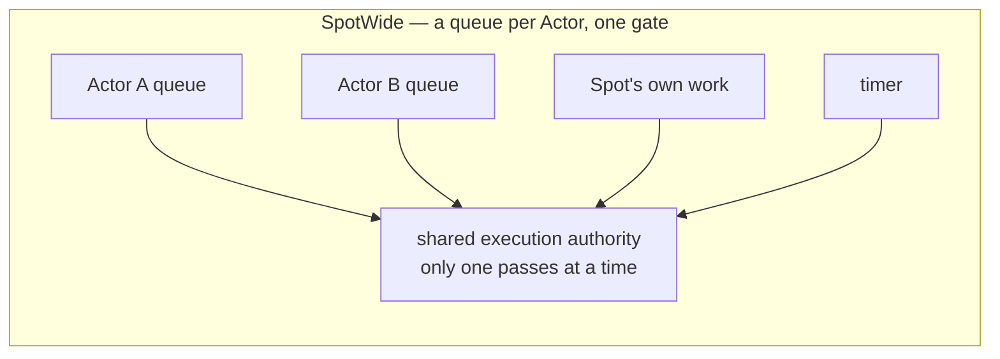
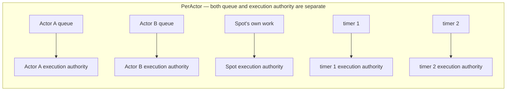
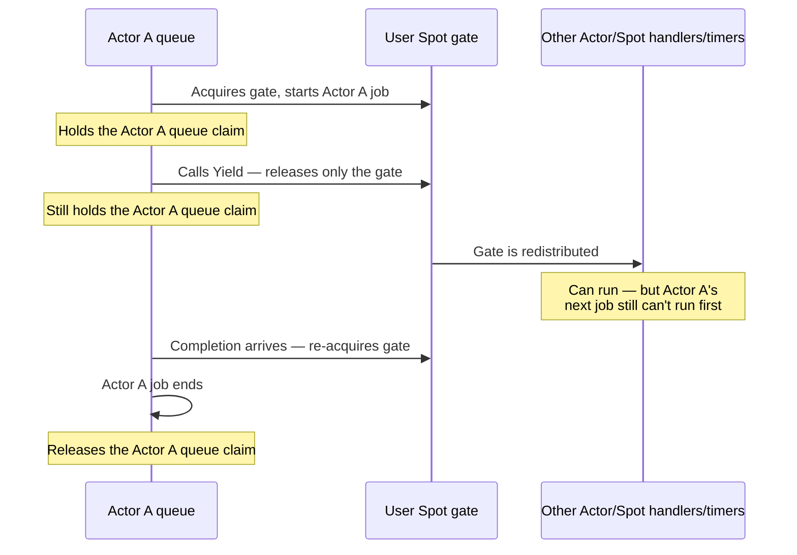
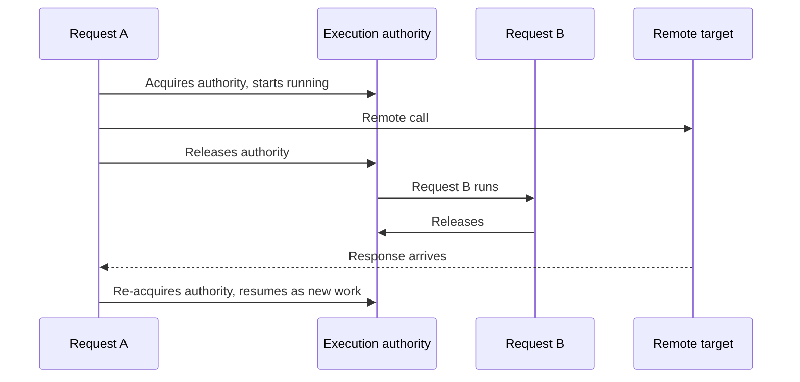
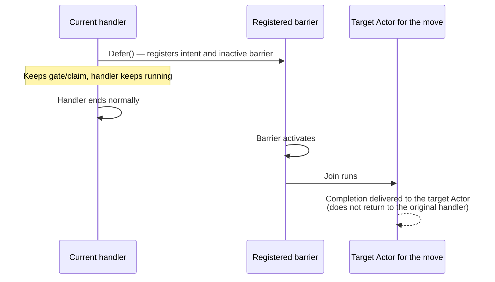

# Handler Turn and Execution Gate

[Execution topic table of contents](README.en.md) · [Spec table of contents](../README.en.md) · [Previous: 01. Submit And Completion](01-submit-and-completion.en.md) · [Next: 03. Cancellation And Shutdown](03-cancellation-and-shutdown.en.md)

> This document defines when a handler runs and when it yields its turn to
> another handler, what `Yield` and `Defer()` each return and each keep, and
> why application execution does not block infrastructure progress. The
> contract is owned by the [Actor model](../03-spot-actor/04-actor-model.en.md) and the
> [Stage wrapper on Spot](../03-spot-actor/07-stage-wrapper-on-spot.en.md); this document
> carries the execution structure that satisfies that contract as rules
> every language runtime must follow.

## 1. Separating Queue from Gate

The runtime's work splits along two axes. One is the split between "where
you line up" (queue) and "who currently holds the right to run" (gate,
execution authority). The other is the split between the application work a
handler runs and the infrastructure work — peer connection, completion
confirmation, relocation — that must progress independently of a handler's
wait. Here, application work refers to handler execution processed by a
[Spot](../00-foundation/02-glossary.en.md#spot) — a logical instance with an
address and state — or by an Actor inside it.

| Domain | What it does | Progress condition |
|---|---|---|
| application | Handler execution, Spot/Actor messages, timer callbacks, session callbacks | Follows the order per Spot owner |
| infrastructure | Peer acceptance, binding operation completion, call completion confirmation, owner information updates, relocation procedures, shutdown procedures | Progresses independently of application waiting |

This table is the place referenced throughout this document. [§13](#13-separating-application-progress-from-infrastructure-progress)
covers the application-side progress rule in detail.

Reserving infrastructure-only slots within the same executor isn't enough
— even if a queue slot remains, there may be no one to run it. So instead
of reservation, the progress domains themselves are separated. Limits with
different purposes (Core byte HWM, the shared supply permit queue an
application callback holds until it starts, the
[Application job queue](../00-foundation/02-glossary.en.md#application-job-queue),
per-owner count/byte queues, the outbound admission waiter) do not merge under this
separation either — even where they share a profile label or unit, they do
not share type, computation, or error meaning.

The separation of queue from gate follows from two different requirements
of the [Actor model](../03-spot-actor/04-actor-model.en.md#3-actor-queue).

- A payload addressed to an Actor is always submitted to that Actor's
  queue, regardless of execution mode.
- In `SpotWide`, the Actor handler, Spot handler, timer, and lifecycle
  callback of that [Spot](../00-foundation/02-glossary.en.md#spot) — the execution unit
  holding several Actors — run only one at a time across the whole Spot.

**Where you line up (queue) is kept per Actor; the authority to run (gate)
is shared by the Spot.**

Missing this structure breaks in the following two ways.

| Wrong structure | Result |
|---|---|
| A queue per Actor, but the execution authority is also per Actor | In `SpotWide`, two Actor handlers of the same Spot run at the same time. The application is touching that Spot's state without synchronization, so it becomes a race condition immediately |
| In `SpotWide`, the queue itself is merged into one | This violates the requirement that a payload addressed to an Actor is always in that Actor's queue. When moving, the remaining work must be split out per Actor, but it's already mixed together and can't be split |

`PerActor` doesn't stop at splitting by Actor and by Spot — it's also per
timer ([Stage Wrapper On Spot 「9. Implementation And Contract-Test
Verification Requirements」](../03-spot-actor/07-stage-wrapper-on-spot.en.md#9-implementation-and-contract-test-verification-requirements)).
Putting two timers together in the same Spot line makes different timers
wait on each other.

## 2. Execution Gate — The Owner's Processing Order

- Node handlers,
  [ChannelName](../00-foundation/02-glossary.en.md#channelname) handlers — the name identifying
  the Channel scope a message is sent to — each Spot, and each Actor process
  application records in the order of the execution gate that applies to
  them.
- A handler waiting on an ordinary async terminal (such as `Async`) does not
  run the next application record on the same gate until the completion
  continuation finishes.
- Waiting with `Yield` on a `SpotWide` User Spot or Instance Spot releases
  the shared Spot turn, so the same Spot's next record can run; the
  completion continuation is placed on the same Spot queue and resumes in a
  new turn.
- Entry Spot Actors and Actors in a `PerActor` User Spot use a per-Actor
  gate and do not offer `Yield`.
- In no case do two application turns on the same execution gate run at the
  same time.

## 3. Gate and Claim on `Yield`

On a `SpotWide` User Spot or Instance Spot, `Yield` is offered only for
Channel/Spot/Actor requests, CPU/I/O workers, and Actor/Spot
create/get-or-create calls. `Yield` for create/get-or-create is not a rule that widens
the naming scope — it is a separate object-execution special case.

| Call kind | `SpotWide` User Spot/Instance Spot | Entry Spot/`PerActor`/Entry Actor/Node/Channel handler |
|---|---|---|
| Channel/Spot/Actor request | Ordinary async terminal or `Yield` | Ordinary async terminal only (no `Yield`) |
| CPU/I/O worker | Ordinary async terminal or `Yield` | Ordinary async terminal only |
| Actor/Spot create/get-or-create | Ordinary async terminal or `Yield` (special case) | Ordinary async terminal only |
| Actor join, send, publish, timer registration, close, destroy | `Yield` not offered | `Yield` not offered |
| Outside owner turn | Not applicable | `InvalidOperation` before submission/queue change |

**When a member Actor of a `SpotWide` User Spot calls `Yield`, only the
shared Spot gate is returned — the Actor queue claim is held.**

- The same Actor's next record does not run, but other member
  Actors/Spot handlers/timers can take the gate and proceed.
- The continuation re-acquires the gate, finishes the current Actor record,
  and only then releases the Actor queue claim.
- A request the Actor sends to itself is not turned into a reentrant call
  or run inline either — the reentrancy-prohibition rule of
  [§6](#6-the-trap-in-acquiring-processing-authority-implementation) applies here as well.
- Mutable state read before waiting may already have been changed by
  another handler, so it must be checked again.

## 4. Waiting and Returning Within the Same Turn

A request sent within the same handler turn can be awaited.

- Because infrastructure work such as reply completion and binding
  operation completion proceeds separately from the application turn, the
  current turn can resume without running the Spot's or Actor's next
  application message. A RouteMesh ROUTER-ROUTER reply reaches this boundary
  through the separate [Completion connection](../00-foundation/02-glossary.en.md#completion-connection). A ClientServer DEALER-ROUTER
  reply is processed as infrastructure work, but can be delayed behind earlier
  DATA, HWM, and `PAUSED` on the single connection.
- This rule holds even when a Channel request's target is a different
  mesh group or ClientServer Channel. The Framework ties the completion of
  the chosen send path to the original Spot activation and generation.
- `Async` keeps running as the pending operation's completion while holding
  the original turn.
- `Yield`, used on a `SpotWide` User Spot or Instance Spot, returns the
  shared Spot turn, then, once completion is decided, places a single
  resume record on the original Spot queue. The reply payload is not
  dispatched as a new Spot packet.

**On resuming after release, it resumes as new work.** One piece of work is
not kept alive across the wait span.

Only the normal path is drawn. If the Spot shuts down while waiting to
resume, or the unit gets sealed for a move, it ends in failure instead of
resuming. A move merely starting isn't enough to stop it — existing
messages and timers keep being processed until sealing
([Stage Wrapper On Spot 「5. Timer」](../03-spot-actor/07-stage-wrapper-on-spot.en.md#5-timer-and-yield)).

"One piece of work goes from start to finish uninterrupted" is not a
guarantee. The only guarantee is "two pieces of work never run
concurrently in one execution authority." Code straddling a release point
cannot assume a value read before release is still valid after resuming —
another request to the same Spot may have changed the state in between.
This constraint affects the handler author, not the implementation.

Release can only be used on a `SpotWide` User Spot or Instance Spot.
Calling it anywhere else ends in failure before the remote request goes
out, before the queue changes. If it fails after the request has gone out,
only a side effect is left remotely and the caller receives a failure.

## 5. Actor Join and the `Defer()` Completion Boundary

Actor Join is not subject to Messaging/Worker terminator naming. Inside a
handler, a synchronous `Defer()` is called once to register a barrier that
runs after the handler terminal.

### The Nature of `Defer()`

`Defer()` is not an API that starts an async operation immediately. It is a
synchronous terminal that registers an intent and an inactive queue barrier
to run the Join after the current handler ends normally. In every language
it is an ordinary function with no result, and does not return an
awaitable, promise, or coroutine. It does not start target I/O, and does
not release the Spot gate or the Actor FIFO claim.

### The Difference Between `Defer()` and `Yield`

| Function | What it does when called | Current execution right |
|---|---|---|
| `Yield` | Submits an async operation and releases the shared Spot gate while waiting for the result | Keeps the Actor queue claim but releases the permitted `SpotWide` gate |
| `Defer()` | Registers only the Join intent and an inactive barrier on the current handler, with no target lookup or Store I/O | Keeps both the Spot gate and the Actor claim, and keeps running the current handler |

If a SpotWide handler already called `Yield` first, the barrier terminal is
the point where the continuation re-acquires the gate and finally ends. The
existing rule prohibiting `Yield` on `PerActor` and Entry does not change
either. The Join call is not offered an ordinary async terminal, `Yield`,
or a one-way terminal.

### Barrier Activation and Disposal

- A handler may register a Join before `Yield`, or in a continuation after
  `Yield`.
- Even then, the barrier is activated only at the point where the last
  awaited continuation ends normally.
- If the handler ends in an exception, cancellation, or a reply-encoding
  failure, every inactive barrier that handler registered is discarded.
- The Join result is not returned as a value that resumes the original
  handler — it is delivered as a completion callback to the Actor being
  moved.

### Where It Can Be Called

The Framework allows `Defer()` only inside the registration scope a
handler has open. Calling it after the scope closes raises
`InvalidOperation`. Calling it from a detached task the handler started but
did not await is an application-contract violation, and the Framework does
not guarantee that this misuse is caught, in every language, before the
scope closes.

### When It Completes

One-way terminals and `Defer()` are both single-use, but their completion
timing differs.

- A one-way terminal waits for source-local outbound admission.
- `Defer()` returns immediately once local registration validation
  finishes.
- Registration errors, such as an invalid execution context or an exceeded
  limit, occur synchronously, before target I/O.
- Failure to find the target, insufficient capacity, relocation policy, and
  callback failure are delivered as an Actor completion after the handler
  ends.

Actor Join is not subject to the terminator naming of
[01. Submit And Completion](01-submit-and-completion.en.md) — this section
owns the completion boundary.

## 6. The Trap in Acquiring Processing Authority (Implementation)

Execution authority can be built either by chaining the next work to the
completion of the previous one, or with a lock and a queue. Use whichever
fits the language. But each implementation approach comes with its own
constraints.

**Acquiring it also acquires exclusivity.** Only one processing
authority per owner exists at a time. Each processing authority is given a
non-reusable number used to decide whether a late completion belongs to
it — this fencing number is an internal confirmation condition.

**Handing work off between threads rules out thread-bound storage.**
Execution authority can guarantee "only one at a time" while not fixing
which thread it runs on. In this case, two consecutive pieces of work run
on different threads, so any state placed in thread-bound storage between
the two pieces of work disappears. The approach itself isn't a problem —
porting code that assumes a fixed thread and stores context in
thread-local storage makes the context disappear when the next work item
runs on another thread.

**Running in place when the queue is full is not an option.** Running work
in place instead of reporting a submission failure makes it run
concurrently with work already in progress, which erases the premise of
serial execution entirely. The result is split by submission family, which
runtime the queue lives in, and whether the call's public result has
already been finalized ([Spot Messaging 「5.3 Work Put On The Spot
Application Queue」](../03-spot-actor/02-spot-messaging.en.md#53-work-put-on-the-spot-application-queue)
owns this criterion).

| Family | Queue location | Result |
|---|---|---|
| Send/one-way | Same runtime | Waits until the send timeout. If even the internal waiting slot is full, it fails with [`DeadlineExceeded`](../00-foundation/02-glossary.en.md#deadlineexceeded), the Framework exception raised when an operation's completion condition isn't met by its deadline |
| Send/one-way | Different node | There's no result. It has already completed, so it only shows up as an observation |
| Publish (before start) | Same runtime | Waits. If it can't secure a slot, `DeadlineExceeded` |
| Publish (after start) | Local target in the same runtime | Skips without waiting. It has already completed |
| Request | Same runtime | Doesn't wait; `CapacityExceeded` |
| Request | Different node | Doesn't wait; `Unavailable` |
| Control claim | Same runtime | A separate bound. Exceeding it gives `CapacityExceeded` |
| Control claim | Different node | `Unavailable` |
| Send-side backpressure | — | Core waits and completes the binding operation. The Framework has no send-ready waiter |

The criterion that distinguishes waiting from finishing immediately is whether the
caller can receive a result and judge from it. A Request can receive one,
so it doesn't wait; the send family can't receive one, so it waits. Running
in place is never an option, in any case.

**Don't open a cut-in path at the front of the queue.** If there's work
that must be handled first, add another queue and state the priority
explicitly. The specific bounds and priority rules for the two FIFO lanes kept
per owner are owned by
[§7](#7-lane-separation-and-priority-implementation).

**Do not allow reentrancy.** Running right there without going through the
queue when execution is already in progress within that authority can
avoid a deadlock from a call waiting on itself, but this is an observable
difference in meaning — allowing reentrancy lets a nested call run as part
of the current work and finish before other work already in the queue. A
call that keeps the current turn while waiting for a result that requires
the same gate, or an Actor waiting for a request it sent to itself, is
rejected with `InvalidOperation` before submission. An eligible call on a
`SpotWide` User Spot or Instance Spot that selects `Yield` first releases
the current shared gate, so this is not reentrancy.

The prohibition applies to public operations. The following table
distinguishes exactly which are prohibited.

| Call | Verdict |
|---|---|
| A handler sends a public request to its own Actor and waits for the result | Prohibited. The Actor queue claim remains held even after `Yield`, so `InvalidOperation` before submission |
| A handler uses a terminal that keeps the current turn while waiting on its own Spot or another target that requires the same gate | Prohibited. `InvalidOperation` before submission |
| An eligible `SpotWide`/Instance context waits with `Yield` on a request or Actor/Spot create/get-or-create call | Allowed. Releases the shared gate and resumes in a new turn at the back of the queue |
| The runtime internally composes an execution context to run a handler | Allowed. This isn't a submission of new work |
| A handler submits work to its own target without waiting for the result | Allowed. It's appended to the back of the queue |

"Before submission" matters. If it fails after the request has gone out,
only a side effect is left remotely and the caller receives a failure.

## 7. Lane Separation and Priority (Implementation)

Keep **two FIFO lanes** per owner.

| Lane | Holds | Bound |
|---|---|---|
| application lane | Business payload, timer callback | Two axes: count and bytes |
| lifecycle lane | join/leave/relocation/lifecycle control | A separate bound not shared with the application lane |

The default admission limits are 1,024 items and 64 MiB for the application
lane, and 128 items and 4 MiB for the lifecycle lane. An application work
item's byte reservation includes its payload and a fixed retained cost of
256 bytes per item. In both lanes, a work item keeps its reservation after
leaving the queue and while it is running; the reservation is returned only
at handler terminal completion.

At a turn boundary, which lane to run is decided by a single atomic
judgment. If both are ready, the lifecycle lane goes first.

**Priority alone doesn't prevent starvation.** Two different ceilings are
involved here.

| Ceiling | Fairness between what | Unit counted |
|---|---|---|
| owner occupancy bound | Between different owners | Time |
| lifecycle consecutive-execution bound | Between the two lanes of the same owner | Number of consecutive turns in which the lifecycle lane was picked |

The default owner-occupancy time budget is 10 ms, and the lifecycle lane
may be selected for at most 8 consecutive turns. The time budget is
checked at the boundary after one handler finishes — whether this time
budget and [§9](#9-time-budget-and-batch-processing-implementation)'s
owner occupancy budget point to the same mechanism is not stated in the
text and remains a spec-gap candidate (see the ledger).

Even if a turn is given up due to hitting the owner occupancy bound, if
both lanes are still ready when this owner's turn comes back around, the
same priority rule picks lifecycle again. So a **yield debt** is kept —
when the lifecycle lane's consecutive selection hits its bound, a debt is
marked on that owner, and while the debt exists, lifecycle isn't picked
until one application turn has run, as long as the application lane is
ready. Running it clears the debt. The marking of the debt itself is an
internal confirmation condition.

With this rule, even if lifecycle work keeps arriving without a break, an
application turn eventually gets picked at the handler boundary. The 10 ms
value does not interrupt a running handler. One handler may run longer
than 10 ms, so this rule does not guarantee a maximum wait time for an
application turn.

The order within each lane is exactly the order accepted. Neither lane has
front insertion.

The two lanes exist per owner as physically distinct FIFOs and do not
share count/byte reservation or admission state with each other.
Already-accepted lifecycle work can still be enqueued and run even when
the application FIFO is full.

## 8. Cleanup and the Turn Boundary (Implementation)

Deferred post-processing can overlap the next turn when it runs in the
following order after work finishes.

1. Clear the in-progress mark.
2. If anything remains in the queue, schedule the next run.
3. Release the lock.
4. After that, run the deferred post-processing.

The next work scheduled at step 2 can run concurrently with the
post-processing at step 4. If the post-processing touches that owner's
state, seriality breaks.

**Post-processing must finish before releasing execution authority, or be
put back on the queue as new work.** Post-processing that runs outside the
authority is only allowed to avoid touching that owner's state.

## 9. Time Budget and Batch Processing (Implementation)

Once processing authority is taken, several items are processed in a row
within a fixed time budget. After finishing each item, the budget is checked;
if it remains, the next item is processed, otherwise authority is
released.

- Measured by time, not item count, because per-handler processing time
  differs.
- A running handler is not interrupted.
- A byte total is used only as a proxy — meaningful only when processing
  time is roughly proportional to payload size.

Whether this time budget is the same mechanism as
[§7](#7-lane-separation-and-priority-implementation)'s owner occupancy
bound (default 10 ms), and whether the same value applies even where each
execution unit already has a separated gate, as in `PerActor`, remains a
spec-gap candidate.

## 10. Execution Resources Do Not Scale with the Number of Spots (Implementation)

**Execution resources are proportional to core count, not Spot count.** How
execution authority is built is free, but attaching a dedicated execution
resource per authority is not allowed. Two workers per Spot require 20,000
workers for 10,000 Spots. Using two only masks the structural problem of a
returned task waiting on the same worker — the problem of resource count
being proportional to Spot count remains.

Splitting only the authority over shared execution resources doesn't have
this problem. Authority is "the right to run this owner's work right now,"
and which resource runs the work holding that right is a separate matter.
The problem of a return-wait waiting on itself isn't solved by adding more
resources, but by putting the returned work back onto the queue of the
same authority.

**Resources are allocated per process, and don't grow with topology or
Spot count.** Infrastructure work is mostly short and non-blocking, so it's
covered by fewer resources than application work.

**The contract is not "a dedicated thread" but "infrastructure progresses
whenever application is entirely waiting."** This is because the four
languages' execution models differ.

| Language | Execution resource | How dedication is satisfied |
|---|---|---|
| C++ | OS worker pool | Keeps a dedicated worker for infrastructure |
| .NET | Serial drain over a thread pool | Submits infrastructure work to a separate lane |
| Java | Virtual thread per task | Attaches the infrastructure lane to a separate executor |
| Node | A single event loop | Physical separation is impossible. Only the lane is separated |

Node can't physically build a dedicated resource since it has a single
event loop. So the contract is split as follows.

- **Guaranteed** — after an application handler yields, infrastructure
  work progresses. This holds even when every application work item is
  waiting for a result.
- **Not guaranteed** — progress while an application handler holds the CPU
  without yielding. This isn't a contract violation but the application's
  own responsibility. The guidance is to move a long-running synchronous
  computation to a worker.

`Task`, `Promise`, and virtual thread are all recognized as execution
resources under this contract. The criterion isn't the data type but
**whether it progresses after yielding.**

## 11. Making the Two Synchronization Points Cheap (Implementation)

In `SpotWide`, an Actor message passes through two points — enqueuing onto
the Actor queue, and acquiring the shared authority. Neither point can be
eliminated, so the cost is lowered instead.

**Don't put an independent lock on the Actor queue.** In `SpotWide`, only
one thing runs at a time anyway, so the dequeuing side already holds the
authority. Only the enqueuing side needs protection.

**Make uncontended authority acquisition finish in a single atomic
operation.** If no work is currently running, acquiring authority is just
flipping one mark. Only under contention does it go into a queue.

Without these two, every message acquires a lock twice. For a frequently
used Spot, this lock cost determines the throughput ceiling.

## 12. Cache Cost When Handing Off Execution (Implementation)

The hand-off approach ([§6](#6-the-trap-in-acquiring-processing-authority-implementation))
has no correctness problem, but it has a cost. When two consecutive pieces
of work run on different execution resources, that Spot's state is left
only in the cache of the previous resource. If one Spot handles thousands
of operations per second, the cache-miss cost accumulates.

| Approach | State cache | Resource utilization |
|---|---|---|
| Hand off | Can be lost per work item | Used evenly across resources |
| Pinned to one resource | Retained | A hot Spot piles onto one resource |

**Per-language discretion.** Whether to pin to one execution resource is
constrained by the language — a language that runs on a single event loop
has no room to choose. Both satisfy the contract, so either is fine, but it
must not be picked by taste — in a language where you can choose, if hot
Spots are few and throughput matters, pinning is chosen. The check
criterion is that the observable execution order and completion meaning
are the same across both approaches, and the confirmation criterion is
whether that language's documentation records which one was chosen — the
first value to check when comparing performance.

## 13. Separating Application Progress from Infrastructure Progress

Each language's service runtime advances the application domain and the
infrastructure domain independently, as in the table in
[§1](#1-separating-queue-from-gate).

- Payload decoding, user callbacks, and exception mapping are handled on
  the application turn.
- RouteMesh request completion and bounded liveness/admission/relocation/reply
  recovery service control arrive on the ROUTER-ROUTER Completion connection.
  ClientServer request completion arrives after Core identifies a reply on the
  DEALER-ROUTER single Application connection. Core HWM retry results arrive as
  the per-binding-operation completion and are distinct from the Framework
  service-wire `SendReady` record.
- Peer connection state changes and the shutdown barrier are also handled
  on infrastructure tasks.
- Infrastructure tasks must be able to proceed even while an application
  handler is waiting.
- Jobs that invoke user callbacks, such as Actor/Spot lifecycle, are
  counted as part of the application turn.

The two domains are separated per owner as physically distinct FIFOs — the
specific bounds and priority rules are owned by
[§7](#7-lane-separation-and-priority-implementation).

**A context marker confirms which region is currently executing, and an
invalid combination fails without waiting.** If an
infrastructure-only work item is called from an application context, or the
reverse, the point of splitting the two regions disappears — treating it as
a wait would deadlock, and letting it pass through would break the
separation, so failure is correct.

Tying this marker only to a thread kind
cannot represent Node's single event loop or a .NET path running over a
thread pool. The execution mechanism differs by language, but a call from
the wrong region must fail the same way, without waiting, in every
runtime.

The context marker itself and its enforcement are internal
confirmation conditions.

A status subscriber or metric collector does not hold the progress
authority of either region. If a slow subscriber slowed down message
processing, turning on observation would slow the service down. The slot
for sending to a subscriber has a bound, and on overflow, entries are
coalesced into the latest status per source to catch up. A full slot does
not cut the stream, and conversely, it does not slow down message
processing either ([Runtime State And Operational Diagnostics 「3. Querying
Current State And Observing Changes」](../06-observability/01-runtime-monitoring.en.md)).

## 14. Object Placement and Activation

Object placement and activation follow these rules:

- They are handled on infrastructure tasks.
- Only the owner that the
  [Location Store](../00-foundation/02-glossary.en.md#location-store) reservation confirms —
  the store that lets multiple nodes check each Spot's current owner — runs the
  [factory](../00-foundation/02-glossary.en.md#factory).
- AuthorityOwnerGeneration and the owner lease are used only for Store and
  runtime fencing.
- ObjectGeneration is also used for public refs, for mutation scoped to
  that one incarnation, and for session bind.

Instance cold activation follows this order.

1. Finalize the durable inbox's first record.
2. Commit [`Ready`](../00-foundation/02-glossary.en.md#ready) — the state where object
   creation and initialization and the Location Store record are finished, so it can
   receive application messages — which includes the recovery root and cursor.
3. Apply the admission deadline computed from the lease of the
   [Owner](../00-foundation/02-glossary.en.md#owner) — the MeshNode that currently runs the
   Actor or Spot — to restore the first record to the local queue head.
4. Open the Framework activation barrier.

## 15. Error Handling

When a handler returns an exception, the send handler records it through
the application's logger/telemetry provider and metrics. A request handler
generates the same request's framework error reply. Provider failure does
not change the original dispatch result, and no separate public error
observer is provided.

## 16. Verification Requirements

The following are confirmed only through observable side effects — `Yield`
and `Defer()` operations and their error (`InvalidOperation`), the Actor
Join completion callback, handler execution order — and observable
application/infrastructure progress events — timeout, shutdown, peer
acceptance. Conditions confirmable only through internal structure
(fencing numbers, the yield-debt mark, the FIFO wakeup mechanism,
non-use of thread-local, lock count, independence of execution resources
from Spot count) are owned by each rule paragraph as an "internal
confirmation condition" and are not listed here.

**Yield and Reentrancy**

- Calls that allow `Yield` in a `SpotWide` context, and calls for which it is
  not offered, are split as in the table in
  [§3](#3-gate-and-claim-on-yield).
- After a `SpotWide` member Actor calls `Yield`, the same Actor's next
  record does not run first, while other Actor/Spot handlers/timers do
  run.
- A call that waits on itself within the same execution authority (an
  Actor sends a request to itself and waits, a current-turn terminal
  waits on the same gate) ends in `InvalidOperation` before submission.
- A call that waited with `Yield` in an eligible context resumes, after
  completion, in a new turn at the back of the original queue.

**Actor Join and `Defer()`**

- `Defer()` returns as a synchronous function with no result, and does not
  start target I/O until the handler ends normally.
- If the handler ends in exception, cancellation, or reply-encoding
  failure, every barrier that handler registered is discarded and Join
  does not run.
- The Join result is delivered to the target Actor's completion callback,
  not to the original handler.
- Calling `Defer()` after the registration scope has closed ends in
  `InvalidOperation`.

**Handler Order and Lane**

- In a `SpotWide` Spot, two handlers of different Actors never run at the
  same time; in a `PerActor` Spot, handlers of different Actors run at the
  same time.
- In a `SpotWide` Spot, a timer callback never runs at the same time as a
  handler; in a `PerActor` Spot, callbacks of different timers run at the
  same time.
- An Actor payload is submitted to that Actor's queue regardless of
  execution mode.
- Work submitted while the queue is full does not run in place and
  completes as in the table in
  [§6](#6-the-trap-in-acquiring-processing-authority-implementation).
- Lifecycle lane work does not count against the application lane's bound,
  and when both lanes are ready, the lifecycle lane
  runs first.
- Even if lifecycle work keeps arriving without a break, an application
  turn runs within finite time.
- Submitting a large volume of empty payloads still hits the count bound.
- Post-processing does not overlap the execution of the next work item and
  does not change owner state twice.

**Application and Infrastructure Progress**

- With an application handler kept waiting, that call's timeout fires.
- With an application handler kept waiting, the shutdown procedure
  progresses.
- With an application handler kept waiting, a new peer connection is
  accepted.
- A slow status subscriber does not slow down message processing speed.
- Even while RouteMesh application handlers and the Application Job Queue are
  `PAUSED`, a reply for an already-started cross-node request completes through
  the ROUTER-ROUTER Completion connection.
- In ClientServer, if the Client doesn't process earlier one-way DATA, the
  reply on the same DEALER-ROUTER connection can be delayed until request
  timeout completes first; the late reply doesn't create a second terminal.

---

[Execution topic table of contents](README.en.md) · [Spec table of contents](../README.en.md) · [Previous: 01. Submit And Completion](01-submit-and-completion.en.md) · [Next: 03. Cancellation And Shutdown](03-cancellation-and-shutdown.en.md)
