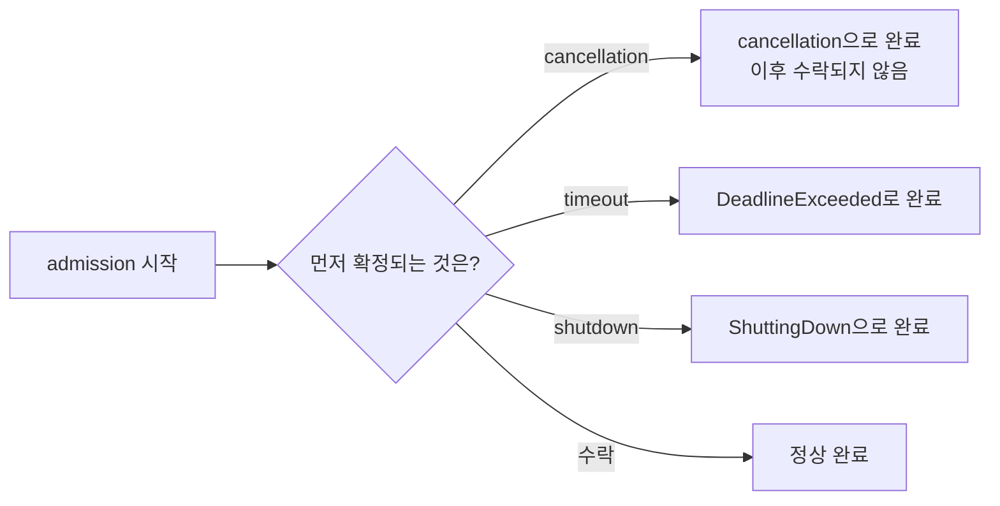
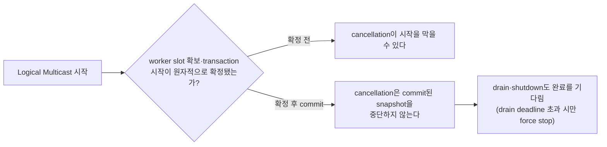
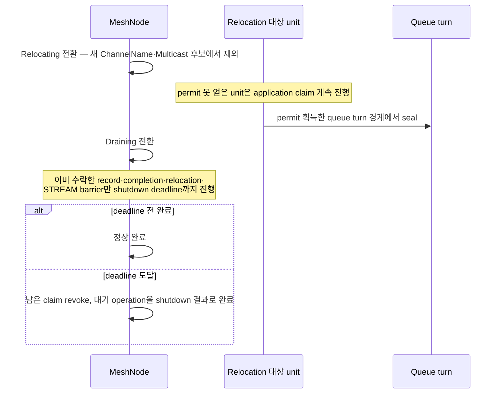

# Cancellation과 shutdown

[Execution 주제 목차](README.ko.md) · [스펙 목차](../README.ko.md) · [이전: 02. Handler turn과 execution gate](02-handler-turn-and-execution-gate.ko.md) · [다음: 04. Application job queue와 backpressure](04-application-job-queue-and-backpressure.ko.md)

> 이 문서는 cancellation이 이미 수락한 작업에 무엇을 할 수 있고 무엇을 할 수 없는지,
> cancellation·timeout·shutdown·수락이 동시에 일어날 때 무엇이 이기는지, 그리고
> MeshNode가 `Relocating`·`Draining`으로 전환될 때 진행 중인 operation을 어떻게
> 정리하는지 정의한다. Call이 완료되는 자리와 그 완료를 확정하는 구조는
> [Submit과 completion](01-submit-and-completion.ko.md)이 소유하고, handler 실행
> 순서와 gate 반납은 [Handler turn과 execution gate](02-handler-turn-and-execution-gate.ko.md)가
> 소유한다.

## 1. 협력적 cancellation

- Cancellation은 협력적 요청이다.
- 이미 완료된 결과를 cancellation으로 바꾸지 않으며, 이미 수락한 one-way 메시지의
  전달을 취소하지 않는다.
- 언어별 표면은 `.NET` `CancellationToken`, Java
  `CompletionStage.toCompletableFuture().cancel(false)`, Kotlin coroutine
  cancellation, Node.js `AbortSignal`을 사용한다.
- Java Framework가 반환한 stage의 `toCompletableFuture()`는 원본 pending admission의
  cancellation과 cleanup에 연결된다.
- C++ one-way `async()` terminal은 별도 public cancellation 입력을 제공하지 않는다.
- C++ task를 사용하지 않거나 Java stage를 단순히 보관하지 않는 것만으로 operation이
  취소됐다고 보장하지 않는다.

## 2. Pre-cancelled call

Call이 pre-cancelled 상태로 도착했을 때의 규칙은 다음과 같다.

- Call은 argument, handle과 one-shot state를 먼저 검증한다.
- `.NET`의 pre-cancelled `CancellationToken`과 Node.js의 이미 abort된 `AbortSignal`은
  유효한 call의 runtime admission을 시작하지 않고 해당 언어의 cancelled awaitable로
  완료한다.
- Java와 Kotlin의 submit에는 cancellation 입력이 없다.
- 유효한 일반 JVM call은 첫 non-blocking admission 시도를 마친 뒤 stage를 caller에게
  반환하므로, caller가 stage를 받은 뒤 실행하는 Java `cancel(false)`나 그 stage를
  기다리는 Kotlin coroutine cancellation은 첫 시도를 취소할 수 없다.
- Operation이 pending 상태이면 이 cancellation이 binding completion과 경쟁하고 queue
  reservation과 payload reservation을 정리한다.
- 따라서 JVM 경로는 pre-cancellation에 따른 transport attempt 0을 보장하지 않는다.

| 언어 | cancellation 입력 | 첫 admission 시도 취소 가능 여부 |
|---|---|---|
| .NET | `CancellationToken` | pre-cancelled token은 runtime admission을 시작하지 않는다 |
| Node.js | `AbortSignal` | 이미 abort된 signal은 cancelled awaitable로 즉시 완료한다 |
| Java | `CompletionStage.toCompletableFuture().cancel(false)` | 없음 — stage는 첫 non-blocking 시도 뒤에만 반환되므로 그 시도는 취소 불가 |
| Kotlin | 연결된 stage의 coroutine cancellation | 없음 — Java와 같은 이유 |
| C++ | 별도 public cancellation 입력 없음 | 해당 없음 — task 미사용만으로 취소를 보장하지 않는다 |

## 3. Cancellation의 경쟁 처리

- Cancellation은 exceptional completion이다.
- Admission을 시작한 뒤 cancellation, timeout, shutdown과 수락이 경쟁하면 원자
  terminal state를 먼저 확정한 하나만 call을 완료한다. 이 완료 자리 하나를 두고
  경쟁하는 구조 자체는
  [Submit과 completion 「10. Operation identity와 완료 자리」](01-submit-and-completion.ko.md#10-operation-identity와-완료-자리-구현)가
  정의한다.
- 취소된 pending admission은 나중에 수락되면 안 된다.
- ChannelName과 topic으로 같은 Channel의 여러
  [Spot](../00-foundation/02-glossary.ko.md#spot) — 주소와 상태를 가진 논리 instance —
  에 message 하나를 전달하는 방식인
  [Logical Multicast](../00-foundation/02-glossary.ko.md#logical-multicast) cancellation은 아래
  §4의 bounded I/O executor 제출과 commit 경계를 따른다.

## 4. Logical Multicast cancellation

Logical Multicast cancellation의 bounded I/O executor 제출과 commit 경계 규칙은 다음과
같다. Framework service runtime은 publish operation을 [bounded I/O
executor](../00-foundation/04-interaction-model.ko.md#5-spot-logical-multicast)에
제출하며, 이 executor가 worker slot을 확보해 publish transaction을 시작한다.

- Cancellation은 executor가 worker slot을 확보하는 것과 publish transaction이 시작되는
  것이 원자적으로 함께 확정되기 전까지만 operation 시작을 막을 수 있다. 그 뒤로는 막을
  수 없다.
- Publish transaction이 시작된 뒤의 cancellation은 commit된 snapshot operation을
  중단하지 않으며 target별 관측 정보를 반환하거나 publish 전용 monitoring 값으로
  만들지 않는다.
- `.NET` `ValueTask`와 Node.js `Promise`는 commit 뒤 cancellation 신호로 완료를 바꾸지
  않는다.
- Java stage의 `cancel(false)`와 Kotlin의 연결된 stage cancellation은 `false`를
  반환하고 underlying operation을 취소하지 않는다.
- Kotlin에서는 이미 취소된 caller coroutine이 cancellation 상태를 유지하지만 공유
  `CompletionStage`와 runtime operation evidence는 최종 normal completion과 monitoring
  event를 기록한다. 이는 operation cancellation이 아니다.
- Drain·shutdown도 시작된 transaction의 완료를 기다리며, host drain deadline을 넘긴
  경우에만 전체 runtime의 bounded force stop 규칙을 따른다.

## 5. MeshNode relocation과 drain

- RouteMesh에 참여해 message를 보내거나 받는 runtime node인
  [MeshNode](../00-foundation/02-glossary.ko.md#meshnode)가 `Relocating`으로 전환되면 새
  [ChannelName](../00-foundation/02-glossary.ko.md#channelname) — message를 보낼 Channel 범위를
  식별하는 이름 — 선택과 Logical Multicast target에서 제외된다.
- Relocation permit을 얻지 못한 unit의 application claim은 계속 진행하고, permit을
  얻은 queue turn 경계에서만 해당 unit을 seal한다.
- `Draining` 뒤에는 이미 수락한 application record, request completion, Actor
  relocation과 STREAM barrier만 shutdown deadline까지 진행한다.
- 작업을 끝내야 하는 마지막 시점인 [Deadline](../00-foundation/02-glossary.ko.md#deadline) 뒤에는
  남은 claim을 회수하고 대기 중인 operation을 shutdown 결과로 완료한다.

Draining MeshNode는 새 object placement 후보에서도 제외된다.

Pending activation은
[drain deadline](../00-foundation/02-glossary.ko.md#drain-deadline)과 Framework activation
deadline 가운데 먼저 도달한 경계에서 request를 한 번 terminal 완료하고 one-way
payload를 drop 처리한다.

Cancellation, timeout, shutdown과 activation barrier
개방이 경쟁해도 pending operation과 payload reservation을 한 번만 정리한다.

## 6. 검증 요구

공개 표면(각 언어의 cancellation 입력, 반환된 완료 결과·오류 kind, Logical Multicast의
public terminal, MeshNode 상태 전환이 관찰되는 placement·routing 결과)만으로 다음을
확인한다. 각 항목은 test 하나로 이어진다.

**협력적 cancellation**

- 이미 완료된 call에 cancellation을 요청해도 완료 결과가 바뀌지 않는다.
- 이미 수락한 one-way message는 cancellation 요청 뒤에도 전달된다.
- Pre-cancelled `.NET` `CancellationToken`이나 이미 abort된 Node.js `AbortSignal`로
  만든 call은 runtime admission을 시작하지 않고 cancelled awaitable로 완료한다.
- JVM에서 stage 반환 뒤 `cancel(false)`를 호출해도 이미 시작한 첫 admission 시도는
  취소되지 않는다.

**경쟁 처리**

- Admission 시작 뒤 cancellation·timeout·shutdown·수락이 동시에 일어나도 call은
  정확히 하나의 terminal 결과로 완료된다.
- Cancellation으로 완료된 pending admission은 이후 수락된 결과로 다시 바뀌지 않는다.

**Logical Multicast cancellation**

- Publish transaction이 commit되기 전 cancellation은 operation 시작을 막을 수 있다.
- Transaction이 commit된 뒤에는 `.NET`·Node.js·Java·Kotlin 모두 cancellation 신호로
  완료를 바꾸지 않고, target별 개별 결과도 public 값으로 노출하지 않는다.

**Relocation과 drain**

- `Relocating`으로 전환된 MeshNode는 이후 새 ChannelName 선택과 Logical Multicast
  target 후보에서 제외된다.
- `Draining` 전환 뒤 이미 수락한 record와 completion은 shutdown deadline까지 진행되고,
  deadline을 넘긴 대기 operation은 shutdown 결과로 완료된다.
- Draining MeshNode는 새 object placement 후보에서 제외된다.
- Drain deadline과 activation deadline이 경쟁해도 pending activation은 한 번만
  terminal 완료된다.

---

[Execution 주제 목차](README.ko.md) · [스펙 목차](../README.ko.md) · [이전: 02. Handler turn과 execution gate](02-handler-turn-and-execution-gate.ko.md) · [다음: 04. Application job queue와 backpressure](04-application-job-queue-and-backpressure.ko.md)
