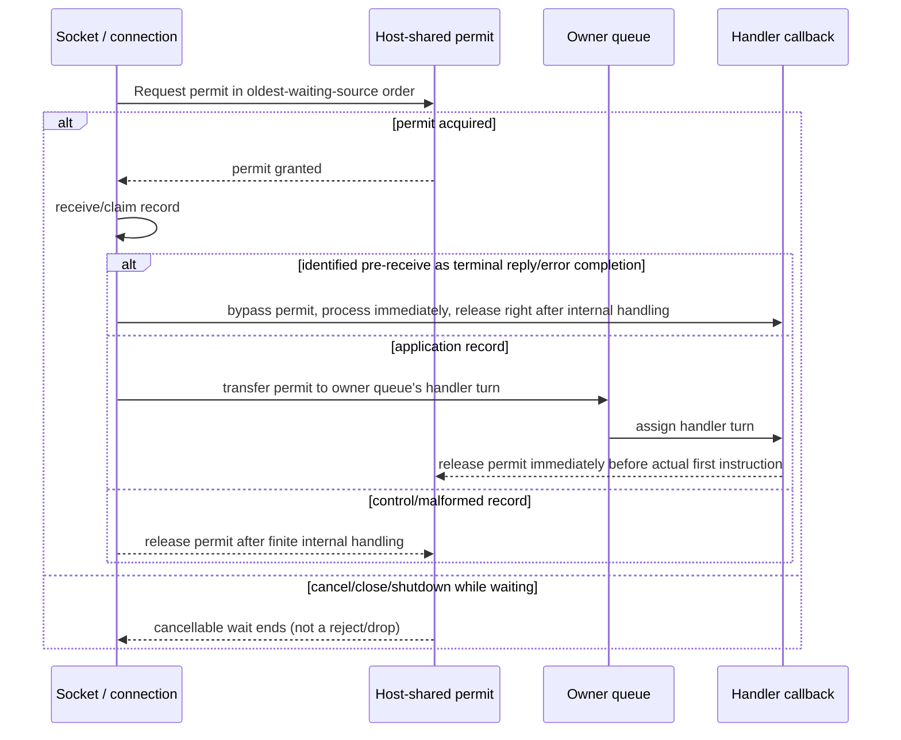

# Application Job Queue and Backpressure

[Execution topic table of contents](README.en.md) · [Spec table of contents](../README.en.md) · [Previous: 03. Cancellation and Shutdown](03-cancellation-and-shutdown.en.md) · [Next: 05. Payload Ownership and Codec](05-payload-ownership-and-codec.en.md)

> This document defines the order in which ordinary ingress passes through two independent
> capacity authorities — Core's [Core byte HWM budget](../00-foundation/02-glossary.en.md#core-hwm-budget)
> and Framework's [Application job queue](../00-foundation/02-glossary.en.md#application-job-queue) —
> and when and how Framework observes and propagates the resulting pressure state. It states
> the responsibility boundary among Application, Core, Framework host, and provider as a
> contract that callers depend on, together with the common implementation structure that
> every language runtime must satisfy.

## 1. Two Independent Capacity Authorities

Core and Framework observe different overloads.

- Core knows the frame bytes currently held by transport queues and limits queue-memory
  bursts caused by connection count and payload size.
- Framework knows how many application jobs are waiting before handler start and limits
  ingress that exceeds application processing capacity.

- **Core byte HWM and the Application job queue do not share settings, profiles, units,
  accounting boundaries, or observations.** Copying one authority's values into the other
  authority's counter creates overlapping responsibility — Core must not infer handler
  processing capacity, and Framework must not calculate socket-queue bytes.
- **Core byte HWM is the transport path's last safety boundary, and the Application job
  queue is the safety boundary for handler ingress speed — both are required, but they
  are not the same protection.** Even when Framework pressure reduces remote traffic
  early, data can already be present in the remote Core queue, OS buffers, the network,
  and the local Core queue. Conversely, a Core queue can be empty while a handler job
  waits for a long time.

| Authority | What it limits | Accounting or acquisition | Release |
|---|---|---|---|
| Core byte HWM | Physical-frame charge currently owned by a Core application-direction queue | When the Core queue owns a frame | When the Core queue gives up frame ownership, including receive dequeue |
| Application job queue | Application job permits accepted by a host before callback start | Reserve immediately before receiving or claiming ordinary ingress, then transfer to a handler turn | Immediately before the callback's actual first instruction, or at a pre-callback terminal |

- **Core byte HWM charge includes the payload and metadata bytes defined by the
  contract, and once the Core queue hands a record to the binding, that record's charge
  ends.** Framework does not request a retained-credit lease or extend Core byte charge
  through handler or reply lifetime.
- Post-receive payload storage follows the ordinary message-ownership rules in [Payload
  Ownership And Codec](05-payload-ownership-and-codec.en.md). Copying, moving, and
  releasing that storage is payload lifetime management; it is not Core byte HWM credit,
  a second Application job queue permit, or a separate byte-pressure authority.

Framework pressure count (permits in use) is the following value:

```text
application job permits in use
  = reserved supply permits
  + queued application jobs
```

A capacity waiter has not received a permit and is not included. Converting a
reservation to a queued job does not change the total; only returning the permit
decreases it. A record that creates 1:N callbacks uses one permit for each actual
callback turn.

## 2. Configuration and Profile Boundary

Core and Framework profiles may use the same labels, but they are different public
types with different calculations.

| Setting group | Owner | Default profile | Manual override |
|---|---|---|---|
| `CoreHwmMemoryLimitBytes`, `CoreHwmBudgetBytes`, `CoreHwmProfile` | Core | `Balanced` | Core memory or budget bytes |
| `ApplicationJobQueueProfile`, `MaxQueuedApplicationJobs` | Framework host | `Balanced` | A precise host job-permit limit |

- **Framework only passes Core configuration values to binding context options at
  startup; it does not calculate profile ratios or divide a budget by connection
  count.** Projecting a Core snapshot into Framework status is also read-only
  observation and is not an input to Framework pressure calculation.
- **The only feedback that Framework job pressure gives Core is one absolute
  `RUNNING`/`PAUSED` receive-flow state applied to supported sockets.** Framework does
  not change Core HWM settings or queued-byte counters to match this state transition.
- **One host instance owns this limit in its entirety.** However many MeshNodes,
  ClientServer channels, sockets, and connections a host contains, they all share the one
  `MaxQueuedApplicationJobs`. The limit is neither divided among components nor multiplied
  by their number, and one host never holds more than one counter of permits. The pressure
  state is likewise computed once per host and applied as the same absolute state to every
  supported socket (§6).

## 3. Ordinary Ingress Permit Order

Ordinary ingress — every path that receives or claims a record from Core or the binding
that has not yet received a permit — follows the same rule regardless of the context in
which it arrives.

**A job created inside this host follows it too.** A send to a Spot or Actor on the same host,
or the local target of a publish, goes straight into an execution queue without crossing the
network; it still takes the same host permit before it is enqueued. Otherwise such a job could
wait in a queue without raising the number of permits in use, `PAUSED` would never go out
under §6, and a host could overrun itself.

**Messaging ingress is the bulk of this path.** It arrives from two places.

| Where it arrives | What arrives |
|---|---|
| The ROUTER-ROUTER socket of a RouteMesh MeshNode | Requests and sends from another node |
| The Server ROUTER of a [ClientServer Channel](../00-foundation/02-glossary.en.md#clientserver-channel) | Requests and sends from a Client DEALER |

Both use the same permit. They do not count separately. The sockets §6 applies `PAUSED` to
are these same two.

In a ClientServer Channel the Server ROUTER never sends to the Client DEALER first. What the
Client DEALER receives is therefore only the reply to a call it sent itself. A reply bypasses
the permit, as defined later in this section, so nothing in that direction uses one.

Beyond them, STREAM application packets,
cross-node Session application records (see [STREAM Server Session](../04-session/01-stream-session.en.md),
[Session And Actor Binding](../04-session/02-session-actor-binding.en.md)),
handshake/bind/unbind, and every other ordinary application job ingress follow this order
without exception.

Ordinary ingress follows this order.

1. Wait for a host-shared permit in oldest-live-source order.
2. Receive or claim a record from Core or the binding only after acquiring the permit.
3. Transfer an application record's permit to its handler turn in an owner mailbox or
   serial queue.
4. Return the permit after finite internal handling of a control or malformed
   ordinary record.
5. Return the permit at the common invocation boundary immediately before the
   callback's actual first instruction.



An `await`, coroutine suspension, continuation, or reply wait after handler start does
not acquire the same permit again. A non-runnable durable backlog such as relocation
returns its initial reservation after a finite handoff to the payload owner defined by
that relocation specification; each runnable callback turn later acquires a new permit.

**Only supply that is identified before receive as a terminal reply or error completion
bypasses this permit.** A record first received from an ordinary connection cannot be
classified later and retroactively gain this bypass. This separation lets terminal
completions of operations already in progress continue while the ordinary queue is
saturated.

A reply to a ClientServer Client DEALER traverses Core's single Application
connection FIFO and byte HWM/`PAUSED` before it reaches the Framework permit
boundary. It bypasses the permit after Core identifies it as a completion, but
that bypass neither skips earlier DATA nor guarantees Core transport progress.
A RouteMesh ROUTER-ROUTER reply reaches this permit boundary through the
separate [Completion connection](../00-foundation/02-glossary.en.md#completion-connection).

Each source has one outstanding permit waiter, handed off in oldest-waiter
order. A source that processed a batch moves to the tail of the queue.

Neither a
batch nor a 1:N callback publishes more application jobs than the permits it secured.

Framework heartbeat, topology, relocation, and service-wire `SendReady` kind `12` do
not constitute this completion supply. Those control records remain on the application data
line
under its existing FIFO and liveness contract; they are not moved to the Core
completion connection or to a separate Framework control queue.

The following are not allowed:

- Receiving first without a permit and only afterward incrementing a separate counter
- Reimplementing Core HWM with a retained-credit lease or a Framework byte HWM
- Replacing saturation with rejection, dropping, fixed-delay polling, or busy spinning
- Storing a record in an unbounded or hidden side backlog not owned by a specification

### The Set of Ready Owners (Implementation)

For a record that has acquired a permit to enter an owner queue, the execution resource
must know that this owner currently has work to do.

- **Maintain as state the set of owners that currently have work to do.** This state represents
  "this is the current state," not a one-time "something changed" notification, and the
  same owner never enters it twice. Because an owner with remaining work must
  eventually be processed even if a notification is lost, a woken execution resource
  always rechecks this state.

Internal confirmation condition — that a woken execution resource always rechecks the
set of ready owners, so that no wakeup is missed even when a notification is lost, is a
white-box invariant of this state management.

### Do Not Separate the Admission Decision from Enqueueing (Implementation)

Deciding which owner's queue to put a message into requires checking several
conditions — whether that owner is still on this node, whether there is a slot, and
whether it is sealed for a move.

- **These checks and the actual enqueue occur within the same span.** If the owner
  changes between the check and the enqueue, the message ends up in the queue of a node
  that is no longer the owner, and no one processes that queue — the sender waits
  until timeout.

Handle the following as one commit inside that span.

1. Check host/unit admission as specified in [Host relocation §14–§15](../05-location-relocation/05-host-relocation-flow.en.md#14-the-race-between-shutdown-and-relocate).
2. Is the target object on this node and is the owner information valid
3. Is it not sealed for a move, not waiting for creation, and not waiting for a session
   connection
4. Commit the accepted-order sequence and append the message to the owner queue
5. If the queue was empty, put that owner into the set of ready owners and notify the
   execution resource immediately

- **A message that fails a check does not appear in the queue.** It is not implemented as
  enqueue-then-remove — enqueuing and then removing lets it possibly execute in
  between, and the removal cannot be distinguished in observations either. A call
  waiting for a response receives the failure reason as its result. A failed
  reservation or enqueue also leaves the item/byte usage and accepted sequence
  unchanged. A failed attempt does not change the ordering or admission result of the
  next valid work item.

**Per-language discretion.** Implementations are free to use a lock or another method
for this span. The criterion is that only the check and the enqueue are inside this span,
and that work that would lengthen the span — such as deserialization or handler lookup —
happens outside it. As long as that condition holds, the observable result — that the
span stays short and the owner does not change between the check and the enqueue — is
the same no matter which implementation method is used.

Internal confirmation condition — that a message whose owner changed between the check
and the enqueue does not go into the old owner's queue is a white-box
invariant confirmed only by the fact that the above commit procedure is a single atomic
span.

### Permit Return and No Resource Holding While Waiting (Implementation)

An application permit is released at the actual first instruction of its own
target's callback; a control or malformed record's permit is released immediately after
internal handling. This release point is the same point at which a
[STREAM session](../00-foundation/02-glossary.en.md#stream-session) — the server-side
execution unit kept alive from accepting one STREAM connection until it closes —
callback starts — no separate rule exists per context. Cancellation, source close, and
shutdown clean up waiters and handed-off permits exactly once.

- **Same-host relay, fanout, serial-owner, and relocation paths must not wait for a new
  permit from the same authority while holding a gate, execution authority, or
  resource needed to return a permit.** A sustained wait/capacity cycle is not grounds
  for a bypass — it is a protocol or runtime bug.

## 4. Reading Multiple Items from the Socket (Implementation)

Separately from batch-processing after taking ownership, the same problem exists at
**the step of pulling from the socket.** If only one item is read from the socket per
wake-up before returning, waking and reading repeat as many times as messages piled up,
and cost grows as load rises.

- **On each wake-up, read multiple items in a row within a bound.** Reading
  indefinitely while the peer keeps sending would let one connection monopolize the
  receive stage, delaying other connections and binding-operation completion
  processing.
- **The bound sets count, bytes, and elapsed time together, and applies whichever is
  hit first.** Count alone makes large messages take too long, and time alone reads the
  clock too often for small messages.
- **The next rotation starts right after the connection where the current rotation stopped
  (keeping a cursor).** Always iterating from the start means earlier connections keep being
  processed first, and later connections get delayed even with a bound in place.

This rule applies to **every multi-connection receive path**, including fanout,
[RouteMesh](../00-foundation/02-glossary.en.md#routemesh), ClientServer, service connections, and
STREAM. If there is leftover work when the bound is hit, it continues reading on the
next wake-up.

**The count bound is fixed at 64 items per rotation.** The byte bound and the elapsed-
time bound are **per-language discretion** — even with different values, the observable
result is the same: the rotation start point always resumes right after the connection
where the previous rotation stopped, and no connection monopolizes the receive stage
indefinitely, so other connections get a chance to progress. The check is whether one
connection with a slow consumer still leaves other connections' progress unblocked.

Wiring the directional socket options of RouteMesh's
[MeshNode](../00-foundation/02-glossary.en.md#meshnode) — the runtime node that
participates in a RouteMesh to send or receive messages — `SendHighWaterMark`,
`ReceiveHighWaterMark`, `SendTimeout`, `ReceiveTimeout` — is not covered by this
document. The channel-transport topic owns the public configuration defined by
[RouteMesh Topology](../02-channel-transport/01-channel-topology.en.md) and [MeshNode
Startup](../03-spot-actor/03-mesh-node.en.md).

## 5. Separating Receipt Handling from State Change (Implementation)

- **The receive callback moves ownership of the received data to a runtime-side value
  and returns immediately.** The receive context is usually owned by the transport
  layer, so lingering here delays other receives on that connection.
- **Format validation finishes before calling the handler.** Malformed input does not
  reach the handler — a call waiting for a response ends in `ProtocolError`, and a call
  not waiting leaves only a record.

Internal confirmation condition — that the receive callback does not call the handler
or change the state of a [Spot](../00-foundation/02-glossary.en.md#spot) — a logical
instance with an address and state that can receive messages — is a white-box invariant
so that the receive path does not create
a path that changes state without going through the [handler execution
gate](02-handler-turn-and-execution-gate.en.md#1-separating-queue-from-gate).

## 6. Pressure State and Socket Control

For effective maximum `M` and configured pause and resume percentages `P` and `R`,
startup computes:

```text
pause permit count  = ceil(M * P / 100)
resume permit count = floor(M * R / 100)
```

`P` is in `1..100` and defaults to `80`; `R` is in `0..99`, defaults to `60`, and must
satisfy `R < P`. In `running`, the state transitions to `paused` when permits in use
reach the pause count, and in `paused`, it transitions to `running` when they fall to
the resume count. Between the two thresholds, the current state is retained.

- **The state is applied only to the sockets on which a request reaches this host.** `PAUSED`
  says "stop sending to me", so it only means something toward a peer that sends requests. It
  is the same set of sockets the permit-consuming ingress of §3 arrives on.

  | Socket | Does a request reach this host here | Is `PAUSED` applied |
  |---|---|---|
  | RouteMesh ROUTER-ROUTER | Another node sends them | **Yes** |
  | ClientServer Server ROUTER | The Client sends them | **Yes** |
  | ClientServer Client DEALER | No. Only replies to calls it sent itself | **No** |
  | PUB/SUB, Classic fanout, STREAM | — | **No.** They retain their existing Core byte HWM and structural queue limits |

  There are two reasons not to apply it to a Client DEALER. What it would hold back is not
  anyone's request but the reply this host is waiting for, and the Server never sends the
  Client a request in the first place, so there is nothing to ask it to stop.
- **`PAUSED` does not change a Core HWM value.** Core independently composes a
  remote-pause blocker and a local byte-HWM blocker. `RUNNING` removes only the
  remote-pause reason, so a send remains waiting while local HWM is still full.
  Pressure state itself does not change route readiness or transport liveness.
- **The host queue owner computes pressure state at a synchronization boundary such as
  a permit-count change.**
  - When the state changes, it applies the new absolute state to
    a snapshot of supported sockets.
  - It does not repeat an already-applied identical
    state, and a stale transition cannot overwrite the latest state.
  - Shutdown does not
    wait indefinitely for a final state application, and resetting observation counters
    preserves the current state and pause duration.
- **This receive-flow state API is the only runtime control point between Framework
  pressure and Core send flow.** Framework does not create raw flow frames or use the
  Core control lane as a general Framework channel.
- **Crossing a threshold never drops or rejects a record.** `PAUSED` does not recall data
  already sitting in the remote Core queue, OS buffers, the network, or the local Core
  queue, so records keep arriving after permits in use cross the pause threshold. Every
  record that arrives waits for a permit in the order §3 defines and is then delivered to a
  handler, without exception. When permits in use reach the effective maximum, the host
  simply stops receiving the next record; a record left unreceived stays in the local Core
  queue, where the Core byte HWM of §1 and transport flow control carry backpressure back to
  the sender. Crossing the limit is never by itself a reason to drop or reject a record.

Internal confirmation condition — the order in which a new socket applies the current
host pressure state before publication in the receive-target registry, and close
removes the socket from the registry first before proceeding, is a white-box invariant
of the registry implementation. Binding calls run outside queue, registry, and
user-callback locks. Configuration failures other than lifecycle results racing with
close are recorded in diagnostics and metrics.

## 7. Composition with Send Completion

- **Core and the binding own HWM waiting, internal retries, and per-operation
  completion.** Framework selects a specific target and starts one binding operation.
  After the operation starts, Framework does not select another target or create a
  second operation for the same payload because of PAUSE or HWM.
- **Framework does not retain the removed `send_ready` callback or event, a readiness waiter,
  or a retry adapter.** [Deadline](../00-foundation/02-glossary.en.md#deadline) — the final time
  point by which work must finish — cancellation, detach, and shutdown follow the existing
  first-terminal rule of the operation state machine. Framework service-wire
  `SendReady` kind `12` is a Framework service-control record and is a different
  contract from the removed binding callback.

## 8. Waiting to Send

**The Framework calls the Core socket's send or request once.** Waiting for room to send is
done by Core and the binding, as §7 defines. The Framework builds no waiting queue of its
own, never sends again, and never makes a second call with the same content.

- **If the wait runs out of time, the call ends with
  [`DeadlineExceeded`](../00-foundation/02-glossary.en.md#deadlineexceeded).** Send, publish,
  one-way and request are all the same here. Being backpressured is not itself a value the
  caller receives ([`Backpressured`](../00-foundation/02-glossary.en.md#backpressured)).
- **Having no room is not an error.** No queue rejects a call or throws away what it received
  because it is full ([error model §5](../00-foundation/07-framework-error-model.en.md#bounded-queue-failure)).
- **This rule applies only before the result is settled.** A failure after a call has already
  finished has no result to return to the caller, so it is recorded only as an observation —
  a local target skipped after publish started, a one-way dropped during a move, or a target
  that could not take a finished send.
- **While waiting, that work does not hold execution authority.** Holding it would block
  another request to the same Spot for as long as it waits.

StreamNode's client-to-server complete-message
[`MaxMessageSize`](../00-foundation/02-glossary.en.md#max-message-size) is an independent
wire guard from this capacity. It checks header plus payload excluding the 6-byte prefix,
defaults to `64 KiB`, and does not apply to server-to-client outbound.

**Terminal meaning is distinguished by kind of limit and is not silently dropped.**

| Limit | What it measures | Meaning of saturation |
|---|---|---|
| Core HWM | Directional queued/accounted bytes | Backpressure from Core queue to sender |
| Application job queue | Host-instance reserved/queued/in-use permits | Cancellable shared-cap wait |

No path creates a separate unbounded backlog, polling, busy-spin, or silent replay.

## 9. Large Payloads and Operational Values

- **The Application job queue limits job count; it does not weight jobs by payload
  bytes.** An empty payload and a large payload each consume one job. The Framework
  queue limit is therefore not a process-memory byte hard cap.
- For workloads that retain large payloads for a long time, measure production-
  equivalent payload distribution, permits in use, process memory, throughput, and
  latency together, then lower `MaxQueuedApplicationJobs`. Limit an individual message
  size separately with `MaxMessageSize`. Do not connect the Core profile to the
  Framework profile or restore retained-credit leases to solve this problem.
- **Core HWM remains the final safety boundary for Core queue memory.** When Framework
  stops ordinary receive because of a permit, bytes accumulate in the local Core
  receive queue, and finite Core HWM plus TCP backpressure limits the sender's
  progress.

## 10. Verification Requirements

The public surface alone — send/publish/request result values, [Application job
queue](../00-foundation/02-glossary.en.md#application-job-queue) pressure-state queries, the socket
receive-flow absolute state, and [Runtime metric](../06-observability/02-runtime-metrics.en.md)
names — confirms the following. Each item leads to one contract test.

**Configuration of the two capacity authorities**

- The Core profile and the Application job queue profile can be configured differently,
  and each defaults to `Balanced`.
- The reservation, queued-job, and callback-first-instruction permit counts follow the
  same rule.

**Permit acquisition and order**

- Without a permit, the next ordinary record is not received first.
- A send/request that failed a check does not change the owner queue's observed
  sequence values.
- When all shared permits are reserved, ordinary ingress waits cancellably, and terminal
  reply/error completion continues to progress.
- Once a ClientServer reply reaches the Core physical head and Core identifies
  it as a completion, it acquires no permit. Earlier one-way DATA isn't dequeued
  from Core before an ordinary permit is acquired, so the permit bypass doesn't
  skip the Core single FIFO or HWM.
- While one connection keeps sending, another connection's receiving still progresses.
- The receive bound cuts off at whichever of count/bytes/elapsed time is hit first, and
  the next receive rotation starts right after the connection this one stopped at.
- When one socket represents multiple peers, accounting is done per peer.
- Malformed input does not reach the handler — a call waiting for a response ends in
  `ProtocolError`, and a call not waiting leaves only a record.

**Pressure state and sockets**

- The 80% pause, 60% resume, and hysteresis between the thresholds are precise.
- New-socket synchronization, close races, and stale transitions do not break the
  latest absolute state.
- Receive-flow state is applied only to the RouteMesh ROUTER-ROUTER socket and the
  ClientServer Server ROUTER, and no state at all is applied to a ClientServer Client DEALER.
- While a host is `PAUSED`, the reply to a request the Client sent still reaches the Client.

**Backpressure and Core HWM**

- Work waiting for send space does not hold execution authority.
- When the wait for send space runs out of time, send, publish, one-way and request all end
  with `DeadlineExceeded`, and no call receives a different error for lack of room.
- However much is put into a per-execution-object FIFO, no record is rejected.
- A failure after an already completed call (a skip after publish has started, a
  target failure of a completed send) does not change the caller's result and is recorded
  only as an observation.
- When the Core receive byte HWM fills, backpressure is carried to the sender and a
  record is not dropped.
- RouteMesh ROUTER-ROUTER Completion supply progresses independently of
  ordinary permit saturation.
- A ClientServer DEALER-ROUTER reply can be delayed behind earlier DATA,
  HWM, and `PAUSED` in the Core single FIFO. If the configured request timeout
  ends first, the late reply doesn't create a second terminal.
- Framework does not use retained receive, a `send_ready` waiter, or a separate send
  retry.

The specific configuration values are defined by [Framework API](../00-foundation/06-framework-api.en.md);
status and metric names by [Runtime Status](../06-observability/01-runtime-monitoring.en.md) and
[Runtime Metric](../06-observability/02-runtime-metrics.en.md).

---

[Execution topic table of contents](README.en.md) · [Spec table of contents](../README.en.md) · [Previous: 03. Cancellation and Shutdown](03-cancellation-and-shutdown.en.md) · [Next: 05. Payload Ownership and Codec](05-payload-ownership-and-codec.en.md)
