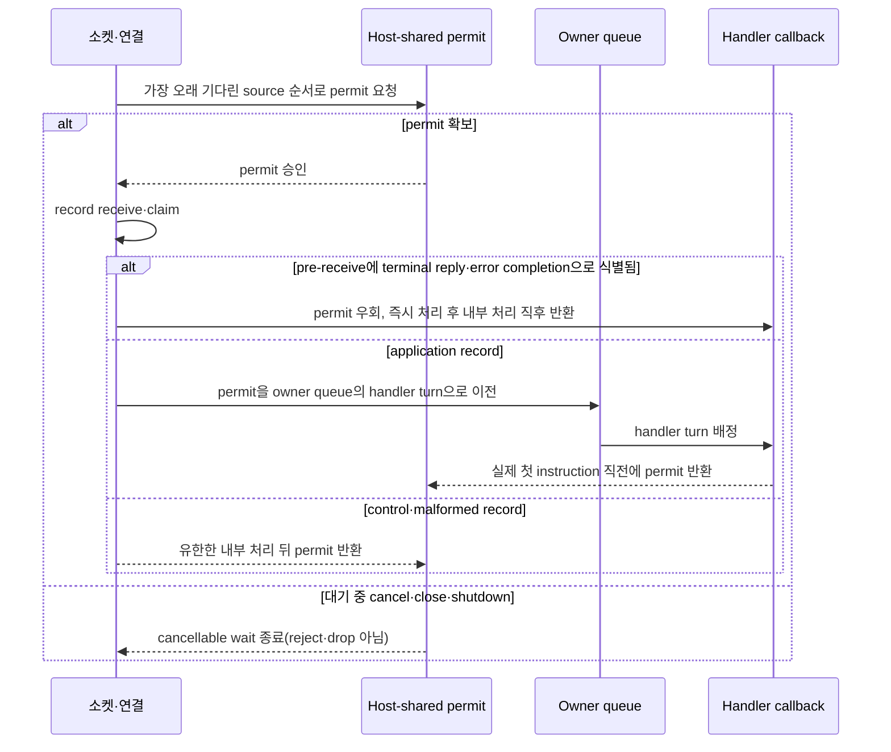

# Application job queue와 backpressure

[Execution 주제 목차](README.ko.md) · [스펙 목차](../README.ko.md) · [이전: 03. 취소와 종료](03-cancellation-and-shutdown.ko.md) · [다음: 05. Payload 소유권과 codec](05-payload-ownership-and-codec.ko.md)

> 이 문서는 [Core byte HWM budget](../00-foundation/02-glossary.ko.md#core-hwm-budget)과 Framework
> [Application job queue](../00-foundation/02-glossary.ko.md#application-job-queue)라는 서로 독립된 두
> capacity authority가 ordinary ingress를 어떤 순서로 통과시키는지, 그 결과로 나타나는
> pressure 상태를 Framework가 언제 어떻게 관측·전파하는지를 정의한다. Application·Core·
> Framework host·provider의 책임 경계를 caller가 의존하는 계약으로 서술하고, 그 계약을
> 여러 언어 runtime이 공통으로 만족해야 하는 구현 구조로 함께 담는다.

## 1. 두 독립된 capacity authority

Core와 Framework는 서로 다른 과부하를 관찰한다.

- Core는 transport queue가 현재 보유한 physical-frame byte를 알고 connection·payload 크기로
  인한 queue memory burst를 제한한다.
- Framework는 handler가 시작되기 전에 대기하는 application job 수를 알고 application 처리
  속도보다 빠른 유입을 제한한다.

- **Core byte HWM과 Application job queue는 설정, profile, 단위, 계상 경계와 관측값을 공유하지
  않는다.** 한 authority의 값을 다른 authority의 counter로 복사하면 책임이 겹친다 — Core가
  handler 처리 능력을 추측하거나 Framework가 socket queue byte를 계산해서는 안 된다.
- **Core byte HWM은 전송 경로의 마지막 안전장치이고, Application job queue는 handler 유입
  속도의 안전장치다 — 둘 다 필요하지만 같은 보호는 아니다.** Framework pressure가 미리
  remote traffic을 줄이더라도 이미 remote Core queue, OS buffer, network와 local Core
  queue에 들어간 data가 있다. 반대로 Core queue가 비어 있어도 handler job이 오래 대기할 수
  있다.

| Authority | 제한하는 것 | 계상 또는 획득 시점 | 반환 시점 |
|---|---|---|---|
| Core byte HWM | Core application-direction queue가 현재 보유한 physical-frame charge | Core queue가 frame을 소유할 때 | Receive dequeue 등으로 Core queue가 frame 소유권을 내놓을 때 |
| Application job queue | Host가 callback 시작 전에 수용한 application job permit 수 | Ordinary ingress를 receive·claim하기 직전에 예약하고 handler turn으로 전환할 때 | Callback의 실제 첫 instruction 직전 또는 callback 전 terminal에서 |

- **Core byte HWM charge는 계약이 정한 payload와 metadata byte를 포함하고, Core queue가
  record를 binding에 넘기면 그 record의 charge는 끝난다.** Framework는 retained-credit
  lease를 요청하거나 Core byte charge를 handler·reply lifetime까지 연장하지 않는다.
- Receive 뒤 payload storage는 [Payload 소유권과 codec](05-payload-ownership-and-codec.ko.md)의
  일반 message ownership 규칙을 따른다. Storage를 복사·이동·해제하는 것은 payload lifetime
  관리이며 Core byte HWM credit, 두 번째 Application job queue permit이나 별도
  byte-pressure authority가 아니다.

Framework pressure count(permits in use)는 다음 값이다.

```text
application job permits in use
  = reserved supply permits
  + queued application jobs
```

Capacity waiter는 아직 permit을 받지 않았으므로 포함하지 않는다. Reservation이 queued job으로
바뀌어도 합계는 변하지 않고 permit을 반환할 때만 감소한다. 한 record가 1:N callback을 만들면
실제 callback turn마다 permit 하나를 사용한다.

## 2. 설정과 profile 경계

Core와 Framework profile은 같은 label을 사용할 수 있지만 서로 다른 public type과 계산이다.

| 설정군 | 소유자 | 기본 profile | Manual override |
|---|---|---|---|
| `CoreHwmMemoryLimitBytes`, `CoreHwmBudgetBytes`, `CoreHwmProfile` | Core | `Balanced` | Core memory 또는 budget byte |
| `ApplicationJobQueueProfile`, `MaxQueuedApplicationJobs` | Framework host | `Balanced` | Host의 정확한 job permit 상한 |

- **Framework는 startup에서 Core 설정값을 binding context option으로 전달할 뿐, profile 비율을
  계산하거나 budget을 connection 수로 나누지 않는다.** Core snapshot을 Framework status에
  투영하는 것도 읽기 전용 관측이며 Framework pressure 계산의 입력이 아니다.
- **Framework job pressure가 Core에 주는 feedback은 지원 socket에 적용하는 `RUNNING`·
  `PAUSED` receive-flow 절대 상태 하나뿐이다.** Framework는 Core HWM 설정이나 queued-byte
  counter를 상태 전이에 맞춰 변경하지 않는다.

## 3. Ordinary ingress permit 순서

Ordinary ingress — Core나 binding에서 아직 permit을 받지 못한 record를 receive·claim하는 모든
경로 — 는 어떤 문맥에서 도착했든 같은 규칙을 따른다. STREAM application packet, cross-node
Session application record([STREAM 서버 session](../04-session/01-stream-session.ko.md),
[Session과 Actor binding](../04-session/02-session-actor-binding.ko.md) 참고), handshake·bind·
unbind와 그 밖의 모든 일반 application job 유입이 예외 없이 이 순서를 따른다.

Ordinary ingress는 다음 순서를 지킨다.

1. 가장 오래 기다린 live source 순서로 host-shared permit을 기다린다.
2. Permit을 얻은 뒤에만 Core·binding에서 record를 receive·claim한다.
3. Application record는 permit을 owner mailbox나 serial queue의 handler turn으로 이전한다.
4. Control 또는 malformed ordinary record는 유한한 내부 처리를 마친 뒤 permit을 반환한다.
5. 공통 invocation boundary는 callback의 실제 첫 instruction 직전에 permit을 반환한다.



Handler가 시작한 뒤의 `await`, coroutine suspension, continuation과 reply 대기는 같은 permit을
다시 얻지 않는다. Relocation처럼 아직 실행 가능하지 않은 durable backlog는 해당 relocation
spec이 정한 유한한 payload owner로 handoff한 뒤 initial reservation을 반환하고, runnable
callback turn마다 새 permit을 얻는다.

**Pre-receive에 terminal reply 또는 error completion으로 식별되는 supply만 이 permit을
우회한다.** Ordinary connection에서 receive한 뒤 completion으로 분류해 우회를 소급 적용하지
않는다. 이 분리는 ordinary queue가 포화돼도 이미 시작한 operation의 terminal completion이
진행되게 한다.

ClientServer의 Client DEALER reply는 Framework permit을 얻기 전에 Core의 single Application
connection FIFO와 byte HWM·PAUSED를 통과한다. 따라서 Core가 reply를 completion으로 식별한 뒤에는
permit을 우회하지만, 이 우회가 앞선 DATA를 건너뛰거나 Core transport progress를 보장하지는
않는다. RouteMesh ROUTER-ROUTER reply는 별도 [Completion connection](../00-foundation/02-glossary.ko.md#completion-connection)으로 이 permit 경계에 도달한다.

Source마다 outstanding permit waiter는 하나이며 가장 오래 기다린 source
순서로 handoff한다. Batch를 처리한 source는 대기열 tail로 이동한다.

Batch나 1:N callback도
확보한 permit 수보다 많은 application job을 게시하지 않는다.

Framework heartbeat, topology, relocation과 service-wire `SendReady` kind `12`는 이 completion
supply가 아니다. 이 control record는 application data line에 남아 기존 FIFO와 liveness
계약을 따르며, Core completion 연결이나 별도 Framework control queue로 옮기지 않는다.

다음 방식은 허용하지 않는다.

- permit 없이 먼저 receive한 뒤 별도 counter만 증가시키기
- retained-credit lease나 Framework byte-HWM으로 Core HWM을 다시 구현하기
- 포화를 reject, drop, fixed-delay polling 또는 busy spin으로 바꾸기
- spec이 소유하지 않는 unbounded 또는 hidden side backlog에 record 보관하기

### 준비된 owner 집합 (구현)

Record가 permit을 얻어 owner queue로 들어가려면, 그 owner에 지금 처리할 일이 있다는 사실을
실행 자원이 알아야 한다.

- **지금 처리할 일이 있는 owner를 상태로 유지한다.** 이 상태는 "무엇이 바뀌었다"는 1회성
  알림이 아니라 "지금 이 상태다"를 나타내며, 같은 owner가 중복해서 들어가지 않는다. 알림이
  유실돼도 처리할 일이 남은 owner는 결국 처리돼야 하므로, 깨어난 실행 자원은 언제나 이
  상태를 다시 확인한다.

내부 확인 조건 — 알림이 유실되어도 깨어난 실행 자원이 준비된 owner 집합을 다시 확인해 missed
wakeup이 없다는 것은 이 상태 관리의 white-box 불변 조건이다.

### 넣을지 판단하는 것과 넣는 것을 쪼개지 않는다 (구현)

Message를 어느 owner의 queue에 넣을지 정하려면 여러 조건을 본다 — 그 owner가 아직 이
node에 있는지, 자리가 있는지, 이동으로 봉인되지 않았는지.

- **이 확인들과 실제로 넣는 동작은 같은 구간 안에서 끝난다.** 확인과 넣기 사이에 owner가
  바뀌면 message가 더 이상 owner가 아닌 node의 대기열에 들어가고, 그 대기열은 아무도
  처리하지 않는다 — 보낸 쪽은 timeout까지 기다리게 된다.

한 구간 안에서 다음을 하나의 commit으로 처리한다.

1. host와 topology가 지금 application 작업을 받는 상태인가
2. 대상 객체가 이 node에 있고 owner 정보가 유효한가
3. 이동 봉인·생성 대기·session 연결 대기 중이 아닌가
4. 해당 lane의 건수와 byte를 함께 예약할 수 있는가
5. 수락 순서를 나타내는 sequence를 확정하고 owner queue 뒤에 넣는다
6. 비어 있던 queue가 채워졌으면 준비된 owner 집합에 그 owner를 넣고 실행 자원에 즉시
   알린다

- **확인에 실패한 message는 대기열에 나타나지 않는다.** 일단 넣었다가 빼는 방식으로 만들지
  않는다 — 넣었다 빼면 그 사이에 실행될 수 있고, 뺐다는 사실을 관측에서 구분할 수도 없다.
  응답을 기다리는 호출은 실패 이유를 결과로 받는다. 예약이나 enqueue에 실패한 경우에도
  건수·byte 사용량과 수락 sequence는 이전 값 그대로다. 실패한 시도가 다음 정상 작업의
  순서나 admission 가능 여부를 바꾸지 않는다.

**언어별 재량** — 이 구간을 잠금으로 만들지 다른 방법으로 만들지는 자유다. 판정 기준은 확인과
넣기만 이 구간 안에 있고, 역직렬화나 handler 조회처럼 구간을 길게 만드는 일은 구간 밖에서
하는가이다 — 그 조건을 만족하는 한, 구간이 짧게 유지되고 owner가 확인·넣기 사이에 바뀌지
않는다는 관찰 결과는 어떤 구현 방식을 쓰든 같다.

내부 확인 조건 — 확인 시점과 넣는 시점 사이에 owner가 바뀐 message가 옛 owner의 대기열에
들어가지 않는다는 것은 위 commit 절차가 하나의 원자적 구간이라는 사실로만 확인되는 white-box
불변 조건이다.

### Permit 반환과 대기 중 자원 점유 금지 (구현)

Application permit은 자신의 target callback 실제 첫 instruction에서 반환하고, control·
malformed record의 permit은 내부 처리 직후 반환한다. 이 반환 시점은, STREAM 연결 하나를
수락한 때부터 닫을 때까지 유지하는 서버 실행 단위인
[STREAM session](../00-foundation/02-glossary.ko.md#stream-session) callback이 시작하는
순간과 같은 지점이다 — 문맥마다 별도 규칙을 두지 않는다. Cancellation,
source close와 shutdown은 waiter와 handoff permit을 정확히 한 번 정리한다.

- **Same-host relay, fanout, serial owner와 relocation 경로는 permit 반환에 필요한 gate·
  execution authority·resource를 쥔 채 같은 authority의 새 permit acquire를 기다려서는 안
  된다.** 지속되는 wait/capacity cycle은 우회를 정당화하는 근거가 아니라 protocol 또는
  runtime bug다.

## 4. 소켓에서 여러 건 읽기 (구현)

owner를 가져온 뒤 모아서 처리하는 것과 별개로, **소켓에서 꺼내는 단계**에도 같은 문제가
있다. 한 번 깨어났을 때 소켓에서 한 건만 읽고 돌아가면, 쌓여 있는 message 수만큼 깨우기와
읽기 호출이 반복돼 부하가 높을수록 비용이 커진다.

- **한 번 깨어났을 때 한도 안에서 여러 건을 이어서 읽는다.** 상대가 계속 보내는 동안
  무한정 읽으면 그 연결 하나가 수신 단계를 독점하고, 다른 연결과 binding operation
  completion 처리가 밀린다.
- **한도는 건수·byte·경과 시간 셋을 함께 두고 먼저 닿는 것을 적용한다.** 건수만 두면 큰
  message에서 시간이 길어지고, 시간만 두면 작은 message에서 시계를 너무 자주 읽는다.
- **다음 회전은 이번에 멈춘 연결의 다음부터 시작한다(cursor 유지).** 항상 처음부터 순회하면
  앞쪽 연결이 계속 먼저 처리되어, 상한을 두어도 뒤쪽 연결이 밀린다.

이 규칙은 fanout뿐 아니라 [RouteMesh](../00-foundation/02-glossary.ko.md#routemesh), ClientServer, service
connection, STREAM을 포함한 **모든 multi-connection 수신 경로**에 적용한다. 한도에 걸려
남은 것이 있으면 다음에 깨어날 때 이어서 읽는다.

**건수 한도는 회전 하나당 최대 64개로 고정한다.** Byte 한도와 경과 시간 한도는
**언어별 재량**이다 — 값이 달라도 회전 시작점이 항상 멈춘 연결의 다음부터 다시 시작하고
어떤 연결도 수신 단계를 무한정 독점하지 않으므로, 다른 연결이 진행할 기회를 얻는다는
관찰 가능한 결과는 같다. 확인 기준은 한 연결에 느린 consumer가 있어도 다른 연결의 진행이
멈추지 않는지다.

RouteMesh에 참여해 message를 보내거나 받는 runtime node인
[MeshNode](../00-foundation/02-glossary.ko.md#meshnode)의 `SendHighWaterMark`·
`ReceiveHighWaterMark`·`SendTimeout`·`ReceiveTimeout` 같은 방향별 socket option 배선은 이
문서가 다루지 않는다 — channel-transport
주제가 [RouteMesh topology](../02-channel-transport/01-channel-topology.ko.md)와
[MeshNode startup](../03-spot-actor/03-mesh-node.ko.md)이 정한 공개 설정을 소유한다.

## 5. 수신 처리와 상태 변경 분리 (구현)

- **수신 콜백은 받은 데이터의 소유권을 runtime 쪽 값으로 옮기고 바로 반환한다.** 수신
  문맥은 대개 전송 계층이 소유하므로 여기서 오래 머물면 그 연결의 다른 수신이 밀린다.
- **형식 검사는 handler를 부르기 전에 끝낸다.** 형식이 맞지 않는 입력은 handler에
  도달하지 않는다 — 응답을 기다리는 호출은 `ProtocolError`로 끝나고, 기다리지 않는 호출은
  기록만 남기고 끝난다.

내부 확인 조건 — 수신 콜백 안에서 handler를 부르거나, 주소와 상태를 가진 논리 instance인
[Spot](../00-foundation/02-glossary.ko.md#spot)의 상태를 바꾸지 않는다는 것은 수신
경로가 [handler 실행 gate](02-handler-turn-and-execution-gate.ko.md#1-queue와-gate-분리-원칙)를
거치지 않고 상태를 바꾸는 경로를 만들지 않기 위한 white-box 불변 조건이다.

## 6. Pressure 상태와 socket 제어

Effective maximum을 `M`, configured pause·resume percent를 `P`와 `R`이라 하면, startup에서
다음 경계를 계산한다.

```text
pause permit count  = ceil(M * P / 100)
resume permit count = floor(M * R / 100)
```

`P`는 `1..100`이고 기본값은 `80`, `R`은 `0..99`이고 기본값은 `60`이다. `R < P`여야 한다.
`running`에서는 permits in use가 pause count 이상이면 `paused`로 전이하고, `paused`에서는
resume count 이하이면 `running`으로 전이한다. 두 경계 사이에서는 현재 상태를 유지한다.

- **Framework는 전이한 절대 상태를 RouteMesh의 ROUTER-ROUTER two-lane socket과
  ClientServer의 DEALER-ROUTER single-lane socket에만 적용한다.** PUB/SUB, Classic fanout과
  STREAM은 이 연동 범위가 아니며 기존 Core byte HWM과 각 구조적 queue 상한을 유지한다.
- **`PAUSED`는 Core HWM 값을 바꾸지 않는다.** Core는 remote-pause blocker와 local
  byte-HWM blocker를 독립적으로 합성한다. `RUNNING`은 remote-pause 원인만 제거하므로
  local HWM이 계속 full이면 send는 계속 대기한다. Pressure 상태 자체는 route ready나
  transport liveness를 바꾸지 않는다.
- **Host queue owner는 permit count 변경 같은 synchronization 경계에서 pressure 상태를
  계산한다.**
  - 상태가 바뀌면 지원 socket snapshot에 새 절대 상태를 적용한다.
  - 같은 상태를 반복 적용하지 않고, stale transition이 최신 상태를 덮어쓰지 못하게 한다.
  - Shutdown은 마지막 상태 적용을 무기한 기다리지 않으며, 관측 counter를 정리해도 현재
    상태와 pause duration은 유지한다.
- **이 receive-flow state API가 Framework pressure와 Core send flow 사이의 유일한 runtime
  제어 지점이다.** Framework는 raw flow frame을 만들거나 Core control lane을 범용
  Framework channel로 사용하지 않는다.

내부 확인 조건 — 새 socket은 현재 host pressure 상태를 적용한 뒤 receive 대상 registry에
게시하고, close는 먼저 registry에서 socket을 제거한 뒤 진행한다는 순서는 registry 구현의
white-box 불변 조건이다. Binding 호출은 queue, registry와 user callback lock 밖에서
수행한다. Close와 경쟁한 lifecycle 결과 외의 설정 실패는 진단과 metric에 기록한다.

## 7. Send completion과의 합성

- **Core와 binding은 HWM 대기, 내부 재시도와 operation별 completion을 소유한다.**
  Framework는 특정 target을 선택한 뒤 binding operation 하나만 시작한다. Operation이
  시작되면 PAUSE나 HWM을 이유로 target을 다시 고르거나 같은 payload로 두 번째 operation을
  만들지 않는다.
- **Framework는 제거된 `send_ready` callback·event, readiness waiter 또는 retry adapter를
  두지 않는다.** 작업을 끝내야 하는 마지막 시점인
  [Deadline](../00-foundation/02-glossary.ko.md#deadline), cancellation, detach와 shutdown은
  기존 operation state
  machine의 첫 terminal 규칙을 따른다. Framework service-wire의 `SendReady` kind `12`는
  Framework service control record이므로 제거된 binding callback과 다른 계약이다.

## 8. Backpressure 3단계와 한도 종류

- **송신 queue의 상한으로 송신 속도를 제한하는 흐름 제어인
  [Backpressure](../00-foundation/02-glossary.ko.md#backpressure)의 3단계는 send·publish·
  one-way 계열에만 적용한다.** Request 계열은
  caller가 결과를 받아 재시도를 판단할 수 있으므로 기다리지 않는다 — 같은 runtime의
  Spot·Actor 대기열이 가득 차면 즉시 `CapacityExceeded`, 다른 node의 대기열이면
  `Unavailable`로 끝낸다.

1. 첫 제출이 거절되면 정해진 시간까지 보낼 공간이 생기기를 기다린다.
2. 시간 안에 공간이 생기면 한 번 제출한다.
3. 시간이 먼저 끝나면 [`DeadlineExceeded`](../00-foundation/02-glossary.ko.md#deadlineexceeded)로
   끝낸다.

- **이 3단계는 public 결과가 아직 확정되지 않은 구간에만 적용한다.** 이미 완료된 호출
  뒤에 일어나는 실패(publish가 시작된 뒤의 local target 건너뜀, 이동 중 one-way 버림,
  완료된 send의 target admission 실패)는 호출자에게 돌려줄 결과가 없으므로 관측으로만
  남긴다.
- **기다리는 동안 그 작업은 실행 권한을 쥐고 있지 않는다.** 쥔 채로 기다리면 같은
  Spot의 다른 요청이 송신 공간을 기다리는 시간만큼 막힌다.
- **기다리는 자리도 한도가 있다.** 대기 자리가 가득 차면 기다리지 않고 바로
  `DeadlineExceeded`로 끝낸다. 밀렸다는 사실 자체는 caller가 받는 값이 아니다 —
  [`Backpressured`](../00-foundation/02-glossary.ko.md#backpressured)는 public terminal result가
  아니다. 한도가 없으면 상대가 느릴 때 이쪽 메모리가 상대의 처리 속도에 따라 무한정
  늘어난다.

StreamNode의 client→server complete-message
[`MaxMessageSize`](../00-foundation/02-glossary.ko.md#max-message-size)는 이 capacity와 독립된
wire guard다. 6-byte prefix를 제외한 header+payload를 검사하고 기본값은 `64 KiB`이며
server→client outbound에는 적용하지 않는다.

**한도 종류에 따라 terminal 의미를 구분하고 조용히 버리지 않는다.**

| 한도 | 무엇으로 재는가 | 포화 의미 |
|---|---|---|
| Core HWM | 방향별 queued/accounted byte | Core queue에서 sender까지 backpressure |
| Application job queue | host instance의 reserved·queued·in-use permit | cancellable shared-cap wait |
| [Owner](../00-foundation/02-glossary.ko.md#owner) FIFO — 현재 Actor·Spot을 실행하는 MeshNode별 대기열 | owner별 count와 byte | structural owner isolation error |
| Outbound admission waiter | operation family별 bounded waiter | 원래 send deadline/cancellation 결과 |

어느 경로도 별도 unbounded backlog, polling, busy-spin이나 silent replay를 만들지 않는다.

### Owner 예약의 이관 — 두 단계가 빈틈없이 잇는다

Owner FIFO의 count·byte 예약은 한 컴포넌트가 지지 않는다. 수신 mailbox가 receive 수락부터
owner 실행 queue로 claim될 때까지를, 실행 queue가 claim부터 handler terminal completion까지를
각각 진다([02 §7](02-handler-turn-and-execution-gate.ko.md#7-lane-분리와-우선순위-구현)이
실행 queue 쪽의 반환 시점을 소유한다).

- **한 record의 예약은 receive 수락부터 handler terminal completion까지 끊기지 않는다.**
  claim 경계에서 mailbox 반환과 실행 queue 계상이 함께 일어난다. 사이에 계상되지 않는
  구간이 있으면, dequeue된 뒤 아직 handler가 끝나지 않은 in-flight payload가 어떤 한도에도
  잡히지 않는다 — 큰 payload를 오래 보유하는 handler가 많을수록 그 구간의 memory가
  무한정 자란다.
- **Claim 시점의 이관은 재판정이 아니다.** 이미 수락된 record를 실행 queue가 용량을 이유로
  거절하면 §3이 금지한 "포화를 reject로 바꾸기"가 된다. 실행 queue는 이관받은 예약을
  계상만 하고, 용량 거절 판정은 같은 runtime 안의 새 로컬 제출에만 적용한다.
- **같은 record를 두 단계가 동시에 계상하지 않는다.** 이중 계상하면 owner 한도가 실제
  적체보다 이르게 포화되어, 한도 값이 뜻하는 것이 사라진다.

내부 확인 조건 — claim 경로에서 mailbox 반환과 실행 queue 계상 사이에 record byte가 어느
쪽에도 계상되지 않는 순간이 없고, permit을 들고 이관된 record가 실행 queue에서 용량 거절을
받는 자리가 없다.

## 9. 큰 payload와 운영값

- **Application job queue는 job count를 제한하지 payload byte를 가중하지 않는다.** 빈
  payload와 큰 payload는 각각 job 하나다. 따라서 Framework queue 상한은 process memory의
  byte hard cap이 아니다.
- 큰 payload를 오래 보유하는 workload는 production과 같은 payload 분포, permits in
  use, process memory, throughput과 latency를 함께 측정해 `MaxQueuedApplicationJobs`를
  낮춘다. 단일 message 크기는 `MaxMessageSize`로 별도 제한한다. 이 문제를 해결하려고
  Core profile을 Framework profile에 연결하거나 retained-credit lease를 복구하지 않는다.
- **Core HWM은 Core queue memory의 마지막 안전장치로 계속 동작한다.** Framework가
  permit 때문에 ordinary receive를 멈추면 local Core receive queue에 byte가 쌓이고,
  finite Core HWM과 TCP backpressure가 sender의 진행을 제한한다.

## 10. 검증 요구

공개 표면(send·publish·request 결과 값, [Application job queue](../00-foundation/02-glossary.ko.md#application-job-queue)
pressure 상태 조회, socket receive-flow 절대 상태, [Runtime metric](../06-observability/02-runtime-metrics.ko.md)
이름)만으로 다음을 확인한다. 각 항목은 contract test 하나로 이어진다.

**두 capacity authority의 설정**

- Core profile과 Application job queue profile을 서로 다르게 설정할 수 있고, 둘의 기본값은
  각각 `Balanced`다.
- Reservation, queued job과 callback 첫 instruction의 permit count가 같은 규칙을 따른다.

**Permit 획득과 순서**

- Permit이 없으면 다음 ordinary record를 먼저 receive하지 않는다.
- 확인에 실패한 send·request는 owner queue의 건수·byte·sequence 관측값을 바꾸지 않는다.
- Shared permit이 모두 예약되면 ordinary ingress가 cancellable wait하고, terminal
  reply·error completion은 계속 진행한다.
- ClientServer reply가 Core physical head에 도달해 completion으로 식별된 뒤에는 permit을 얻지
  않지만, 앞선 one-way DATA는 ordinary permit을 얻기 전 Core에서 dequeue하지 않는다. Permit
  우회가 Core single FIFO·HWM을 건너뛰지 않는다.
- 한 연결이 계속 보내는 동안에도 다른 연결의 수신이 진행된다.
- 수신 한도가 건수·byte·경과 시간 셋 중 먼저 닿는 것으로 끊기고, 다음 수신 회전이
  이번에 멈춘 연결의 다음부터 시작한다.
- 한 socket이 여러 peer를 대표할 때 회계가 peer 단위로 이루어진다.
- 형식이 맞지 않는 입력은 handler에 도달하지 않는다 — 응답을 기다리는 호출은
  `ProtocolError`로 끝나고, 기다리지 않는 호출은 기록만 남는다.

**Pressure 상태와 socket**

- 80% pause, 60% resume과 경계 사이 hysteresis가 정확하다.
- 새 socket 동기화, close 경쟁과 stale transition이 최신 절대 상태를 깨지 않는다.
- RouteMesh ROUTER-ROUTER와 ClientServer DEALER-ROUTER socket에만 receive-flow state를 적용한다.

**Backpressure와 Core HWM**

- 송신 공간을 기다리는 작업이 실행 권한을 쥐고 있지 않다.
- 송신 대기 자리가 가득 차면 기다리지 않고 `DeadlineExceeded`로 끝낸다.
- Owner structural reject와 shared-cap wait가 서로 다른 error·metric으로 관찰된다.
- 이미 완료된 호출 뒤의 실패(publish 시작 후 건너뜀, 완료된 send의 target 실패)는
  caller 결과를 바꾸지 않고 관측에만 남는다.
- Core receive byte HWM이 찼을 때 sender까지 backpressure가 전달되며 record를 버리지
  않는다.
- RouteMesh ROUTER-ROUTER Completion supply는 ordinary permit 포화와 독립적으로 진행한다.
- ClientServer DEALER-ROUTER reply는 Core single FIFO의 앞선 DATA와 HWM·PAUSED 뒤에서 늦어질 수
  있으며 configured request timeout이 먼저 끝나면 late reply가 두 번째 terminal을 만들지 않는다.
- Framework가 retained receive, `send_ready` waiter 또는 별도 send retry를 사용하지
  않는다.

설정의 구체적인 값은 [Framework API](../00-foundation/06-framework-api.ko.md)가, 상태와 metric 이름은
[Runtime 상태](../06-observability/01-runtime-monitoring.ko.md)와
[Runtime metric](../06-observability/02-runtime-metrics.ko.md)이 정의한다.

---

[Execution 주제 목차](README.ko.md) · [스펙 목차](../README.ko.md) · [이전: 03. 취소와 종료](03-cancellation-and-shutdown.ko.md) · [다음: 05. Payload 소유권과 codec](05-payload-ownership-and-codec.ko.md)
