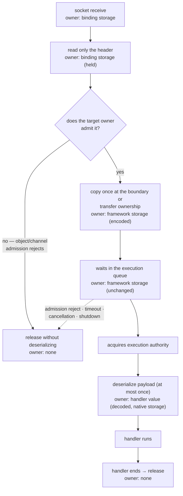

# Payload Ownership And Codec

[Execution topic table of contents](README.en.md) · [Spec table of contents](../README.en.md) · [Previous: 04. Application Job Queue And Backpressure](04-application-job-queue-and-backpressure.en.md)

> This document defines **how many times bytes are copied** while one message travels from
> the socket to the handler. Copy count directly affects throughput — copying the whole
> buffer at every ownership handoff repeats payload-size memory work on the message path.
> Payload-size accounting is owned by [the Framework API](../00-foundation/06-framework-api.en.md), and the
> transfer format by [Channel Messaging](../02-channel-transport/02-channel-messaging.en.md); this document defines
> the ownership-transfer and copy structure that satisfies that contract.

## 1. Distinguishing Two Kinds Of Copies

There are two copies of different character.

| Kind | Example | Can it be eliminated |
|---|---|---|
| **A copy the binding forces** | A copy that moves data into managed memory because that language can't safely keep a native buffer alive | Can't be eliminated |
| **A copy framework creates** | A copy made to pass a queue, to change format, or built ahead of time just in case it's needed later | Can be eliminated |

A binding may not offer a borrowed view when the native queue's lifetime can't be tied
safely to that language object's reachability. The first copy is forced for that language
mapping.

**The copies framework adds on top target zero.** A copy the binding forces is accepted as a
per-language fact, and the implementation is evaluated by how many more copies framework adds
on top of it.

## 2. Copies That Can Be Eliminated

Framework internals do not create the following copies.

| Type | What it does | Why it can be eliminated |
|---|---|---|
| **Boundary round trip** | Converts `message → byte array → message` and back | Coming back to the same representation makes the middle step a pure waste |
| **Accessor copy** | An accessor returning a list builds a copy every time it's called | A read-only access needs no copy, and copy count otherwise grows with read count |
| **A copy to pass the queue** | Copies to secure ownership before enqueuing onto the execution queue | Ownership can be moved rather than copied |
| **Dual retention** | Holds the same payload in two different representations at once | Keep one owned representation |
| **A pre-built move record** | Covered in §3 | Can be built when the move actually starts |

## 3. Move Records Are Not Created On The Hot Path

Pre-building a relocation-preparation record for every accepted route message adds this cost
regardless of whether relocation occurs. A path that also retains the original and
intermediate representations can make the same payload reside four times at once.

**The move record is built after sealing starts.** A move is a rare event, and by sealing
time, the remaining work in that owner's queue is already fixed, so it can be built then.

If it must be pre-built, the reason must be that the original is already released before
sealing. In that case, the problem to fix first is the release time of the original, not an
advance copy.

## 4. The Owner While An Item Sits In The Queue

**The payload of a message that entered the execution queue is owned by framework.** While
pending, neither the transport layer nor the application touches that buffer.

**Release happens after the handler finishes.** Releasing the payload while the handler is
running invalidates the view the handler is using.

What gets released depends on how the binding represents ownership. A runtime that keeps the
native buffer releases that buffer; one that moved it into managed memory releases the copy.
In either case, release happens after handler completion.

Ownership moves in one direction only. If the payload must outlive the binding receive
callback, the boundary copies it once or transfers ownership. After it enters the [execution
queue](../00-foundation/02-glossary.en.md#object-execution-queue), the Framework owns the encoded payload,
and the decoded value the handler receives carries neither ownership of native storage nor
responsibility for releasing it.

The following diagram shows the owner at each stage and where copies happen along the full
path a message takes from the socket to the handler.



Every terminal path converges on the same release point. Handler exceptions, timeout,
cancellation, shutdown, and relocation cleanup neither skip release nor perform it twice. In
C++ and .NET this transition is visible as `close`/`Dispose`. A mapping such as a JVM managed
object or Node `Buffer`, where garbage collection performs the physical release, still keeps
the same logical release point at which the queue and handler stop retaining the storage.

## 5. What Is Handed To The Handler

**The handler is handed a deserialized owned object. It is not handed native storage or
release responsibility.**

Because of this rule, one deserialization copy is unavoidable. As long as a typed handler is
offered, the wire representation must be turned into that language's object.

So §1's "zero framework-created copies" is a value excluding deserialization. The target is
`binding-forced copy + one deserialization`, and everything between is what's targeted for
reduction.

**Copy accounting counts three kinds separately.** Merging them into one distorts comparison.

```text
full buffer copy    // building a whole new byte array. Cost proportional to size — reducing it is a direct win
view/slice          // building a reference pointing at the same buffer. Nearly no cost — counting it as a copy invents a problem that doesn't exist
object construction // the string/array/object graph deserialization builds. Not one buffer copy — depends on codec and payload shape
```

"One deserialization" is a value on the buffer-copy axis. Counting the object count
deserialization produces with the same number as buffer copies makes it impossible to
distinguish the gain from switching codec from the gain of eliminating a copy.

An immutable payload type can easily copy the array once at construction and again every time
the accessor is called. If every accessor call copies, a handler simply reading the payload
twice doubles the copy count. Keep public-API immutability while providing a separate no-copy
path for internal runtime ownership transfer.

An API dealing with raw bytes is used only for transport inspection and codec extension
implementation. Letting a business handler receive raw payload as an argument is a contract
violation.

## 6. When Deserialization Happens

**The header is read first, and payload deserialization happens only right before the
handler, after execution authority is acquired.** See §4's diagram for the owner transition
across the full path.

Reading the header first isn't a choice — it's needed to decide which owner to send to. The
payload, on the other hand, is seen by no one until the handler runs.

**A message not admitted to the execution queue is not deserialized.** A message rejected by
an object/channel admission rule or because it doesn't match the current owner never reaches
the handler. Deserializing it first performs expensive work for a message that will be
rejected, at the time when load is highest.

[Application Job Queue](../00-foundation/02-glossary.en.md#application-job-queue) saturation is not that
rejection. Ordinary ingress waits cancellably for its host-wide permit before receive or
claim, without reject or drop. Once a permit exists, the separate object/channel admission
contract still decides whether the encoded message enters the execution queue.

A message arriving after a relocation seal is not rejected. The Framework holds its encoded
payload and reply information and splits the handling by timing.

| Timing | Handling |
|---|---|
| An explicit abort before the relay-ready reply is accepted | It resumes the message at source |
| Afterward | Regardless of cutover-submit result, it hands the message to target handoff or Message Follow |

This message, too, is not deserialized before it acquires
execution authority.

The hold preserves the message while postponing deserialization until the
handler actually runs.

Deserializing before acquiring execution authority spends that cost on a message rejected
within the authority. Copying before the object/channel admission decision likewise leaves
copy cost on a rejection that contract permits.

**The whole thing is not parsed twice to determine format.** Test-parsing the payload once and
then parsing it again for actual processing duplicates both cost and failure points. Format is
what the header tells you, not something to discover by test-parsing the body.

**An admitted message's typed payload is deserialized at most once.** The message stores the
value or failure produced by its first typed access. A later access with either the same or a
different type doesn't call the codec again. If the stored value can't be used as the
requested type, the access ends in the language's type-mismatch result; if the first access
failed, it returns that same failure. Obtaining a read-only raw view or an explicit byte copy
doesn't produce this typed outcome.

## 7. Codec Selection — The Boundary Between Contract And Implementation

### Contract — There Is A Choice, And Send Differs From Receive

There isn't just one codec. Several serializers being registered at once is the premise, so
which one to use must be decided per message. The precise contract for this selection is owned
by [Framework API 「9. Codec」](../00-foundation/06-framework-api.en.md#12-codec). This document covers only
the implementation-side choices that contract leaves open.

The API shape expressing this selection differs per language. One language's API shape isn't
taken as the common structure. But send and receive being different boundaries is shared by
every language runtime.

| Direction | Chosen by | If not found |
|---|---|---|
| Send | The message type declared at the call site | Uses the JSON codec |
| Receive | The canonical content-type carried in the envelope | Ends in `ProtocolError` without re-parsing as JSON |

The send selector receives the message type declared at the call site, not the instance's
concrete type. If multiple selectors match, the later registration takes priority. On
receive, the wire's canonical content-type is compared exactly with the registry key. An
unregistered value, or one that doesn't conform to the normalization rule, completes with
`ProtocolError`.

### So What Falls To The Implementation

The internal registry, the codec selection cache, and the dispatch implementation are not
[Framework API 「9. Codec」](../00-foundation/06-framework-api.en.md#12-codec)'s contract. The fact that
selection happens is the contract, and its cost is decided by the implementation — what
follows are the implementation rules it must keep.

Codec selection may perform a lookup, but the strings, arrays, and call objects the lookup
process uses must not be rebuilt for every message.

| Repeated work | What it creates per message |
|---|---|
| Looks up by type as key and builds a call object | 2 lookups + 2 objects |
| Pulls content-type from the frame, turns it into a string, trims and normalizes it, and compares | Several strings |
| Builds the candidate list as an array and scans it | 2 arrays |
| Compares against the default format as a string | 1–2 comparisons |

The cost of the last comparison is small. The rest creates temporary objects and strings in
proportion to throughput.

**Since the registry doesn't change after startup, the selection result is cached.** However,
the cache key differs between send and receive.

| Direction | Cache key | When it's filled |
|---|---|---|
| Receive | The wire's canonical content-type | Since content-type kinds are finite, all of it can be precomputed at startup |
| Send | The message type declared at the call site | Types can't be enumerated in advance. Compute once on first encounter and cache |

The send cache can't be fully fixed at startup — the Channel API takes an arbitrary type per
call, and the selector predicate also evaluates a declared-type descriptor first encountered
at runtime. Because the registry itself is immutable, the result for a type that enters the
cache is computed once and doesn't change afterward.

The send cache stores selection results for only up to 1,024 declared types. Reaching the
limit doesn't evict existing entries. After that, each type first seen is evaluated against
the registration list on every send, and its result isn't cached. This keeps lookup cost low
for already-frequent types while bounding cache size.

If it's immutable after startup, compute it ahead of time and read it without a lock. Writing
lookup results at runtime into a dictionary that can't handle concurrent access adds a race.
Precomputing removes the runtime write and the race that comes with it.

**A new string is not built to compare content-type.** If trimming/normalizing is needed, do
it at registration time, and compare already-normalized values against each other on the
message path.

**A new list or temporary object is not built to pick a candidate.** Even in a situation with
only one registered codec, building it every time attaches that allocation to every message.

**When the receive content-type isn't found, it ends in `ProtocolError` rather than falling
back to JSON.** This is a value the contract already fixed. Falling back would try to parse a
different format's bytes as JSON and produce a bogus error.

The receive content-type is not pass-through metadata; it is the input that selects the codec.
Not using it for selection prevents the runtime from distinguishing a non-JSON payload, and it
also suppresses the `ProtocolError` for an unregistered content-type.

## 8. Retained Core Lease And 1:N Child Ownership

A record retained from Core receive has one shared owner for its payload and its Core
receive-credit lease.

The application shared permit releases at each individual target's
child callback's actual first instruction, and a pre-start terminal child returns its permit exactly
once.

After enqueueing the first child, remaining child permits are acquired lazily through
the [dispatch loop](04-application-job-queue-and-backpressure.en.md) FIFO, without copying unacquired child
payloads into a separate unbounded queue.

The shared retained owner returns the Core lease exactly once after every child terminal and
any required record-level reply attempt are terminal.

If cancellation, decode failure, owner
close, or shutdown occurs during partial child acquire/enqueue, permits not yet enqueued are
returned immediately; enqueued children clean up at their own pre-start or handler-start
boundary.

For a one-way record requiring no reply attempt, all child terminals are the record
terminal.

## 9. Verification Requirements

The following is confirmed using only the public surface — the typed value handed to the
handler and its access results, codec-related errors including `ProtocolError`, and the
`close`/`Dispose` calls or corresponding release callback that expose payload lifetime. Each
item leads to one test. Among these, the items covering "full buffer copy · view · object
construction counts" are **internal confirmation conditions** measured by internal
allocation/copy instrumentation rather than the public surface, and are listed separately
below.

**Ownership And Release**

- A pending payload is not touched by the transport layer or the application.
- Payload release happens after handler completion.
- Every terminal path — success, rejection, exception, timeout, cancellation, and shutdown —
  executes payload release exactly once.
- The handler does not receive native storage or release responsibility.

**Deserialization Timing And Count**

- A message rejected for queue-full or owner mismatch is not deserialized.
- A message held during a move is not deserialized after commit replay or abort resumption,
  before it acquires execution authority.
- Payload deserialization happens after execution authority is acquired.
- The whole payload is not parsed twice to determine format.
- The message stores the first typed access's value or failure, and the codec is called at
  most once for the same message.

**Codec Selection**

- If no codec matches the receive content-type, it ends in `ProtocolError` instead of falling
  back to JSON.
- If the declared message type matches more than one codec at send time, the later-registered
  codec is selected.

**Internal Confirmation Conditions (Measurement-Based, Not Confirmable From The Public
Surface)**

- The same payload is not kept in two different representations at once.
- There is no `message → byte array → message` round trip.
- An accessor returning a list does not build a copy on every call.
- A move record is not built for a message whose move has not started.
- The receive codec table is fixed at startup, and reading codec information requires no
  lock.
- Send codec selection results are stored for up to 1,024 declared types without evicting
  existing entries.
- A type first seen after the send-cache limit is not stored and is re-evaluated for every
  message.
- Codec-related processing does not create a new string, array, or call object per message.

---

[Execution topic table of contents](README.en.md) · [Spec table of contents](../README.en.md) · [Previous: 04. Application Job Queue And Backpressure](04-application-job-queue-and-backpressure.en.md)
