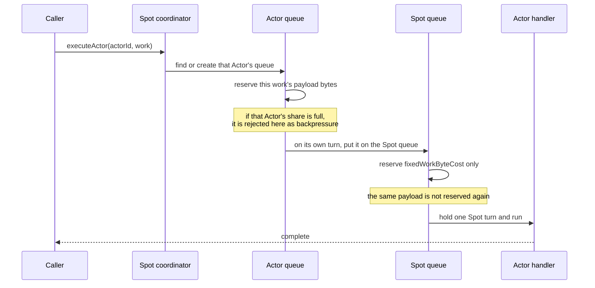

# Serial Executor Layers

[Execution topic table of contents](README.en.md) · [Spec table of contents](../README.en.md) · [Previous: 06. State Ownership And State Lanes](06-state-ownership-and-lanes.en.md)

> This document defines which serial execution unit Spot, Actor, and STREAM session each put
> their work on, who owns that unit's lifetime, and what the entry points that put work on it
> are. The names and entry points set here are used verbatim by all four language runtimes,
> converted only for spelling. Which things may run concurrently under which execution mode is
> owned by the glossary; this document defines only the queue path a piece of work takes under
> that mode.

## 1. Serial Executor Overview

When an application registers a Spot handler, an Actor handler, a timer callback, or a session
callback, the runtime does not run that callback on an arbitrary thread. It lines the callback
up on one **serial execution unit** and runs one at a time. This document sets how many such
lines each layer has, who creates and destroys them, and who decides which line a piece of work
goes on.

| Party | What this document sets |
|---|---|
| Application | Picks the execution mode at registration time. Does not pick which queue its work goes to |
| Runtime | Decides which queue each entry point uses, and owns that queue's lifetime |

[State ownership and state lanes](06-state-ownership-and-lanes.en.md) and this document address
different problems. A state lane is how one component lets only one turn at a time touch **its
own mutable state**; the serial executor here is how **application work** runs in order. Within
one runtime there is a state lane per component that owns state, and a serial executor per Spot,
Actor, and session instance.

Which things may run concurrently under which execution mode is owned by
[User Spot execution mode](../00-foundation/02-glossary.en.md#user-spot-execution-mode) — the
registration option deciding which execution gate the Spot handler, member Actor handlers, and
timer callbacks share. This document sets only the queue path work takes under that mode.

## 2. Layers And Ownership

Three layers each hold a serial execution unit. **Each layer has one coordinator, and that
coordinator owns the lifetime of its own layer's queue together with any subordinate queues it
created.** Without a coordinator, which work runs on which queue scatters across call sites, and
the ordering guarantee can no longer be read off the code.

| Layer | Coordinator | Serial execution units owned |
|---|---|---|
| Spot | `ZLinkSpotSerialExecutor` | one queue of its own · one queue per Actor · one queue per timer name |
| Actor | `ZLinkActorSerialExecutor` | one queue of its own |
| STREAM session | `ZLinkSessionSerialExecutor` | one queue of its own |

- **Spot is the only layer with subordinate queues.** The lifetime of an Actor queue and a timer
  queue is bound to the Spot — when that Spot goes away, that Spot's Actor and timer queues go
  with it. Actor and session have no subordinate whose lifetime is bound to them, so they carry
  no map for finding a queue by name; each instance holds exactly one queue.
- **The queue map is owned by a [state lane](06-state-ownership-and-lanes.en.md).** The map only
  looks a queue up by name, which makes it class C1 of 06 §4, and it is not guarded with a lock.

**Internal check condition** — no code outside a coordinator holds an Actor queue or a timer
queue in a field. The Actor coordinator and the session coordinator have no queue map field.

## 3. Entry Points

**A caller does not know which queue its work goes to.** The coordinator decides. Do not provide
an argument or a surface that lets a caller pick a queue directly — once a caller can pick, §4's
path rules vary per call site and the execution mode's guarantee breaks.

| Coordinator | Entry point | What is submitted | Which queue it runs on |
|---|---|---|---|
| Spot | `executeSpot` | Spot handler work | the Spot queue |
| Spot | `executeActor(actorId)` | that Actor's handler work | the path in §4 |
| Spot | `executeTimer(timerName)` | the timer callback of that name | the path in §4 |
| Spot | `executeLifecycle` | lifetime control such as join, leave, relocation | the Spot queue's lifecycle lane |
| Actor | `executeActor` | that Actor's handler work | its own queue |
| Actor | `executeLifecycle` | that Actor's lifetime control | its own queue's lifecycle lane |
| STREAM session | `executeApplication` | a packet to hand to the session callback | its own queue |
| STREAM session | `executeControl` | a session control command | its own queue |
| STREAM session | `executeInfrastructure` | lower-level work such as a connection state update | its own queue |
| STREAM session | `executeFinal` | the last work before shutdown | its own queue |

The verb is `execute` at all three layers. If `enqueue` and `execute` diverge from layer to
layer, the same call has to be looked up again every time work crosses a layer.

## 4. Spot Execution Mode And Queue Path

Which queues Actor work and timer work pass through depends on the
[User Spot execution mode](../00-foundation/02-glossary.en.md#user-spot-execution-mode).

| Entry point | Under `PerActor` | Under `SpotWide` |
|---|---|---|
| `executeActor` | that Actor's queue only | that Actor's queue → **the Spot queue**, two stages |
| `executeTimer` | that timer name's queue only | **the Spot queue only** (no timer queue is created) |
| `executeSpot` · `executeLifecycle` | the Spot queue | the Spot queue |

Only Actor work under `SpotWide` passes through two queues. Both modes guarantee serial
execution; only the number of queues crossed differs.

- **Actor work crosses two queues under `SpotWide` because of the payload bytes counted per
  Actor, not because of execution order.** Reserving that Actor's share of bytes on the lower
  Actor queue is what stops one Actor from filling the whole Spot's capacity by itself (§5).
  Order is already guaranteed by the upper Spot queue alone.
- **Timer work crosses one queue.** A timer callback carries no application payload, so it has
  no per-Actor bytes to count, and under `SpotWide` the Spot queue already puts everything in
  one line — so there is no reason to create a per-timer-name queue.

Here is the path one piece of Actor work takes under `SpotWide`.



Only the normal path is drawn. The backpressure branch where a reservation is rejected is
covered by §5, and the branch where an owner that has held a turn too long yields is covered by
§6.4.

## 5. Which Queue Counts The Payload Bytes

When Actor work crosses two queues under `SpotWide`, **the lower Actor queue reserves that
work's actual payload bytes, and the upper Spot queue reserves only `fixedWorkByteCost`, a fixed
cost independent of payload size.**

The same payload is not reserved on both queues. Reserving twice necessarily breaks one of the
two — if work that passed below is caught again above, the per-Actor ceiling is no longer the
real ceiling; and the upper Spot queue fills ahead of the real execution load, blocking the other
Actors' work in the same Spot along with it.

**Internal check condition** — on the `SpotWide` Actor path, nothing passes payload bytes as an
argument when submitting to the upper Spot queue.

## 6. The Serial Queue Primitive

`ZLinkSerialExecutionQueue` does not only run work in order. **Rejecting work once capacity is
exceeded, and stopping one owner from holding on too long, are part of its own contract.**
Leaving those to callers means each call site handles them differently, and then no real-time
guarantee — that latency is bounded under any load — can be stated.

### 6.1 Policy

The following values are injected as a policy object, `ZLinkExecutionLanePolicy`. They are not
baked into the queue as constants, because Spot, Actor, and session use different values.

The following is contract pseudocode explaining the meaning; it is not the real API. The exact
signature is defined by each language's exact interface.

```text
ZLinkExecutionLanePolicy {
    applicationMessageCapacity   // ceiling on work items the application lane holds at once
                                 //   (count, > 0)
    applicationByteCapacity      // ceiling on payload the application lane reserves at once
                                 //   (bytes, > 0, encoded payload)
    lifecycleMessageCapacity     // ceiling on work items the lifecycle lane holds at once
                                 //   (count, > 0)
    lifecycleByteCapacity        // ceiling on size the lifecycle lane reserves at once
                                 //   (bytes, > 0)
    fixedWorkByteCost            // fixed size charged to one work item carrying no payload
                                 //   (bytes, >= 0). used by timer work and by §5's upper
                                 //   Spot queue
    lifecycleBurstLimit          // how many lifecycle items may consecutively overtake
                                 //   application work (count, > 0). past this count, one
                                 //   application item runs
    ownerTimeBudget              // how long one owner may consecutively hold a turn
                                 //   (milliseconds, > 0)
}
```

### 6.2 Entry Points

```text
enqueue(work)                    // application lane; reserved at fixedWorkByteCost
enqueueWithPayloadBytes(work, n) // application lane; reserved at the actual n payload bytes
enqueueLifecycle(work)           // lifecycle lane; overtakes queued application work
enqueueBarrierNext(work)         // right after the current turn, ahead of queued application work
isCurrent()                      // does the calling thread hold this queue's turn
awaitQuiescence()                // wait until all queued work has finished
close()                          // accept no new submissions; finish what was already accepted
```

### 6.3 The Atomic Extent Of Capacity Decision And Sequence Issue

The capacity decision, the sequence-number issue, and the queue insertion **either all happen or
none happen.** For one caller's submission these three are not split apart.

Do not substitute a concurrent queue data structure that handles the three separately. Split
apart, two callers can see the same headroom, both pass the decision, and both insert, exceeding
the ceiling; or work that took a number first can be inserted later, inverting the order. These
three must move together, which makes them class C2 of
[06 §4](06-state-ownership-and-lanes.en.md#4-state-classifications-and-how-to-tell-them-apart).

### 6.4 Fairness

When the current owner holds a turn longer than `ownerTimeBudget`, its remaining work does not
keep running; the queue moves to the next owner. Without this, one owner with a lot of work piled
up can hold the queue indefinitely, and then no bound can be stated for when other work on the
same queue starts.

## 7. The Turn Boundary For State Reads

State values needed while handling one message are **read together in one state lane turn and
carried as an immutable snapshot.** Do not create a separate turn per read.

The following illustrates the common behavior; it does not require the same signature in other
languages.

```java
ActorStateSnapshot state = inStateLane(() -> new ActorStateSnapshot(
    actorRegistry.actor(actorId),       // all three read in one turn.
    actorRegistry.context(actor),       // read separately, the Actor can vanish in between.
    actorRegistry.actorType(actorId)));
```

Splitting reads into separate turns degrades two things at once. The values come from different
points in time, so old and new values mix within the handling of one message, and that one
message waits for a turn to complete several times over.

Do not read the same value twice on one handling path. Carry the first result as it is.

Name the snapshot type `<Target>StateSnapshot`.

**Internal check condition** — no handling path reads the same registry value twice.

## 8. Check The Ownership Premise

Even where an upper serial execution unit guarantees "this is already serial", **do not believe
that premise unchecked.** When the premise breaks and nobody is checking, it surfaces as a
deadlock rather than an exception, and which call broke the premise is then hard to find in the
code.

| Position | Check |
|---|---|
| component entry boundary | `isOnLane` — is this running on that lane right now |
| a point where reentrancy is possible | `throwIfReentrant` — is this re-entering an already held turn |

Required in debug builds. Optional in release builds, except for **components where reentrancy
actually occurred** — those that used a recursive lock — which keep it in release too.

**Internal check condition** — every position that premises upper serial ownership carries an
`isOnLane` or `throwIfReentrant` call.

## 9. Language Mapping

Use the names set in §2, §3, and §6; convert only the spelling to each language's idiom.

| Language | Type | Method | Field |
|---|---|---|---|
| .NET | `ZLinkSpotSerialExecutor` | `PascalCase`, `Async` suffix when asynchronous | `_camelCase` |
| java | `ZLinkSpotSerialExecutor` | `camelCase` | `camelCase` |
| cpp | `spot_serial_executor_t` | `snake_case` | `_snake_case` |
| node | `ZLinkSpotSerialExecutor` | `camelCase` | `camelCase` |

Do not rename in a way that changes meaning. Writing `executeActor` as `execute_actor` in cpp is
spelling conversion; writing it as `dispatch_actor` is inventing a different name.

### node's `SpotWide` Actor path — not yet decided

Under `PerActor` the node runtime creates a serial unit per Actor and per timer name just like
the other languages. One JavaScript turn is atomic, but it yields at `await`, so async handlers
of two different Actors do make progress overlapped even on a single thread — a per-Actor serial
unit is needed in node for the same reason as in §4. Up to here the four languages agree.

Only `SpotWide` differs. node sends Actor work straight to the Spot queue without going through
an Actor queue. Order is still guaranteed, but the per-Actor payload byte ceiling of §5 does not
apply.

**This difference is not language discretion; it is undecided.** Calling it discretion would
require being able to say why the observable result is the same, and here the first item under
"Capacity and backpressure" in §10 genuinely diverges. Decide whether the per-Actor ceiling is a
guarantee `SpotWide` needs; if it is, route node through the Actor queue like the others, and if
it is not, drop it in the other languages too. Until that is decided, read this item as not
satisfied in node.

## 10. Verification Requirements

The following are checked using the public surface only (the §3 entry-point calls and their
return values, backpressure rejection, the order and timing in which handlers and callbacks ran,
and the exception a reentrant call receives). Each item maps to one test.

**Entry points**

- All four languages' Spot coordinator has `executeSpot`, `executeActor`, `executeTimer`, and
  `executeLifecycle`, and no entry point takes an argument by which a caller names a queue.
- The Actor coordinator's and the session coordinator's entry points match the table in §3, and
  no other public surface submits work.

**Concurrency and order per execution mode**

- In a User Spot registered `PerActor`, submitting long-running work to two different Actors
  results in the two handlers running overlapped.
- In a User Spot registered `SpotWide`, the same submission results in the second handler
  starting only after the first has finished.
- Work submitted back to back to the same Actor runs in submission order under both modes.
- Under `PerActor`, callbacks of different timer names run overlapped, and callbacks of the same
  timer name run in submission order.

**Capacity and backpressure**

- Under `PerActor`, once one Actor fills `applicationByteCapacity`, only submissions to that
  Actor are rejected, and submissions to other Actors in the same Spot are still accepted.
- Under `SpotWide`, the point at which the Spot queue fills while Actor work keeps being
  submitted is determined by the number of submissions, independent of payload size — submitting
  large and small payloads at the same count begins rejecting at the same count.
- Work submitted with `enqueueLifecycle` runs ahead of already queued application work, and the
  consecutive overtaking stops at `lifecycleBurstLimit` so one application item runs.

**Fairness**

- When an owner with a lot of work piled up holds past `ownerTimeBudget`, work submitted
  afterwards by another owner with a single item starts before the piled-up owner's remaining
  work.

**Point-in-time agreement of state reads**

- Changing an Actor's registration information while one message is being handled does not
  result in the pre-change and post-change values being observed mixed within that one handling.

**Reentrancy**

- Synchronously waiting for the completion of the same coordinator's `execute*` from inside work
  that coordinator is running does not hang; an exception is observed immediately at that call
  site.

**Cross-language equivalence**

- The items above produce the same result in .NET, java, cpp, and node. In node, "run
  overlapped" is observed as two async handlers making progress alternately across an `await`.

---

[Execution topic table of contents](README.en.md) · [Spec table of contents](../README.en.md) · [Previous: 06. State Ownership And State Lanes](06-state-ownership-and-lanes.en.md)
