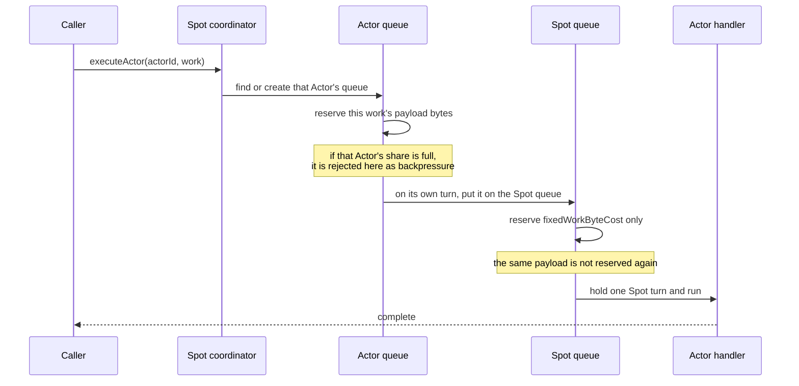

# Serial Executor Layers

[Execution topic table of contents](README.en.md) · [Spec table of contents](../README.en.md) · [Previous: 06. State Ownership And State Lanes](06-state-ownership-and-lanes.en.md)

> This document defines which serial execution unit Spot, Actor, and STREAM session each put
> their work on, who owns that unit's lifetime, and what the entry points that put work on it
> are. The names and entry points set here are used verbatim by all four language runtimes,
> converted only for spelling. Which things may run concurrently under which execution mode is
> owned by the glossary; this document defines only the queue path a piece of work takes under
> that mode.

## 1. Serial Executor Overview

When an application registers a Spot handler, an Actor handler, a timer callback, or a session
callback, the runtime does not run that callback on an arbitrary thread. It lines the callback
up on one **serial execution unit** and runs one at a time. This document sets how many such
lines each layer has, who creates and destroys them, and who decides which line a piece of work
goes on.

| Party | What this document sets |
|---|---|
| Application | Picks the execution mode at registration time. Does not pick which queue its work goes to |
| Runtime | Decides which queue each entry point uses, and owns that queue's lifetime |

[State ownership and state lanes](06-state-ownership-and-lanes.en.md) and this document address
different problems. A state lane is how one component lets only one turn at a time touch **its
own mutable state**; the serial executor here is how **application work** runs in order. Within
one runtime there is a state lane per component that owns state, and a serial executor per Spot,
Actor, and session instance.

Which things may run concurrently under which execution mode is owned by
[User Spot execution mode](../00-foundation/02-glossary.en.md#user-spot-execution-mode) — the
registration option deciding which execution gate the Spot handler, member Actor handlers, and
timer callbacks share. This document sets only the queue path work takes under that mode.

## 2. Layers And Ownership

Three layers each hold a serial execution unit. **Each layer has one coordinator, and that
coordinator owns the lifetime of its own layer's queue together with any subordinate queues it
created.** Without a coordinator, which work runs on which queue scatters across call sites, and
the ordering guarantee can no longer be read off the code.

```text
ZLinkSpotSerialExecutor          ← one coordinator per Spot
 ├── Spot queue                     one
 ├── Actor queue                    one per Actor      ─┐ these go away when
 └── timer queue                    one per timer name ─┘ this Spot goes away

ZLinkActorSerialExecutor         ← one coordinator per Actor
 └── Actor queue                    one                ← no map

ZLinkSessionSerialExecutor       ← one coordinator per session
 └── session queue                  one                ← no map
```

```csharp
// contract pseudocode, not the real API — the real signatures are owned by each language interface.
class ZLinkSpotSerialExecutor            // one per Spot
{
    ZLinkUserSpotExecutionMode executionMode;   // fixed at registration
    ZLinkSerialExecutionQueue  spotQueue;
    ZLinkStateLane             lane;            // owns the two maps below
    Map<ZLinkActorId,   ZLinkSerialExecutionQueue> actorQueues;
    Map<ZLinkTimerName, ZLinkSerialExecutionQueue> timerQueues;
}

class ZLinkActorSerialExecutor           // one per Actor
{
    ZLinkSerialExecutionQueue queue;     // singular — no subordinates, so no map
    ZLinkStateLane            lane;
}
```

- **Spot is the only layer with subordinate queues.** The lifetime of an Actor queue and a timer
  queue is bound to the Spot — when that Spot goes away, that Spot's Actor and timer queues go
  with it. Actor and session have no subordinate whose lifetime is bound to them, so they carry
  no map for finding a queue by name; each instance holds exactly one queue.
- **The queue map is owned by a [state lane](06-state-ownership-and-lanes.en.md).** A
  lookup-only map would be class C1 of 06 §4, but this one is not — closing the coordinator has
  to empty the map and complete every queue in it together, which makes it class **C2**. So a
  state lane owns it rather than a lock, and the map itself stays an ordinary structure.

**Internal check condition** — no code outside a coordinator holds an Actor queue or a timer
queue in a field. The Actor coordinator and the session coordinator have no queue map field.

## 3. Entry Points

**A caller does not know which queue its work goes to.** The coordinator decides. Do not provide
an argument or a surface that lets a caller pick a queue directly — once a caller can pick, §4's
path rules vary per call site and the execution mode's guarantee breaks.

| Coordinator | Entry point | What is submitted | Which queue it runs on |
|---|---|---|---|
| Spot | `executeSpot` | Spot handler work | the Spot queue |
| Spot | `executeActor(actorId)` | that Actor's handler work | the path in §4 |
| Spot | `executeTimer(timerName)` | the timer callback of that name | the path in §4 |
| Spot | `executeLifecycle` | lifetime control such as join, leave, relocation | the Spot queue's lifecycle lane |
| Actor | `executeActor` | that Actor's handler work | its own queue |
| Actor | `executeLifecycle` | that Actor's lifetime control | its own queue's lifecycle lane |
| STREAM session | `executeApplication` | a packet to hand to the session callback | its own queue |
| STREAM session | `executeControl` | a session control command | its own queue |
| STREAM session | `executeInfrastructure` | lower-level work such as a connection state update | its own queue |
| STREAM session | `executeFinal` | the last work before shutdown | its own queue |

The verb is `execute` at all three layers. If `enqueue` and `execute` diverge from layer to
layer, the same call has to be looked up again every time work crosses a layer.

## 4. Spot Execution Mode And Queue Path

Which queues Actor work and timer work pass through depends on the
[User Spot execution mode](../00-foundation/02-glossary.en.md#user-spot-execution-mode).

Only Actor work under `SpotWide` passes through two queues. Both modes guarantee serial
execution; only the number of queues crossed differs.

Which queue each entry point connects to, drawn per mode. The example Spot has two Actors
(A and B) and two timers (`tick` and `beat`).

**`PerActor`** — every entry point has its own queue.

```text
  executeSpot ──────────┐
                        ├──▶ [  Spot queue   ] ──▶ run
  executeLifecycle ─────┘

  executeActor(A) ─────────▶ [ Actor A queue ] ──▶ run   ┐
  executeActor(B) ─────────▶ [ Actor B queue ] ──▶ run   │ five independent queues.
  executeTimer("tick") ────▶ [  tick queue   ] ──▶ run   │ up to five progress at once.
  executeTimer("beat") ────▶ [  beat queue   ] ──▶ run   ┘
```

**`SpotWide`** — everything ends up passing through the single Spot queue.

```text
  executeSpot ──────────────────────────────────┐
  executeLifecycle ─────────────────────────────┤
  executeTimer("tick") ─────────────────────────┤ ← no timer queue is created
  executeTimer("beat") ─────────────────────────┤
                                                │
  executeActor(A) ─▶ [ Actor A queue ] ─────────┤ ← the Actor queue is where
  executeActor(B) ─▶ [ Actor B queue ] ─────────┤   payload bytes are reserved
                                                ▼
                                       [   Spot queue   ] ← reserves the fixed cost only
                                                │
                                                ▼
                                            one at a time
```

An Actor queue does not run the work itself; on its own turn it hands the work to the Spot
queue. That is why only Actor work passes through two queues, and why execution order is
decided by the Spot queue alone.

- **Under `SpotWide`, Actor work goes through the Actor queue first because of the claim, not
  the order.** Execution order is already settled by the upper Spot queue alone. What the Actor
  queue does is **stop the next record of an Actor that has yielded from running** — owned by
  [Handler Turn And Execution Gate "3. Gate And Claim On `Yield`"](02-handler-turn-and-execution-gate.en.md#3-gate-and-claim-on-yield):
  when a `SpotWide` member Actor yields, it hands back only the shared Spot gate and keeps its
  Actor queue claim. Without the Actor queue, that Actor's next record runs while the gate is
  handed back, and that Actor's handler overlaps itself.
- **Merging the queues also breaks relocation.**
  [02 "1. Separating Queue From Gate"](02-handler-turn-and-execution-gate.en.md#1-separating-queue-from-gate)
  names "merging the queues into one under `SpotWide`" as a wrong structure — relocation has to
  separate each Actor's remaining work, and once mixed it cannot be separated.
- **Timer work crosses one queue.** A timer callback carries no application payload, so it has
  no per-Actor bytes to count, and under `SpotWide` the Spot queue already puts everything in
  one line — so there is no reason to create a per-timer-name queue.

Here is the path one piece of Actor work takes under `SpotWide`.



Only the normal path is drawn. The backpressure branch where a reservation is rejected is
covered by §5, and the branch where an owner that has held a turn too long yields is covered by
§6.4.

The two diagrams above, as code. One entry point carries the whole §4 path decision, and the
caller never sees a queue.

```csharp
// contract pseudocode, not the real API — the real signatures are owned by each language interface.
ExecuteActor(actorId, work, payloadBytes)
{
    // the queue map is owned by a state lane (§2). no lock is taken.
    actorQueue = lane.Run(() => GetOrCreateActorQueue(actorId));

    if (executionMode == PerActor)
    {
        // ends at the one Actor queue. progresses overlapped with other Actors.
        actorQueue.EnqueueWithPayloadBytes(work, payloadBytes);
        return;
    }

    // SpotWide — the Actor queue reserves the payload bytes, and on its own turn
    // hands the work to the Spot queue. execution order is decided by the Spot queue.
    actorQueue.EnqueueWithPayloadBytes(
        () => spotQueue.Enqueue(work),   // the same payload is not reserved again (§5)
        payloadBytes);
}

ExecuteTimer(timerName, work)
{
    if (executionMode == SpotWide)
    {
        // no timer queue is created. the Spot queue already puts everything in one line.
        spotQueue.Enqueue(work);
        return;
    }

    timerQueue = lane.Run(() => GetOrCreateTimerQueue(timerName));
    timerQueue.Enqueue(work);            // no payload, so charged at fixedWorkByteCost
}
```

## 5. What Each Queue Reserves

An owner queue (mailbox) is limited on **two axes — item count and total queued bytes** — and
that contract is owned by
[Framework API "11. Handler Execution Objects And Dependency Lifetime"](../00-foundation/06-framework-api.en.md).
It is not redefined here; only the two things that bear on this document's queue layout are.

**Its accounting boundary differs from the
[Application job queue](../00-foundation/02-glossary.en.md#application-job-queue) permit.** The
permit is returned right before the callback's first instruction, while the mailbox reservation
is returned after the handler finishes — the memory work in flight holds is not yet released. The
two limits therefore cannot stand in for each other (04 §1).

When Actor work crosses two queues under `SpotWide`, **the lower Actor queue reserves that work's
payload bytes, and the upper Spot queue reserves only `fixedWorkByteCost`, a fixed cost
independent of payload size.** The same payload is not reserved on both. Reserving twice means
work that passed below is caught again above, so the per-Actor ceiling stops being the real
ceiling, and the Spot queue fills ahead of the real execution load.

**Internal check condition** — on the `SpotWide` Actor path, nothing passes payload bytes as an
argument when submitting to the upper Spot queue.

## 6. The Serial Queue Primitive

`ZLinkSerialExecutionQueue` does not only run work in order. **Rejecting work once capacity is
exceeded, and stopping one owner from holding on too long, are part of its own contract.**
Leaving those to callers means each call site handles them differently, and then no real-time
guarantee — that latency is bounded under any load — can be stated.

### 6.1 Policy

The following values are injected as a policy object, `ZLinkExecutionLanePolicy`. They are not
baked into the queue as constants, because Spot, Actor, and session use different values.

These set §5's owner FIFO ceilings; they are not values that limit the rate of inbound work.
Admission for ordinary ingress is owned by
[04](04-application-job-queue-and-backpressure.en.md).

The following is contract pseudocode explaining the meaning; it is not the real API. The exact
signature is defined by each language's exact interface.

```text
ZLinkExecutionLanePolicy {
    applicationMessageCapacity   // ceiling on work items the application lane holds at once
                                 //   (count, > 0)
    applicationByteCapacity      // ceiling on payload the application lane reserves at once
                                 //   (bytes, > 0, encoded payload)
    lifecycleMessageCapacity     // ceiling on work items the lifecycle lane holds at once
                                 //   (count, > 0)
    lifecycleByteCapacity        // ceiling on size the lifecycle lane reserves at once
                                 //   (bytes, > 0)
    fixedWorkByteCost            // fixed size charged to one work item carrying no payload
                                 //   (bytes, >= 0). used by timer work and by §5's upper
                                 //   Spot queue
    lifecycleBurstLimit          // how many lifecycle items may consecutively overtake
                                 //   application work (count, > 0). past this count, one
                                 //   application item runs
    ownerTimeBudget              // how long one owner may consecutively hold a turn
                                 //   (milliseconds, > 0)
}
```

### 6.2 Entry Points

```text
enqueue(work)                    // application lane; reserved at fixedWorkByteCost
enqueueWithPayloadBytes(work, n) // application lane; reserved at the actual n payload bytes
enqueueLifecycle(work)           // lifecycle lane; overtakes queued application work
enqueueBarrierNext(work)         // right after the current turn, ahead of queued application work
isCurrent()                      // does the calling thread hold this queue's turn
awaitQuiescence()                // wait until all queued work has finished
close()                          // accept no new submissions; finish what was already accepted
```

### 6.3 The Atomic Extent Of Capacity Decision And Sequence Issue

The capacity decision, the sequence-number issue, and the queue insertion **either all happen or
none happen.** For one caller's submission these three are not split apart.

Do not substitute a concurrent queue data structure that handles the three separately. Split
apart, two callers can see the same headroom, both pass the decision, and both insert, exceeding
the ceiling; or work that took a number first can be inserted later, inverting the order. These
three must move together, which makes them class C2 of
[06 §4](06-state-ownership-and-lanes.en.md#4-state-classifications-and-how-to-tell-them-apart).

### 6.4 Fairness

When the current owner holds longer than `ownerTimeBudget`, it **returns its remaining work to
ready and cuts its own turn.** Without this, one owner with a lot of work piled up can hold the
execution resource indefinitely, and then no bound can be stated for when other owners on the
same node start.

**Which owner it goes to next is not decided by this queue.** One queue knows only its own
owner's work. The order among owners returned to ready is owned by the scheduler contract in
[Framework API "11. Handler Execution Objects And Dependency Lifetime"](../00-foundation/06-framework-api.en.md) —
this document defines only **cutting the turn** so that contract can decide the order. The bound
is checked at handler boundaries only; a single handler running past it is outside this contract.

### 6.5 Who Starts The Loop

**There is no thread per owner.** A queue normally runs nothing at all; the moment work arrives,
the submitter wakes the drain loop. If it is already running, nobody wakes it.

That decision is the heart of the submit path.

```csharp
// contract pseudocode, not the real API — the real signatures are owned by each language interface.
Enqueue(work)
{
    bool startDrain;

    lock (gate)                      // §6.3 — room decision, sequence issue, insertion in one section
    {
        if (!HasRoom(lane)) return Rejected;
        queue.Add(work, nextSequence++);

        // if someone is already driving this queue, enqueuing is the whole job.
        // that loop will pick this item up on its turn.
        startDrain = !draining && !drainScheduled;
        if (startDrain) drainScheduled = true;
    }

    if (startDrain) ScheduleDrain();  // wake it outside the section. starting inside means
                                      //   execution begins while still holding the section
    return Accepted;
}
```

- **Do not start a loop that is already running.** Starting one per submission drives the same
  queue from two places, and "one at a time" breaks.
- **Whoever puts the first item into an empty queue must wake it.** If nobody does, that work
  does not run until someone else happens to submit.
- **The wake-up call happens outside the critical section.** Starting inside it can begin
  executing work while that section is still held.

**Where the loop runs is language discretion.** Post it to a separate scheduler, hang it on the
event loop's next turn, or throw it at a thread pool — it does not matter. The observable result
matches because under any of these exactly one party drives that queue at a time and items come
out in submission order. The criterion for checking this is "Concurrency and order per execution
mode" in §10.

**What this pattern is called.** The overall shape — enqueue an invocation and let a scheduler
take them one at a time — is **Active Object** in the pattern literature (Lavender & Schmidt,
PLoP 1995 · *Pattern Languages of Program Design 2*, 1996). That original gives each object its
own scheduler thread, though. Running on shared resources with no thread per owner, and the flag
decision that splits "drive it yourself" from "just publish" in order to do so, belong to the
**combining** lineage — Oyama, Taura, and Yonezawa, *Executing parallel programs with
synchronization bottlenecks efficiently* (1999), and flat combining (Hendler, Incze, Shavit, and
Tzafrir, SPAA 2010). That all four language runtimes arrived at the same shape without
referencing each other is not coincidence; each followed this lineage.

### 6.6 The Loop That Drives Turns

Once woken, the loop **admits only one caller at a time.** It takes one work item, runs it on a
turn, and moves to the next when it finishes. §6.4's yielding is implemented as this loop
cutting its slice.

```csharp
// contract pseudocode, not the real API — the real signatures are owned by each language interface.
Drain()
{
    // this gate is what guarantees "one at a time". if another call is already
    // inside, just return.
    if (!TryEnterDrain()) return;

    sliceStartedAt = Now();
    while (TryTakeNext(out work))      // prefers lifecycle, but honors lifecycleBurstLimit (§6.1)
    {
        turn   = new Turn();
        result = RunOnTurn(work, turn);          // §6.7

        if (result == Completed) Release(work);
        // Suspended means the work handed the turn back. its completion is handled
        // later, and this loop moves straight on to the next work item.

        if (Now() - sliceStartedAt >= policy.ownerTimeBudget)
            break;                     // §6.4 — this is where the owner yields
    }
    ExitDrain();

    // whatever was cut off resumes on a new slice.
    if (HasQueuedWork()) ScheduleDrain();
}
```

### 6.7 How One Work Item Is Driven, And Handing The Turn Back

One work item is an execution unit that stops at its first waiting point and resumes afterwards —
in C# the compiler turns an `async` method into exactly such a state machine. **The drain loop
only starts that state machine, then decides whether to wait for it to finish or to take the turn
back partway.**

Being able to hand the turn back matters because of external calls. If work holds the turn while
waiting for a remote reply, the whole queue stops for that long. What to hand the turn back for
and what to hold it through is owned by
[Handler Turn And Execution Gate "3. Gate And Claim On `Yield`"](02-handler-turn-and-execution-gate.en.md#3-gate-and-claim-on-yield)
and [Async And Yield](../00-foundation/02-glossary.en.md#async-yield). What is shown here is only
how that hand-back is driven.

```csharp
// contract pseudocode, not the real API — the real signatures are owned by each language interface.
// drain loop side — start the work and wait for one of two endings.
RunOnTurn(work, turn)
{
    Turn.Current = turn;                   // plant "the turn we are on" for the duration
    operation = work();                    // start the state machine — runs synchronously
                                           //   up to the first waiting point

    if (operation.IsCompleted) return Completed;   // finished without ever waiting

    // whichever arrives first decides the ending.
    //   operation    — the work finished
    //   turn.Yielded — the work handed the turn back to wait on an external call
    if (WaitAny(operation, turn.Yielded) == turn.Yielded)
        return Suspended;                  // the loop moves on to the next work item

    Await(operation);
    return Completed;
}
```

The handing-back side is where work wraps an external call.

```csharp
// contract pseudocode, not the real API — the real signatures are owned by each language interface.
// work side — wrapping an external call.
YieldFrameworkCall(submit)
{
    operation = submit();
    if (operation.IsCompleted)
        return operation.Result;      // never waited, so nothing to hand back

    turn.SignalYielded();             // → the drain loop moves on to the next work item
    result = Await(operation);

    // arriving results do not resume execution on the spot. the work queues up again
    // for a turn, which is what keeps that queue "one at a time".
    AwaitResumePermit();
    return result;
}
```

**A handed-back turn must be taken again before execution resumes.** Resuming right where the
result arrived would put two work items on that queue at the same moment, breaking §6's serial
guarantee.

**Internal check condition** — no resume path at a hand-back point continues directly without
going through a queue submission.

## 7. The Turn Boundary For State Reads

State values needed while handling one message are **read together in one state lane turn and
carried as an immutable snapshot.** Do not create a separate turn per read.

```csharp
// contract pseudocode, not the real API — the real signatures are owned by each language interface.
snapshot = lane.Run(() => new ActorStateSnapshot(
    registry.Actor(actorId),        // all three read in one turn.
    registry.Context(actor),        // read separately, the Actor can vanish in between.
    registry.ActorType(actorId)));
```

Splitting reads into separate turns degrades two things at once. The values come from different
points in time, so old and new values mix within the handling of one message, and that one
message waits for a turn to complete several times over.

Do not read the same value twice on one handling path. Carry the first result as it is.

Name the snapshot type `<Target>StateSnapshot`.

**Internal check condition** — no handling path reads the same registry value twice.

## 8. Check The Ownership Premise

Even where an upper serial execution unit guarantees "this is already serial", **do not believe
that premise unchecked.** When the premise breaks and nobody is checking, it surfaces as a
deadlock rather than an exception, and which call broke the premise is then hard to find in the
code.

| Position | Check |
|---|---|
| component entry boundary | `isOnLane` — is this running on that lane right now |
| a point where reentrancy is possible | `throwIfReentrant` — is this re-entering an already held turn |

Required in debug builds. Optional in release builds, except for **components where reentrancy
actually occurred** — those that used a recursive lock — which keep it in release too.

**Internal check condition** — every position that premises upper serial ownership carries an
`isOnLane` or `throwIfReentrant` call.

## 9. Language Mapping

Use the names set in §2, §3, and §6; convert only the spelling to each language's idiom.

| Language | Type | Method | Field |
|---|---|---|---|
| .NET | `ZLinkSpotSerialExecutor` | `PascalCase`, `Async` suffix when asynchronous | `_camelCase` |
| java | `ZLinkSpotSerialExecutor` | `camelCase` | `camelCase` |
| cpp | `spot_serial_executor_t` | `snake_case` | `_snake_case` |
| node | `ZLinkSpotSerialExecutor` | `camelCase` | `camelCase` |

Do not rename in a way that changes meaning. Writing `executeActor` as `execute_actor` in cpp is
spelling conversion; writing it as `dispatch_actor` is inventing a different name.

All four languages carry §4's two-stage structure. node's `executeActor` too takes a per-Actor
mailbox claim (`actorClaims.submit(actorId, …)`) first and only then uses the shared Spot
execution unit — it does not skip the Actor queue; it is exactly §4's "a queue per Actor, a gate
shared by the Spot".

## 10. Verification Requirements

The following are checked using the public surface only (the §3 entry-point calls and their
return values, backpressure rejection, the order and timing in which handlers and callbacks ran,
and the exception a reentrant call receives). Each item maps to one test.

**Submission path**

- Registering a Spot handler, an Actor handler, a timer callback, or a session callback gives
  the application no means of naming which queue that work will run on.

**Concurrency and order per execution mode**

- In a User Spot registered `PerActor`, submitting long-running work to two different Actors
  results in the two handlers running overlapped.
- In a User Spot registered `SpotWide`, the same submission results in the second handler
  starting only after the first has finished.
- Work submitted back to back to the same Actor runs in submission order under both modes.
- Under `PerActor`, callbacks of different timer names run overlapped, and callbacks of the same
  timer name run in submission order.

**Capacity and backpressure**

- Piling local submissions on one Actor inside the same runtime until it fills
  `applicationByteCapacity` rejects only submissions to that Actor; submissions to other Actors
  in the same Spot are still accepted.
- Actor packets arriving from a remote node are still delivered to an Actor that has filled that
  ceiling — ordinary ingress is not counted again at the owner queue (§5).
- Work submitted with `enqueueLifecycle` runs ahead of already queued application work, and the
  consecutive overtaking stops at `lifecycleBurstLimit` so one application item runs.

**Fairness**

- When an owner with a lot of work piled up holds past `ownerTimeBudget`, its remaining work
  does not keep running in one stretch; its turn is cut. The order among owners after that is
  owned by the scheduler contract in
  [Framework API §11](../00-foundation/06-framework-api.en.md).

**A yielded Actor**

- While a member Actor's handler has yielded under `SpotWide`, the next record addressed to that
  same Actor does not run, while other Actor handlers, the Spot handler, and timers in the same
  Spot do proceed (§4).

**Point-in-time agreement of state reads**

- Changing an Actor's registration information while one message is being handled does not
  result in the pre-change and post-change values being observed mixed within that one handling.

**Reentrancy**

- Synchronously waiting for the completion of the same coordinator's `execute*` from inside work
  that coordinator is running does not hang; an exception is observed immediately at that call
  site.

**Cross-language equivalence**

- The items above produce the same result in .NET, java, cpp, and node. In node, "run
  overlapped" is observed as two async handlers making progress alternately across an `await`.

---

[Execution topic table of contents](README.en.md) · [Spec table of contents](../README.en.md) · [Previous: 06. State Ownership And State Lanes](06-state-ownership-and-lanes.en.md)
