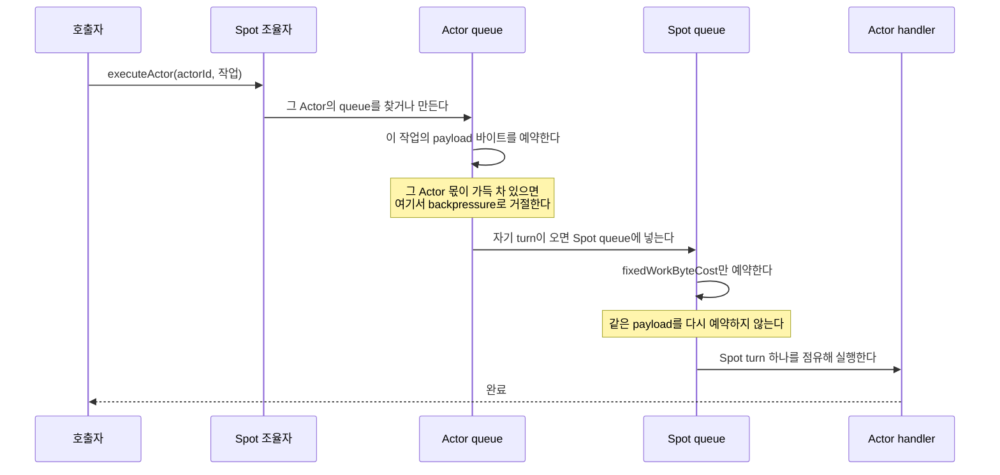

# 직렬 실행기 계층

[Execution 주제 목차](README.ko.md) · [스펙 목차](../README.ko.md) · [이전: 06. 상태 소유와 state lane](06-state-ownership-and-lanes.ko.md)

> 이 문서는 Spot·Actor·STREAM session이 각자의 작업을 어떤 직렬 실행 단위에 올리는지,
> 누가 그 단위의 수명을 소유하는지, 그리고 그 단위에 작업을 넣는 진입점이 무엇인지
> 정의한다. 여기서 정하는 이름과 진입점은 네 언어 runtime이 표기만 바꿔 그대로 쓴다.
> 어떤 실행 mode에서 무엇이 동시에 실행될 수 있는지는 용어집이 소유하며, 이 문서는 그
> mode에서 작업이 어느 queue를 지나는지를 정의한다.

## 1. 직렬 실행기 개요

Application이 Spot handler·Actor handler·timer callback·session callback을 등록하면,
runtime은 그 callback을 아무 thread에서나 실행하지 않고 **직렬 실행 단위** 하나에 줄을
세워 한 번에 하나씩 실행한다. 이 문서는 그 줄이 계층마다 몇 개이고 누가 그것을 만들고
없애는지, 그리고 작업을 어느 줄에 넣을지 누가 정하는지를 규정한다.

| 주체 | 이 문서에서 정하는 것 |
|---|---|
| Application | 실행 mode를 등록 시점에 고른다. 자기 작업이 어느 queue로 갈지는 고르지 않는다 |
| Runtime | 진입점마다 어느 queue를 쓸지 정하고, 그 queue의 수명을 소유한다 |

[상태 소유와 state lane](06-state-ownership-and-lanes.ko.md)과 이 문서는 다른 문제를
다룬다. state lane은 컴포넌트 하나가 **자기 mutable 상태**를 한 번에 한 turn만 만지게 하는
수단이고, 이 문서의 직렬 실행기는 **application 작업**을 순서대로 돌리는 수단이다. 한
runtime 안에 state lane은 상태를 소유하는 컴포넌트마다 하나씩 있고, 직렬 실행기는
Spot·Actor·session 인스턴스마다 하나씩 있다.

실행 mode에 따라 무엇을 동시에 실행할 수 있는지는
[User Spot execution mode](../00-foundation/02-glossary.ko.md#user-spot-execution-mode)가
소유한다 — Spot handler·member Actor handler·timer callback이 어느 execution gate를 공유할지
정하는 등록 옵션이다. 이 문서는 그 mode에서 한 작업이 지나는 queue 경로만 정한다.

## 2. 계층과 소유

세 계층이 각각 직렬 실행 단위를 갖는다. **각 계층에는 조율자가 하나 있고, 그 조율자가
자기 계층의 queue와 자신이 만든 하위 queue의 수명을 함께 소유한다.** 조율자가 없으면
어느 작업이 어느 queue에서 도는지가 호출 지점마다 흩어져, 순서 보장을 코드에서 읽을 수
없게 된다.

```text
ZLinkSpotSerialExecutor          ← Spot 하나마다 조율자 하나
 ├── Spot queue                     하나
 ├── Actor queue                    Actor마다 하나    ─┐ 이 Spot이 사라질 때
 └── timer queue                    timer 이름마다 하나 ─┘ 함께 사라진다

ZLinkActorSerialExecutor         ← Actor 하나마다 조율자 하나
 └── Actor queue                    하나              ← 맵이 없다

ZLinkSessionSerialExecutor       ← session 하나마다 조율자 하나
 └── session queue                  하나              ← 맵이 없다
```

```csharp
// contract pseudocode이며 실제 API가 아니다 — 실제 시그니처는 언어별 interface가 소유한다.
class ZLinkSpotSerialExecutor            // Spot 하나마다 하나
{
    ZLinkUserSpotExecutionMode executionMode;   // 등록 때 고정된다
    ZLinkSerialExecutionQueue  spotQueue;
    ZLinkStateLane             lane;            // 아래 두 map을 소유한다
    Map<ZLinkActorId,   ZLinkSerialExecutionQueue> actorQueues;
    Map<ZLinkTimerName, ZLinkSerialExecutionQueue> timerQueues;
}

class ZLinkActorSerialExecutor           // Actor 하나마다 하나
{
    ZLinkSerialExecutionQueue queue;     // 단수 — 하위 소유 대상이 없어 map이 없다
    ZLinkStateLane            lane;
}
```

- **하위 queue를 갖는 계층은 Spot뿐이다.** Actor queue와 timer queue의 수명이 Spot에
  묶여 있기 때문이다 — 그 Spot이 사라지면 그 Spot의 Actor queue와 timer queue도 함께
  사라진다. Actor와 session에는 수명이 자신에게 묶인 하위 대상이 없으므로 queue를 이름으로
  찾는 map을 두지 않고, 인스턴스마다 queue 하나만 갖는다.
- **queue map은 [state lane](06-state-ownership-and-lanes.ko.md)이 소유한다.** 이 map은
  이름으로 queue를 찾기만 하는 collection이므로 06 §4의 C1에 해당하고, lock으로 지키지
  않는다.

**내부 확인 조건** — 조율자 밖에서 Actor queue나 timer queue를 field로 들고 있는 코드가
없다. Actor 조율자와 session 조율자에는 queue map field가 없다.

## 3. 진입점

**호출자는 자기 작업이 어느 queue로 가는지 모른다.** 조율자가 정한다. 호출자가 queue를
직접 고르는 인자나 표면을 두지 않는다 — 고를 수 있게 하면 §4의 경로 규칙이 호출 지점마다
달라져 실행 mode의 보장이 깨진다.

| 조율자 | 진입점 | 무엇을 제출하는가 | 어느 queue에서 도는가 |
|---|---|---|---|
| Spot | `executeSpot` | Spot handler 작업 | Spot queue |
| Spot | `executeActor(actorId)` | 그 Actor의 handler 작업 | §4의 경로 |
| Spot | `executeTimer(timerName)` | 그 이름의 timer callback | §4의 경로 |
| Spot | `executeLifecycle` | join·leave·relocation 같은 수명 제어 | Spot queue의 lifecycle lane |
| Actor | `executeActor` | 그 Actor의 handler 작업 | 자기 queue |
| Actor | `executeLifecycle` | 그 Actor의 수명 제어 | 자기 queue의 lifecycle lane |
| STREAM session | `executeApplication` | session callback에 전달할 packet | 자기 queue |
| STREAM session | `executeControl` | session 제어 명령 | 자기 queue |
| STREAM session | `executeInfrastructure` | 연결 상태 갱신 같은 하부 작업 | 자기 queue |
| STREAM session | `executeFinal` | 종료 직전 마지막 작업 | 자기 queue |

동사는 세 계층 모두 `execute`다. 계층마다 `enqueue`와 `execute`가 갈리면 같은 뜻의 호출을
계층을 옮길 때마다 다시 찾아야 한다.

## 4. Spot 실행 mode와 queue 경로

[User Spot execution mode](../00-foundation/02-glossary.ko.md#user-spot-execution-mode)에
따라 Actor 작업과 timer 작업이 지나는 queue가 달라진다.

`SpotWide`에서 Actor 작업만 queue 두 개를 지난다. 두 mode 모두 직렬 실행이 보장되며 지나는
queue 수만 다르다.

진입점이 어느 queue에 연결되는지를 mode별로 그리면 다음과 같다. Actor 둘(A·B)과 timer
둘(`tick`·`beat`)이 있는 Spot을 예로 든다.

**`PerActor`** — 진입점마다 자기 queue가 따로 있다.

```text
  executeSpot ──────────┐
                        ├──▶ [  Spot queue   ] ──▶ 실행
  executeLifecycle ─────┘

  executeActor(A) ─────────▶ [ Actor A queue ] ──▶ 실행   ┐
  executeActor(B) ─────────▶ [ Actor B queue ] ──▶ 실행   │ 다섯 queue가 서로 독립이다.
  executeTimer("tick") ────▶ [  tick queue   ] ──▶ 실행   │ 동시에 다섯까지 진행된다.
  executeTimer("beat") ────▶ [  beat queue   ] ──▶ 실행   ┘
```

**`SpotWide`** — 모든 작업이 마지막에 Spot queue 한 줄을 지난다.

```text
  executeSpot ──────────────────────────────────┐
  executeLifecycle ─────────────────────────────┤
  executeTimer("tick") ─────────────────────────┤ ← timer queue를 만들지 않는다
  executeTimer("beat") ─────────────────────────┤
                                                │
  executeActor(A) ─▶ [ Actor A queue ] ─────────┤ ← Actor queue에서
  executeActor(B) ─▶ [ Actor B queue ] ─────────┤   payload 바이트를 예약한다
                                                ▼
                                       [   Spot queue   ] ← 고정 비용만 예약한다
                                                │
                                                ▼
                                          한 번에 하나 실행
```

Actor queue는 작업을 바로 실행하지 않고, 자기 turn이 오면 Spot queue로 넘긴다. 그래서 Actor
작업만 queue 둘을 지나고, 실행 순서는 Spot queue 하나가 정한다.

- **`SpotWide`에서 Actor 작업이 queue 두 개를 지나는 이유는 순서가 아니라 admission이다.**
  순서는 위 Spot queue 하나로 이미 끝난다. 남는 문제는 물량이 몰렸을 때 **누구의 작업을
  거절할 것인가**이고, 그것은 queue 하나로는 Actor별로 나눌 수 없다(§5).
- **timer 작업은 queue 하나만 지난다.** timer callback은 application payload를 나르지 않아
  Actor처럼 따로 셀 바이트가 없고, `SpotWide`의 Spot queue가 이미 전체를 한 줄로 세우므로
  timer 이름별 queue를 만들 이유가 없다.

`SpotWide`에서 Actor 작업 하나가 지나는 경로는 다음과 같다.



정상 경로만 그렸다. 예약이 거절되는 backpressure 분기는 §5가, 한 소유자가 turn을 오래
점유했을 때 양보하는 분기는 §6.4가 설명한다.

위 두 그림을 코드로 옮기면 다음과 같다. 진입점 하나가 §4의 경로 판정을 전부 안고 있고,
호출자에게는 queue가 보이지 않는다.

```csharp
// contract pseudocode이며 실제 API가 아니다 — 실제 시그니처는 언어별 interface가 소유한다.
ExecuteActor(actorId, work, payloadBytes)
{
    // queue map은 state lane이 소유한다(§2). lock을 잡지 않는다.
    actorQueue = lane.Run(() => GetOrCreateActorQueue(actorId));

    if (executionMode == PerActor)
    {
        // Actor queue 하나에서 끝난다. 다른 Actor와 겹쳐 진행된다.
        actorQueue.EnqueueWithPayloadBytes(work, payloadBytes);
        return;
    }

    // SpotWide — Actor queue가 payload 바이트를 예약하고, 자기 turn이 오면
    // 작업을 Spot queue로 넘긴다. 실행 순서는 Spot queue 하나가 정한다.
    actorQueue.EnqueueWithPayloadBytes(
        () => spotQueue.Enqueue(work),   // 같은 payload를 다시 예약하지 않는다(§5)
        payloadBytes);
}

ExecuteTimer(timerName, work)
{
    if (executionMode == SpotWide)
    {
        // timer queue를 만들지 않는다. Spot queue가 이미 전체를 한 줄로 세운다.
        spotQueue.Enqueue(work);
        return;
    }

    timerQueue = lane.Run(() => GetOrCreateTimerQueue(timerName));
    timerQueue.Enqueue(work);            // payload가 없어 fixedWorkByteCost로 회계한다
}
```

## 5. Actor마다 따로 받아들이는 이유

`SpotWide`에서 실행 순서는 Spot queue 하나가 정한다. 그런데도 Actor 작업을 Actor queue에 먼저
거치게 하는 것은 **줄을 세우는 일과 받아들일지 정하는 일이 다른 문제**이기 때문이다.

Actor queue는 직렬이다. 그 Actor의 작업 하나가 Spot queue로 올라가 끝날 때까지 다음 작업은
Actor queue에서 기다린다. 그래서 **Spot queue에 올라와 있는 그 Actor의 작업은 언제나 최대
한 건이고, 밀린 물량은 전부 그 Actor의 queue에 남는다.**

```text
  Actor A에 100건이 몰렸을 때

  [ Actor A queue ]  99건 대기 ──┐        ← A의 상한에서 걸린다
                                 ├─▶ [ Spot queue ]  A 1건 · B 1건 · Spot 작업 …
  [ Actor B queue ]  0건 ────────┘        ← B는 영향을 받지 않는다
```

Actor queue가 없으면 A의 100건이 그대로 Spot queue의 상한을 먹는다. 그러면 같은 Spot의 B와
Spot handler 작업까지 함께 거절된다 — 몰린 것은 A인데 막히는 것은 전부다. Actor마다 정한
상한도 그때는 실제 상한이 아니게 된다. 모두가 같은 한 칸을 나눠 쓰기 때문이다.

이 구조가 성립하려면 두 queue가 같은 것을 세면 안 된다. **아래 Actor queue가 그 작업의 실제
payload 바이트를 예약하고, 위 Spot queue는 payload 크기와 무관한 고정 비용
`fixedWorkByteCost`만 예약한다.** 위에서 payload를 다시 세면 아래에서 통과한 작업이 위에서
또 걸려 Actor별 상한이 무의미해지고, Spot queue는 실제 실행 부하보다 이르게 가득 찬다.

`PerActor`에서는 Actor queue가 실행 순서도 함께 진다. 두 mode에서 Actor queue가 하는 일 중
겹치는 것이 admission이고, `SpotWide`에서는 그것만 남는다.

**내부 확인 조건** — `SpotWide`의 Actor 경로에서 위 Spot queue에 제출할 때 payload 바이트를
인자로 넘기는 자리가 없다.

## 6. 직렬 queue primitive

`ZLinkSerialExecutionQueue`는 작업을 순서대로 실행하는 것만이 아니라, **수용량을 넘겼을 때
거절하는 것과 한 소유자가 오래 점유하지 못하게 하는 것까지 자기 계약으로 갖는다.** 이
책임을 호출자에게 남기면 호출 지점마다 다르게 처리되고, 그러면 어떤 부하에서도 지연 상한이
있다는 실시간 보장을 세울 수 없다.

### 6.1 정책

다음 값은 정책 객체 `ZLinkExecutionLanePolicy`로 주입받는다. queue 안에 상수로 박지
않는다 — Spot·Actor·session이 서로 다른 값을 쓰기 때문이다.

다음은 의미를 설명하는 contract pseudocode이며 실제 API가 아니다. 정확한 signature는 언어별
exact interface가 정의한다.

```text
ZLinkExecutionLanePolicy {
    applicationMessageCapacity   // application lane이 동시에 담는 작업 수 상한 (건, > 0)
    applicationByteCapacity      // application lane이 동시에 예약하는 payload 크기 상한
                                 //   (byte, > 0, encoded payload 기준)
    lifecycleMessageCapacity     // lifecycle lane이 동시에 담는 작업 수 상한 (건, > 0)
    lifecycleByteCapacity        // lifecycle lane이 동시에 예약하는 크기 상한 (byte, > 0)
    fixedWorkByteCost            // payload를 나르지 않는 작업 하나가 차지하는 고정 크기
                                 //   (byte, >= 0). timer 작업과 §5의 위 Spot queue가 쓴다
    lifecycleBurstLimit          // lifecycle 작업이 application 작업을 연속으로 앞지를 수 있는
                                 //   최대 건수 (건, > 0). 이 수를 넘기면 application 작업이
                                 //   한 건 실행된다
    ownerTimeBudget              // 한 소유자가 연속으로 turn을 점유할 수 있는 시간
                                 //   (밀리초, > 0)
}
```

### 6.2 진입점

```text
enqueue(작업)                    // application lane. fixedWorkByteCost로 예약한다
enqueueWithPayloadBytes(작업, n) // application lane. 실제 payload n byte로 예약한다
enqueueLifecycle(작업)           // lifecycle lane. 대기 중인 application 작업을 앞지른다
enqueueBarrierNext(작업)         // 현재 turn 직후, 줄 서 있는 application 작업보다 먼저
isCurrent()                      // 호출한 thread가 이 queue의 turn을 점유하고 있는가
awaitQuiescence()                // 줄 선 작업이 모두 끝날 때까지 기다린다
close()                          // 새 제출을 받지 않고 이미 받은 작업을 끝낸다
```

### 6.3 수용량 판정과 순서 발급의 원자적 범위

수용량 판정·순서 번호 발급·queue 삽입 셋은 **전부 일어나거나 전혀 일어나지 않는다.**
호출자 하나의 제출에서 이 셋이 쪼개지지 않는다.

세 동작을 각각 별개로 처리하는 동시성 queue 자료구조로 치환하지 않는다. 쪼개면 두 호출자가
같은 여유를 보고 함께 판정을 통과한 뒤 둘 다 삽입해 상한을 넘기거나, 번호를 먼저 받은
작업이 나중에 삽입돼 순서가 뒤집힌다. 이 셋은 함께 움직여야 하는 값이므로
[06 §4의 C2](06-state-ownership-and-lanes.ko.md#4-상태-분류와-판별-기준)에 해당한다.

### 6.4 공정성

현재 소유자가 turn을 `ownerTimeBudget`보다 오래 점유하면, 그 소유자의 남은 작업을 계속
실행하지 않고 다음 소유자에게 넘긴다. 이 장치가 없으면 작업을 많이 쌓아 둔 소유자 하나가
queue를 계속 차지할 수 있고, 그러면 같은 queue에 걸린 다른 작업이 언제 시작되는지 상한을
말할 수 없다.

### 6.5 turn을 구동하는 loop

queue에 줄 선 작업을 실제로 실행하는 것은 **한 번에 하나만 들어가는 배출 loop**다. 이 loop가
작업 하나를 꺼내 turn 위에서 돌리고, 끝나면 다음 작업으로 넘어간다. §6.4의 양보는 이 loop가
slice를 끊는 것으로 구현된다.

```csharp
// contract pseudocode이며 실제 API가 아니다 — 실제 시그니처는 언어별 interface가 소유한다.
Drain()
{
    // 이 gate가 "한 번에 하나"를 보장한다. 이미 다른 호출이 돌고 있으면 그냥 돌아간다.
    if (!TryEnterDrain()) return;

    sliceStartedAt = Now();
    while (TryTakeNext(out work))      // lifecycle을 먼저 고르되 lifecycleBurstLimit을 지킨다(§6.1)
    {
        turn   = new Turn();
        result = RunOnTurn(work, turn);          // §6.6

        if (result == Completed) Release(work);
        // Suspended면 작업이 turn을 반납한 것이다. 완료는 나중에 처리하고
        // 이 loop는 바로 다음 작업으로 넘어간다.

        if (Now() - sliceStartedAt >= policy.ownerTimeBudget)
            break;                     // §6.4 — 여기서 소유자가 양보한다
    }
    ExitDrain();

    // 끊고 나온 남은 작업은 새 slice에서 이어 돈다.
    if (HasQueuedWork()) ScheduleDrain();
}
```

### 6.6 작업 하나를 구동하는 방법과 turn 반납

작업 하나는 첫 대기 지점에서 멈췄다가 이어서 도는 실행 단위다 — C#에서는 `async` 메서드를
컴파일러가 그런 상태 기계로 만든다. **배출 loop는 그 상태 기계를 시작만 하고, 끝날 때까지
기다릴지 중간에 turn을 돌려받을지를 판정한다.**

turn을 반납할 수 있어야 하는 이유는 외부 호출 때문이다. 작업이 원격 응답을 기다리는 동안
turn을 쥐고 있으면 그 queue 전체가 그 시간만큼 멈춘다. 무엇을 기다릴 때 반납하고 무엇을
기다릴 때 유지하는지는
[Handler turn과 execution gate 「3. `Yield` 시 gate와 claim」](02-handler-turn-and-execution-gate.ko.md#3-yield-시-gate와-claim)과
[Async와 Yield](../00-foundation/02-glossary.ko.md#async-yield)가 소유한다. 여기서는 그 반납을
어떻게 구동하는지만 보인다.

```csharp
// contract pseudocode이며 실제 API가 아니다 — 실제 시그니처는 언어별 interface가 소유한다.
// 배출 loop 쪽 — 작업을 시작하고 두 결말 중 하나를 기다린다.
RunOnTurn(work, turn)
{
    Turn.Current = turn;                   // 실행 중 "지금 이 turn"을 심는다
    operation = work();                    // 상태 기계 시작 — 첫 대기 지점까지 동기 실행

    if (operation.IsCompleted) return Completed;   // 한 번도 대기하지 않고 끝났다

    // 먼저 오는 쪽이 결말을 정한다.
    //   operation    — 작업이 끝났다
    //   turn.Yielded — 작업이 외부 호출을 기다리며 turn을 반납했다
    if (WaitAny(operation, turn.Yielded) == turn.Yielded)
        return Suspended;                  // loop는 다음 작업으로 넘어간다

    Await(operation);
    return Completed;
}
```

반납하는 쪽은 작업 안에서 외부 호출을 감싸는 자리다.

```csharp
// contract pseudocode이며 실제 API가 아니다 — 실제 시그니처는 언어별 interface가 소유한다.
// 작업 쪽 — 외부 호출을 감싸는 자리.
YieldFrameworkCall(submit)
{
    operation = submit();
    if (operation.IsCompleted)
        return operation.Result;      // 기다리지 않았으므로 반납할 이유가 없다

    turn.SignalYielded();             // → 배출 loop가 다음 작업으로 넘어간다
    result = Await(operation);

    // 결과가 왔다고 바로 이어서 실행하지 않는다. 다시 줄을 서서 turn을 받아야
    // 그 queue가 여전히 "한 번에 하나"로 남는다.
    AwaitResumePermit();
    return result;
}
```

**반납한 turn은 다시 받아야 이어서 실행한다.** 결과가 도착했다고 그 자리에서 이어 실행하면
그 순간 그 queue에서 두 작업이 함께 돌아 §6의 직렬 보장이 깨진다.

**내부 확인 조건** — 반납 지점의 재개 경로가 queue 제출을 거치지 않고 바로 이어지는 자리가
없다.

## 7. 상태 조회의 turn 경계

한 메시지를 처리하는 동안 필요한 상태 값은 **state lane의 한 turn에서 함께 읽어 immutable
snapshot으로 들고 다닌다.** 조회마다 별도 turn을 만들지 않는다.

```csharp
// contract pseudocode이며 실제 API가 아니다 — 실제 시그니처는 언어별 interface가 소유한다.
snapshot = lane.Run(() => new ActorStateSnapshot(
    registry.Actor(actorId),        // 셋을 한 turn에서 함께 읽는다.
    registry.Context(actor),        // 따로 읽으면 그 사이에 Actor가 사라질 수 있다.
    registry.ActorType(actorId)));
```

조회를 각각 별개 turn으로 쪼개면 두 가지가 함께 나빠진다. 값들이 서로 다른 시점의 것이
되어 한 메시지 처리 안에서 옛 값과 새 값이 섞이고, 메시지 한 건이 turn 완료를 여러 번
기다리게 된다.

같은 값을 한 처리 경로에서 두 번 이상 읽지 않는다. 첫 조회 결과를 그대로 들고 다닌다.

snapshot 타입 이름은 `<대상>StateSnapshot`으로 한다.

**내부 확인 조건** — 한 처리 경로에서 같은 registry 값을 두 번 조회하는 자리가 없다.

## 8. 소유 전제를 검사한다

상위 직렬 실행 단위가 "여기는 이미 직렬이다"를 보장하는 자리에서도 **그 전제를 검사 없이
믿지 않는다.** 전제가 깨졌을 때 검사하는 주체가 없으면 예외가 아니라 데드락으로 나타나고,
그때는 어느 호출이 전제를 깼는지 코드에서 찾기 어렵다.

| 위치 | 확인 |
|---|---|
| 컴포넌트 진입 경계 | `isOnLane` — 지금 이 lane 위에서 실행 중인가 |
| 재진입이 가능한 지점 | `throwIfReentrant` — 이미 점유한 turn에 다시 들어오는가 |

디버그 빌드에서는 필수다. 릴리스 빌드에서는 선택이되, **재진입이 실제로 일어났던
컴포넌트** — 재귀 잠금을 쓰던 곳 — 는 릴리스에서도 유지한다.

**내부 확인 조건** — 상위 직렬 소유를 전제하는 자리마다 `isOnLane` 또는
`throwIfReentrant` 호출이 있다.

## 9. 언어별 매핑

이름은 §2·§3·§6에서 정한 것을 쓰고, 표기만 언어 관용구로 바꾼다.

| 언어 | 타입 | 메서드 | 필드 |
|---|---|---|---|
| .NET | `ZLinkSpotSerialExecutor` | `PascalCase`, 비동기는 `Async` 접미 | `_camelCase` |
| java | `ZLinkSpotSerialExecutor` | `camelCase` | `camelCase` |
| cpp | `spot_serial_executor_t` | `snake_case` | `_snake_case` |
| node | `ZLinkSpotSerialExecutor` | `camelCase` | `camelCase` |

의미를 바꾸는 개명은 하지 않는다. `executeActor`를 cpp에서 `execute_actor`로 쓰는 것은
표기 변환이지만, `dispatch_actor`로 쓰는 것은 다른 이름을 짓는 것이다.

### node의 `SpotWide` Actor 경로 — 아직 정하지 않았다

node runtime은 `PerActor`에서 다른 언어와 같이 Actor마다, timer 이름마다 직렬 단위를
만든다. JavaScript turn 하나는 원자적이지만 `await`에서 양보하므로, 서로 다른 Actor의
async handler는 단일 스레드에서도 겹쳐 진행된다 — Actor별 직렬 단위는 node에서도 §4와 같은
이유로 필요하다. 여기까지는 네 언어가 같다.

`SpotWide`에서만 다르다. node는 Actor 작업을 Actor queue를 거치지 않고 Spot queue 하나로 바로
보낸다. 순서는 그대로 보장되지만, §5의 Actor별 payload 바이트 상한이 걸리지 않는다.

**이 차이는 언어별 재량이 아니라 아직 정하지 않은 것이다.** 재량으로 두려면 관찰 결과가 왜
같은지를 말할 수 있어야 하는데, 여기서는 §10 "수용량과 backpressure"의 첫 항목이 실제로
갈린다. Actor별 상한이 `SpotWide`에서 필요한 보장인지 정한 뒤, 필요하면 다른 언어와 같이
Actor queue를 거치게 하고 필요 없으면 다른 언어에서도 걷어낸다. 정해지기 전까지 이 항목은
node에서 만족하지 않는 것으로 읽는다.

## 10. 검증 요구

공개 표면(§3의 진입점 호출과 그 반환값, backpressure 거절, handler·callback이 실행된 순서와
시각, 재진입 호출이 받는 예외)만으로 다음을 확인한다. 각 항목은 test 하나로 이어진다.

**진입점**

- 네 언어의 Spot 조율자에 `executeSpot`·`executeActor`·`executeTimer`·`executeLifecycle`이
  있고, 어느 진입점에도 호출자가 queue를 지정하는 인자가 없다.
- Actor 조율자와 session 조율자의 진입점은 §3의 표와 같고, 그 밖에 작업을 넣는 공개
  표면이 없다.

**실행 mode별 동시 실행과 순서**

- `PerActor`로 등록한 User Spot에서 서로 다른 Actor 둘에 오래 걸리는 작업을 제출하면 두
  handler가 겹쳐 실행된다.
- `SpotWide`로 등록한 User Spot에서 같은 제출을 하면 앞 handler가 끝난 뒤에 다음 handler가
  시작된다.
- 같은 Actor에 연달아 제출한 작업은 두 mode 모두 제출 순서대로 실행된다.
- `PerActor`에서 서로 다른 timer 이름의 callback은 겹쳐 실행되고, 같은 timer 이름의
  callback은 제출 순서대로 실행된다.

**수용량과 backpressure**

- `PerActor`에서 Actor 하나가 `applicationByteCapacity`를 채우면 그 Actor에 대한 제출만
  거절되고, 같은 Spot의 다른 Actor에 대한 제출은 계속 수락된다.
- `SpotWide`에서 Actor 작업을 계속 제출할 때 Spot queue가 가득 차는 시점은 제출한 payload
  크기와 무관하게 제출 건수로 결정된다 — 큰 payload와 작은 payload를 같은 건수만큼 제출하면
  같은 건수에서 거절이 시작된다.
- `enqueueLifecycle`로 제출한 작업은 이미 줄 서 있는 application 작업보다 먼저 실행되고,
  연속으로 앞지르는 건수는 `lifecycleBurstLimit`에서 멈춰 application 작업이 한 건 실행된다.

**공정성**

- 작업을 많이 쌓아 둔 소유자가 `ownerTimeBudget`을 넘겨 점유하면, 그 뒤에 작업을 하나만
  제출한 다른 소유자의 작업이 먼저 쌓인 소유자의 남은 작업보다 먼저 시작된다.

**상태 조회의 시점 일치**

- 메시지 한 건을 처리하는 도중 그 Actor의 등록 정보를 바꿔도, 그 한 건의 처리 안에서
  바뀌기 전 값과 바뀐 뒤 값이 섞여 관측되지 않는다.

**재진입**

- 조율자가 실행 중인 작업 안에서 같은 조율자의 `execute*` 완료를 동기적으로 기다리면,
  멈추지 않고 그 호출 지점에서 즉시 예외가 관측된다.

**언어 간 동등성**

- 위 항목이 .NET·java·cpp·node에서 같은 결과를 낸다. node에서 "겹쳐 실행된다"는 async
  handler 둘이 `await`를 사이에 두고 번갈아 진행되는 것으로 관찰한다.

---

[Execution 주제 목차](README.ko.md) · [스펙 목차](../README.ko.md) · [이전: 06. 상태 소유와 state lane](06-state-ownership-and-lanes.ko.md)
