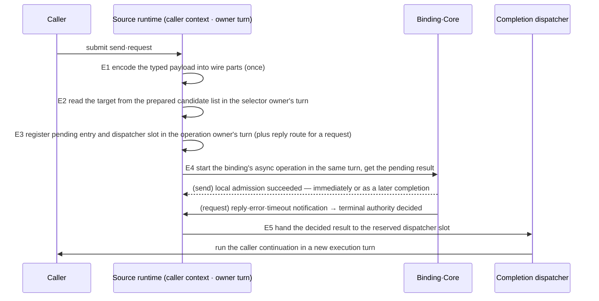

# Messaging Hot Path

[Execution overview](README.en.md) · [Spec index](../README.en.md) · [Previous: 07. Serial Executor Layers](07-serial-executor-layers.en.md)

> This page defines **how many execution stages a message passes through, in what order, and where
> it waits** inside the runtime from the moment an application submits a send or request until the
> handler on the other node runs and the reply returns to the caller. The observable result is a
> single number: in one language, the throughput of a send or request through the Framework is at
> least 0.90 of the throughput of the same binding socket used directly without the Framework (§7).
> Three APIs pass through the same stages (§5): the [RouteMesh](../00-foundation/02-glossary.en.md#routemesh)
> channel, which picks a target by ChannelName among the nodes of one mesh; the
> [ClientServer channel](../00-foundation/02-glossary.en.md#clientserver-channel), where a Client calls one
> ready Server; and the [Spot direct](../00-foundation/02-glossary.en.md#spot-direct) call, which reaches
> the current owner by Spot ID.

## 1. The questions this page answers, and who owns what

The application submits a message and observes its completion; it does not choose any stage in this
page. Every stage is decided and executed by the runtime.

| Party | Decides or owns in this page |
|---|---|
| Application | Submits send/request and observes completion through the terminators. It cannot choose stages. |
| Framework (runtime) | Every stage in this page — the source-side submit path, the target-side receive turn, the handler execution unit, the reply path — and the number of execution-resource switches between them. |
| Core and binding | Provide socket readiness notification, record receive/claim, completion notification of binding operations and HWM retries. Their internal queues and threads belong to the binding and are not counted here. |
| Remote runtime (target) | Runs receive, handler and reply under the same rules. Source and target differ only in role; they are the same runtime code. |

Completion meaning, handler order, permits — the slot the target runtime acquires per record to bound
the number of received items ahead of handler execution, whose shared queue is the
[Application job queue](../00-foundation/02-glossary.en.md#application-job-queue) —, copies and state
protection stay with their own pages; this page defines only **the order in which those rules combine
on the hot path** and the observable result of that combination.

| Question | Section |
|---|---|
| How many times does one request switch execution resources inside the source runtime | [§3](#3-source-side--the-submit-path) |
| When does the target runtime wake up, and how many records does it take at once | [§4](#4-target-side--the-receive-turn) |
| On which execution unit does the handler run, and where is the reply sent | [§4.3](#43-the-handler-execution-unit) |
| What is the same and what differs between RouteMesh, ClientServer and Spot direct | [§5](#5-target-selection-and-reply-path-per-api) |
| What may differ per language | [§6](#6-execution-resources-per-language) |
| How is conformance checked | [§7](#7-verification-requirements) |

Out of scope — Core's I/O thread placement and socket byte HWM belong to the Core spec; the
performance of the binding-direct path itself belongs to the bindings performance plan; the fanout
(PUB/SUB) publish path and the STREAM session packet path belong to their own pages. On the receive
side, STREAM follows the same
[Application Job Queue "3. Ordinary Ingress Permit Order"](04-application-job-queue-and-backpressure.en.md#3-ordinary-ingress-permit-order)
as this page.

Two names are used only inside this page. The execution unit — one per node — that waits for socket
readiness and claims records is called the **ingress owner**; the persistent execution resource that
takes records from owner queues and runs handlers is called the **application worker**. Neither is a
glossary term; §6 gives the real type names per language.

## 2. The common structure of the stages

The individual rules — take the permit first, read at most 64 records per wake-up, never poll with a
fixed delay, the Framework adds no payload copies, prepare candidate lists at change time — already
exist in other pages. When rules are scattered, an implementer picks one of several shapes that
satisfy them, and each shape has a different cost. Ending the receive turn after every record repeats
the wake-up and management cost for each record. Fixed-interval polling adds a fixed delay between
arrival and claim. This page fixes one common execution order that removes those costs.

A language chooses only the kind of execution resource (thread, event loop, virtual thread); it does
not choose the number, order or waiting style of the stages.

## 3. Source side — the submit path

When a caller submits `send` or `request`, the runtime passes through five stages. E1 finishes
synchronously on the execution resource the caller invoked. E2–E4 finish synchronously inside the turn
of the state lane that owns their state — the selector owner for E2, the operation owner for E3 and
E4, at most two on the normal path. E5 runs on the process-wide
[completion dispatcher](../00-foundation/02-glossary.en.md#completion-dispatcher) — the place where a
completion callback runs in a new execution turn.



| Stage | What the runtime does | Execution resource | So that |
|---|---|---|---|
| E1 encode | Encodes the typed payload with the codec into a list of wire parts. Never allocates a new buffer to join header and body. | caller | The Framework adds zero full copies ([Payload Ownership "2"](05-payload-ownership-and-codec.en.md#2-copies-that-can-be-eliminated)). |
| E2 resolve | Picks one target from the candidate list and selection order prepared at change time. Candidate replacement and selection are decided in one order on the selector owner's state lane — ownership of the selection state (candidate list, accumulators, cursor), the way that order is built, and the fallback that runs the selection procedure when the cycle search reached its bound are owned by [Channel Messaging "The Candidate List and Selection Order Are Prepared in Advance Whenever State Changes"](../02-channel-transport/02-channel-messaging.en.md#the-candidate-list-and-selection-order-are-prepared-in-advance-whenever-state-changes). The normal path of a prepared selection order only looks up the target and advances the cursor, and requests no **additional** turn on the topology, liveness or port owner's lane to do so. What this page requires is that selection finishes in constant time within one turn of the selector owner — when the caller is not already on that lane, the one switch into that turn is part of the normal path. | the selector owner's turn | No per-request scan of peers, no repeated filtering or sorting, no waiting on another owner's lane. |
| E3 register | For every operation whose terminal completion may arrive later — request and send alike — registers the pending entry and the completion-dispatcher slot. For a request it also creates `OperationId` and `ReplyRouteId` and registers the reply route, as in [Submit And Completion "10"](01-submit-and-completion.en.md#10-operation-identity-and-where-completion-happens-implementation). Without a free slot the operation is refused with `CapacityExceeded`. Registration, the capacity decision, close and terminal handling are serialised by the same operation owner. Registration completes before the transport submit ([State Ownership And Lanes "Completion Before Return"](06-state-ownership-and-lanes.en.md#completion-before-return)), and the dispatcher reservation is held until the callback returns. Beyond the required owner turn no separate registration queue and no additional lane round trip is created. The state class and lifetime of the pending entry and the dispatcher reservation are defined by [Submit And Completion "11"](01-submit-and-completion.en.md#11-the-execution-turn-of-the-completion-callback-implementation) and [State Ownership And Lanes "4"](06-state-ownership-and-lanes.en.md#4-state-classifications-and-how-to-tell-them-apart). What this page requires is that registration finishes in constant time within one turn of the operation owner. | the operation owner's turn | A completion is never processed before its registration, and no timer object is created per request — the deadline is a field of the entry and expiry is checked by the management work of §4.2 or a timer wheel. |
| E4 submit | Starts the binding's asynchronous request/send operation **once** and receives the pending result. It starts within the same turn that decided the E3 registration, so the caller may rely on the registration being complete before it observes the return of the submit. The Framework keeps no send queue of its own. | the same turn as E3 | HWM waiting and retries after the operation started belong to Core and the binding ([Submit And Completion "5"](01-submit-and-completion.en.md#5-backpressure-and-error-classification)); the Framework never creates a second operation. |
| E5 complete | Where the binding reports completion (reply, error, timeout, local admission), decides terminal authority once through the atomic take-out of [Submit And Completion "9"](01-submit-and-completion.en.md#9-request-completion--the-completion-race-and-timeout-budget) and hands the result to the dispatcher slot reserved in E3. The caller continuation runs in a **new execution turn** after the current completion handling and the lane-current scope have ended ([Submit And Completion "11"](01-submit-and-completion.en.md#11-the-execution-turn-of-the-completion-callback-implementation)). | binding completion resource → completion dispatcher | The only execution-resource switch the Framework introduces is that one dispatcher turn. No host mailbox or dispatch thread sits between the completion notification and the dispatcher. |

**Execution-resource switches on the source path are counted separately over two intervals.** An
execution-resource switch is a point where a message or its completion enters a queue and is taken out
on another thread, task or event-loop turn. Over the submit interval — from the caller's call to the
binding submit of E4 — the only switches allowed are entries into the required owner turns, at most two
on the normal path: caller → the selector owner's turn (E2), → the operation owner's turn (E3 and E4).
When both owners are the same there is at most one, and when the caller is already on that lane the
entry is not counted. Over the completion interval — from "the binding's completion notification
arrived" to "the first instruction of the caller continuation" — the Framework introduces exactly one
switch, the dispatcher turn of E5. Owner turns run FIFO, so a caller that submits 100 requests back to
back gets all 100 into the binding in submit order.

**A send completes** not when the E4 call returns but when local admission actually succeeded — the
[source-local admission](../00-foundation/02-glossary.en.md#source-local-admission) in which the socket's
send queue accepts the message, not a confirmation of remote receipt
([Submit And Completion "2"](01-submit-and-completion.en.md#2-completion-meaning-per-terminator-and-per-language-names),
["13"](01-submit-and-completion.en.md#13-the-completion-point-of-a-call-that-does-not-wait-for-a-reply)).
With immediate admission, E5 takes out the E3 entry within the same call, decides the result and hands
it to the dispatcher slot; when admission is pending on HWM, a later completion takes the same E5 path.
Either way the caller continuation runs in a new dispatcher turn. The continuation of a caller that released its gate with `Yield` runs
after the gate is re-acquired as in [Handler Turn "3"](02-handler-turn-and-execution-gate.en.md#3-gate-and-claim-on-yield);
that re-acquisition is not part of the switch count.

**This page does not classify or protect the state touched by E2 and E3** — the selection state is
owned by Channel Messaging, the pending entry and dispatcher reservation by Submit And Completion "10"
and "11", and the classification rules by
[State Ownership And Lanes "4"](06-state-ownership-and-lanes.en.md#4-state-classifications-and-how-to-tell-them-apart).
What this page fixes is the **shape** that protection takes on the submit path: the only turns of a
[state lane](../00-foundation/02-glossary.en.md#state-lane) — the execution unit that serialises access
to a component's state — that the request enters are the two required owner turns, the selector owner
for E2 and the operation owner for E3 and E4; inside those turns it never asks **another owner** for a
lane turn and waits for the result, and each stage finishes as a constant-time operation within its own
turn. An implementation that waits on the topology, liveness and port lanes in turn for every request
violates this page.

**Framework capacity waiting before handing over to the binding** follows
[Submit And Completion "5"](01-submit-and-completion.en.md#5-backpressure-and-error-classification) and
[Application Job Queue "8"](04-application-job-queue-and-backpressure.en.md#8-the-three-backpressure-stages-and-kinds-of-limits).
The internal `Backpressured` state is not a public terminal result, while deadline, capacity and
shutdown errors reach the caller exactly as those pages define.

Internal check — that between E1 and E4 there is no state-lane round trip to any owner other than the
required owner turns (the selector owner for E2, the operation owner for E3 and E4) and no per-request
timer registration, that owner-turn entries number at most two on the normal path (one when both
owners are the same), and that E5 puts no host mailbox or dispatch thread in front of the dispatcher,
are white-box invariants verified by tracing.

## 4. Target side — the receive turn

### 4.1 Stages of a receive turn

One receive turn is the span from one wake-up of the ingress owner to its next wait. Four things wake
it: data readiness, completion readiness, permits becoming available again, and a management deadline.

```mermaid
sequenceDiagram
    participant B as Binding·Core
    participant I as Ingress owner
    participant P as Host-shared permit
    participant Q as Owner queue
    participant W as Application worker

    I->>B: I0 wait for readiness (data·completion) without occupying the resource (bound = next management deadline)
    B-->>I: arrival
    alt supply identified pre-receive as a terminal completion
        I->>I: bypass the permit, handle the completion (§3 E5)
    else ordinary record
        I->>P: I1 acquire this turn's permit budget
        alt no permit
            I->>I: stop ordinary receive; completions, management deadlines, permit returns and shutdown keep progressing
        else permit available
            loop I2 claim continuously until the first of budget, count, byte or time limit
                I->>B: claim record
                B-->>I: record
                alt I3 control record (liveness probe·ACK, topology)
                    I->>I: handle here, return the permit
                else application record
                    I->>Q: I4 decode the header only, enqueue to the owner queue (atomic section, a move)
                end
            end
            I->>W: I4 for each owner whose empty queue became non-empty: add to the ready set, wake a worker
        end
    end
    I->>I: M management work once per turn
    I->>B: I0 wait again
```

| Stage | What the ingress owner does | So that |
|---|---|---|
| I0 wait | Waits for data readiness and completion readiness **without occupying the execution resource**. The wait bound is the next management deadline. While nothing is ready it neither busy-polls nor checks for data at a fixed interval. | No CPU is spent on repeated data checks while waiting for readiness, and no fixed sleep delays reception. |
| I1 permit | Before claiming ordinary records, acquires this turn's permit budget from the host-shared permit in the order of [Application Job Queue "3"](04-application-job-queue-and-backpressure.en.md#3-ordinary-ingress-permit-order). The budget is the smaller of the per-turn limit (64) and the remaining permits. Without a permit it stops ordinary receive, while handling of supply identified pre-receive as a terminal completion, management deadlines, permit returns and shutdown notifications keep progressing. | Never receives without a permit, and with zero permits the completions of already started operations and the management work never stall. |
| I2 claim | Claims records from Core/binding continuously within the budget, applying whichever of permit, count (at most 64), byte and elapsed-time limits is reached first and keeping the cursor ([Application Job Queue "4"](04-application-job-queue-and-backpressure.en.md#4-reading-multiple-items-from-the-socket-implementation)). Never ends the turn after one record. | Wake-up and read are not repeated once per queued record. |
| I3 classify | Decodes only the header of each record. Control records — liveness probes and ACKs, topology — are handled internally here and their permit returned; they are never put on an application handler queue. For application records the payload is not decoded; only the owner is determined. | A claimed control record never waits behind the application workers' backlog (§4.2). |
| I4 commit | Enqueues the application record to its owner queue — the atomic check-and-enqueue section of ["Do Not Separate the Admission Decision from Enqueueing"](04-application-job-queue-and-backpressure.en.md#do-not-separate-the-admission-decision-from-enqueueing-implementation). The record is moved, not copied. Each owner whose empty queue became non-empty is added to the ready set and a worker is woken. | The execution-resource switch the Framework introduces is this worker wake-up. When one turn fills the queues of several owners, each owner is woken once. |

**In the receive turn the execution-resource switch the Framework introduces is the worker wake-up of
I4** — a shape in which one record moves through three queues, "receive loop → separate mailbox →
dispatch pump → new task per record", is a violation. A language whose receive context belongs to the
transport and therefore needs a mailbox ([Application Job Queue "5"](04-application-job-queue-and-backpressure.en.md#5-separating-receipt-handling-from-state-change-implementation))
makes that mailbox the owner queue itself; it never dequeues after receive to move records into
another queue. The switch count is taken over the interval from "the record was claimed" to "the first
instruction of that record's handler".

### 4.2 Management work per receive turn

Work needed periodically regardless of records — the liveness tick, deadline expiry checks, publication
of topology and descriptor changes, relocation and claim management — is called management work. It
runs **once per receive turn**, never once per record. Management work that does not finish within its
time bound is carried to the next turn. The period of each item (the 5-second liveness probe and
15-second deadline, for example) is owned by the page that owns that item, and the I0 wait bound is
the nearest of those deadlines.

Because a turn is bounded at 64 records, in a turn that fills all 64 the per-record management cost is
spread to 1/64. An implementation that repeats the liveness tick and claim lookups per record violates
this page.

**Where control records are handled.** Liveness probes and ACKs arrive on the application data line
subject to its FIFO, HWM and permit boundary, as [Application Job Queue "3"](04-application-job-queue-and-backpressure.en.md#3-ordinary-ingress-permit-order)
and [Transport Liveness "3"](../02-channel-transport/05-transport-liveness.en.md#3-routemesh-and-clientserver)
require. Once claimed they are handled in I3, never placed on an application handler queue. A probe may
still miss its deadline behind preceding DATA and permit waiting; the throughput requirement of §7 is an
average consumption rate, not a guarantee that every probe meets its deadline under every load. What
this page forbids is deferring a claimed probe behind the handler backlog.

### 4.3 The handler execution unit

Records in an owner queue are taken and run by application workers.

| Stage | What the worker does | So that |
|---|---|---|
| W1 acquire | Takes an owner from the ready set and acquires that owner's [execution gate](../00-foundation/02-glossary.en.md#execution-gate) ([Handler Turn "6"](02-handler-turn-and-execution-gate.en.md#6-the-trap-in-acquiring-processing-authority-implementation), ["11"](02-handler-turn-and-execution-gate.en.md#11-making-the-two-synchronization-points-cheap-implementation)). | Without contention the gate is acquired with one atomic operation. |
| W2 decode | Deserialises the typed payload once ([Payload Ownership "6"](05-payload-ownership-and-codec.en.md#6-when-deserialization-happens)). | Nothing is deserialised before the execution right is held. |
| W3 run | Invokes the handler. The permit is returned right before the handler's first instruction. If the handler suspends or `Yield`s, resumption follows [Handler Turn "3"](02-handler-turn-and-execution-gate.en.md#3-gate-and-claim-on-yield). | An `await` inside the handler never re-acquires the permit. |
| W4 reply | After the handler completed, in that turn context, encodes the reply payload and starts the binding's reply operation right there. Never hands it to another execution resource. | The reply path has no Framework execution-resource switch. |
| W5 next | Within the time budget ([Handler Turn "9"](02-handler-turn-and-execution-gate.en.md#9-time-budget-and-batch-processing-implementation)) processes the same owner's next record; otherwise releases the gate and moves to the next owner. | One owner cannot monopolise a worker. |

**The Framework creates no separate dispatch task or supervisor wrapper per record; it reuses the
shared workers' drain.** Creating a task, future or virtual thread per request and registering it with a
supervisor is a violation. The asynchronous result objects returned by handlers or operations, external
I/O waits, suspension and `Yield` resumption are not covered by this prohibition. Even when a language's
execution resource is task based (a thread-pool work item, say), one work item processes several records.

**This page does not reduce handler concurrency.** The rule that two turns of the same gate never run
concurrently ([Handler Turn "1"](02-handler-turn-and-execution-gate.en.md#1-separating-queue-from-gate))
stands, and turns of different gates progress side by side on several workers. Serialising on one
worker to save switches is a violation.

**Handler instance lookup and the DI scope are constant time within W1–W3.** Scoped-handler semantics
stay; the activation path is cached so that scope creation and lookup do not search the container per
record.

Internal check — that ready-set transitions (empty → non-empty) match worker wake-ups, and that no
per-record dispatch task or supervisor registration exists between W1 and W4, are white-box invariants
verified by tracing.

## 5. Target selection and reply path per API

The three APIs share E1–E5, I0–I4 with M, and W1–W5. They differ only in what E2 reads and on which
connection the reply arrives.

| When to use | API | What E2 reads | Connection shape | Reply path |
|---|---|---|---|---|
| Picking one node of the same mesh by ChannelName | RouteMesh channel | the channel's candidate list and weighted round-robin order | ROUTER–ROUTER; the reply arrives on the separate [Completion connection](../00-foundation/02-glossary.en.md#completion-connection) | Completion connection → binding completion → E5 |
| A Client calling one ready Server | ClientServer channel | the ready Server candidate list ([ClientServer "4"](../02-channel-transport/03-client-server-channel.en.md#4-weight-and-target-selection)) | DEALER (client)–ROUTER (server), one Application connection | identified as a completion before receive on the same connection, bypasses the permit ([Application Job Queue "3"](04-application-job-queue-and-backpressure.en.md#3-ordinary-ingress-permit-order)) → E5 |
| Calling the current owner by Spot ID | Spot direct | a **valid hit** in the [positive route cache](../00-foundation/02-glossary.en.md#positive-route-cache) pointing at the current owner ([Spot Address Messaging "5"](../03-spot-actor/06-spot-address-messaging.en.md#5-direct-call-to-an-existing-owner-and-the-completion-boundary)) | the owner node's RouteMesh | same as RouteMesh |

That a ClientServer reply passes the same FIFO as the preceding DATA ([ClientServer "5"](../02-channel-transport/03-client-server-channel.en.md#5-send-request-and-reply))
is a Core contract this page does not change.

The Spot direct fast path is a valid positive-route-cache hit. A Location Store lookup after a cache
miss, expiry or disabled cache, [cold activation](../00-foundation/02-glossary.en.md#cold-activation) —
creating the instance when none exists yet — and messages during relocation follow the paths of their
owning pages ([Spot Address Messaging](../03-spot-actor/06-spot-address-messaging.en.md),
[Relocation](../05-location-relocation/04-relocation-flow.en.md)) and complete within the same overall
deadline. Later messages to the ready owner follow the stages of this page.

## 6. Execution resources per language

The results required of every runtime are owned by §3–§4. This section only states that the kind of
execution resource differs per language.

**Language discretion** — which kind of execution resource (OS thread, thread-pool work item, virtual
thread, event-loop turn) implements the ingress owner and the workers is the language's decision.
Whatever the kind, the observable result is the same — the non-occupying wait of I0, the continuous
claims of I2, the switch of I4, the batched processing of W1–W5 — and the checks are §7 and the internal
check conditions of each stage.

- Thread-based runtimes (C++, .NET, Java) implement I0 as a blocking wait.
- Node has a single event loop, so I0 is an asynchronous wait that returns to the loop, and "side by
  side" progress of several gates is alternation between `await`s, not CPU parallelism. When the batch
  time budget is exhausted it yields at a macrotask boundary so that I/O and timers progress.

| Language | Ingress owner's resource | Application worker's resource | Completion dispatcher's resource |
|---|---|---|---|
| C++ | the per-node host dispatch thread | worker threads of the application executor | workers of the shared completion dispatcher |
| .NET | the MeshNode receive loop (a dedicated task) | ThreadPool work items | continuations posted to the ThreadPool |
| Java | the virtual-thread pump | application lane workers | platform worker threads of the shared completion dispatcher |
| Node | the event loop | microtasks on the same event loop | the same event loop |

The table names only kinds of resources. Each language page (`spec/server/languages/`) records the
real type names, how the current implementation realises each stage of §3–§4, and which tests and bench
cells verify §7.

## 7. Verification requirements

Only results observable on the public surface are listed here. Conditions visible only through internal
instrumentation — switch counts, copy counts, task creation — are owned by the "internal check" items
of §3 and §4, and the language pages link the instrumentation points and test identifiers.

- (a) **Waiting style**: while nothing is ready the ingress owner neither busy-polls nor checks for
  data at a fixed interval. The waiting style is verified by code and trace review. The measurement
  specification — which CPU is measured, whether management work is included, the observation window,
  the latency statistics from readiness observation to claim and their tolerances — is a **pending
  item**: once the language page defines it, this section links to that section.
- (b) **Batched claim**: under measurement conditions that do not reach the byte or time limit, with 64
  records queued one turn claims 64 (given enough permits). With fewer permits it claims that many and
  leaves the rest in the Core queue — no reject, no drop.
- (c) **Throughput**: in one language the Framework path reaches at least **0.90** of the binding-direct
  path. As rows of the [framework messaging bench](../../../bench/with-grpc-local.en.md),
  `zlink-framework-<lang> / zlink-<lang>` is at least 0.90 for each of request-serial, request-window and
  send-saturation and for each payload 1024 and 4096, the value being the ratio of the aggregator's 3-run
  medians. This 0.90 is the pass line this page has confirmed, separate from the 0.80 pass line bench
  spec §7.2 applies to request-backpressure — a gap of 10% or more from the binding-direct path is a
  defect (user decision 2026-09-10).
- (d) **Concurrency** (measurement candidate): in request-window(100), the 3-run median of the per-run mean in-flight count
  (throughput × mean latency) is at least 90.
- (e) **Consumption rate** (measurement candidate): in send-saturation the time D from the close of the active window to the
  moment the last active record was received at the target is at most 10% of the active length T
  (`D / T ≤ 0.10`). The judgement applies only after full reception, zero errors and zero abandoned
  operations are confirmed. The `drain_ms` the bench runner records includes the settle check and is a
  diagnostic value; D is measured separately from target receive events.

Missing (c) means that language's runtime violates this page; bench conditions, timeouts and HWM values
are never adjusted to meet it.

The 90 and 10% of (d) and (e) are measurement candidates and are not used for violation judgements
until the pass line is confirmed. They are confirmed with their evidence after the first 3-run
judgement; once confirmed, the same rule as (c) applies.

[Execution overview](README.en.md) · [Spec index](../README.en.md) · [Previous: 07. Serial Executor Layers](07-serial-executor-layers.en.md)
