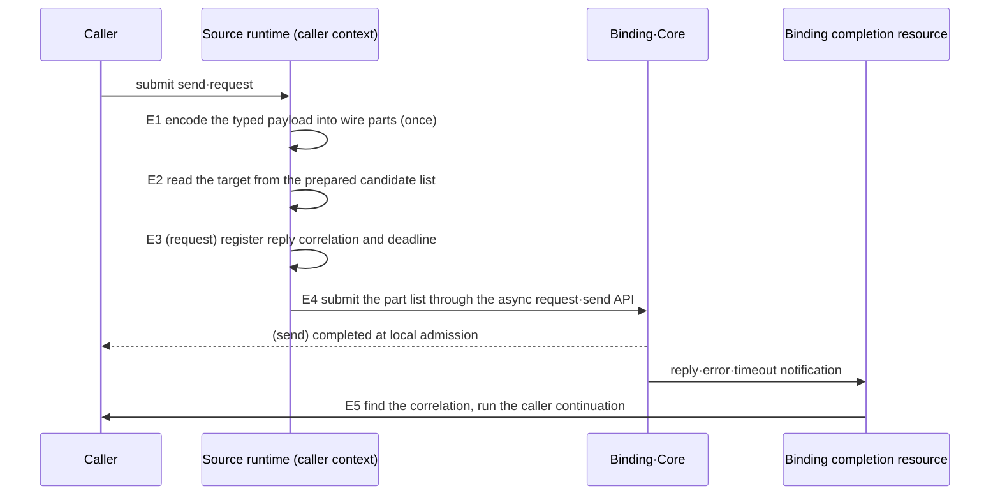
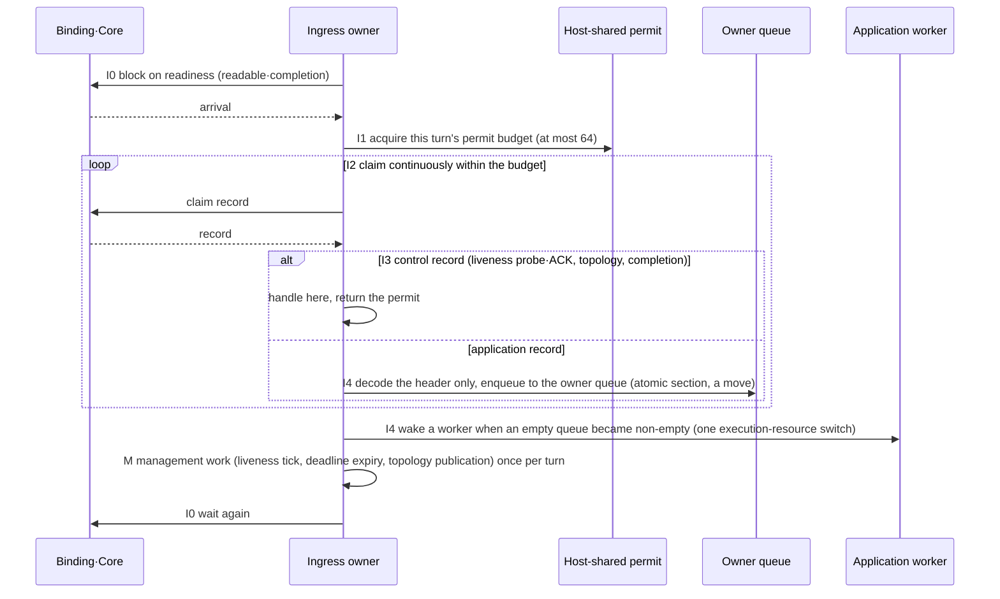

# Messaging Hot Path

[Execution overview](README.en.md) · [Spec index](../README.en.md) · [Previous: 07. Serial Executor Layers](07-serial-executor-layers.en.md)

> This page defines **how many execution stages a message passes through, in what order, and where
> it waits** inside the runtime from the moment an application submits a send or request until the
> handler on the other node runs and the reply returns to the caller. The observable result is a
> single number: in one language, the throughput of a send or request through the Framework is at
> least 0.90 of the throughput of the same binding socket used directly without the Framework (§7).
> RouteMesh channels, ClientServer channels and Spot direct calls pass through the same stages (§5).

## 1. The questions this page answers, and who owns what

The application submits a message and observes its completion; it does not choose any stage in this
page. Every stage is decided and executed by the runtime.

| Party | Decides or owns in this page |
|---|---|
| Application | Submits send/request and observes completion through the terminators. It cannot choose stages. |
| Framework (runtime) | Every stage in this page — the source-side submit path, the target-side receive turn, the handler execution unit, the reply path — and the number of execution-resource switches between them. |
| Core and binding | Provide socket readiness notification, record receive/claim and completion notification. Their internal queues and threads belong to the binding and are not counted here. |
| Remote runtime (target) | Runs receive, handler and reply under the same rules. Source and target differ only in role; they are the same runtime code. |

The questions answered here are listed below. Completion meaning, handler order, permits, copies and
state protection stay with their own pages; this page defines only **the order in which those rules
combine on the hot path** and the observable result of that combination.

| Question | Section |
|---|---|
| How many times does one request switch execution resources inside the source runtime | [§3](#3-source-side--the-submit-path) |
| When does the target runtime wake up, and how many records does it take at once | [§4](#4-target-side--the-receive-turn) |
| On which execution unit does the handler run, and where is the reply sent | [§4.3](#43-the-handler-execution-unit) |
| What is the same and what differs between RouteMesh, ClientServer and Spot direct | [§5](#5-the-same-stages-for-all-three-apis) |
| What may differ per language | [§6](#6-execution-resources-per-language) |
| How is conformance checked | [§7](#7-verification-requirements) |

Out of scope — Core's I/O thread placement and socket byte HWM belong to the Core spec; the
performance of the binding-direct path itself belongs to the bindings performance plan; the fanout
(PUB/SUB) publish path and the STREAM session packet path belong to their own pages. On the receive
side, STREAM follows the same
[Application Job Queue "3. Ordinary ingress permit order"](04-application-job-queue-and-backpressure.en.md#3-ordinary-ingress-permit-order)
as this page.

## 2. Why the shape of the stages is specified

The individual rules — take the permit first, read at most 64 records per wake-up, never poll with a
fixed delay, the Framework adds no payload copies, prepare candidate lists at change time — already
exist in other pages. Yet the 2026-09-10 measurement ([framework messaging bench](../../../../../../bench/grpc/README.en.md),
decision records `doc/plan/fw-bench-worklog/decisions.ko.md` FB-056–058) showed the four language
runtimes each breaking those rules in a different way: .NET read one record when a permit existed,
Java polled the socket with a fixed 1 ms sleep, C++ ended a receive turn after every record and
repeated its management work each turn. The outcome was the same everywhere — Framework-path
throughput at 5–24% of the binding-direct path in the same language.

When rules are scattered, an implementer picks one of several shapes that satisfy them, and each
shape has a different cost. This page fixes one low-cost shape. A language chooses only the kind of
execution resource (thread, event loop, virtual thread); it does not choose the number, order or
waiting style of the stages.

## 3. Source side — the submit path

When a caller submits `send` or `request`, the runtime passes through five stages. The first four
finish synchronously on the execution resource the caller invoked; only the fifth runs where the
binding delivers its completion notification.

| Stage | What the runtime does | Execution resource | So that |
|---|---|---|---|
| E1 encode | Encodes the typed payload with the codec into a list of wire parts. Never allocates a new buffer to join header and body. | caller | The Framework adds zero full copies ([Payload Ownership "2"](05-payload-ownership-and-codec.en.md#2-copies-that-can-be-eliminated)). |
| E2 resolve | Reads one target from the candidate list and selection order prepared at change time ([Channel Messaging "Prepare the candidate list and selection order at change time"](../02-channel-transport/02-channel-messaging.en.md#the-candidate-list-and-selection-order-are-prepared-in-advance-whenever-state-changes)). One atomic reference read and one cursor increment. | caller | No per-request scan of peers and no question to a state owner. |
| E3 register | For a request, records the [reply correlation](../00-foundation/02-glossary.en.md#reply-correlation) — the value that matches a reply to its request — and the deadline in a table. Registration is an atomic operation in the caller context. | caller | No timer object per request. Deadline expiry is checked by the management work of §4.2 or by a single timer wheel. |
| E4 submit | Hands the part list to the binding's async request/send API. The Framework keeps no send queue of its own. | caller | A send completes here at local admission ([Submit And Completion "2"](01-submit-and-completion.en.md#2-completion-meaning-per-terminator-and-per-language-names)). |
| E5 complete | Where the binding reports reply, error or timeout, finds the correlation and runs the caller continuation. Never detours through the Framework's host mailbox or dispatch thread. | binding completion resource | The only execution-resource switch the Framework introduces is this one (the caller continuation). |

**On the source path the Framework introduces exactly one execution-resource switch, E5.** An
execution-resource switch is a point where a message or its completion enters a queue and is taken
out on another thread, task or event-loop turn. Because E1–E4 finish synchronously in the caller
context, a caller that submits 100 requests back to back gets all 100 into the binding.

**E2 and E3 never enter a state owner's [state lane](../00-foundation/02-glossary.en.md#state-lane).**
The candidate list and the correlation table are state that changes rarely and is read often. Changes
(peer added or removed, weight changed, deadline expired) run on the lane; the submit path reads the
immutable snapshot the lane published — the classification under which
[State Ownership And Lanes "4. State classification"](06-state-ownership-and-lanes.en.md#4-state-classifications-and-how-to-tell-them-apart)
allows read-only snapshots to be read outside the lane. An implementation that enters a lane and
waits for its result on every request violates this page — in the 2026-09-10 diagnosis five lane
waits per request held the real concurrency of a 100-request window at 4.6.

A submit rejected with backpressure is absorbed and resubmitted by the runtime as in
[Application Job Queue "7. Composition with send completion"](04-application-job-queue-and-backpressure.en.md#7-composition-with-send-completion);
it is never turned into a terminal error for the caller.

Internal check — that no state-lane `Run`/`TryPost` call and no new timer registration occurs between
E1 and E4 is a white-box invariant verified by tracing.

## 4. Target side — the receive turn

### 4.1 Stages of a receive turn

Each node has exactly one execution unit that waits for socket readiness and claims records, the
**ingress owner** (the C++ host dispatch thread, the .NET receive loop, the Java pump, the Node event
loop). One receive turn is the span from one wake-up of the ingress owner to its next wait.

| Stage | What the ingress owner does | So that |
|---|---|---|
| I0 wait | Blocks on transport readiness — readable **and** completion. The idle bound is the management period of §4.2; an arriving record wakes it immediately. | No fixed-delay sleep and no repeated zero-timeout poll. Idle CPU is zero and arrival latency never exceeds transport latency. |
| I1 permit | Acquires this turn's permit budget from the host-shared permit, in the order of [Application Job Queue "3"](04-application-job-queue-and-backpressure.en.md#3-ordinary-ingress-permit-order). The budget is the smaller of the per-turn limit (64) and the remaining permits. | Never receives without a permit and claims only as many records as permits allow. |
| I2 claim | Claims records from Core/binding continuously within the budget, applying whichever of the count (64), byte and elapsed-time limits is reached first and keeping the cursor ([Application Job Queue "4"](04-application-job-queue-and-backpressure.en.md#4-reading-multiple-items-from-the-socket-implementation)). Never ends the turn after one record. | Wake-up and read are not repeated once per queued record. |
| I3 classify | Decodes only the header of each record. Control records — liveness probes and ACKs, topology, completions — are handled here and their permit returned. For application records the payload is not decoded; only the owner is determined. | Control records never wait behind the application backlog (§4.2). |
| I4 commit | Enqueues the application record to its owner queue — the atomic check-and-enqueue section of ["Do Not Separate the Admission Decision from Enqueueing"](04-application-job-queue-and-backpressure.en.md#do-not-separate-the-admission-decision-from-enqueueing-implementation). The record is moved, not copied. When an empty queue became non-empty, the owner is added to the ready set and a worker is woken. | The only execution-resource switch the Framework introduces is this worker wake-up. |

**In the receive turn the Framework introduces exactly one execution-resource switch, I4.** A shape
with three switches — "receive loop → separate mailbox → dispatch pump → new task per record" — is a
violation. A language whose receive context belongs to the transport and therefore needs a mailbox
([Application Job Queue "5"](04-application-job-queue-and-backpressure.en.md#5-separating-receipt-handling-from-state-change-implementation))
makes that mailbox the owner queue itself; it never dequeues after receive to move records into
another queue.

### 4.2 Management work runs once per turn

Work that is needed periodically regardless of records — the liveness tick, deadline expiry checks,
publication of topology and descriptor changes, relocation and claim management — is called
management work. It runs **once at the end of a receive turn**, never once per record. Management
work that does not finish within its time bound is carried to the next turn.

Because a turn is bounded at 64 records, the per-record management cost falls to at most 1/64 under
load. An implementation that repeated the liveness tick and claim lookups per record (the 2026-09-10
C++ diagnosis: 873 µs per turn) violates this page.

**Control records never wait behind the backlog.** Liveness probes and ACKs stay on the application
data line as [Application Job Queue "3"](04-application-job-queue-and-backpressure.en.md#3-ordinary-ingress-permit-order)
requires, but they are handled the moment I3 claims them, independent of the application workers'
backlog. The only way the runtime misses a probe is when the ingress owner fails to claim the record
within the deadline, which the consumption requirement of §7 prevents. Deferring probe handling behind
the owner queue is a violation — in FB-054 (2026-09-09) a probe queued behind about 16,000 records
missed the 15-second deadline and the peer was removed.

### 4.3 The handler execution unit

Records in an owner queue are taken and run by persistent execution resources, the **application
workers**.

| Stage | What the worker does | So that |
|---|---|---|
| W1 acquire | Takes an owner from the ready set and acquires that owner's [execution gate](../00-foundation/02-glossary.en.md#execution-gate) ([Handler Turn "6"](02-handler-turn-and-execution-gate.en.md#6-the-trap-in-acquiring-processing-authority-implementation), ["11"](02-handler-turn-and-execution-gate.en.md#11-making-the-two-synchronization-points-cheap-implementation)). | Without contention the gate is acquired with one atomic operation. |
| W2 decode | Deserialises the typed payload once ([Payload Ownership "6"](05-payload-ownership-and-codec.en.md#6-when-deserialization-happens)). | Nothing is deserialised before the execution right is held. |
| W3 run | Invokes the handler. The permit is returned right before the handler's first instruction. | An `await` inside the handler never re-acquires the permit. |
| W4 reply | Encodes the reply payload and submits it through the binding's reply API right there. Never hands it to another execution resource. | The reply path has no Framework execution-resource switch. |
| W5 next | Within the time budget ([Handler Turn "9"](02-handler-turn-and-execution-gate.en.md#9-time-budget-and-batch-processing-implementation)) processes the same owner's next record; otherwise releases the gate and moves to the next owner. | One owner cannot monopolise a worker. |

**No execution unit is created per record.** Creating a task, future or virtual thread per request and
registering it with a supervisor is a violation. Workers are persistent and records reach them in
batches. Even when a language's execution resource is task based (a thread-pool work item, say), one
work item processes several records.

**This page does not reduce handler concurrency.** The rule that two turns of the same gate never run
concurrently ([Handler Turn "1"](02-handler-turn-and-execution-gate.en.md#1-separating-queue-from-gate))
stands, and turns of different gates run in parallel on several workers. Serialising on one worker to
save switches is a violation — in the 2026-09-10 .NET diagnosis an inline-dispatch experiment halved
window throughput.

**Handler instance lookup and the DI scope are constant time within W1–W3.** Scoped-handler semantics
stay; the activation path is cached so that scope creation and lookup do not search the container per
record.

Internal check — that the ratio of records claimed in I2 to worker wake-ups in I4 approaches 64:1
under load, and that no task is created between W1 and W4, are white-box invariants verified by tracing.

## 5. The same stages for all three APIs

The three APIs share E1–E5, I0–I4 with M, and W1–W5. They differ only in what E2 reads and on which
connection the reply arrives.

| API | What E2 reads | Connection shape | Reply path |
|---|---|---|---|
| [RouteMesh](../00-foundation/02-glossary.en.md#routemesh) channel | the channel's candidate list and weighted round-robin order | ROUTER–ROUTER; the reply arrives on the separate [Completion connection](../00-foundation/02-glossary.en.md#completion-connection) | Completion connection → binding completion → E5 |
| [ClientServer channel](../00-foundation/02-glossary.en.md#clientserver-channel) | the ready Server candidate list ([ClientServer "4"](../02-channel-transport/03-client-server-channel.en.md#4-weight-and-target-selection)) | DEALER (client)–ROUTER (server), one Application connection | identified as a completion before receive on the same connection, bypasses the permit ([Application Job Queue "3"](04-application-job-queue-and-backpressure.en.md#3-ordinary-ingress-permit-order)) → E5 |
| [Spot direct](../00-foundation/02-glossary.en.md#spot-direct) | the [positive route cache](../00-foundation/02-glossary.en.md#positive-route-cache) pointing at the current owner ([Spot Address Messaging "5"](../03-spot-actor/06-spot-address-messaging.en.md#5-direct-call-to-an-existing-owner-and-the-completion-boundary)) | the owner node's RouteMesh | same as RouteMesh |

That a ClientServer reply passes the same FIFO as the preceding DATA ([ClientServer "5"](../02-channel-transport/03-client-server-channel.en.md#5-send-request-and-reply))
is a Core contract this page does not change.

For Spot direct, [cold activation](../00-foundation/02-glossary.en.md#cold-activation) — creating the
instance when none exists yet — and messages during relocation are not the hot path: they follow the
slow paths of [Spot Address Messaging](../03-spot-actor/06-spot-address-messaging.en.md) and
[Relocation](../05-location-relocation/04-relocation-flow.en.md); later messages to the ready owner
follow the stages of this page.

## 6. Execution resources per language

The kind of execution resource is the language's choice. The number, order and waiting style of the
stages are not.

**Language discretion** — which kind of execution resource (OS thread, thread-pool work item, virtual
thread, event-loop turn) implements the ingress owner and the workers is the language's decision.
Whatever the kind, the observable result is the same — a blocking wait in I0, continuous claims in I2,
one switch in I4, batched processing in W1–W5 — and the check is §7 (a)–(c).

| Language | Ingress owner (I0–I4, M) | Application worker (W1–W5) | Resource running E5 |
|---|---|---|---|
| C++ | The per-node host dispatch thread; `poll(timeout)` waits for readable and completion together. | Worker threads of the application executor; record batches without tasks. | The binding poller thread completes the caller awaiter. |
| .NET | The MeshNode receive loop; the poller `Wait` (PollIn·PollCompletion). | A ThreadPool work item processes an owner's record batch; no `Task<Task>` per request. | The binding completion continuation completes the caller `TaskCompletionSource`. |
| Java | The virtual-thread pump; the poller's blocking readiness (readable and `POLLCOMPLETION`). | Application lane workers; no virtual thread per record. | The binding completion completes the caller `CompletableFuture`. |
| Node | The event loop's readable callback with a per-turn batch budget. | Microtasks on the same event loop; handlers yield with `await`. | The same event loop. |

Each language page (`spec/server/languages/`) restates its row with the runtime's real type names and
records which tests and bench cells verify §7.

## 7. Verification requirements

(a)–(d) are verified by per-language contract tests, (e)–(g) by the 3-run medians of the
[framework messaging bench](../../../../../../bench/grpc/README.en.md).

- (a) **Switch count**: one Framework-introduced execution-resource switch in the receive turn (I4) and
  one on the submit path (E5). Each language has a test that counts the switches one request passes
  through by tracing.
- (b) **Waiting style**: the ingress owner's idle CPU converges to zero, and the latency from record
  arrival to the I2 claim does not exceed transport latency. No fixed sleep value is observable.
- (c) **Batched claim**: with 64 records queued, one turn claims 64 (given enough permits). With fewer
  permits it claims that many and leaves the rest in the Core queue — no reject, no drop.
- (d) **Copies**: the instrumentation of [Payload Ownership "9"](05-payload-ownership-and-codec.en.md#9-verification-requirements)
  shows zero Framework-added full copies.
- (e) **Throughput**: in one language the Framework path reaches at least **0.90** of the binding-direct
  path — as bench rows, `zlink-framework-<lang> / zlink-<lang>` is at least 0.90 for request-serial,
  request-window and send-saturation. This value is above the 0.80 pass line of bench spec §7.2
  formula 2 and is owned by this page.
- (f) **Concurrency**: in request-window(100) the mean in-flight count (throughput × mean latency) is at
  least 90.
- (g) **Consumption rate**: in send-saturation the drain — the time to consume the records left after the
  active window closes — is at most 10% of the active length, meaning the ingress consumption rate is at
  least 0.9 of the source admission rate.

Missing (e)–(g) means that language's runtime violates this page; bench conditions, timeouts and HWM
values are never adjusted to meet them.
