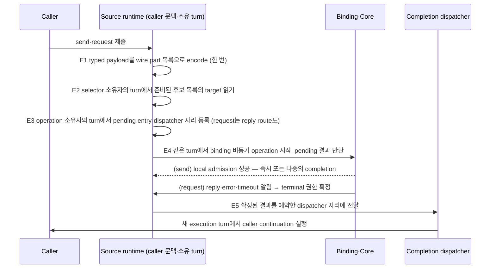
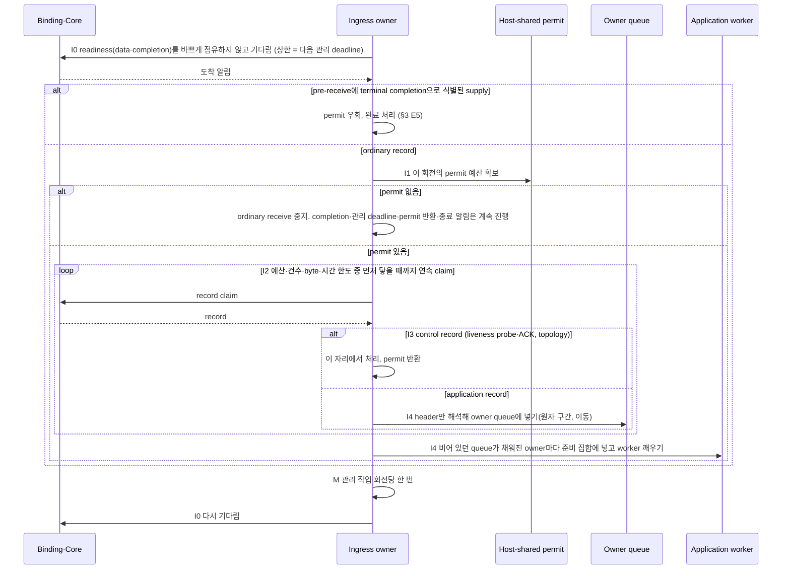

# Messaging hot path

[Execution 주제 목차](README.ko.md) · [스펙 목차](../README.ko.md) · [이전: 07. 직렬 실행기 계층](07-serial-executor-layers.ko.md)

> 이 문서는 application이 send나 request를 제출한 뒤 그 message가 상대 node의 handler에 도달하고
> reply가 caller에게 돌아올 때까지, runtime 안에서 **몇 개의 실행 단계를 어떤 순서로 지나며 어디서
> 기다리는지**를 정의한다. 독자가 관찰하는 결과는 하나다 — 같은 언어에서 Framework를 거친 send·request의
> 처리량이 Framework 없이 같은 binding socket을 직접 쓴 처리량의 0.90 이상이어야 한다(§7).
> 같은 mesh의 node 사이에서 ChannelName으로 target을 고르는
> [RouteMesh](../00-foundation/02-glossary.ko.md#routemesh) channel, Client가 ready Server 하나를 호출하는
> [ClientServer channel](../00-foundation/02-glossary.ko.md#clientserver-channel), Spot ID로 current owner를
>호출하는 [Spot direct](../00-foundation/02-glossary.ko.md#spot-direct) call — 세 API가 같은 단계를 지난다(§5).

## 1. 이 문서가 답하는 질문과 책임

Application은 message를 제출하고 완료를 관찰할 뿐, 이 문서의 단계를 지정하지 않는다. 단계는 전부
runtime이 정하고 실행한다.

| 주체 | 이 문서에서 결정·소유하는 것 |
|---|---|
| Application | send·request를 제출하고 terminator로 완료를 관찰한다. 단계를 고를 수 없다. |
| Framework(runtime) | 이 문서의 모든 단계 — source 쪽 제출 경로, target 쪽 수신 회전, handler 실행 단위, reply 경로 — 와 그 사이의 실행 자원 전환 수를 결정한다. |
| Core·binding | socket의 readiness 알림, record의 receive·claim, binding operation의 완료 알림과 HWM 재시도를 제공한다. 그 내부 queue와 thread는 binding이 소유하며 이 문서가 세지 않는다. |
| Remote runtime(target) | 같은 규칙으로 receive·handler·reply를 실행한다. source와 target은 역할이 다를 뿐 같은 runtime 코드다. |

완료 의미, handler 순서, permit — target runtime이 handler 실행 전까지 수신 작업 수를 제한하기 위해
record마다 확보하는 자리로, 그 공유 queue가 [Application job queue](../00-foundation/02-glossary.ko.md#application-job-queue)다 —,
복사, 상태 보호의 규칙은 각각의 문서가 그대로 소유하며, 이 문서는 그 규칙들이 hot path 위에서
**어떤 순서로 결합되는지**와 결합의 관찰 가능한 결과만 정한다.

| 질문 | 답이 있는 절 |
|---|---|
| 요청 하나가 source runtime 안에서 몇 번 실행 자원을 바꾸는가 | [§3](#3-source-쪽--제출-경로) |
| target runtime은 언제 깨어나고 한 번에 몇 건을 받는가 | [§4](#4-target-쪽--수신-회전) |
| handler는 어떤 실행 단위에서 돌고 reply는 어디서 보내는가 | [§4.3](#43-handler-실행-단위) |
| RouteMesh·ClientServer·Spot direct는 무엇이 같고 무엇이 다른가 | [§5](#5-api별-대상-선택과-reply-경로) |
| 언어마다 달라도 되는 것은 무엇인가 | [§6](#6-언어별-실행-자원) |
| 구현이 이 문서를 지켰는지 무엇으로 확인하는가 | [§7](#7-검증-요구) |

이 문서가 다루지 않는 것 — Core의 I/O thread 배치와 socket byte HWM은 Core spec이, Framework 없이
binding socket을 직접 쓰는 경로의 성능은 bindings 성능 계획이, fanout(PUB/SUB)의 발행 경로와 STREAM
session의 packet 경로는 각 문서가 소유한다. 수신 쪽 permit 순서는 STREAM도 이 문서와 같은
[Application job queue 「3. Ordinary ingress permit 순서」](04-application-job-queue-and-backpressure.ko.md#3-ordinary-ingress-permit-순서)를
따른다.

이 문서 안에서만 쓰는 이름 둘을 미리 밝힌다. node마다 하나 있으면서 socket readiness를 기다리고
record를 claim하는 실행 단위를 **ingress owner**라 부르고, owner queue의 record를 꺼내 handler를
실행하는 지속적인 실행 자원을 **application worker**라 부른다. 둘 다 용어집 항목이 아니라 이 장의
설명용 이름이며, 언어별 실제 타입 이름은 §6이 적는다.

## 2. 실행 단계의 공통 구조

낱개 규칙 — permit을 먼저 얻는다, 한 번 깨어나면 최대 64건을 읽는다, 고정 지연으로 폴링하지
않는다, Framework는 payload를 추가로 복사하지 않는다, 후보 목록은 변경 시점에 준비한다 — 는 이미
다른 문서에 있다. 규칙이 낱개로 있으면 구현자는 규칙을 만족하는 여러 모양 중 하나를 고르고, 모양마다
비용이 다르다. 한 건마다 수신 회전을 끝내면 깨우기와 관리 작업 비용이 각 record에 반복된다. 고정 간격
폴링은 도착 뒤 claim까지 고정 지연을 더한다. 이 문서는 이 비용을 줄이는 공통 실행 순서를 정한다.

언어가 고를 수 있는 것은 실행 자원의 종류(thread, event loop, virtual thread)뿐이고, 단계의
수·순서·기다리는 방식은 고르지 않는다.

## 3. Source 쪽 — 제출 경로

Caller가 `send`나 `request`를 제출하면 runtime은 다음 다섯 단계를 지난다. E1은 caller가 호출한 그
실행 자원에서 동기적으로 끝난다. E2~E4는 그 상태를 소유한 state lane의 turn — E2는 selector 소유자,
E3·E4는 operation 소유자, 정상 경로에서 최대 둘 — 안에서 동기적으로 끝난다. E5는 process가 공유하는
[completion dispatcher](../00-foundation/02-glossary.ko.md#completion-dispatcher) — 완료 callback을
새 execution turn에서 실행하는 자리 — 에서 실행된다.

| 단계 | runtime이 하는 일 | 실행 자원 | 그래서 |
|---|---|---|---|
| E1 encode | typed payload를 codec으로 wire part 목록으로 만든다. header와 body를 합치려고 새 buffer를 만들지 않는다. | caller | Framework가 추가하는 전체 복사가 0이다([Payload ownership 「2」](05-payload-ownership-and-codec.ko.md#2-없앨-수-있는-복사)). |
| E2 resolve | 변경 시점에 미리 준비된 후보 목록과 선택 순서에서 target 하나를 고른다. 후보 교체와 선택은 selector 소유자의 state lane에서 하나의 순서로 확정한다 — 선택 상태(후보 목록·누적값·cursor)의 소유, 그 순서를 만드는 방법, 주기 탐색 한도에 닿았을 때 선택 절차를 그대로 수행하는 대체 경로는 [Channel messaging 「후보 목록과 선택 순서는 변경 시점에 미리 준비한다」](../02-channel-transport/02-channel-messaging.ko.md#후보-목록과-선택-순서는-변경-시점에-미리-준비한다)가 소유한다. 준비된 선택 순서의 정상 경로는 target 조회와 cursor 진행만 수행하며, 그를 위해 topology·liveness·port 소유자의 lane에 **추가** turn을 요청해 결과를 기다리지 않는다. 이 문서가 요구하는 것은 선택이 selector 소유자의 turn 하나 안에서 상수 시간에 끝난다는 것이다 — caller가 그 lane 위에 있지 않으면 그 turn으로의 전환 1회가 정상 경로에 포함된다. | selector 소유자의 turn | 요청마다 peer 목록을 훑거나 필터링·정렬을 다시 하지 않고, 다른 소유자의 lane을 기다리지 않는다. |
| E3 register | terminal 완료가 나중에 도착할 수 있는 모든 operation — request와 send 둘 다 — 에 대해 pending entry와 completion dispatcher 자리를 등록한다. request는 [Submit과 완료 「10」](01-submit-and-completion.ko.md#10-operation-identity와-완료-자리-구현)대로 `OperationId`·`ReplyRouteId`와 reply route도 함께 등록한다. 자리가 없으면 `CapacityExceeded`로 거부한다. 등록·capacity 판정·close·terminal 처리는 같은 operation 소유자가 직렬화한다. 등록은 transport submit 전에 완료하고([상태 소유와 state lane 「반환 전 완료 보장」](06-state-ownership-and-lanes.ko.md#반환-전-완료-보장)), dispatcher 예약은 callback 반환까지 유지한다. 필수 소유 turn 외에 별도 등록 queue나 추가 lane 왕복을 만들지 않는다. pending entry와 dispatcher 예약의 상태 분류와 수명은 [Submit과 완료 「11」](01-submit-and-completion.ko.md#11-완료-callback의-execution-turn-구현)과 [상태 소유와 state lane 「4」](06-state-ownership-and-lanes.ko.md#4-상태-분류와-판별-기준)이 정한다. 이 문서가 요구하는 것은 등록이 operation 소유자의 turn 하나 안에서 상수 시간에 끝난다는 것이다. | operation 소유자의 turn | 등록보다 완료가 먼저 처리되지 않으며, 별도 timer 객체를 요청마다 만들지 않는다 — deadline은 entry의 값이고 만료 검사는 §4.2의 관리 작업이나 timer wheel이 한다. |
| E4 submit | binding의 비동기 request·send operation을 **한 번** 시작하고 pending 결과를 돌려받는다. E3의 등록을 확정한 그 turn 안에서 이어서 시작하며, caller는 제출의 반환을 관찰하기 전에 등록이 끝나 있음을 믿어도 된다. Framework는 자기 send queue를 두지 않는다. | E3와 같은 turn | operation이 시작된 뒤의 HWM 대기와 재시도는 Core·binding이 소유하며([Submit과 완료 「5」](01-submit-and-completion.ko.md#5-backpressure와-오류-분류)), Framework는 두 번째 operation을 만들지 않는다. |
| E5 complete | binding의 완료 알림(reply·error·timeout·local admission)을 받은 자리에서 [Submit과 완료 「9」](01-submit-and-completion.ko.md#9-request-completion--완료-경쟁과-timeout-budget)의 원자적 꺼내기로 terminal 권한을 한 번 확정하고, 결과를 E3에서 예약한 dispatcher 자리에 전달한다. caller continuation은 현재 완료 처리와 lane-current scope가 끝난 뒤 **새 execution turn**에서 실행한다([Submit과 완료 「11」](01-submit-and-completion.ko.md#11-완료-callback의-execution-turn-구현)). | binding 완료 알림 자원 → completion dispatcher | Framework가 만드는 실행 자원 전환은 dispatcher의 새 turn **하나**다. 완료 알림과 dispatcher 사이에 host mailbox·dispatch thread를 추가로 거치지 않는다. |

**Source 경로의 실행 자원 전환은 두 구간에서 따로 센다.** 실행 자원 전환이란 message나 그 완료가 queue에
들어갔다가 다른 thread·task·event loop 회전에서 꺼내지는 지점이다. 제출 구간 — caller의 호출부터 E4의
binding submit까지 — 에서 허용되는 전환은 필수 소유 turn으로의 진입뿐이며 정상 경로에서 최대 2회다:
caller → selector 소유자의 turn(E2), → operation 소유자의 turn(E3·E4). 두 소유자가 같으면 최대 1회이고,
caller가 이미 그 lane 위에 있으면 그 진입은 세지 않는다. 완료 구간 — "binding의 완료 알림이 도착한
시점"부터 "caller continuation의 첫 instruction"까지 — 에서 Framework가 만드는 전환은 E5의 dispatcher
turn 하나다. 소유 turn은 FIFO로 실행되므로 caller 하나가 100건을 연달아 제출하면 100건이 제출 순서대로
binding에 모두 도달한다.

**Send의 완료 시점**은 E4의 호출 반환이 아니라 local admission이 실제로 성공한 시점이다 — socket의 송신
queue가 message를 수락하는 [source-local admission](../00-foundation/02-glossary.ko.md#source-local-admission)이며
remote 수신 확인이 아니다([Submit과 완료 「2」](01-submit-and-completion.ko.md#2-terminator별-완료-의미와-언어별-이름),
[「13」](01-submit-and-completion.ko.md#13-응답을-기다리지-않는-호출의-완료-지점)). admission이
즉시 성공하면 E5가 같은 호출 안에서 E3의 entry를 꺼내 결과를 확정하고 dispatcher 자리에 전달하며, HWM으로
pending이면 나중의 completion이 같은 E5 경로를 탄다. 어느 경우든 caller continuation은 dispatcher의 새 turn에서 실행된다.
`Yield`로 gate를 반납한 caller의 continuation은 [Handler turn 「3」](02-handler-turn-and-execution-gate.ko.md#3-yield-시-gate와-claim)대로
gate를 다시 얻은 뒤 실행되며, 그 재획득은 이 전환 수에 포함되지 않는다.

**E2와 E3가 만지는 상태의 분류와 보호 방법은 이 문서가 정하지 않는다** — 선택 상태는 Channel messaging이,
pending entry와 dispatcher 예약은 Submit과 완료 「10」·「11」이, 분류 기준은
[상태 소유와 state lane 「4」](06-state-ownership-and-lanes.ko.md#4-상태-분류와-판별-기준)이 소유한다. 이 문서가
정하는 것은 그 보호가 제출 경로에서 취하는 **모양**이다: 컴포넌트 상태를 직렬화하는 실행 단위인
[state lane](../00-foundation/02-glossary.ko.md#state-lane)의 turn에 들어가는 것은 필수 소유 turn
둘 — E2의 selector 소유자, E3·E4의 operation 소유자 — 뿐이고, 그 turn 안에서 **다른 소유자**에게 lane
turn을 요청해 결과를 기다리지 않으며, 각 단계는 자기 turn 안의 상수 시간 연산으로 끝난다. 요청마다
topology·liveness·port의 lane을 차례로 기다리는 구현은 이 문서 위반이다.

**Binding에 넘기기 전의 Framework capacity 대기**는 [Submit과 완료 「5」](01-submit-and-completion.ko.md#5-backpressure와-오류-분류)와
[Application job queue 「8」](04-application-job-queue-and-backpressure.ko.md#8-backpressure-3단계와-한도-종류)을
따른다. 내부 상태인 `Backpressured` 자체는 public terminal 결과가 아니지만, deadline·capacity·shutdown 오류는
그 문서들이 정한 대로 caller에게 돌아간다.

내부 확인 조건 — E1~E4 사이에 필수 소유 turn(E2의 selector 소유자, E3·E4의 operation 소유자) 외의
소유자로 향하는 state lane 왕복과 요청별 timer 등록이 없고, 소유 turn 진입이 정상 경로에서 최대 2회(두
소유자가 같으면 1회)이며, E5가 dispatcher 앞에 host mailbox·dispatch thread를 두지 않는다는 것은 trace로
확인하는 white-box 불변 조건이다.

## 4. Target 쪽 — 수신 회전

### 4.1 수신 회전의 단계

ingress owner가 한 번 깨어나서 다시 기다릴 때까지가 수신 회전 하나다. 깨어나는 원인은 넷이다 —
data readiness, completion readiness, permit이 다시 생김, 관리 작업의 deadline 도래.

| 단계 | ingress owner가 하는 일 | 그래서 |
|---|---|---|
| I0 wait | data readiness와 completion readiness를 **실행 자원을 바쁘게 점유하지 않고** 기다린다. 대기 상한은 다음 관리 작업 deadline이다. readiness가 없는 동안 busy poll이나 고정 간격의 데이터 확인을 하지 않는다. | readiness 대기 중 반복적인 데이터 확인으로 CPU를 소비하지 않고, 고정 sleep으로 수신을 늦추지 않는다. |
| I1 permit | ordinary record를 claim하기 전에 이 회전의 permit 예산을 host-shared permit에서 확보한다([Application job queue 「3」](04-application-job-queue-and-backpressure.ko.md#3-ordinary-ingress-permit-순서)의 순서 그대로). 예산은 회전 상한 64건과 남은 permit 중 작은 값이다. permit이 없으면 ordinary receive를 멈추되, pre-receive에 terminal completion으로 식별된 supply의 처리, 관리 deadline, permit 반환과 종료 알림은 계속 진행한다. | permit 없이 receive하지 않으며, permit 0에서도 이미 시작한 operation의 완료와 관리 작업이 멈추지 않는다. |
| I2 claim | 예산 안에서 Core·binding에서 record를 연속으로 claim한다. permit·건수(최대 64)·byte·경과 시간 한도 중 먼저 닿는 것을 적용하고 cursor를 유지한다([Application job queue 「4」](04-application-job-queue-and-backpressure.ko.md#4-소켓에서-여러-건-읽기-구현)). 한 건 claim 뒤 회전을 끝내지 않는다. | 쌓인 record 수만큼 깨우기·읽기가 반복되지 않는다. |
| I3 classify | record마다 header만 해석한다. control record — liveness probe와 ACK, topology — 는 이 자리에서 내부적으로 처리하고 permit을 반환하며 application handler queue에 넣지 않는다. application record는 payload를 해석하지 않고 owner만 정한다. | claim된 control record는 application worker의 backlog 뒤에서 기다리지 않는다(§4.2). |
| I4 commit | application record를 owner queue에 넣는다 — 확인과 넣기가 한 원자 구간인 [「넣을지 판단하는 것과 넣는 것을 쪼개지 않는다」](04-application-job-queue-and-backpressure.ko.md#넣을지-판단하는-것과-넣는-것을-쪼개지-않는다-구현)의 절차다. record는 이동하며 복사하지 않는다. 비어 있던 queue가 채워진 owner를 준비된 owner 집합에 넣고 worker를 깨운다. | Framework가 만드는 실행 자원 전환은 이 worker 깨우기다. 한 회전에서 여러 owner의 queue가 채워지면 owner마다 한 번씩 깨운다. |

**수신 회전에서 Framework가 만드는 실행 자원 전환은 I4의 worker 깨우기다** — record 하나가 "receive
loop → 별도 mailbox → dispatch pump → record마다 새 task"처럼 세 번 queue를 옮겨 다니는 모양은 위반이다.
수신 문맥이 transport 소유라 별도 mailbox가 필요한 언어([Application job queue 「5」](04-application-job-queue-and-backpressure.ko.md#5-수신-처리와-상태-변경-분리-구현))는
그 mailbox가 곧 owner queue여야 하며, 수신 뒤 다시 꺼내 다른 queue로 옮기는 단계를 두지 않는다.
전환 수는 "record가 claim된 시점"부터 "그 record의 handler 첫 instruction"까지의 구간에서 센다.

### 4.2 수신 회전별 관리 작업

liveness tick, deadline 만료 검사, topology와 descriptor 갱신 게시, relocation·claim 관리처럼 record와
무관하게 주기적으로 필요한 작업을 관리 작업이라고 부른다. 관리 작업은 **수신 회전당 한 번** 실행하며
record마다 반복하지 않는다. 시간 상한 안에 끝나지 않는 관리 작업은 다음 회전으로 넘긴다. 각 관리
작업의 주기(liveness 5초 probe·15초 deadline 등)는 그 작업을 소유한 문서가 정하고, I0의 대기 상한은
그중 가장 가까운 deadline이다.

회전당 record 상한이 64건이므로, 64건을 채운 회전에서는 record당 관리 비용이 1/64로 분산된다.
record마다 liveness tick과 claim 조회를 반복하는 구현은 위반이다.

**Control record의 처리 위치.** liveness probe와 ACK는 [Application job queue 「3」](04-application-job-queue-and-backpressure.ko.md#3-ordinary-ingress-permit-순서)과
[Transport liveness 「3」](../02-channel-transport/05-transport-liveness.ko.md#3-routemesh와-clientserver)대로
application data line의 FIFO·HWM·permit 경계를 따라 도착한다. claim된 뒤에는 application handler queue에
넣지 않고 I3에서 처리한다. 앞선 DATA와 permit 대기 때문에 probe가 deadline을 넘길 가능성은 남으며,
§7의 처리량 요구는 평균 소비율이지 모든 부하에서 각 probe의 deadline 처리를 보장하는 값이 아니다.
이 문서가 막는 것은 claim된 probe를 handler backlog 뒤로 미루는 모양이다.

### 4.3 Handler 실행 단위

Owner queue에 들어온 record는 application worker가 꺼내 실행한다.

| 단계 | worker가 하는 일 | 그래서 |
|---|---|---|
| W1 acquire | 준비된 owner 집합에서 owner를 얻고 그 owner의 [execution gate](../00-foundation/02-glossary.ko.md#execution-gate)를 잡는다([Handler turn 「6」](02-handler-turn-and-execution-gate.ko.md#6-처리-권한-획득의-함정-구현), [「11」](02-handler-turn-and-execution-gate.ko.md#11-두-동기화-지점을-싸게-만든다-구현)). | 무경합이면 원자 연산 하나로 gate를 얻는다. |
| W2 decode | typed payload를 한 번 역직렬화한다([Payload ownership 「6」](05-payload-ownership-and-codec.ko.md#6-역직렬화를-언제-하는가)). | 실행 권한을 얻기 전에는 역직렬화하지 않는다. |
| W3 run | handler를 호출한다. permit은 handler의 첫 instruction 직전에 반환한다. handler가 suspend하거나 `Yield`하면 재개는 [Handler turn 「3」](02-handler-turn-and-execution-gate.ko.md#3-yield-시-gate와-claim)을 따른다. | handler 안의 `await`는 permit을 다시 얻지 않는다. |
| W4 reply | handler가 완료된 뒤 그 turn 문맥에서 reply payload를 encode해 binding의 reply operation을 그 자리에서 시작한다. 다른 실행 자원에 넘기지 않는다. | reply 경로에 Framework의 실행 자원 전환이 없다. |
| W5 next | 시간 예산([Handler turn 「9」](02-handler-turn-and-execution-gate.ko.md#9-시간-예산과-batch-처리-구현)) 안이면 같은 owner의 다음 record를 처리하고, 아니면 gate를 반납하고 다음 owner로 간다. | 한 owner가 worker를 독점하지 않는다. |

**Framework는 record마다 별도 dispatch task나 supervisor wrapper를 만들지 않고 공유 worker의 drain을
재사용한다.** 요청마다 task·future·virtual thread를 만들어 supervisor에 등록하는 모양은 위반이다.
handler나 operation이 돌려주는 비동기 결과 객체, 외부 I/O 대기, suspension과 `Yield` 재개는 이 금지의
대상이 아니다. 언어의 실행 자원이 task 기반이어도(예: thread pool의 work item) work item 하나가 여러
record를 처리한다.

**이 문서는 handler 동시성을 줄이지 않는다.** 같은 gate의 두 turn이 동시에 실행되지 않는 규칙
([Handler turn 「1」](02-handler-turn-and-execution-gate.ko.md#1-queue와-gate-분리-원칙))은 그대로이고,
다른 gate의 turn은 여러 worker에서 나란히 진행한다. worker 하나로 직렬화해 전환을 줄이는 구현은 위반이다.

**handler instance 조회와 DI scope는 W1~W3 안에서 상수 시간이다.** scoped handler의 의미는 유지하되,
scope 생성과 조회가 record마다 컨테이너를 탐색하지 않도록 활성화 경로를 캐시한다.

내부 확인 조건 — 준비된 owner 집합의 전이(비어 있음 → 채워짐)와 worker 깨우기 횟수가 일치하고, W1~W4
사이에 record별 dispatch task·supervisor 등록이 없다는 것은 trace로 확인하는 white-box 불변 조건이다.

## 5. API별 대상 선택과 reply 경로

세 API는 E1~E5, I0~I4·M, W1~W5를 공유한다. 다른 것은 E2가 읽는 후보 목록의 종류와 reply가 도착하는
connection뿐이다.

| 언제 쓰는가 | API | E2가 읽는 것 | connection 모양 | reply의 경로 |
|---|---|---|---|---|
| 같은 mesh의 node 중 ChannelName으로 하나를 고를 때 | RouteMesh channel | channel별 후보 목록과 가중 라운드로빈 순서 | ROUTER–ROUTER. reply는 별도 [Completion connection](../00-foundation/02-glossary.ko.md#completion-connection)으로 온다. | Completion connection → binding 완료 알림 → E5 |
| Client가 ready Server 하나를 호출할 때 | ClientServer channel | ready Server 후보 목록([ClientServer 「4」](../02-channel-transport/03-client-server-channel.ko.md#4-weight와-target-선택)) | DEALER(client)–ROUTER(server), Application connection 하나 | 같은 connection에서 pre-receive에 completion으로 식별되면 permit을 우회해([Application job queue 「3」](04-application-job-queue-and-backpressure.ko.md#3-ordinary-ingress-permit-순서)) E5 |
| Spot ID로 current owner를 호출할 때 | Spot direct | current owner를 가리키는 [positive route cache](../00-foundation/02-glossary.ko.md#positive-route-cache)의 **유효한 적중**([Spot 주소 메시징 「5」](../03-spot-actor/06-spot-address-messaging.ko.md#5-existing-owner를-향한-direct-call과-완료-경계)) | owner node의 RouteMesh와 같다 | RouteMesh와 같다 |

ClientServer의 reply가 앞선 DATA와 같은 FIFO를 지나는 제약([ClientServer 「5」](../02-channel-transport/03-client-server-channel.ko.md#5-send-request와-reply))은
Core 계약이며 이 문서가 바꾸지 않는다.

Spot direct의 fast path는 유효한 positive route cache가 적중한 경우다. cache miss·만료·비활성화로
Location Store를 다시 조회하는 경우, instance가 아직 없어 만들어야 하는
[cold activation](../00-foundation/02-glossary.ko.md#cold-activation), 이동 중 message는 각 소유 문서
([Spot 주소 메시징](../03-spot-actor/06-spot-address-messaging.ko.md), [Relocation](../05-location-relocation/04-relocation-flow.ko.md))의
경로를 따르며 같은 전체 deadline 안에서 완료된다. 그 뒤 ready owner를 향한 message가 이 문서의 단계를
따른다.

## 6. 언어별 실행 자원

공통으로 요구하는 결과는 §3~§4가 소유한다. 이 절은 실행 자원의 종류가 언어마다 다르다는 것만 정한다.

**언어별 재량** — ingress owner와 worker를 어떤 종류의 실행 자원(OS thread, thread pool work item,
virtual thread, event loop 회전)으로 만들지는 언어가 정한다. 어느 종류든 I0의 비점유 대기, I2의 연속
claim, I4의 전환, W1~W5의 묶음 처리라는 관찰 결과는 같으며, 확인 기준은 §7과 각 단계의 내부 확인 조건이다.

- Thread 기반 runtime(C++, .NET, Java)은 I0를 blocking wait로 구현한다.
- Node는 실행 자원이 event loop 하나뿐이므로 I0는 event loop로 돌아가는 비동기 대기이고, 여러 gate의
  "나란한 진행"은 CPU 병렬이 아니라 `await` 사이의 교대다. 묶음 처리의 시간 예산이 끝나면 I/O와 timer가
  진행하도록 macrotask 경계로 양보한다.

| 언어 | ingress owner의 실행 자원 | application worker의 실행 자원 | completion dispatcher의 실행 자원 |
|---|---|---|---|
| C++ | node별 host dispatch thread | application executor의 worker thread | 공유 completion dispatcher의 worker |
| .NET | MeshNode receive loop(전용 task) | ThreadPool work item | ThreadPool에 게시되는 continuation |
| Java | virtual-thread pump | application lane worker | 공유 completion dispatcher의 platform worker thread |
| Node | event loop | 같은 event loop의 microtask | 같은 event loop |

위 표는 자원의 종류만 적는다. 각 언어 문서(`spec/server/languages/`)가 실제 타입 이름과 현재 구현이
§3~§4의 어느 단계를 어떻게 실현하는지, §7의 검증이 어느 테스트와 벤치 셀에서 확인되는지 기록한다.

## 7. 검증 요구

공개 표면에서 관찰되는 결과만 여기에 둔다. 전환 수·복사 수·task 생성처럼 내부 계측으로만 보이는 조건은
§3·§4의 "내부 확인 조건"이 소유하며, 그 계측 지점과 테스트 식별자는 언어별 문서가 연결한다.

- (a) **기다리는 방식**: readiness가 없는 동안 ingress owner가 busy poll이나 고정 간격의 데이터 확인을
  하지 않는다. 대기 방식은 코드와 trace 검토로 확인한다. 측정할 CPU 범위, 관리 작업 포함 여부, 관측
  구간, readiness 관측부터 claim까지의 지연 통계와 허용 오차의 계측 규격은 **확정 전 항목**이다 — 언어별
  문서가 정한 뒤 이 절에서 그 절을 링크한다.
- (b) **묶음 claim**: byte·시간 한도에 닿지 않는 측정 조건에서 64건이 쌓여 있으면 한 회전이 64건을
  claim한다(permit이 충분할 때). permit이 부족하면 남은 permit만큼 claim하고 나머지는 Core queue에 둔다 —
  reject·drop이 없다.
- (c) **처리량**: 같은 언어에서 Framework 경로의 처리량이 binding 직접 경로의 **0.90 이상**이다.
  [framework messaging bench](../../../bench/with-grpc-local.ko.md)의 행으로는
  `zlink-framework-<lang> / zlink-<lang>`가 request-serial·request-window·send-saturation 각각, payload
  1024·4096 각각에서 0.90 이상이며, 값은 집계기가 내는 3-run 중앙값의 비다. 이 0.90은 bench 규격 §7.2가
  request-backpressure에 두는 합격선 0.80과 별개로 이 문서가 확정한 합격선이다 — binding 직접 경로와
  10% 이상 차이 나면 결함이다(사용자 결정 2026-09-10).
- (d) **동시성**(측정 후보): request-window(100)에서 run마다 처리량 × 평균 지연으로 구한 평균 in-flight의 3-run
  중앙값이 90 이상이다.
- (e) **소비율**(측정 후보): send-saturation에서 active 구간이 닫힌 시점부터 마지막 active record가 target에 수신된
  시점까지의 시간 D가 active 길이 T의 10% 이하다(`D / T ≤ 0.10`). 이 판정은 전량 수신·오류 0·abandoned 0을
  먼저 확인한 뒤 적용한다. bench runner가 기록하는 `drain_ms`는 settle 확인을 포함한 진단값이므로, D는
  target 수신 event로 따로 측정한다.

(c)에 미달하면 그 언어의 runtime이 이 문서를 위반한 것이며, 벤치 조건이나 timeout·HWM 값을 조정해
맞추지 않는다.

(d)·(e)의 90과 10%는 측정 후보이며 합격선 확정 전에는 위반 판정에 사용하지 않는다. 첫 3-run 판정 뒤
근거와 함께 확정하고, 확정 뒤에는 (c)와 같은 규칙을 적용한다.

[Execution 주제 목차](README.ko.md) · [스펙 목차](../README.ko.md) · [이전: 07. 직렬 실행기 계층](07-serial-executor-layers.ko.md)
