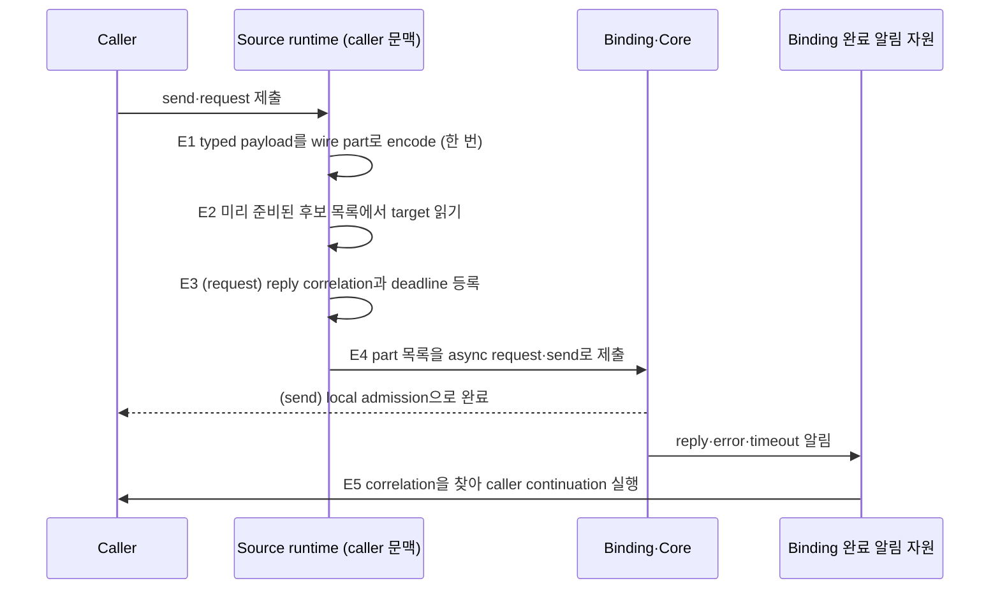
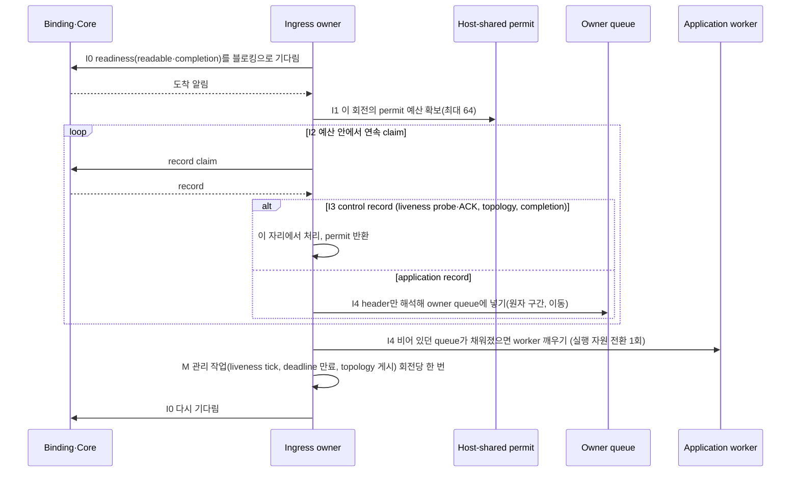

# Messaging hot path

[Execution 주제 목차](README.ko.md) · [스펙 목차](../README.ko.md) · [이전: 07. 직렬 실행기 계층](07-serial-executor-layers.ko.md)

> 이 문서는 application이 send나 request를 제출한 뒤 그 message가 상대 node의 handler에 도달하고
> reply가 caller에게 돌아올 때까지, runtime 안에서 **몇 개의 실행 단계를 어떤 순서로 지나며 어디서
> 기다리는지**를 정의한다. 독자가 관찰하는 결과는 하나다 — 같은 언어에서 Framework를 거친 send·request의
> 처리량이 Framework 없이 같은 binding socket을 직접 쓴 처리량의 0.90 이상이어야 한다(§7).
> RouteMesh channel, ClientServer channel, Spot direct call 세 API가 같은 단계를 지난다(§5).

## 1. 이 문서가 답하는 질문과 책임

Application은 message를 제출하고 완료를 관찰할 뿐, 이 문서의 단계를 지정하지 않는다. 단계는 전부
runtime이 정하고 실행한다.

| 주체 | 이 문서에서 결정·소유하는 것 |
|---|---|
| Application | send·request를 제출하고 terminator로 완료를 관찰한다. 단계를 고를 수 없다. |
| Framework(runtime) | 이 문서의 모든 단계 — source 쪽 제출 경로, target 쪽 수신 회전, handler 실행 단위, reply 경로 — 와 그 사이의 실행 자원 전환 수를 결정한다. |
| Core·binding | socket의 readiness 알림, record의 receive·claim, 완료 알림을 제공한다. 그 내부 queue와 thread는 binding이 소유하며 이 문서가 세지 않는다. |
| Remote runtime(target) | 같은 규칙으로 receive·handler·reply를 실행한다. source와 target은 역할이 다를 뿐 같은 runtime 코드다. |

이 문서가 답하는 질문은 다음이다. 완료 의미·handler 순서·permit·복사·상태 보호의 규칙은 각각의
문서가 그대로 소유하며, 이 문서는 그 규칙들이 hot path 위에서 **어떤 순서로 결합되는지**와 결합의
관찰 가능한 결과만 정한다.

| 질문 | 답이 있는 절 |
|---|---|
| 요청 하나가 source runtime 안에서 몇 번 실행 자원을 바꾸는가 | [§3](#3-source-쪽--제출-경로) |
| target runtime은 언제 깨어나고 한 번에 몇 건을 받는가 | [§4](#4-target-쪽--수신-회전) |
| handler는 어떤 실행 단위에서 돌고 reply는 어디서 보내는가 | [§4.3](#43-handler-실행-단위) |
| RouteMesh·ClientServer·Spot direct는 무엇이 같고 무엇이 다른가 | [§5](#5-세-api에-같은-단계를-적용한다) |
| 언어마다 달라도 되는 것은 무엇인가 | [§6](#6-언어별-실행-자원) |
| 구현이 이 문서를 지켰는지 무엇으로 확인하는가 | [§7](#7-검증-요구) |

이 문서가 다루지 않는 것 — Core의 I/O thread 배치와 socket byte HWM은 Core spec이, Framework 없이
binding socket을 직접 쓰는 경로의 성능은 bindings 성능 계획이, fanout(PUB/SUB)의 발행 경로와 STREAM
session의 packet 경로는 각 문서가 소유한다. 수신 쪽 permit 순서는 STREAM도 이 문서와 같은
[Application job queue 「3. Ordinary ingress permit 순서」](04-application-job-queue-and-backpressure.ko.md#3-ordinary-ingress-permit-순서)를
따른다.

## 2. 왜 단계의 모양까지 정하는가

낱개 규칙 — permit을 먼저 얻는다, 한 번 깨어나면 최대 64건을 읽는다, 고정 지연으로 폴링하지
않는다, Framework는 payload를 추가로 복사하지 않는다, 후보 목록은 변경 시점에 준비한다 — 는 이미
다른 문서에 있다. 그런데 2026-09-10의 측정([framework messaging bench](../../../../../../bench/grpc/README.ko.md),
결정 기록 `doc/plan/fw-bench-worklog/decisions.ko.md` FB-056~058)은 네 언어 runtime이 이 규칙들을
각자 다른 방식으로 어긴 것을 보여 줬다. .NET은 permit이 있으면 한 건만 읽었고, Java는 1 ms 고정
sleep으로 수신을 폴링했으며, C++은 record 한 건마다 수신 회전을 끝내고 회전마다 관리 작업을 반복했다.
결과는 같았다 — Framework 경로의 처리량이 같은 언어의 binding 직접 경로의 5~24%였다.

규칙이 낱개로 있으면 구현자는 규칙을 만족하는 여러 모양 중 하나를 고르고, 모양마다 비용이 다르다.
이 문서는 비용이 낮은 모양 하나를 정한다. 언어가 고를 수 있는 것은 실행 자원의 종류(thread, event
loop, virtual thread)뿐이고, 단계의 수·순서·기다리는 방식은 고르지 않는다.

## 3. Source 쪽 — 제출 경로

Caller가 `send`나 `request`를 제출하면 runtime은 다음 다섯 단계를 지난다. 앞의 네 단계는 caller가
호출한 그 실행 자원에서 동기적으로 끝나고, 다섯 번째만 binding의 완료 알림 자리에서 실행된다.

| 단계 | runtime이 하는 일 | 실행 자원 | 그래서 |
|---|---|---|---|
| E1 encode | typed payload를 codec으로 wire part 목록으로 만든다. header와 body를 합치려고 새 buffer를 만들지 않는다. | caller | Framework가 추가하는 전체 복사가 0이다([Payload ownership 「2」](05-payload-ownership-and-codec.ko.md#2-없앨-수-있는-복사)). |
| E2 resolve | 변경 시점에 미리 준비된 후보 목록과 선택 순서([Channel messaging 「후보 목록과 선택 순서는 변경 시점에 미리 준비한다」](../02-channel-transport/02-channel-messaging.ko.md#후보-목록과-선택-순서는-변경-시점에-미리-준비한다))에서 target 하나를 읽는다. 원자적 참조 읽기와 cursor 증가 하나다. | caller | 요청마다 peer 목록을 훑거나 상태 소유자에게 물어보지 않는다. |
| E3 register | request면 reply를 어느 request와 맞출지 식별하는 값인 [reply correlation](../00-foundation/02-glossary.ko.md#reply-correlation)과 deadline을 표에 등록한다. 등록은 caller 문맥의 원자 연산이다. | caller | 요청마다 timer 객체를 만들지 않는다. deadline 만료 검사는 §4.2의 관리 작업이나 단일 timer wheel이 한다. |
| E4 submit | binding의 async request·send API에 part 목록을 넘긴다. Framework는 자기 send queue를 두지 않는다. | caller | send는 여기서 local admission으로 완료된다([Submit과 완료 「2」](01-submit-and-completion.ko.md#2-terminator별-완료-의미와-언어별-이름)). |
| E5 complete | binding이 reply·error·timeout을 알린 그 자리에서 correlation을 찾아 caller continuation을 실행한다. Framework의 host mailbox나 dispatch thread를 거치지 않는다. | binding 완료 알림 자원 | Framework가 만드는 실행 자원 전환은 이 하나(caller continuation)뿐이다. |

**Source 경로에서 Framework가 만드는 실행 자원 전환은 E5 하나다.** 실행 자원 전환이란 message나 그
완료가 queue에 들어갔다가 다른 thread·task·event loop 회전에서 꺼내지는 지점이다. E1~E4가 caller
문맥에서 동기적으로 끝나므로 caller 하나가 100건을 연달아 제출하면 100건이 binding에 모두 도달한다.

**E2와 E3는 상태 소유자의 [state lane](../00-foundation/02-glossary.ko.md#state-lane)에 들어가지
않는다.** 후보 목록과 correlation 표는 변경은 드물고 읽기는 잦은 상태다. 변경(peer 추가·제거, weight
변경, deadline 만료)은 lane이 하고, 제출 경로는 lane이 게시한 불변 snapshot을 읽는다 —
[상태 소유와 state lane 「4. 상태 분류와 판별 기준」](06-state-ownership-and-lanes.ko.md#4-상태-분류와-판별-기준)이
읽기 전용 snapshot을 lane 밖에서 읽도록 허용하는 그 분류다. 요청마다 lane에 들어가 결과를 기다리는
구현은 이 문서 위반이다 — 2026-09-10 진단에서 요청당 lane 대기 5회가 window 100의 실제 동시 요청을
4.6건으로 떨어뜨렸다.

Backpressure로 거절된 submit은 [Application job queue 「7. Send completion과의 합성」](04-application-job-queue-and-backpressure.ko.md#7-send-completion과의-합성)대로
runtime이 흡수해 다시 제출하며, caller에게 terminal 오류로 바꾸지 않는다.

내부 확인 조건 — E1~E4 사이에 state lane `Run`·`TryPost` 호출과 새 timer 등록이 없다는 것은 trace로
확인하는 white-box 불변 조건이다.

## 4. Target 쪽 — 수신 회전

### 4.1 수신 회전의 단계

Node마다 socket readiness를 기다리고 record를 claim하는 실행 단위인 **ingress owner**가 하나 있다
(C++의 host dispatch thread, .NET의 receive loop, Java의 pump, Node의 event loop가 그것이다). ingress
owner가 한 번 깨어나서 다시 기다릴 때까지가 수신 회전 하나다.

| 단계 | ingress owner가 하는 일 | 그래서 |
|---|---|---|
| I0 wait | transport readiness — readable **과** completion — 를 블로킹으로 기다린다. idle 상한은 §4.2의 관리 주기이며 record가 도착하면 즉시 깨어난다. | 고정 지연 sleep이나 zero-timeout poll 반복이 없다. idle에서 CPU를 쓰지 않고 도착 지연이 transport 지연을 넘지 않는다. |
| I1 permit | 이 회전에서 claim할 permit 예산을 host-shared permit에서 확보한다([Application job queue 「3」](04-application-job-queue-and-backpressure.ko.md#3-ordinary-ingress-permit-순서)의 순서 그대로). 예산은 회전 상한 64건과 남은 permit 중 작은 값이다. | permit 없이 receive하지 않으며, permit이 있는 만큼만 claim한다. |
| I2 claim | 예산 안에서 Core·binding에서 record를 연속으로 claim한다. 건수 64·byte·경과 시간 상한 중 먼저 닿는 것을 적용하고 cursor를 유지한다([Application job queue 「4」](04-application-job-queue-and-backpressure.ko.md#4-소켓에서-여러-건-읽기-구현)). 한 건 claim 뒤 회전을 끝내지 않는다. | 쌓인 record 수만큼 깨우기·읽기가 반복되지 않는다. |
| I3 classify | record마다 header만 해석한다. control record — liveness probe와 ACK, topology, completion — 는 이 자리에서 처리하고 permit을 반환한다. application record는 payload를 해석하지 않고 owner만 정한다. | control record가 application backlog 뒤에서 기다리지 않는다(§4.2). |
| I4 commit | application record를 owner queue에 넣는다 — 확인과 넣기가 한 원자 구간인 [「넣을지 판단하는 것과 넣는 것을 쪼개지 않는다」](04-application-job-queue-and-backpressure.ko.md#넣을지-판단하는-것과-넣는-것을-쪼개지-않는다-구현)의 절차다. record는 이동하며 복사하지 않는다. 비어 있던 queue가 채워졌으면 준비된 owner 집합에 넣고 worker를 깨운다. | Framework가 만드는 실행 자원 전환은 이 worker 깨우기 하나다. |

**수신 회전에서 Framework가 만드는 실행 자원 전환은 I4 하나다.** "receive loop → 별도 mailbox →
dispatch pump → record마다 새 task"처럼 전환이 셋인 모양은 위반이다. 수신 문맥이 transport 소유라
별도 mailbox가 필요한 언어([Application job queue 「5」](04-application-job-queue-and-backpressure.ko.md#5-수신-처리와-상태-변경-분리-구현))는
그 mailbox가 곧 owner queue여야 하며, 수신 뒤 다시 꺼내 다른 queue로 옮기는 단계를 두지 않는다.

### 4.2 관리 작업은 회전당 한 번이다

liveness tick, deadline 만료 검사, topology와 descriptor 갱신 게시, relocation·claim 관리처럼 record와
무관하게 주기적으로 필요한 작업을 관리 작업이라고 부른다. 관리 작업은 **수신 회전의 끝에 한 번**
실행하며 record마다 반복하지 않는다. 시간 상한 안에 끝나지 않는 관리 작업은 다음 회전으로 넘긴다.

회전당 record 상한이 64건이므로 부하가 높을수록 record당 관리 비용은 최대 1/64로 줄어든다. record마다
liveness tick과 claim 조회를 반복하던 구현(2026-09-10 C++ 진단: 회전당 873 µs)은 위반이다.

**Control record는 backlog 뒤에서 기다리지 않는다.** liveness probe와 ACK는
[Application job queue 「3」](04-application-job-queue-and-backpressure.ko.md#3-ordinary-ingress-permit-순서)대로
application data line에 남지만, I3에서 claim되는 즉시 처리되므로 application worker의 backlog와 무관하다.
runtime이 probe를 놓치는 경우는 ingress owner가 record를 deadline 안에 claim하지 못할 때뿐이고, 그것은
§7의 소비율 요구로 막는다. probe 처리를 owner queue 뒤로 미루는 구현은 위반이다 — 2026-09-09
FB-054에서 약 1.6만 건 backlog 뒤에 놓인 probe가 15초 deadline을 넘겨 peer가 제거됐다.

### 4.3 Handler 실행 단위

Owner queue에 들어온 record는 지속적인 실행 자원인 **application worker**가 꺼내 실행한다.

| 단계 | worker가 하는 일 | 그래서 |
|---|---|---|
| W1 acquire | 준비된 owner 집합에서 owner를 얻고 그 owner의 [execution gate](../00-foundation/02-glossary.ko.md#execution-gate)를 잡는다([Handler turn 「6」](02-handler-turn-and-execution-gate.ko.md#6-처리-권한-획득의-함정-구현), [「11」](02-handler-turn-and-execution-gate.ko.md#11-두-동기화-지점을-싸게-만든다-구현)). | 무경합이면 원자 연산 하나로 gate를 얻는다. |
| W2 decode | typed payload를 한 번 역직렬화한다([Payload ownership 「6」](05-payload-ownership-and-codec.ko.md#6-역직렬화를-언제-하는가)). | 실행 권한을 얻기 전에는 역직렬화하지 않는다. |
| W3 run | handler를 호출한다. permit은 handler의 첫 instruction 직전에 반환한다. | handler 안의 `await`는 permit을 다시 얻지 않는다. |
| W4 reply | reply payload를 encode해 binding의 reply API로 그 자리에서 제출한다. 다른 실행 자원에 넘기지 않는다. | reply 경로에 Framework의 실행 자원 전환이 없다. |
| W5 next | 시간 예산([Handler turn 「9」](02-handler-turn-and-execution-gate.ko.md#9-시간-예산과-batch-처리-구현)) 안이면 같은 owner의 다음 record를 처리하고, 아니면 gate를 반납하고 다음 owner로 간다. | 한 owner가 worker를 독점하지 않는다. |

**record마다 실행 단위를 새로 만들지 않는다.** 요청마다 task·future·virtual thread를 만들고 supervisor에
등록하는 모양은 위반이다. worker는 지속적이고 record는 worker에 묶음으로 넘어간다. 언어의 실행 자원이
task 기반이어도(예: thread pool의 work item) work item 하나가 여러 record를 처리한다.

**이 문서는 handler 동시성을 줄이지 않는다.** 같은 gate의 두 turn이 동시에 실행되지 않는 규칙
([Handler turn 「1」](02-handler-turn-and-execution-gate.ko.md#1-queue와-gate-분리-원칙))은 그대로이고,
다른 gate의 turn은 여러 worker에서 병렬로 돈다. worker 하나로 직렬화해 전환을 줄이는 구현은 위반이다 —
2026-09-10 .NET 진단에서 inline dispatch 실험이 window 처리량을 절반으로 낮췄다.

**handler instance 조회와 DI scope는 W1~W3 안에서 상수 시간이다.** scoped handler의 의미는 유지하되,
scope 생성과 조회가 record마다 컨테이너를 탐색하지 않도록 활성화 경로를 캐시한다.

내부 확인 조건 — I2가 claim한 record 수와 I4가 worker를 깨운 횟수의 비가 부하에서 64:1에 접근하고,
W1~W4 사이에 새 task 생성이 없다는 것은 trace로 확인하는 white-box 불변 조건이다.

## 5. 세 API에 같은 단계를 적용한다

세 API는 E1~E5, I0~I4·M, W1~W5를 공유한다. 다른 것은 E2가 읽는 후보 목록의 종류와 reply가 도착하는
connection뿐이다.

| API | E2가 읽는 것 | connection 모양 | reply의 경로 |
|---|---|---|---|
| [RouteMesh](../00-foundation/02-glossary.ko.md#routemesh) channel | channel별 후보 목록과 가중 라운드로빈 순서 | ROUTER–ROUTER. reply는 별도 [Completion connection](../00-foundation/02-glossary.ko.md#completion-connection)으로 온다. | Completion connection → binding 완료 알림 → E5 |
| [ClientServer channel](../00-foundation/02-glossary.ko.md#clientserver-channel) | ready Server 후보 목록([ClientServer 「4」](../02-channel-transport/03-client-server-channel.ko.md#4-weight와-target-선택)) | DEALER(client)–ROUTER(server), Application connection 하나 | 같은 connection에서 receive 전에 completion으로 식별되면 permit을 우회해([Application job queue 「3」](04-application-job-queue-and-backpressure.ko.md#3-ordinary-ingress-permit-순서)) E5 |
| [Spot direct](../00-foundation/02-glossary.ko.md#spot-direct) | current owner를 가리키는 [positive route cache](../00-foundation/02-glossary.ko.md#positive-route-cache)([Spot 주소 메시징 「5」](../03-spot-actor/06-spot-address-messaging.ko.md#5-existing-owner를-향한-direct-call과-완료-경계)) | owner node의 RouteMesh와 같다 | RouteMesh와 같다 |

ClientServer의 reply가 앞선 DATA와 같은 FIFO를 지나는 제약([ClientServer 「5」](../02-channel-transport/03-client-server-channel.ko.md#5-send-request와-reply))은
Core 계약이며 이 문서가 바꾸지 않는다.

Spot direct에서 instance가 아직 없어 만들어야 하는 [cold activation](../00-foundation/02-glossary.ko.md#cold-activation)과
이동 중 message는 hot path가 아니다 — [Spot 주소 메시징](../03-spot-actor/06-spot-address-messaging.ko.md)과
[Relocation](../05-location-relocation/04-relocation-flow.ko.md)의 느린 경로를 따르고, ready owner를 향한
그 이후의 message가 이 문서의 단계를 따른다.

## 6. 언어별 실행 자원

실행 자원의 종류는 언어가 정한다. 단계의 수·순서·기다리는 방식은 정하지 않는다.

**언어별 재량** — ingress owner와 worker를 어떤 종류의 실행 자원(OS thread, thread pool work item,
virtual thread, event loop 회전)으로 만들지는 언어가 정한다. 어느 종류든 I0의 블로킹 대기, I2의 연속
claim, I4 한 번의 전환, W1~W5의 묶음 처리라는 관찰 결과는 같으며, 확인 기준은 §7의 (a)~(c)다.

| 언어 | ingress owner (I0~I4·M) | application worker (W1~W5) | E5가 실행되는 자원 |
|---|---|---|---|
| C++ | node별 host dispatch thread. `poll(timeout)`으로 readable과 completion을 함께 기다린다. | application executor의 worker thread. task 없이 record 묶음을 처리한다. | binding poller thread에서 caller awaiter를 완료한다. |
| .NET | MeshNode receive loop. poller `Wait`(PollIn·PollCompletion)로 기다린다. | ThreadPool work item이 owner의 record 묶음을 처리한다. 요청당 `Task<Task>`를 만들지 않는다. | binding completion continuation에서 caller `TaskCompletionSource`를 완료한다. |
| Java | virtual-thread pump. poller의 블로킹 readiness(readable과 `POLLCOMPLETION`)를 기다린다. | application lane worker. record마다 virtual thread를 만들지 않는다. | binding completion에서 caller `CompletableFuture`를 완료한다. |
| Node | event loop의 readable callback. 회전당 batch budget을 쓴다. | 같은 event loop의 microtask. handler는 `await`로 양보한다. | 같은 event loop. |

각 언어 문서(`spec/server/languages/`)는 이 표의 행을 자기 runtime의 실제 타입 이름으로 다시 적고,
§7의 검증이 어느 테스트와 벤치에서 확인되는지 기록한다.

## 7. 검증 요구

(a)~(d)는 언어별 contract test가, (e)~(g)는 [framework messaging bench](../../../../../../bench/grpc/README.ko.md)의
3-run 중앙값이 확인한다.

- (a) **실행 자원 전환 수**: 수신 회전에서 Framework가 만드는 전환 1(I4), 제출 경로에서 1(E5). 요청 하나가
  지나는 실행 자원 전환을 trace로 세는 테스트가 각 언어에 있다.
- (b) **기다리는 방식**: idle에서 ingress owner의 CPU 사용이 0에 수렴하고, record 도착부터 I2 claim까지의
  지연이 transport 지연 이상으로 늘지 않는다. 고정 sleep 값이 관측되지 않는다.
- (c) **묶음 claim**: 64건이 쌓인 상태에서 한 회전이 64건을 claim한다(permit이 충분할 때). permit이 부족하면
  남은 permit만큼 claim하고 나머지는 Core queue에 둔다 — reject·drop이 없다.
- (d) **복사**: [Payload ownership 「9」](05-payload-ownership-and-codec.ko.md#9-검증-요구)의 계측으로 Framework가
  추가하는 전체 복사가 0이다.
- (e) **처리량**: 같은 언어에서 Framework 경로의 처리량이 binding 직접 경로의 **0.90 이상** — bench 행으로는
  `zlink-framework-<lang> / zlink-<lang>`가 request-serial·request-window·send-saturation 모두 0.90 이상이다.
  이 값은 bench 규격 §7.2 formula 2의 합격선 0.80보다 높으며 이 문서가 소유한다.
- (f) **동시성**: request-window(100)에서 평균 in-flight(처리량 × 평균 지연)가 90 이상이다.
- (g) **소비율**: send-saturation에서 active 구간이 닫힌 뒤 남은 record를 소비하는 drain 시간이 active 길이의
  10% 이하다 — ingress 소비율이 source admission 속도의 0.9 이상이라는 뜻이다.

(e)~(g)에 미달하면 그 언어의 runtime이 이 문서를 위반한 것이며, 벤치 조건이나 timeout·HWM 값을 조정해
맞추지 않는다.
