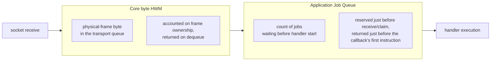

# Execution

[Spec table of contents](../README.en.md) · [Next: 01. Submit And Completion](01-submit-and-completion.en.md)

> From the moment Application submits a message, through handler execution, to the
> completion that returns to the caller — this topic covers that one path.

## 1. What Execution Covers

When Application submits a Messaging or Worker call, the call passes source-local
admission, enters the target owner's queue, has its handler executed in execution-gate
order, and completes with whichever result — reply, timeout, cancellation, or shutdown —
is decided first. This topic covers that entire path — from submit to completion.

- [Submit And Completion](01-submit-and-completion.en.md) covers when each terminator
  completes and what operation identity means.
- [Handler Turn And Execution Gate](02-handler-turn-and-execution-gate.en.md) covers when
  a handler executes and when it yields its place to another handler.
- [Cancellation And Shutdown](03-cancellation-and-shutdown.en.md) covers what
  cancellation and shutdown can and cannot do to work that has already started.
- [Application Job Queue And Backpressure](04-application-job-queue-and-backpressure.en.md)
  covers the capacity of jobs waiting before a handler starts.
- [Payload Ownership And Codec](05-payload-ownership-and-codec.en.md) covers ownership and
  copying of a message on its way from the socket to the handler.
- [State Ownership And State Lanes](06-state-ownership-and-lanes.en.md) covers the mechanism
  by which a component guards its own mutable state.
- [Serial Executor Layers](07-serial-executor-layers.en.md) covers which serial unit
  each of Spot, Actor, and Session runs its work on, and who owns that unit's lifetime.

What this topic does not define — the repeating callback a Spot registers is owned by
[Spot Timer](../03-spot-actor/10-spot-timer.en.md), the Actor/Spot model itself and queue
structure are owned by the [Actor Model](../03-spot-actor/04-actor-model.en.md), the lifecycle of a session and a
STREAM connection is owned by [Session](../04-session/README.en.md), and movement between
nodes is owned by [Relocation](../05-location-relocation/04-relocation-flow.en.md).

## 2. Roles and Responsibilities

| Party | Decides / owns |
|---|---|
| Application | Submits calls and observes completion through a terminator. Changes state inside the handler and returns an exception or a reply. |
| Framework (runtime) | Decides the admission boundary, execution-gate order, the return/hold scope of `Yield`/`Defer()`, the request-completion race, and Application Job Queue permits. |
| Core | Manages Core HWM by the physical-frame byte in the transport queue, and owns the retry and completion of the binding operation. |
| Provider (remote target) | Executes the handler and produces a reply or an error. Provider failure does not change the original dispatch result. |

## 3. Two Capacity Authorities

The execution path has capacity limits in two places for different purposes. Because the
two are easy to mistake for a single limit, the diagram distinguishes them.



- **Core byte HWM** is the byte-level last-resort safeguard for the transport path. Even
  when Framework pressure eases, data that has already entered may still be present.
- **Application Job Queue** is a Framework-owned limit that counts jobs waiting before
  handler start. Even when the Core queue is empty, a handler job can still wait a long
  time.
- The two counters do not copy values from one another. They share no configuration,
  profile, unit, accounting boundary, or observed value.

The precise order in which the two authorities meet (the ordinary ingress permit order) is
owned by
[Application Job Queue And Backpressure "1. Two Independent Capacity Authorities"](04-application-job-queue-and-backpressure.en.md#1-two-independent-capacity-authorities).

## 4. Find by Question

| Question | Section with the answer |
|---|---|
| When does each of submit/send/request complete | [Submit And Completion "2. Completion Meaning Per Terminator And Per-Language Names"](01-submit-and-completion.en.md#2-completion-meaning-per-terminator-and-per-language-names) |
| What does the caller receive when it hits backpressure, and when does it wait versus fail immediately | [Submit And Completion "5. Backpressure And Error Classification"](01-submit-and-completion.en.md#5-backpressure-and-error-classification) · [Application Job Queue And Backpressure](04-application-job-queue-and-backpressure.en.md) |
| Why can't another handler on the same Spot interject while a handler is executing | [Handler Turn And Execution Gate "1. Separating Queue From Gate"](02-handler-turn-and-execution-gate.en.md#1-separating-queue-from-gate) |
| What do `Yield` and `Defer()` each return and each hold on to | [Handler Turn And Execution Gate "3. Gate And Claim On `Yield`"](02-handler-turn-and-execution-gate.en.md#3-gate-and-claim-on-yield) · ["5. Actor Join And The Defer Completion Boundary"](02-handler-turn-and-execution-gate.en.md#5-actor-join-and-the-defer-completion-boundary) |
| While a handler waits for a remote response, why do timeout, shutdown, and new connections keep progressing | [Handler Turn And Execution Gate "13. Separating Application Progress From Infrastructure Progress"](02-handler-turn-and-execution-gate.en.md#13-separating-application-progress-from-infrastructure-progress) |
| Why are Core byte HWM and the Framework job-count limit different values, and where do they meet | [§3](#3-two-capacity-authorities) · [Application Job Queue And Backpressure "1. Two Independent Capacity Authorities"](04-application-job-queue-and-backpressure.en.md#1-two-independent-capacity-authorities) |
| What does cancellation do, and not do, to work already started | [Cancellation And Shutdown](03-cancellation-and-shutdown.en.md) |
| How many times is a byte copied on its way from the socket to the handler | [Payload Ownership And Codec](05-payload-ownership-and-codec.en.md) |
| When reply, timeout, cancellation, and shutdown arrive at the same time, which one wins | [Submit And Completion "9. Request Completion — The Completion Race And Timeout Budget"](01-submit-and-completion.en.md#9-request-completion--the-completion-race-and-timeout-budget) |
| What are the limits (`MaxQueuedApplicationJobs`, pause/resume %, lane caps, dispatcher 4,096) | [§6](#6-numeric-summary-table) |
| Which queue does a Spot's Actor and Timer work run on | [Serial Executor Layers "4. Spot Execution Mode And Queue Path"](07-serial-executor-layers.en.md#4-spot-execution-mode-and-queue-path) |
| What stops one owner from holding a queue too long | [Serial Executor Layers "6.4 Fairness"](07-serial-executor-layers.en.md#64-fairness) |
| Why does a component guard state with a state lane instead of a lock | [State Ownership And State Lanes "3. The Prohibited Shape"](06-state-ownership-and-lanes.en.md#3-the-prohibited-shape) |
| What is the difference between a state lane and the Application lane | [State Ownership And State Lanes "2. Terminology — State Lane Versus Application/Lifecycle Lane"](06-state-ownership-and-lanes.en.md#2-terminology--state-lane-versus-applicationlifecycle-lane) |

## 5. Documents and Reading Order

```
01-submit-and-completion.en.md              the contract from submit to completion
02-handler-turn-and-execution-gate.en.md     the order in which a handler executes and the return rules
03-cancellation-and-shutdown.en.md           cancellation/shutdown of work already started
04-application-job-queue-and-backpressure.en.md  capacity before handler start
05-payload-ownership-and-codec.en.md         ownership and copying of a message
06-state-ownership-and-lanes.en.md           the mechanism that guards a component's state
```

For a developer reading this for the first time, the order is as follows: understanding
what submit treats as completion (01) is a prerequisite for understanding handler execution
order (02). Cancellation (03), capacity (04), payload ownership (05), and state ownership
(06) then each cover a narrow scope.

## 6. Numeric Summary Table

The values themselves are owned by each document. This table only collects where each
number lives.

| Number | Default | Owning document |
|---|---|---|
| `MaxQueuedApplicationJobs`, pause/resume ratio | see document | [Application Job Queue And Backpressure](04-application-job-queue-and-backpressure.en.md) |
| Application lane / lifecycle lane caps, owner occupancy time budget, lifecycle consecutive-execution cap | 1,024 items·64 MiB / 128 items·4 MiB, 10 ms, 8 turns | [Handler Turn And Execution Gate "7. Lane Separation And Priority (Implementation)"](02-handler-turn-and-execution-gate.en.md#7-lane-separation-and-priority-implementation) |
| Send timeout default, admission deadline owner | 1 second per family | [Submit And Completion "7. Admission Deadline — Owner And Value Rules"](01-submit-and-completion.en.md#7-admission-deadline--owner-and-value-rules) |
| Dispatcher concurrent-callback cap | 4,096 | [Submit And Completion "10. Operation Identity And Where Completion Happens (Implementation)"](01-submit-and-completion.en.md#10-operation-identity-and-where-completion-happens-implementation) |
| [MaxMessageSize](../00-foundation/02-glossary.en.md#maxmessagesize), the maximum message size a listener can receive (StreamNode) | 64 KiB | [Application Job Queue And Backpressure](04-application-job-queue-and-backpressure.en.md) |

---

[Spec table of contents](../README.en.md) · [Next: 01. Submit And Completion](01-submit-and-completion.en.md)
