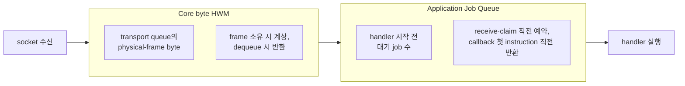

# Execution

[스펙 목차](../README.ko.md) · [다음: 01. Submit과 완료](01-submit-and-completion.ko.md)

> Application이 message를 submit하는 순간부터 handler가 실행되고 완료가 caller에게
> 돌아갈 때까지 — 이 주제는 그 경로 하나를 다룬다.

## 1. Execution이 다루는 범위

Application이 Messaging·Worker call을 submit하면, 그 call은 source-local admission을
거쳐 target owner의 queue에 들어가고, execution gate 순서에 따라 handler가 실행되며,
reply·timeout·cancellation·shutdown 가운데 먼저 확정된 결과로 완료된다. 이 주제는 이
경로 전체 — submit부터 완료까지 — 를 다룬다.

- [Submit과 완료](01-submit-and-completion.ko.md)는 각 terminator가 언제 완료되는지,
  operation identity가 무엇인지를 다룬다.
- [Handler turn과 execution gate](02-handler-turn-and-execution-gate.ko.md)는 handler가
  언제 실행되고 다른 handler에게 언제 자리를 내주는지를 다룬다.
- [취소와 종료](03-cancellation-and-shutdown.ko.md)는 이미 시작된 작업을 cancellation과
  shutdown이 무엇을 할 수 있고 무엇을 못 하는지를 다룬다.
- [Application job queue와 backpressure](04-application-job-queue-and-backpressure.ko.md)는
  handler 시작 전 대기하는 job의 capacity를 다룬다.
- [Payload ownership과 codec](05-payload-ownership-and-codec.ko.md)은 message가 socket에서
  handler에 이르는 동안의 소유권과 복사를 다룬다.
- [상태 소유와 state lane](06-state-ownership-and-lanes.ko.md)은 컴포넌트가 자신의 mutable
  상태를 어떤 메커니즘으로 지키는지를 다룬다.

이 주제가 다루지 않는 것 — Spot이 등록하는 반복 callback은
[Spot timer](../03-spot-actor/10-spot-timer.ko.md)가, Actor·Spot 모델 자체와 queue 구조는
[Actor 모델](../03-spot-actor/04-actor-model.ko.md)이, session과 STREAM connection의 lifecycle은
[Session](../04-session/README.ko.md)이, node 사이 이동은
[Relocation](../05-location-relocation/04-relocation-flow.ko.md)이 소유한다.

## 2. 역할과 책임

| 주체 | 결정·소유하는 것 |
|---|---|
| Application | Call을 submit하고 terminator로 완료를 관찰한다. Handler 안에서 상태를 바꾸고 예외나 reply를 반환한다. |
| Framework(runtime) | Admission boundary, execution gate 순서, `Yield`·`Defer()`의 반납·유지 범위, request completion 경쟁, Application Job Queue permit을 결정한다. |
| Core | Transport queue의 physical-frame byte로 Core HWM을 관리하고, binding operation의 재시도와 완료를 소유한다. |
| Provider(원격 target) | Handler를 실행하고 reply나 오류를 만든다. Provider failure는 원래 dispatch 결과를 바꾸지 않는다. |

## 3. 두 capacity authority

Execution 경로에는 서로 다른 목적의 capacity 제한이 두 곳에 있다. 하나로 착각하기 쉬운
지점이라 그림으로 구분한다.



- **Core byte HWM**은 전송 경로의 byte 단위 마지막 안전장치다. Framework pressure가
  줄여도 이미 들어간 data가 있을 수 있다.
- **Application Job Queue**는 handler 시작 전 대기 job 수를 세는 Framework 소유
  한도다. Core queue가 비어 있어도 handler job은 오래 대기할 수 있다.
- 두 counter는 서로 값을 복사하지 않는다. 설정·profile·단위·계상 경계·관측값을
  공유하지 않는다.

두 authority가 만나는 정확한 순서(ordinary ingress permit 순서)는
[Application job queue와 backpressure 「1. 두 독립된 capacity authority」](04-application-job-queue-and-backpressure.ko.md#1-두-독립된-capacity-authority)가
소유한다.

## 4. 질문으로 찾기

| 질문 | 답이 있는 절 |
|---|---|
| Submit·send·request는 각각 언제 완료되는가 | [Submit과 완료 「2. Terminator별 완료 의미와 언어별 이름」](01-submit-and-completion.ko.md#2-terminator별-완료-의미와-언어별-이름) |
| Backpressure에 걸리면 caller는 무엇을 받는가, 언제 기다리고 언제 즉시 실패하는가 | [Submit과 완료 「5. Backpressure와 오류 분류」](01-submit-and-completion.ko.md#5-backpressure와-오류-분류) · [Application job queue와 backpressure](04-application-job-queue-and-backpressure.ko.md) |
| Handler가 실행되는 동안 같은 Spot의 다른 handler는 왜 끼어들 수 없는가 | [Handler turn과 execution gate 「1. Queue와 gate 분리 원칙」](02-handler-turn-and-execution-gate.ko.md#1-queue와-gate-분리-원칙) |
| `Yield`와 `Defer()`는 각각 무엇을 반납하고 무엇을 유지하는가 | [Handler turn과 execution gate 「3. `Yield` 시 gate와 claim」](02-handler-turn-and-execution-gate.ko.md#3-yield-시-gate와-claim) · [「5. Actor Join과 `Defer()` 완료 경계」](02-handler-turn-and-execution-gate.ko.md#5-actor-join과-defer-완료-경계) |
| handler가 원격 응답을 기다리는 동안 timeout·종료·새 연결은 왜 계속 진행하는가 | [Handler turn과 execution gate 「13. Application과 infrastructure 진행 분리」](02-handler-turn-and-execution-gate.ko.md#13-application과-infrastructure-진행-분리) |
| Core byte HWM과 Framework job 수 제한은 왜 다른 값인가, 어디서 만나는가 | [§3](#3-두-capacity-authority) · [Application job queue와 backpressure 「1. 두 독립된 capacity authority」](04-application-job-queue-and-backpressure.ko.md#1-두-독립된-capacity-authority) |
| Cancellation은 이미 시작된 작업에 무엇을 하는가, 무엇을 못 하는가 | [취소와 종료](03-cancellation-and-shutdown.ko.md) |
| message가 socket에서 handler까지 가는 동안 byte를 몇 번 복사하는가 | [Payload ownership과 codec](05-payload-ownership-and-codec.ko.md) |
| 응답·timeout·취소·종료가 동시에 오면 무엇이 이기는가 | [Submit과 완료 「9. Request completion — 완료 경쟁과 timeout budget」](01-submit-and-completion.ko.md#9-request-completion--완료-경쟁과-timeout-budget) |
| 제한은 무엇인가 (`MaxQueuedApplicationJobs`, pause/resume %, lane 상한, dispatcher 4,096) | [§6](#6-수치-요약표) |
| 컴포넌트 상태는 왜 lock 대신 state lane으로 지키는가 | [상태 소유와 state lane 「3. 금지되는 형태」](06-state-ownership-and-lanes.ko.md#3-금지되는-형태) |
| state lane과 Application lane은 무엇이 다른가 | [상태 소유와 state lane 「2. 용어 구분 — state lane과 Application/lifecycle lane」](06-state-ownership-and-lanes.ko.md#2-용어-구분--state-lane과-applicationlifecycle-lane) |

## 5. 문서와 읽는 순서

```
01-submit-and-completion.ko.md              submit부터 완료까지의 계약
02-handler-turn-and-execution-gate.ko.md     handler가 실행되는 순서와 반납 규칙
03-cancellation-and-shutdown.ko.md           이미 시작된 작업의 취소·종료
04-application-job-queue-and-backpressure.ko.md  handler 시작 전 capacity
05-payload-ownership-and-codec.ko.md         message의 소유권과 복사
06-state-ownership-and-lanes.ko.md           컴포넌트 상태를 지키는 메커니즘
```

처음 읽는 개발자는 이 순서대로 읽는다 — submit이 무엇을 완료로 보는지(01) 알아야
handler 실행 순서(02)를 이해할 수 있고, 그 위에서 취소(03)·capacity(04)·payload 소유권(05)·
상태 소유(06)가 각각 좁은 범위를 다룬다.

## 6. 수치 요약표

값 자체는 각 문서가 소유한다. 여기서는 어떤 수치가 어디에 있는지만 모은다.

| 수치 | 기본값 | 소유 문서 |
|---|---|---|
| `MaxQueuedApplicationJobs`, pause/resume 비율 | 문서 참고 | [Application job queue와 backpressure](04-application-job-queue-and-backpressure.ko.md) |
| Application lane / lifecycle lane 상한, owner 점유 시간 예산, lifecycle 연속 실행 상한 | 1,024건·64 MiB / 128건·4 MiB, 10 ms, 8 turn | [Handler turn과 execution gate 「7. Lane 분리와 우선순위 (구현)」](02-handler-turn-and-execution-gate.ko.md#7-lane-분리와-우선순위-구현) |
| Send timeout 기본값, admission deadline owner | family별 1초 | [Submit과 완료 「7. Admission deadline — owner와 값 규칙」](01-submit-and-completion.ko.md#7-admission-deadline--owner와-값-규칙) |
| Dispatcher 동시 callback 상한 | 4,096 | [Submit과 완료 「10. Operation identity와 완료 자리 (구현)」](01-submit-and-completion.ko.md#10-operation-identity와-완료-자리-구현) |
| Listener가 받을 수 있는 message byte 상한인 [MaxMessageSize](../00-foundation/02-glossary.ko.md#maxmessagesize) (StreamNode) | 64 KiB | [Application job queue와 backpressure](04-application-job-queue-and-backpressure.ko.md) |

---

[스펙 목차](../README.ko.md) · [다음: 01. Submit과 완료](01-submit-and-completion.ko.md)
