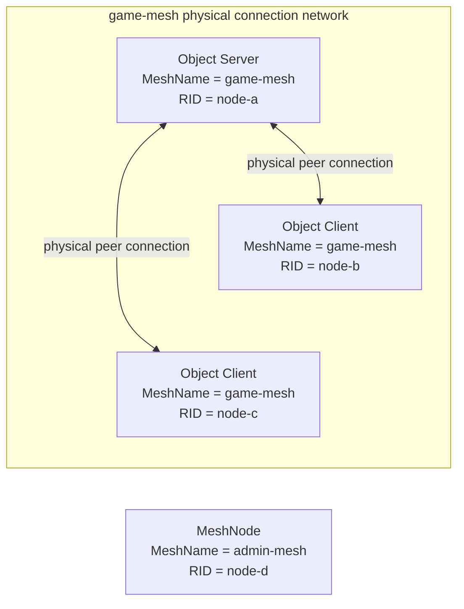
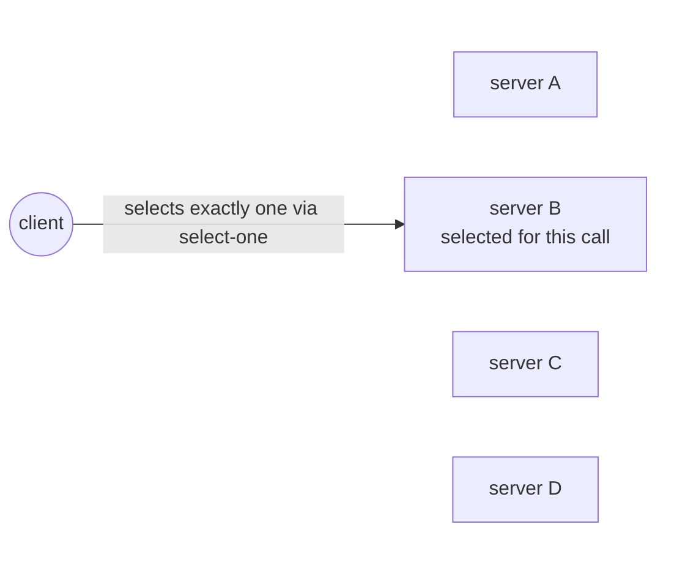
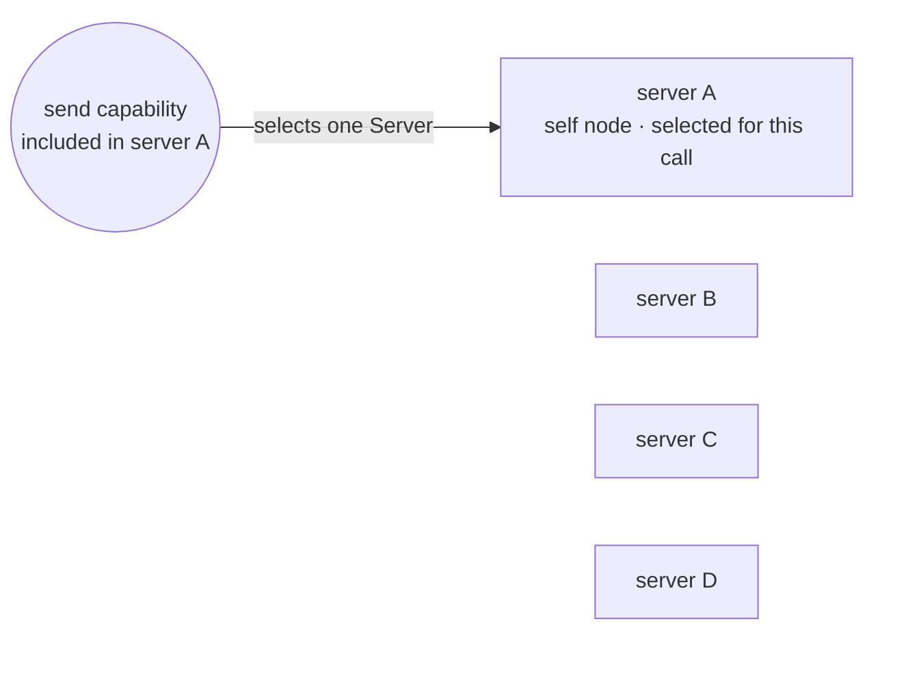

# RouteMesh Topology

[Channel·Transport topic table of contents](README.en.md) · [Spec table of contents](../README.en.md) · [Next: 02. Channel Messaging](02-channel-messaging.en.md)

> Defines how to configure the physical connections of a
> [RouteMesh](../00-foundation/02-glossary.en.md#routemesh) — the scope in which several MeshNodes
> participate and exchange node and Channel messages — and
> [ChannelName](../00-foundation/02-glossary.en.md#channelname)'s logical membership in ZLink
> Framework.

## 1. RouteMesh Topology Overview — Values the Application Configures and Results the Framework Produces

This document's target audience is developers implementing or reviewing topology
registration and startup validation.

The application builds a scope of nodes to connect to each other via
[MeshName](../00-foundation/02-glossary.en.md#meshname) — the name that identifies one RouteMesh
physical connection group — and
registers a Client or Server role per [ChannelName](../00-foundation/02-glossary.en.md#channelname)
within it. Adding a ChannelName doesn't add a socket or inter-node connection.

| Value the application configures | Result the framework produces |
|---|---|
| `MeshName` | Builds one RouteMesh that MeshNodes using the same name participate in. Doesn't automatically relay between nodes of different [MeshName](../00-foundation/02-glossary.en.md#meshname)s. |
| [MeshNode](../00-foundation/02-glossary.en.md#meshnode) | Has one routing ID and a ROUTER endpoint peers connect to. Several ChannelNames share this ROUTER connection. |
| ChannelName `Client` role | Only registers the path to send a message under that ChannelName in the current process. Doesn't publish it as Server membership a remote node can select. |
| ChannelName `Server` role | Registers both the send path and remote target membership, and provides a handler and selection weight. |

This document's contract applies commonly to every framework language. The C# code
below is a reference showing how the common behavior appears in the .NET public API.
It doesn't require the same signature in other languages. The precise .NET signature is
defined by
[.NET Topology Public Interface](../languages/dotnet/interfaces/03-configuration-topology.en.md).

```csharp
public interface IZLinkFrameworkOptions
{
    IZLinkNetworkOptions ConfigureNetwork();

    // registers one RouteMesh MeshNode in the same process.
    IZLinkMeshNodeBuilder AddRouteMesh(string meshName);
}

public interface IZLinkMeshNodeBuilder
{
    // registers a ChannelName role that shares this MeshNode's ROUTER.
    IZLinkMeshChannelRoleBuilder Channel(string channelName);

    // configures the ROUTER listener peers connect to.
    IZLinkMeshNodeBuilder Listen(string endpoint);
    IZLinkMeshNodeBuilder Listen(int port = 0);

    // the bind address and the address advertised to remote can differ.
    IZLinkMeshNodeBuilder SetBindHost(string bindHost);
    IZLinkMeshNodeBuilder SetAdvertiseHost(string advertiseHost);

    // in automatic topology, only specify the prefix — the framework builds the full RID.
    IZLinkMeshNodeBuilder SetRoutingIdPrefix(string prefix);

    // a fixed RID can only be used in manual topology.
    IZLinkMeshNodeBuilder SetRoutingId(RoutingId routingId);

    IZLinkMeshNodeSocketConfig ConfigureRouterSocket();
    IZLinkMeshPeerConnections PeerConnections { get; }
}

public interface IZLinkNetworkOptions
{
    string BindHost { get; set; }
    string? AdvertiseHost { get; set; }
}

public interface IZLinkMeshNodeSocketConfig
{
    ulong SendHighWaterMark { get; set; }     // send-direction socket HWM.
    ulong ReceiveHighWaterMark { get; set; }  // receive-direction socket HWM.
    ulong MailboxMessageBudget { get; set; }  // per-owner mailbox message count cap, separate from socket HWM.
    ulong MailboxByteBudget { get; set; }     // per-owner mailbox byte cap, separate from socket HWM.
    TimeSpan? ReceiveTimeout { get; set; }
    TimeSpan? SendTimeout { get; set; }
}
```

## 2. MeshName and MeshNode

Nodes that need to communicate with each other participate in a
[RouteMesh](../00-foundation/02-glossary.en.md#routemesh) using the same `MeshName`. MeshName
distinguishes both the physical connection scope and the scope within which
[routing ID](../00-foundation/02-glossary.en.md#routing-id) must be unique.

Only one MeshNode with the same MeshName can be registered in the same process.
Multiple MeshNodes of different MeshNames can be registered. Each MeshNode builds a
separate physical connection network with the peers belonging to its own MeshName.

The framework doesn't automatically forward a message received on one RouteMesh to a
different RouteMesh, or substitute a different RouteMesh when a target isn't found on
one. This is what "doesn't automatically relay between meshes" means.

However, an application in the same process can start a message call separately
through different RouteMeshes. A [Node direct](../00-foundation/02-glossary.en.md#node-direct) call
specifies the physical connection network via MeshName and target RID. A Channel call
uses the RouteMesh registered for the ChannelName in the current process.

For example, a handler processing a message received on `game-mesh` can, at the
application's discretion, start a new Node direct call specifying `admin-mesh`. This
call isn't the framework relaying the existing message — it's a new call the
application started, targeting a different physical connection network.

One MeshNode has the following values.

| Value | Meaning |
|---|---|
| MeshName | Sets which RouteMesh this node participates in. |
| Routing ID | Identifies the node within the same RouteMesh. |
| ROUTER endpoint | The address at which a different MeshNode connects directly to this node. |

The framework confirms the endpoint to provide to other nodes after actually binding
the ROUTER endpoint, and publishes a
[MeshNode descriptor](../00-foundation/02-glossary.en.md#meshnode-descriptor). A MeshNode descriptor
is RouteMesh-specific connection information recorded in the
[Location Store](../00-foundation/02-glossary.en.md#location-store) — a store that keeps a target's
current owner and state so multiple nodes can check them together — so a different node can find this
MeshNode and verify the connection.

This registration information includes MeshName, RID, lifecycle generation,
[descriptor](../00-foundation/02-glossary.en.md#descriptor) revision, the actual ROUTER endpoint, the
Server ChannelName set, and weight. A different node must find the endpoint from this
registration information and then re-verify identity and lifecycle on the transport
handshake before using the connection as ready. Routing ID, MeshName, and endpoint
identity don't change while the MeshNode is running.

## 3. ChannelName Role and Membership (Client/Server, Registration Interface)

`ChannelName` is a name the application uses to specify the logical target of a
Channel send and request. The same ChannelName can be registered by Servers in
multiple processes, and at call time the framework picks one currently selectable
Server among them.

The RouteMesh builder registers one `Client` or `Server`
[membership](../00-foundation/02-glossary.en.md#membership) per ChannelName.

| Role | Message call | Published as a remote target | Handler and weight |
|---|---|---|---|
| `Client` | Can start a send and request for that ChannelName. | Not published. A different node doesn't select this process as that ChannelName's target. | Not provided. |
| `Server` | Like Client, can start sends and requests. | Published as target membership for that ChannelName. | Provides a handler and `0..10000` weight for that ChannelName. |

In the following .NET interface, `Channel(...)` sets the ChannelName, and the
subsequent `Client()` or `Server()` fixes this process's role. Only the Server role
registers a handler and selection weight.

```csharp
public interface IZLinkMeshNodeBuilder
{
    // sets the logical ChannelName that shares this MeshNode's ROUTER connection.
    IZLinkMeshChannelRoleBuilder Channel(string channelName);
}

public interface IZLinkMeshChannelRoleBuilder
{
    // registers only the send path — doesn't publish remote target membership.
    IZLinkMeshChannelClientBuilder Client();

    // registers the send path and target membership, and configures handler and weight.
    IZLinkMeshChannelServerBuilder Server();
}

// the Client role has no configuration to add a handler or weight.
public interface IZLinkMeshChannelClientBuilder
{
}

public interface IZLinkMeshChannelServerBuilder
{
    // 0 keeps the Server role but excludes it from new target selection.
    IZLinkMeshChannelServerBuilder SetWeight(int weight);

    IZLinkMeshChannelServerBuilder AddSendHandler<THandler, TMessage>(
        string? packetName = null)
        where THandler : class, IZLinkSendHandler<TMessage>;

    IZLinkMeshChannelServerBuilder AddRequestHandler<THandler, TRequest, TReply>(
        string? packetName = null)
        where THandler : class, IZLinkRequestHandler<TRequest, TReply>;
}
```

The following example registers a send-only `lobby` Channel and a request-handling
`match` Server Channel together on one MeshNode.

```csharp
var mesh = options
    .AddRouteMesh("game-mesh")
    .Listen(7001);

mesh.Channel("lobby")
    .Client(); // starts calls but isn't published as a lobby target.

mesh.Channel("match")
    .Server()
    .SetWeight(100) // becomes a selection candidate for new match calls.
    .AddRequestHandler<JoinMatchHandler, JoinMatch, JoinResult>(); // registers the request handler
```

The two ChannelNames don't create separate sockets — they share the `game-mesh`
MeshNode's ROUTER and peer connections.

Since Server role also includes send functionality, the Client role isn't registered
again for the same ChannelName. `SetWeight(0)` isn't an API that turns Server role
into Client. Server membership is kept, but only excluded from new select-one and
Logical Multicast remote target selection.

## 4. When a Call Can Start Without a Local Server

If a MeshNode doesn't need to be a target receiving Channel messages, the ChannelName
doesn't need to be registered with the `Server` role. For this MeshNode to start a
call under a specific ChannelName, register that ChannelName with the `Client` role.
The `Server` role for the same ChannelName must be registered on a remote MeshNode of
the same MeshName that will process the message.

`Client` and `Server` roles aren't settings that create a separate socket. Both roles
use the current MeshNode's same ROUTER and peer connections. The difference is
whether membership is published to the Channel target list, and whether a handler and
selection weight are provided.

A MeshNode with object role `Client` only starts object calls and isn't assigned Actors or
[Spots](../00-foundation/02-glossary.en.md#spot) — a Spot is a logical instance with an address
and state, reachable through the same global ID even after the executing node changes. This restriction doesn't apply to the RouteMesh Channel role. So an
Object Client can also register Channel `Client` or `Server` role. Registering the
Channel `Server` role makes it a target processing that ChannelName's messages.

However, an application Node direct handler can't be registered on an Object Client.
This combination is a startup configuration error. The Object `Server` role includes
Object Client functionality and can use both Channel `Client` and `Server` roles. The
existing role combination on a Channel-only topology with object role `None` is also
kept.

| The current MeshNode's ChannelName registration | Work it can start | Published as a remote target |
|---|---|---|
| No role registered | Can start a Node direct call. Can't start a RouteMesh ChannelName call using this MeshNode as the send path. | Not published. |
| `Client` role registered | Can start a send and request selecting a remote Server for the same ChannelName in the same MeshName. | Not published. |
| `Server` role registered | Can start a call for the same ChannelName, and can also be a remote caller's target. | Publishes Server membership and weight. |

In the following example, the caller process isn't a Server for the `match` Channel,
but because it registered the Client role, it can send a request to a remote Server.

```csharp
// Caller process: starts match calls but isn't a message-processing target.
var callerMesh = callerOptions
    .AddRouteMesh("game-mesh")
    .Listen(7001);

callerMesh.Channel("match")
    .Client(); // registers this process's match send path.

// A different Server process: publishes target membership to process match requests.
var serverMesh = serverOptions
    .AddRouteMesh("game-mesh")
    .Listen(7002);

serverMesh.Channel("match")
    .Server()
    .AddRequestHandler<JoinMatchHandler, JoinMatch, JoinResult>();

JoinResult result = await routeClient
    .RequestToChannel("match", request)
    .Async<JoinResult>(cancellationToken);
```

The MeshNode descriptor of a MeshNode that only registered the Client role publishes
an empty Server ChannelName set. This set represents only Server membership that can
be a remote target, not every local Channel configuration. The framework doesn't
require a fake Server ChannelName or a weight-0 membership to start a MeshNode.

<a id="physical-routemesh-diagram"></a>
### RouteMesh's Physical Connection

First, consider only the physical connections: MeshNodes of the same MeshName directly
connect a ROUTER for each needed pair. A connection is skipped only when both
MeshNodes are Object Client and neither has RouteMesh Channel Server membership.



The three MeshNodes aren't all named `game-mesh` — the `MeshName` value distinguishing
their RouteMesh is `game-mesh` for all three. Each MeshNode's transport identity, RID, differs:
`node-a`, `node-b`, `node-c`.

Object Client B and C both connect to Object Server A but not to each other.
Registering a RouteMesh Channel Server on B or C requires a connection between B and C
even while keeping their object role as Client. RouteMesh Channel Server is an
application target independent of object placement role. An application Node direct
handler can't be registered on an Object Client.

The MeshNode with `RID = node-d` has MeshName `admin-mesh`, so it isn't automatically
connected to the three MeshNodes above. An application in the same process can specify
`admin-mesh` to start a separate call on the RouteMesh this MeshNode belongs to, but
the framework doesn't automatically relay `game-mesh` messages to this MeshNode.

Node direct works when the target on this physical connection network isn't an Object
Client. An application Node direct handler can't be registered on an
Object Client. If that RID is specified as target, the framework doesn't switch to a
different node or create a Client pair connection — it ends with no target. Channel
role and Channel weight don't participate in RID selection.

<a id="logical-channel-diagram"></a>
### The Channel Relationship Configured on Top of the Physical RouteMesh

ChannelName doesn't create a new socket or peer connection. An already-connected
MeshNode additionally registers a `Client` or `Server` role for each ChannelName.

**A Caller That Registered Only the Client Role**

If only the `match` Client role is registered on the current MeshNode, this node can
start `match` calls but isn't included in the target candidates. The framework
selects, via [select-one](../00-foundation/02-glossary.en.md#select-one), one node among the
same-MeshName remote Server candidates that's [ready](../00-foundation/02-glossary.en.md#ready) and
has weight greater than 0.



The diagram shows an example where server B was selected for this call. Servers A
through D all registered the `match` Server role under the same MeshName, but with
different RIDs and weights. The diagram omits RID and weight for clarity.

For every call, the framework selects exactly one of the four candidates, reflecting
weight. The other Servers with no arrow are also selection candidates but don't
receive this call's message. This behavior isn't a multicast to all four Servers.

**A Caller That Registered the Server Role**

`Client` and `Server` roles aren't registered simultaneously for the same ChannelName,
since `Server` role already includes the functionality to start a Channel call.

If the `match` Server role is registered on the current MeshNode, it can start a
Channel call without registering the Client role again. The current MeshNode that
started the call is also included among the RouteMesh selection candidates. If the
current MeshNode is ready, has weight greater than 0, and isn't draining, it becomes
a candidate under the same conditions as a remote Server.



The left circle represents the send capability included in server A's Server role,
not a separately registered Client role. Server A starts the call and also becomes a
candidate for its own RouteMesh call. The diagram shows the case
where the self node was selected.

If a remote Server is selected, it uses the existing RouteMesh peer connection from
the [physical connection diagram](#physical-routemesh-diagram) above. If the self node
is selected, the framework performs local submission using the same RouteMesh
message-processing path. In both cases, codec, admission, HWM, timeout, correlation,
and terminal completion aren't skipped, and no bypass path directly invokes the
handler. Only when there's no candidate with positive weight does the call end with no
target.

The two diagrams show different layers — the physical connection diagram shows which
MeshNode actually connects a ROUTER, and the logical relationship diagram shows how
the framework picks a target for each ChannelName call on top of that connection.
Logical target selection only works on the premise that the pair in the physical
connection diagram is already connected, and a new logical registration doesn't create
a new physical connection.

[Logical Multicast](../00-foundation/02-glossary.en.md#logical-multicast) selects every remote
Server membership satisfying the same condition, and is separately defined by
[Spot Messaging](../03-spot-actor/02-spot-messaging.en.md).

## 5. Values That Can Change at Runtime (Weight)

The Client and Server role list can't be changed after startup. Only a Server
membership's weight can be changed at runtime, within `0..10000`, with a default of
`100`. A value outside the range is a configuration error, both at startup
configuration and at runtime change.

The framework applies readiness, capacity, and drain conditions first, then computes
the sum of remaining candidates' positive weight using at least a 64-bit integer. It
only uses the ratio computed so that this sum doesn't overflow for target selection.

A [weight](../00-foundation/02-glossary.en.md#weight) change only applies to the following.

- A ChannelName select-one started afterward
- A Logical Multicast remote target selection started afterward

It doesn't affect already-submitted work, RID direct, or a different ChannelName's
membership. A local Server's weight is specified by ChannelName — the application
isn't required to provide MeshName, RID, or endpoint.

Runtime monitoring provides the `MeshName` and Node RID actually selected. Descriptor
revision and endpoint are framework-internal values for judging stale registration
information and connections, so they aren't included in public status. The
application doesn't use a monitoring value as a weight-change target.

## 6. In One Process, a ChannelName Has Only One Send Path

A ChannelName must point to only one physical Channel topology in one process.
Registering the same name under different topologies as follows fails startup.

- Registered under different RouteMeshes
- Registered on both RouteMesh and ClientServer at once
- Registered on both ClientServer and fanout at once

RouteMesh keeps the existing conflict rule for re-registering the same ChannelName in
the same process. ClientServer's registration key is `(ChannelName, Role)`. So one
`Client` role and one `Server` role can each be registered for the same ChannelName in
the same process. The two registrations share one ClientServer topology and target
set, and aren't counted as different physical send paths. Registering the same role
twice or more fails startup.

This rule doesn't mean a ChannelName can only be used once across the whole
deployment. Multiple Server MeshNodes in different processes can participate in the
same ChannelName.

The runtime only checks the current process's registration. It doesn't require a
Location Store or global catalog to check names across every unconnected process.

When moving a ChannelName to a different topology, the previous path and new path
aren't registered on one host at the same time. The previous host is shut down before
starting a host configured with the new topology. The framework doesn't provide live
migration, message relay, or pending-request transfer between two send paths.

## 7. The Value That Distinguishes a Channel Handler

A Channel handler is distinguished by the `(ChannelName, message kind, packet
identity)` combination. Since ChannelName alone can determine the current process's
send path, the Channel handler context doesn't provide MeshName.

A Node direct handler registers in a separate route scope built from MeshName and
RID. So a Channel handler and a Node direct handler don't conflict even using the
same packet name.

## 8. RouteMesh Peer Connection and Discovery (Automatic RID Comparison, Manual, Descriptor-Based)

Ready MeshNodes of the same MeshName connect directly for each needed pair. With `N`
nodes, each MeshNode ROUTER manages at most `N-1` peer connections. A pair where both
sides are Object Client with no RouteMesh Channel Server membership is excluded from
this set.

As in the [physical connection diagram](#physical-routemesh-diagram), it doesn't
automatically connect to a MeshNode of a different MeshName. Adding a ChannelName
doesn't create a new physical connection between MeshNodes of the same MeshName
either.

### Automatic: Only the MeshNode with the Smaller RID Starts the Connection

In Automatic RouteMesh, even if two MeshNodes discover each other, both sides don't
start the connection at the same time. The two MeshNodes compare their RIDs using the
same canonical byte order, and only the MeshNode with the smaller RID starts the connection
to the other endpoint.

Automatic discovery first checks the local and remote descriptors. Only when both sides
are Object Client and neither has a RouteMesh Channel Server membership (weight `0`
included) is no connection intent created ([§13 Peer connection](#13-verification-requirements)
owns this judgment). For every other pair, the RID-order rule applies, so there's one
connect initiator.

In manual topology, the application can register only one endpoint or both endpoints.
If both sides start the connection at the same time, the framework confirms the
duplicate connection with matching RID and lifecycle generation at handshake and
admission, and keeps only one ready.

With only a manual endpoint, the remote Object role may be unknown before connect.
Once the framework confirms at handshake that both sides' Object role is `Client`, it
records a terminal admission result that no connection is needed and closes the
socket before ready. It doesn't repeat background reconnect for the same endpoint and
configuration generation. If endpoint, expected RID, or configuration generation
changes, it can be re-checked once with a new intent.

An endpoint remains only a connection intent when a manual endpoint is also used with a
Location Store descriptor for an object peer path. When the framework matches the
endpoint to a descriptor, it puts the descriptor's RID, positive lifecycle generation,
and security identity into the handshake's expected values together. A fallback that
passes only the endpoint and RID, using generation `0` or treating the RID as the
security identity, isn't used for a descriptor-backed connection. If no descriptor is
available, the manual connection follows only the registered endpoint and the
handshake result; it doesn't claim descriptor-backed placement. An Object-enabled
MeshNode registers the endpoint-only intent even when the descriptor isn't available
yet. If a matching descriptor appears later in the Location Store, the host and Spot
runtimes may replace that intent with the descriptor values. The replacement passes
the endpoint, RID, positive lifecycle generation, and security identity together, and
doesn't install the new intent until liveness has closed the previous endpoint intent.
While the descriptor is absent, this path also makes no placement-owner claim.

Even for Automatic, if a duplicate candidate arises due to connection contention or a
stale discovery snapshot, the same admission rule applies. This safeguard doesn't
substitute for automatic-initiator selection and doesn't change the messaging meaning
the application observes.

The peer handshake checks the following information.

| Information checked | Purpose of the check |
|---|---|
| MeshName and RID | Confirms it's the correct peer of the same RouteMesh. |
| [Lifecycle generation](../00-foundation/02-glossary.en.md#lifecycle-generation) | Distinguishes the current connection from a stale connection left over from before a restart. |
| [Descriptor revision](../00-foundation/02-glossary.en.md#descriptor-revision) | Selects the more recent weight information within the same lifecycle. |
| Object role | Confirms whether both nodes are Object Client. |
| Server ChannelName set and weight | Judges whether a connection is needed even for an Object Client pair, and confirms which ChannelName this peer is a target for. The set can be empty, and even a weight-`0` membership is Server capability. |
| Endpoint and security identity | Confirms the connected peer and trust settings match the registration information. |
| Protocol version and required capability | Confirms the runtimes are mutually compatible. |

If MeshName or trust profile differs, or RID conflicts within the same lifecycle
identity, the connection isn't made ready.

[Lifecycle generation](../00-foundation/02-glossary.en.md#lifecycle-generation) is a non-zero
internal identifying value. A larger number alone isn't judged as a new lifecycle —
only whether the values match is considered.

When an Automatic MeshNode restarts, it uses a new RID and a new generation. In manual
topology using a fixed RID, a new generation's connection is only made ready after
satisfying all of the following conditions.

1. The application configuration explicitly states intent to reconnect to that peer.
2. Identity and security information verification for the new connection finished,
   and it was accepted as an authenticated connection.
3. A service liveness check confirmed the previous connection actually terminated.

A late-arriving frame or event from a previous generation can't change the current
connection.

### Changing Weight Does Not Remake the Connection

[Descriptor revision](../00-foundation/02-glossary.en.md#descriptor-revision) is a monotonically
increasing number, starting at 1, distinguishing the version of weight information
within the same lifecycle.

When the owner changes weight, it's reflected in the following order.

1. Increments the descriptor revision.
2. Publishes the same weight information to the
   [Location Store](../00-foundation/02-glossary.en.md#location-store)'s MeshNode descriptor and
   already-connected peers.
3. A peer only applies a larger revision within the same lifecycle generation.
4. Replaces the Channel target list with the new weight information all at once.

Even if an update is lost, the next Location Store poll or handshake re-confirms the
latest revision. A weight change alone doesn't rebuild the peer connection.

## 9. How to Find a Peer Endpoint (Automatic/Manual, Host Relocate Constraints)

There are two ways to obtain a peer endpoint: automatic and manual.

| Method | How the endpoint is obtained | Location Store requirement |
|---|---|---|
| Automatic | Finds the endpoint from a MeshNode descriptor published to the Redis Location Store. | The official Redis extension must be explicitly registered. |
| Manual | The application registers the endpoint, and an expected RID if needed. | Not needed if only peer connections are used. |

[Manual mode](../00-foundation/02-glossary.en.md#manual-endpoint) also uses the same handshake and
duplicate-connection-removal rule as
[automatic mode](../00-foundation/02-glossary.en.md#automatic-discovery). If expected RID is
specified, the connection fails when the actual remote RID differs. If expected RID
is omitted, remote identity is confirmed by the handshake result.

If both sides of a manual peer are Object Client with no RouteMesh Channel Server
membership, the whole host isn't stopped as a configuration error. Only that
connection intent ends with a `NotRequired` terminal and is excluded from ready peer
and liveness targets. The same configuration isn't continuously retried. Monitoring
leaves the peer as `NotRequired` to show it's a normal connection omission. It isn't
aggregated as a failure like `NotConnected`, which means a connection is needed but
there's no ready connection.

Manual mode can be used for regular messaging and for
[Shutdown](../00-foundation/02-glossary.en.md#shutdown) — the state where the runtime is terminating
and no longer accepts new operation admission — but not for host `Relocate`'s zero-downtime
handoff. This is because the framework can't
distribute the replacement endpoint to every participating host and client and
confirm the actual connection is ready. If even one manual connection exists in the
service topology a host uses, `Relocate` ends with
`Blocked/ManualTopologyUnsupported` before changing state and admission. The
connection order for automatic rolling replacement is defined by
[Complete Host Relocation Flow](../05-location-relocation/05-host-relocation-flow.en.md#5-selecting-a-target-matching-the-mode).

Manual peer connection and Spot/Actor location lookup are different features. If
distributed [Spot](../00-foundation/02-glossary.en.md#spot)/Actor addressing or Actor relocation is
used, a Redis Location Store is needed even if the peer endpoint is registered
manually.

## 10. Ready State and Channel Target Selection

A MeshNode only becomes ready once all of the following preparations are complete.

1. ROUTER listener bind
2. Preparing the admission function that checks and accepts peer connections
3. Local handler registration
4. Registration of configured Spots and Actors

If a peer to connect to already exists, that connection is only used as a ready
connection once the handshake confirms identity and admission finishes. The
MeshNode's transition to ready isn't blocked merely because there's currently no peer
to connect to. So a send-only MeshNode with no Server membership can also start.

A ChannelName Server only becomes a new select-one target when the MeshNode is ready
and its own weight is greater than 0. Here the candidate set comes from the Server
membership [§4](#4-when-a-call-can-start-without-a-local-server) published to the
descriptor. A Server membership not published to the descriptor is unknown to a
remote caller, so it isn't a candidate.

The framework treats target selection and message submit as one operation. It doesn't
return the selected RID to the application as an intermediate result.

Since Client role only builds a local send path, it isn't included in the count of
selectable remote Servers. Even without the same ChannelName Server role on the
current MeshNode, a remote Server can be selected to start a send or request.

A draining MeshNode is excluded from new ChannelName selection and Logical Multicast
remote targets. The termination rule for already-submitted work and RID direct is
defined by [Graceful drain](../05-location-relocation/05-host-relocation-flow.en.md).

## 11. RouteMesh SS Message Size and Mailbox Ceiling

A RouteMesh MeshNode has no Framework-level
[MaxMessageSize](../00-foundation/02-glossary.en.md#maxmessagesize) startup setting — the byte
ceiling on a complete transport message a listener can accept. The
RouteMesh ServerServer (SS) transport doesn't expose a listener message-size setter,
and the framework doesn't reject a complete message solely because of a
Framework-level `MaxMessageSize`.

`ConfigureRouterSocket()` applies `SendHighWaterMark` and `ReceiveHighWaterMark`, and
`SendTimeout` and `ReceiveTimeout`, to separate socket directions.

`MailboxMessageBudget` and `MailboxByteBudget` are separate from socket HWM. They cap
the message count and total bytes held by each owner's application mailbox. The
amount a socket can receive and the amount an owner can retain for execution aren't
interpreted under the same setting. Their two byte-accounting rules are defined by
[Framework API §8.2](../00-foundation/06-framework-api.en.md#11-handler-execution-object-and-dependency-lifetime).

Messages still follow the transport and service-wire protocol's representation limits,
and the process-memory limit. If a message is rejected at one of these lower limits,
the framework doesn't deliver part of the payload to a handler, and the request ends
with the terminal result defined by the
[error model](../00-foundation/07-framework-error-model.en.md). An application handler checking
payload size doesn't substitute for this lower limit.

ClientServer keeps the regular application-listener `MaxMessageSize` contract defined
by [Framework API §6](../00-foundation/06-framework-api.en.md). It doesn't inherit the StreamNode's
`64 KiB` default or Core STREAM's per-direction rule. RouteMesh SS has no separate
listener message-size setting; the StreamNode Core STREAM inbound cap is defined by
[§9](../04-session/01-stream-session.en.md#9-numbers-and-limits) of
[STREAM session](../00-foundation/02-glossary.en.md#stream-session) — the server-side execution unit
kept from accepting one STREAM client connection until it closes.

## 12. The Boundary with Classic Fanout

[Classic fanout](../00-foundation/02-glossary.en.md#classic-fanout) is a separate feature using an
independent PUB/SUB socket. It doesn't participate in RouteMesh
[full mesh](../00-foundation/02-glossary.en.md#full-mesh) or ChannelName membership, and doesn't
require a MeshNode either.

RouteMesh and classic fanout can be used together in the same process. But the two
features' endpoint, message delivery policy, and monitoring follow independent
contracts. One feature's configuration or state isn't interpreted as the other
feature's connection or delivery result.

| Aspect | RouteMesh Channel | Classic fanout |
|---|---|---|
| Physical connection | Uses the MeshNode ROUTER full mesh. | Uses the publisher's PUB and subscriber's SUB sockets. |
| Target information | Uses MeshNode descriptor and ChannelName membership. | Uses [Fanout publisher descriptor](../00-foundation/02-glossary.en.md#fanout-publisher-descriptor). |
| Connection unit | Connects per MeshNode peer of the same MeshName. | The subscriber creates one dedicated SUB socket per publisher endpoint. |

An automatic subscriber only queries fanout publisher descriptors for the same fanout
ChannelName. It doesn't use a MeshNode descriptor or ClientServer Server descriptor as
a fanout connection target.

An automatic publisher publishes its per-lifecycle publisher RID and endpoint to the
fanout publisher descriptor after binding the listener. It doesn't look up a
subscriber endpoint or start an outbound connect.

An automatic subscriber reads every valid fanout publisher descriptor for the same
ChannelName. It creates one connection intent per combination of publisher RID and
lifecycle generation. It doesn't create physical connections between publishers or
between subscribers.

A manual subscriber only uses the endpoint the application registered and doesn't
read the fanout publisher descriptor from the Location Store. Configuring both an
automatic subscriber and manual subscriber endpoint in the same fanout ChannelName
registration fails startup. The two sources aren't automatically merged, and one
source failing doesn't fall back to the other.

A subscriber creates one dedicated SUB socket per publisher descriptor in automatic
mode, or per registered endpoint in manual mode. Multiple publisher endpoints aren't
connected together to one SUB socket. Since a PUB/SUB message has no source
connection identity, sharing a socket would make it impossible to distinguish which
publisher's receive activity and timeout belong to which publisher.

Fanout connection ready and liveness are defined by
[Transport liveness](05-transport-liveness.en.md).

## 13. Verification Requirements

The following is confirmed using only the public surface — the topology registration
builder, the MeshNode descriptor, monitoring lookups, and the success/failure result
select-one returns. Each item leads to one contract test.

**Registration and startup validation**

- Registering the same MeshName twice in the same process fails startup.
- Registering a ChannelName under different physical send paths in the same process
  fails startup.
- `Client` and `Server` can each be registered once for the same ClientServer
  ChannelName, and duplicating the same role fails at startup. RouteMesh's existing
  same-name duplication rule doesn't change.
- RID and ChannelName membership of different MeshNames aren't mixed.
- Several ChannelNames on one MeshNode use the same ROUTER peer connections.
- Client role isn't published as a remote target — only Server role provides a
  handler and weight.
- A MeshNode with no Server membership can also use Node direct and Channel outbound
  without a fake ChannelName.
- An Object Client can register a RouteMesh Channel Server, but can't register an
  application Node direct handler.

**Peer connection**

- Automatic RouteMesh first excludes, via descriptor, a pair where both sides are
  Object Client with no RouteMesh Channel Server membership. For the rest, only the
  MeshNode with the smaller RID starts a pairwise connect.
- Manual RouteMesh also ends only the affected pair with `NotRequired` after confirming
  the same condition at handshake, closes it before ready, and doesn't retry the same
  configuration generation.
- RouteMesh Channel Server membership creates a connection requirement even at weight
  `0`. Channel Client membership, ClientServer, and classic fanout aren't included in
  this judgment.
- Monitoring distinguishes `NotConnected` — a failure requiring a connection — from
  `NotRequired` — a normal omission. `NotRequired` is excluded from
  ready/liveness/health failure aggregation.
- Manual bidirectional connect and automatic connection contention/stale candidates
  go through the same handshake and duplicate-pipe admission, leaving only one ready
  connection.

**Weight and target selection**

- Channel weight allows `0`, default `100`, and cap `10000`; `-1` and `10001` are
  rejected at startup configuration and runtime change.
- Weight 0 and drain only apply to new ChannelName selection.
- Logical Multicast sends exactly once per eligible remote member, regardless of the
  magnitude of positive weight.

**Message size and fanout boundary**

- RouteMesh processes normal messages without a Framework-level message-size
  setting, and doesn't deliver a partial payload when a lower transport or protocol
  limit rejects a message. ClientServer's effective cap is verified with a separate
  scenario in
  [Config 12 CH-E2E-13](../../../e2e/config-12-channel-egress-routing.en.md).
- An automatic fanout subscriber only connects to publishers of the same
  ChannelName.
- Automatic fanout subscribers don't create physical connections among themselves.
- An automatic publisher only publishes a fanout publisher descriptor and doesn't
  start an outbound connect.
- Configuring both automatic subscriber and manual subscriber endpoints on the same
  ChannelName fails startup.
- A fanout subscriber uses a dedicated SUB socket per publisher endpoint, and doesn't
  apply one publisher's timeout to another publisher.

---

[Channel·Transport topic table of contents](README.en.md) · [Spec table of contents](../README.en.md) · [Next: 02. Channel Messaging](02-channel-messaging.en.md)
