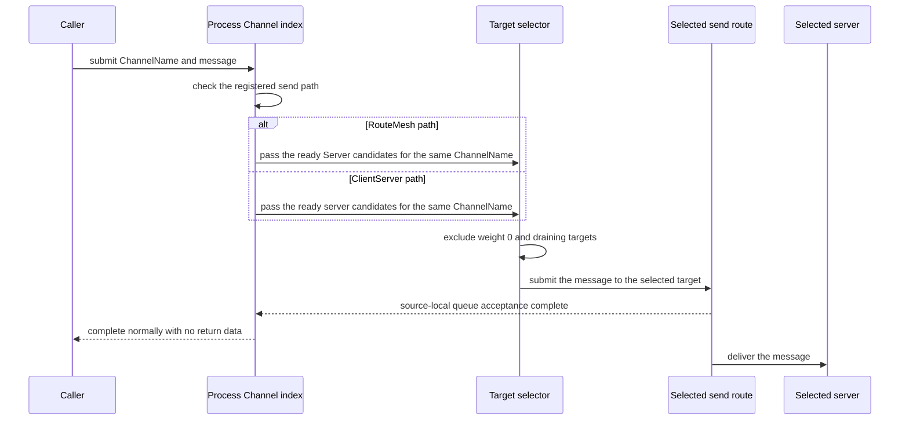

# Channel Messaging

[Channel·Transport topic table of contents](README.en.md) · [Spec table of contents](../README.en.md) · [Previous: 01. RouteMesh Topology](01-channel-topology.en.md) · [Next: 03. ClientServer Channel](03-client-server-channel.en.md)

> Defines the common Channel messaging contract for Node direct, which sends to a
> specific [MeshNode](../00-foundation/02-glossary.en.md#meshnode), and ChannelName select-one, which
> selects one Server by [ChannelName](../00-foundation/02-glossary.en.md#channelname).

## 1. Node Direct and ChannelName Select-One Overview, Common API Example

The two methods differ in the target the application specifies and the scope the
framework selects from.

| Method | Value the application specifies | How the framework decides the actual target |
|---|---|---|
| [Node direct](../00-foundation/02-glossary.en.md#node-direct) | Specifies [MeshName](../00-foundation/02-glossary.en.md#meshname) — the name identifying one [RouteMesh](../00-foundation/02-glossary.en.md#routemesh) physical connection group, the scope in which several MeshNodes participate and exchange node and Channel messages — and the target node's RID. | Only uses a ready [MeshNode](../00-foundation/02-glossary.en.md#meshnode) on the RouteMesh of the same MeshName that exactly matches the specified RID and isn't Object Client. Doesn't switch to a different RID. |
| [ChannelName](../00-foundation/02-glossary.en.md#channelname) select-one | Specifies one `ChannelName`. | Finds the send path registered for ChannelName in the current process. On a [RouteMesh](../00-foundation/02-glossary.en.md#routemesh) path, selects one [ready](../00-foundation/02-glossary.en.md#ready) Server membership for that ChannelName; on a ClientServer path, selects one ready server. |

ChannelName isn't a socket or endpoint name. It's a logical address for finding one
RouteMesh or ClientServer send path registered in the current process.

Physical connection and [membership](../00-foundation/02-glossary.en.md#membership) are defined by
[Channel Topology](01-channel-topology.en.md); payload and metadata by
[Message Model](../00-foundation/05-message-model.en.md); completion and execution order by
[Async Execution Policy](../01-execution/01-submit-and-completion.en.md).

The C# code below is a reference showing how the common contract appears in the .NET
public API. It doesn't require the same signature in other languages. The precise .NET
signature is defined by
[.NET Channel Messaging Public Interface](../languages/dotnet/interfaces/04-channel-messaging.en.md).

```csharp
public interface IZLinkRouteClient
{
    // sends a message on the specified MeshName without changing the target RID.
    IZLinkSendCall SendToNode<TMessage>(
        string meshName,
        RoutingId targetNodeRid,
        TMessage message);

    IZLinkRequestCall RequestToNode<TRequest>(
        string meshName,
        RoutingId targetNodeRid,
        TRequest request);

    // selects one ready target from the send path registered under ChannelName.
    IZLinkSendCall SendToChannel<TMessage>(
        string channelName,
        TMessage message);

    IZLinkRequestCall RequestToChannel<TRequest>(
        string channelName,
        TRequest request);
}
```

How Node direct and ChannelName use different handler interfaces is explained in
[6. How To Find And Run A Handler](#6-how-to-find-and-run-a-handlernamespace-context-information).

The following code is an example using both targeting methods from the same client.

```csharp
await routeClient
    .SendToNode(
        "game-mesh",        // specifies the physical RouteMesh the RID belongs to.
        targetNodeRid,      // the framework doesn't switch to a different RID.
        nodeCommand)
    .Async(cancellationToken);

MatchReply reply = await routeClient
    .RequestToChannel(
        "match",            // specifies only the logical ChannelName, not an endpoint.
        request)
    .Async<MatchReply>(cancellationToken); // waits for the selected Server handler's reply.
```

## 2. How to Select a Target — Node Direct

Node direct keeps the caller-specified `MeshName` and target RID as-is. It only sends
a message to a MeshNode satisfying all of the following conditions.

- Participates in the RouteMesh of the same [MeshName](../00-foundation/02-glossary.en.md#meshname).
- Matches the specified target RID.
- Object role isn't `Client`.
- Is in a ready state, able to receive the message.

If the target RID isn't a member, or doesn't become ready by the time limit, it ends
with a target error or timeout. The framework doesn't automatically switch to a
different RID on the same MeshName.

Object Client can't register an application Node direct handler and isn't a Node
direct target. This restriction doesn't apply to a RouteMesh Channel Server
registered on the same MeshNode. Automatic discovery only skips creating a
connection intent for a pair where both sides are Object Client and neither has
RouteMesh Channel Server membership. A manual endpoint also checks the same
condition at handshake, closing the connection before ready and not reconnecting
under the same configuration generation. If a caller specifies an Object Client RID
as a Node direct target, it isn't switched to a different target — it ends with
`NotFound`.

## 3. How to Select a Target — ChannelName Select-One, Selection Order (Weighted Round-Robin)

[ChannelName select-one](../00-foundation/02-glossary.en.md#select-one) is a method of selecting one
Server, among several, to receive the current call. The framework performs the
following sequence as one operation.

A target preparing to terminate or move to a different host is excluded from new call
selection first, but can finish already-accepted work within a set time. This state —
blocking new work and cleaning up existing work — is called draining.

1. Finds one send path registered for ChannelName in the current process.
2. On a RouteMesh path, only Server membership for the same ChannelName is used as
   candidates.
3. On a ClientServer path, only ready servers for that ChannelName are used as
   candidates.
4. Excludes targets with weight 0 and [draining targets](../00-foundation/02-glossary.en.md#drain).
5. Picks one ready target with weight greater than 0, reflecting the
   [weight](../00-foundation/02-glossary.en.md#weight) ratio, and immediately submits the message.

The framework computes the sum of remaining positive weights, after applying
eligibility and drain conditions, using at least a 64-bit integer. It selects a
target by the relative ratio computed so this sum doesn't overflow. For example, if
two otherwise-equal candidates have weight `100` and `300`, the long-run selection
ratio is about `1:3`.

<a id="weighted-round-robin-selection-order"></a>
### Weighted Round-Robin Selection Order

The framework keeps one accumulator per candidate and picks a target via the
following procedure. The accumulator starts at `0`.

1. Adds each candidate's own weight to its accumulator.
2. Picks the candidate with the largest accumulator. On a tie, picks the one earlier
   in **ascending candidate identifier order**. The identifier differs by topology —
   a RouteMesh path uses [NodeRid](../00-foundation/02-glossary.en.md#meshnode); a ClientServer
   path uses Server RID. The identifier's byte sequence is compared as unsigned
   values from the beginning, and if one is a prefix of the other, the shorter one
   comes first. Using a different value pointing at the same target — like
   connection path or registration source — as the identifier causes the order to
   diverge between implementations.
3. Subtracts the sum of every candidate's weight from the picked candidate's
   accumulator.

The accumulator is kept by that ChannelName's send path. If the candidate list
changes, only the accumulators of candidates in the new list are kept — the rest are
discarded.

This procedure keeps the long-run ratio while **preventing consecutive selections
from piling onto one candidate.** With two candidates A and B at weight `100` and
`300`, four consecutive calls give `B, A, B, B` (assuming A's identifier comes
first) — not a pile-up like `A, B, B, B`. Candidates with equal weight are selected
alternately, so this also satisfies the rotation requirement of
[ClientServer Channel](../00-foundation/02-glossary.en.md#clientserver-channel) — the one-way
service boundary in which the Client starts a send/request and the Server handles handler
execution and reply — as defined in
[ClientServer Channel](03-client-server-channel.en.md).

The same candidate list and accumulator state always produce the same order. The
application can rely on this reproducibility.

A ClientServer's local Server is a candidate on equal footing with a remote Server.
A local Server only enters the candidate set once its listener bind and ClientServer
service admission finish (making it ready), its weight is greater than 0, and it
isn't draining. The framework doesn't pick the local Server first, or exclude it
from candidates, just because it's in the same process.

Even if the local Server is selected, its handler isn't called directly. The actual
ClientServer record is sent from the Client `DEALER` to the Server `ROUTER`. A
local-transport bypass path that skips codec, admission, HWM, timeout, correlation,
and reply handling isn't provided.

This local-candidate rule only applies to a ClientServer path. On a RouteMesh path,
the sending MeshNode itself isn't a candidate even if it registered the Server role
for the same ChannelName. This is because a RouteMesh candidate is the Server
membership [Channel Topology](01-channel-topology.en.md) §4 publishes to the
descriptor, and that set only represents membership that can be a remote target — a
MeshNode doesn't form a peer connection with itself. Selection sends to the chosen
target over the existing RouteMesh peer connection per the same document's
[physical connection diagram](01-channel-topology.en.md#physical-routemesh-diagram),
and Channel registration doesn't create a new socket. So calling RouteMesh
select-one on a MeshNode where only itself is that ChannelName's Server has no
candidates, and it fails with no target. To handle it in the same process, use a
ClientServer path.

The two paths also handle the "no candidate yet" case differently. RouteMesh fails
immediately with no target, as above. ClientServer waits a bounded time at the call
moment if there's no ready candidate, then fails. The wait limit is the shorter of
that call's request timeout and 5 seconds; if no ready candidate appears within that
time, it fails with no target. Framework startup doesn't wait for local ClientServer
admission to complete.

The two paths are handled differently because the meaning of "no candidate" differs.
On RouteMesh, no candidate means no peer has published Server membership for that
ChannelName, and waiting doesn't make one appear. On ClientServer, the local Server
already exists in the same process's configuration — only its admission hasn't
finished yet. Failing immediately in this window would give the application a
no-target result on a call right after startup, even though the configuration is
correct. This wait doesn't trigger admission — it only waits for admission already
in progress to finish, and applies equally to remote ClientServer candidates
regardless of local status.



The diagram above shows target selection and async submit completion for a one-way
send. Normal completion means the selected send path's source-local queue accepted
the message. The framework doesn't return acceptance status, the selected RID, or
server identity as an application result.

### The Candidate List and Selection Order Are Prepared in Advance Whenever State Changes

- **The candidate list is rebuilt only when peer state changes; the call path only
  reads it.** If every call scanned all peers to check weight and drain conditions,
  a cost proportional to peer count would fall on every call, but peer state changes
  far less often than message frequency. When peer state changes, a new candidate
  list is built and swapped in, and no filtering or sorting is redone in between.

  **Internal check condition**: while peer state doesn't change, candidate filtering
  doesn't re-run on the call path.

- **The selection order is also precomputed at the moment the candidate list
  changes, and a call only moves a cursor.** Running the procedure above
  ([Weighted Round-Robin Selection Order](#weighted-round-robin-selection-order))
  in full on every call would put a cost proportional to candidate count N on every
  send. Since the procedure is deterministic, the interval between two occurrences
  of the same accumulator state is one period. Starting from the moment the
  candidate list changes, the procedure is run ahead of time, the accumulator states
  passed through are recorded, and once a previously-seen state recurs, everything
  up to that point is one cycle. Storing the once-through prefix and the repeating
  period separately means every later call only reads the stored array and advances
  the cursor, and the resulting order is exactly the same as running the procedure
  on every call.

  **Internal check conditions**:
  - `weight sum ÷ greatest common divisor` as a length must not be assumed to be
    the period only in the state where every accumulator is 0 — since a candidate
    change preserves the remaining candidates' accumulators, that state isn't
    guaranteed to be a point on a period that started at 0.
  - Waiting to return to the starting state is wrong — once the prefix is passed
    and the procedure enters the period, the starting state doesn't reappear.
  - The period search uses two upper bounds, on step count and on time. If a
    repeating state isn't found within the bounds, it falls back to running the
    procedure on every call. The search happens on the path where the candidate
    list changes, not on the send path.
  - The accumulator state and the cursor advance are ordered into a single
    sequence, because if a candidate swap and a selection happen at the same
    time, which state the pick is based on is undefined. If a single cursor is
    advanced by multiple threads, that synchronization cost stays on the send
    path, so a channel keeps only one selection path, or uses per-shard
    independent state. Per-shard independent state gives a different result
    order per shard, which fails to meet the reproducibility contract above, so
    a single path per channel is chosen instead.
  - Candidate array/sort/set construction isn't placed on the call path. The
    candidate list and the selection order are prepared together ahead of time,
    and a call only reads them.

### Framework Picks the Target and Core Manages the Connection

Both the MeshNode (RouteMesh) path and the ChannelName select-one path have the
framework pick the target. RouteMesh picks a logical node and sends directly to
that NodeRid; ChannelName select-one picks one of the candidate servers and submits
over that server's dedicated connection. In both paths, the target is decided
first, and the message is sent over a connection that already exists, leaving the
underlying transport no target choice at that moment.

The manual connection fallback, used only for a channel where a ClientServer
transport isn't registered, is different. This path advertises all candidate
endpoints to a single socket and submits without specifying a target, so the
actual selection is made by Core's load balancer.

- **The framework doesn't manage the connection set belonging to one socket in
  Core's place.** If the framework only passes the candidate endpoints and each
  candidate's weight to Core, Core decides when to connect to each endpoint, when
  to reconnect after a connection drops, and which of the currently-existing
  connections to send a message over. If the framework crosses this boundary and
  tries to also pick the target, it takes on connection lifetime, reconnect
  backoff, and HWM and operation completion along with it. Even changing the
  structure to create one socket per candidate so the framework picks — which
  outwardly still satisfies "the framework picks" — comes at the cost of
  socket/fd/monitor resources growing in proportion to candidate count, and of the
  framework taking on connection lifetime and reconnection.
- **Connection order can't be used to steer Core's choice.** Even if the candidate
  list is rotated so the computed winner comes first, the moment the receiving
  side puts that order into its own set, the order information is lost. Core
  doesn't promise connection order, so this approach can't enforce the selection
  result.

For the manual connection fallback path to meet this contract, Core's load
balancer would need to produce the same order as the
[Weighted Round-Robin Selection Order](#weighted-round-robin-selection-order) — the
framework can't complete this path's selection procedure on its own.

## 4. An Unregistered ChannelName

The same process can have MeshNodes and ClientServer clients for several
MeshNames. But if the called ChannelName isn't registered, a different MeshNode or
ClientServer client isn't searched and used instead.

This restriction only applies to the current ChannelName call's automatic
fallback. The application can start a separate call under a different registered
ChannelName, or start a new Node direct call specifying MeshName and target RID.
The framework doesn't switch the failed original call's target or send path to
this new call.

Registering the same ChannelName under two or more physical send paths also isn't
allowed. In this case host startup fails.

## 5. Why There Is No Automatic Resend After Selection

After the framework selects a target and submits the request, a connection closure
or timeout can occur. In this case the same request isn't automatically resent to a
different Server member.

This is because the first target may have already run the request, with only the
reply not delivered. Resending to a different target could run the same work twice.

The application can explicitly start a new request after receiving a failure
result. The new request is a separate operation, not an automatic resend of the
previous request. The application must handle duplicate execution, considering that
the previous target may have already run the work.

- **If a call directly specifies a target, the framework doesn't pick a different
  target in its place.** A call like Node direct, where the caller directly
  specifies the target by `MeshName` and RID, differs from ChannelName select-one,
  which specifies only a name — select-one builds a candidate set and picks one
  every time ([§2](#2-how-to-select-a-target--node-direct)), but a call that
  directly specifies a target doesn't have the framework move to a different
  candidate even if the specified target isn't ready. "Doesn't switch the target"
  and "the call succeeds" are different guarantees — the rule of not switching the
  target doesn't reduce the failure probability when the specified target isn't
  ready, and such a call ends with a target error or timeout.

A one-way send's acceptance moment, and a request's final completion condition, are
defined by [Async Execution Policy](../01-execution/01-submit-and-completion.en.md).

## 6. How to Find and Run a Handler (Namespace, Context Information)

Node direct and ChannelName handlers register in different
[handler namespaces](../00-foundation/02-glossary.en.md#handler-namespace).

| Handler kind | Value distinguishing the handler | Queue it runs on |
|---|---|---|
| Node direct | Uses MeshName, message kind, and packet name together. | Runs on the Node application queue of the target MeshNode, which isn't Object Client. |
| ChannelName | Uses ChannelName, message kind, and packet name together. | Runs on the Channel application queue of the selected RouteMesh Server or ClientServer server. |

Registering a handler with the same [message kind](../00-foundation/02-glossary.en.md#message-kind)
and [packet name](../00-foundation/02-glossary.en.md#packet-name) twice in the same handler scope
fails startup. The same packet name can be used across different ChannelNames or
the Node direct scope.

The following .NET interface excerpt shows the two handler scopes are also
separated in the public API. `IZLinkRouteRequestHandler` handles a Node direct
request, and `IZLinkRequestHandler` handles a ChannelName request.

```csharp
public interface IZLinkRouteRequestHandler<in TRequest, TReply>
{
    ValueTask<TReply> HandleAsync(
        TRequest request,
        ZLinkRouteMessageContext context,
        CancellationToken cancellationToken);
}

public interface IZLinkRequestHandler<in TRequest, TResponse>
{
    ValueTask<TResponse> HandleAsync(
        TRequest request,
        IZLinkMessageContext context,
        CancellationToken cancellationToken);
}
```

A handler is found by message kind and packet name. In the example below,
`AddRouteRequestHandler` registers in the Node direct handler scope, and
`AddRequestHandler` registers in the `"billing"` ChannelName's request handler
scope.

```csharp
var mesh = options.AddRouteMesh("service-mesh");

mesh.AddRouteRequestHandler<NodeBillingHandler, BillingRequest, BillingReply>(
    packetName: "billing.charge"); // registers the same packet name in the Node direct scope.

mesh.Channel("billing")
    .Server()
    .AddRequestHandler<BillingHandler, BillingRequest, BillingReply>(
        packetName: "billing.charge"); // registers the same name in the billing Channel scope.
```

For example, sending a `billing.charge` request via the `"billing"` ChannelName
runs `BillingHandler`. Sending the same packet name via Node direct runs
`NodeBillingHandler`, found in the separate Node direct scope.

The code above is a .NET expression showing the contract for readability. The
precise full signature is defined by
[.NET Channel Messaging Interface](../languages/dotnet/interfaces/04-channel-messaging.en.md) and
[.NET Configuration Interface](../languages/dotnet/interfaces/03-configuration-topology.en.md).

### Information Provided in the Handler Context

The Channel handler and filter context provide the following information.

- ChannelName
- Message kind and packet name
- Metadata
- Request correlation

Since ChannelName already uniquely determines the send path, a Channel handler
context doesn't require MeshName.

The Node direct handler context also provides the following physical route
information.

- MeshName
- Source node RID

Physical information the handler doesn't need for business processing — like
RouteMesh or ClientServer kind, endpoint, and selection result — is left in
monitoring.

### Spot and Actor Payloads Use a Separate Target API

Node direct, Spot direct — the direct call to a [Spot](../00-foundation/02-glossary.en.md#spot), a
logical instance with an address and state that remains reachable through the same global ID even
after the executing node changes — and Actor direct are different addressing methods, and their
handlers aren't mixed either.

A message sent via Node direct is processed by the specified MeshNode's Node direct
handler. The framework doesn't turn this message into a Spot or Actor message based
on the payload's type or content. To send a message to a
[Spot](../00-foundation/02-glossary.en.md#spot) or Actor, the application must use the dedicated
API that specifies a global [Spot ID](../00-foundation/02-glossary.en.md#spot-id) — the global
logical address that identifies a Spot — or ActorId from the start.

The framework preserves the request's reply route and correlation. An application
handler doesn't directly build a source endpoint or internal route frame.

## 7. The Boundary with Classic Fanout (Reserved Liveness Beacon Topic)

Classic fanout delivers events over a separate PUB/SUB socket to subscribers whose
connections and subscriptions are both ready. It doesn't share
a target set with RouteMesh ChannelName select-one or Spot Logical Multicast.

[Classic fanout](../00-foundation/02-glossary.en.md#classic-fanout) doesn't provide the following
functionality.

- Durable storage of a message
- Subscriber processing acknowledgement
- Replay, resending a message later
- Lossless delivery

Classic fanout is loss-tolerant delivery. If a subscriber's receipt is slow and the
publisher's send queue reaches HWM, the message to that subscriber is dropped and
publish ends successfully. Delivery to the remaining subscribers isn't affected.
The publisher isn't stalled by one slow subscriber.

Delivery that can't tolerate loss is handled by RouteMesh, not Classic fanout. A
Spot's [Logical Multicast](../00-foundation/02-glossary.en.md#logical-multicast) doesn't use a
PUB/SUB socket — it delivers to each participating node over the MeshNode
connection, so it isn't subject to this loss rule.

### The Topic Reserved for the Framework's Connection-Liveness Check Cannot Be Used

On a Classic fanout connection, the framework checks whether a subscriber continues
to receive the publisher's signal within a fixed time limit. Checking whether a
connected peer's signal keeps arriving is called liveness checking.

The publisher periodically sends an internal signal so connection status can be
checked even with no application event. This signal is called a liveness beacon,
and uses the five bytes `01 5A 4C 46 31` as its topic.

The application can't use exactly this same value as a
[topic](../00-foundation/02-glossary.en.md#topic) in the public publish API. This restriction
distinguishes the framework's internal signal from application events. Specifying
this value causes a call-argument error.

A topic that differs in length or by even one byte, as shown below, can be used.

```text
01 5A 4C 46 31       not usable: exactly matches the internal signal's topic.
01 5A 4C 46          usable: different length.
01 5A 4C 46 31 00    usable: one extra byte.
01 5A 4C 46 32       usable: last byte differs.
```

A subscriber doesn't treat this topic's signal as an application event. Since the
framework only uses it to check connection status, a registered fanout handler
isn't run, nor does the framework publish it to message-flow observation, which
records application message delivery flow. The byte format of this
[liveness beacon](../00-foundation/02-glossary.en.md#liveness-beacon) and the time criterion for
judging a connection lost are defined by
[Transport Liveness](05-transport-liveness.en.md).

A Spot's Channel-scoped [Logical Multicast](../00-foundation/02-glossary.en.md#logical-multicast)
and its publish completion contract are owned by
[Spot Messaging "4. Channel-Scoped Logical Multicast"](../03-spot-actor/02-spot-messaging.en.md#4-channel-scoped-logical-multicast).

### Classic Fanout's Interface and Usage Example

Classic fanout doesn't select one Server, like a ChannelName request does. It
delivers an event to subscribers connected to the publisher whose subscription to
that topic is ready. Each subscriber's registered typed fanout handler processes
the event.

In the following .NET interface excerpt, `Publish` returns a dedicated
`IZLinkFanoutPublishCall`. This call's `Async` waits for the local publisher
transport to accept the event — it doesn't wait for subscriber handler completion.
Normal completion has no public return value.

```csharp
public interface IZLinkFanoutClient
{
    IZLinkFanoutPublishCall Publish<TEvent>(
        string channelName,
        TEvent message);

    IZLinkFanoutPublishCall Publish<TEvent>(
        string channelName,
        string topic,
        TEvent message);
}

public interface IZLinkFanoutPublishCall
{
    ValueTask Async(
        CancellationToken cancellationToken = default);
}

public interface IZLinkFanoutHandler<in TEvent>
{
    ValueTask HandleAsync(
        TEvent message,
        CancellationToken cancellationToken);
}
```

The following example shows building a `"system-events"` fanout channel and
processing a `SystemNotice` sent by the publisher in the subscriber's
`SystemNoticeHandler`.

```csharp
var fanout = options.AddFanoutChannel("system-events");

fanout.EnablePublisher(); // opens a PUB listener for this process to publish events.

fanout
    .EnableSubscriber()
    .AddHandler<SystemNoticeHandler, SystemNotice>(
        packetName: "system.notice"); // registers the typed handler to process received events.

await fanoutClient
    .Publish("system-events", new SystemNotice("maintenance starting"))
    .Async(cancellationToken); // waits for local send acceptance, not subscriber completion.
```

If the topic must be explicitly specified, use the
`Publish(channelName, topic, message)` overload. If omitted, the framework uses the
event's packet name as the topic. The interface above has no metadata setter. So
this document's Node direct/ChannelName application metadata contract doesn't apply
to Classic fanout publish.

The precise full signature is defined by
[.NET Channel Messaging Interface](../languages/dotnet/interfaces/04-channel-messaging.en.md) and
[.NET Configuration Interface](../languages/dotnet/interfaces/03-configuration-topology.en.md).

## 8. Failure and Termination

| Condition | Result |
|---|---|
| The Node direct target isn't a member of the same MeshName. | Ends with a target-not-found error. |
| The Node direct target's object role is `Client`. | Ends with `NotFound` since it's not an application target. Doesn't create a Client pair connection. |
| ChannelName isn't registered in the current process. | Ends with `NotFound` and isn't sent via a different send path. |
| ChannelName has no selectable target. | Ends with `NotFound`. |
| A known target's connection doesn't become ready by the time limit. | Ends with a route connection error or timeout. |
| No request handler was found, or the payload couldn't be interpreted. | Completes with an error reply if a reply route remains. |
| No one-way handler was found, or the payload couldn't be interpreted. | Doesn't deliver the message to a handler — records it in runtime observability information. |
| The host isn't accepting new submits. | Fails with that language's shutdown error. |

For a ChannelName call, the framework selects one Server member. A member in a
draining state — finishing existing work while stopping new-work acceptance — is
excluded from this selection candidate set, so it doesn't receive a new ChannelName
message.

Node direct behaves differently since the caller directly specifies the target
RID. Even if the specified node is draining, the framework doesn't switch to a
different RID. Whether this call succeeds is decided by the specified node's
connection and acceptance state.

ClientServer uses a separate client transport, so a server message that doesn't
match a request a client submitted is recorded as `ProtocolError` and isn't
delivered to an application handler.

Each service runtime converts a transport-specific error into a common framework
result. A transport library's internal result isn't directly exposed on the
public call.

The full termination order is defined by
[Graceful Drain](../05-location-relocation/05-host-relocation-flow.en.md).

## 9. Metadata and Observation

### Application Metadata Travels Together with the Message

Application metadata is small key-value information sent separately from business
payload. Setting metadata on a Node direct or ChannelName send/request call
provides it to the selected target's handler context as an unchangeable
[metadata snapshot](../00-foundation/02-glossary.en.md#metadata-snapshot). This rule is the same
whether a RouteMesh or ClientServer send path is used.

As shown in the following .NET interface excerpt, send and request calls use a
common metadata-setting interface. You can set one pair directly, or pass an
already-built metadata bundle.

```csharp
public interface IZLinkMetadataCall<TSelf>
{
    TSelf Metadata(string key, string value);
    TSelf Metadata(ZLinkMessageMetadata metadata);
}

public interface IZLinkSendCall : IZLinkMetadataCall<IZLinkSendCall>
{
    ValueTask Async(
        CancellationToken cancellationToken = default);
}

public interface IZLinkRequestCall : IZLinkMetadataCall<IZLinkRequestCall>
{
    ValueTask<TReply> Async<TReply>(
        CancellationToken cancellationToken = default);
}
```

The following example shows sending tenant and locale together with a Channel
request, and how the selected Server's handler reads them. Node direct also uses
the same `Metadata(...)` call.

```csharp
var reply = await routeClient
    .RequestToChannel("billing", new BillingRequest(orderId))
    .Metadata("tenant-id", "tenant-42") // delivers tenant separately from the business payload.
    .Metadata("locale", "ko-KR")        // adds more metadata needed for the same call.
    .Async<BillingReply>(cancellationToken);

public sealed class BillingHandler
    : IZLinkRequestHandler<BillingRequest, BillingReply>
{
    public ValueTask<BillingReply> HandleAsync(
        BillingRequest request,
        IZLinkMessageContext context,
        CancellationToken cancellationToken)
    {
        var tenantId = context.Metadata.Find("tenant-id");
        // the selected Server reads the value from the unchangeable metadata snapshot.
        return HandleBillingAsync(tenantId, request, cancellationToken);
    }
}
```

Metadata's public contract is as follows.

| Item | Contract |
|---|---|
| Key and value | UTF-8 and contain no NUL. |
| Total size | At most 1024 bytes, including encoded key, value, and structural overhead. |
| Setting the same key multiple times | The last value is sent. |
| Reading in a handler | Provided as an unchangeable snapshot; the application copies it to keep it after the handler turn ends. |
| Malformed metadata | Treated as a protocol error without running the handler. |
| Reply | Request metadata isn't auto-copied, and a regular reply has no metadata setter. |

Even if a handler starts a new request to a different node or Channel, the current
request's metadata isn't auto-copied. A value that needs to carry over must be
explicitly set by the application on the new call. Information the framework
auto-propagates, like trace correlation, is a separate framework field from
application metadata.

Metadata is logically delivered together with the message, but the frame layout
and encoding method inside the packet aren't part of the public contract. The
application doesn't directly build or interpret the metadata frame. Detailed
ownership and delivery rules are defined by
[Message Model](../00-foundation/05-message-model.en.md).

The precise .NET signature is defined by
[.NET Common Runtime Interface](../languages/dotnet/interfaces/01-common-runtime.en.md) and
[.NET Configuration Interface](../languages/dotnet/interfaces/03-configuration-topology.en.md).

### Observability Information

Observability information must distinguish the following values.

| Item | Meaning |
|---|---|
| ChannelName | Indicates which logical Channel call this is. |
| Send-path kind | Indicates whether RouteMesh or ClientServer path was used. |
| MeshName | Indicates the physical mesh, when a RouteMesh path was used. |
| Source and target RID, or [server identity](../00-foundation/02-glossary.en.md#server-identity) | Identifies the node the message actually moved to. |
| Selection result and send-path acceptance | Observes target selection and source-local queue admission, distinguished from each other. |
| Handler delivery result | Indicates the result of delivery to the target queue and handler. |
| Drain state | Indicates why a target was excluded from new selection. |

This physical identifier isn't added to the Channel handler context. Packet
payload, or a business identifier whose value space is too large, isn't used as a
metric label.

## 10. Verification Requirements

The following is verified using only the public surface (`SendToNode` ·
`RequestToNode` · `SendToChannel` · `RequestToChannel` calls, handler context, the
returned success/failure result, the public publish API). Each item leads to one
contract test.

**Target Selection**

- A Node direct message isn't delivered to a node other than the RID the caller
  specified.
- ChannelName only selects one send path registered in the current process.
- An unregistered ChannelName isn't automatically delivered via a different path.
- ChannelName select-one reflects weight, ready, and drain state together.
- RouteMesh's Node direct and ChannelName use the same MeshNode ROUTER.
- ClientServer Channel uses a separate client transport.
- Targets and handler scopes of different MeshNames aren't mixed.
- Candidates with equal weight are selected alternately across consecutive calls.
- With two candidates at weight `100` and `300`, four consecutive calls select in
  the order `B, A, B, B` (when the candidate with the smaller identifier is A).
- The same candidate list and the same selector state always produce the same
  order.
- The long-run selection ratio of two candidates at weight `100` and `300`
  converges to about `1:3`.

**Completion And Resend**

- After a request failure, it isn't automatically resent to a different Channel
  member.
- A reply completes the original request exactly once and isn't redelivered as a
  new application packet.

**Handler And Payload Boundary**

- Node direct payload doesn't go into a Spot callback or Actor handler.

**Fanout Liveness Boundary**

- A public publish rejects the fanout-liveness-only topic.
- The liveness beacon isn't delivered to an application handler.
- Classic fanout's dedicated publish call doesn't provide an application metadata
  setter.

**Metadata**

- Metadata set on a Node direct or ChannelName call can be read as an unchangeable
  [snapshot](../00-foundation/02-glossary.en.md#snapshot) in the selected target's handler
  context.
- Setting the same metadata key multiple times applies the last value, and total
  size and malformed input are handled per the message model contract.
- Request metadata isn't auto-copied to a reply or to a request a handler newly
  starts.

---

[Channel·Transport topic table of contents](README.en.md) · [Spec table of contents](../README.en.md) · [Previous: 01. RouteMesh Topology](01-channel-topology.en.md) · [Next: 03. ClientServer Channel](03-client-server-channel.en.md)
