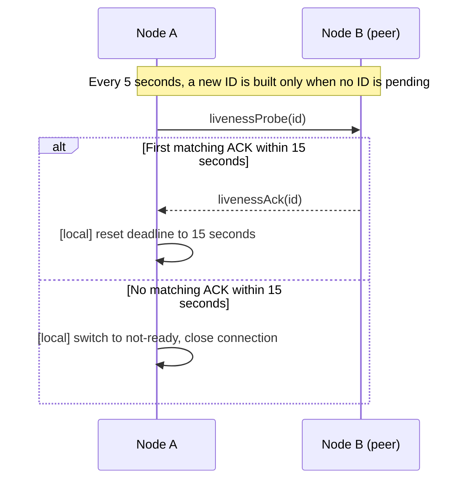

# Transport Liveness

[Channel·Transport topic table of contents](README.en.md) · [Spec table of contents](../README.en.md) · [Previous: 04. Network Listener Identity](04-network-listener-identity.en.md) · [Next: 06. Service Wire Protocol](06-wire-protocol.en.md)

> This document defines how the framework continuously checks whether a remote service
> connection is usable, and how it reconnects if the connection drops. It covers both the
> contract visible to the application and the judgment structure every language runtime must
> follow. Topics beyond liveness judgment — runtime startup order and status publication,
> status-subscriber backpressure, and instrumentation cost — aren't covered here; they remain
> in [49. Liveness and Status Publication](05-transport-liveness.en.md).

## 1. The Result Visible to the Application

The process by which the framework continuously checks whether a remote service connection is
usable is called service liveness checking.

A connection group where several runtime nodes exchange messages is called a
[RouteMesh](../00-foundation/02-glossary.en.md#routemesh). The registration name identifying the same
Channel is [ChannelName](../00-foundation/02-glossary.en.md#channelname). A connection where the Client
picks one Server among the same ChannelName is a
[ClientServer Channel](../00-foundation/02-glossary.en.md#clientserver-channel). A feature delivering
events over a separate PUB/SUB socket is
[Classic fanout](../00-foundation/02-glossary.en.md#classic-fanout).

The framework applies the same time criteria to all three connection methods. But
bidirectional connections and one-directional fanout check connection status differently.

On a RouteMesh, if the Object role of both MeshNodes is `Client`, the peer connection isn't used.
Automatic discovery checks the descriptor and doesn't create a connection intent. A manual
connection checks both roles during the handshake and closes before ready. Since there's no
connection, a liveness probe and deadline aren't applied to this pair.

| Connection method | How the framework checks connection status |
|---|---|
| RouteMesh/ClientServer | Sends a check request to the peer and waits for a response with the same ID. |
| Classic fanout | The publisher sends a one-directional check record, and the subscriber checks the last receive time. |

The connection-check command, raw transport monitor, and timer aren't a public application
API, and an application message handler doesn't receive this signal either.

The owner expiry recorded in the Store, the heartbeat of a
[STREAM session](../00-foundation/02-glossary.en.md#stream-session) exchanging request/reply and push on
the same connection, and request timeout each serve a different purpose. The framework
doesn't use one as a substitute signal for another.
[Shutdown](../00-foundation/02-glossary.en.md#shutdown), which cleans up runtime resources, is also a
separate operation from a service liveness failure.

## 2. Fixed Timing and the Public API Boundary

The framework computes how long a connection can be kept after the last normal check. The
final time an operation must finish is called a [deadline](../00-foundation/02-glossary.en.md#deadline).

| Setting | Fixed value | Scope of application |
|---|---:|---|
| Connection check interval | 5 seconds | Every RouteMesh, ClientServer, and Classic fanout connection in the framework service runtime |
| Peer deadline | 15 seconds | Time one connection can be kept without a normal check |

- **One structure owns mesh-peer liveness judgment across the entire runtime.** If this
  judgment is scattered across subsystems that use different periods, one subsystem can
  treat a peer as available while another treats it as unavailable during the resulting
  interval.
- **The framework builder doesn't expose these two values, and different values can't be
  specified per channel, handler, or peer.** Making the value adjustable at all is itself a
  violation of the contract that all three connection methods use the same standard.
- **Receiving a business message isn't used as a liveness signal.** The reason is
  directional asymmetry — receiving messages from a peer doesn't show whether messages from
  this node reach that peer. Using receive traffic alone for liveness would treat a
  connection broken in one direction as normal. This is why a regular application message
  doesn't extend a connection's deadline (§3).

Each language's service runtime only uses the binding's public raw socket API and the
framework service protocol. It doesn't use private binding members, direct native symbol
calls, or a language-specific hidden application option.

## 3. RouteMesh and ClientServer

The state in which transport connection, service handshake, and identity verification all pass,
making it usable as a message target, is called [ready](../00-foundation/02-glossary.en.md#ready).
RouteMesh and ClientServer apply the 15-second deadline starting from the moment it becomes
ready.

On a Manual RouteMesh, a pair where both sides are Object Client with no RouteMesh Channel
Server membership ends with a `NotRequired` terminal at handshake admission. This isn't a
liveness failure or a reconnect-waiting state. The framework doesn't repeat connect for the
same endpoint and configuration generation. If endpoint, expected RID, or configuration
generation changes, it can be re-checked with a new intent. Public monitoring marks this peer
as `not_required`. It's distinguished from `not_connected`, where a connection is needed but
there's no ready connection — `not_required` is excluded from probe/deadline and
liveness/health failure aggregation.

The framework checks the connection every 5 seconds, even with no application message, in
the following order.

RouteMesh uses ROUTER-ROUTER Application and [Completion connections](../00-foundation/02-glossary.en.md#completion-connection), while
ClientServer uses one DEALER-ROUTER Application connection. In both topologies,
liveness probes and ACKs are application records; they aren't converted into
separate completion control. In ClientServer, earlier DATA and HWM/`PAUSED` can
also delay a later liveness record, and this document's 15-second deadline still
applies.

1. If there's no ID still awaiting a response, the framework builds a new non-zero ID within
   the connection.
2. Sends that ID in a `livenessProbe`.
3. If the next cycle arrives while waiting for a response, resends the same ID instead of
   building a new one.
4. The peer returns the received ID as-is in a `livenessAck`.
5. Only the first ACK matching the ID the current connection is waiting for resets the
   deadline to 15 seconds.

One connection keeps at most one ID still awaiting a response.

| Input received | Effect on the current connection |
|---|---|
| The first ACK matching the awaited ID | Removes that ID and resets the deadline to 15 seconds. |
| A duplicate receipt of the same ACK | Doesn't change state. |
| An ACK for a previous probe ID | Doesn't change state. |
| An ACK from a different physical connection | Not used as evidence for the current connection. |
| A regular application message | Only updates the last-receive time for diagnostics — doesn't extend the deadline. |

If a valid ACK isn't received within 15 seconds, that connection is switched to not-ready and
closed.

Probe and ACK are internal signals the framework uses only to check connection status. They
don't include business payload or metadata. They aren't put on the application queue or run
a handler.

## 4. Classic Fanout

Classic fanout's PUB socket only sends and the SUB socket only receives. Since a subscriber
can't send an ACK on the same physical connection, `livenessProbe` and `livenessAck` aren't
used. A subscriber judges connection status by receiving a one-directional check record the
publisher sends.

A subscriber follows these rules so it can distinguish publisher connections from each other.

- In automatic discovery, one SUB socket and receive loop is built per publisher descriptor.
- In manual mode, one SUB socket and receive loop is built per endpoint.
- Multiple publishers aren't connected together to one SUB socket.

This separation is needed so one publisher's timeout doesn't cause a different publisher to
become not-ready.

A publisher sends a one-directional check record to the same PUB endpoint every 5 seconds,
regardless of whether it's sending application events. This record is called a
[liveness beacon](../00-foundation/02-glossary.en.md#liveness-beacon). The beacon uses the
following reserved value on a local
[Spot](../00-foundation/02-glossary.en.md#spot) — a logical instance with an address and state
that stays reachable by the same global ID even if its running node changes — as its
[Topic](../00-foundation/02-glossary.en.md#topic), the value that picks which local Spot
subscription receives a message within the same ChannelName.

| Frame | Precise value |
|---|---|
| Topic frame | `01 5A 4C 46 31` |
| Payload frame | `5A 46 01 01` |
| Frame count | Exactly 2 |

The application can't use this exact topic value as a fanout topic. Specifying it is
a call-argument error. Even starting with the same bytes, a topic differing in length or in
the remaining bytes can be used as an application topic.

A subscriber marks a publisher ready once it first receives, on that publisher's socket, one
of the following.

- A well-formed application fanout record
- An exactly-formatted liveness beacon

Afterward, it updates the last-receive time whenever it receives either. If nothing is
received for 15 seconds, only that publisher is switched to not-ready and its dedicated
socket is closed. It reconnects with a new socket per the current connection configuration.

Since the beacon uses the same PUB socket as application records, it also follows Classic
fanout's loss rule. A beacon published while a subscriber's receive queue is full is dropped
and doesn't arrive again later. So if a host stays saturated for more than 15 seconds while
fanout application traffic keeps filling the queue, that publisher becomes not-ready. This
determination isn't a false positive — during that time the subscriber genuinely can't
process application records.

Conversely, it's a false positive if one peer monopolizes the receive stage so a different
peer's check signal is delayed.

- **The framework caps the amount it receives consecutively on one connection.** This is so one
  peer's traffic volume doesn't change a different peer's ready determination. Once the cap
  is reached, remaining receive work is deferred to the next opportunity and processing moves on
  to other connections and check signals. This cap isn't only for Classic fanout — the same
  rule applies to every path handling multiple connections in one receive stage (RouteMesh,
  ClientServer, service connection, STREAM). A check signal can arrive on a connection of any
  topology, and the same false positive occurs on any path if one connection monopolizes the
  receive stage.
- **The framework applies count, byte, and elapsed-time caps together, whichever is reached
  first.** With
  only one axis, a different axis could be used to monopolize. The next rotation starts from
  the connection immediately after the one where processing stopped. Always iterating from the
  start would keep pushing back later connections even with a cap in place.
- **Where one socket represents several peers, accounting is done per peer, not per
  socket.** Counting per socket would let one peer behind that socket use up a different
  peer's share.

**The count cap is fixed at 64 per rotation.** The byte cap and elapsed-time cap are
**Per-language discretion.** Even with different values, the rotation always restarts from
right after the connection that stopped, and no connection monopolizes the receive stage
indefinitely, so the observable outcome — that other peers get a chance to process check
signals — is the same. The check criterion is whether a slow consumer on one connection
stops check-signal processing on other connections.

A beacon isn't an application event. A subscriber doesn't do the following.

- Doesn't send a response to the publisher.
- Doesn't deliver it to an application queue or fanout handler.
- Doesn't build an application message trace.
- Doesn't increment a fanout application receive metric.

If the topic is the reserved value but the payload differs or the frame count isn't 2, it's a
protocol error. The subscriber doesn't deliver that record to the application or recognize it
as a normal receipt. Only that publisher is immediately switched to not-ready, and only that
publisher's socket is closed.

## 5. Ready and Failure Determination

Information published to the Store so a remote endpoint and identity can be found is called a
[descriptor](../00-foundation/02-glossary.en.md#descriptor). Neither the existence of a descriptor nor
acceptance of a connect request is enough to make a connection ready.

| Connection method | Condition to become ready |
|---|---|
| RouteMesh/ClientServer | Completes the transport connection, service handshake, identity/generation verification, and handler preparation. A RouteMesh Object Client pair with no Server membership is excluded from ready targets. |
| Classic fanout | The per-publisher SUB socket is connected, the descriptor or manual endpoint relationship is valid, and the first normal application record or beacon is received. |

A connection is immediately removed from the ready target list when any of the following is
confirmed.

- The peer sent an orderly close.
- A transport error or disconnect event was received.
- The RouteMesh/ClientServer peer deadline was exceeded.
- A fanout publisher sent no record for 15 seconds.
- Identity, [lifecycle generation](../00-foundation/02-glossary.en.md#lifecycle-generation) (which
  distinguishes different process runs using the same RID), or security verification failed.
- A new connection with the same lifecycle generation as the current discovery descriptor was
  admitted, replacing the existing physical connection.
- The host became `Draining`, `Stopped`, or `Error` and no longer allows new target
  selection.

Connection replacement uses the node RID, security identity, and lifecycle generation
supplied by the current descriptor as the admission fence. Once these descriptor expectations
form a complete set, an endpoint-only manual intent with generation 0 cannot weaken this check. The
existing connection requests physical-pair termination with the same `transportPairId` and
`transportPairGeneration` obtained from the monitor event, and replaces the connection only
after it observes that pair's close snapshot or disconnect event. An endpoint-level
disconnect may be used for an initial connection whose pair identity is not available, but a
successful call alone is not proof that the physical close has completed. A new connection
for the same endpoint is created only after the close has been observed.

Orderly close and transport disconnect don't wait 15 seconds. A late-arriving ACK or frame
from a previous physical connection can't change the new connection's state.

One peer's failure doesn't turn the whole host `Error`. Other ready peers and the local
[Owner](../00-foundation/02-glossary.en.md#owner) — the MeshNode that actually runs the Actor or
Spot on this host and manages its application queue — keep processing. Without a ready peer, a Channel call ends with `NotFound` or `Unavailable`.
The framework doesn't hide a failure by extending the timeout.

## 6. Connection Loss and Reconnect

The identifying information linking a request and reply to the same call is called
[reply correlation](../00-foundation/02-glossary.en.md#reply-correlation). The framework uses this value to
complete a request's final result exactly once.

| When the connection was lost | Request handling |
|---|---|
| Before transport accepted the request | Ends as route-not-connected. |
| Whether transport accepted it is unknown | Not automatically resubmitted to a different peer. |
| Already accepted | Ends exactly once, via one of a reply, request timeout, cancellation, `Shutdown`, or route failure. |

The framework doesn't automatically resubmit a request or one-way message to a different peer
or owner after a connection loss.

A reconnect uses the existing configuration or the current discovery descriptor.

- RouteMesh and ClientServer redo the service handshake and identity verification.
- A RouteMesh Object Client pair's `NotRequired` admission with no Server membership doesn't
  reconnect within the same manual configuration generation.
- A previous connection ID, reply route, session binding, and ready state aren't reused.
- Classic fanout creates a new SUB socket for that publisher.
- A fanout connection isn't ready before receiving the first normal record.
- Even with the same RID, if the lifecycle generation differs from the current discovery
  descriptor, it's treated as a new process run. Generation values' numeric magnitude isn't
  compared.

## 7. Location Store and Host Termination

The period during which a host keeps current owner eligibility is called an
[owner lease](../00-foundation/02-glossary.en.md#owner-lease). Owner lease and descriptor are the basis for
discovery and object placement, but don't prove a transport connection is ready.

Even if Store polling fails, transport status checking for already-connected peers continues.
Conversely, receiving a probe, ACK, or beacon doesn't re-validate an expired owner lease or
object owner.

The owner lease renewal interval and transport connection check interval aren't the same
value. The two values aren't merged into the same public option.

Even after a runtime's `Relocate`, which moves stateful workload, or `Shutdown` blocks new
application work, a connection needed for already-accepted reply/relocation/STREAM processing
can be kept up to the deadline. This connection isn't included in new target selection.

When terminating, the liveness timer, reconnect timer, transport monitor subscription, and
pending callback are finished before the connection is closed.

## 8. A Liveness Determination Does Not Change Authority

The public behavior is defined by
[Failure Handling And Failover Scope 「4.4 Distinguishing Instance Spot Cold Activation From
Owner Failure」](../05-location-relocation/06-failure-failover-policy.en.md#44-distinguishing-instance-spot-cold-activation-from-owner-failure).
This section only assigns the responsibilities that produce that result.

- **The liveness subsystem publishes peer and owner-lease availability evidence only.** The
  location resolver reads the evidence together with authority and produces a closed lookup
  result.
- **Only the lifecycle component releases authority, through an explicit `Close`,
  `IdleEvicted` cleanup, or another formal lifecycle operation.** A liveness determination by
  itself doesn't change authority.
- **The activation coordinator doesn't consume a liveness event directly; it receives only a
  resolver `Missing` result.** This keeps connection-failure detection from leaking directly
  into object creation, relocation, or owner-takeover policy.

## 9. Observability Information

The result of copying runtime state at a specific point in time into a read-only value is
called a [snapshot](../00-foundation/02-glossary.en.md#snapshot). A runtime snapshot distinguishes the
following states.

- Configured intent
- Connecting
- Admitted
- Ready
- Reconnecting
- Last failure

Orderly disconnect and exceeding the peer deadline are recorded with different reasons.
Metric labels don't include endpoint, RID, or connection ID. Individual identity is only
provided via a count-limited snapshot and trace.

### Application Job Pressure and Route State

When a host's Application Job Queue pressure is `paused`, that alone doesn't change route
readiness, host readiness, or transport liveness. Existing per-topology progress evidence and
deadlines determine liveness. Receive flow applies to RouteMesh ROUTER-ROUTER
two-lane sockets and ClientServer DEALER-ROUTER single-lane sockets; it excludes
PUB/SUB and STREAM.
The runtime applies the current absolute pressure state to a new eligible socket before
publishing its route; this ordering is the same for `running` and `paused`.

## 10. Verification Requirements

Only using the public surface (`livenessProbe`/`livenessAck`/liveness beacon wire format, the
value reaching an application message handler, the state a connection/runtime snapshot shows,
and the error a Channel call returns), the following is confirmed. Each item ties to one
contract test.

**Bidirectional check**

- RouteMesh/ClientServer sends a probe every 5 seconds with no application traffic. One
  pending ID per connection — only the same ID is resent before an ACK.
- Only the first ACK matching the current connection's current ID refreshes the deadline. A
  duplicate/previous ID/an ACK from a different connection doesn't change state.
- A half-open connection becomes not-ready within 15 seconds. Orderly close and transport
  error take effect immediately.
- Probe and ACK aren't delivered to an application handler. Other inbound service frames
  don't extend the peer deadline.
- RouteMesh uses two physical ROUTER-ROUTER lanes and ClientServer uses one
  physical DEALER-ROUTER lane, but probes and ACKs are observed as application
  records in both topologies and aren't delivered to handlers.

**Fanout**

- Uses a dedicated SUB socket per publisher. Only becomes ready after the first normal
  application record or beacon.
- The beacon uses the precise topic/payload/2-frame format, and doesn't build ACK, application
  dispatch, trace, or application metric.
- A format error on the reserved topic immediately turns only that publisher not-ready and
  isn't delivered to the application.
- The precise values of the three receive-cap axes aren't fixed by the spec, so they aren't
  judged. What can be judged is only that one connection never monopolizes receiving
  indefinitely, and that the next rotation after the cap is reached starts from right after
  the connection that stopped this time.

**Failure isolation and authority**

- One publisher's 15-second timeout and one peer's failure don't turn a different connection
  or the host state `Error`.
- Transport checking continues even during a Store polling failure. Transport ready doesn't
  re-validate an expired owner lease.
- A liveness determination alone doesn't release an owner lease or object authority — release
  is only observed through an explicit cleanup by the lifecycle component, or a call that
  goes through a formal lifecycle operation.

**Reconnect and termination**

- Reconnect redoes service handshake and identity verification, and doesn't reuse a previous
  connection's completion/binding/ready state.
- Automatic discovery excludes, at the descriptor stage, a pair where both sides are Object Client with
  no RouteMesh Channel Server membership. Manual closes a pair meeting the same conditions as
  `NotRequired` before ready, doesn't retry the same configuration generation, and doesn't
  build probe/deadline.
- Even if reply, timeout, cancellation, disconnect, and shutdown race, the request result
  completes exactly once. The request is not automatically resubmitted to a different peer or
  owner.
- No liveness/reconnect timer, subscription, or callback remains after `Relocate`/`Shutdown`.
- C++/.NET/JVM/Node.js provide the same fixed times and observed results.

---

[Channel·Transport topic table of contents](README.en.md) · [Spec table of contents](../README.en.md) · [Previous: 04. Network Listener Identity](04-network-listener-identity.en.md) · [Next: 06. Service Wire Protocol](06-wire-protocol.en.md)
