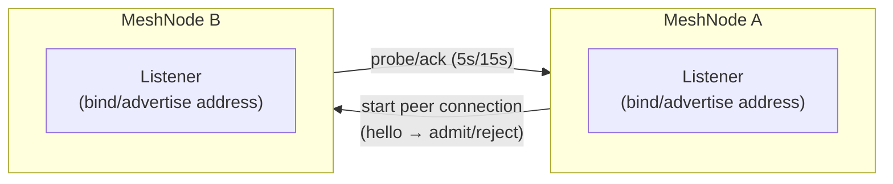
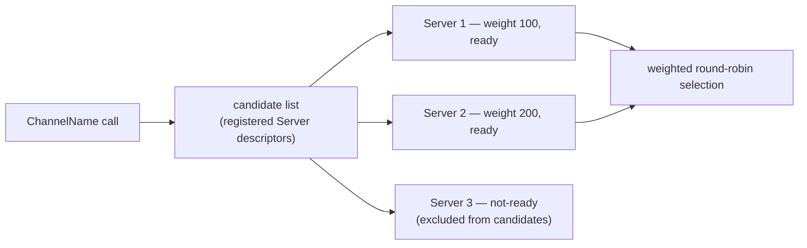

# Channel and Transport

[Spec table of contents](../README.en.md) · [Next: 01. RouteMesh Topology](01-channel-topology.en.md)

## 1. What This Covers

This topic covers how one Node finds another node or client, exchanges bytes, and
confirms that a connection is alive. It addresses both the physical connection and
logical message target selection. The six documents cover RouteMesh, where
[MeshNode](../00-foundation/02-glossary.en.md#meshnode)s — runtime nodes that send or receive
messages within a connection topology in which several nodes participate — find each other
by a [MeshName](../00-foundation/02-glossary.en.md#meshname), the name identifying one
[RouteMesh](../00-foundation/02-glossary.en.md#routemesh) physical connection group; the
[ClientServer Channel](../00-foundation/02-glossary.en.md#clientserver-channel), which an
application opens directly by a [ChannelName](../00-foundation/02-glossary.en.md#channelname),
the name identifying the Channel scope to which a message is sent; the address a listener
exposes; connection liveness confirmation; and the actual byte format that travels over
the wire.

What a [Spot](../00-foundation/02-glossary.en.md#spot) — a logical instance with an address
and state that stays reachable by the same global ID even if its running node changes —
and an Actor are, and how they execute, is not defined by this topic (§7). This
topic answers only which physical connection a message travels over and which
logical target it arrives at.

## 2. Who Decides What

| Party | Decides / Owns |
|---|---|
| Application | ChannelName and role (Client/Server) registration, [Node direct](../00-foundation/02-glossary.en.md#node-direct) target designation — the caller sending a message to a specific MeshNode by naming both a MeshName and a target RID — listener bind/advertise address, weight value |
| Framework (node runtime) | RouteMesh peer discovery, ChannelName membership lookup, weighted round-robin target selection, admission (hello/admit/reject), probe/ack cadence |
| [Location Store](../00-foundation/02-glossary.en.md#location-store) (the store that keeps each object's current owner and status so several nodes can check it together) | Durable record of the [ClientServer Server descriptor](../00-foundation/02-glossary.en.md#clientserver-server-descriptor) — the registration information a Server publishes for ClientServer automatic discovery to announce its own identity and connection location — and RouteMesh registration information — without it, automatic discovery does not work |
| Core | Actual socket send/receive, connect/disconnect events, physical delivery of wire bytes |

## 3. Seen as One Flow

Physical connection and logical target selection are different layers. A physical
connection must exist before it becomes a candidate for logical selection, and
logical selection sends the message over one of those connections.

**Physical layer — node, listener, peer connection**

**Logical layer — ChannelName, candidates, weight, ready**

Each candidate in the logical layer becomes ready only over a connection that has
been admitted in the physical layer and confirmed alive by probe/ack; this
condition links the two diagrams.

## 4. Documents in This Topic

| Document | Covers | Layer |
|---|---|---|
| [01. RouteMesh Topology](01-channel-topology.en.md) | MeshName/MeshNode, ChannelName role and membership, peer connection and discovery | Contract |
| [02. Channel Messaging](02-channel-messaging.en.md) | Common contract for Node direct and ChannelName select-one, target selection order, handler lookup | Contract |
| [03. ClientServer Channel](03-client-server-channel.en.md) | Client/Server role registration, weight and target selection, send/request/reply, drain, restart | Contract |
| [04. Network Listener Identity](04-network-listener-identity.en.md) | bind/advertise address, port determination, per-listener-kind records, transport RID/Spot ID issuance policy | Contract |
| [05. Transport Liveness](05-transport-liveness.en.md) | probe/ack and beacon fixed timing, Ready and failure determination, connection loss and reconnect | Contract + implementation spec (sole source of truth) |
| [06. Service Wire Protocol](06-wire-protocol.en.md) | The actual byte format and command list exchanged between nodes | Implementation spec |

## 5. Find by Question

| Question | Where the answer is |
|---|---|
| How does RouteMesh's physical connection differ from ChannelName's logical membership | This document §1–§3 · [01. RouteMesh Topology](01-channel-topology.en.md) "1. RouteMesh Topology Overview" |
| When does the same MeshName not get relayed automatically | [01. RouteMesh Topology](01-channel-topology.en.md) "2. MeshName And MeshNode" |
| How do Node direct and ChannelName calls choose a target | [02. Channel Messaging](02-channel-messaging.en.md) "2. How A Target Is Selected — Node Direct" · "3. How A Target Is Selected — ChannelName Select-One" |
| What is different about ClientServer versus RouteMesh | [03. ClientServer Channel](03-client-server-channel.en.md#1-clientserver-channel-overview) |
| How do weight and drain each affect selection | [03. ClientServer Channel](03-client-server-channel.en.md#4-weight-and-target-selection) · [03. ClientServer Channel §6](03-client-server-channel.en.md#6-drain) · [01. RouteMesh Topology](01-channel-topology.en.md) "5. Values That Can Change At Runtime (weight)" |
| Why do a listener's bind address and advertised address differ | [04. Network Listener Identity](04-network-listener-identity.en.md#1-listener-address-overview) |
| How are the MeshNode RID and Entry Spot ID issued | [04. Network Listener Identity](04-network-listener-identity.en.md#6-system-wide-transport-rid-and-spot-id-policy) |
| How is connection liveness confirmed, and what is the determination criterion | [05. Transport Liveness](05-transport-liveness.en.md#2-fixed-timing-and-the-public-api-boundary) · [§5](05-transport-liveness.en.md#5-ready-and-failure-determination) |
| Why does Classic fanout confirm liveness a different way (beacon) | [05. Transport Liveness](05-transport-liveness.en.md#4-classic-fanout) |
| When a connection drops, what is redone and what is not reused | [05. Transport Liveness](05-transport-liveness.en.md#6-connection-loss-and-reconnect) |
| What bytes and commands actually travel between nodes | [06. Service Wire Protocol](06-wire-protocol.en.md#2-record-framing-and-decode) · [§3](06-wire-protocol.en.md#3-command-space) |
| Where are the wire details of relocation/actor join covered | [06. Service Wire Protocol §9](06-wire-protocol.en.md#9-maintenance-capture-and-relocation-envelope) |

## 6. Reading Order

**Developer reading for the first time**

1. Read this document §1–§3 to grasp the relationship between physical connection
   and logical target selection.
2. Start with [01. RouteMesh Topology](01-channel-topology.en.md) "1. RouteMesh
   Topology Overview" to confirm how nodes find each other.
3. Check [03. ClientServer Channel §1](03-client-server-channel.en.md#1-clientserver-channel-overview)
   to confirm the difference between a connection an application opens directly
   and RouteMesh.

**Developer porting to a new language** — the sections below carry the rules and
verification requirements every runtime must follow with the same structure, so
read them before implementing per-language. Wherever a language is free to
differ, it is marked in the body only with **Per-language discretion.**

- [05. Transport Liveness](05-transport-liveness.en.md#2-fixed-timing-and-the-public-api-boundary)
  (fixed timing), [§8](05-transport-liveness.en.md#8-a-liveness-determination-does-not-change-authority)
  (separation of responsibility), [§10. Verification Requirements](05-transport-liveness.en.md#10-verification-requirements)
- [06. Service Wire Protocol §1](06-wire-protocol.en.md#1-schema-and-generation-boundary)
  (schema is the sole source of truth), [§2](06-wire-protocol.en.md#2-record-framing-and-decode)
  (framing/decode), [§5](06-wire-protocol.en.md#5-service-liveness) (probe/ack wire),
  [§12. Verification Requirements](06-wire-protocol.en.md#12-verification-requirements)

**Application developer**

1. Read [02. Channel Messaging](02-channel-messaging.en.md) "1. Node Direct And
   ChannelName Select-One Overview" to confirm the common API of the two call
   styles.
2. Read [03. ClientServer Channel §2](03-client-server-channel.en.md#2-client-and-server-role-registration)
   through [§5](03-client-server-channel.en.md#5-send-request-and-reply) to
   confirm the sequence from role registration through send/request.
3. Read [04. Network Listener Identity §1](04-network-listener-identity.en.md#1-listener-address-overview)
   through [§2](04-network-listener-identity.en.md#2-process-defaults-and-listener-override)
   to confirm how a listener address is configured.

## 7. What This Topic Does Not Define

| Content | Owning Document |
|---|---|
| The Actor model and its queue, the target of the admission decision for Actor join | [Spot And Actor Model](../03-spot-actor/05-spot-actor-membership.en.md) — being migrated to the 03-spot-actor topic |
| Session's bind/relay/rebind/relocation responsibility | [Session Topic](../04-session/README.en.md) |
| Location Store record format and CAS discipline | [Location Runtime](../05-location-relocation/01-location-runtime.en.md) — being migrated to the 05-location-relocation topic |
| Relocation's phase state machine and [Actor membership](../00-foundation/02-glossary.en.md#actor-membership) commit procedure — which Spot an Actor belongs to | [Relocation Handoff State Transitions](../05-location-relocation/04-relocation-flow.en.md) — being migrated to the 05-location-relocation topic |
| Public encoding/validation rules for typed application message JSON | [Message Model §2.3](../00-foundation/05-message-model.en.md#5-the-framework-json-v1-typed-payload-profile) |
| Shared permit and byte HWM | [Core Byte HWM And Application Job Flow](../01-execution/04-application-job-queue-and-backpressure.en.md) — being migrated to the 01-execution topic |

---

[Spec table of contents](../README.en.md) · [Next: 01. RouteMesh Topology](01-channel-topology.en.md)
