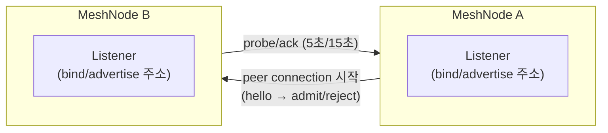
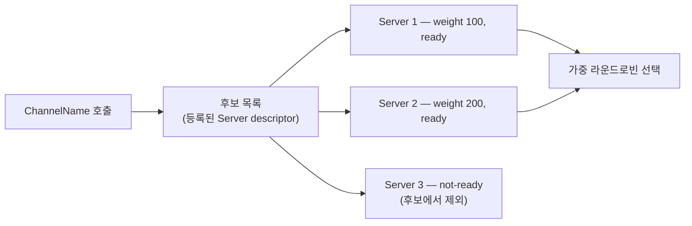

# Channel과 Transport

[스펙 목차](../README.ko.md) · [다음: 01. RouteMesh topology](01-channel-topology.ko.md)

## 1. 무엇을 다루는가

Node 하나가 다른 node나 client를 어떻게 찾고, byte를 어떻게 주고받고, 연결이 살아 있는지
어떻게 확인하는가 — 이 주제는 그 물리적 연결과 논리적 message 대상 선택을 함께 다룬다. 여러
node가 참여하는 연결 topology에서 message를 보내거나 받는 runtime node인
[MeshNode](../00-foundation/02-glossary.ko.md#meshnode)들이, 하나의
[RouteMesh](../00-foundation/02-glossary.ko.md#routemesh) 물리 연결 그룹을 식별하는 이름인
[MeshName](../00-foundation/02-glossary.ko.md#meshname)으로 서로를 찾는 RouteMesh, message를 보낼 Channel 범위를
식별하는 이름인 [ChannelName](../00-foundation/02-glossary.ko.md#channelname)으로 application이
직접 여는 [ClientServer Channel](../00-foundation/02-glossary.ko.md#clientserver-channel), listener가 노출하는
주소, 연결 생존 확인, 그리고 그 위를 오가는 실제 byte 형식까지 여섯 문서로 나누어 설명한다.

주소와 상태를 가지고 실행 node가 바뀌어도 같은 global ID로 접근할 수 있는 논리 instance인
[Spot](../00-foundation/02-glossary.ko.md#spot)과 Actor가 무엇이고 어떻게 실행되는지는 이 주제가
정의하지 않는다(§7). 이 주제는 message가 어떤 물리 연결을 타고 어떤 논리 대상에 도착하는지까지만
답한다.

## 2. 누가 무엇을 결정하는가

| 주체 | 결정·소유하는 것 |
|---|---|
| Application | ChannelName·역할(Client/Server) 등록, caller가 MeshName과 target RID를 함께 지정해 특정 MeshNode로 보내는 [Node direct](../00-foundation/02-glossary.ko.md#node-direct) 대상 지정, listener bind/advertise 주소, weight 값 |
| Framework(node runtime) | RouteMesh peer discovery, ChannelName membership 조회, 가중 라운드로빈 target 선택, admission(hello/admit/reject), probe/ack 주기 |
[Location Store](../00-foundation/02-glossary.ko.md#location-store)(각 객체의 현재 owner와 상태를 여러 node가 함께 확인하도록 보관하는 저장소) | ClientServer의 automatic discovery에서 Server가 자신의 identity와 접속 위치를 알리려고 게시하는 등록 정보인 [ClientServer Server descriptor](../00-foundation/02-glossary.ko.md#clientserver-server-descriptor), RouteMesh 등록 정보의 durable 기록 — 없으면 automatic discovery가 동작하지 않는다 |
| Core | 실제 socket 송수신, connect/disconnect event, wire byte의 물리 전달 |

## 3. 한 흐름으로 보기

물리 연결과 논리 대상 선택은 서로 다른 층이다. 물리 연결이 있어야 논리 선택의 후보가 되고,
논리 선택이 그 연결 중 하나로 message를 보낸다.

**물리 층 — node, listener, peer connection**

**논리 층 — ChannelName, candidates, weight, ready**

논리 층의 각 후보는 물리 층에서 admitted되고 probe/ack로 살아 있다고 확인된 connection
위에서만 ready가 된다 — 두 그림의 연결선이 이 조건으로 이어진다.

## 4. 이 주제의 문서

| 문서 | 다루는 것 | 층 |
|---|---|---|
| [01. RouteMesh topology](01-channel-topology.ko.md) | MeshName·MeshNode, ChannelName role과 membership, peer 연결과 discovery | 계약 |
| [02. Channel 메시징](02-channel-messaging.ko.md) | Node direct와 ChannelName select-one 공통 계약, target 선택 순서, handler 조회 | 계약 |
| [03. ClientServer Channel](03-client-server-channel.ko.md) | Client/Server role 등록, weight와 target 선택, send/request/reply, drain, 재시작 | 계약 |
| [04. Network listener identity](04-network-listener-identity.ko.md) | bind/advertise 주소, port 확정, listener 종류별 record, transport RID·Spot ID 발급 정책 | 계약 |
| [05. Transport liveness](05-transport-liveness.ko.md) | probe/ack·beacon 고정 시간, Ready와 장애 판정, connection loss와 reconnect | 계약 + 구현 스펙(단일 기준) |
| [06. Service wire protocol](06-wire-protocol.ko.md) | node 사이에 실제로 오가는 byte 형식과 command 목록 | 구현 스펙 |

## 5. 질문으로 찾기

| 질문 | 답이 있는 절 |
|---|---|
| RouteMesh의 물리 연결과 ChannelName의 논리 membership은 어떻게 다른가 | 이 문서 §1~§3 · [01. RouteMesh topology](01-channel-topology.ko.md) "1. RouteMesh topology 개요" |
| 같은 MeshName인데 자동으로 중계되지 않는 경우는 언제인가 | [01. RouteMesh topology](01-channel-topology.ko.md) "2. MeshName과 MeshNode" |
| Node direct와 ChannelName 호출은 대상을 어떻게 고르는가 | [02. Channel 메시징](02-channel-messaging.ko.md) "2. Target을 선택하는 방법 — Node direct" · "3. Target을 선택하는 방법 — ChannelName select-one" |
| ClientServer는 RouteMesh와 무엇이 다른가 | [03. ClientServer Channel](03-client-server-channel.ko.md#1-clientserver-channel-개요) |
| weight와 drain은 선택에 각각 어떻게 반영되는가 | [03. ClientServer Channel](03-client-server-channel.ko.md#4-weight와-target-선택) · [03. ClientServer Channel §6](03-client-server-channel.ko.md#6-drain) · [01. RouteMesh topology](01-channel-topology.ko.md) "5. 실행 중 바꿀 수 있는 값(weight)" |
| listener의 bind 주소와 advertised 주소는 왜 다른가 | [04. Network listener identity](04-network-listener-identity.ko.md#1-listener-주소-개요) |
| MeshNode RID와 Entry Spot ID는 어떻게 발급되는가 | [04. Network listener identity](04-network-listener-identity.ko.md#6-시스템-전체-transport-rid와-spot-id-정책) |
| 연결이 살아 있는지는 어떻게 확인하고, 판정 기준은 무엇인가 | [05. Transport liveness](05-transport-liveness.ko.md#2-고정된-시간과-public-api-경계) · [§5](05-transport-liveness.ko.md#5-ready와-장애-판정) |
| Classic fanout은 왜 다른 방식(beacon)으로 확인하는가 | [05. Transport liveness](05-transport-liveness.ko.md#4-classic-fanout) |
| 연결이 끊기면 무엇을 다시 하고 무엇을 재사용하지 않는가 | [05. Transport liveness](05-transport-liveness.ko.md#6-connection-loss와-reconnect) |
| node 사이에 실제로 오가는 byte와 command는 무엇인가 | [06. Service wire protocol](06-wire-protocol.ko.md#2-record-framing과-decode) · [§3](06-wire-protocol.ko.md#3-command-space) |
| relocation·actor join의 wire 세부는 어디서 보는가 | [06. Service wire protocol §9](06-wire-protocol.ko.md#9-maintenance-capture와-relocation-envelope) |

## 6. 읽는 순서

**처음 읽는 개발자**

1. 이 문서 §1~§3으로 물리 연결과 논리 대상 선택의 관계를 잡는다.
2. [01. RouteMesh topology](01-channel-topology.ko.md) "1. RouteMesh topology 개요"부터 읽어
   node가 서로를 찾는 방법을 확인한다.
3. [03. ClientServer Channel §1](03-client-server-channel.ko.md#1-clientserver-channel-개요)로
   application이 직접 여는 연결과 RouteMesh의 차이를 확인한다.

**새 언어로 porting하는 개발자** — 아래 절이 모든 runtime이 같은 구조로 따라야 하는 규칙과
검증 요구를 담고 있으므로, 언어별 구현 전에 반드시 읽는다. 언어마다 달라도 되는 곳은 본문에
**언어별 재량**으로만 표시한다.

- [05. Transport liveness](05-transport-liveness.ko.md#2-고정된-시간과-public-api-경계)(고정
  시간), [§8](05-transport-liveness.ko.md#8-liveness-판정은-authority를-바꾸지-않는다)(책임 분리),
  [§10. 검증 요구](05-transport-liveness.ko.md#10-검증-요구)
- [06. Service wire protocol §1](06-wire-protocol.ko.md#1-schema와-생성-경계)(schema가 유일한
  기준), [§2](06-wire-protocol.ko.md#2-record-framing과-decode)(frame·decode),
  [§5](06-wire-protocol.ko.md#5-service-liveness)(probe/ack wire),
  [§12. 검증 요구](06-wire-protocol.ko.md#12-검증-요구)

**application 개발자**

1. [02. Channel 메시징](02-channel-messaging.ko.md) "1. Node direct와 ChannelName select-one
   개요"로 두 호출 방식의 공통 API를 확인한다.
2. [03. ClientServer Channel §2](03-client-server-channel.ko.md#2-client와-server-role-등록) ~
   [§5](03-client-server-channel.ko.md#5-send-request와-reply)로 role 등록부터 send/request까지
   순서를 확인한다.
3. [04. Network listener identity §1](04-network-listener-identity.ko.md#1-listener-주소-개요) ~
   [§2](04-network-listener-identity.ko.md#2-process-기본값과-listener-override)로 listener 주소를
   구성하는 방법을 확인한다.

## 7. 이 주제가 정의하지 않는 것

| 내용 | 소유 문서 |
|---|---|
| Actor model과 queue, Actor join의 admission 판정 대상 | [Spot과 Actor 모델](../03-spot-actor/05-spot-actor-membership.ko.md) — 03-spot-actor 주제로 이관 중 |
| Session의 bind·relay·rebind·relocation 책임 | [Session 주제](../04-session/README.ko.md) |
| Location Store record 형식과 CAS 규율 | [Location runtime](../05-location-relocation/01-location-runtime.ko.md) — 05-location-relocation 주제로 이관 중 |
| Relocation의 phase state machine과, Actor가 어느 Spot에 속하는지 나타내는 [Actor membership](../00-foundation/02-glossary.ko.md#actor-membership) commit 절차 | [Relocation handoff 상태 전이](../05-location-relocation/04-relocation-flow.ko.md) — 05-location-relocation 주제로 이관 중 |
| Typed application message JSON의 공개 encoding·validation 규칙 | [Message model §2.3](../00-foundation/05-message-model.ko.md#5-framework-json-v1-typed-payload-profile) |
| Shared permit과 byte HWM | [Core byte HWM과 Application job flow](../01-execution/04-application-job-queue-and-backpressure.ko.md) — 01-execution 주제로 이관 중 |

---

[스펙 목차](../README.ko.md) · [다음: 01. RouteMesh topology](01-channel-topology.ko.md)
