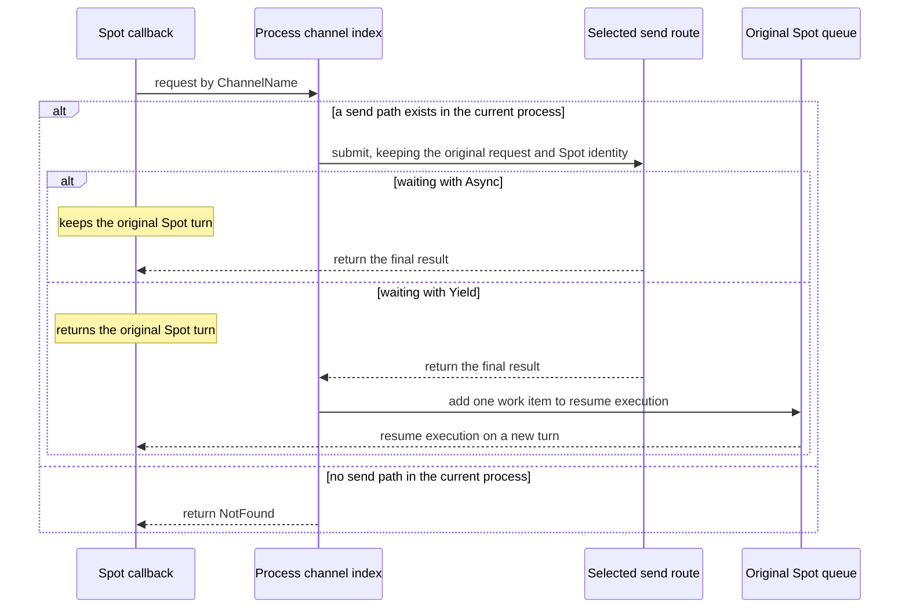
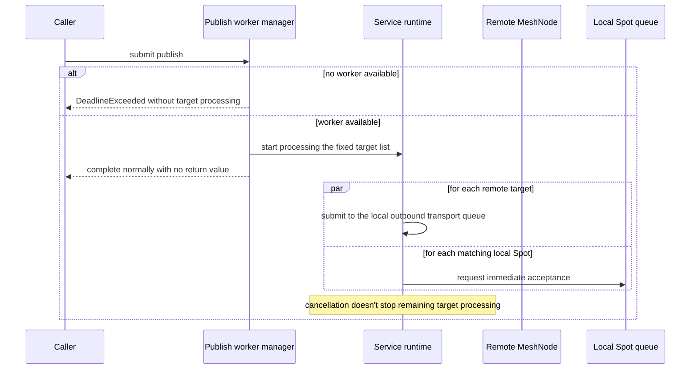

# Spot Messaging

[Spot And Actor topic index](README.en.md) · [Spec table of contents](../README.en.md) · [Previous: 01. Spot Model](01-spot-model.en.md) · [Next: 03. MeshNode](03-mesh-node.en.md)

> Defines the common public contract for delivering messages to a
> [Spot](../00-foundation/02-glossary.en.md#spot) in ZLink Framework. Its audience is developers
> implementing and verifying the framework's Spot messaging.

## 1. Spot Messaging Overview

A Spot is a logical instance with an address and state, like a room, stage, or zone.
The application can deliver a message to a Spot in the following two ways.

| Method | Value the application specifies | How the framework decides the actual delivery target |
|---|---|---|
| [Spot direct](../00-foundation/02-glossary.en.md#spot-direct) (a way of specifying a single global Spot ID to send/request to that Spot) | Specifies one [Spot ID](../00-foundation/02-glossary.en.md#spot-id), the global logical address that identifies the Spot to which the message will be delivered. | First finds a currently usable Spot. If it exists, sends to the node that owns it. If it doesn't exist and `InstanceSpot(...)` was specified, selects a node to create the new Spot. |
| [Logical Multicast](../00-foundation/02-glossary.en.md#logical-multicast) (a way of delivering one message to several Spots in the same Channel via ChannelName and topic) | Specifies a name identifying the delivery scope, [ChannelName](../00-foundation/02-glossary.en.md#channelname), and a `topic` selecting a Spot within it. | First selects a ready remote node with weight greater than 0 among nodes participating in that Channel. Each receiving node delivers the message to its own local Spots registered under the same ChannelName and topic. |

If [Spot direct](../00-foundation/02-glossary.en.md#spot-direct) has no Spot and `InstanceSpot(...)`
wasn't specified either, no new Spot is created — it returns a target-not-found
result.

[Logical Multicast](../00-foundation/02-glossary.en.md#logical-multicast) isn't a method where the
source builds a list of remote Spot IDs. The framework sends the message once per
node participating in the Channel, and each node checks its own subscriptions to
decide which local Spot actually receives it.

A node with [weight](../00-foundation/02-glossary.en.md#weight) greater than 0 is included as a
Logical Multicast remote delivery candidate. Before a Spot can receive messages,
Spot creation and initialization must finish, and its current owner and lifecycle
state must be recorded in the [Location Store](../00-foundation/02-glossary.en.md#location-store),
where multiple nodes can check them. A node not in that
[Ready](../00-foundation/02-glossary.en.md#ready) state isn't included in this delivery, even
with positive weight.

This document explains the order for deciding targets and running callbacks in the
two methods. The following is defined by other documents.

- The physical connection of a [MeshNode](../00-foundation/02-glossary.en.md#meshnode)(a runtime
  node that sends or receives messages within a connection topology several nodes
  participate in): [MeshNode](03-mesh-node.en.md)
- The actual procedure for identifying and creating a Spot, and newly preparing an
  Instance Spot: [Spot Address Messaging](06-spot-address-messaging.en.md)
- The positive route cache's fields, lifetime, and invalidation conditions:
  [Routing](08-routing.en.md)
- Payload and metadata: [Message Model](../00-foundation/05-message-model.en.md)
- Async execution of callbacks: [Async Execution Policy](../01-execution/01-submit-and-completion.en.md)

### 1.1 An Example Expressing the Common Behavior as a .NET API

This document's contract applies to every framework language. The C#
example below is a reference showing how the common behavior appears in the .NET
public API. This example doesn't define the common interface's signature or require
the C# shape in other languages.

The actual .NET signature is defined by
[.NET Spot Public Interface](../languages/dotnet/interfaces/05-spots.en.md) and
[.NET Common Runtime Interface](../languages/dotnet/interfaces/01-common-runtime.en.md).

The following interface shows how to send messages via Spot direct and from a Spot
callback. The members described in this document are excerpted exactly as their
actual .NET signatures.

```csharp
public interface IZLinkSpotClient
{
    // finds the currently usable owner by global Spot ID and sends a one-way message.
    IZLinkSpotSendCall SendToSpot<TMessage>(
        string spotId,
        TMessage message);

    // finds the currently usable owner by global Spot ID and sends a request.
    IZLinkSpotRequestCall RequestToSpot<TRequest>(
        string spotId,
        TRequest request);
}

public interface IZLinkSpotSendCall
    : IZLinkMetadataCall<IZLinkSpotSendCall>
{
    // explicitly chooses to create and initialize a new Spot when none exists.
    IZLinkSpotSendCall InstanceSpot();
    IZLinkSpotSendCall InstanceSpot(string instanceSpotType);

    // specifies the Mesh to first create a Missing Instance Spot on.
    // can be omitted if there's exactly one Mesh with Object Client or Server role.
    // ends with InvalidOperation if omitted with two or more candidate Meshes.
    IZLinkSpotSendCall InMesh(string meshName);

    // waits for the send path to accept the message; doesn't wait for the target handler to run.
    ValueTask Async(
        CancellationToken cancellationToken = default);
}

public interface IZLinkSpotRequestCall
    : IZLinkMetadataCall<IZLinkSpotRequestCall>
{
    // explicitly chooses to create and initialize a new Spot when none exists.
    IZLinkSpotRequestCall InstanceSpot();
    IZLinkSpotRequestCall InstanceSpot(string instanceSpotType);

    // specifies the Mesh to first create a Missing Instance Spot on.
    // can be omitted if there's exactly one Mesh with Object Client or Server role.
    // ends with InvalidOperation if omitted with two or more candidate Meshes.
    IZLinkSpotRequestCall InMesh(string meshName);

    // applies one deadline from Spot lookup through reply.
    IZLinkSpotRequestCall Timeout(TimeSpan timeout);

    // Async keeps the current execution gate.
    // Yield only returns the shared Spot turn on SpotWide User Spot and Instance Spot.
    ValueTask<TReply> Async<TReply>(
        CancellationToken cancellationToken = default);
    ValueTask<TReply> Yield<TReply>(
        CancellationToken cancellationToken = default);
}

public interface IZLinkSendCall : IZLinkMetadataCall<IZLinkSendCall>
{
    // waits for the send path to accept a Channel one-way message.
    ValueTask Async(
        CancellationToken cancellationToken = default);
}

public interface IZLinkRequestCall : IZLinkMetadataCall<IZLinkRequestCall>
{
    IZLinkRequestCall Timeout(TimeSpan timeout);

    // Yield is only valid in SpotWide User Spot and Instance Spot execution contexts.
    ValueTask<TReply> Async<TReply>(
        CancellationToken cancellationToken = default);
    ValueTask<TReply> Yield<TReply>(
        CancellationToken cancellationToken = default);
}

public interface IZLinkSpotOutbound
{
    // even from a Spot callback, only the global Spot ID is specified.
    IZLinkSpotSendCall SendToSpot<TMessage>(
        string spotId,
        TMessage message);
    IZLinkSpotRequestCall RequestToSpot<TRequest>(
        string spotId,
        TRequest request);

    // ChannelName and topic set the Logical Multicast target scope.
    IZLinkPublishCall Publish<TEvent>(
        string channelName,
        string topic,
        TEvent message);

    // selects the send path registered for ChannelName in the current process.
    IZLinkSendCall SendToChannel<TMessage>(
        string channelName,
        TMessage message);
    IZLinkRequestCall RequestToChannel<TRequest>(
        string channelName,
        TRequest request);
}
```

Logical Multicast's subscription and publish are connected via the following
interface.

```csharp
public interface IZLinkSpotHandlerRegistry : IZLinkActorHandlerRegistry
{
    // registers a Spot direct packet handler.
    void AddPacket<THandler>() where THandler : class;

    // registers a Logical Multicast handler matching ChannelName and topic.
    void AddSubscribe<THandler>(
        string channelName,
        string topic)
        where THandler : class;
}

public interface IZLinkSpotPublisherClient
{
    // starts Logical Multicast with just ChannelName and topic, even outside a Spot.
    IZLinkPublishCall Publish<TEvent>(
        string channelName,
        string topic,
        TEvent message);
}

public interface IZLinkPublishCall
    : IZLinkMetadataCall<IZLinkPublishCall>
{
    // submits to the fixed remote route's transport queue and local Spot queue.
    // doesn't wait for remote Spot queue acceptance or subscriber handler completion.
    ValueTask Async(
        CancellationToken cancellationToken = default);
}
```

The code above is an excerpt for understanding the interface relationships directly
within the document. Metadata builders and .NET interfaces not used in this document
have their actual signature defined by the documents named above.

## 2. Spot and MeshNode

### 2.1 The Value Identifying a Spot

User Spot and
[Instance Spot](../00-foundation/02-glossary.en.md#entry-spot-user-spot-and-instance-spot) are
identified by a logical address, the Spot ID. This ID must be unique across the
whole scope the Location Store manages.

A [Spot ID](../00-foundation/02-glossary.en.md#spot-id) is a string compared byte-for-byte,
case-sensitive, UTF-8 encoded, 1..255 bytes. Two IDs are the same only if the whole string matches.
[`MeshName`](../00-foundation/02-glossary.en.md#meshname), a name identifying one
physical connection group of a
[RouteMesh](../00-foundation/02-glossary.en.md#routemesh)(the scope over which several
MeshNodes participate to exchange node and Channel messages), is used only to
decide a Spot's initial placement and isn't included in the value
identifying a Spot.

[`Spot kind`](../00-foundation/02-glossary.en.md#spot-kind), the value indicating which kind
of Spot it is among Entry, User, and Instance, distinguishes Entry, User, and
Instance. [`Stable type`](../00-foundation/02-glossary.en.md#stable-type), a fixed name that
identifies the same kind of Spot even after a deployment version or the running
node changes, is a fixed name the application sets so it can identify the same
kind of Spot even after a deployment changes.

So the same ID can't be reused if any of the following differ.

- `MeshName`
- Spot kind
- [stable type](../00-foundation/02-glossary.en.md#stable-type)

The Entry Spot ID is issued by the framework. The caller doesn't generate an Entry
Spot ID or specify it as a create target. The issued format and collision handling
are defined by [MeshNode](03-mesh-node.en.md).

<a id="object-roles"></a>
### 2.2 Object Client and Object Server Roles

Spot factory, Entry Spot, and Spot lifecycle can only be registered on a
[MeshNode](../00-foundation/02-glossary.en.md#meshnode) with the Object Server role.

| Object role | Work it can start | Server functionality | [Location Store](../00-foundation/02-glossary.en.md#location-store) |
|---|---|---|---|
| `None` | Doesn't provide Spot creation/lookup via object manager or Spot direct messaging. | Doesn't provide Spot creation/execution functionality or an Entry Spot. | Not needed. |
| `Client` | Can request Spot creation, lookup, and messaging. | Doesn't register a [factory](../00-foundation/02-glossary.en.md#factory) or Entry Spot in server information. | Needed. |
| `Server` | Can start everything `Client` can start. | Registers factory, Entry Spot, and Spot lifecycle. | Needed. |

This table only compares functionality the object role provides. Whether a
ChannelName-based Logical Multicast publisher is registered is configured separately
from object role.

### 2.3 The Physical Connection Spot Messaging Uses

Spot direct and Logical Multicast use the same MeshNode ROUTER as Node/Channel
messaging. A separate ROUTER or PUB/SUB mesh just for Spot isn't created.

If a Spot needs to be newly created, the framework selects a remote server that can
create it. The application doesn't specify the following internal values.

- target RID
- endpoint
- the generation distinguishing the current owner

If there is no currently usable Instance Spot, the framework selects a target node
and sends the first application message together with the information needed for
creation. When there is no Spot on that node, the target runtime creates and
initializes the Spot, then processes the same message. A separate operation to
create an Instance Spot isn't provided.

The actual procedure for identifying and creating a Spot, and preparing a new
instance, is defined by
[Spot Address Messaging](06-spot-address-messaging.en.md).

### 2.4 The Boundary with Classic Fanout

Classic fanout is a separate feature that uses a PUB/SUB socket to deliver the same
event to subscribers. Service event fanout and Spot Logical Multicast are different
features.

The two features don't share the following state.

- Physical connection
- Subscription state

## 3. Spot Direct

### 3.1 How to Find a Ready Spot's Owner

Spot direct send and request take only a single global Spot ID as target.

When the framework looks up an owner, it first looks for the recently confirmed
[owner](../00-foundation/02-glossary.en.md#owner)'s send path in a cache, and if no information
exists, asks the Location Store for the current owner. This `positive route cache`'s
actual fields, lifetime, and invalidation conditions are defined by
[Routing](08-routing.en.md).

The Location Store records, for each Spot, the current owner, the number
distinguishing the previous Spot from the new one when a Spot is re-created under
the same Spot ID,
[`ObjectGeneration`](../00-foundation/02-glossary.en.md#objectgeneration), and lifecycle
state. The framework uses this record as the basis for judging a
Spot's current location and ownership. This reference information is called
[authority](../00-foundation/02-glossary.en.md#authority).
Only one actual Spot can exist per generation.

`Ready` is the state where Spot creation, initialization, and the Location Store
record are finished, so it can receive messages. The framework finds the
[Ready Spot](../00-foundation/02-glossary.en.md#ready) and the route to send a message to its
owner, either from the cache or the Location Store.

A regular Spot message's target is `SpotId`. The node that receives the message
checks whether it's the current owner of this ID, whether a Ready Spot of the same
ID exists, and whether the Spot queue has headroom. It also checks the `owner
fence`, the value identifying the current owner, to reject a previous owner's route.
The `ObjectGeneration` confirmed when sending the request is information
distinguishing a route snapshot from a stale cache — it isn't a target-match
condition for the application handler. If a Spot was removed and re-created under
the same ID by the same owner, the payload is put into the current Ready Spot at
the moment the queue accepts the message.

### 3.2 Newly Preparing When There Is No Instance Spot

The process of creating a new instance and initializing it into a usable state,
when there is no running Instance Spot, is called
[cold activation](../00-foundation/02-glossary.en.md#cold-activation).

If a Spot direct call has no [Instance intent](../00-foundation/02-glossary.en.md#instance-intent)
(the explicit choice to prepare a new one when the Spot doesn't exist) and the
target Spot doesn't exist, it ends with `NotFound`, and the framework doesn't
build creation info holding the [Spot kind](../00-foundation/02-glossary.en.md#spot-kind), stable
type, and initial placement location.

Specifying Instance intent allows cold activation of a Missing Instance Spot. The
stable type and initial `MeshName` can be specified together if needed; if omitted,
the framework auto-selects one Instance type registered on the selected Mesh. Even
if multiple MeshNodes register the same type, it's counted as one type — if there
are two or more distinct types, the caller must specify a stable type. The
procedure by which the source selects a target node and delivers the first
application message together with the information needed for Spot creation as a
single [activation envelope](../00-foundation/02-glossary.en.md#activation-envelope), the target's
securing of creation authority, durable inbox restoration, and the barrier-opening
order, are defined by [Spot Address Messaging](06-spot-address-messaging.en.md).

If [Spot authority](../00-foundation/02-glossary.en.md#authority) already exists, the Spot kind,
stable type, and current Mesh recorded in the Location Store are used. In this case
the caller isn't required to provide `MeshName` to decide the messaging target.

| Call shape | No Spot exists | Spot info exists in the Location Store |
|---|---|---|
| No Instance intent | Ends as target-not-found; doesn't build Spot creation info. | Uses the stored kind, type, Mesh, and current owner's send path. |
| Has Instance intent | The source decides stable type and initial Mesh. The framework selects a target node based on Serving state, type registration, capacity, and node-wide placement weight, and sends the first message together with creation info. | Uses the stored kind, type, and current Mesh; doesn't move the existing Spot. |

#### Non-Normative .NET Example

An example that calls `InstanceSpot(...)` on a request to allow cold activation of
a Missing Spot.

```csharp
static ValueTask<TReply> RequestAsync<TRequest, TReply>(
    IZLinkSpotClient spotClient,
    string spotId,
    TRequest request,
    CancellationToken cancellationToken)
{
    return spotClient
        .RequestToSpot(spotId, request)
        .InstanceSpot("ShoppingCartSpot") // prepare a new Spot with this type if it doesn't exist.
        .InMesh("object-mesh")             // set the Mesh to first place a Missing Spot on.
        .Timeout(TimeSpan.FromSeconds(3))  // apply one deadline from Spot lookup through reply.
        .Async<TReply>(cancellationToken); // wait for the handler's reply after cold activation.
}
```

This call also doesn't specify a target node or endpoint. If `InstanceSpot(...)` is
omitted, a request with no Ready authority ends with `NotFound`. If authority
already exists, the stored current [owner route](../00-foundation/02-glossary.en.md#owner-route)
is used, so `InMesh(...)` doesn't move the existing Spot.

### 3.3 What Spot Direct Send Completion Means

Spot direct send only provides `Async(...)`. A separate API that doesn't build an
async call and returns completion immediately isn't provided.

If the owner MeshNode's ROUTER queue is temporarily full, it waits, up to a finite
send timeout, for the queue to be able to accept the message.

A regular direct send to a Ready Spot completes with no return value once the
source's send path accepts the message. This completion doesn't mean the target
Spot's handler ran. If it isn't accepted by the send timeout, it fails with the
Framework exception raised when an operation doesn't satisfy its completion
condition by the allowed deadline,
[`DeadlineExceeded`](../00-foundation/02-glossary.en.md#deadlineexceeded); if there is no Spot
or route, `NotFound`; if the runtime is
shutting down, `ShuttingDown`. The detailed boundary of cancellation and errors
occurring in the caller process follows
[Async Execution Policy §1.3](../01-execution/01-submit-and-completion.en.md).

A submit needing cold activation also completes once the send path to the selected
target accepts the activation envelope. It doesn't wait for the target to secure
creation authority, run the factory, and become `Ready`, or for application handler
execution.

The activation envelope preserves the following information together.

| Information | Reason it's used |
|---|---|
| The first application message | So the source doesn't need to resend the business payload for processing once Spot preparation finishes. |
| The value identifying the same work (`operation identity`) | Distinguishes whether a retry or duplicate submission is the same work. |
| The value linking reply to request (`reply correlation`) | Links the request's reply back to the original call. |
| The work deadline | Delivers to the target the time boundary that applies to the work. |
| The Spot's global ID | Identifies the Spot the target runtime will confirm or create. |
| The selected Mesh and stable type | Fixes what scope and kind of Instance Spot to prepare. |
| The version of the information used to select the target ([`target descriptor fence`](../00-foundation/02-glossary.en.md#target-descriptor-fence)) | Determines whether the target's registration information changed after selection. |

If the Spot the current authority points to doesn't exist on this node, the target
runtime asks the Location Store for permission to create this Spot. Even with
competing targets or duplicate envelopes, only the target that first secures
creation authority records itself as owner and runs the factory. The actual order of
this creation procedure is defined by
[Spot Address Messaging](06-spot-address-messaging.en.md).

### 3.4 Common Guarantees of Spot Direct

- A local Spot and remote Spot use the same handler and callback execution rules.
- The caller doesn't build owner RID, endpoint, or internal-communication route
  information.
- A failed Spot direct request isn't automatically resent to a different Spot.
- The handling of owner changes, the route cache, and stale owner routes is defined by
  [Spot Address Messaging](06-spot-address-messaging.en.md) and
  [Routing](08-routing.en.md).

After receiving a failure result, the application can start a new request with the
same Spot ID or a different Spot ID. The new request is a separate operation, not an
automatic framework resend. If the previous target may have already run the
request, the application must handle duplicate execution.

There is no separate create request for an Instance Spot. A call specifying
`InstanceSpot(...)` includes the first application message in the activation
envelope. This message doesn't turn into a separate request instructing Spot
creation — it's processed as application payload once creation finishes. The actual
order in which the target runtime processes this envelope to create the Spot and
make the first message runnable is defined by
[Spot Address Messaging](06-spot-address-messaging.en.md). The source doesn't build
a second direct message after the `Ready` commit.

### 3.5 Channel Calls from a Spot

A Spot handler or timer can start a Channel send and request. The framework selects
the send path registered in the current process by
[ChannelName](../00-foundation/02-glossary.en.md#channelname).

Even if the target ChannelName isn't on the MeshNode currently owning the Spot, it
can be used if one of the following routes is registered in the same process.

- A different RouteMesh's send path for that ChannelName
- A ClientServer client's send path for that ChannelName

If there is no target send path in the current process, it doesn't use a different
process or MeshNode as a relay path. In this case it ends with `NotFound`.

### 3.6 Resuming Channel Request Execution

Even when a Spot sends a request via a different send path, the framework keeps the
following information.

| Kept information | Why it's needed |
|---|---|
| Request correlation | Finds which request the arriving reply is the result of. |
| The Spot execution at the moment the request started | Returns to the callback that was waiting for the reply. |
| The generation of the Spot that started the request | Even if a Spot is re-created under the same Spot ID, a previous Spot's reply isn't delivered to the new Spot. |

`Async` can be used in every execution context. `Yield` can only be used in a
`SpotWide` User Spot and Instance Spot, and handles the Spot turn as follows.

| Method | [Spot turn](../00-foundation/02-glossary.en.md#spot-turn) handling |
|---|---|
| `Async` | Keeps the original turn that started the request. |
| `Yield` | Returns the shared Spot turn. Once the request result is confirmed, puts one work item to resume execution back into the original Spot queue. |

Calling `Yield` from Entry Spot, `PerActor` User Spot, an Entry Spot Actor, a Node/
Channel handler, or a client outside an owner turn completes with
`InvalidOperation`, without submitting the operation or returning the turn.

`Yield` is provided for Channel/Spot/Actor requests, CPU/I/O worker calls, and
Actor/Spot create/get-or-create calls. It isn't provided for Actor join, send,
publish, timer registration, close, or destroy.

A reply isn't re-delivered as a new Spot message.

Even if Spot [shutdown](../00-foundation/02-glossary.en.md#shutdown), timeout, cancellation, and
reply happen at the same time, only one final success-or-failure result for the
request is chosen. A late-arriving reply for a previous generation's Spot isn't
delivered to a Spot newly created under the same Spot ID.

This handling is a feature that selects a send path within the framework process.
The service runtime doesn't do the following.

- Search a different [RouteMesh](../00-foundation/02-glossary.en.md#routemesh) not registered in
  the current process
- Relay messages between RouteMeshes
- Use the original Spot ID as the actual connection's sender address in ClientServer
  transport

The following diagram shows the difference in how `Async` and `Yield` handle the
request result.



Even if the send path is on a different RouteMesh or ClientServer, the reply returns
to the same execution and generation of the Spot that started the request. If there
is no route in the current process, a different process isn't used as a relay
path.

#### Non-Normative .NET Example

The following code starts a Channel request from a `SpotWide` User Spot or Instance
Spot callback and returns the shared Spot turn.

```csharp
ValueTask<TReply> RequestFromSerializedSpotAsync<TRequest, TReply>(
    string channelName,
    TRequest request,
    CancellationToken cancellationToken)
{
    return Context.Outbound
        .RequestToChannel(channelName, request)
        .Yield<TReply>(cancellationToken); // returns the shared Spot turn and resumes on a new turn.
}
```

Using `Async<TReply>(...)` on the same call keeps the current Spot turn until the
request result is confirmed. Both methods select the send path registered in the
current process by ChannelName.

## 4. Channel-Scoped Logical Multicast

### 4.1 Target Scope

Logical Multicast is a feature that delivers one message to several Spots in the same
Channel. The delivery scope is set by the `(ChannelName, topic)` combination. The
second value is [topic](../00-foundation/02-glossary.en.md#topic).

`ChannelName` selects the participating RouteMesh nodes that will receive the
message. `Topic` selects the local Spot
[subscription](../00-foundation/02-glossary.en.md#subscription) that will receive the message on
each receiving MeshNode.

Since the RouteMesh matching ChannelName is found from the current process's
Channel list, the caller doesn't specify `MeshName` or endpoint.

Registering the same ChannelName under multiple send paths in the following ways
fails host startup.

- Duplicate registration on different RouteMeshes
- Duplicate registration on RouteMesh and ClientServer
- Duplicate registration on different ClientServer send paths

ChannelName isn't a physical socket's name — it represents which MeshNodes
participate in the same Channel.

### 4.2 Publish Processing Order

The framework processes one publish as one operation. When starting the operation,
it fixes the remote target list and the matching local Spot list on the sending
node. This initially fixed target list is called a `snapshot`. Even if
participating nodes change during publish, this list doesn't change. A remote
MeshNode separately checks its own local subscription at the moment it receives the
message.

1. Fixes the list of remote MeshNodes participating in the target ChannelName with
   positive weight and Ready state.
2. Submits the message once to the source's local outbound transport queue for each
   remote MeshNode in the list.
3. If the sending MeshNode also participates in the target ChannelName, checks that
   node's subscriptions too.
4. Each receiving MeshNode checks only its own local subscriptions.
5. Submits a reference pointing to the same message data to each matching Spot's
   application queue.

When delivering to multiple Spots on the same node, the payload isn't re-encoded or
copied per Spot. Message data can't be changed while processing, and each queue
points to the same data. Once the last queue no longer uses this data, the
Framework reclaims it.

This data-sharing method isn't exposed in the application API.

The framework doesn't return to the caller which Spots exist on a remote node or
each node's queue state. A method where the caller directly implements Logical
Multicast by repeatedly calling
[Node direct](../00-foundation/02-glossary.en.md#node-direct)(a way of sending a message to a
specific MeshNode by specifying both a MeshName and a target RID) send isn't part
of the common contract.

### 4.3 Conditions for Starting a Publish Operation

Logical Multicast doesn't provide a publish-only delivery policy option.

The framework limits the number of publish operations that can be processed
concurrently. If every worker is in use, it waits, up to a finite send timeout, for
a worker and source-local outbound capacity. If it can't secure them in time, it
fails with `DeadlineExceeded` without sending a message to any target. If
cancellation or runtime shutdown is confirmed before publish starts, it completes
with the existing typed cancellation or `ShuttingDown` error respectively.

Once a worker takes the work, it starts the following processing.

- Submits the message once to each initially fixed remote target.
- Immediately submits the message to each matching local Spot queue.

If a local Spot queue has no capacity, the next target is processed without
waiting. This failure isn't aggregated into a publish-only result or monitoring
value.

### 4.4 Processing After Publish Has Started

Once a worker and source-local outbound capacity are secured and target-list
processing is handed off, the publish is confirmed as started. The terminal call
completes normally at this point with no return value, without waiting for
per-target accept results. Cancellation or shutdown afterward doesn't turn
already-started work into a total failure. Even if a later-processed target's queue
has no headroom, earlier successful submissions aren't canceled.

So Logical Multicast may only be submitted to some of several source-local
submission targets. Submissions already accepted by the local outbound transport
queue or local Spot queue are kept. A target that wasn't accepted isn't returned
as a public result or aggregated into publish-only monitoring information.

The following diagram shows that publish terminal and per-target delivery
processing are different boundaries.



If publish itself can't start because no worker is available, the caller is
notified of the failure. Once publish has started, an already-accepted submission
isn't canceled, and each target's acceptance isn't returned to the caller or
aggregated into monitoring.

### 4.5 Publish Completion

Even if the counts of both the initially fixed remote targets and the matching local
Spots are `0`, publish completes normally. Once the publish transaction starts, insufficient
queue capacity or an unreachable connection for some targets doesn't roll back or
retry the whole operation. Remote target connection failure and local Spot queue
capacity shortage aren't turned into a publish-only result or monitoring value.

### 4.6 What Publish Completion Means

Publish completion isn't confirmation that a subscriber handler ran or business
processing finished. It means the source runtime secured the needed worker and
source-local capacity and started the publish operation. It doesn't wait for the
receiving MeshNode's Spot queue submission or handler execution/completion.
Publish also doesn't provide the following delivery guarantees.

- Durable storage where the message survives even if the process terminates
- Replay, resending the same message later
- Exactly-once delivery, guaranteeing the same message is processed exactly once

The framework doesn't compute, per publish, the remote/local target count and
per-target accept/failure results to provide as a monitoring snapshot, metric, or
runtime event. Overall transport and mailbox state is checked via common runtime
monitoring, independent of publish.

#### Non-Normative .NET Example

Publish completion isn't the handler execution result — it only represents the
local outbound admission boundary, i.e. source-local admission.

```csharp
static async ValueTask PublishAsync<TEvent>(
    IZLinkSpotPublisherClient publisher,
    TEvent message,
    CancellationToken cancellationToken)
{
    await publisher
        .Publish(
            "workflow",          // ChannelName selects the RouteMesh nodes that receive the message.
            "projection.updated", // Topic checks each node's local subscription.
            message)
        .Async(cancellationToken); // normal completion doesn't mean the handler finished running.
}
```

## 5. Subscription Registration and Message Delivery

### 5.1 Subscription Registration Values and Startup Checks

A Spot subscription is registered with the following values.

- `ChannelName`: the Channel scope the subscription belongs to
- `topic`: the value selecting a Spot within that Channel
- packet name: the value selecting a typed handler

If a registered Spot doesn't participate in that ChannelName, the host can't
start.

Registering a subscription with all the following values the same, twice on the
same Spot, also prevents the host from starting.

- `ChannelName`
- `topic`
- message kind
- [packet name](../00-foundation/02-glossary.en.md#packet-name)

#### Non-Normative .NET Example

A subscription is registered in the Spot's `Configure()`.

```csharp
public void Configure()
{
    Context.Handlers.AddSubscribe<ProjectionUpdatedHandler>(
        "workflow",           // checks only events belonging to this ChannelName scope.
        "projection.updated"); // the topic selecting a local Spot within the same ChannelName.
}
```

`ProjectionUpdatedHandler` is the application-implemented subscription handler for
that message type. Repeating a registration on the same Spot with the same
ChannelName, topic, [message kind](../00-foundation/02-glossary.en.md#message-kind), and packet
name prevents the host from starting.

### 5.2 Control Work That Changes Spot State

When an Actor enters or leaves a Spot, or a lifecycle state changes, state the Spot
manages may also need to change. Work the framework runs on the Spot queue to make
this change is called a
[`Spot control claim`](../00-foundation/02-glossary.en.md#spot-control-claim).

A Spot control claim enters the target's
Spot lane and runs in queue order with that lane's handler/control callbacks. In a
`SpotWide` User Spot, member Actors and timers also use the same shared gate. In
Entry Spot and `PerActor` User Spot, per-Actor lanes and per-timer lanes are
separated from the Spot lane. Business messages an Actor processes aren't put into
a control claim.

The scope of control work and its execution order relative to the Actor control
claim are defined by [Actor Model §4](04-actor-model.en.md).

### 5.3 Work Put on the Spot Application Queue

| Queue | Work put on it | Work not put on it |
|---|---|---|
| [Spot application queue](../00-foundation/02-glossary.en.md#spot-application-queue)(the queue that runs Spot direct payload, matching Logical Multicast payload, timer callback, and control work that changes Spot state, in order) | Spot direct payload, matching Logical Multicast payload, timer callback | Actor business payload, Actor join/leave and lifecycle control callback |
| Instance [Spot application queue](../00-foundation/02-glossary.en.md#spot-application-queue) | Spot direct payload and timer callback | Actor control and Logical Multicast subscription |
| Actor queue | Actor business payload | Actor payload delivered through a Spot callback |

Actor join/leave and lifecycle control callback are handled by the **Spot control
claim**, not the Spot application queue. They have different limits and
execution order, so they aren't mixed. An Instance Spot's Actor control or
Logical Multicast subscription is rejected at registration time or when preparing
the Spot.

The Spot application queue and Actor queue have limits. Behavior when a limit is
exceeded **differs by submission family and queue position.** Three axes — family,
queue position, and when the caller observes the failure — must be considered
together.

| Family | Saturated queue | Result the caller gets |
|---|---|---|
| Send/one-way | An outbound or Spot/Actor queue **on the same runtime** | Follows [Async Execution Policy §1](../01-execution/01-submit-and-completion.en.md) — waits for a slot up to send timeout; if even the internal waiters are full, `DeadlineExceeded` |
| Send/one-way | A Spot/Actor queue **on a different node** | **No result.** The send already completed once the source outbound queue accepted it ([Framework Error Model §4](../00-foundation/07-framework-error-model.en.md)). A later target admission failure doesn't change the already-completed result — it's only left in metric/log/trace |
| Publish (before starting) | A worker slot or source-local outbound | Waits up to send timeout. If it can't be secured, `DeadlineExceeded` |
| Publish (after starting) | Local Spot queue | **Skipped without waiting.** Publish already completed normally, and this failure isn't aggregated into a publish-only result or observability value (§4.3) |
| Request | A Spot/Actor queue on the same runtime | `CapacityExceeded` without waiting |
| Request | A Spot/Actor queue on a different node | `Unavailable` without waiting |
| Control claim | The control limit on the same runtime | `CapacityExceeded` |
| Control claim | The control limit on a different node | `Unavailable` |

Publish's two rows differ because **the completion point sits between them.**
Before starting, there is still a result to return, so it waits; after starting, it
already completed, so there is nothing to roll back.

The send family waits because there is no return value for the caller to make a
retry decision with; the request family doesn't wait because the caller receives
an error it can judge from. Treating a request as a wait would tie the sending
side's execution resources to the receiving side's processing speed, creating a
period in which the two nodes block each other.

The criterion distinguishing local from remote is "does this runtime own the failed
queue" ([Framework Error Model](../00-foundation/07-framework-error-model.en.md)). The caller
uses this distinction to judge what to retry.

Work handled by the Spot control claim **doesn't share** the application queue
limit. If join/leave and lifecycle control failed due to business-payload backlog,
there would be no way left to clear the backlog.

However, the control claim also **has its own limit.** It's kept separate from
the application queue, but isn't unlimited. Left unlimited, memory would grow
without bound while control keeps arriving, and combined with the priority rule
above, application payload would never get a chance to run.

The error kind on exceeding the limit follows the table above — **exceeding the
control lane limit owned by the same runtime is `CapacityExceeded`; saturation
announced by an owner on a different node is `Unavailable`**.

### 5.4 Spot Turn and Callback Order

Entry Spot and Instance Spot application callbacks run in order on each Spot turn.
A User Spot's default `SpotWide` mode has the Spot queue and member Actor queue
share one common execution gate. `PerActor` mode separates per-Actor, per-Spot-lane,
and per-timer gates.

If a `SpotWide` User Spot or Instance Spot callback returns the shared turn via
`Yield`, the same Spot's next application work can run first. The `Yield`ed
callback's remaining code resumes on a new turn of the same gate once the awaited
result is confirmed. `Yield` can't be used in Entry Spot or `PerActor` User Spot.

If a member Actor yields, only the User Spot execution gate is returned, while the
[Actor queue claim](../00-foundation/02-glossary.en.md#actor-queue-claim) is kept. So other
Actor/Spot handlers/timers can run, but the same Actor's next job doesn't start
until the current continuation finishes.

The detailed execution rules follow
[Async Execution Policy §1.1](../01-execution/01-submit-and-completion.en.md).

Actor business payload doesn't go through the Spot application queue or a Spot
callback — it's submitted directly to the Actor queue.

If an Actor needs to change Spot state, it must submit an explicit Spot call. The
boundary between Actor payload and membership control is defined by
[Actor Model](04-actor-model.en.md).

### 5.5 Work Handled Separately from Application Callbacks

The following work, which advances the framework's own state, is handled separately
from Spot application callbacks.

- Notification that a Spot is ready
- Completion handling of an async call
- Notification that a send path can accept messages again
- Handling a Spot or Actor move

This work must be able to keep proceeding even while an application callback is
waiting for a different task's result.

## 6. Failure and Lifetime

### 6.1 Target and Request Failure

A call that doesn't start cold activation via Instance intent ends with a Spot
target error if the target Spot has no Ready authority.

A lifecycle operation like `Close`, which specifies a Spot ID and `ObjectGeneration`
together to change a specific Spot incarnation, also checks the Location Store's
current generation. If the specified generation differs from the current
generation, it returns an error indicating that it referenced an already-changed Spot. This
check isn't applied to Spot direct send/request.

If a request handler can't be found or the payload can't be interpreted, it
checks whether a route remains to send a reply. If a route exists, it completes the
request by sending an error reply.

Even if a one-way Spot direct handler or Logical Multicast handler fails, the
original call isn't turned into a request. Handler failure is recorded in the
runtime observability path.

### 6.2 Spot Termination

Once Spot termination starts, new application payload is no longer accepted onto
the queue.

Already-accepted Spot turns and lifecycle cleanup are processed within the time
allowed for termination ([`drain deadline`](../00-foundation/02-glossary.en.md#drain-deadline)). A
terminated Spot's subscription is excluded when Logical Multicast looks for a Spot
to deliver a message to on the current node.

The conditions under which one-way and request complete are defined by
[Async Execution Policy](../01-execution/01-submit-and-completion.en.md). The whole processing
order when terminating a Spot is defined by
[Graceful Drain](../05-location-relocation/05-host-relocation-flow.en.md).

## 7. Metadata and Observability

### 7.1 Metadata

Spot direct and Logical Multicast use the immutable metadata snapshot defined by
[Message Model](../00-foundation/05-message-model.en.md). Who holds metadata, the allowed size,
and reply rules aren't redefined in this document.

### 7.2 Observability Information

Observability information must provide the following items as distinct values.

| Item | Meaning |
|---|---|
| Current owner's `MeshName` | Indicates which Mesh the Spot is currently on. |
| `ChannelName` | Indicates which Channel scope the message belongs to. |
| Origin RID | Identifies the source that started the message. |
| Acceptance wait and failure | Indicates the time waited for the send path or queue to accept the message, and failure. |
| Capacity shortage | Indicates a message that could not be accepted because the queue had no headroom. |
| Spot delivery result | Indicates the result of delivering a message to the Spot queue and handler. |

Logical Multicast's remote/local target count and per-target results aren't
aggregated into publish-only observability information. `topic` and Spot ID aren't
used as metric-classification labels.

## 8. Verification Requirements

The implementation and contract test must verify the following conditions using
only the public surface (the send/request/publish results of `IZLinkSpotClient`/
`IZLinkSpotOutbound`, the registration APIs of `IZLinkSpotHandlerRegistry`, and
return values/errnos).

### 8.1 Physical Connection and Target Specification

- Spot direct and Logical Multicast share one MeshNode ROUTER.
- Spot direct only takes a global Spot ID as target.
- Spot direct doesn't require `MeshName`, owner RID, or generation from the
  application.
- [Classic fanout](../00-foundation/02-glossary.en.md#classic-fanout) PUB/SUB's connection and
  subscription state aren't mixed with Logical Multicast.

### 8.2 Missing Instance Spot

- A Missing Spot message with no Instance intent doesn't newly provide a stable
  type or `MeshName`.
- A Missing Spot message with no Instance intent doesn't build Spot creation info.
- Only a call with Instance intent can cold-activate a Missing Spot.
- When cold-activating, either the stable type is specified, or if the selected
  Mesh has exactly one distinct type, that type is auto-selected.
- The source submits the activation envelope, including the first message, to the
  selected target without first recording itself as owner.

The verification requirements for a Reserved authority's restoration after a
process restart, durable inbox confirmation, and the Serving gate opening order are
owned by [Spot Address Messaging](06-spot-address-messaging.en.md).

### 8.3 Channel Calls Started from a Spot

- A Spot Channel call can use a different RouteMesh or ClientServer send path
  registered under the ChannelName.
- Even using a different send path, the original Spot's `Async` and the allowed
  execution context's `Yield` meaning are preserved.
- Even using a different send path, the reply is delivered to the Spot of the
  generation that started the request.

### 8.4 Logical Multicast

- Sends a routed message exactly once per remote MeshNode.
- Each receiving MeshNode checks only its own local subscription.
- Only starts work when a publish worker is available, and doesn't start the same
  publish twice.
- Cancellation after publish has started doesn't stop processing of the remaining
  initially fixed targets.
- Multiple target Spots on the same node share the same message data without
  making copies.
- Local and remote target selection count, accept count, drop count, or
  unreachable count aren't aggregated into publish-only monitoring values.

### 8.5 Spot and Actor Message Delivery

- Actor payload doesn't go through the Spot application queue or a Spot callback.
- Only Actor join/leave and lifecycle control are delivered via the Spot control
  claim.

---

[Spot And Actor topic index](README.en.md) · [Spec table of contents](../README.en.md) · [Previous: 01. Spot Model](01-spot-model.en.md) · [Next: 03. MeshNode](03-mesh-node.en.md)
