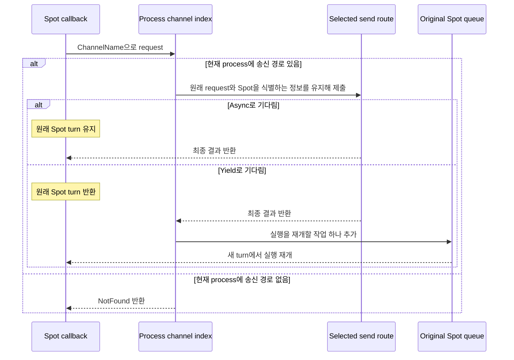
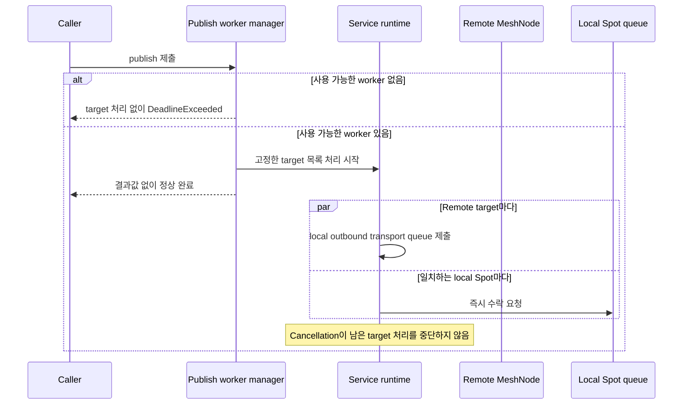

# Spot 메시징

[Spot·Actor 주제 목차](README.ko.md) · [스펙 목차](../README.ko.md) · [이전: 01. Spot 모델](01-spot-model.ko.md) · [다음: 03. MeshNode](03-mesh-node.ko.md)

> ZLink Framework에서 [Spot](../00-foundation/02-glossary.ko.md#spot)에 메시지를 전달하는 공통 공개
> 계약을 정의한다. 대상 독자는 Framework의 Spot 메시징을 구현하고 검증하는 개발자다.

## 1. Spot 메시징 개요

Spot은 room, stage, zone처럼 주소와 상태를 가진 논리 instance다. Application은
다음 두 방식으로 Spot에 메시지를 전달할 수 있다.

| 방식 | Application이 지정하는 값 | Framework가 실제 전달 대상을 정하는 방법 |
|---|---|---|
| [Spot direct](../00-foundation/02-glossary.ko.md#spot-direct)(global Spot ID 하나를 지정해 그 Spot에 send/request를 보내는 방식) | 전달하려는 Spot을 식별하는 전역 논리 주소인 [Spot ID](../00-foundation/02-glossary.ko.md#spot-id) 하나를 지정한다. | 먼저 현재 사용할 수 있는 Spot을 찾는다. Spot이 있으면 그 Spot을 소유한 node로 보낸다. Spot이 없고 `InstanceSpot(...)`을 지정했다면 새 Spot을 만들 node를 선택한다. |
| [Logical Multicast](../00-foundation/02-glossary.ko.md#logical-multicast)(ChannelName과 topic으로 같은 Channel의 여러 Spot에 message 하나를 전달하는 방식) | 전달 범위를 식별하는 이름인 [ChannelName](../00-foundation/02-glossary.ko.md#channelname)과 그 안에서 Spot을 고르는 `topic`을 지정한다. | 해당 Channel 참여 node 중 weight가 0보다 크고 ready 상태인 remote node를 먼저 선택한다. 각 수신 node는 자신의 local Spot 중에서 같은 ChannelName과 topic으로 등록된 Spot에 message를 전달한다. |

[Spot direct](../00-foundation/02-glossary.ko.md#spot-direct)에서 Spot이 없는데 `InstanceSpot(...)`도 지정하지 않았다면 새 Spot을 만들지
않고 target을 찾을 수 없다는 결과를 반환한다.

[Logical Multicast](../00-foundation/02-glossary.ko.md#logical-multicast)는 source가 remote Spot ID
목록을 만드는 방식이 아니다. Framework가
Channel에 참여한 node마다 message를 한 번 보내고, 각 node가 자신의 subscription을
검사하여 실제로 받을 local Spot을 결정한다.

[Weight](../00-foundation/02-glossary.ko.md#weight)가 0보다 큰 node는 Logical Multicast의 remote 전달 후보에 포함된다. Spot
생성/초기화와, 각 Spot의 현재 owner와 lifecycle 상태를 여러 node가 함께 확인하도록
보관하는 저장소인 [Location Store](../00-foundation/02-glossary.ko.md#location-store) 기록이 끝나
message를 받을 수 있는 상태인 [Ready](../00-foundation/02-glossary.ko.md#ready) 상태가 아닌 node는
weight가 양수여도 이번 전달 대상에 포함하지 않는다.

이 문서는 두 방식에서 target을 결정하고 callback을 실행하는 순서를 설명한다.
다음 내용은 다른 문서가 정의한다.

- 여러 node가 참여하는 연결 topology에서 message를 보내거나 받는 runtime node인
  [MeshNode](../00-foundation/02-glossary.ko.md#meshnode)의 물리 연결: [MeshNode 문서](03-mesh-node.ko.md)
- Spot을 식별하고 생성하며 Instance Spot을 새로 준비하는 정확한 절차: [Spot 주소 메시징](06-spot-address-messaging.ko.md)
- Positive route cache의 field, 수명과 무효화 조건: [Routing](08-routing.ko.md)
- Payload와 metadata: [메시지 모델](../00-foundation/05-message-model.ko.md)
- Callback의 비동기 실행: [비동기 실행 정책](../01-execution/01-submit-and-completion.ko.md)

### 1.1 공통 동작을 .NET API로 표현한 예시

이 문서의 계약은 모든 Framework 언어에 공통으로 적용한다. 아래 C# 예시는 공통
동작이 .NET public API에서 어떻게 나타나는지 보여주는 참고 자료다. 이 예시가 공통
interface의 signature를 정의하거나 다른 언어에 C# 형태를 요구하지 않는다.

정확한 .NET signature는
[.NET Spot 공개 인터페이스](../languages/dotnet/interfaces/05-spots.ko.md)와
[.NET 공통 runtime 인터페이스](../languages/dotnet/interfaces/01-common-runtime.ko.md)가
정의한다.

다음 interface는 Spot direct와 Spot callback에서 메시지를 보내는 방법을 보여준다. 이 문서에서
설명하는 member를 실제 .NET signature 그대로 발췌했다.

```csharp
public interface IZLinkSpotClient
{
    // Global Spot ID로 현재 사용할 수 있는 owner를 찾아 one-way message를 보낸다.
    IZLinkSpotSendCall SendToSpot<TMessage>(
        string spotId,
        TMessage message);

    // Global Spot ID로 현재 사용할 수 있는 owner를 찾아 request를 보낸다.
    IZLinkSpotRequestCall RequestToSpot<TRequest>(
        string spotId,
        TRequest request);
}

public interface IZLinkSpotSendCall
    : IZLinkMetadataCall<IZLinkSpotSendCall>
{
    // Spot이 없을 때 새로 만들고 초기화하도록 명시적으로 선택한다.
    IZLinkSpotSendCall InstanceSpot();
    IZLinkSpotSendCall InstanceSpot(string instanceSpotType);

    // Missing Instance Spot을 처음 생성할 Mesh를 지정한다.
    // Object Client 또는 Server role의 Mesh가 하나면 생략할 수 있다.
    // 후보 Mesh가 둘 이상인데 생략하면 InvalidOperation으로 끝난다.
    IZLinkSpotSendCall InMesh(string meshName);

    // 송신 경로가 message를 수락할 때까지 기다리며 target handler 실행은 기다리지 않는다.
    ValueTask Async(
        CancellationToken cancellationToken = default);
}

public interface IZLinkSpotRequestCall
    : IZLinkMetadataCall<IZLinkSpotRequestCall>
{
    // Spot이 없을 때 새로 만들고 초기화하도록 명시적으로 선택한다.
    IZLinkSpotRequestCall InstanceSpot();
    IZLinkSpotRequestCall InstanceSpot(string instanceSpotType);

    // Missing Instance Spot을 처음 생성할 Mesh를 지정한다.
    // Object Client 또는 Server role의 Mesh가 하나면 생략할 수 있다.
    // 후보 Mesh가 둘 이상인데 생략하면 InvalidOperation으로 끝난다.
    IZLinkSpotRequestCall InMesh(string meshName);

    // Spot을 찾는 단계부터 reply까지 하나의 deadline을 적용한다.
    IZLinkSpotRequestCall Timeout(TimeSpan timeout);

    // Async는 현재 execution gate를 유지한다.
    // Yield는 SpotWide User Spot과 Instance Spot에서만 shared Spot turn을 반환한다.
    ValueTask<TReply> Async<TReply>(
        CancellationToken cancellationToken = default);
    ValueTask<TReply> Yield<TReply>(
        CancellationToken cancellationToken = default);
}

public interface IZLinkSendCall : IZLinkMetadataCall<IZLinkSendCall>
{
    // Channel one-way message를 송신 경로가 수락할 때까지 기다린다.
    ValueTask Async(
        CancellationToken cancellationToken = default);
}

public interface IZLinkRequestCall : IZLinkMetadataCall<IZLinkRequestCall>
{
    IZLinkRequestCall Timeout(TimeSpan timeout);

    // Yield는 SpotWide User Spot과 Instance Spot 실행 문맥에서만 유효하다.
    ValueTask<TReply> Async<TReply>(
        CancellationToken cancellationToken = default);
    ValueTask<TReply> Yield<TReply>(
        CancellationToken cancellationToken = default);
}

public interface IZLinkSpotOutbound
{
    // Spot callback에서도 global Spot ID만 지정한다.
    IZLinkSpotSendCall SendToSpot<TMessage>(
        string spotId,
        TMessage message);
    IZLinkSpotRequestCall RequestToSpot<TRequest>(
        string spotId,
        TRequest request);

    // ChannelName과 topic으로 Logical Multicast target 범위를 정한다.
    IZLinkPublishCall Publish<TEvent>(
        string channelName,
        string topic,
        TEvent message);

    // 현재 process에서 ChannelName에 등록된 송신 경로를 선택한다.
    IZLinkSendCall SendToChannel<TMessage>(
        string channelName,
        TMessage message);
    IZLinkRequestCall RequestToChannel<TRequest>(
        string channelName,
        TRequest request);
}
```

Logical Multicast의 subscription과 publish는 다음 interface로 연결된다.

```csharp
public interface IZLinkSpotHandlerRegistry : IZLinkActorHandlerRegistry
{
    // Spot direct packet handler를 등록한다.
    void AddPacket<THandler>() where THandler : class;

    // ChannelName과 topic에 일치하는 Logical Multicast handler를 등록한다.
    void AddSubscribe<THandler>(
        string channelName,
        string topic)
        where THandler : class;
}

public interface IZLinkSpotPublisherClient
{
    // Spot 외부에서도 ChannelName과 topic만으로 Logical Multicast를 시작한다.
    IZLinkPublishCall Publish<TEvent>(
        string channelName,
        string topic,
        TEvent message);
}

public interface IZLinkPublishCall
    : IZLinkMetadataCall<IZLinkPublishCall>
{
    // 고정한 remote route의 transport queue와 local Spot queue에 제출한다.
    // Remote Spot queue 수락이나 subscriber handler 실행 완료를 기다리지 않는다.
    ValueTask Async(
        CancellationToken cancellationToken = default);
}
```

위 코드는 interface 관계를 문서 안에서 바로 이해하기 위한 발췌다. Metadata builder와
이 문서에서 사용하지 않는 .NET interface는 위의 문서가 정확한 signature를 정의한다.

## 2. Spot과 MeshNode

### 2.1 Spot을 식별하는 값

User Spot과 [Instance Spot](../00-foundation/02-glossary.ko.md#entry-spot-user-spot과-instance-spot)은 논리 주소인 Spot ID로 식별한다. 이 ID는 Location Store가
관리하는 전체 범위에서 유일해야 한다.

[Spot ID](../00-foundation/02-glossary.ko.md#spot-id)는 UTF-8 encoded 크기 1..255 bytes의
대소문자를 구분해 그대로 비교하는 문자열이다. 문자열 전체가 같아야 같은 ID로 본다.
여러 MeshNode가 참여하여 node와 Channel message를 주고받는 범위인
[RouteMesh](../00-foundation/02-glossary.ko.md#routemesh) 하나의 물리 연결 그룹을 식별하는 이름인
[`MeshName`](../00-foundation/02-glossary.ko.md#meshname)은 Spot을 처음 배치할 위치를 정할 때만 사용하며 Spot을 식별하는 값에는
포함하지 않는다.

Entry, User, Instance 중 어떤 종류의 Spot인지 나타내는 값인
[`Spot kind`](../00-foundation/02-glossary.ko.md#spot-kind)는 Entry, User와 Instance를 구분한다. 배포
version이나 실행 node가 바뀌어도 같은 종류의 Spot임을 식별하는 고정 이름인
[`Stable type`](../00-foundation/02-glossary.ko.md#stable-type)은 application이
같은 종류의 Spot을 배포가 바뀐 뒤에도 식별할 수 있도록 정한 고정 이름이다.

따라서 같은 ID를 다음 항목 중 하나라도 다르게 하여 다시 사용할 수 없다.

- `MeshName`
- Spot kind
- [stable type](../00-foundation/02-glossary.ko.md#stable-type)

Entry Spot ID는 Framework가 발급한다. 호출자는 Entry Spot ID를 생성하거나
create target으로 지정하지 않는다. 발급 형식과 충돌 처리는
[MeshNode](03-mesh-node.ko.md)가 정의한다.

<a id="object-roles"></a>
### 2.2 Object Client와 Object Server 역할

Spot factory, Entry Spot과 Spot lifecycle은 Object Server role을 가진 [MeshNode](../00-foundation/02-glossary.ko.md#meshnode)에만
등록할 수 있다.

| Object role | 시작할 수 있는 작업 | Server 기능 | [Location Store](../00-foundation/02-glossary.ko.md#location-store) |
|---|---|---|---|
| `None` | Object manager를 통한 Spot 생성·조회와 Spot direct messaging을 제공하지 않는다. | Spot을 생성하거나 실행하는 기능과 Entry Spot을 제공하지 않는다. | 필요하지 않다. |
| `Client` | Spot 생성, 조회와 메시징을 요청할 수 있다. | [Factory](../00-foundation/02-glossary.ko.md#factory)나 Entry Spot을 server 정보에 등록하지 않는다. | 필요하다. |
| `Server` | `Client`가 시작할 수 있는 작업을 모두 시작할 수 있다. | Factory, Entry Spot과 Spot lifecycle을 등록한다. | 필요하다. |

이 표는 Object role이 제공하는 기능만 비교한다. ChannelName 기반 Logical Multicast
publisher의 등록 여부는 Object role과 별도로 구성한다.

### 2.3 Spot 메시징이 사용하는 물리 연결

Spot direct와 Logical Multicast는 Node·Channel 메시징과 같은 MeshNode ROUTER를
사용한다. Spot만을 위한 ROUTER나 PUB/SUB mesh를 별도로 만들지 않는다.

Spot을 새로 만들어야 하면 Framework가 생성할 수 있는 remote server를 선택한다.
Application은 다음 내부 값을 지정하지 않는다.

- target RID
- endpoint
- 현재 owner를 구분하는 generation

현재 사용할 수 있는 Instance Spot이 없으면 Framework가 target node를 선택하고
최초 application message와 생성에 필요한 정보를 함께 보낸다. Target runtime은
해당 node에 Spot이 없을 때 Spot을 만들고 초기화한 뒤 같은 message를 처리한다.
Instance Spot을 따로 생성하는 operation은 제공하지 않는다.

Spot을 식별하고 생성하며 새 instance를 준비하는 정확한 절차는
[Spot 주소 메시징](06-spot-address-messaging.ko.md)이 정의한다.

### 2.4 Classic fanout과의 경계

Classic fanout은 PUB/SUB socket을 사용해 같은 event를 subscriber에게 전달하는
별도 기능이다. Service event fanout과 Spot Logical Multicast는 서로 다른 기능이다.

두 기능은 다음 상태를 공유하지 않는다.

- 물리 연결
- 구독 상태

## 3. Spot direct

### 3.1 Ready Spot의 owner를 찾는 방법

Spot direct send와 request는 global Spot ID 하나만 target으로 받는다.

Framework는 owner를 조회할 때 최근에 확인한 [owner](../00-foundation/02-glossary.ko.md#owner)의 송신
경로를 cache에서 먼저 찾고, 정보가 없으면 Location Store에 현재 owner를 묻는다. 이
`positive route cache`의 정확한 field, 수명과 무효화 조건은
[Routing](08-routing.ko.md)이 정의한다.

Location Store는 각 Spot에 대해 현재 owner, 같은 Spot ID로 Spot이 다시 만들어졌을 때
이전 Spot과 새 Spot을 구분하는 번호인 [`ObjectGeneration`](../00-foundation/02-glossary.ko.md#objectgeneration)과
lifecycle 상태를 기록한다. Framework는 이 기록을 Spot의 현재 위치와 소유권을 판단하는 기준으로
사용한다. 이 기준 정보를 [authority](../00-foundation/02-glossary.ko.md#authority)라 한다.
한 generation에는 실제 Spot 하나만 존재할 수 있다.

`Ready`는 Spot 생성과 초기화, Location Store 기록이 끝나 message를 받을 수 있는
상태다. Framework는 cache 또는 Location Store에서
[Ready Spot](../00-foundation/02-glossary.ko.md#ready)과 그 owner에게 message를 보낼 경로를 찾는다.

일반 Spot message의 target은 `SpotId`다. Message를 받을 node는 자신이 이 ID의 current
owner인지, 같은 ID의 Ready Spot이 있는지, Spot queue에 여유가 있는지를 확인한다. 이전
owner의 route를 거부하기 위해 current owner를 식별하는 값인 `owner fence`도 함께 확인한다.
요청을 보낼 때 확인한 `ObjectGeneration`은 route snapshot과 stale cache를 구분하는 정보이며,
application handler의 target 일치 조건이 아니다. 같은 owner에서 Spot이 제거된 뒤 같은 ID로
다시 만들어졌다면 queue가 message를 수락하는 시점의 current Ready Spot에 payload를 넣는다.

### 3.2 Instance Spot이 없을 때 새로 준비하기

실행 중인 Instance Spot이 없을 때 새 instance를 만들고 초기화하여 사용할 수 있는
상태로 준비하는 과정을 [cold activation](../00-foundation/02-glossary.ko.md#cold-activation)이라 한다.

Spot direct call에 [Instance intent](../00-foundation/02-glossary.ko.md#instance-intent)(Spot이 없으면
새로 준비하라는 명시적 선택)가 없는데 target Spot이 존재하지 않으면 `NotFound`로
끝나며, Framework는 [Spot kind](../00-foundation/02-glossary.ko.md#spot-kind), stable type과 최초
배치 위치를 담은 생성 정보를 만들지 않는다.

Instance intent를 명시하면 Missing Instance Spot을 cold activation할 수 있다.
필요하면 stable type과 최초 `MeshName`을 함께 지정하며, 생략하면 Framework가
선택한 Mesh에 등록된 Instance type 하나를 자동으로 고른다. 여러 MeshNode가 같은
type을 등록했어도 하나의 type으로 센다 — 서로 다른 type이 둘 이상이면 호출자가
stable type을 명시해야 한다. Source가 target node를
선택하고 최초 application message와 Spot 생성에 필요한 정보를 하나의
[activation envelope](../00-foundation/02-glossary.ko.md#activation-envelope)로 함께 전달하는 절차,
target의 생성 권한 확보, durable inbox 복원과 barrier 개방 순서는
[Spot 주소 메시징](06-spot-address-messaging.ko.md)이 정의한다.

[Spot authority](../00-foundation/02-glossary.ko.md#authority)가 이미 존재하면 Location Store에
기록된 Spot kind, stable type과 현재 Mesh를 사용한다. 이 경우 messaging target을
정하기 위해 `MeshName`을 호출자에게 요구하지 않는다.

| Call 형태 | Spot이 없음 | Location Store에 Spot 정보가 있음 |
|---|---|---|
| Instance intent 없음 | Target-not-found로 끝나며 Spot 생성 정보를 만들지 않는다. | 저장된 kind, type, Mesh와 현재 owner의 송신 경로를 사용한다. |
| Instance intent 있음 | Source가 stable type과 최초 Mesh를 정한다. Framework는 Serving 상태, type 등록, capacity와 node-wide placement weight를 기준으로 target node를 선택하고 최초 message와 생성 정보를 함께 보낸다. | 저장된 kind, type과 현재 Mesh를 사용하며 기존 Spot을 이동시키지 않는다. |

#### .NET 예시

Request에서 `InstanceSpot(...)`을 호출하여 Missing Spot의 cold activation을
허용하는 예시다.

```csharp
static ValueTask<TReply> RequestAsync<TRequest, TReply>(
    IZLinkSpotClient spotClient,
    string spotId,
    TRequest request,
    CancellationToken cancellationToken)
{
    return spotClient
        .RequestToSpot(spotId, request)
        .InstanceSpot("ShoppingCartSpot") // Spot이 없으면 이 type으로 새로 준비한다.
        .InMesh("object-mesh")             // Missing Spot을 처음 배치할 Mesh를 정한다.
        .Timeout(TimeSpan.FromSeconds(3))  // Spot 조회부터 reply까지 하나의 deadline을 적용한다.
        .Async<TReply>(cancellationToken); // Cold activation 뒤 handler의 reply를 기다린다.
}
```

이 call도 target node나 endpoint를 지정하지 않는다. `InstanceSpot(...)`을
생략하면 Ready authority가 없는 request는 `NotFound`로 끝난다. Authority가
이미 있으면 저장된 current [owner route](../00-foundation/02-glossary.ko.md#owner-route)를 사용하므로
`InMesh(...)`가 기존 Spot을 이동시키지 않는다.

### 3.3 Spot direct send의 완료 의미

Spot direct send는 `Async(...)`만 제공한다. 비동기 call을 만들지 않고 즉시
완료를 반환하는 별도 API는 제공하지 않는다.

Owner MeshNode의 ROUTER queue가 일시적으로 가득 차면 유한한 send timeout 동안
queue가 message를 받을 수 있을 때까지 기다린다.

Ready Spot에 보내는 일반 direct send는 source의 송신 경로가 message를 수락하면
결과값 없이 완료된다. 이 완료는 target Spot의 handler가 실행되었다는 뜻이 아니다.
Send timeout까지 수락하지 못하면 operation에 허용된 deadline까지 완료 조건을
만족하지 못했을 때 발생하는 Framework exception인
[`DeadlineExceeded`](../00-foundation/02-glossary.ko.md#deadlineexceeded), Spot이나 route가 없으면
`NotFound`, runtime이 종료 중이면 `ShuttingDown`으로 실패한다.
Cancellation과 caller process에서 발생한 오류의 자세한 경계는
[비동기 실행 정책 §1.3](../01-execution/01-submit-and-completion.ko.md)을 따른다.

Cold activation이 필요한 submit도 선택한 target으로 보내는 송신 경로가 activation
envelope를 수락하면 완료한다. Target이 생성 권한을 확보하고 factory를 실행하여
`Ready` 상태가 되는 과정과 application handler 실행은 기다리지 않는다.

Activation envelope는 다음 정보를 함께 보존한다.

| 정보 | 사용하는 이유 |
|---|---|
| 최초 application message | Spot 준비가 끝난 뒤 처리할 업무 payload를 source가 다시 보내지 않아도 된다. |
| 같은 작업을 식별하는 값(`operation identity`) | Retry나 중복 제출이 같은 작업인지 구분한다. |
| Reply를 request와 연결하는 값(`reply correlation`) | Request의 reply를 원래 호출과 연결한다. |
| 작업 deadline | 작업에 적용할 시간 경계를 target에 전달한다. |
| Spot의 global ID | Target runtime이 확인하거나 만들 Spot을 식별한다. |
| 선택한 Mesh와 stable type | 어떤 범위에서 어떤 종류의 Instance Spot을 준비할지 고정한다. |
| Target을 선택할 때 사용한 정보의 version([`target descriptor fence`](../00-foundation/02-glossary.ko.md#target-descriptor-fence)) | Target의 등록 정보가 선택 후 바뀌었는지 판별한다. |

Target runtime은 현재 authority가 가리키는 Spot이 이 node에 없으면 Location Store에
이 Spot을 생성해도 되는지 요청한다. 경쟁하는 target이나 중복 envelope가 있어도
생성 권한을 먼저 확보한 target만 자신을 owner로 기록하고 factory를 실행한다. 이
생성 절차의 정확한 순서는 [Spot 주소 메시징](06-spot-address-messaging.ko.md)이
정의한다.

### 3.4 Spot direct의 공통 보장

- Local Spot과 remote Spot은 같은 handler와 callback 실행 규칙을 사용한다.
- 호출자는 owner RID, endpoint 또는 내부 통신용 route 정보를 만들지 않는다.
- Spot direct request가 실패해도 다른 Spot으로 자동 재전송하지 않는다.
- Owner 변경, route cache와 오래된 owner route를 처리하는 방법은
  [Spot 주소 메시징](06-spot-address-messaging.ko.md)과 [Routing](08-routing.ko.md)이 정의한다.

Application은 실패 결과를 받은 뒤 같은 Spot ID나 다른 Spot ID로 새 request를 시작할
수 있다. 새 request는 Framework의 자동 재전송이 아니라 별도 operation이다. 이전
target이 request를 이미 실행했을 가능성이 있다면 application이 중복 실행을 처리해야
한다.

Instance Spot을 위한 별도 create request는 없다. `InstanceSpot(...)`을 지정한
call은 최초 application message를 activation envelope에 포함한다. 이 message는
Spot 생성을 지시하는 별도 request로 바뀌지 않으며, 생성이 끝난 뒤 application
payload로 처리된다. Target runtime이 이 envelope를 처리해 Spot을 생성하고 최초
message를 실행 가능한 상태로 만드는 정확한 순서는
[Spot 주소 메시징](06-spot-address-messaging.ko.md)이 정의한다. Source는 `Ready`
commit 뒤에 두 번째 direct message를 만들지 않는다.

### 3.5 Spot에서 Channel 호출

Spot handler와 timer는 Channel send와 request를 시작할 수 있다. Framework는
[ChannelName](../00-foundation/02-glossary.ko.md#channelname)으로 현재 process에 등록된 송신 경로를
선택한다.

현재 Spot을 소유한 MeshNode에 대상 ChannelName이 없어도 같은 process에 다음 경로
중 하나가 등록되어 있으면 사용할 수 있다.

- 다른 RouteMesh의 해당 ChannelName 송신 경로
- ClientServer client의 해당 ChannelName 송신 경로

현재 process에 대상 송신 경로가 없으면 다른 process나 MeshNode를 중계 경로로 사용하지
않는다. 이 경우 `NotFound`로 끝난다.

### 3.6 Channel request의 실행 재개

Spot에서 다른 송신 경로로 request를 보내더라도 Framework는 다음 정보를 유지한다.

| 유지하는 정보 | 필요한 이유 |
|---|---|
| Request correlation | 도착한 reply가 어떤 request의 결과인지 찾는다. |
| Request를 시작할 당시의 Spot 실행 | Reply를 기다리던 callback으로 돌아간다. |
| Request를 시작한 Spot의 generation | 같은 Spot ID로 Spot이 다시 만들어져도 이전 Spot의 reply를 새 Spot에 전달하지 않는다. |

`Async`는 모든 실행 문맥에서 사용할 수 있다. `Yield`는 `SpotWide` User Spot과
Instance Spot에서만 사용할 수 있으며 Spot turn을 다음과 같이 처리한다.

| 방식 | [Spot turn](../00-foundation/02-glossary.ko.md#spot-turn) 처리 |
|---|---|
| `Async` | Request를 시작한 원래 turn을 유지한다. |
| `Yield` | Shared Spot turn을 반환한다. Request 결과가 확정되면 원래 Spot queue에 실행을 재개할 작업 하나를 넣는다. |

Entry Spot, `PerActor` User Spot, Entry Spot Actor, Node·Channel handler와 owner turn
밖의 client에서 `Yield`를 호출하면 operation을 제출하거나 turn을 반환하지 않고
`InvalidOperation`으로 완료한다.

`Yield`는 Channel·Spot·Actor request, CPU·I/O worker call과 Actor·Spot create·get-or-create call에
제공한다. Actor join, send, publish, timer 등록, close와 destroy에는 제공하지 않는다.

Reply를 새로운 Spot message로 다시 전달하지 않는다.

Spot [shutdown](../00-foundation/02-glossary.ko.md#shutdown), timeout, cancellation과 reply가 동시에 발생해도 request의 최종
성공 또는 실패 결과는 하나만 선택한다. 이전 generation의 Spot에 늦게 도착한
reply는 같은 Spot ID로 새로 만들어진 Spot에 전달하지 않는다.

이 처리는 Framework process 안에서 송신 경로를 선택하는 기능이다. Service runtime은
다음 동작을 하지 않는다.

- 현재 process에 등록되지 않은 다른 [RouteMesh](../00-foundation/02-glossary.ko.md#routemesh) 검색
- RouteMesh 사이의 message 중계
- ClientServer transport에서 원래 Spot ID를 실제 연결의 송신자 주소로 사용

다음 다이어그램은 `Async`와 `Yield`가 request 결과를 처리하는 차이를 보여준다.



송신 경로가 다른 RouteMesh나 ClientServer에 있어도 reply는 request를 시작한
Spot의 같은 실행과 generation으로 돌아간다. 현재 process에 경로가 없으면 다른
process를 중계 경로로 사용하지 않는다.

#### .NET 예시

다음 코드는 `SpotWide` User Spot 또는 Instance Spot callback에서 Channel request를
시작하고 shared Spot turn을 반환한다.

```csharp
ValueTask<TReply> RequestFromSerializedSpotAsync<TRequest, TReply>(
    string channelName,
    TRequest request,
    CancellationToken cancellationToken)
{
    return Context.Outbound
        .RequestToChannel(channelName, request)
        .Yield<TReply>(cancellationToken); // Shared Spot turn을 반환하고 새 turn에서 재개한다.
}
```

같은 call에서 `Async<TReply>(...)`를 사용하면 request 결과가 확정될 때까지 현재
Spot turn을 유지한다. 두 방식 모두 ChannelName으로 현재 process에 등록된 송신
경로를 선택한다.

## 4. Channel 범위 Logical Multicast

### 4.1 Target 범위

Logical Multicast는 같은 Channel에 속한 여러 Spot에 message 하나를 전달하는
기능이다. `(ChannelName, topic)` 조합으로 전달 범위를
정한다. 두 번째 값은 [topic](../00-foundation/02-glossary.ko.md#topic)이다.

`ChannelName`은 message를 받을 RouteMesh 참여 node를 선택한다. `Topic`은 각
수신 MeshNode에서 message를 받을 local Spot
[subscription](../00-foundation/02-glossary.ko.md#subscription)을 선택한다.

현재 process의 Channel 목록에서 ChannelName에 해당하는 RouteMesh를 찾으므로
호출자는 `MeshName`이나 endpoint를 지정하지 않는다.

같은 ChannelName을 다음과 같이 여러 송신 경로에 등록하면 host startup이 실패한다.

- 서로 다른 RouteMesh에 중복 등록
- RouteMesh와 ClientServer에 중복 등록
- 서로 다른 ClientServer 송신 경로에 중복 등록

ChannelName은 물리 socket의 이름이 아니라 어떤 MeshNode가 같은 Channel에
참여하는지를 나타낸다.

### 4.2 Publish 처리 순서

Framework는 publish 하나를 한 번의 작업으로 처리한다. 작업을 시작할 때 remote
target 목록과 보내는 node에서 일치하는 local Spot 목록을 고정한다. 이렇게 처음에
고정한 대상 목록을 `snapshot`이라 한다. Publish 도중 참여 node가 바뀌어도 이
목록은 바꾸지 않는다. Remote MeshNode는 message를 받은 시점에 자신의 local
subscription을 따로 검사한다.

1. Target ChannelName에 참여하며 weight가 양수이고 ready 상태인 remote MeshNode
   목록을 고정한다.
2. 목록에 포함된 remote MeshNode마다 source의 local outbound transport queue에 message를 한 번 제출한다.
3. Message를 보내는 MeshNode도 target ChannelName에 참여하면 그 node의 subscription을
   검사한다.
4. 각 수신 MeshNode는 자신의 local subscription만 검사한다.
5. 일치하는 각 Spot의 application queue에는 같은 message data를 가리키는 참조를
   제출한다.

같은 node의 여러 Spot에 전달할 때 Spot 수만큼 payload를 다시 encode하거나
복사하지 않는다. Message data는 처리 중에 변경할 수 없으며, 각 queue는 같은
data를 가리킨다. 마지막 queue가 이 data를 더 이상 사용하지 않으면 Framework가
회수한다.

이 data 공유 방식은 application API에 노출하지 않는다.

Framework는 remote node에 어떤 Spot이 있는지 또는 각 node의 queue 상태를
호출자에게 반환하지 않는다. 호출자가 MeshName과 target RID를 함께 지정해 특정
MeshNode로 message를 보내는 방식인 [Node direct](../00-foundation/02-glossary.ko.md#node-direct)
send를 여러 번 호출하여 Logical Multicast를 직접 구현하는 방식은 공통 계약에 포함하지
않는다.

### 4.3 Publish 작업을 시작할 수 있는 조건

Logical Multicast는 publish 전용 전달 정책 option을 제공하지 않는다.

Framework는 동시에 처리할 수 있는 publish 작업 수를 제한한다. 모든 worker가
사용 중이면 유한한 send timeout까지 worker와 source-local outbound capacity를 기다린다.
그 안에 확보하지 못하면 어떤 target에도 message를 보내지 않고 `DeadlineExceeded`로 실패한다.
Publish를 시작하기 전에 cancellation이나 runtime shutdown이 확정되면 각각 기존 typed cancellation
또는 `ShuttingDown` 오류로 완료한다.

Worker가 작업을 받으면 다음 처리를 시작한다.

- 처음에 고정한 각 remote target에 message를 한 번 제출한다.
- 일치한 local Spot queue에는 target별로 즉시 제출한다.

Local Spot queue에 용량이 없으면 기다리지 않고 다음 target을 처리한다. 이 실패를
publish 전용 결과나 monitoring 값으로 집계하지 않는다.

### 4.4 Publish가 시작된 이후의 처리

Worker와 source-local outbound capacity를 확보하여 대상 목록 처리를 넘기면 publish가
시작된 것으로 확정한다. Terminal call은 이 시점에 결과값 없이 정상 완료하며 target별
수락 결과를 기다리지 않는다. 그 뒤 cancellation이나 shutdown이 발생해도 이미 시작한
작업을 전체 실패로 바꾸지 않는다. 나중에 처리한 target의 queue에 여유가 없어도 앞에서
성공한 제출을 취소하지 않는다.

따라서 Logical Multicast는 여러 source-local 제출 대상 중 일부에만 제출될 수 있다. 이미 local outbound
transport queue 또는 local Spot queue가 수락한 제출은 유지한다. 수락하지 못한 target은 public 결과로
반환하거나 publish 전용 monitoring 정보로 집계하지 않는다.

다음 다이어그램은 publish terminal과 target별 전달 처리가 서로 다른 경계임을 보여준다.



사용할 worker가 없어 publish 자체를 시작하지 못하면 caller에게 실패를 알린다. Publish를 시작한 뒤에는
이미 수락된 제출을 취소하지 않으며 각 target의 수락 여부를 caller에게 반환하거나 monitoring에 집계하지
않는다.

### 4.5 Publish 완료

처음에 고정한 remote target과 일치하는 local Spot이 모두 `0`이어도 publish는 정상 완료한다. Publish
transaction이 시작된 뒤 일부 target의 queue 용량이 부족하거나 연결할 수 없어도 전체 작업을 되돌리거나
다시 시도하지 않는다. Remote target 연결 실패와 local Spot queue 용량 부족을 publish 전용 결과나 monitoring
값으로 만들지 않는다.

### 4.6 Publish 완료의 의미

Publish 완료는 subscriber handler가 실행되었거나 업무 처리가 끝났다는 확인이 아니다. Source runtime이
필요한 worker와 source-local capacity를 확보하여 publish 작업을 시작했음을 뜻한다. 수신 MeshNode의
Spot queue 제출이나 handler 실행·완료를 기다리지 않는다. Publish는 다음 전달 보장도 제공하지 않는다.

- Process가 종료되어도 message가 남는 durable 저장
- 나중에 같은 message를 다시 보내는 replay
- 같은 message를 반드시 한 번만 처리하는 exactly-once 전달

Framework는 publish마다 remote·local target 수와 target별 수락·실패 결과를 계산하여
monitoring snapshot, metric 또는 runtime event로 제공하지 않는다. 전체 transport와 mailbox 상태는
publish와 무관한 공통 runtime monitoring으로 확인한다.

#### .NET 예시

Publish 완료는 handler 실행 결과가 아니라 local outbound admission, 즉 source-local admission 경계만 나타낸다.

```csharp
static async ValueTask PublishAsync<TEvent>(
    IZLinkSpotPublisherClient publisher,
    TEvent message,
    CancellationToken cancellationToken)
{
    await publisher
        .Publish(
            "workflow",          // ChannelName으로 message를 받을 RouteMesh node를 선택한다.
            "projection.updated", // Topic으로 각 node의 local subscription을 검사한다.
            message)
        .Async(cancellationToken); // 정상 완료는 handler 실행 완료를 뜻하지 않는다.
}
```

## 5. Subscription 등록과 message 전달

### 5.1 Subscription 등록 값과 시작 검사

Spot subscription은 다음 값으로 등록한다.

- `ChannelName`: subscription이 속한 Channel 범위
- `topic`: 해당 Channel 안에서 Spot을 선택하는 값
- packet name: typed handler를 선택하는 값

등록한 Spot이 해당 ChannelName에 참여하지 않으면 host를 시작할 수 없다.

같은 Spot에 다음 값이 모두 같은 subscription을 두 번 등록해도 host를 시작할 수 없다.

- `ChannelName`
- `topic`
- message kind
- [packet name](../00-foundation/02-glossary.ko.md#packet-name)

#### .NET 예시

Subscription은 Spot의 `Configure()`에서 등록한다.

```csharp
public void Configure()
{
    Context.Handlers.AddSubscribe<ProjectionUpdatedHandler>(
        "workflow",           // 이 ChannelName 범위에 속한 event만 검사한다.
        "projection.updated"); // 같은 ChannelName 안에서 local Spot을 고르는 topic이다.
}
```

`ProjectionUpdatedHandler`는 application이 구현한 해당 message type의 subscription
handler다.
같은 Spot에서 ChannelName, topic, [message kind](../00-foundation/02-glossary.ko.md#message-kind)와 packet name이 모두 같은 등록을
반복하면 host를 시작할 수 없다.

### 5.2 Spot 상태를 바꾸는 control 작업

Actor가 Spot에 들어오거나 나가거나 lifecycle 상태가 바뀌면 Spot이 관리하는 상태도
변경해야 할 수 있다. Framework가 이 변경을 Spot queue에서 실행하도록 만든 작업을
[`Spot control claim`](../00-foundation/02-glossary.ko.md#spot-control-claim)이라 한다.

Spot control claim은 target의 Spot lane에 들어가 같은 lane의
handler·control callback과 queue 순서대로 실행한다. `SpotWide` User Spot에서는 member Actor와 timer도
같은 shared gate를 사용한다. Entry Spot과 `PerActor` User Spot에서는 Actor별 lane과 timer별 lane을
Spot lane과 분리한다. Actor가 처리할 업무 message는 control claim에 넣지 않는다.

Control 작업의 범위와 Actor control claim과의 실행 순서는
[Actor 모델 §4](04-actor-model.ko.md)가
정의한다.

### 5.3 Spot application queue에 들어가는 작업

| Queue | 들어가는 작업 | 들어가지 않는 작업 |
|---|---|---|
| [Spot application queue](../00-foundation/02-glossary.ko.md#spot-application-queue)(Spot direct payload, 일치한 Logical Multicast payload, timer callback과 Spot 상태를 바꾸는 control 작업을 순서대로 실행하는 queue) | Spot direct payload, 일치한 Logical Multicast payload, timer callback | Actor 업무 payload, Actor join·leave와 lifecycle control callback |
| Instance [Spot application queue](../00-foundation/02-glossary.ko.md#spot-application-queue) | Spot direct payload와 timer callback | Actor control과 Logical Multicast subscription |
| Actor queue | Actor 업무 payload | Spot callback을 거쳐 전달하는 Actor payload |

Actor join·leave와 lifecycle control callback은 Spot application queue가 아니라 **Spot control
claim**으로 처리한다. 두 자리는 한도도 실행 순서도 다르므로 섞지 않는다.
Instance Spot의 Actor control이나 Logical Multicast subscription은 등록할 때 또는
Spot을 준비할 때 거부한다.

Spot application queue와 Actor queue는 한도가 있다. 한도를 넘겼을 때의 동작은 **제출
계열과 대기열 위치에 따라 다르다.** 세 축 — 계열, 대기열 위치, 호출자가 실패를 관찰하는
시점 — 을 함께 봐야 한다.

| 계열 | 포화한 대기열 | 호출자가 받는 결과 |
|---|---|---|
| Send·one-way | **같은 runtime**의 outbound 또는 Spot·Actor 대기열 | [Async 실행 정책 §1](../01-execution/01-submit-and-completion.ko.md)을 따른다 — send timeout까지 자리를 기다리고, 내부 waiter까지 모두 찼으면 `DeadlineExceeded` |
| Send·one-way | **다른 node**의 Spot·Actor 대기열 | **결과가 없다.** Send는 source outbound queue가 수락한 시점에 이미 완료했다([Framework 오류 모델 §4](../00-foundation/07-framework-error-model.ko.md)). 이후의 target admission 실패는 완료된 결과를 바꾸지 않으며 metric·log·trace로만 남는다 |
| Publish (시작 전) | worker 자리 또는 source-local outbound | send timeout까지 기다린다. 확보하지 못하면 `DeadlineExceeded` |
| Publish (시작 후) | local Spot 대기열 | **기다리지 않고 건너뛴다.** publish는 이미 정상 완료했고, 이 실패는 publish 전용 결과나 관측 값으로 집계하지 않는다(§4.3) |
| Request | 같은 runtime의 Spot·Actor 대기열 | 기다리지 않고 `CapacityExceeded` |
| Request | 다른 node의 Spot·Actor 대기열 | 기다리지 않고 `Unavailable` |
| Control claim | 같은 runtime의 control 한도 | `CapacityExceeded` |
| Control claim | 다른 node의 control 한도 | `Unavailable` |

Publish의 두 줄이 다른 이유는 **완료 시점이 그 사이에 있기** 때문이다. 시작 전에는 아직
돌려줄 결과가 있으므로 기다리고, 시작 뒤에는 이미 완료했으므로 되돌릴 것이 없다.

Send 계열이 기다리는 것은 반환할 결과가 없어 호출자가 재시도 판단을 할 수 없기 때문이고,
request 계열이 기다리지 않는 것은 호출자가 오류를 받아 판단할 수 있기 때문이다. Request를
대기로 처리하면 송신 쪽 실행 자원이 수신 쪽 처리 속도에 묶여 두 노드가 서로를 막는 구간이
생긴다.

Local과 remote를 나누는 기준은 "실패한 대기열을 이 runtime이 소유하는가"다
([Framework 오류 모델](../00-foundation/07-framework-error-model.ko.md)). 호출자는 이 구분으로 재시도
대상을 판단한다.

Spot control claim으로 처리하는 작업은 application queue 한도를 **공유하지 않는다.**
Join·leave와 lifecycle control이 업무 payload가 밀려 실패하면 그 밀림을 해소할 방법
자체가 사라지기 때문이다.

다만 control claim도 **자기 몫의 한도를 갖는다.** application queue와 별개로 잡되 무한이
아니다. 무한으로 두면 control이 계속 도착하는 동안 memory가 한도 없이 늘고, 아래 우선순위
규칙과 맞물려 application payload가 실행 기회를 얻지 못한다.

한도를 넘겼을 때의 오류 kind는 위 표를 따른다 — **같은 runtime이 소유한 control lane
한도를 넘기면 `CapacityExceeded`, 다른 node의 owner가 알린 포화는 `Unavailable`**이다.

### 5.4 Spot turn과 callback 순서

Entry Spot과 Instance Spot의 application callback은 각 Spot turn에서 순서대로
실행한다. User Spot의 기본 `SpotWide` mode는 Spot queue와 member Actor queue가
하나의 공통 execution gate를 사용한다. `PerActor` mode는 Actor별, Spot lane별,
timer별 gate를 구분한다.

`SpotWide` User Spot과 Instance Spot의 callback이 `Yield`로 shared turn을
반환하면 같은 Spot의 다음 application 작업이 먼저 실행될 수 있다. `Yield`한
callback의 나머지 코드는 기다리던 결과가 확정된 뒤 같은 gate의 새로운 turn에서
재개한다. Entry Spot과 `PerActor` User Spot에서는 `Yield`를 사용할 수 없다.

Member Actor가 `Yield`한 경우에는 User Spot execution gate만 반환하고
[Actor queue claim](../00-foundation/02-glossary.ko.md#actor-queue-claim)은 유지한다. 따라서 다른 Actor·Spot handler·timer는
실행할 수 있지만 같은 Actor의 다음 job은 현재 continuation이 끝날 때까지 시작하지 않는다.

자세한 실행 규칙은
[Async 실행 정책 §1.1](../01-execution/01-submit-and-completion.ko.md)을
따른다.

Actor 업무 payload는 Spot application queue나 Spot callback을 거치지 않는다.
Actor queue에 직접 제출한다.

Actor가 Spot 상태를 변경해야 하면 명시적인 Spot 호출을 제출해야 한다. Actor
payload와 membership control의 경계는
[Actor 모델](04-actor-model.ko.md)이 정의한다.

### 5.5 Application callback과 분리하여 처리하는 작업

Framework 자체 상태를 진행하는 다음 작업은 Spot application callback과 분리하여
처리한다.

- Spot이 준비되었다는 알림
- 비동기 호출의 완료 처리
- 송신 경로가 다시 message를 받을 수 있다는 알림
- Spot이나 Actor의 이동 처리

Application callback이 다른 작업의 결과를 기다리는 동안에도 위 작업은 계속
진행할 수 있어야 한다.

## 6. 실패와 수명

### 6.1 Target과 request 실패

Instance intent로 cold activation을 시작하지 않는 call에서 target Spot의 Ready
authority가 없으면 Spot target 오류로 끝난다.

`Close`처럼 Spot ID와 `ObjectGeneration`을 함께 지정하여 특정 Spot incarnation을
변경하는 lifecycle 작업은 Location Store의 current generation도 확인한다. 지정한
generation이 current generation과 다르면 이미 바뀐 Spot을 참조했다는 오류를 반환한다.
Spot direct send/request에는 이 검사를 적용하지 않는다.

Request handler를 찾지 못하거나 payload를 해석하지 못하면 reply를 보낼 경로가
남아 있는지 확인한다. 경로가 있으면 오류 reply를 보내 request를 완료한다.

One-way Spot direct handler와 Logical Multicast handler가 실패해도 원래 호출을
request로 바꾸지 않는다. Handler 실패는 runtime 관측 경로에 기록한다.

### 6.2 Spot 종료

Spot 종료를 시작하면 새로운 application payload를 더 이상 queue에 받지 않는다.

이미 수락한 Spot turn과 lifecycle 정리는 종료에 허용된 시간
([`drain deadline`](../00-foundation/02-glossary.ko.md#drain-deadline)) 안에서 처리한다. 종료된 Spot의
subscription은 Logical Multicast가 현재 node에서 message를 전달할 Spot을 찾을 때
제외한다.

One-way와 request가 완료되는 조건은
[비동기 실행 정책](../01-execution/01-submit-and-completion.ko.md)이 정의한다.
Spot을 종료할 때 전체 처리 순서는
[Graceful Drain](../05-location-relocation/05-host-relocation-flow.ko.md)이 정의한다.

## 7. Metadata와 관측

### 7.1 Metadata

Spot direct와 Logical Multicast는
[메시지 모델](../00-foundation/05-message-model.ko.md)이 정의한 변경할 수 없는 metadata
snapshot을 사용한다. Metadata를 누가 보유하는지, 허용하는 크기와 reply 규칙은 이
문서에서 다시 정의하지 않는다.

### 7.2 관측 정보

관측 정보는 다음 항목을 서로 구분하여 제공해야 한다.

| 항목 | 의미 |
|---|---|
| Current owner의 `MeshName` | 현재 Spot이 어느 Mesh에 있는지 나타낸다. |
| `ChannelName` | 어떤 Channel 범위의 message인지 나타낸다. |
| Origin RID | Message를 시작한 source를 식별한다. |
| 수락 대기와 실패 | 송신 경로나 queue가 message를 받을 때까지 기다린 시간과 실패를 나타낸다. |
| 용량 부족 | Queue에 여유가 없어 수락하지 못한 message를 나타낸다. |
| Spot 전달 결과 | Spot queue와 handler에 message를 전달한 결과를 나타낸다. |

Logical Multicast의 remote·local target 수와 target별 결과는 publish 전용 관측 정보로 집계하지 않는다.
`topic`과 Spot ID는 metric을 분류하는 label로 사용하지 않는다.

## 8. 검증 요구

구현과 contract test는 공개 표면(`IZLinkSpotClient`·`IZLinkSpotOutbound`의 send·request·publish
결과, `IZLinkSpotHandlerRegistry`의 등록 API, 반환값·errno)만으로 다음 조건을 검증해야 한다.

### 8.1 물리 연결과 target 지정

- Spot direct와 Logical Multicast가 MeshNode ROUTER 하나를 함께 사용한다.
- Spot direct는 global Spot ID만 target으로 받는다.
- Spot direct가 `MeshName`, owner RID와 generation을 application에 요구하지 않는다.
- [Classic fanout](../00-foundation/02-glossary.ko.md#classic-fanout) PUB/SUB의 연결과 구독 상태가
  Logical Multicast와 섞이지 않는다.

### 8.2 Missing Instance Spot

- Instance intent가 없는 Missing Spot message가 stable type이나 `MeshName`을 새로
  제공하지 않는다.
- Instance intent가 없는 Missing Spot message가 Spot 생성 정보를 만들지 않는다.
- Instance intent가 있는 call만 Missing Spot을 cold activation할 수 있다.
- Cold activation할 때 stable type을 명시하거나 선택한 Mesh에 서로 다른 type이
  하나뿐이면 그 type을 자동으로 선택한다.
- Source는 자신을 owner로 먼저 기록하지 않고 최초 message가 포함된 activation
  envelope를 선택한 target에 제출한다.

Reserved authority의 process 재시작 후 복원, durable inbox 확정과 Serving gate 개방
순서의 검증 요구는 [Spot 주소 메시징](06-spot-address-messaging.ko.md)이 소유한다.

### 8.3 Spot에서 시작한 Channel 호출

- Spot Channel 호출은 ChannelName에 등록된 다른 RouteMesh 또는 ClientServer
  송신 경로를 사용할 수 있다.
- 다른 송신 경로를 사용해도 원래 Spot의 `Async`와 허용된 실행 문맥의 `Yield` 의미를 보존한다.
- 다른 송신 경로를 사용해도 reply를 request를 시작한 generation의 Spot으로
  전달한다.

### 8.4 Logical Multicast

- Remote MeshNode마다 routed message를 한 번만 전송한다.
- 각 수신 MeshNode는 자신의 local subscription만 검사한다.
- 사용할 수 있는 publish worker가 있을 때만 작업을 시작하며 한 publish를 두 번
  시작하지 않는다.
- Publish가 시작된 뒤 cancellation이 발생해도 처음에 고정한 나머지 target 처리를
  중단하지 않는다.
- 같은 node의 여러 target Spot이 복사본을 만들지 않고 같은 message data를 공유한다.
- Local과 remote target의 선택 수, 수락 수, drop 수 또는 unreachable 수를 publish
  전용 monitoring 값으로 집계하지 않는다.

### 8.5 Spot과 Actor message 전달

- Actor payload가 Spot application queue와 Spot callback을 거치지 않는다.
- Actor join·leave와 lifecycle control만 Spot control claim으로 전달한다.

---

[Spot·Actor 주제 목차](README.ko.md) · [스펙 목차](../README.ko.md) · [이전: 01. Spot 모델](01-spot-model.ko.md) · [다음: 03. MeshNode](03-mesh-node.ko.md)
