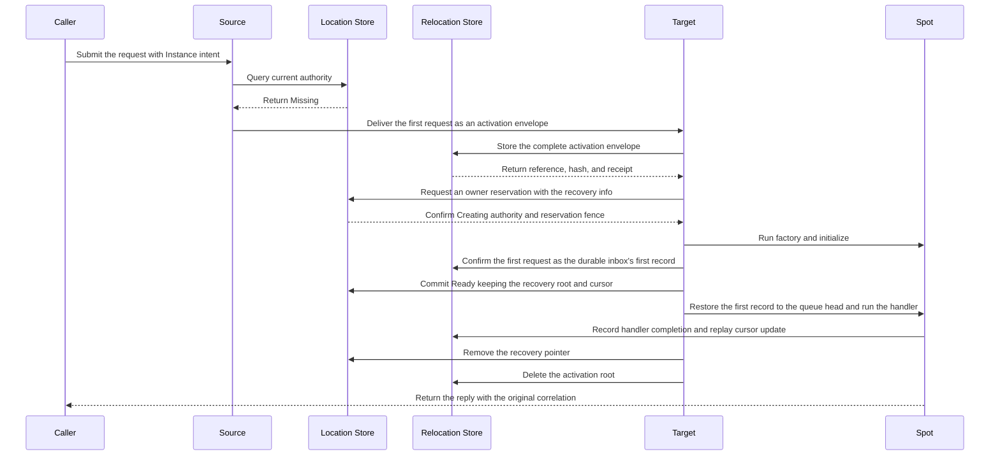

# Spot Address Messaging

[Spot And Actor topic index](README.en.md) · [Spec table of contents](../README.en.md) · [Previous: 05. Spot And Actor Membership](05-spot-actor-membership.en.md) · [Next: 07. Stage Wrapper On Spot](07-stage-wrapper-on-spot.en.md)

> Defines how to create and look up a global SpotId, how to call a
> [Spot](../00-foundation/02-glossary.en.md#spot) — a logical instance with an address and
> state, reachable by the same global Spot ID even when its executing node
> changes — directly by that SpotId, and the cold
> activation procedure that creates an
> [Instance Spot](../00-foundation/02-glossary.en.md#entry-spot-user-spot-and-instance-spot) for the
> first time via a message.

## 1. Overview of Spot Address Messaging

User Spot and Instance Spot use the same logical address and placement
lifecycle. Only User Spot supports
[Actor membership](../00-foundation/02-glossary.en.md#actor-membership) — the relationship
that says which Entry Spot or User Spot an Actor currently belongs to.

| Party | Responsibility |
|---|---|
| Core | Provides only raw sockets and transport. It doesn't interpret [Spot kind](../00-foundation/02-glossary.en.md#spot-kind) (the value that says whether a Spot is Entry, User, or Instance)/type, logical address, owner claim, generation, activation, or maintenance authority. |
| Framework | Manages target selection, Store transactions, route cache, and the activation barrier. |
| Application | Specifies a [Spot ID](../00-foundation/02-glossary.en.md#spot-id) (the global logical address that identifies a Spot)/stable type to call Create, GetOrCreate, or direct call. It doesn't specify the owner node or endpoint. |

This document alone owns the whole procedure for creating an Instance Spot
for the first time via a message
([cold activation](../00-foundation/02-glossary.en.md#cold-activation)) — other documents
only summarize this procedure and link to this document. The fields
and invalidation conditions of the positive route cache are owned by
[Spot/Actor Routing](08-routing.en.md); this document explains only as much
of that boundary as it needs (§7). The sequence by which an Actor joins a
User Spot, and the seal/commit/restore procedure for relocation, are owned
by [Spot And Actor Membership](05-spot-actor-membership.en.md); this document
explains only the message routing that interlocks with that procedure (§8).

## 2. Spot ID and SpotRef

User and [Instance Spot](../00-foundation/02-glossary.en.md#entry-spot-user-spot-and-instance-spot) are
identified by a Spot ID unique across the whole
[Location Store](../00-foundation/02-glossary.en.md#location-store) namespace — the store that keeps
each Spot's current owner, ObjectGeneration, and lifecycle state so multiple nodes can check them
together.

- **A Spot ID is a string compared byte-for-byte, case-sensitive, UTF-8 encoded, 1..255 bytes.**
- **A Spot ID isn't transport routing identity.** Only the `NodeRid` of a
  [MeshNode](../00-foundation/02-glossary.en.md#meshnode) — a runtime node that sends or
  receives messages within a [RouteMesh](../00-foundation/02-glossary.en.md#routemesh), the
  connection topology multiple MeshNodes participate in — uses Core's
  `RoutingId`. The framework doesn't convert a Spot
  address into a Core routing ID, or infer an owner node by parsing the Spot
  ID string. It queries current authority from the Location Store and uses
  that result's `NodeRid` as the transport route.
- On the service wire, the Spot ID and fields derived from source/target
  Spot ID are encoded as `text8` or `optional-text8`. Only the Node RID
  field uses `rid` or `optional-rid` encoding. The framework doesn't
  automatically decode a previous binary Spot address or convert it into a
  base64 or replacement-character string.
- Invalid UTF-8, 0-byte, and 256-byte-or-more values are rejected as a
  protocol or configuration failure before application admission and Store
  mutation.

[`MeshName`](../00-foundation/02-glossary.en.md#meshname) — the name that identifies one
RouteMesh physical connection group — is only used to decide where to first place a
[Spot](../00-foundation/02-glossary.en.md#spot) and isn't part of Spot identity. So the
same Spot ID can't be used concurrently with a different `MeshName`,
[Spot kind](../00-foundation/02-glossary.en.md#spot-kind), or stable type.

A User/Instance Spot type is a case-sensitive stable name, UTF-8, 1..255
bytes. The framework doesn't apply normalization or case folding, and does
not use a language class FQN as Store or wire identity. Registering the same
[stable type](../00-foundation/02-glossary.en.md#stable-type) twice on the same Object
Server is a startup error.

### 2.1 Entry Spot ID

The Entry Spot ID is issued by the framework, and the caller doesn't
specify it as a create target. The format
`<diagnostic-prefix>-entry-<lowercase-canonical-uuid-v4>` is reserved for a
Framework-issued Entry Spot ID. The UUID part is an RFC 4122 UUID v4 value
generated separately from the MeshNode RID.

**If a caller-specified User/Instance Spot ID matches this reserved format,
it's rejected with `InvalidOperation` before starting a Location Store
reservation or factory.** A User/Instance Spot's generic `Reserve` also
checks the same global namespace, so an active Entry Spot ID can't be used
as caller-created Spot authority. The framework doesn't compute a MeshNode
relationship from the Spot ID string — it uses the Entry Spot ID
mapping the MeshNode descriptor published.

The Entry Spot ID is kept for the same Object Server lifecycle. Even on a
replacement lifecycle at the same endpoint, a new MeshNode RID and a new
Entry Spot ID are each issued. The framework doesn't build the Entry Spot
ID by concatenating the full MeshNode RID.

The Object Server descriptor's `NewClaim` creates, in one Location Store
transaction, the `(MeshName, NodeRid)` descriptor identity and the
`EntrySpotId`'s global Spot identity claim, linked to the owner lease
and lifecycle. If either conflicts with an active claim, it changes neither
descriptor, Entry claim, nor index at all, and returns a startup
configuration error at the first claim. It doesn't create a second Entry
UUID or claim.

[Descriptor](../00-foundation/02-glossary.en.md#descriptor) remove and owner cleanup — a
descriptor being the registration record a remote runtime publishes so its endpoint, identity,
and status can be discovered — release the linked Entry claim in the
same transaction only if the stored descriptor's owner lease and
lifecycle match the request. Stale cleanup from a previous lifecycle can't
delete a replacement lifecycle's descriptor or Entry claim. `EntrySpotId` is
included in the descriptor's immutable fields and immutable digest, and
can't be changed by `Renew` or a mutable descriptor update.

### 2.2 SpotRef

`SpotRef` is an unchangeable snapshot representing the location at lookup
time.

```text
SpotRef                              // contract pseudocode, not an actual API.
  SpotId        global Spot ID
  ObjectGeneration  non-zero unsigned 63-bit  // represented as a decimal string in JSON.
  MeshName      the placement Mesh at lookup time
  NodeRid       the owner node at lookup time
```

`SpotRef` isn't a messaging target or
[owner](../00-foundation/02-glossary.en.md#owner) capability. If the owner moves,
`MeshName` and `NodeRid` may differ from the current location. If the
application needs to confirm the current location, it re-queries by
[Spot ID](../00-foundation/02-glossary.en.md#spot-id). `SpotHandle`, a separate resolver
handle, and `InstanceSpotAddress` aren't provided.

### 2.3 Instance Spot

Instance Spot is a Spot with no
[Actor membership](../00-foundation/02-glossary.en.md#actor-membership). It can use a direct
packet handler, timer, and outbound call, but can't use Actor
create/join/leave/relocation or
[Logical Multicast](../00-foundation/02-glossary.en.md#logical-multicast) subscription — the way
of delivering one message to multiple Spots of the same Channel by ChannelName and topic.

## 3. Explicit User Spot Creation — Create and GetOrCreate

The Spot manager's `Create` and `GetOrCreate` only explicitly create a User
Spot.

| Operation | Identity the caller specifies |
|---|---|
| `Create` | The caller specifies the required stable type, and the framework builds the global Spot ID. |
| `GetOrCreate` | The caller specifies both the global Spot ID and stable type. |

**A manager overload that takes the Instance Spot kind, and an Instance-Spot-only
create operation, aren't provided.** Neither operation takes a target node
or endpoint, and both are fluent calls that can only be submitted once.

`InMesh`, an encoded creation request, and a timeout are optional. The
operations do not take a caller callback, target RID, or predicate. Setting the same
option twice, or running terminal submit twice, is `InvalidOperation`. When
terminal submit starts, one end-to-end deadline is fixed, applying across
resolve, reservation, factory, and the
[Ready](../00-foundation/02-glossary.en.md#ready) barrier — Ready being the state, reached once
Spot creation and the Location Store record finish, in which the Spot can receive application
messages.

The following .NET excerpt shows the two operations' identity input and
common optional values. It doesn't require the same signature in other
languages; the actual .NET contract is defined by the
[.NET Spot Interface](../languages/dotnet/interfaces/05-spots.en.md).

```csharp
public interface IZLinkSpotManager
{
    IZLinkSpotCreateCall Create(string spotType);
    IZLinkSpotGetOrCreateCall GetOrCreate(
        string spotId,
        string spotType);
}

public interface IZLinkSpotGetOrCreateCall
{
    IZLinkSpotGetOrCreateCall InMesh(string meshName);
    IZLinkSpotGetOrCreateCall Request<TRequest>(TRequest request);
    IZLinkSpotGetOrCreateCall Timeout(TimeSpan timeout);
    ValueTask<ZLinkSpotCreateResult> Async(
        CancellationToken cancellationToken = default);
}
```

```csharp
ZLinkSpotCreateResult result = await spotManager
    .GetOrCreate(roomId, "room")  // The caller specifies the global Spot ID and stable type together.
    .InMesh("world")              // Only restricts the initial placement Mesh.
    .Timeout(TimeSpan.FromSeconds(5))
    .Async(cancellationToken);    // Returns Existing, Created, or Rejected.
```

### 3.1 Mesh and Capacity Selection

If `InMesh` is specified, that Mesh is used. If omitted, it's auto-selected
when there is exactly one object-Client-or-Server-role Mesh. With 0
candidates, `NotConfigured`; with two or more, `InvalidOperation`; if the
specified Mesh doesn't exist, `NotFound`. The framework checks role,
stable-type capability, and active/pending capacity first, then selects
among the remaining candidates by node-wide placement weight.

An encoded creation request is at most 1 MiB. The framework records an
unchangeable content reference and hash into the creation intent before
reservation, and keeps it until the Spot becomes
[Ready](../00-foundation/02-glossary.en.md#ready) or a failed creation is cleaned up. Only
the target that obtained creation authority delivers the request to the
[factory](../00-foundation/02-glossary.en.md#factory). **Since the factory can run more
than once per `(SpotId, ObjectGeneration, creation attempt)` — where
[ObjectGeneration](../00-foundation/02-glossary.en.md#objectgeneration) is the number that
distinguishes different logical incarnations of the same ActorId/Spot ID — it must safely
handle re-execution with the same input.**

### 3.2 Convergence of Concurrent Requests

`Create` issues a lowercase canonical UUID v4 string as the automatic global
Spot ID. On conflict with active
[authority](../00-foundation/02-glossary.en.md#authority), it returns a terminal
completion of `AlreadyExists` without generating a new UUID or reservation.
If the same caller Spot ID's kind or stable type differs, it's
`TypeMismatch`.

`GetOrCreate` returns a Ready object of the same User Spot type as
`Existing`. A different operation observing an in-progress Creating attempt
doesn't start a new reservation or factory — it waits for the authority
change. If the earlier attempt ends Ready, it returns `Existing` and that
incarnation's `SpotRef`. If it becomes Missing via rejection/failure
cleanup, it competes for a new reservation within the remaining deadline,
and the winner runs factory and callback with its own creation request. A
different operation doesn't share an earlier attempt's `Rejected` state or
application reply. Only a redelivery of the same operation ID resends the
retained terminal result. If authority doesn't change to Ready or Missing
by the [deadline](../00-foundation/02-glossary.en.md#deadline), the operation
ends with [`DeadlineExceeded`](../00-foundation/02-glossary.en.md#timed-out) — the Framework
exception raised when an operation's completion condition isn't met by its
allowed deadline — and the next call re-checks the Store's current authority.

The terminal result returns that attempt's `SpotRef`, the
`Existing`/`Created`/`Rejected` state, and an optional creation reply
together.

| State | Meaning |
|---|---|
| `Existing` | A Ready incarnation of the same stable type was used and the factory callback wasn't run. There is no application reply. |
| `Created` | A new incarnation was committed as Ready. A reply the callback built can optionally be included. |
| `Rejected` | The application create callback declined, cleaning up reservation and authority. `SpotRef` identifies the declined attempt and doesn't guarantee the current Ready location. A reply the callback built can optionally be included. |

The reply is the opaque framework message the create callback returned.

### 3.3 Remote User Spot Creation — Commands 47 and 20

If the owner is a different MeshNode, the source builds a generic
reservation in the [Location Store](../00-foundation/02-glossary.en.md#location-store),
then sends command 47 `userSpotCreate` to the selected target. This command
includes the following values.

- A correlation linking the reply to the original request
- An operation ID ensuring the terminal result is only built once
- Source node RID and lifecycle generation
- The global Spot ID and stable type
- A provider-issued reservation fence
- One deadline applying across the whole create

The [reservation fence](../00-foundation/02-glossary.en.md#reservation-fence) includes the
expected `StoreVersion`, `ObjectGeneration`,
[`AuthorityOwnerGeneration`](../00-foundation/02-glossary.en.md#authority-owner-generation) — the
provider-issued value that marks the order in which the authority owner changed for the same
object incarnation — target node RID and
[lifecycle generation](../00-foundation/02-glossary.en.md#lifecycle-generation), target
owner lease, and pending capacity delta. Creation request bytes aren't
resent as command payload. The target only runs factory and initialize
after reading reference, hash, and encoded size directly from the
Location Store's Pending creation projection and confirming the creation
content is unchanged.

The target returns the result of committing the same reservation exactly
once via command 20 `reply`. The reply's `correlation`, `terminalResult`,
`failureCode`, and operation-specific tail order don't change. The success
tail includes `Existing`/`Created`/`Rejected` and the `SpotRef`.
`Existing` has no application reply; `Created` and `Rejected` can optionally
include a reply the callback built. The source doesn't use a Location row
lookup result as the current call's terminal reply, and can't build create
control from an application packet instead.

### 3.4 Find and Query

The manager's `Find(SpotId)` returns the current Ready authority's
`SpotRef` and doesn't start creation. Beyond the manager's current-Spot
query and an operational query bounded to page size 1..1000 and encoded at
most 4 MiB, an unbounded list or separate resolver isn't provided.

## 4. Cold Activation — How to Create an Instance Spot for the First Time via a Message

By default, a [Spot direct](../00-foundation/02-glossary.en.md#spot-direct) call — one that sends a
send/request to a Spot by specifying a single global Spot ID — only calls an
already-existing Spot. A send/request that doesn't specify Instance Spot intent on the call builder
doesn't run a factory or create a creation intent, even if the RID is
Missing.

The following .NET excerpt shows the difference between a regular direct
call and a call allowing cold activation. It doesn't require the same
signature in other languages; the actual .NET contract is defined by the
[.NET Spot Interface](../languages/dotnet/interfaces/05-spots.en.md).

```csharp
public interface IZLinkSpotClient
{
    IZLinkSpotRequestCall RequestToSpot<TRequest>(
        string spotId,
        TRequest request);
}

public interface IZLinkSpotRequestCall
    : IZLinkMetadataCall<IZLinkSpotRequestCall>
{
    IZLinkSpotRequestCall InstanceSpot(); // Auto-selected only if exactly one type is registered on the Mesh.
    IZLinkSpotRequestCall InstanceSpot(string instanceSpotType);
    // Specifies the Mesh to first create a Missing Instance Spot on.
    // Can be omitted if there's one candidate Mesh; InvalidOperation if omitted with two or more.
    IZLinkSpotRequestCall InMesh(string meshName);
    IZLinkSpotRequestCall Timeout(TimeSpan timeout);
    ValueTask<TReply> Async<TReply>(
        CancellationToken cancellationToken = default);
}
```

```csharp
var reply = await spotClient
    .RequestToSpot<CartRequest>(cartId, request)
    .InstanceSpot("shopping-cart") // If Missing, prepares it with this stable type.
    .InMesh("commerce")            // Doesn't change an Existing owner's current Mesh.
    .Timeout(TimeSpan.FromSeconds(5))
    .Async<CartReply>(cancellationToken);
```

The process of newly creating an Instance Spot when the Location Store's
authority is `Missing`, and preparing it to process the first message, is
called [cold activation](../00-foundation/02-glossary.en.md#cold-activation). To allow
cold activation, specify Instance intent on the same
[Spot direct](../00-foundation/02-glossary.en.md#spot-direct) call builder.

The builder provides both a form omitting stable type and one specifying
it. `InMesh` can only be used on a call with
[Instance intent](../00-foundation/02-glossary.en.md#instance-intent) specified, and
selects the Mesh to first place a Missing Spot on. It isn't an option that
moves an Existing Ready owner to a different Mesh or restricts current
placement.

### 4.1 Procedure — From Resolve to Activation

The terminal call doesn't split into a separate check and send — it
performs resolve and activation in the following order.

1. Queries the global Spot ID's current authority.
2. If Ready authority exists, sends to the current owner using the stored
   kind and stable type.
3. If authority is Missing and there is no Instance intent, ends with
   `NotFound`.
4. If authority is Missing and there is Instance intent, selects an
   eligible Object Mesh. If `InMesh` is omitted and there are 0 candidates,
   `NotConfigured`; with two or more, `InvalidOperation`.
5. If stable type is specified, only uses serving nodes with that
   capability as candidates. If no node provides that type, `NotFound`.
6. If stable type is omitted, computes the distinct Instance types
   registered in the selected Mesh's serving descriptor. If exactly one,
   auto-selects it; with 0, `NotFound`; with two or more, `InvalidOperation`
   for omitting the required type.
7. If no node providing the selected stable type has remaining capacity,
   `CapacityExceeded`.
8. The source puts the following values into one activation envelope and
   sends it to the target — the global Spot ID, the selected Mesh/stable
   type and target descriptor fence, source node RID/lifecycle
   generation/optional source Spot ID, operation identity/reply
   correlation/deadline, whether command 39's optional metadata is present
   and the metadata frame, and the first application message. At this
   point the source doesn't register itself or the target as owner.
   - Command 39's route kind `1` uses the generation fence of an
     already-Ready authority.
   - Missing cold activation uses route kind `2` and only delivers target
     Mesh/node RID/lifecycle, Spot ID, stable type, descriptor version, and
     deadline. It doesn't include a not-yet-existing authority generation.
   - Route kind `2`'s deadline must match the deadline of the
     `instance-activation-recovery-v1` recorded in the Relocation Store.
   - Both cold-activation send and request use a non-zero operation
     identity preventing duplicate execution, and the metadata flag and
     ZLIA metadata presence must also match.
9. The target checks the Location Store's current owner record together
   with its own Spot list. If it's the current owner and a Spot of the
   same generation already exists, it puts the first message into that
   Spot's existing queue. Even if a Spot exists in its own list, if the
   Store points to a different owner or generation, it's judged stale and
   the message isn't run.
10. If the Store has no owner and the target also has no currently usable
    Spot, the target stores the complete
    [activation envelope](../00-foundation/02-glossary.en.md#activation-envelope) in the
    Relocation Store as an unchangeable recovery root. After confirming
    reference, SHA-256, encoded size, and retention, it requests, via
    `Reserve`, permission to create this Spot itself. The Location Store
    re-checks the target's lifecycle, owner lease, type, and remaining
    capacity. If conditions are met, it changes object state from
    `Missing` to `Creating` (the `Missing → Creating` transition). In the
    same transaction it records the recovery receipt, provider-issued
    reservation fence, and in-progress creation capacity.
11. Only the target that succeeds this reservation runs factory and
    initialize. Handler execution is blocked by a barrier until the first
    message is confirmed as the first record of the durable activation
    inbox (an internal confirmation condition — no handler runs before the
    durable record). `Commit` for the same reservation publishes a `Ready`
    authority keeping the recovery root and replay cursor, and publishes
    active capacity. The runtime restores the first record to the head of
    the local queue, then opens the barrier. A subsequent message can't
    overtake this record, and the source doesn't resend the same message
    after readiness is confirmed.
12. Only after durably recording the first handler's completion and
    updating the [replay cursor](../00-foundation/02-glossary.en.md#replay-cursor) to
    that inbox sequence is the recovery pointer removed via an
    expected-version `Preserve` CAS. The pointer isn't removed merely
    because it was put on the queue. Once the CAS succeeds, the Relocation
    Store's root is deleted idempotently.



This diagram shows the normal flow of a request where the Location Store has
no owner and the selected target obtains creation authority. If a Ready
owner already exists, the factory isn't run — the request is put on the
existing Spot queue. If a different target obtained creation authority
first, the current target doesn't create the Spot. Once the authorized
target's Spot becomes Ready, the first request's identity and deadline are
preserved and it's delivered exactly once to the current owner.

### 4.1.1 If the Target Process Terminates During Activation

**If the target process terminates after `Reserve`, the startup complete
authority scan re-reads the Pending creation information.** It either
continues factory, initialize, and durable inbox restoration with the same
reservation and generation, or aborts creation with the same fence.

**If the process terminates after the `Ready` commit but before restoring
the queue head, the recovery root and cursor are used to restore the first
record first.** The Serving gate that lets that owner receive application
messages isn't opened until this restoration finishes — meaning the
barrier defined by §4.1 step 11 above applies again in the same order after
a restart.

### 4.2 When Several Nodes Receive the First Message at Once

Even if several [MeshNode](../00-foundation/02-glossary.en.md#meshnode)s register the
same stable Instance type, it's treated as one type with multiple
placement candidate nodes. Even if concurrently sent first messages arrive
at different targets, only the target that obtains creation authority in
the Store runs the factory. The other targets don't create a local Spot.

If the authorized Spot is already Ready, the first operation's identity,
payload, reply correlation, and deadline are preserved and delivered
exactly once to the current owner. If still `Creating`, it waits for the
same activation's completion. If the existing authority is a User Spot or
differs from the stable type specified in the builder, it's
`TypeMismatch`. A regular direct call with no type specified to an
existing Instance Spot uses the type stored in authority, so it can be sent
regardless of the number of registered types.

## 5. Direct Call to an Existing Owner and the Completion Boundary

Spot direct send/request's starter method only takes a global Spot ID and
typed payload. The framework resolves the current Ready Spot and owner
route from the positive route cache or the Location Store. The fields,
lifetime, and invalidation conditions of the cache are owned by
[Spot/Actor Routing](08-routing.en.md).

The `ObjectGeneration` confirmed while resolving is recorded in the route
snapshot but isn't used as an application message's target-match
condition. A local and remote owner have the same handler, metadata, and
completion meaning. A direct call with no Instance intent is an
existing-only operation, targeting only an already-existing Ready Spot.

- **If close and recreate happened on the same owner after resolve, the
  current Ready Spot at the moment the target queue accepts it processes
  the message.**
- **If the resolved owner no longer owns that SpotId, the current operation
  ends with a stale-route error.** The framework doesn't automatically
  resend the same operation after finding a fresh owner.
- **After a timeout, cancellation, disconnect, or a failure whose execution
  status is unclear, it isn't automatically resubmitted to a different
  owner.**

A one-way call only waits up to local outbound admission. Even if cold
activation is needed, it doesn't wait for application handler execution.
Here, outbound admission is the moment the activation envelope is accepted
by the selected target transport — it doesn't mean reservation or Ready
commit completion. A request completes terminal-once, within one deadline,
across resolve, cold activation, first-message dispatch, and reply. A
failure after target queue admission isn't hidden-retried by re-finding
the current owner.

## 6. Route Cache Figures and Message Follow

`RouteCacheMaxAge` defaults to 15 seconds and `MessageFollowDuration`
defaults to 30 seconds. Setting either to 0 turns off cache or
[Message Follow](../00-foundation/02-glossary.en.md#message-follow) respectively —
Message Follow being the behavior that, after an Actor/Spot relocates to another MeshNode,
still delivers a message that arrived at the previous owner on to the new owner. If both
values are positive, cache max age must be at
least 5 seconds shorter than Message Follow duration. A runtime change only
applies to new cache entries and new relocations. The positive Ready cache
is only used within the current owner lease's local admission deadline and
this `RouteCacheMaxAge`.

After a relocation commit, the source only uses the committed
source→target Message Follow route to deliver a message arriving on the
previous physical route to the current owner. During Message Follow, it
doesn't read the Store or run an application handler. The Message Follow
route verifies that Spot ID,
[ObjectGeneration](../00-foundation/02-glossary.en.md#objectgeneration), source and
target AuthorityOwnerGeneration, and owner fence all match. Target owner generation
increases per hop, up to 8 hops.

One Message Follow route's queue has no bound on either message count or
stored size, and it respects the negotiated message bound. Message
Follow preserves the original operation ID, generation, payload, and reply
route. A missing or expired route, or a loop, ends with `Unavailable`; a generation
mismatch is `InvalidOperation`. A failed application operation isn't
resubmitted to an owner found in the Store — only the next call performs a
fresh resolve.

This generation check confirms the relocation route belongs to the same
incarnation. Spot direct send/request's target is `SpotId`, and an
`ObjectGeneration` mismatch doesn't reject running the current Ready
Spot's handler.

### 6.1 Route Installation for SpotWide and PerActor

`SpotWide` User Spot relocation installs the Spot's and member Actors'
Message Follow routes in the same aggregate commit. An individual
participant route isn't published as the current route before commit.

`PerActor` User Spot relocation separates the Spot's and Actor's Message
Follow routes. After the Spot authority commit, `ToSpot`, Actor Create, and
Join go to the target. An Actor still on the source keeps its `ToActor`
route pointing at that Actor's current owner. A per-Actor source→target
Message Follow route is installed each time an Actor moves.

The seal/commit/restore order for the whole relocation procedure is owned
by [Spot And Actor Membership](05-spot-actor-membership.en.md). This
document explains only the message routing that interlocks with that
procedure.

- **After a relocation unit is sealed, ingress arriving on the source route
  is kept in the relocation hold, and no application handler runs for it.**
- **If the operation explicitly aborts before relay-ready is accepted, the
  held ingress returns to the source queue in arrival order.** Afterward,
  source isn't restored regardless of the cutover-submit result — the
  operation ID, generation, and reply route are preserved as they are and
  relayed to the target via the Message Follow route.
- **A `Relocating` unit that is waiting for a permit hasn't been sealed
  yet.** So it continues accepting application messages and timers on its
  existing [owner route](../00-foundation/02-glossary.en.md#owner-route).

## 7. Close and the Generation Boundary

The Spot manager's public `Close` takes a User Spot's `SpotRef`. For
Instance Spot, an application handler or timer requests local `Close` from
its own lifecycle context. Host shutdown and `Relocate` can clean up or
move an Instance Spot via a separate operational lifecycle.

The close procedure proceeds in the following order.

1. Verifies expected owner and ObjectGeneration and transitions authority to
   `Closing`.
2. Seals local admission and processes turns/timers accepted before the
   seal up to a set boundary.
3. Cleans up handler scope, timer, and local activation resource, once.
4. Releases authority with the same owner/generation fence.

If that incarnation no longer exists, idempotent `false`; if a different
generation of the same Spot ID exists, `InvalidOperation`; if sealing for a
move, `Unavailable`. The framework doesn't re-find the current ref and
close a new incarnation. An operation accepted before the seal can complete
on the existing generation, but an operation after the seal ends with a
closing or stale result.

**If even one current Actor membership remains on a User Spot, Close ends
with `false` and keeps admission and authority.** The framework doesn't
secretly move or destroy a member Actor.

### 7.1 Remote Close — Commands 48 and 20

When closing a remote owner, the source sends command 48 `userSpotClose` to
the current owner. The request includes correlation, an operation ID
ensuring the terminal result is only built once, source node RID and
lifecycle generation, the `SpotRef`, target node RID and lifecycle
generation, expected `AuthorityOwnerGeneration`/`StoreVersion`, and one
deadline.

The target first verifies the peer identity and target lifecycle confirmed
at service admission, and reads the current User Spot
authority directly from the store. Only then does it check object generation, owner generation,
`StoreVersion`, active Actor membership, `Closing`, and relocation state,
all together, before starting the Closing CAS and local admission seal.

Command 20's close-success tail is a single `closed` bool. `false` is only
used when the same incarnation no longer exists, or authority was kept due
to active membership. Stale generation and a moving conflict are typed
failures. The source doesn't re-find the current ref to switch the target
to a different incarnation, and doesn't use a Location row lookup as
completion.

## 8. Maintenance Materialization — Moving a Spot Owner

Moving an already-existing Spot owner only starts via an explicit host
`Relocate` transaction. The
[Object Server](../00-foundation/02-glossary.en.md#object-client-and-object-server-role) factory must choose one
of `DisableRelocation`, `RecreateOnRelocation`, or `PreserveStateWith`. An
omission overload or compatibility default isn't provided.
`PreserveStateWith` requires a `SpotRelocationAdapter` matching the Spot
type. The adapter captures/restores an opaque byte sequence whose format
and version the application manages.

A `PerActor` User Spot only allows `RecreateOnRelocation` and doesn't use
a Spot adapter. The target Spot shell keeps the same public SpotId and
ObjectGeneration, but isn't exposed to resolver and application handlers
before the Location Store authority changes to the target. It doesn't
create a temporary public SpotId or change SpotId after creation.

The source seal, durable capture, target reservation/factory/restore,
authority commit, and admission order are set by
[Spot And Actor Membership](05-spot-actor-membership.en.md).

- **Only an explicit failure before relay-ready is accepted keeps the
  source.** Afterward, source isn't restored regardless of the
  cutover-submit result, and the procedure continues only on the same
  target process selected earlier. If the target process
  terminates, a different target isn't selected and relocation isn't
  automatically resumed.
- **Not-yet-executed messages at seal time, the accepted journal, and
  timer logical registration/pending tick are included in the relocation
  payload, and the target framework automatically restores timers.** The
  application doesn't re-register framework timers in `Restore`.
- This queue/timer rule applies to `SpotWide` and Instance Spot. In
  `PerActor`, only the Actor queue and Actor timer move with the Actor —
  a Spot-level application timer doesn't move.

The original send/request isn't automatically resubmitted as a new
operation to the maintenance target, but the source ingress hold after
seal is relayed via the committed Message Follow route.

## 9. Failure and Observability

| Condition | Outcome |
|---|---|
| Create and cold activation with no or multiple object-role Mesh candidates | Ends with a §3/§4 typed error (`NotConfigured`/`InvalidOperation`/`NotFound`). |
| No Ready authority | `NotFound`. |
| The generation of a control addressed by `ActorRef`/`SpotRef` differs from the current generation (a direct message doesn't compare generations, per [08-routing §2.6](08-routing.en.md#26-where-objectgeneration-is-used-and-where-its-not)) | `InvalidOperation`. |
| The [owner fence](../00-foundation/02-glossary.en.md#owner-fence) differs | `Unavailable`. |
| New admission requested on a `Closing` or `Draining` owner | Rejected. |
| Ingress arrives on the source route after a relocation seal | Not rejected — retained in the relocation hold. |
| A message arrives at a `Relocating` unit not yet sealed | Accepted, keeping existing owner admission. |
| A request failed | Not bypassed by a different Spot ID, MeshName, or owner. |
| Owner is expired | Can't perform new message/timer admission or a location update. |

Observability information distinguishes the global Spot ID, current
[MeshName](../00-foundation/02-glossary.en.md#meshname), ObjectGeneration, resolve/cache
result, creation attempt, cold activation/close/maintenance operation kind,
and Message Follow hop/drop and stale classification. Spot ID isn't used
as a metric label.

## 10. Implementation and Contract-Test Verification Requirements

Only the public surface (the Spot manager's
`Create`/`GetOrCreate`/`Find`/`Close`, the Spot direct call builder's
Instance intent/`InMesh`, `SpotRef`, the wire tail of commands 47/20/48,
and return values and typed errors) is used to confirm the following. Each
item maps to one contract test.

**Spot ID and the reserved format**

- Spot ID is a global key across the whole Store namespace and doesn't
  allow duplication per MeshName.
- If a caller specifies a User/Instance Spot ID in the reserved
  `<prefix>-entry-<lowercase-canonical-uuid-v4>` format, it's rejected
  with `InvalidOperation` before Store reservation and factory execution.
- User Spot `Create` issues a lowercase canonical UUID v4 string and does
  not generate a second UUID on an active conflict.
- Entry Spot join and placement use the descriptor's lifecycle
  mapping and don't parse the Spot ID string.

**Convergence of Create and GetOrCreate**

- User Spot Create/GetOrCreate don't require target RID and endpoint from
  the application.
- The Spot manager doesn't provide Instance Spot create/get-or-create.
- Concurrent create converges to one authority attempt and factory
  execution.
- Remote User Spot create fixes provider reservation and target lifecycle
  in command 47, reads Pending creation content directly from the store, and
  returns the terminal result exactly once via command 20.
- `SpotRef` preserves the public generation but isn't used as a
  messaging target.

**Direct call and cold activation**

- The Spot direct starter method only takes a Spot ID and doesn't require
  an owner route.
- A Missing Spot message with no Instance intent doesn't create a
  creation intent.
- Instance intent only starts cold activation on a Missing Spot, using
  optional initial Mesh and stable type.
- If the selected Mesh has exactly one distinct Instance type, it's
  auto-selected; with multiple, type specification is required.
- The cold-activation source doesn't create an owner claim — it submits
  the activation envelope, including the first message, to the target.
- Only the target that obtained creation authority records itself as owner
  and runs the factory, and the first message of cold activation is
  always processed first among the messages that Spot handles.
- A message isn't delivered to a local instance that doesn't match the
  Store's current authority. A target that didn't obtain creation
  authority doesn't create a separate instance.

**Route cache and Message Follow**

- `Missing`, `Creating`, and Store failure aren't negative-cached.
- Message Follow only uses a committed route. Its relay queue has no
  relocation-specific item-count or byte bound, and it preserves
  operation identity.

**Close**

- Close checks that the generation matches and doesn't retarget to a new
  incarnation.
- User Spot Close doesn't secretly clean up active membership.
- Remote User Spot Close fixes the `SpotRef`, owner generation,
  `StoreVersion`, and target lifecycle in command 48, and doesn't use a
  Location row lookup or application control packet as completion.

**Cross-language consistency**

- C++, .NET, JVM, and Node.js provide the same terminal results for create
  competition, logical messaging, cold activation, close, and Message
  Follow.

---

[Spot And Actor topic index](README.en.md) · [Spec table of contents](../README.en.md) · [Previous: 05. Spot And Actor Membership](05-spot-actor-membership.en.md) · [Next: 07. Stage Wrapper On Spot](07-stage-wrapper-on-spot.en.md)
</content>
