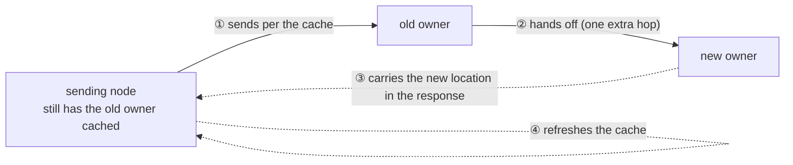
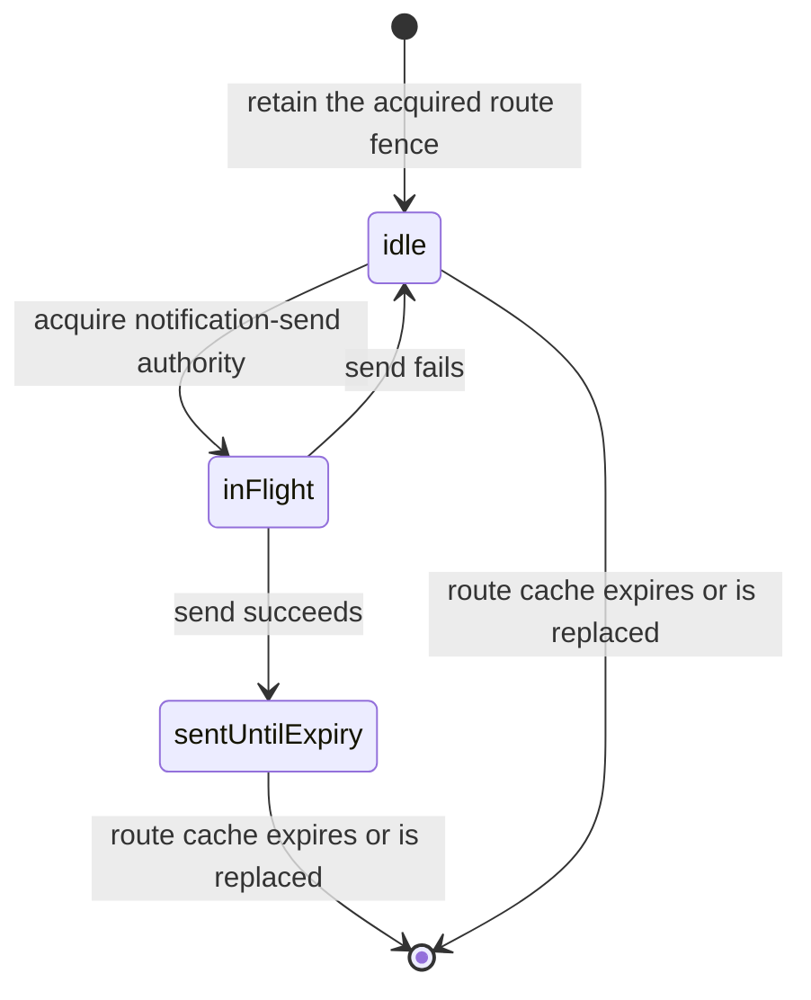

# Spot/Actor Routing

[Spot And Actor topic index](README.en.md) · [Spec table of contents](../README.en.md) · [Previous: 07. Stage Wrapper On Spot](07-stage-wrapper-on-spot.en.md) · [Next: 09. Object Kind And Activation](09-object-lifecycle.en.md)

> This document defines the path a message sent to a global SpotId/ActorId takes to find
> the current owner and arrive, the path to an Actor bound to a Session, and the path a
> request's reply travels back. It also covers how often location is looked up, and when
> the cache is used and invalidated.
>
> **Merge scope** — This document absorbs only §1, §1.1, and §2 (the positive route cache
> itself, the resolver result type, cache lifetime, and relocation cache invalidation) of
> [45. Target Selection And Route Cache](08-routing.en.md). §3–§7 of
> that same document (the Channel target-selection algorithm, candidate cache, smooth
> weighted round-robin, direct-specification rule, and publish fanout) are owned not by
> this topic but by 02-channel-transport and 12-spot-messaging, and remain in place at
> [45. Target Selection And Route Cache](08-routing.en.md).

## 1. Which Message Uses Which Route

A logical instance that has an address and state, and that keeps answering to
the same global ID even when the node running it changes, is called a
[Spot](../00-foundation/02-glossary.en.md#spot). Not every path that sends a message to a
Spot/Actor queries the [Location Store](../00-foundation/02-glossary.en.md#location-store) —
the store that lets multiple nodes jointly confirm each Spot's current owner
and state. The framework decides the route based on how the message started,
as follows.

```text
+----------------------------------------------------------------------+
| Route source by message path                                         |
|                                                                      |
| Spot / Actor direct : Ready cache -> Store on cache miss             |
| Session -> Actor    : Stored binding route                           |
| Request reply       : Preserved reply route + correlation            |
|                                                                      |
| Only direct resolution reads the Location Store.                     |
+----------------------------------------------------------------------+
```

The three paths in the diagram above work as follows.

- If the application specifies a [Spot ID](../00-foundation/02-glossary.en.md#spot-id) — the
  global logical address that identifies a Spot — or Actor ID, the framework
  finds the current owner. If it has a recently confirmed
  [Ready](../00-foundation/02-glossary.en.md#ready) route — meaning creation,
  initialization, and the Location Store record are done and the object can
  receive messages — it uses that; otherwise it queries the Location Store.
- When relaying to an Actor bound to a Session, the route stored on the Session
  owner at successful bind time is used. Actor location isn't re-queried per
  message.
- A request's reply uses the return route and correlation included in the
  request. It doesn't query the requester's Spot/Actor location to send the
  reply.

This document defines, in one place, how the three paths above obtain and
verify a route and respond to location changes. It doesn't cover target
selection for [Node direct](../00-foundation/02-glossary.en.md#node-direct) — a caller
specifying both a MeshName and a target RID to send to one specific MeshNode
— Channel select-one, or Logical Multicast. Object
create/get-or-create, and close/destroy and membership transactions using an
`ActorRef`/`SpotRef`, are also each defined by its own lifecycle
document.

## 2. How to Send to a Spot/Actor by Global ID

### 2.1 The Order for Finding the Current Owner

Sending a one-way message or request to one Spot by specifying a single global Spot ID
is called [Spot direct](../00-foundation/02-glossary.en.md#spot-direct). A Spot direct call
takes a global Spot ID, and an Actor direct call takes a global Actor ID. The
source runtime converts the ID into an actual owner route before submitting
the message.

```text
+----------------------------------------------------------------------+
| Direct resolution                                                    |
|                                                                      |
| Global SpotId or ActorId                                             |
|            |                                                         |
|            v                                                         |
| [Positive Ready cache] -- miss --> [Location Store]                  |
|            | hit                         | Ready authority           |
|            +-----------------------------+                           |
|                          |                                           |
|                          v                                           |
|                 [Owner route + route fences]                         |
+----------------------------------------------------------------------+
```

The source runtime proceeds in the following order.

1. Looks for a recently confirmed Ready owner route by global Spot ID or Actor
   ID.
2. If no usable recent route exists, queries the current object state from the
   Location Store.
3. If the object is Ready, records the owner's
   [`MeshName`](../00-foundation/02-glossary.en.md#meshname) — a name that identifies one
   physical connection group — and `NodeRid`, object generation, and owner
   fence in a route snapshot.
4. Submits the message via the selected owner route.
5. The target checks whether it's the current owner of the same logical ID,
   whether a current Ready object exists, and whether local admission is
   possible, then puts the message on the application queue. Object
   generation isn't checked as a target-match condition for the application
   handler ([§2.6](#26-where-objectgeneration-is-used-and-where-its-not)).

The current owner, incarnation, owner generation, and lease information the
Location Store records per global object is called authority. The framework
only uses the current Ready [authority](../00-foundation/02-glossary.en.md#authority) as
the route for an application message.

A Spot ID or Actor ID string doesn't contain an owner address. The framework
doesn't parse the ID to infer a node or convert it into a Core routing ID.
The MeshNode that currently runs an Actor or Spot and manages its application
queue is called the [Owner](../00-foundation/02-glossary.en.md#owner), and the caller
doesn't specify the following values as a message target.

- `MeshName`
- Owner `NodeRid`
- `ActorRef` or `SpotRef`
- The Actor's current Spot ID

### 2.2 The Condition for Using a Recent Ready Route

The source runtime can briefly keep a Ready owner route confirmed from the
Location Store. This is called the positive route cache. This information
isn't a separate authority replacing the Store's current authority — it's a
snapshot of a recent lookup result. Round-tripping to the Location Store per
message means most calls pay the cost of a hop to another process (such as
Redis) on every call; this cache reduces that cost.

| Item to check | Contract |
|---|---|
| Information kept in the cache | The [positive route cache](../00-foundation/02-glossary.en.md#positive-route-cache) keeps the global object ID, [`ObjectGeneration`](../00-foundation/02-glossary.en.md#objectgeneration) — a number distinguishing different incarnations of the same logical ID — [`AuthorityOwnerGeneration`](../00-foundation/02-glossary.en.md#authorityownergeneration) — a number marking the order in which the authority owner changed within the same incarnation — `StoreVersion`, owner lease, node lifecycle, and owner route. |
| Usable duration | The cache entry is used only until the earlier of the current owner lease's local admission deadline and `RouteCacheMaxAge`. |
| Reason it's kept | Caching only the route and dropping the fence would mean sending to a stale owner without knowing it — this is why the owner route and the fence values needed for the acceptance judgment are kept together. |
| Default setting | `RouteCacheMaxAge` defaults to 15 seconds. `0` means the route cache isn't used. |
| Results not stored | `Missing`, `Creating`, and Store failure aren't cached. A previous failure alone doesn't end the next call. Caching this state would turn a brief failure into an outage lasting as long as the cache lifetime. |
| Conditions for immediate invalidation | An entry is removed on confirming a larger `StoreVersion`, a stale-route result, a Store recovery event, owner-lease invalidation, or a **relay notification**. |
| Relay notification | [Message Follow](../00-foundation/02-glossary.en.md#message-follow) forwards a message that still arrives at the previous owner after an Actor or Spot has moved to a different MeshNode to the new owner, then notifies the original sending runtime. The notified runtime removes that entry and re-queries the owner on the next call. |
| Runtime setting change | A changed `RouteCacheMaxAge` applies starting from new cache entries. It doesn't extend an existing entry's lifetime to the new value. |

A relay notification is a framework-owned infrastructure record and doesn't
call an application handler. Losing the notification doesn't change
correctness — the same result is reached once the cache lifetime ends. The
notification is meant to shorten the window that flows through the bypass
path during the
[Message Follow duration](../00-foundation/02-glossary.en.md#message-follow-duration).

Whether the resolved owner still owns that object, and, if a new incarnation
was created under the same ID, which side processes the message, is set by
[§2.6](#26-where-objectgeneration-is-used-and-where-its-not).

The same handler, metadata, and completion contract applies to a local owner
and a remote owner.

**The resolver returns a lookup result as one of four closed results.**
Collapsing it into `null` or one "absent" value would make later stages guess
which state it was in again.

| Resolver result | Information preserved | Receiver of the result |
|---|---|---|
| `ReadyRoute` | Route and authority/owner-lease fences | Stored in the positive route cache and delivered to route admission. |
| `Missing` | The fact that no authority record exists | Delivered to the creation coordinator. |
| `Unavailable` | The fact that authority remains but the current owner can't be used | Delivered to the terminal completion mapper. |
| `StoreFailure` | The fact that authority presence couldn't be determined | Delivered to Store retry/reconciliation. |

Only `ReadyRoute` is stored in the positive route cache, and only `Missing` is
delivered to the creation coordinator. The resolver returns `Missing` only
after the lifecycle component that owns authority release completes that
release — without this order, an object still being cleaned up would look as
if it already didn't exist.

### 2.3 Preserving the Admission Fence Even for Manual Object Peer Connections

A Location Store object-peer descriptor contains an endpoint, RID, lifecycle
generation, and security identity. A manually configured endpoint supplies
only an intent to connect.

**When the runtime associates this endpoint with a descriptor and uses it as
an object peer, it must also pass all descriptor values the handshake needs
to transport.** The scope where multiple MeshNodes participate in exchanging
node and Channel messages is called a
[RouteMesh](../00-foundation/02-glossary.en.md#routemesh); its formal peer handshake
contract is owned by [RouteMesh topology](../02-channel-transport/01-channel-topology.en.md).

The JVM path passes these values in the following order. MeshNode startup
first registers a manual endpoint-only intent. When
`ZLinkFrameworkRuntime.connectManualObjectPeers`,
`ZLinkLocationAutoConnectHost.MeshNodeExecutor`, or
`ZLinkSpotRuntime.ensureManualObjectPeer` later finds a descriptor, it calls
`replacePeerConnection(endpoint, rid, lifecycleGeneration,
securityIdentity)`.

The replacement path installs the new intent only after transport liveness
confirms that the previous intent is closed. `ZLinkJavaRawMeshNode` retains
the intent, the observed peer routing ID, and the close state together while
processing the admission fence and liveness events. An endpoint-only intent
without a descriptor isn't used as placement evidence. A caller can't bypass
this procedure by directly setting the generation or security identity.

### 2.4 When There's No Object

A Spot direct call and Actor direct call with no Instance intent only target
an already-Ready object.

- A Missing Actor message doesn't create a new Actor.
- A Missing Spot message also doesn't create a new Spot by default.
- Only when Instance intent is specified on a Spot-specific fluent call can
  [cold activation](../00-foundation/02-glossary.en.md#cold-activation) of a Missing
  Instance Spot start.

Since `Missing`, `Creating`, and Store failure aren't cached, the next call
re-checks the current state at that time.

### 2.5 A Message Arriving at a Previous Owner Route

Even after committing an object relocation, a message can arrive on a
previous route left in the cache. The previous owner only relays the same
operation to the current owner when a committed source→target Message Follow
route exists. During relay, it doesn't read the Location Store or run an
Application handler.

The Message Follow route verifies the global object ID, `ObjectGeneration`,
source/target `AuthorityOwnerGeneration`, and owner fence. Owner generation
must increase per hop, and the chain is at most 8 hops. One route's queue has
no bound on message count or stored size, and each message must respect the
negotiated message bound.

`MessageFollowDuration` defaults to 30 seconds; `0` means Message Follow
isn't used. If both `RouteCacheMaxAge` and Message Follow duration are
positive, cache max age must be at least 5 seconds shorter than Message
Follow duration — because the cache must expire before the detour path
closes. A Message Follow duration changed at runtime applies starting from new
relocations.

Relay preserves the original operation ID, `ObjectGeneration`, payload, and
reply route. If there's no Message Follow route, it expired, or a loop
occurs, the result is `Unavailable`; a generation mismatch is
`InvalidOperation`.

This generation check confirms that a Message Follow route a relocation
installed belongs to a move of the same incarnation — it isn't a check
restricting a regular message's target
([§2.6](#26-where-objectgeneration-is-used-and-where-its-not)).

During `PerActor` User Spot relocation, `ToActor` uses the per-Actor current
owner route, not Spot authority. Even after Spot authority changes to the
target, an Actor still remaining on the source keeps the source route. Once
the Actor owner CAS succeeds, the previous owner relays to the target via the
same Actor's Message Follow route.

Work accepted before sealing the Actor queue is included in the previous
queue and accepted journal. Work arriving at the source after the seal is
held in the ingress hold. The target uses the relocation temporary queue in
the following order.

1. On receiving a Restore request, registers the temporary queue before
   creating the Actor instance. A cross-node Actor Join's User Spot target
   uses the temporary queue already registered during `OnActorJoin` approval
   processing
   ([05. Spot And Actor Membership §4.2](05-spot-actor-membership.en.md#42-the-order-for-joining-an-actor-to-a-spot-on-a-different-node)).
2. Relays the source ingress hold's messages to this queue, preserving
   original operation identity and reply route.
3. Once Restore finishes, runs the owner CAS. The source keeps the ingress
   the original ingress hold until the target dispatch switchover finishes, and keeps
   relaying messages on the previous route to the target temporary queue.
4. Puts the previous queue and accepted journal into the real Actor queue
   first, then moves the temporary queue's work in behind it.
5. Removes the temporary queue registration and switches to existing Actor
   dispatch.

Work arriving at the target before the switch is held in the temporary
queue. After the switch, Message Follow and target-direct work run in the
order the existing Actor queue actually accepted them.

So even if an Actor is relocated mid-transmission, the caller doesn't need to
select a new route or rebuild the operation. Request deadline and
correlation, one-way operation identity, ActorId, and ObjectGeneration are
kept before and after the relay.

The framework doesn't automatically resubmit a failed current operation to a
new owner found in the Location Store. Only the next call re-finds the
current owner from the cache or Location Store. This rule prevents an
operation whose execution status is unknown from being executed by both
owners.

**Where a move meets the cache — a performance cliff.** When an object moves
to a different node, the route left in the cache points at the old owner. A
message that goes to the old owner isn't dropped — Message Follow hands it
to the new owner as described above — but while it's being handed off, every
message takes one extra hop. Without invalidating the cache, for the entire
Message Follow period after a move (30 seconds by default), all traffic to
that object flows through the detour path, and it can chain up to 8 hops, so
in an environment with frequent moves, hops pile up.



The sending side is notified that a detour happened, and refreshes the
cache. The runtime that receives the notification clears that cache entry
and looks the owner up again on the next call. The detour is a device that
bridges the transition until the cache refreshes, not the normal path —
without the notification, the detour continues until the cache lifetime
ends.

The schema defines the common wire form of the notification record. Command
50 `messageFollow` in `service-wire-v1.schema.json` carries the source and
target route fences, hop count, queue accounting at relay time, the original
operation ID, and reply route. Flags and application payload aren't allowed.

The schema fixes only the record form. After relaying and receiving it, each
runtime must verify the source route's object generation, authority
generation, and target node. It invalidates the current cache entry only
when those values match, so it doesn't clear a newer route already stored.

A dedicated registry owns duplicate suppression. Its key contains every
field in both the source and target route fences — in addition to object
kind and logical ID, it compares object generation, target node
RID/generation, authority-owner generation, and owner-lease generation on
both sides. A key that keeps only some generations can let a marker from an
old route suppress a notification that must be sent to a new target.



While a key is `inFlight`, no additional send for the same key starts. A
successful send keeps `sentUntilExpiry` until the cached route expires; a
failed send transitions to `idle` so it can be retried. The registry creates
no expiry timer of its own — route-cache expiry or replacement removes the
same key.

This registry manages notification duplication only. The original
operation's payload, reply route, and terminal completion continue to be
managed by their existing owners, so suppression state neither creates nor
changes the original operation's terminal result.

### 2.6 Where ObjectGeneration Is Used and Where It's Not

A regular Actor/Spot message only uses the global logical ID as target. An
Actor send/request delivers to the current Ready object `ActorId` points to;
a Spot send/request, including for an Instance Spot, delivers to the one
`SpotId` points to. `ActorRef`/`SpotRef` and the
[ObjectGeneration](../00-foundation/02-glossary.en.md#objectgeneration) within them aren't
an application message target.

`ObjectGeneration` distinguishes whether an object was removed and
re-created under the same ID. The framework uses this value as follows.

| Operation | How `ObjectGeneration` is applied |
|---|---|
| Actor/Spot direct send/request | **Excluded** from the target-match condition. If an object under the same ID was re-created by the same owner, the current Ready object at the moment the target queue accepts it processes the message. |
| `Destroy`/`Close` and membership change | Checks whether the caller-specified incarnation matches current authority. Work on a previous incarnation doesn't change a new object's state. |
| Creation recovery | Only continues the same creation attempt and incarnation. Doesn't mix in a factory or creation result from a different generation. |
| Relocation and Message Follow | Confirms the state/queue/relay route belongs to the same relocation ([§2.5](#25-a-message-arriving-at-a-previous-owner-route)). Doesn't apply a previous generation's relocation control to a new object. |
| Session bind and relay | Bind starts with the specified `ActorRef` and issues a binding token. Since removing an Actor ends the existing binding, a new incarnation needs an explicit bind. A late relay is rejected via the terminated binding token ([§3](#3-how-to-relay-to-an-actor-bound-to-a-session)). |

The result differs based on what happened to the owner after resolve.

| What happened after resolve | Result |
|---|---|
| The object was closed/destroyed by the same owner and a new incarnation was created under the same ID | Processed by the current Ready object at the moment the target queue accepts it. Applies identically to every Spot direct message, including Actor and Instance Spot. |
| The owner process terminated, or the owner changed to a different node, so the resolved route can't be used | Ends the current operation with [`Unavailable`](../00-foundation/07-framework-error-model.en.md). |

In both cases, the framework **doesn't automatically resend** the failed
operation to the new owner. Only when the application starts a new call is
the logical ID's current Ready owner re-confirmed. This rule prevents an
operation whose execution status is unknown from being executed by both
owners.

Applying this distinction lets Actor and Instance Spot use the same
messaging rule. **The logical ID sets an application message's target, and
`ObjectGeneration` only restricts control that changes a specific
incarnation's state.**

## 3. How to Relay to an Actor Bound to a Session

### 3.1 The Route Is Stored at Bind Time

A session relay doesn't resolve the Actor ID per message. It verifies the
Actor route once at bind time, stores it on the Session owner, and uses that
information for subsequent relays.

```text
+----------------------------------------------------------------------+
| Session binding route                                                |
|                                                                      |
| Bind       : ActorRef -> validate -> store route                     |
| Relay      : Session -> stored route -> Actor owner                  |
| Relocation : Target -> command 44 one-way -> Session owner         |
|                                                                      |
| No per-message Location Store lookup                                 |
+----------------------------------------------------------------------+
```

The current Actor owner delivery path that a Session owner keeps for a specific
Actor binding is called the binding route.

Bind uses the location of the `ActorRef` the caller submitted as the
initial route. An overload where the source pre-queries the current route
from the Location Store before bind, or takes a local Actor instance, isn't
provided.

The Actor owner checks whether the following values match the current
state, registers a binding generation, and returns a terminal reply.

- `ActorId` and `ObjectGeneration`
- Target `NodeGeneration`
- `AuthorityOwnerGeneration`
- Current owner lease
- Session owner and Session lifecycle identity

Once bind succeeds, the Session owner stores the following information per
Actor in one [binding route](../00-foundation/02-glossary.en.md#binding-route).

| Stored information | Reason it's used |
|---|---|
| `ActorId`, `ObjectGeneration` | Doesn't relay to a different Actor re-created under the same ID. |
| `MeshName`, owner `NodeRid` | Used as the route to send Actor relay and disconnect notifications. |
| `NodeGeneration`, `AuthorityOwnerGeneration`, [`OwnerLeaseGeneration`](../00-foundation/02-glossary.en.md#ownerleasegeneration) — the value distinguishing the host-process lifecycle the current owner belongs to | Rejects a pre-restart node and a previous owner. |
| Session owner RID/lifecycle generation, binding generation/token | Rejects a late message from a previous connection or a replaced binding. |
| [Session sequence](../00-foundation/02-glossary.en.md#session-sequence) — the value marking the order in which one STREAM session accepted ingress messages | Preserves the order of messages accepted on the same Session. |

When rebinding to a different owner or a different Actor generation, the
target Actor owner registers the new identity, then submits a tombstone to
the previous owner. Only after receiving the previous owner's ACK does
it return the bind terminal reply. The Session owner keeps the existing
route until the terminal reply, and atomically switches to the new route
afterward. So the Session owner doesn't keep a separate durable retry
journal after switching, and doesn't record the binding route in the
Location Store or Relocation Store. On an atomic replacement under the same
owner, the previous identity's tombstone must not remove the new identity.

### 3.2 Sending a Message Using the Stored Route

Once bind finishes, the following work uses the stored route.

- `RelayAsync(...)` from Session to Actor
- Physical disconnect and application logical-disconnect notification
- A push from Actor to the bound Session

Actor location isn't queried from the Location Store each time this work
starts. The stored route is only valid within the current owner lease's
local admission deadline. Even if the Store is temporarily unavailable, the
lease or deadline isn't extended.

If the stored route is no longer valid, the original operation is either
delivered exactly once via an active Message Follow route, or ends with
`Unavailable`. It doesn't find a new `ActorRef` from the Location Store and
automatically send the same operation to a different owner.

The Location Store and Relocation Store don't store or update the binding
route. This route is owned by the Session owner runtime. Updating the direct
route cache doesn't automatically change the Session binding route.

### 3.3 Changing the Stored Route After Actor Relocation

Even if the Actor moves to a different MeshNode, the physical STREAM
connection and Session object are kept on the Session owner process. The
socket, transport handle, and Session callback state aren't moved or
duplicated to the target Actor process.

Even during relocation, the Session owner doesn't guess a new Actor route by
querying the Location Store. Only after the target Actor of the same
`ObjectGeneration` completes the following steps. The new route is then delivered to
the Session owner.

1. After the source Actor's current handler ends and target preflight succeeds, a bound
   Actor installs the binding seal using command 42 `sessionRelocationSeal` request
   and command 43 reply. It then blocks new Actor application dispatch, captures already
   accepted queue work/timers and application state, and keeps them in source memory.
2. Target registers the temporary queue group before Actor lookup and factory, then
   Restores the queue/timer and state payload the source transferred directly on the
   same ordered connection as the Restore request — the payload delivery path and the
   rules for the [relocation state chunk](../00-foundation/02-glossary.en.md#relocation-state-chunk),
   the transfer unit, and checksum are defined by
   [Complete Actor And Spot Relocation Flow](../05-location-relocation/04-relocation-flow.en.md). Once ready, it
   sends the source the relay-reception-ready reply.
3. Only Actor messages arriving at source after Capture enter ingress hold and are relayed
   on the same ordered connection into the pre-boundary relay span. Saved queue work and
   timers aren't relayed. Source sends cutover one-way after the current relay prefix.
4. On cutover or 1,000ms after relay-ready, target commits owner and membership using a
   target-only Location Store CAS.
5. After CAS, saved work, pre-boundary relay, and remaining temporary work enter the real
   Actor queue in order, then the regular route is installed while dispatch stays closed.
6. Required lifecycle callbacks finish. For a Join relocation, Join completion also
   finishes at this stage, then target Actor dispatch opens.
7. Target sends command 44 `sessionRelocationRoute` commit one-way to Session owner. The
   Session owner validates only Session/binding/Actor generation and relocation
   identity, atomically changes the Actor route and bound-session current Actor location
   snapshot, submits held messages to target route, releases the matching seal, and sends
   no reply.
8. Without that command 44 within `SessionRelocationSealTimeout`, Session owner closes the
   physical Session and cleans binding/held/seal state. Source Message Follow delivers a
   message arriving late on the previous route to target.

A route update is only allowed for an Actor relocation matching the
`ObjectGeneration` the binding points to. If a new incarnation is created
under the same Actor ID, the existing binding isn't switched to the new
Actor — the application must start a new bind with the new `ActorRef`.

For a different Actor on the same Session that isn't included in the relocation,
the route, location snapshot, token, and generation are kept. The physical
STREAM connection is also kept as-is. Command 44 has no application reply,
and the target Actor processes messages once dispatch opens. A message
arriving on the previous route is delivered to the target Actor by the
source Message Follow route. The application doesn't rebind to learn about
the relocation.

On an explicit relocation failure before relay-ready is accepted, the target temporary
queue is discarded, and the source Actor queue and admission are restored without re-reading
the Location Store. If a bound Session seal exists, source coordinator sends command 44 abort one-way so held
messages are submitted to source route and only the matching seal is released. After
relay-ready, the runtime doesn't roll back to the source route or snapshot, regardless of the
cutover-submit result. Source Message Follow delivers
a message on the previous route to target. If the target process terminates, a different
runtime doesn't automatically take over the route update.

## 4. How a Request's Reply Returns

### 4.1 A Reply Doesn't Start a New Address Lookup

When the source runtime submits a request, it builds both the internal
path the reply will return on and the identifying value linking an arriving
reply to the original request.

```text
+----------------------------------------------------------------------+
| Request and reply                                                    |
|                                                                      |
| Request : Source -> Target  [reply route + correlation]              |
| Reply   : Target -> Source  [preserved reply route]                  |
|                                                                      |
| No SpotId / ActorId lookup for reply                                 |
+----------------------------------------------------------------------+
```

The target handler uses the reply capability the request carries. It
doesn't resolve the global ID of the Spot/Actor that started the request
from the cache or Location Store to send the reply.

The identifying value linking a request and terminal reply is called reply
correlation. [Reply correlation](../00-foundation/02-glossary.en.md#reply-correlation)
decides which request to complete, and the reply route decides the path
back to the original source runtime.

Reply route and correlation aren't application metadata. Application
metadata is key-value information delivered together with business payload.
Request metadata isn't auto-copied to a reply, and a regular reply doesn't
provide a metadata setter.

### 4.2 Resuming a Request Started from a Spot

If a request started from a Spot, the source runtime preserves the
following information together with request correlation.

- The Spot execution that started the request
- The `ObjectGeneration` of the Spot that started the request

Once the reply arrives, the original request completion resumes. Even if a
new incarnation is created under the same Spot ID, a previous reply isn't
delivered to the new Spot as an application message.

Even if a Spot/Actor operation goes through Message Follow or a relocation
payload, the original reply route and correlation are preserved. Operation
ID is a value distinguishing duplicate work and doesn't substitute for the
reply route.

### 4.3 When the Reply Route Isn't Usable

For a request whose reply route can be restored, the framework completes a
handler/decode failure with a structured error reply. An unrestorable reply
route doesn't cause the framework to bypass that failure by finding the requester's
Spot/Actor ID or a new owner in the Location Store. That failure
follows the drop, structured-log, and metric contract set by the
[Interaction Model](../00-foundation/04-interaction-model.en.md#10-handler-failure).

Even after a route error, timeout, cancellation, or a failure whose
execution status is unclear, the same request isn't automatically
resubmitted to a different owner. A request completes with exactly one
terminal result — whichever of reply, error, timeout, cancellation, or
shutdown is confirmed first.

## 5. Implementation and Contract-Test Verification Requirements

Confirm the following using only the public surface — the Spot/Actor direct
starter method, the bind/relay method, reply completion, and the result tag
the route resolver returns rather than the Location Store.

**Global ID Lookup**

- The Spot/Actor direct starter method takes only a global ID and doesn't
  require owner RID, generation, or `ActorRef`/`SpotRef` as a message
  target.
- On a cache hit, the Location Store isn't read; the current Ready authority
  is queried after a cache miss or invalidation.
- `Missing`, `Creating`, and Store failure aren't negative-cached.
- The positive cache doesn't exceed the owner admission deadline and
  `RouteCacheMaxAge`, and is removed immediately on a higher `StoreVersion`,
  stale result, Store recovery, or lease invalidation.
- The resolver result returns `Missing` and `Unavailable` as distinct tags,
  connecting `Missing` only to the creation coordinator and `Unavailable`
  only to the terminal completion mapper.
- The positive route cache's lifetime doesn't exceed `MessageFollowDuration`.
- Target admission verifies the resolved owner's authority owner generation and lease
  fence, excludes a direct message's `ObjectGeneration` from the target judgment per §2.6,
  and doesn't retarget to a new incarnation.

**Move And Message Follow**

- A Message Follow relay only uses a committed route, doesn't read the
  Store, and preserves operation ID, generation, payload, and reply route.
- On receiving a valid `messageFollow` notification, it immediately
  invalidates the sending side's cache so the next lookup uses the new
  owner. If the notification is lost, the new owner is looked up only after
  the existing cache lifetime ends.
- In `PerActor` User Spot relocation, `ToSpot` uses Spot authority and
  `ToActor` uses the per-Actor current owner. The Spot's and Actor's
  relocation temporary queues are registered independently and switched to
  existing dispatch atomically.
- A failed operation isn't automatically resubmitted to a fresh owner —
  only the next call re-resolves current authority.

**Session Bind And Relay**

- Bind uses the caller's `ActorRef` location as the initial route,
  and only a verified route is stored in the Session owner binding.
- Session relay, disconnect, and Actor push use the stored binding route
  without querying the Location Store per message.
- Actor relocation applies command 44 `sessionRelocationRoute` one-way for the same
  `ObjectGeneration`, changing only that Actor's binding route while keeping the route
  and physical STREAM connection of another Actor not included in the relocation.
- Command 44 has no response and isn't retried as a request. Target Actor processing
  doesn't wait for its application, and the source Message Follow route delivers a
  message arriving on the previous route for `MessageFollowDuration`.

**Reply**

- A reply uses the request's reply route and correlation, and doesn't
  query the requester's logical ID from the Location Store.
- Application metadata doesn't substitute for owner route or reply route,
  and request metadata isn't auto-copied to a reply.

---

[Spot And Actor topic index](README.en.md) · [Spec table of contents](../README.en.md) · [Previous: 07. Stage Wrapper On Spot](07-stage-wrapper-on-spot.en.md) · [Next: 09. Object Kind And Activation](09-object-lifecycle.en.md)
