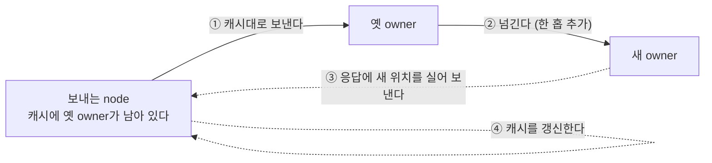
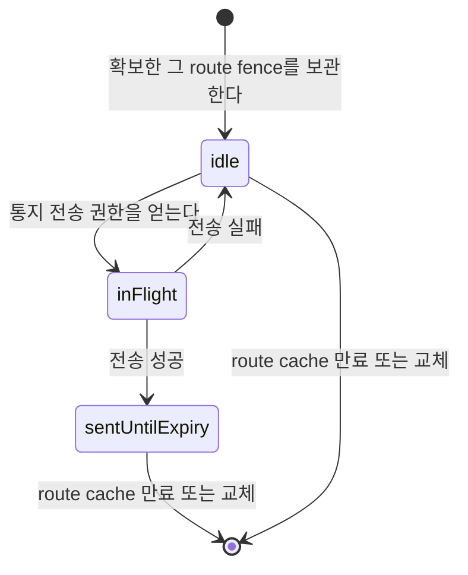

# Spot·Actor routing

[Spot·Actor 주제 목차](README.ko.md) · [스펙 목차](../README.ko.md) · [이전: 07. Stage wrapper on Spot](07-stage-wrapper-on-spot.ko.md) · [다음: 09. 객체 종류와 활성화](09-object-lifecycle.ko.md)

> 이 문서는 global SpotId·ActorId로 보낸 message가 현재 owner를 찾아 도착하는 경로, Session에
> bind된 Actor로 가는 경로와 request의 reply가 되돌아가는 경로를 정의한다. 위치 조회를 얼마나
> 자주 하는지, 언제 cache를 쓰고 언제 무효화하는지도 함께 다룬다.
>
> **병합 범위** — 이 문서는 [45. target 선택과 route cache](08-routing.ko.md)의
> §1·§1.1·§2(positive route cache 자체, resolver 결과 타입, cache 수명, relocation cache 무효화)만
> 흡수한다. 같은 문서의 §3~§7(Channel 대상 선택 알고리즘, 후보 캐시, smooth weighted round-robin,
> 직접 지정 규칙, 발행 fanout)은 이 주제가 아니라 02-channel-transport와 12-spot-messaging이 소유하며
> [45. target 선택과 route cache](08-routing.ko.md) 원문 자리에 그대로 남아 있다.

## 1. 어떤 message가 어느 route를 사용하는가

주소와 상태를 가지고 실행 node가 바뀌어도 같은 전역 ID로 계속 message를 받을 수 있는
논리 instance를 [Spot](../00-foundation/02-glossary.ko.md#spot)이라 한다. Spot·Actor에 message를
보내는 모든 경로가, 각 Spot의 현재 owner와 상태를 여러 node가 함께 확인할 수 있도록
보관하는 저장소인 [Location Store](../00-foundation/02-glossary.ko.md#location-store)를 조회하는 것은
아니다. Framework는 message가 시작된 방법에 따라 route를 다음과 같이 정한다.

```text
+----------------------------------------------------------------------+
| Route source by message path                                         |
|                                                                      |
| Spot / Actor direct : Ready cache -> Store on cache miss             |
| Session -> Actor    : Stored binding route                           |
| Request reply       : Preserved reply route + correlation            |
|                                                                      |
| Only direct resolution reads the Location Store.                     |
+----------------------------------------------------------------------+
```

위 그림의 세 경로는 다음처럼 동작한다.

- Application이 Spot을 식별하는 전역 논리 주소인
  [Spot ID](../00-foundation/02-glossary.ko.md#spot-id)나 Actor ID를 지정하면 Framework가
  current owner를 찾는다. 생성·초기화와 Location Store 기록이 끝나 message를 받을 수
  있는 상태인 [Ready](../00-foundation/02-glossary.ko.md#ready) route를 최근에 확인해 두었다면 그
  값을 사용하고, 없을 때만 Location Store를 조회한다.
- Session에 bind된 Actor로 relay할 때는 bind가 성공하면서 Session owner에 저장한
  route를 사용한다. Message마다 Actor 위치를 다시 조회하지 않는다.
- Request의 reply는 request에 포함된 반환 경로와 correlation을 사용한다. Reply를
  보내려고 requester의 Spot·Actor 위치를 조회하지 않는다.

이 문서는 위 세 경로가 route를 얻고 검증하며 위치 변경에 대응하는 방법을 한곳에서
정의한다. Caller가 MeshName과 target RID를 함께 지정해 특정 MeshNode로 message를
보내는 [Node direct](../00-foundation/02-glossary.ko.md#node-direct), Channel select-one과 Logical
Multicast의 target 선택은 다루지 않는다. Object create·get-or-create, `ActorRef`·`SpotRef`를 사용하는
close·destroy와 membership transaction도 각 lifecycle 문서가 정의한다.

## 2. Global ID로 Spot·Actor에 보내는 방법

### 2.1 Current owner를 찾는 순서

Global Spot ID 하나를 지정해 그 Spot에 send나 request를 보내는 방식을
[Spot direct](../00-foundation/02-glossary.ko.md#spot-direct)라 한다. Spot direct call은 global Spot
ID를 받고 Actor direct call은 global Actor ID를 받는다. Source runtime은 ID를 실제
owner route로 바꾼 뒤 message를 제출한다.

```text
+----------------------------------------------------------------------+
| Direct resolution                                                    |
|                                                                      |
| Global SpotId or ActorId                                             |
|            |                                                         |
|            v                                                         |
| [Positive Ready cache] -- miss --> [Location Store]                  |
|            | hit                         | Ready authority           |
|            +-----------------------------+                           |
|                          |                                           |
|                          v                                           |
|                 [Owner route + route fences]                         |
+----------------------------------------------------------------------+
```

Source runtime은 다음 순서로 처리한다.

1. Global Spot ID 또는 Actor ID로 최근에 확인한 Ready owner route를 찾는다.
2. 사용할 수 있는 최근 route가 없으면 Location Store에서 current object 상태를
   조회한다.
3. Object가 Ready이면 owner의, 하나의 물리 연결 그룹을 식별하는 이름인
   [`MeshName`](../00-foundation/02-glossary.ko.md#meshname)과 `NodeRid`, object generation과
   owner fence를 route snapshot에 기록한다.
4. 선택한 owner route로 message를 제출한다.
5. Target은 자신이 같은 logical ID의 current owner인지, current Ready object가 있는지,
   local admission이 가능한지 확인한 뒤 application queue에 넣는다. Object generation은
   application handler의 target 일치 조건으로 검사하지 않는다
   ([§2.6](#26-objectgeneration을-어디에-쓰고-어디에-쓰지-않는가)).

Location Store가 global object마다 기록한 current owner, incarnation, owner
generation과 lease 정보를 authority라 한다. Framework는 current Ready
[authority](../00-foundation/02-glossary.ko.md#authority)만 application message의 route로 사용한다.

Spot ID나 Actor ID 문자열에는 owner 주소가 들어 있지 않다. Framework는 ID를
parse하여 node를 추론하거나 Core routing ID로 변환하지 않는다. 현재 Actor나 Spot을
실제로 실행하고 그 application queue를 관리하는 MeshNode를
[Owner](../00-foundation/02-glossary.ko.md#owner)라고 하며, caller는 다음 값을 message target으로
지정하지 않는다.

- `MeshName`
- Owner `NodeRid`
- `ActorRef` 또는 `SpotRef`
- Actor의 current Spot ID

### 2.2 최근 Ready route를 사용하는 조건

Source runtime은 Location Store에서 확인한 Ready owner route를 잠시 보관할 수
있다. 이를 positive route cache라 한다. 이 정보는 Store의 current authority를
대체하는 별도 authority가 아니라 최근 조회 결과의 snapshot이다. Message마다
Location Store를 왕복하면 대부분 다른 process(Redis 등)를 오가는 비용이 모든
호출에서 발생하므로, 이 cache가 그 비용을 줄인다.

| 확인할 항목 | 계약 |
|---|---|
| Cache에 보관하는 정보 | [Positive route cache](../00-foundation/02-glossary.ko.md#positive-route-cache)는 global object ID, 같은 논리 ID의 서로 다른 incarnation을 구분하는 번호인 [`ObjectGeneration`](../00-foundation/02-glossary.ko.md#objectgeneration), 같은 incarnation 안에서 authority owner가 바뀐 순서를 나타내는 [`AuthorityOwnerGeneration`](../00-foundation/02-glossary.ko.md#authorityownergeneration), `StoreVersion`, owner lease, node lifecycle과 owner route를 보관한다. |
| 사용할 수 있는 기간 | Current owner lease의 local admission deadline과 `RouteCacheMaxAge` 가운데 먼저 끝나는 시점까지만 사용한다. |
| 보관하는 이유 | 경로만 캐시하고 fence를 빼면 낡은 owner로 보내 놓고도 그 사실을 알지 못한다. Owner 경로와 수락 판단에 필요한 fence 값을 함께 보관하는 이유다. |
| 기본 설정 | `RouteCacheMaxAge` 기본값은 15초다. 0이면 route cache를 사용하지 않는다. |
| 저장하지 않는 결과 | `Missing`, `Creating`과 Store failure는 캐시에 두지 않는다. 이전 실패만으로 다음 call을 끝내지 않는다. 이 상태를 캐시하면 잠깐의 실패가 캐시 수명만큼 지속되는 장애가 된다. |
| 즉시 무효화하는 조건 | 더 큰 `StoreVersion`, stale route 결과, Store recovery event, owner lease invalidation 또는 **relay 통지**를 확인하면 entry를 제거한다. |
| Relay 통지 | Actor나 Spot이 다른 MeshNode로 옮겨진 뒤에도 이전 owner에 도착한 message를 새 owner에게 대신 전달하는 [Message Follow](../00-foundation/02-glossary.ko.md#message-follow) relay가 message를 새 owner로 넘기면 원 송신 runtime에 통지한다. 통지를 받은 runtime은 해당 entry를 제거하고 다음 call에서 owner를 다시 조회한다. |
| 실행 중 설정 변경 | 변경한 `RouteCacheMaxAge`는 새 cache entry부터 적용한다. 기존 entry의 수명을 새 값으로 연장하지 않는다. |

Relay 통지는 Framework가 소유하는 infrastructure record이며 application handler를
호출하지 않는다. 통지가 유실되어도 정확성은 바뀌지 않는다 — cache 수명이 끝나면 같은
결과에 도달한다. 통지는 [Message Follow duration](../00-foundation/02-glossary.ko.md#message-follow-duration)
동안 우회 경로로 흐르는 구간을 줄이기 위한 것이다.

찾은 owner가 여전히 그 object를 소유하는지, 같은 ID로 새 incarnation이 만들어졌다면
어느 쪽이 message를 처리하는지는
[§2.6](#26-objectgeneration을-어디에-쓰고-어디에-쓰지-않는가)이 정한다.

Local owner와 remote owner에는 같은 handler, metadata와 completion 계약을 적용한다.

**Resolver는 조회 결과를 네 가지 닫힌 결과로 돌려준다.** `null`이나 하나의 "없음"으로
축약하면 뒤 단계가 어느 상태였는지 다시 추측해야 한다.

| Resolver 결과 | 보존하는 정보 | 결과를 받는 대상 |
|---|---|---|
| `ReadyRoute` | route와 authority·owner lease fence | Positive route cache에 저장하고 route admission으로 전달한다. |
| `Missing` | authority record가 없다는 사실 | creation coordinator로 전달한다. |
| `Unavailable` | authority는 남아 있지만 current owner를 사용할 수 없다는 사실 | terminal completion mapper로 전달한다. |
| `StoreFailure` | authority 유무를 판정하지 못했다는 사실 | Store retry·reconciliation으로 전달한다. |

Positive route cache에는 `ReadyRoute`만 저장하고, creation coordinator에는 `Missing`만
전달한다. Authority release를 소유하는 lifecycle component가 release를 완료한 뒤에만
resolver가 `Missing`을 반환한다 — 이 순서가 없으면 아직 정리 중인 object가 이미 없는
것처럼 보인다.

### 2.3 수동 object peer 연결에서도 admission fence를 보존한다

Location Store가 반환하는 object peer descriptor에는 endpoint, RID, lifecycle generation과
security identity가 들어 있다. 수동으로 설정한 endpoint는 연결 의도만 제공한다.

**Runtime이 이 endpoint를 descriptor와 연결하여 object peer로 사용할 때는, handshake에
필요한 descriptor 값을 transport에도 모두 전달해야 한다.** 여러 MeshNode가 참여해 node와
Channel message를 주고받는 범위인 [RouteMesh](../00-foundation/02-glossary.ko.md#routemesh)의 정식
peer handshake 계약은 [RouteMesh topology](../02-channel-transport/01-channel-topology.ko.md)가
소유한다.

JVM 경로는 다음 순서로 이 값을 전달한다. MeshNode를 시작할 때 먼저 manual endpoint-only
intent를 등록한다. 이후 `ZLinkFrameworkRuntime.connectManualObjectPeers`,
`ZLinkLocationAutoConnectHost.MeshNodeExecutor` 또는 `ZLinkSpotRuntime.ensureManualObjectPeer`가
descriptor를 찾으면 `replacePeerConnection(endpoint, rid, lifecycleGeneration,
securityIdentity)`를 호출한다.

교체 경로는 이전 intent의 transport liveness close를 확인한 뒤에만 새 intent를 설치한다.
`ZLinkJavaRawMeshNode`는 intent, 실제 peer routing ID와 close 상태를 함께 보관하여 admission
fence와 liveness event를 처리한다. Descriptor를 찾지 못한 endpoint-only intent는 placement
근거로 사용하지 않는다. Caller가 generation이나 security identity를 직접 설정하여 이 절차를
우회할 수 없다.

### 2.4 Object가 없을 때

Instance intent가 없는 Spot direct call과 Actor direct call은 이미 Ready인 object만
대상으로 한다.

- Missing Actor message는 Actor를 새로 만들지 않는다.
- Missing Spot message도 기본적으로 Spot을 새로 만들지 않는다.
- Spot 전용 fluent call에 Instance intent를 명시한 경우에만 Missing Instance
  Spot의 [cold activation](../00-foundation/02-glossary.ko.md#cold-activation)을 시작할 수 있다.

`Missing`, `Creating`과 Store failure를 캐시에 두지 않으므로 다음 call은 당시의
current 상태를 다시 확인한다.

### 2.5 이전 owner route에 도착한 message

Object relocation을 commit한 뒤에도 cache에 남은 이전 route로 message가 도착할 수
있다. 이전 owner는 commit된 source→target Message Follow route가 있을 때만 같은 operation을
current owner로 relay한다. Relay 중에는 Location Store를 읽거나 application
handler를 실행하지 않는다.

Message Follow route는 global object ID, `ObjectGeneration`, source·target
`AuthorityOwnerGeneration`과 owner fence를 검증한다. Owner generation은 hop마다
증가해야 하며 chain은 최대 8 hops다. Route 하나의 queue에는 message 수와 저장 크기
어느 쪽에도 상한을 두지 않으며, 각 message의 negotiated message bound는 지킨다.

`MessageFollowDuration` 기본값은 30초이며 0이면 Message Follow를 사용하지 않는다.
`RouteCacheMaxAge`와 Message Follow duration이 모두 양수이면 cache max age가 Message Follow
duration보다 최소 5초 짧아야 한다 — 우회 경로가 닫히기 전에 cache가 먼저 만료되어야 하기
때문이다. 실행 중 변경한 Message Follow duration은 새 relocation부터 적용한다.

Relay는 original operation ID, `ObjectGeneration`, payload와 reply route를
보존한다. Message Follow route가 없거나 만료됐거나 loop가 발생하면 `Unavailable`, generation mismatch는
`InvalidOperation`으로 끝난다.

이 generation 검사는 relocation이 설치한 Message Follow route가 같은 incarnation의 이동에
속하는지 확인하는 것이며, 일반 message의 target을 제한하는 검사가 아니다
([§2.6](#26-objectgeneration을-어디에-쓰고-어디에-쓰지-않는가)).

`PerActor` User Spot relocation 중 `ToActor`는 Spot authority가 아니라 Actor별
current owner route를 사용한다. Spot authority가 target으로 바뀌어도 아직 source에
남은 Actor는 source route를 유지한다. Actor owner CAS가 성공하면 이전 owner는
같은 Actor Message Follow route로 target에 relay한다.

Actor queue를 seal하기 전에 수락한 작업은 이전 queue와 accepted journal에
포함한다. Seal 뒤 source에 도착한 작업은 ingress hold에 보관한다. Target은 다음
순서로 relocation temporary queue를 사용한다.

1. Restore 요청을 받으면 Actor instance를 만들기 전에 temporary queue를 등록한다.
   Cross-node Actor Join의 User Spot target은 `OnActorJoin` 승인 처리에서 이미 등록한
   temporary queue를 사용한다([05-spot-actor-membership §4.2](05-spot-actor-membership.ko.md#42-다른-node의-spot으로-actor를-join하는-순서)).
2. Source ingress hold의 message를 original operation identity와 reply route를 유지해 이
   queue로 relay한다.
3. Restore가 끝나면 owner CAS를 실행한다. Source는 target dispatch 전환이 끝날 때까지 ingress
   hold 원본을 유지하고 이전 route의 message를 target temporary queue로 계속 relay한다.
4. 이전 queue와 accepted journal을 실제 Actor queue에 먼저 넣고 temporary queue의 작업을
   그 뒤에 옮긴다.
5. Temporary queue 등록을 제거하고 기존 Actor dispatch로 전환한다.

전환 전에 target으로 들어온 작업은 temporary queue에 보관한다. 전환 뒤 Message Follow와
target direct 작업은 기존 Actor queue가 실제로 수락한 순서대로 실행한다.

따라서 Actor가 전송 도중 이전되어도 caller가 새 route를 선택하거나 operation을
다시 만들 필요가 없다. Request deadline과 correlation, one-way operation identity,
ActorId와 ObjectGeneration을 relay 전후에 유지한다.

Framework는 실패한 현재 operation을 Location Store에서 찾은 새 owner에게 자동으로
다시 제출하지 않는다. 다음 call만 cache 또는 Location Store에서 current owner를
다시 찾는다. 이 규칙은 이미 실행됐는지 알 수 없는 operation이 두 owner에서
중복으로 실행되는 것을 막는다.

**이동과 cache가 만나는 지점 — 성능 절벽.** 객체가 다른 node로 옮겨 가면 cache에 남은
경로는 옛 owner를 가리킨다. 옛 owner로 간 message는 위에서 설명한 것처럼 Message Follow가
새 owner로 넘기므로 버려지지 않지만, 넘기는 동안 모든 message가 한 홉을 더 거친다. Cache를
무효화하지 않으면 이동 후 Message Follow 기간(기본 30초) 내내 그 객체로 가는 모든 트래픽이
우회 경로로 흐르고, 최대 8홉까지 이어질 수 있어 이동이 잦은 환경에서는 홉이 쌓인다.



우회로 넘어간 사실을 보낸 쪽에 알려 cache를 갱신한다. 통지를 받은 runtime은 해당 cache
항목을 지우고 다음 호출에서 owner를 다시 조회한다. 우회는 cache가 갱신될 때까지의 과도기를
메우는 장치이지 정상 경로가 아니다 — 알림이 없으면 cache 수명이 끝날 때까지 우회가
계속된다.

통지 record의 공통 wire 형식은 schema가 정한다. `service-wire-v1.schema.json`의 command
50 `messageFollow`에는 source와 target route의 fence, hop count, relay 시점의 queue 회계,
원래 operation ID와 reply route가 들어간다. Flags와 application payload는 허용하지 않는다.

Schema는 record 형식만 고정한다. 각 runtime은 record를 relay하고 수신한 뒤, source route의
object generation, authority generation과 target node를 검증해야 한다. 현재 cache 항목이 이
값과 일치할 때만 무효화하여, 이미 저장된 더 새로운 route를 지우지 않는다.

중복 억제는 전용 registry가 맡는다. Key는 source와 target route fence의 모든 field를
포함한다 — object kind와 논리 ID뿐 아니라 object generation, target node RID·generation,
authority owner generation과 owner lease generation도 source와 target 양쪽 값으로
비교한다. 일부 generation만 key로 쓰면 이전 route에서 남은 표식이 새 target으로 보내야
할 통지까지 막을 수 있다.



`inFlight`에서는 같은 key의 추가 전송을 시작하지 않는다. 전송에 성공하면 cache route가
만료될 때까지 `sentUntilExpiry`를 유지하고, 실패하면 다시 시도할 수 있도록 `idle`로
전이한다. Registry는 자체 expiry timer를 만들지 않고 route cache가 만료·교체되는 시점에
같은 key를 제거한다.

이 registry는 통지 중복만 관리한다. 원래 operation의 payload, reply route와 terminal
completion은 각각의 기존 owner가 계속 관리하므로, suppression 상태가 원래 operation의
terminal 결과를 만들거나 바꾸지 않는다.

### 2.6 ObjectGeneration을 어디에 쓰고 어디에 쓰지 않는가

일반 Actor·Spot message는 global logical ID만 target으로 사용한다. Actor send/request는
`ActorId`, Instance Spot을 포함한 Spot send/request는 `SpotId`가 가리키는 current Ready
object로 전달한다. `ActorRef`·`SpotRef`와 그 안의
[ObjectGeneration](../00-foundation/02-glossary.ko.md#objectgeneration)은 application message target이 아니다.

`ObjectGeneration`은 같은 ID로 object를 제거한 뒤 다시 만들었는지를 구분한다. Framework는
이 값을 다음과 같이 사용한다.

| Operation | `ObjectGeneration` 적용 방법 |
|---|---|
| Actor·Spot direct send/request | Target 일치 조건에서 **제외한다.** 같은 owner에서 같은 ID의 object가 다시 만들어졌다면 target queue가 수락하는 시점의 current Ready object가 message를 처리한다. |
| `Destroy`·`Close`와 membership 변경 | Caller가 지정한 incarnation과 current authority가 같은지 확인한다. 이전 incarnation의 작업은 새 object의 상태를 바꾸지 않는다. |
| 생성 recovery | 같은 생성 attempt와 incarnation만 계속한다. 다른 generation의 factory나 생성 결과를 함께 사용하지 않는다. |
| Relocation과 Message Follow | 같은 relocation에 속한 state·queue·relay route인지 확인한다([§2.5](#25-이전-owner-route에-도착한-message)). 이전 generation의 relocation control을 새 object에 적용하지 않는다. |
| Session bind와 relay | Bind는 지정한 `ActorRef`로 시작하고 binding token을 발급한다. Actor를 제거하면 기존 binding을 종료하므로 새 incarnation에는 explicit bind가 필요하다. 늦은 relay는 종료된 binding token으로 거부한다([§3](#3-session에-bind된-actor로-relay하는-방법)). |

찾은 뒤 owner에게 무슨 일이 일어났느냐에 따라 결과가 갈린다.

| Resolve 뒤 일어난 일 | 결과 |
|---|---|
| 같은 owner에서 object가 close·destroy되고 같은 ID로 새 incarnation이 만들어졌다 | Target queue가 수락하는 시점의 current Ready object가 처리한다. Actor와 Instance Spot을 포함한 모든 Spot direct message에 동일하게 적용한다. |
| Owner process가 종료되었거나 owner가 다른 node로 바뀌어 찾은 route를 쓸 수 없다 | Current operation을 [`Unavailable`](../00-foundation/07-framework-error-model.ko.md)로 끝낸다. |

두 경우 모두 Framework는 실패한 operation을 새 owner에게 **자동으로 다시 보내지 않는다.**
Application이 새 call을 시작하면 그때 logical ID의 current Ready owner를 다시 확인한다. 이
규칙은 이미 실행됐는지 알 수 없는 operation이 두 owner에서 중복 실행되는 것을 막는다.

이 구분을 적용하면 Actor와 Instance Spot이 같은 메시징 규칙을 사용한다. **Logical ID는
application message의 대상을 정하고, `ObjectGeneration`은 특정 incarnation의 상태를 바꾸는
control을 제한한다.**

## 3. Session에 bind된 Actor로 relay하는 방법

### 3.1 Bind할 때 route를 저장한다

Session relay는 message마다 Actor ID를 찾지 않는다. Bind할 때 Actor route를
한 번 검증하고 Session owner에 저장한 뒤 이후 relay에서 그 정보를 사용한다.

```text
+----------------------------------------------------------------------+
| Session binding route                                                |
|                                                                      |
| Bind       : ActorRef -> validate -> store route                     |
| Relay      : Session -> stored route -> Actor owner                  |
| Relocation : Target -> command 44 one-way -> Session owner         |
|                                                                      |
| No per-message Location Store lookup                                 |
+----------------------------------------------------------------------+
```

Session owner가 특정 Actor binding에 보관하는 current Actor owner 전달 경로를
binding route라 한다.

Bind는 caller가 제출한 `ActorRef`의 위치를 최초 route로 사용한다. Source가
bind 전에 Location Store에서 current route를 미리 조회하거나 local Actor instance를
받는 overload는 제공하지 않는다.

Actor owner는 다음 값이 current 상태와 일치하는지 확인하고 binding generation을
등록한 뒤 terminal reply를 반환한다.

- `ActorId`와 `ObjectGeneration`
- Target `NodeGeneration`
- `AuthorityOwnerGeneration`
- Current owner lease
- Session owner와 Session lifecycle identity

Bind가 성공하면 Session owner는 Actor마다 다음 정보를 하나의
[binding route](../00-foundation/02-glossary.ko.md#binding-route)에 저장한다.

| 저장 정보 | 사용하는 이유 |
|---|---|
| `ActorId`, `ObjectGeneration` | 같은 ID로 다시 만든 다른 Actor에게 relay하지 않는다. |
| `MeshName`, owner `NodeRid` | Actor relay와 disconnect 통지를 보낼 route로 사용한다. |
| `NodeGeneration`, `AuthorityOwnerGeneration`, 현재 owner가 속한 host process lifecycle을 구분하는 [`OwnerLeaseGeneration`](../00-foundation/02-glossary.ko.md#ownerleasegeneration) | 재시작 전 node와 이전 owner를 거부한다. |
| Session owner RID·lifecycle generation, binding generation·token | 이전 connection이나 교체된 binding의 늦은 message를 거부한다. |
| 한 STREAM session에서 수락한 ingress message의 순서를 나타내는 [Session sequence](../00-foundation/02-glossary.ko.md#session-sequence) | 같은 Session에서 수락한 message의 순서를 유지한다. |

다른 owner나 다른 Actor generation으로 rebind할 때 target Actor owner는 새 identity를
등록한 뒤 이전 owner에 tombstone을 제출한다. 이전 owner의 ACK까지 받은 뒤에만
bind terminal reply를 반환한다. Session owner는 terminal reply 전에는 기존 route를
유지하고, reply 뒤에는 새 route로 atomic하게 교체한다. 따라서 Session owner가
교체 뒤 별도의 durable retry journal을 보관하거나 Location Store·Relocation Store에
binding route를 기록하지 않는다. 같은 owner의 atomic replacement에서는 이전
identity tombstone이 새 identity를 제거하지 않아야 한다.

### 3.2 저장한 route로 message를 보낸다

Bind가 끝난 뒤에는 다음 작업이 저장한 route를 사용한다.

- Session에서 Actor로 보내는 `RelayAsync(...)`
- Physical disconnect와 application의 logical disconnect 통지
- Actor에서 bound Session으로 보내는 push

이 작업을 시작할 때마다 Location Store에서 Actor 위치를 조회하지 않는다. 저장
route는 current owner lease와 local admission deadline 안에서만 유효하다. Store를
일시적으로 사용할 수 없어도 lease나 deadline을 연장하지 않는다.

저장 route가 더 이상 유효하지 않으면 active Message Follow route로 original
operation을 정확히 한 번 전달하거나 `Unavailable`로 끝낸다. Location Store에서
새 `ActorRef`를 찾아 같은 operation을 다른 owner에게 자동으로 보내지 않는다.

Location Store와 Relocation Store는 binding route를 저장하거나 갱신하지 않는다.
이 route는 Session owner runtime이 소유한다. Direct route cache를 갱신해도 Session
binding route는 자동으로 바뀌지 않는다.

### 3.3 Actor relocation 뒤 저장 route를 바꾼다

Actor가 다른 MeshNode로 이동해도 physical STREAM connection과 Session object는
Session owner process에 유지한다. Socket, transport handle과 Session callback
state를 target Actor process로 옮기거나 복제하지 않는다.

Relocation 중에도 Session owner는 Location Store를 조회하여 새 Actor route를
추측하지 않는다. 같은 `ObjectGeneration`의 target Actor가 다음 순서를 완료한 뒤
Session owner에 새 route를 전달한다.

1. Source Actor의 현재 handler가 끝나고 target preflight가 성공하면, bound Actor는 command 42
   `sessionRelocationSeal` request와 command 43 reply로 binding seal을 설치한다. 그다음 새
   Actor application dispatch를 막고 이미 수락한 queue·timer와 application state를 capture해
   source memory에 유지한다.
2. Target은 Actor lookup과 factory보다 먼저 temporary queue group을 등록하고, source가 Restore
   요청과 같은 ordered 연결로 직접 전송한 queue·timer와 state payload를 Restore한다 — payload
   전달 경로와 전송 단위인
   [relocation state chunk](../00-foundation/02-glossary.ko.md#relocation-state-chunk)·checksum 규칙은
   [Actor와 Spot relocation 전체 흐름](../05-location-relocation/04-relocation-flow.ko.md)이 정의한다. 준비가 끝나면
   source에 relay 수신 준비 reply를 보낸다.
3. Capture 뒤 source로 들어온 Actor message만 ingress hold에 보관했다가 같은 ordered connection으로
   boundary 전 relay 구간에 전달한다. Saved queue와 timer는 relay하지 않는다. Source는 현재 relay
   prefix 뒤에 cutover를 one-way로 보낸다.
4. Target은 cutover를 받거나 relay 준비 reply 뒤 1,000ms가 지나면 owner와 membership을 target-only
   Location Store CAS로 commit한다.
5. CAS 뒤 saved work, boundary 전 relay와 나머지 temporary work를 실제 Actor queue에 순서대로
   넣고 regular route로 전환하되 dispatch는 닫아 둔다.
6. 필요한 lifecycle callback을 끝낸다. Join relocation이면 Join completion callback도 이 단계에서
   끝낸 뒤 Target Actor dispatch를 연다.
7. Target은 command 44 `sessionRelocationRoute` commit을 Session owner에 one-way로 보낸다. Session
   owner는 Session·binding·Actor generation과 relocation identity만 확인하고 Actor route와
   bound-session current Actor location snapshot을 atomic하게 바꾼다. Held message를 target route로
   제출하고 matching seal을 해제하며 reply를 보내지 않는다.
8. 그 command 44가 `SessionRelocationSealTimeout` 안에 오지 않으면 Session owner는 physical
   Session을 종료하고 binding·held·seal state를 정리한다. 이전 route로 늦게 도착한 message는
   source Message Follow route가 target에 전달한다.

Route 갱신은 binding이 가리키는 `ObjectGeneration`과 같은 Actor relocation에만
허용한다. 같은 Actor ID로 새 incarnation이 만들어지면 기존 binding을 새 Actor로
바꾸지 않는다. Application이 새 `ActorRef`로 bind를 다시 시작해야 한다.

같은 Session에서 relocation 대상에 포함되지 않은 다른 Actor의 route, location snapshot, token과 generation은 유지한다.
Physical STREAM connection도 그대로 유지한다. Command 44에는 적용 reply가 없으며 Target
Actor는 dispatch가 열린 뒤 message를 처리한다. 이전 route로 도착한 message는 source Message Follow route가
Target Actor에 전달한다. Application은 relocation을 알기 위해 rebind하지 않는다.

Relay-ready reply가 accepted 상태가 되기 전 명시적인 relocation failure에서는 Location Store를
다시 확인하지 않고 target temporary queue를 폐기한 뒤 source Actor queue와 admission을 복원한다.
Bound Session seal이 있으면 source
coordinator가 command 44 abort를 one-way로 보내고, Session owner는 matching seal만 해제한
뒤 held message를 source route에 제출한다. Relay-ready 뒤에는 cutover submit 결과와 관계없이 source route나 snapshot으로
되돌리지 않는다. Source Message
Follow route가 이전 route의 message를 target에 전달한다. Target process가 종료되면
다른 runtime이 route 갱신을 자동으로 이어받지 않는다.

## 4. Request의 reply가 돌아가는 방법

### 4.1 Reply는 새 주소 조회를 시작하지 않는다

Source runtime은 request를 제출할 때 reply가 돌아올 내부 경로와 도착한 reply를
원래 request에 연결할 식별값을 함께 만든다.

```text
+----------------------------------------------------------------------+
| Request and reply                                                    |
|                                                                      |
| Request : Source -> Target  [reply route + correlation]              |
| Reply   : Target -> Source  [preserved reply route]                  |
|                                                                      |
| No SpotId / ActorId lookup for reply                                 |
+----------------------------------------------------------------------+
```

Target handler는 request가 가진 reply capability를 사용한다. Reply를 보내기 위해
request를 시작한 Spot·Actor의 global ID를 cache나 Location Store에서 찾지
않는다.

Request와 terminal reply를 연결하는 식별값을 reply correlation이라 한다.
[Reply correlation](../00-foundation/02-glossary.ko.md#reply-correlation)은 어떤 request를 완료할지
정하고, reply route는 원래 source runtime으로 돌아갈 경로를 정한다.

Reply route와 correlation은 application metadata가 아니다. Application metadata는
업무 payload와 함께 전달하는 key-value 정보다. Request metadata를 reply에
자동으로 복사하지 않으며 일반 reply에는 metadata setter를 제공하지 않는다.

### 4.2 Spot에서 시작한 request를 재개한다

Spot에서 request를 시작했다면 source runtime은 request correlation과 함께 다음
정보를 보존한다.

- Request를 시작한 Spot 실행
- Request를 시작한 Spot의 `ObjectGeneration`

Reply가 도착하면 원래 request completion을 재개한다. 같은 Spot ID로 새 incarnation이
만들어져도 이전 reply를 새 Spot에 application message로 전달하지 않는다.

Spot·Actor operation이 Message Follow나 relocation payload를 거쳐도
original reply route와 correlation을 보존한다. Operation ID는 중복 작업을 구분하는
값이며 reply route를 대신하지 않는다.

### 4.3 Reply route를 사용할 수 없을 때

Framework는 reply route를 복원할 수 있는 request의 handler·decode failure를
구조화된 error reply로 완료한다. Reply route를 복원할 수 없다고 해서 requester의
Spot·Actor ID나 새 owner를 Location Store에서 찾아 우회하지 않는다. 해당 failure는
[상호작용 모델](../00-foundation/04-interaction-model.ko.md#10-handler-실패)이 정한 drop과 log,
metric 계약을 따른다.

Route 오류, timeout, cancellation이나 실행 여부가 불명확한 failure 뒤에도 같은
request를 다른 owner에게 자동으로 재제출하지 않는다. Request는 reply, error,
timeout, cancellation 또는 shutdown 가운데 먼저 확정된 terminal 결과 하나로
완료한다.

## 5. 구현 및 contract test 검증 요구

공개 표면(Spot·Actor direct 시작 method, bind·relay method, reply 완료, Location Store가
아니라 route resolver가 돌려주는 결과 tag) 만으로 다음을 확인한다.

**Global ID 조회**

- Spot·Actor direct 시작 method가 global ID만 받고 owner RID, generation과
  `ActorRef`·`SpotRef`를 message target으로 요구하지 않는다.
- Cache hit에서는 Location Store를 읽지 않고 cache miss나 invalidation 뒤 current
  Ready authority를 조회한다.
- `Missing`, `Creating`과 Store failure를 negative 결과로 캐시에 두지 않는다.
- Positive cache가 owner admission deadline과 `RouteCacheMaxAge`를 넘지 않고 higher
  `StoreVersion`, stale result, Store recovery와 lease invalidation에서 즉시
  제거된다.
- Resolver 결과가 `Missing`과 `Unavailable`을 서로 다른 tag로 돌려주고, `Missing`은
  creation coordinator에만, `Unavailable`은 terminal completion mapper에만 연결된다.
- Positive route cache의 수명이 `MessageFollowDuration`을 넘지 않는다.
- Target admission이 찾은 object·owner generation과 lease fence를
  검증하며 새 incarnation으로 다시 지정하지 않는다.

**이동과 Message Follow**

- Message Follow relay가 committed route만 사용하고 Store를 읽지 않으며 operation
  ID, generation, payload와 reply route를 보존한다.
- 유효한 `messageFollow` 통지를 받으면 보낸 쪽 cache를 즉시 무효화하여 다음 조회가
  새 owner를 사용한다. 통지가 유실되면 기존 cache 수명이 끝난 뒤에 새 owner를 조회한다.
- `PerActor` User Spot relocation에서 `ToSpot`은 Spot authority, `ToActor`는 Actor별
  current owner를 사용한다. Spot과 Actor의 relocation temporary queue를 독립적으로 등록하고
  atomic하게 기존 dispatch로 전환한다.
- Failed operation을 fresh owner에게 자동 재제출하지 않고 다음 call만 current
  authority를 다시 찾는다.

**Session bind와 relay**

- Bind가 caller의 `ActorRef` 위치를 최초 route로 사용하고 검증된 route만
  Session owner binding에 저장한다.
- Session relay, disconnect와 Actor push가 message마다 Location Store를 조회하지
  않고 stored binding route를 사용한다.
- Actor relocation이 같은 `ObjectGeneration`의 command 44 `sessionRelocationRoute`를 one-way로
  적용해 해당 Actor의 binding route만 바꾸고 relocation 대상에 포함되지 않은 다른 Actor route와
  physical STREAM connection을 유지한다.
- Command 44에는 응답이 없고 request로 재전송하지 않는다. Target Actor 처리는 그 적용을 기다리지
  않으며 source Message Follow route가 `MessageFollowDuration` 동안 이전 route로 도착한 message를
  전달한다.

**Reply**

- Reply가 request의 reply route와 correlation을 사용하고 requester의 logical ID를
  Location Store에서 조회하지 않는다.
- Application metadata가 owner route와 reply route를 대신하지 않고 request metadata를
  reply에 자동 복사하지 않는다.

---

[Spot·Actor 주제 목차](README.ko.md) · [스펙 목차](../README.ko.md) · [이전: 07. Stage wrapper on Spot](07-stage-wrapper-on-spot.ko.md) · [다음: 09. 객체 종류와 활성화](09-object-lifecycle.ko.md)
