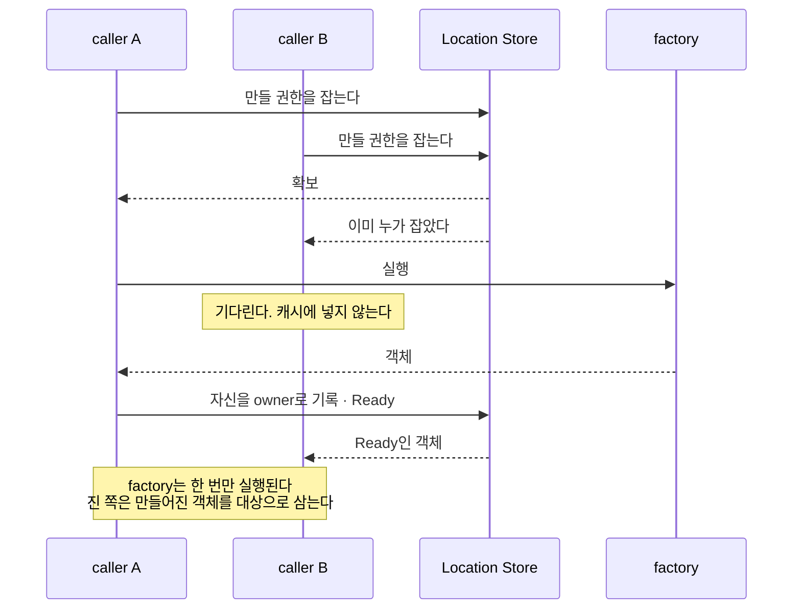
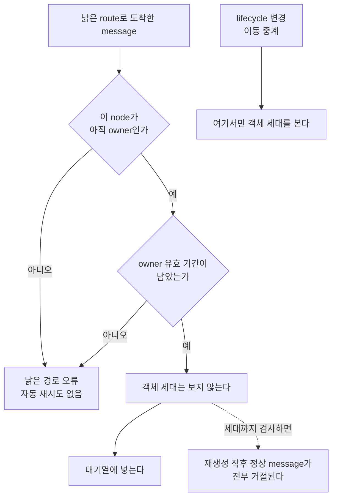

# 09. 객체 종류와 활성화

[Spot·Actor 주제 목차](README.ko.md) · [스펙 목차](../README.ko.md) · [이전: 08. Spot·Actor routing](08-routing.ko.md) · [다음: 10. Spot timer](10-spot-timer.ko.md)

> **계약 소유** — Spot 종류와 종료 사유는 [Spot 모델](01-spot-model.ko.md)이,
> generation을 쓰는 자리는 [Spot·Actor routing](08-routing.ko.md)이,
> owner 장애 뒤 결과는 [Failure와 failover policy](../05-location-relocation/06-failure-failover-policy.ko.md)가 소유하는
> 계약이다. 이 장은 그 계약을 만족시키는 구현 구조와, lifecycle 경계를 어겼을 때 나타나는
> 실패를 설명한다. Application이 관찰하는 동작을 추가하거나 변경하지 않는다.

Actor와 handler를 담는 실행 단위인 [Spot](../00-foundation/02-glossary.ko.md#spot) 세 종류를 코드에서
어떻게 구분하고, 없는 객체를 언제 만들며, 낡은 owner에게 보낸
message를 어떻게 걸러내는지를 다룬다.

## 1. 종류를 참·거짓 표시로 구분하지 않는다

Spot 종류는 닫힌 값 집합이다 — `Invalid = 0`, `Entry = 1`, `User = 2`, `Instance = 3`
([용어집](../00-foundation/02-glossary.ko.md#spot-kind)). 세 종류는 동작이 다르다.

| 종류 | 만드는 시점 | 이동 | 반납 대기 |
|---|---|---|---|
| Entry Spot | Object Server 시작 시 그 node에 하나 | **하지 않는다** | 쓸 수 없다 |
| User Spot | 만들기를 명시적으로 요청할 때 | 한다 | `SpotWide`에서만 |
| Instance Spot | 만들겠다는 의사를 명시한 호출이 처음 도착할 때 | 한다 | 쓸 수 있다 |

**세 종류를 서로 다른 타입으로 표현한다.** 한 타입에 `entry_spot`,
`instance_spot` 같은 표시를 붙여 구분하면 두 가지가 동시에 참인 조합을 타입이 막지
못하고, 종류마다 다른 규칙이 조건문으로 흩어진다. 반납 대기 허용 여부처럼 종류에 따른
규칙도 각 타입의 경계에서 결정한다.

공통 기반 위에 세 형제 타입을 두면 종류별 차이가 타입 경계에 모인다.

**언어별 재량 — 표현 방법.** 상속·합성·태그 유니온 중 무엇으로 표현할지는 자유다. 관찰
기준은 "불가능한 조합을 만들 수 있는가"다.

**내부 확인 조건.** 세 종류가 서로 다른 타입으로 표현되어, 두 종류가 동시에 참인 값을
코드로 만들 수 없다는 것은 타입 정의를 직접 봐야 확인되는 화이트박스 조건이다.

## 2. Entry Spot이 이동하지 않는다는 뜻

Entry Spot **인스턴스**는 그 Object Server의 lifecycle에 속하므로 이동 대상 목록에
들어가지 않는다([Spot 모델 「4.2 Entry Spot의 Actor lifecycle」](01-spot-model.ko.md#42-entry-spot의-actor-lifecycle)).

여기서 자주 어긋난다 — **Entry Spot에 있던 Actor는 이동한다.** 이동하지 않는 것은 Entry
Spot 자신이다. 이동 대상을 고를 때 "Entry Spot에 속한 Actor"를 통째로 제외하면 그
Actor들은 node가 내려갈 때 사라진다.

## 3. 없는 객체를 언제 만드는가

**일반 message는 없는 객체를 만들지 않는다.** 만들겠다는 의사를 명시한 Spot 전용
호출만 새로 만들 수 있고, 일반 message와 조회 호출은 이미 준비된 객체만 대상으로 한다
([Spot·Actor routing 「2.4 Object가 없을 때」](08-routing.ko.md#24-object가-없을-때)).

### Spec 상태를 activation state machine에 전달한다

공개 동작은 [장애 대응과 failover 범위 §4.4](../05-location-relocation/06-failure-failover-policy.ko.md#44-instance-spot-cold-activation과-owner-장애를-구분한다)가
정의한다. Resolver는 조회 결과를, Spot 생성·초기화와 각 Spot의 현재 owner·상태를 여러 node가
함께 확인하도록 보관하는 저장소인 [Location Store](../00-foundation/02-glossary.ko.md#location-store) 기록이
끝나 application message를 받을 수 있는 상태인 [`Ready`](../00-foundation/02-glossary.ko.md#ready)를 포함해
아래의 닫힌 내부 상태 중 하나로 만든다. Activation state
machine은 그 상태를 담당 component 한 곳에만 전달하므로, 뒤 단계가 Store 결과를 다시
추측하지 않는다.

| 내부 상태 | 보존하는 fence | 다음 component |
|---|---|---|
| `Missing` | authority가 없다는 조회 version | creation coordinator |
| `Creating` | attempt와 reservation fence | 같은 attempt의 waiter |
| `Ready` | route와 authority·owner lease fence | route admission |
| `Unavailable` | authority와 무효 owner evidence | terminal completion adapter |

`Unavailable`은 authority가 남아 있지만 current owner를 사용할 수 없다는 뜻이다. Authority가
없다는 `Missing`과 같은 상태로 취급하지 않는다. Explicit `Close`, `IdleEvicted` cleanup 또는
다른 정식 lifecycle operation이 authority release를 완료한 뒤에만 resolver가 새 `Missing`
입력을 만들 수 있다.

Stored creation intent는 같은 target node·lifecycle에서 끝나지 않은 최초 cold activation operation만
재개한다. Steady `Ready` owner 장애의 takeover나 queue recovery에 사용하지 않는다.

이 구분이 없으면 오타 하나가 객체를 만든다. 잘못된 ID로 보낸 message가 그 ID의 객체를
새로 만들어 버리고, 그 객체는 아무도 정리하지 않는다.

### 동시에 만들려 할 때

여러 caller가 동시에 같은 객체를 만들려 하면 **만들 권한을 먼저 확보한 쪽만** 자신을
owner로 기록하고 만든다. 나머지는 만들어진 객체를 대상으로 삼는다. factory는 한 번만
실행된다.

**만드는 중 상태를 캐시하지 않는다.** "만드는 중"은 곧 바뀔 상태이므로
[Spot·Actor routing 「2.2 최근 Ready route를 사용하는 조건」](08-routing.ko.md#22-최근-ready-route를-사용하는-조건)의
positive route cache에 넣지 않는다. 넣으면 만들기가 끝난 뒤에도 캐시 수명만큼 "만드는
중"으로 보인다.

### Ready 기록과 대상 route의 공개 순서

Instance Spot은 Location Store에 `Ready`를 기록한 뒤에도 한 단계를 더 수행해야 한다.
Target runtime이 같은 route를 application message admission에 사용하는 local view에 즉시
반영해야 한다. 이 local view를 `instance intent` projection이라고 한다. Projection은 Store를
대신하는 authority가 아니라, 이미 검증된 `Ready` route를 process 안에서 조회하기 위한 값이다.

따라서 순서는 다음과 같다.

1. 대상 node가 `Ready` authority를 Location Store에 commit한다.
2. commit이 성공한 같은 동기 continuation에서 대상 runtime이 `instance intent`를
   등록한다.
3. 그 뒤에 activation continuation이 첫 application message를 대기열에 넣는다.

2번이 늦어지면 Store에는 `Ready`가 있지만 target runtime에는 route가 없다. 이 사이에 첫
application message가 도착하면 `NotFound` 또는 stale route 오류로 끝날 수 있다. 다음
continuation에서 같은 route를 다시 등록하여 누락을 복구할 수 있지만, 이 등록도 첫
admission 전에 끝나야 한다. 같은 route를 여러 번 등록해도 중복 실행이 생기지 않도록
멱등적으로 처리한다.

진 쪽이 "만드는 중"을 캐시하면 이 그림의 마지막 두 줄이 캐시 수명만큼 늦어진다.

### 만들다 실패하면

만들기가 중간에 실패하면 activation state machine이 남은 기록의 정리 주체와 시점을
정해야 한다. 이 책임이 없으면 실패한 만들기가 그 ID를 영구히 점유한다.

## 4. 낡은 owner로 보낸 message 걸러내기

owner 정보는 캐시되므로, 보내는 쪽이 아는 owner가 이미 바뀌었을 수 있다. 받는 쪽이
이것을 걸러내야 한다.

**걸러내는 기준은 owner 신원과 유효 기간이다. 객체 세대가 아니다.**

[ObjectGeneration](../00-foundation/02-glossary.ko.md#objectgeneration)은 일반 message의 대상
조건이 **아니다**([Spot·Actor routing 「2.6 ObjectGeneration을 어디에 쓰고 어디에 쓰지 않는가」](08-routing.ko.md#26-objectgeneration을-어디에-쓰고-어디에-쓰지-않는가)).
객체 세대까지 일반 message의 조건으로 검사하면, 객체가 다시 만들어진 직후 정상
message가 전부 거절된다. 객체 세대는 lifecycle 변경과 이동 중계를 걸러낼 때 쓴다.

| 검사 대상 | 무엇을 거른다 |
|---|---|
| owner 신원 | 이 node가 더 이상 owner가 아닌 경우 |
| owner 유효 기간 | owner이긴 하나 기한이 지난 경우 |
| 객체 세대 | lifecycle 변경과 이동 중계에만 적용 |

왼쪽 축이 일반 message가 지나는 길이다. `G`에서 세대 검사를 넣고 싶어지는 자리가
함정이고, 오른쪽 `K`가 세대를 보는 유일한 경로다.

**걸러낸 message는 낡은 경로 오류로 끝낸다. Runtime이 자동으로 다시 시도하지 않는다.**
다시 시도하면 보내는 쪽은 성공으로 보지만 실제로는 두 번 실행됐을 수 있다.
Application이 새 호출을 시작할 수는 있으며, 그때 중복 실행 위험은 application이
판단한다.

## 5. 활성 객체를 언제 정리하고 무엇으로 막는가

### 쓰지 않고 남아 있는 Instance Spot만 정리 대상으로 한다

쓰지 않고 남아 있는 상태를 정리하는 책임은 runtime 내부 object catalog가 소유한다.
.NET mapping에서는 이 owner의 이름이 `ZLinkSpotNodeCatalog`다. 설정된
`InstanceSpotIdleTimeout`이 양수이면 catalog가 주기적으로 후보를 검사한다. 한 번의
검사에서 최대 64개만 확인하고 마지막 검사 위치를 다음 주기에 이어서 사용하므로, Spot
수가 많아도 유지보수 작업이 application dispatch를 독점하지 않는다.

후보는 Instance Spot으로 한정한다. Actor membership이 없고, relocation이나 Message
Follow에 참여하지 않으며, application 작업이 대기 중이지 않은 activation만 후보가
된다. 마지막 application 작업이 끝난 시각부터 timeout이 지나야 후보로 인정한다.

정리 transaction을 시작하면 catalog는 같은 Spot ID에 대한 다른 close 요청과 합친다.
serial quiescence를 다시 확인한 뒤 `IdleEvicted` 사유로 closing callback을 호출하고,
activation을 정리하며, Location Store의 Spot location을 해제한다. 따라서 callback
실행 중에 새 작업을 받지 않으며, callback이 끝나기 전에 location을 지우지 않는다.

이 과정에서 location row가 아직 release 중인데, target Spot이 없을 때 새 Instance Spot을
준비해도 된다는 caller의 명시적 선택인 [Instance intent](../00-foundation/02-glossary.ko.md#instance-intent)
request가 이전 route를 사용하면
runtime은 route를 무효화하고 close transaction이 authority release를 끝내 `Missing`이 되거나 current
`Ready` route가 확인될 때까지 다시 읽을 수 있다. 이 동작은 이미 수락된 application request를
재전송하는 retry가 아니라, explicit idle cleanup 결과를 확인하는 owner route 갱신이다.

Resolver는 idle cleanup이 authority release를 완료한 결과와 owner availability evidence만 바뀐 결과를
서로 다른 tag로 activation state machine에 전달한다. Creation coordinator는 전자의 tag만 입력으로
받고, 후자는 terminal completion adapter에 연결한다. 이미 수락된 request의 재제출 금지는
[장애 대응과 failover 범위 §2](../05-location-relocation/06-failure-failover-policy.ko.md#2-공통-판단-기준)가 정의한다.

언어별 catalog 이름이 달라도 같은 종료 조건을 구현하고 독립된 process evidence로 검증한다.
한 language mapping의 구조 설명은 다른 mapping의 검증 증거를 대신하지 않는다.

### 상한은 배치 단계뿐 아니라 로컬 활성화에도 적용한다

활성 객체 수 상한은 **배치 선택과 로컬 활성화** 양쪽에서 적용해야 한다 — 상한에
가까운 node를 후보에서 빼거나 새 객체 생성을 거절한다. 이미 만들어진 객체를 줄이는
동작과 새 활성화를 서로 다른 판단으로 두면, 이미 해당 node를 가리키는 요청이 상한을
우회할 수 있다.

**상한은 두 지점에서 쓴다.**

| 지점 | 하는 일 |
|---|---|
| 배치 선택 | 상한에 가까운 node를 새 객체의 후보에서 뺀다 |
| **로컬 활성화** | 상한을 넘으면 **그 node에서 활성화를 거절한다** |

배치 단계에서만 막으면, 이미 그 node를 가리키는 요청이나 이동으로 들어오는 객체는
상한을 그냥 통과한다.

### 정리 기준을 무엇으로 삼는가

**정리 대상은 Instance Spot뿐이다.** 정식 spec이 `IdleEvicted` 종료 사유를
Instance Spot 한정으로 추가했다([Spot 모델](01-spot-model.ko.md)). User Spot을
정리하지 않는 이유는 **정리된 User Spot을 일반 message가 다시 만들지 않기** 때문이다.
없는 객체를 만들 수 있는 것은 Instance intent를 명시한 호출뿐이다(§3). Entry Spot은
그 Object Server의 lifecycle에 속하므로 애초에 대상이 아니다(§2).

**정리 기준은 "마지막 활동 이후 경과 시간"과 "지금 진행 중인 작업이 없음"을 함께
만족해야 한다.** 시간만 보면 오래 기다리는 작업이 있는 객체를 지운다.

**Framework는 정리할 때 application 상태를 보존하지 않는다.** 유지해야 하는
상태는 application이 종료 callback에서 직접 저장한다
([Spot 모델 「6.2 쓰지 않고 남아 있는 Instance Spot 정리」](01-spot-model.ko.md#62-쓰지-않고-남아-있는-instance-spot-정리)). Framework가 상태를 대신 저장하려면 무엇을
저장할지 알아야 하고, 그것은 application의 몫이다.

## 6. 메모리 회계를 어느 단위로 하는가

process 단위 byte 회계와 Spot 단위 byte 회계는 서로 다른 회계 단위다. process
단위 byte 회계는 수신 대기 payload를 byte로 제한하고, Spot 단위 byte 회계는
lane별 작업 건수와 byte를 함께 제한한다. 한쪽의 숫자를 다른 쪽의 상한으로 재사용하지
않는다.

실행 queue는 application과 lifecycle을 별도 FIFO lane으로 두고 각 lane에 count·byte
reservation을 둔다. Application lane 기본값은 1,024건·64 MiB이고, lifecycle lane
기본값은 128건·4 MiB다. Accepted application work는 payload 크기와 work당 고정 retained
cost 256 byte를 함께 예약한다. Reservation은 handler terminal completion에서 반납한다.
Relocation hold에는 relocation 전용 건수·byte 상한을 두지 않는다.

따라서 process HWM이 남아 있어도 Spot queue가 먼저 포화될 수 있고, 반대로 Spot queue에
여유가 있어도 process inbound admission이 먼저 멈출 수 있다. 두 결과를 같은
`CapacityExceeded` 상황으로 합치지 않고, 실제로 admission에 실패한 queue에 따라 구분한다.

### 대기열 한도는 쌓인 payload 크기로 정한다

**실행 대기열의 한도는 건수와 byte 두 축을 모두 강제하고, 먼저 걸리는 쪽을
적용한다.** 정식 spec이 두 축을 의무화했다
([Framework API](../00-foundation/06-framework-api.ko.md)).

한 축만으로는 다른 축으로 우회할 수 있다. 건수만 두면 큰 payload 몇 건이 memory를
채우고, byte만 두면 빈 payload를 무한히 쌓아도 한도에 걸리지 않는다.

**byte 회계는 payload 크기만 세지 않는다.** 대기 중인 작업 하나가 점유하는
envelope·metadata·queue node를 포함한다. 정확히 계산할 수 없는 언어에서는 작업당 고정
비용을 더한 값을 쓴다. payload가 비어 있어도 작업 하나는 0 byte가 아니다.

대기열 한도가 존재하는 이유는 두 가지다 — 메모리를 묶어 두는 양을 정하는 것과, 밀린
일이 얼마나 되는지 판단하는 것. 건수는 둘 중 어느 것도 알려 주지 못한다.

같은 1,024건이라도 100 byte짜리면 약 100 KB이고 1 MiB짜리면 1 GiB다. 메모리가 1만 배
차이 나는데 한도는 똑같이 걸린다. 배출에 걸리는 시간도 마찬가지다 — 처리량은 초당 몇
건이 아니라 초당 몇 byte에 가깝게 움직이므로, 밀린 양을 재려면 byte로 재야 한다.

건수 한도는 두 방향으로 다 틀린다.

| 상황 | 건수 한도의 결과 |
|---|---|
| 작은 message가 몰린다 | 메모리에 여유가 있는데 한도에 걸려 거절한다 |
| 큰 message가 몰린다 | 한도에 안 걸리는데 메모리가 고갈된다 |

process 단위 회계가 이미 byte로 되어 있다(§6 첫 문단). 같은 기준을 Spot 단위로 내리면
되고, 두 층이 같은 단위를 쓰므로 어느 층에서 걸렸는지도 구분된다.

**상한이 없는 실행 대기열을 두지 않는다.** 각 lane은 건수와 byte reservation을
모두 가져야 한다
([Framework API](../00-foundation/06-framework-api.ko.md)).

초과했을 때의 결과는 하나가 아니다. 제출 계열과 대기열 위치에 따라 갈리므로 구현이
하나로 뭉뚱그리면 안 된다. 표는 [41. Spot·Actor 실행 직렬화 「2. 실행 권한을 만들 때의 함정」](../01-execution/02-handler-turn-and-execution-gate.ko.md)에 있다.

대기열이 아닌 두 자리는 그 표에 없으며 각각 `CapacityExceeded`다 — worker scheduler
대기열과 배치 수용량이다. 뒤의 것은 대기열 포화가 아니라 admission 판정이다.

이동 중 보류에는 relocation 전용 건수·byte 상한이 없다. 이미 work를 소유한 실행 lane의
reservation과 transport·deadline·cancellation 제한을 relocation hold의 별도 상한으로 재사용하지 않는다. 정식 spec이 정한 규칙이므로 그대로 따른다
([Host relocation 전체 흐름 「9. 대기 중인 message, timer와 session을 옮긴다」](../05-location-relocation/05-host-relocation-flow.ko.md#12-대기-중인-message-timer와-session을-옮긴다)).

## 7. 다른 주제와의 경계

Object별 bounded queue는 순서 보장과 owner isolation을 위한 것이며 host shared queue를
대체하지 않는다. Permit과 fairness는 [수신과 dispatch loop](../01-execution/04-application-job-queue-and-backpressure.ko.md)가,
pre-start terminal lease cleanup은 [Payload 소유권](../01-execution/05-payload-ownership-and-codec.ko.md)이
소유한다. Host shared capacity 자체의 admission과 backpressure는
[Application job queue와 backpressure](../01-execution/04-application-job-queue-and-backpressure.ko.md)가
정의한다.

## 8. 검증 요구

명시적 생성 호출, 일반 message send 결과, relocation 대상 목록, idle cleanup closing callback과
실행 대기열 admission 결과만으로 다음을 확인한다. 각 항목은 test 하나로 이어진다.

**종류와 생성 대상**

- Entry Spot은 relocation 대상 목록에 없고, Entry Spot에 있던 Actor는 relocation 대상에 포함된다.
- 없는 ID로 일반 message를 보내면 객체가 만들어지지 않고, 만들겠다는 의사를 명시한 호출만 없는
  객체를 만든다.

**동시 생성**

- 여러 caller가 동시에 같은 객체 생성을 요청해도 factory는 한 번만 실행되고, 나머지 caller는
  그 결과로 만들어진 객체를 대상으로 삼는다.
- 생성이 끝난 직후에 보낸 message는 캐시 수명만큼 지연되지 않고 곧바로 처리된다.
- Owner를 쓸 수 없다는 것만 확인된 경우(`Unavailable`)에는 새 생성을 시작하지 않으며, 그 결과는
  진행 중인 요청의 terminal completion으로만 전달된다.

**낡은 owner 필터링**

- 객체가 다시 만들어진 직후에도 일반 message는 세대 불일치를 이유로 거절되지 않는다.
- 낡은 owner로 보낸 호출은 자동 재시도 없이 오류로 끝난다.

**활성 객체 상한과 idle 정리**

- 활성 객체 수가 상한에 도달하면 그 node에서 새 활성화가 거절된다.
- 정리 대상은 Instance Spot으로 한정된다 — Entry Spot과 User Spot은 정리되지 않는다.
- 진행 중인 작업이 있는 Instance Spot은 쓰지 않은 시간이 지나도 정리되지 않는다.
- 정리될 때 `IdleEvicted` 종료 사유로 closing callback이 호출된다.

**실행 대기열 상한**

- 실행 대기열은 건수와 byte 두 축으로 제한되고, 먼저 걸리는 쪽이 적용된다.
- 큰 message가 몰리면 건수 한도보다 byte 한도에 먼저 걸린다.
- 빈 payload가 몰리면 byte 한도보다 건수 한도에 먼저 걸린다.
- byte 회계에 작업당 고정 비용이 포함되어 있어, 빈 payload도 한도를 소진한다.
- 모든 실행 lane에 건수·byte 상한이 있다 — 상한이 없는 실행 대기열은 없다.

---

[Spot·Actor 주제 목차](README.ko.md) · [스펙 목차](../README.ko.md) · [이전: 08. Spot·Actor routing](08-routing.ko.md) · [다음: 10. Spot timer](10-spot-timer.ko.md)
