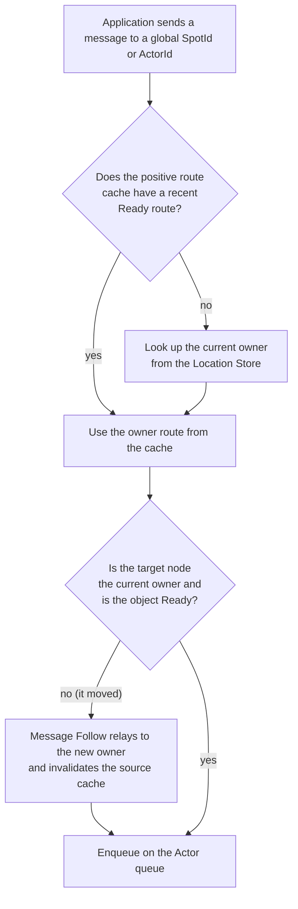

# Spot And Actor

[Spec table of contents](../README.en.md) · [Next: 01. Spot Model](01-spot-model.en.md)

> From a Message that starts with only a SpotId or an ActorId, to finding the
> current owner, to landing in that Actor's queue — this topic covers the three
> Spot kinds (Entry · User · Instance), the identity, membership, and
> relocation of the Actors that live on them, and the path a message actually
> travels to arrive.

## 1. What This Topic Covers

[Spot](../00-foundation/02-glossary.en.md#spot), the unit on which Actors and handlers run,
comes in three kinds — one Entry Spot per node, an explicitly created User
Spot, and an Instance Spot created when its first call arrives. A Spot is
placed on a [MeshNode](../00-foundation/02-glossary.en.md#meshnode), and an
[Actor](04-actor-model.en.md) joins a Spot to obtain an identity and a queue.
When an Application sends a message to a global SpotId or ActorId, the
Framework finds the current owner and enqueues the message on that Actor's
queue — instead of re-resolving location on every message, it reuses a recent
resolution briefly, and refreshes the route when the Actor or Spot moves to
another node. This topic explains that whole flow across nine documents — the
kinds of Spot and how they differ, the path a message takes to reach a Spot,
MeshNode identity and placement, Actor identity and lifecycle, Spot/Actor
membership and relocation, how to create and call a Spot by global address,
the boundary for layering a higher-level model on top of Spot, location
lookup and routing, and the internal implementation of object kinds.

## 2. Who Decides What

| Party | Decides / owns |
|---|---|
| Application | The Actor/Spot creation intent ([Instance intent](../00-foundation/02-glossary.en.md#instance-intent)), the message target sent by global ID, and the specific `ActorRef` used for Session bind. It does not directly specify the address or route of the [Owner](../00-foundation/02-glossary.en.md#owner) — the MeshNode that actually runs the Actor or Spot. |
| Framework (source runtime) | Resolves a global ID to an owner route, manages the positive route cache, and after relocation reroutes messages that arrive at the previous route via Message Follow. |
| Framework (target runtime) | Confirms it is the current owner, that the object is Ready, and that local admission is possible, then enqueues the message on the application queue. |
| [Location Store](../00-foundation/02-glossary.en.md#location-store) | The store that lets multiple nodes confirm each Spot's current owner and status; it records the current owner, incarnation, owner generation, and lease for each Spot/Actor as the authority. |
| MeshNode/relocation runtime | Selects placement candidates for objects, and performs target selection and readiness judgment for join/relocation. |

## 3. The Flow, In One Picture

This diagram shows only the one logical path a message sent by global ID takes
to find its owner and reach the queue. The path to an Actor bound to a
Session, and the path a request reply travels back, are defined by
[08. Spot/Actor Routing](08-routing.en.md) §1; the sequence in which an Actor joins a
Spot is defined by
[05. Spot And Actor Membership](05-spot-actor-membership.en.md).

## 4. Documents In This Topic

| Document | Covers |
|---|---|
| [01. Spot Model](01-spot-model.en.md) | Defines when Entry, User, and Instance Spots are created, what they share and how they differ, and what the lifecycle callbacks are. |
| [02. Spot Messaging](02-spot-messaging.en.md) | Defines the path a message takes to reach a Spot — [Spot direct](../00-foundation/02-glossary.en.md#spot-direct) (naming a single global SpotId), Channel-scoped Logical Multicast, and Subscription — and the queue rules. |
| [03. MeshNode](03-mesh-node.en.md) | Defines MeshNode identity, the conditions for object placement, and the startup/peer admission sequence. |
| [04. Actor Model](04-actor-model.en.md) | Defines Actor identity, queue, control, and the Create/GetOrCreate/Find/destroy lifecycle. |
| [05. Spot And Actor Membership](05-spot-actor-membership.en.md) | Defines [Actor membership](../00-foundation/02-glossary.en.md#actor-membership) — which Entry Spot or User Spot an Actor currently belongs to — the Actor join/commit sequence, and relocation policy. |
| [06. Spot Address And Messaging](06-spot-address-messaging.en.md) | Defines Spot identity/reference, User Spot Create/GetOrCreate, and route cache and close. |
| [07. Stage Wrapper On Spot](07-stage-wrapper-on-spot.en.md) | Defines the boundary for layering a higher-level execution model, such as room or stage, on top of the Spot contract. |
| [08. Spot/Actor Routing](08-routing.en.md) | Defines global ID routing, bound-session relay and reply route, the positive route cache, and the reroute path after relocation. |
| [09. Object Kind And Activation](09-object-lifecycle.en.md) | An implementation spec covering how to distinguish object kinds in code, cold activation, cleanup targets, and memory accounting. |
| [10. Spot Timer](10-spot-timer.en.md) | Defines the contract for the repeating and delayed callbacks a Spot registers — timer generation and cancel, the overrun policy when a tick falls behind, and an implementation whose resources do not grow in proportion to the number of registrations. |

## 5. Find By Question

| Question | Where the answer should be |
|---|---|
| What is a Spot, and what do Entry, User, and Instance share and how do they differ? | This document §1 + [01. Spot Model](01-spot-model.en.md) |
| What is a MeshNode, and under what conditions is an object placed on one? | [03. MeshNode](03-mesh-node.en.md) |
| When a message is sent to a Spot, what path does it actually take to reach the handler? | [02. Spot Messaging](02-spot-messaging.en.md) |
| When is a new Instance Spot created for a Spot name? | [02. Spot Messaging](02-spot-messaging.en.md) · [06. Spot Address And Messaging](06-spot-address-messaging.en.md) |
| What is an Actor, and how does it obtain identity/queue/control? | [04. Actor Model](04-actor-model.en.md) |
| What do I call to create a new Actor or find an existing one? | [04. Actor Model](04-actor-model.en.md) |
| When multiple callers try to create the same object at once, which wins? | [05. Spot And Actor Membership](05-spot-actor-membership.en.md) · [09. Object Kind And Activation](09-object-lifecycle.en.md) |
| What is the sequence for an Actor joining a Spot, and what differs on a different node? | [05. Spot And Actor Membership](05-spot-actor-membership.en.md) |
| How does a message sent to a global SpotId/ActorId find the current owner? | [08. Spot/Actor Routing](08-routing.en.md) §2 |
| What path does a message sent to a Session-bound Actor use? | [08. Spot/Actor Routing](08-routing.en.md) §3 |
| Where do messages go during relocation? | [05. Spot And Actor Membership](05-spot-actor-membership.en.md) · [08. Spot/Actor Routing](08-routing.en.md) §2.5 |
| After an Actor/Spot has moved, what happens to a message that arrives at the previous route? | [08. Spot/Actor Routing](08-routing.en.md) §2.5 · [09. Object Kind And Activation](09-object-lifecycle.en.md) §4 |
| When is a running object cleaned up, and what prevents reuse? | [09. Object Kind And Activation](09-object-lifecycle.en.md) §5·§6 |
| What happens when a Spot timer falls behind, and why does registering more of them not add resources? | [10. Spot Timer](10-spot-timer.en.md) |
| Is location re-resolved on every message, or is a cache used? | [08. Spot/Actor Routing](08-routing.en.md) §2.2 |
| On failure, what is left behind (`NotFound`, `Unavailable`, `InvalidOperation` …)? | The failure/observation section of each document |
| What must be preserved when layering a higher-level model, such as room or stage, on top of Spot? | [07. Stage Wrapper On Spot](07-stage-wrapper-on-spot.en.md) |

## 6. Reading Order

1. [01. Spot Model](01-spot-model.en.md) — learn what the three Spot kinds are first.
2. [02. Spot Messaging](02-spot-messaging.en.md) — learn how a message reaches that Spot (direct/multicast/subscription).
3. [03. MeshNode](03-mesh-node.en.md) — learn the physical layer the message rides on (RID, role, placement).
4. [04. Actor Model](04-actor-model.en.md) — learn the identity/queue/lifecycle of the Actor that lives on the Spot.
5. [05. Spot And Actor Membership](05-spot-actor-membership.en.md) — learn the actual sequence by which an Actor joins/commits to a Spot and its relocation policy.
6. [06. Spot Address And Messaging](06-spot-address-messaging.en.md) — learn how to create and call a User/Instance Spot by global SpotId.
7. [07. Stage Wrapper On Spot](07-stage-wrapper-on-spot.en.md) — learn the boundary for layering a higher-level model on the Spot contract (short and applied, so it comes later).
8. [08. Spot/Actor Routing](08-routing.en.md) — pull together, for every target introduced so far (Spot, Actor, session-bound Actor), which route is actually used to send a message and when location is re-resolved.
9. [09. Object Kind And Activation](09-object-lifecycle.en.md) — implementer-only: learn how object kinds are distinguished in code and when they are created and cleaned up (an implementation spec, so it comes last).
10. [10. Spot Timer](10-spot-timer.en.md) — learn when a repeating job on a Spot runs and what it receives when it falls behind.

## 7. What This Topic Does Not Define

| Content | Owning document |
|---|---|
| [Node direct](../00-foundation/02-glossary.en.md#node-direct) (naming a MeshName and a target RID together), Channel select-one, and their target selection algorithm | 02-channel-transport topic |
| Logical Multicast fanout/wire delivery (the completion contract on the Spot/Actor side is owned by [02. Spot Messaging](02-spot-messaging.en.md)) | 02-channel-transport topic |
| The Session/Actor bind/rebind/disconnect contract itself | [04-session/02-session-actor-binding](../04-session/02-session-actor-binding.en.md) |
| Object queue permit/fairness/host shared-capacity backpressure | 01-execution topic |
| Failure/failover judgment and the outcome of owner failure | [31. Failure And Failover Policy](../05-location-relocation/06-failure-failover-policy.en.md) |
| Error kind definitions | [32. Framework Error Model](../00-foundation/07-framework-error-model.en.md) |

---

[Spec table of contents](../README.en.md) · [Next: 01. Spot Model](01-spot-model.en.md)
</content>
