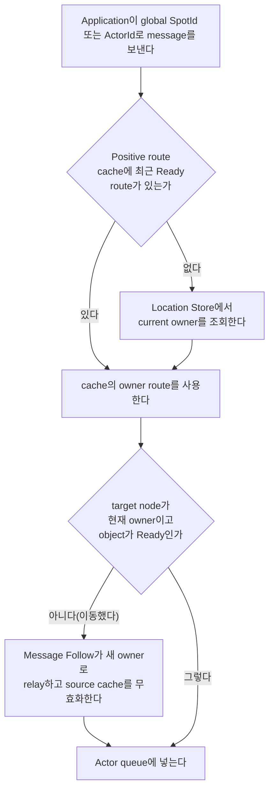

# Spot과 Actor

[스펙 목차](../README.ko.md) · [다음: 01. Spot 모델](01-spot-model.ko.md)

> Message가 SpotId나 ActorId 하나로 출발해 현재 owner를 찾고, 그 Actor의 queue에
> 닿기까지 — 이 주제는 Spot 세 종류(Entry·User·Instance)와 그 위에 사는 Actor의
> identity·membership·relocation, 그리고 message가 실제로 도달하는 경로를 다룬다.

## 1. 무엇을 다루는가

Actor와 handler가 실행되는 단위인 [Spot](../00-foundation/02-glossary.ko.md#spot)에는 세 종류가
있다 — node마다 하나씩 있는 Entry Spot, 명시적으로 만드는 User Spot, 첫 호출이
도착할 때 만들어지는 Instance Spot이다. Spot은 [MeshNode](../00-foundation/02-glossary.ko.md#meshnode)
위에 배치되고, [Actor](04-actor-model.ko.md)는 Spot에 join해서 identity와 queue를
얻는다. Application이 global SpotId나 ActorId로 message를 보내면 Framework가 현재
owner를 찾아 그 Actor의 queue에 넣는다 — 매 message마다 위치를 다시 조회하는 대신
최근 조회 결과를 잠시 재사용하고, Actor나 Spot이 다른 node로 이동하면 그 경로를
갱신한다. 이 주제는 이 전체 흐름 — Spot의 종류와 차이, 메시지가 Spot까지 도달하는
경로, MeshNode의 identity와 배치, Actor의 identity와 lifecycle, Spot·Actor
membership과 relocation, global 주소로 Spot을 만들고 부르는 방법, Spot 위에 상위
모델을 얹는 경계, 위치 조회와 routing, 객체 종류의 내부 구현 — 을 아홉 개 문서로
나눠 설명한다.

## 2. 누가 무엇을 결정하는가

| 주체 | 결정·소유하는 것 |
|---|---|
| Application | Actor·Spot 생성 의도([Instance intent](../00-foundation/02-glossary.ko.md#instance-intent)), global ID로 보내는 message target, Session bind에 쓰는 특정 `ActorRef`를 정한다. Actor나 Spot을 실제로 실행하는 MeshNode인 [Owner](../00-foundation/02-glossary.ko.md#owner)의 주소나 route를 직접 지정하지 않는다. |
| Framework(source runtime) | Global ID를 owner route로 바꾸고, positive route cache를 관리하며, relocation 뒤 Message Follow로 이전 route에 도착한 message를 우회시킨다. |
| Framework(target runtime) | 자신이 current owner인지, object가 Ready인지, local admission이 가능한지 확인한 뒤 application queue에 넣는다. |
| [Location Store](../00-foundation/02-glossary.ko.md#location-store) | 각 Spot의 현재 owner와 상태를 여러 node가 함께 확인하도록 보관하는 저장소로서, Spot·Actor마다 current owner, incarnation, owner generation과 lease를 authority로 기록한다. |
| MeshNode/relocation runtime | Object 배치 후보를 고르고, join·relocation의 target 선택과 준비 판정을 수행한다. |

## 3. 한 흐름으로 보기

이 그림은 global ID로 보낸 message가 owner를 찾아 queue에 닿는 논리적 경로 하나만
보여준다. Session에 bind된 Actor로 가는 경로와 request reply가 돌아가는 경로는
[08. routing](08-routing.ko.md) §1이, Actor가 Spot에 join하는 순서는
[05. spot-actor-membership](05-spot-actor-membership.ko.md)이 각각 정의한다.

## 4. 이 주제의 문서

| 문서 | 다루는 것 |
|---|---|
| [01. Spot 모델](01-spot-model.ko.md) | Entry·User·Instance Spot이 언제 만들어지고, 무엇이 같고 다른지, lifecycle callback은 무엇인지 정의한다. |
| [02. Spot 메시징](02-spot-messaging.ko.md) | global SpotId 하나를 지정해 message를 보내는 [Spot direct](../00-foundation/02-glossary.ko.md#spot-direct), Channel 범위 Logical Multicast와 Subscription으로 message가 Spot까지 가는 경로와 queue 규칙을 정의한다. |
| [03. MeshNode](03-mesh-node.ko.md) | MeshNode의 identity, object 배치 조건과 startup·peer admission 순서를 정의한다. |
| [04. Actor 모델](04-actor-model.ko.md) | Actor의 identity, queue, control과 Create/GetOrCreate/Find/destroy lifecycle을 정의한다. |
| [05. Spot·Actor membership](05-spot-actor-membership.ko.md) | Actor가 현재 어느 Entry Spot 또는 User Spot에 속하는지를 나타내는 [Actor membership](../00-foundation/02-glossary.ko.md#actor-membership) 관계, Actor join/commit 순서와 relocation policy를 정의한다. |
| [06. Spot 주소와 메시징](06-spot-address-messaging.ko.md) | Spot identity·reference, User Spot Create/GetOrCreate, route cache와 close를 정의한다. |
| [07. Stage wrapper on Spot](07-stage-wrapper-on-spot.ko.md) | Spot 계약 위에 room·stage 같은 상위 실행 모델을 얹는 경계를 정의한다. |
| [08. Spot·Actor routing](08-routing.ko.md) | Global ID routing, bound-session relay와 reply route, positive route cache와 relocation 뒤 우회 경로를 정의한다. |
| [09. 객체 종류와 활성화](09-object-lifecycle.ko.md) | 객체 종류를 코드에서 구분하는 방법, cold activation, 정리 대상과 memory 회계를 다루는 구현 스펙이다. |
| [10. Spot timer](10-spot-timer.ko.md) | Spot이 등록하는 반복·지연 callback의 계약 — timer generation과 cancel, 밀렸을 때의 overrun policy, 등록 수가 늘어도 자원이 비례해 늘지 않는 구현을 정의한다. |

## 5. 질문으로 찾기

| 질문 | 답이 있어야 할 자리 |
|---|---|
| Spot이 무엇이고 Entry·User·Instance는 무엇이 같고 다른가 | 이 문서 §1 + [01. Spot 모델](01-spot-model.ko.md) |
| MeshNode는 무엇이고 object는 어떤 조건에서 그 위에 배치되는가 | [03. MeshNode](03-mesh-node.ko.md) |
| 메시지를 Spot으로 보내면 실제로 어떤 경로를 거쳐 handler까지 가는가 | [02. Spot 메시징](02-spot-messaging.ko.md) |
| Spot 이름으로 새 Instance Spot을 언제 만드는가 | [02. Spot 메시징](02-spot-messaging.ko.md) · [06. Spot 주소와 메시징](06-spot-address-messaging.ko.md) |
| Actor는 무엇이고 어떻게 identity·queue·control을 갖는가 | [04. Actor 모델](04-actor-model.ko.md) |
| Actor를 새로 만들거나 이미 있는 걸 찾으려면 무엇을 호출하는가 | [04. Actor 모델](04-actor-model.ko.md) |
| 같은 객체를 여러 caller가 동시에 만들려 하면 무엇이 이기는가 | [05. Spot·Actor membership](05-spot-actor-membership.ko.md) · [09. 객체 종류와 활성화](09-object-lifecycle.ko.md) |
| Actor가 Spot에 join하는 순서는 무엇이고 다른 node면 무엇이 다른가 | [05. Spot·Actor membership](05-spot-actor-membership.ko.md) |
| global SpotId·ActorId로 보낸 message는 현재 owner를 어떻게 찾는가 | [08. Spot·Actor routing](08-routing.ko.md) §2 |
| Session에 bind된 Actor로 보낸 message는 어떤 경로를 쓰는가 | [08. Spot·Actor routing](08-routing.ko.md) §3 |
| 이동(relocation) 중에는 message가 어디로 가는가 | [05. Spot·Actor membership](05-spot-actor-membership.ko.md) · [08. Spot·Actor routing](08-routing.ko.md) §2.5 |
| Actor·Spot이 이동한 뒤에도 이전 경로로 온 message는 어떻게 되는가 | [08. Spot·Actor routing](08-routing.ko.md) §2.5 · [09. 객체 종류와 활성화](09-object-lifecycle.ko.md) §4 |
| 실행 중인 객체를 언제 정리하고 무엇으로 재사용을 막는가 | [09. 객체 종류와 활성화](09-object-lifecycle.ko.md) §5·§6 |
| Spot timer는 밀리면 어떻게 되는가, 몇 개까지 등록해도 자원이 늘지 않는가 | [10. Spot timer](10-spot-timer.ko.md) |
| 매 message마다 위치를 다시 조회하는가, 캐시를 쓰는가 | [08. Spot·Actor routing](08-routing.ko.md) §2.2 |
| 실패하면 무엇이 남는가(`NotFound`, `Unavailable`, `InvalidOperation` …) | 각 문서의 실패·관측 절 |
| Spot 위에 room·stage 같은 상위 모델을 얹으려면 무엇을 지켜야 하는가 | [07. Stage wrapper on Spot](07-stage-wrapper-on-spot.ko.md) |

## 6. 읽는 순서

1. [01. Spot 모델](01-spot-model.ko.md) — Spot 세 종류가 무엇인지 먼저 안다.
2. [02. Spot 메시징](02-spot-messaging.ko.md) — 그 Spot에 메시지가 어떻게 도달하는지 안다(direct·multicast·subscription).
3. [03. MeshNode](03-mesh-node.ko.md) — 메시지가 타는 물리 layer(RID, role, placement)를 안다.
4. [04. Actor 모델](04-actor-model.ko.md) — Spot 위에 사는 Actor의 identity·queue·lifecycle을 안다.
5. [05. Spot·Actor membership](05-spot-actor-membership.ko.md) — Actor가 Spot에 join·commit되는 정확한 순서와 relocation policy를 안다.
6. [06. Spot 주소와 메시징](06-spot-address-messaging.ko.md) — global SpotId로 User/Instance Spot을 만들고 부르는 방법을 안다.
7. [07. Stage wrapper on Spot](07-stage-wrapper-on-spot.ko.md) — Spot 계약 위에 상위 모델을 얹는 경계를 안다(짧고 응용적이므로 뒤로 둔다).
8. [08. Spot·Actor routing](08-routing.ko.md) — 지금까지 나온 모든 대상(Spot·Actor·session-bound Actor)에 실제로 message를 보낼 때 어떤 route를 쓰고 언제 위치를 다시 조회하는지 하나로 모아 안다.
9. [09. 객체 종류와 활성화](09-object-lifecycle.ko.md) — 구현자 전용: 객체 종류를 코드에서 어떻게 구분하고 언제 만들고 정리하는지 안다(구현 스펙이므로 마지막에 읽는다).
10. [10. Spot timer](10-spot-timer.ko.md) — Spot에 반복 작업을 걸 때 언제 실행되고 밀리면 무엇을 받는지 안다.

## 7. 이 주제가 정의하지 않는 것

| 내용 | 소유 문서 |
|---|---|
| MeshName과 target RID를 함께 지정해 특정 MeshNode로 message를 보내는 [Node direct](../00-foundation/02-glossary.ko.md#node-direct), Channel select-one과 그 대상 선택 알고리즘 | 02-channel-transport 주제 |
| Logical Multicast의 fanout·wire 전달(Spot·Actor 쪽 완료 계약은 [02. Spot 메시징](02-spot-messaging.ko.md)이 소유) | 02-channel-transport 주제 |
| Session과 Actor의 bind·rebind·disconnect 자체 계약 | [04-session/02-session-actor-binding](../04-session/02-session-actor-binding.ko.md) |
| Object queue의 permit·fairness·host shared capacity backpressure | 01-execution 주제 |
| Failure·failover 판정과 owner 장애 결과 | [31. Failure와 failover policy](../05-location-relocation/06-failure-failover-policy.ko.md) |
| Error kind 정의 | [32. Framework 오류 모델](../00-foundation/07-framework-error-model.ko.md) |

---

[스펙 목차](../README.ko.md) · [다음: 01. Spot 모델](01-spot-model.ko.md)
