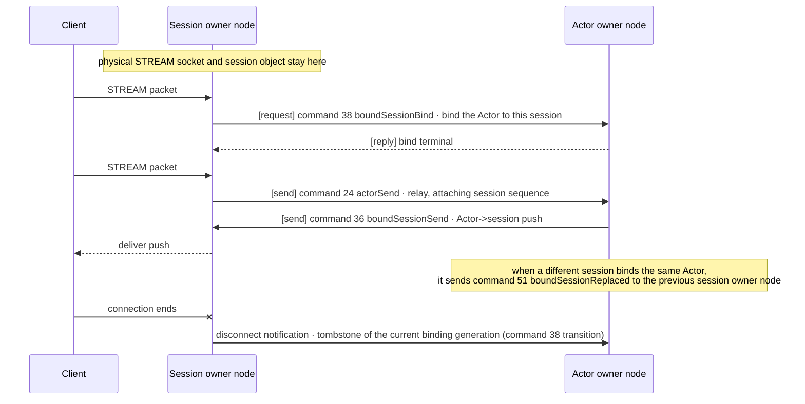

# STREAM Server Session

[Session topic table of contents](README.en.md) · [Spec table of contents](../README.en.md) · [Next: 02. Session And Actor Binding](02-session-actor-binding.en.md)

> Defines the public contract of the [STREAM session](../00-foundation/02-glossary.en.md#stream-session) —
> the execution unit that keeps packet framing and request correlation from the
> moment the server accepts one STREAM connection until it closes.

## 1. STREAM Session Overview

STREAM differs from conventional request-response communication. Connection
lifetime, peer identification, packet framing, and session lifecycle must be
considered before the payload of each individual request.

The framework treats STREAM as a header-based packet session and doesn't
hand the raw byte stream directly to the application. The framework decodes
the stream header, puts packet name and metadata into the dispatch context,
and delivers it to the session callback along with a payload that has not yet
been converted into a business object. The application only uses this session
callback; header framing, packet boundaries, and the payload conversion
surface are defined by this document and
[§6](#6-payload-conversion-and-the-codec-boundary).

The client-side contract of the
[Stream Connector](../00-foundation/02-glossary.en.md#stream-connector) — the client
library that connects to this STREAM model to exchange packets — is defined by the
[Common Spec](../../stream-connector/32-stream-connector.en.md), and the two documents
share the same wire contract. Per-language types and
signatures are fixed by the STREAM document in the
[per-language Server interface table of contents](../languages/README.en.md).

The following is outside the scope of this contract.

- **A recv loop the application runs directly.** The framework's internal
  `recv loop` manages receive order, cancellation, and backpressure, so the
  application doesn't drive a raw receive loop directly
  ([§4](#4-from-connection-accept-to-the-session-callback)).
- **Direct handling of raw chunks.** The application only sees payload in the
  packet units delivered by the session callback.
- **Custom header framing.** The header binary format is an internal protocol
  the framework and connector share — the application isn't given a setting
  to change this format.

## 2. Roles and Responsibilities

| Party | Responsibility |
|---|---|
| Application | Implements the session callback, uses the [packet name](../00-foundation/02-glossary.en.md#packet-name) to determine which packet to process, and uses the framework's common decoder surface. |
| Framework | After acquiring a managed queue permit, pulls one packet, decodes its header, runs the session callback, and manages registration, codec, and error boundaries. |
| Core | Handles actual STREAM transport send/receive, packet boundaries in `PACKET` mode, and the receive pipe HWM. |
| Connector (client side) | Implements the connection and reconnection behavior and the wire contract observed by the client. This document defines only the server side. |

- **Before the first bind in every language, the framework sets the Core STREAM socket to
  `PACKET` mode and receives application packets by pulling with
  `zlink_stream_recv_packet()`.** It does not register a Core STREAM packet callback or raw
  receive callback, and this rule is the same regardless of how a per-language binding
  expresses it. The pull path without a Core callback does not remove the Framework's public
  session lifecycle, packet, or error callbacks or change their call path. Those callbacks run
  behind the managed queue and serial execution gate.
- **The framework does not start a packet pull before it acquires a managed queue permit.**
  Draining Core packets without a permit would prevent the Core receive pipe HWM from acting as
  the backpressure boundary. This is an internal condition that the per-packet pull order in
  [§4](#4-from-connection-accept-to-the-session-callback) must satisfy.

The transport itself handles only header framing — it isn't responsible for
converting the payload into a business object. Session connect and disconnect
lifecycle callbacks are provided as a basic surface, and the error callback
delivers only a transport error attributed to that session, not an
application exception ([§7](#7-error-boundary)).

## 3. Registration and Startup Validation

A stream node is registered explicitly. Implicit registration based on
attributes or decorators isn't provided.

The following .NET excerpt shows how to register a bind endpoint, TLS, and
session type on one Stream node. This example illustrates common behavior and
doesn't require the same signature in other languages; the .NET
contract is defined by the
[.NET Configuration Interface](../languages/dotnet/interfaces/03-configuration-topology.en.md).

```csharp
// Obtained via AddStreamNode(name). name identifies this node inside the
// runtime and can't be registered twice.
public interface IZLinkStreamNodeBuilder
{
    // Required. The address the client connects to. Specify an endpoint
    // string or a single port.
    IZLinkStreamNodeBuilder Bind(string endpoint);
    IZLinkStreamNodeBuilder Bind(int port = 0);
    // Optional. Sets the host the socket opens on and the host advertised to
    // clients separately.
    // The meaning of the two values is defined by the Network Listener
    // Identity document (../02-channel-transport/04-network-listener-identity.en.md).
    IZLinkStreamNodeBuilder SetBindHost(string bindHost);
    IZLinkStreamNodeBuilder SetAdvertiseHost(string advertiseHost);
    // Optional. Cap on client-to-server complete message size (default 64 KiB). Value rule in §9.
    IZLinkStreamNodeBuilder MaxMessageSize(long bytes);
    // Optional. Core STREAM socket option. The items are defined by the per-language interface.
    IZLinkStreamSocketConfig ConfigureSocket();
    // Optional. Enabling TLS requires specifying the certificate/key paths together. Requiring a client certificate defaults to false (§3.1).
    IZLinkStreamNodeBuilder SetTlsServer(
        string certificatePath,
        string keyPath,
        bool requireClientCertificate = false);
    // Required. The session implementation that receives this node's packets. Only one session type per node.
    IZLinkStreamNodeBuilder AddSession<TSession>()
        where TSession : class, IZLinkSession;
}
```

```csharp
options
    .AddStreamNode("gateway")
    .Bind(7400)
    .SetBindHost("0.0.0.0")
    .SetAdvertiseHost("node-a.example.net")
    .MaxMessageSize(64 * 1024) // Cap on the complete STREAM message size received from client to server. Rule in §9.
    .SetTlsServer(
        "server.crt",
        "server.key",
        requireClientCertificate: true)
    .AddSession<GatewaySession>(); // Registers the single session type this node uses.
```

It must be clear at registration time that this node is a header-based packet
path.

### 3.1 TLS

A Stream node can use TLS. Enabling TLS requires specifying a certificate
path and key path together, and the same server TLS configuration specifies
whether a client certificate is required. The default is not to require
it; if set to require it, a connection that fails client-certificate
verification is rejected before a session is built. The client-side transport
choice is determined by the endpoint scheme
([Stream Connector §3](../../stream-connector/32-stream-connector.en.md)).

### 3.2 Startup Validation

The following fail as configuration errors before the host starts.

| Condition | Result |
|---|---|
| The stream node name is empty. | Fails startup as a configuration error. |
| The same stream node name was registered twice. | Node name is a runtime identifier, so this fails startup as a configuration error. |
| No bind endpoint. | Fails startup as a configuration error. |
| Two or more session types were registered on one node. | Fails startup as a configuration error. |
| The same session type was registered on two or more nodes in the same host. | The session type name is a key for finding its factory, so this fails startup as a configuration error. |
| TLS is enabled but the certificate path is empty. | Fails startup as a configuration error. |
| TLS is enabled but the key path is empty. | Fails startup as a configuration error. |
| A client certificate was required without configuring a TLS server. | Fails startup as a configuration error. |

## 4. From Connection Accept to the Session Callback

The framework internally owns the `recv loop` but doesn't expose a raw
receive loop as an application public surface. The application only uses the
session callback, and receive order, cancellation, backpressure, and header
framing are managed by the framework. Transport ingress in every framework
language follows this boundary.

```text
Core receive pipe (PACKET mode)
    -> Framework acquires a managed queue permit
    -> Framework pulls one packet
    -> header decode and managed queue entry
    -> session callback
```

- **The framework's internal `recv loop` acquires a managed queue permit before pulling one
  packet with `zlink_stream_recv_packet()`.** It decodes the pulled packet's header, puts the
  packet on the managed queue, and then runs the public session callback. Framework dispatch,
  DI, and logging can be applied consistently at this queue boundary.
- **The framework does not call `zlink_stream_recv_packet()` while it cannot acquire a
  permit.** Continuing to drain the next packet while unable to enqueue it would mean the Core
  receive pipe HWM no longer acts as the backpressure boundary. It neither discards a pulled
  packet nor redelivers the same packet to the callback. Because the permit is shared by the
  whole host, this pause applies to all supported sockets, not just that connection. Thresholds
  and state transitions are owned by
  [Application Job Queue And Backpressure §6](../01-execution/04-application-job-queue-and-backpressure.en.md#6-pressure-state-and-socket-control).

A Handler filter doesn't apply to STREAM session dispatch. The scope and
execution rules of filters on other dispatches are set by
[Framework API §8.1](../00-foundation/06-framework-api.en.md#10-handler-filter).

A session callback receives a dispatch context holding packet name, metadata,
and request information, along with the payload. The runtime preserves request
header values inside the dispatch context, so the application doesn't build a
header object or pass it into a relay call again. The
[routing ID](../00-foundation/02-glossary.en.md#routing-id) — the peer identity value
obtained from the `recv` result — is delivered to session dispatch without
information loss.

### 4.1 Transport Operation Teardown Boundary

When a physical stream starts closing, the framework stops new packet
admission and completes or cancels in-flight read and write operations on
their owning transport execution context. That completion or cancellation
must be observed before destroying the TCP, TLS, or WebSocket socket, stream,
or session resources. A late-arriving transport callback doesn't reference a
resource that has already been cleaned up, and doesn't complete one operation
twice or start the next operation twice.

## 5. Reply Correlation

The `Response` and `Error` a session builds return the original request's
request sequence as-is. The client only uses this sequence to find the
pending request.

- The `Response`/`Error` header doesn't carry a packet name. A reply doesn't
  select a handler, so that field isn't needed, and filling it with a
  different value per language only breaks diagnostics.
- The typed reply's decode type is the type the client specified at call
  time — not selected by name.
- `Error` also returns the same sequence.

The full rule is defined by the reply correlation contract in the
[Message Model](../00-foundation/05-message-model.en.md).

## 6. Payload Conversion and the Codec Boundary

The framework's basic surface only provides session, session context,
stream, and message. Object conversion is handled by a separate codec
extension operating on the framework message, not the raw transport message,
and a specific codec implementation isn't directly mixed into raw transport
or the framework's basic runtime.

A session handler doesn't directly call a per-codec helper. Business code uses
the same decode surface regardless of whether the codec is JSON, Protobuf,
MessagePack, or custom.

The server framework, HTTP client host, and stream connector share the codec
number, content-type, and typed-payload-selection contract, but don't share a
registry instance. The server owns a per-server-root registry, the HTTP
client owns a per-host registry
([HTTP Client §5](../../http-client/12-http-client.en.md#5-codec)), and the
connector owns a per-connector-instance typed codec option
([Stream Connector §5.4](../../stream-connector/32-stream-connector.en.md#54-codec)).

## 7. Error Boundary

| Error | Where it goes |
|---|---|
| A transport error attributed to that session | Delivered to the session error callback. |
| Handshake failure | A failure before the session was built, so there's no target for a session callback. It is recorded only in runtime monitoring. |
| A socket/node-level error | Can't be attributed to a single specific session, so a session callback isn't run — it's recorded in runtime monitoring. |
| An application handler exception | Not a transport error, so the session error callback isn't run — the handler exception-handling path is used instead. |

The session error callback is limited to surfacing a monitor-observable
transport error at the session level.

The termination reason when a session closes matches the closed set in
[Stream Connector §6.3](../../stream-connector/32-stream-connector.en.md#63-close-reason),
and the corresponding instrument is owned by
[runtime-metrics §4](../06-observability/02-runtime-metrics.en.md).

## 8. From Session to Actor

A session callback doesn't directly change [Spot](../00-foundation/02-glossary.en.md#spot)
state. It only submits an Actor dispatch or Spot call
([Stage Wrapper On Spot §3](../03-spot-actor/07-stage-wrapper-on-spot.en.md#3-preserving-the-spot-turn)).

Even if the Actor is on a different [MeshNode](../00-foundation/02-glossary.en.md#meshnode),
the physical STREAM socket and session object stay on the current session
[owner](../00-foundation/02-glossary.en.md#owner) node. The only things that cross a node
boundary are the four application-path record kinds in the following diagram
and the three relocation control record kinds (42, 43, 44) exchanged only
while the Actor is relocating. This diagram is a physical-layer diagram
showing only what stays on which node and what crosses the boundary — the
logical order of bind, relay, and replacement is defined by the diagram in
[Session And Actor Binding](02-session-actor-binding.en.md).



While the Actor is relocating to another node, the relocation coordinator and
target runtime send commands 42, 43, 44 to the Session owner node. Their
order and the Session owner's responsibility are defined by
[Session And Actor Binding "8. The Session's Responsibility During Actor Relocation"](02-session-actor-binding.en.md#8-the-sessions-responsibility-during-actor-relocation).

The framework delivers only these records between MeshNodes and doesn't
expose the target Node RID,
[binding generation](../00-foundation/02-glossary.en.md#binding-generation) (the order in
which a binding was replaced within the same session owner process
lifecycle), the authority fence, or these commands' codec to the application.
When closing a session, a tombstone of the current binding generation is
submitted, so a late-arriving close from a previous bind can't release a new
binding.

The contract for passing a packet received by a session to the Actor,
rebinding and replacement of the previous connection, and the Session's
responsibility during Actor relocation is defined by
[Session And Actor Binding](02-session-actor-binding.en.md). In particular,
the order in which the previous connection is cleaned up when a new session
binds the same Actor is defined by
[Session And Actor Binding "6. Rebind And Replacing The Previous Connection"](02-session-actor-binding.en.md#6-rebind-and-replacing-the-previous-connection),
and the responsibility the physical session carries while the Actor
relocates to another node is defined by
[Session And Actor Binding "8. The Session's Responsibility During Actor Relocation"](02-session-actor-binding.en.md#8-the-sessions-responsibility-during-actor-relocation).

## 9. Numbers and Limits

| Item | Value | Scope |
|---|---|---|
| [`MaxMessageSize`](../00-foundation/02-glossary.en.md#max-message-size) | Default `64 KiB` | The complete inbound message (the sum of header bytes and payload bytes, excluding the 6-byte prefix). Applies only to messages coming from client to server, not to messages sent from server to client. |

`0` is delivered to Core as `-1`, meaning no separate Framework cap is used.
A positive value is a finite cap, and a negative value is a startup
configuration error.

A message above the cap isn't delivered to the session handler even
partially; the server records `EMSGSIZE` and closes the connection. No error
code is sent to a raw client, so the client observes only the connection
closing.

The host permit rule shared by STREAM packets and cross-node Session records
is owned by
[Application Job Queue And Backpressure "3. Ordinary Ingress Permit Order"](../01-execution/04-application-job-queue-and-backpressure.en.md#3-ordinary-ingress-permit-order).

## 10. Verification Requirements

The following items are confirmed using only the public surface — the session
registration builder, session callback and dispatch context, the send
result/connection termination a client observes, `Response`/`Error` headers,
and the inter-node wire records. Each item leads to one contract test.

**Connection and dispatch**

- A packet a client sends reaches the session callback as a dispatch context
  holding packet name, metadata, and payload.
- The public surface and execution of session lifecycle, packet, and error
  callbacks do not change on the STREAM packet-pull path, and packets reach
  the public session callback.
- While the session callback can't consume the managed queue, a client that
  keeps sending stalls at the Core receive pipe HWM on the client side. Once
  the queue drains, packets reach the callback in order exactly once each —
  none are dropped or delivered twice. §2's `PACKET` mode rule and §4's managed
  queue rule are confirmed by this observation.
- The dispatch context's [routing ID](../00-foundation/02-glossary.en.md#routing-id) equals
  the peer identity value from the recv result.
- When the connector authenticates and sends a packet, authentication and
  packet dispatch complete on the session node.
- Terminating the stream fails a pending request, and messaging resumes
  after authenticating and binding on a new session.

**Registration**

- Registering two session types on the same node fails startup as a
  configuration error. Each remaining condition in
  [§3.2](#32-startup-validation) also produces the same result.
- Sending a message above `MaxMessageSize` closes the connection without the
  session handler receiving any part of that message. `EMSGSIZE` is recorded
  on the server side, and the client observes only the termination.

**Response and error**

- A `Response`/`Error` header a session builds has no packet name, and the
  client matches by request sequence alone to complete normally.
- Handshake failure and socket-level errors don't run the session error
  callback and are only recorded in runtime monitoring.

**The path to the Actor**

- Binding and relaying to an Actor on a different MeshNode keeps the
  physical STREAM socket on the session owner node, and only command
  38/24/36/51 records are exchanged between nodes. During Actor relocation,
  commands 42/43/44 are added to this, and no other record is exchanged.

---

[Session topic table of contents](README.en.md) · [Spec table of contents](../README.en.md) · [Next: 02. Session And Actor Binding](02-session-actor-binding.en.md)
