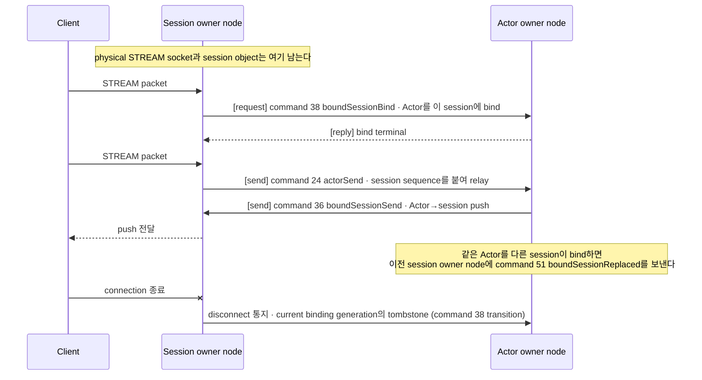

# STREAM 서버 session

[Session 주제 목차](README.ko.md) · [스펙 목차](../README.ko.md) · [다음: 02. Session과 Actor binding](02-session-actor-binding.ko.md)

> STREAM 연결 하나를 서버가 수락한 시점부터 닫는 시점까지, packet framing과 request
> correlation을 유지하는 실행 단위 — [STREAM session](../00-foundation/02-glossary.ko.md#stream-session) —
> 의 공개 계약을 정의한다.

## 1. STREAM session 개요

STREAM은 일반 request-response와 성격이 다르다. 연결 수명, peer 식별, packet framing과
session lifecycle이 request 하나하나의 payload보다 먼저 확인해야 하는 축이 된다.

Framework는 STREAM을 header 기반 packet session으로 처리하며, raw byte stream을
application에 그대로 넘기지 않는다. Framework는 stream header를 decode해 packet name과
metadata를 dispatch context에 넣고, 아직 업무 객체로 변환하지 않은 payload와 함께
session callback에 전달한다. Application은 이 session callback만 사용하며 header
framing, packet 경계와 payload 변환 표면은 이 문서와 [§6](#6-payload-변환과-codec-경계)이
정의한다.

Client가 이 STREAM 모델에 접속해 packet을 주고받는 client library인
[Stream Connector](../00-foundation/02-glossary.ko.md#stream-connector)의 client 쪽
계약은 [공통 스펙](../../stream-connector/32-stream-connector.ko.md)이 정의하며, 두
문서는 같은 wire 계약을 공유한다. 언어별 type과 signature는
[언어별 Server interface 목차](../languages/README.ko.md)의 STREAM 문서가 고정한다.

다음은 이 계약의 범위 밖이다.

- **Application이 직접 실행하는 recv loop.** Framework 내부 `recv loop`가 수신 순서·취소·backpressure를
  관리하므로 application은 raw receive loop를 직접 구동하지 않는다([§4](#4-연결-수락부터-session-callback까지)).
- **Raw chunk 직접 처리.** Application은 session callback이 전달하는 packet 단위로만 payload를 본다.
- **사용자 정의 header framing.** Header binary 형식은 Framework와 connector가 공유하는 내부
  protocol이며, application이 이 형식을 바꾸는 설정은 제공하지 않는다.

## 2. 역할과 책임

| 주체 | 책임 |
|---|---|
| Application | Session callback을 구현하고, [packet name](../00-foundation/02-glossary.ko.md#packet-name)으로 처리할 packet을 구분해 Framework 공통 decoder 표면을 사용한다. |
| Framework | managed queue permit을 확보한 뒤 packet 하나를 pull하고, header를 decode해 session callback을 실행하며 등록·codec·오류 경계를 관리한다. |
| Core | STREAM transport의 실제 송수신, PACKET mode의 packet 경계와 receive pipe HWM을 담당한다. |
| Connector(client 쪽) | Client가 관찰하는 연결·재연결과 wire 계약을 구현한다. 이 문서는 server 쪽만 정의한다. |

- **Framework는 모든 언어에서 첫 bind 전에 Core STREAM socket을 `PACKET` mode로 설정하고,
  `zlink_stream_recv_packet()` pull로 application packet을 받는다.** Core STREAM packet
  callback이나 raw receive callback을 등록하지 않으며, 이 규칙은 언어별 binding의 표현이
  달라도 같다. Core callback을 등록하지 않는 pull 경로는 Framework의 public session
  lifecycle·packet·오류 callback을 제거하거나 그 호출 경로를 바꾸지 않는다. 이
  callback들은 managed queue와 serial execution gate 뒤에서 실행된다.

- **Framework는 managed queue permit을 확보하기 전에는 packet pull을 시작하지 않는다.**
  Permit 없이 Core packet을 계속 drain하면 Core receive pipe HWM이 backpressure 경계로
  동작하지 못하기 때문이다. 이 규칙은 [§4](#4-연결-수락부터-session-callback까지)의
  packet별 pull 순서가 내부적으로 만족해야 하는 조건이다.

Transport 본체는 header framing까지만 처리하며 payload의 업무 객체 변환은 담당하지 않는다.
Session 연결과 연결 해제 lifecycle callback을 기본 표면으로 제공하고, 오류 callback에는
application 예외가 아니라 해당 session에 귀속되는 transport 오류만 전달한다([§7](#7-오류-경계)).

## 3. 등록과 startup 검증

Stream node는 명시적으로 등록한다. Attribute나 decorator 기반의 암시적 등록은 제공하지 않는다.

다음 .NET 발췌는 bind endpoint, TLS와 session type을 한 Stream node에 등록하는 방법을
보여준다. 이 예시는 공통 동작을 설명하는 예시이며 다른 언어에 같은 signature를 요구하지 않는다.
정확한 .NET 계약은
[.NET configuration interface](../languages/dotnet/interfaces/03-configuration-topology.ko.md)가
정의한다.

```csharp
// AddStreamNode(name)으로 얻는다. name은 runtime 안에서 이 node를 식별하며 중복 등록할 수 없다.
public interface IZLinkStreamNodeBuilder
{
    // 필수. client가 접속하는 주소. endpoint 문자열 또는 port 하나로 지정한다.
    IZLinkStreamNodeBuilder Bind(string endpoint);
    IZLinkStreamNodeBuilder Bind(int port = 0);
    // 선택. socket을 여는 host와 client에 알리는 host를 따로 정한다.
    // 두 값의 의미는 Network listener identity 문서가 정의한다 (../02-channel-transport/04-network-listener-identity.ko.md).
    IZLinkStreamNodeBuilder SetBindHost(string bindHost);
    IZLinkStreamNodeBuilder SetAdvertiseHost(string advertiseHost);
    // 선택. client→server complete message 크기 상한 (기본 64 KiB). 값 규칙은 §9.
    IZLinkStreamNodeBuilder MaxMessageSize(long bytes);
    // 선택. Core STREAM socket option. 항목은 언어별 interface가 정의한다.
    IZLinkStreamSocketConfig ConfigureSocket();
    // 선택. TLS를 켜면 인증서·key 경로를 함께 지정한다. client 인증서 요구는 기본 false (§3.1).
    IZLinkStreamNodeBuilder SetTlsServer(
        string certificatePath,
        string keyPath,
        bool requireClientCertificate = false);
    // 필수. 이 node의 packet을 받는 session 구현. node 하나에 session type 하나만.
    IZLinkStreamNodeBuilder AddSession<TSession>()
        where TSession : class, IZLinkSession;
}
```

```csharp
options
    .AddStreamNode("gateway")
    .Bind(7400)
    .SetBindHost("0.0.0.0")
    .SetAdvertiseHost("node-a.example.net")
    .MaxMessageSize(64 * 1024) // client에서 server로 받는 complete STREAM message 크기 상한이다. 규칙은 §9.
    .SetTlsServer(
        "server.crt",
        "server.key",
        requireClientCertificate: true)
    .AddSession<GatewaySession>(); // 이 node에서 사용할 session type 하나를 등록한다.
```

등록 시점에 이 node가 header 기반 packet 경로라는 사실이 분명히 드러나야 한다.

### 3.1 TLS

Stream node는 TLS를 사용할 수 있다. TLS를 켜면 인증서 경로와 key 경로를 함께 지정해야 하며,
client 인증서를 요구할지는 같은 server TLS 설정에서 선택한다. 기본값은
요구하지 않는 것이며, 요구하도록 설정하면 client certificate 검증에 실패한
연결은 session을 만들기 전에 거부한다. Client 쪽 transport 선택은 endpoint scheme이
결정한다([Stream Connector §3](../../stream-connector/32-stream-connector.ko.md)).

### 3.2 Startup 검증

다음은 host 시작 전에 설정 오류로 실패한다.

| 조건 | 결과 |
|---|---|
| Stream node 이름이 비어 있다. | 설정 오류로 startup에 실패한다. |
| 같은 stream node 이름을 두 번 등록했다. | Node 이름은 runtime 식별자이므로 설정 오류로 startup에 실패한다. |
| Bind endpoint가 없다. | 설정 오류로 startup에 실패한다. |
| 한 node에 session type을 둘 이상 등록했다. | 설정 오류로 startup에 실패한다. |
| 같은 host 안에서 같은 session type을 둘 이상의 node에 등록했다. | Session type 이름이 factory를 찾는 key이므로 설정 오류로 startup에 실패한다. |
| TLS를 켰지만 인증서 경로가 비어 있다. | 설정 오류로 startup에 실패한다. |
| TLS를 켰지만 key 경로가 비어 있다. | 설정 오류로 startup에 실패한다. |
| TLS server를 설정하지 않고 client 인증서를 요구했다. | 설정 오류로 startup에 실패한다. |

## 4. 연결 수락부터 session callback까지

Framework는 내부에서 `recv loop`를 소유하지만 raw receive loop를 application 공개 표면으로
노출하지 않는다. Application은 session callback만 사용하고, 수신 순서·취소·backpressure와
header framing은 Framework가 관리한다. 모든 Framework 언어의 transport ingress는 다음
경계를 따른다.

```text
Core receive pipe (PACKET mode)
    -> Framework가 managed queue permit을 확보
    -> Framework가 packet 한 건을 pull
    -> header decode와 managed queue 진입
    -> session callback
```

- **Framework 내부 `recv loop`는 managed queue permit을 먼저 확보한 뒤에만
  `zlink_stream_recv_packet()`으로 packet 한 건을 pull한다.** Pull한 packet의 header를
  decode해 managed queue에 넣은 뒤 public session callback을 실행한다. 이 queue 경계에서
  Framework의 dispatch, DI와 logging을 일관되게 적용할 수 있기 때문이다.
- **Framework는 permit을 확보하지 못한 동안 `zlink_stream_recv_packet()`을 호출하지 않는다.**
  Queue에 넣을 수 없는 상태에서 다음 packet을 계속 drain하면 Core receive pipe의 HWM이 더
  이상 backpressure 경계로 동작하지 못한다. Pull한 packet을 버리거나 같은 packet을 callback으로
  재전달하지 않는다. Permit은 host 전체가 공유하므로 이 중단은 그 연결 하나가 아니라 지원
  socket 전체에 적용된다. 임계값과 상태 전이는
  [Application job queue와 backpressure §6](../01-execution/04-application-job-queue-and-backpressure.ko.md#6-pressure-상태와-socket-제어)이
  소유한다.

STREAM session dispatch에는 Handler filter를 적용하지
않는다. 다른 dispatch의 filter 적용 범위와 실행 규칙은
[Framework API §8.1](../00-foundation/06-framework-api.ko.md#10-handler-filter)이 정한다.

Session callback은 packet name, metadata와 request 정보를 담은 dispatch context와 payload를
받는다. Runtime은 request header 값을 dispatch context 안에 보존하므로 application이 header
객체를 만들거나 relay 호출에 다시 넘기지 않는다. `recv` 결과에서 얻은 peer 식별 값인
[routing ID](../00-foundation/02-glossary.ko.md#routing-id)는 session dispatch까지 정보 손실 없이 전달된다.

### 4.1 Transport 종료 경계

Physical stream을 닫기 시작하면 Framework는 새 packet admission을 막고, 진행 중인 read와
write operation을 소유한 transport 실행 문맥에서 완료하거나 취소한다. TCP, TLS 또는 WebSocket
socket·stream·session resource를 파괴하기 전에 이 completion 또는 cancellation이 관찰되어야
한다. 늦게 도착한 transport callback은 이미 정리된 resource를 참조하지 않으며, 하나의
operation을 두 번 완료하거나 다음 operation을 중복 시작하지 않는다.

## 5. Reply 상관관계

Session이 만드는 `Response`와 `Error`는 원본 request의 request sequence를 그대로 반환한다.
Client는 이 sequence만으로 pending request를 찾는다.

- `Response`·`Error` header에 packet name을 담지 않는다. 응답은 handler를 고르지 않으므로 그
  필드가 필요 없고, 언어마다 다른 값을 채워 넣으면 진단만 어긋난다.
- typed reply의 decode 타입은 client가 호출 시 지정한 타입이다. 이름으로 고르지 않는다.
- `Error`도 같은 sequence로 되돌린다.

전체 규칙은 [메시지 모델](../00-foundation/05-message-model.ko.md)의 reply correlation 계약이 정의한다.

## 6. Payload 변환과 codec 경계

Framework 기본 표면은 session, session context, stream과 message까지만 제공한다. 객체
변환은 raw transport message가 아니라 framework message와 별도 codec extension이 맡으며,
raw transport나 framework 기본 runtime에 특정 codec 구현을 직접 섞지 않는다.

Session handler는 codec별 helper를 직접 호출하지 않는다. JSON·Protobuf·MessagePack·custom
codec을 바꿔도 업무 코드는 같은 decode 표면을 쓴다.

Server framework, HTTP client host와 stream connector는 codec 번호, content-type과 typed
payload 선택 계약을 공유하지만 registry instance는 공유하지 않는다. Server는 server root별
registry, HTTP client는 host별 registry([HTTP Client §5](../../http-client/12-http-client.ko.md#5-codec)),
connector는 connector instance별 typed codec option
([Stream Connector §5.4](../../stream-connector/32-stream-connector.ko.md#54-codec))을 소유한다.

## 7. 오류 경계

| 오류 | 어디로 가는가 |
|---|---|
| 해당 session에 귀속되는 transport 오류 | Session 오류 callback으로 전달한다. |
| Handshake 실패 | Session이 만들어지기 전의 실패이므로 session callback을 실행할 대상이 없다. Runtime monitoring에만 기록한다. |
| Socket·node 단위 오류 | 특정 session 하나의 오류로 확정할 수 없으므로 session callback을 실행하지 않고 Runtime monitoring에 기록한다. |
| Application handler 예외 | Transport 오류가 아니므로 session 오류 callback을 실행하지 않고 handler 예외 처리 경로를 사용한다. |

Session 오류 callback은 monitor에서 관찰 가능한 transport 오류를 session 단위로 다시
올려주는 축으로만 제한한다.

세션이 닫힐 때의 종료 사유는
[Stream Connector §6.3](../../stream-connector/32-stream-connector.ko.md#63-종료-사유)의
닫힌 집합과 정합하며, 계기는
[runtime-metrics §4](../06-observability/02-runtime-metrics.ko.md)가 소유한다.

## 8. Session에서 Actor로

Session callback은 [Spot](../00-foundation/02-glossary.ko.md#spot) 상태를 직접 변경하지 않는다. Actor
dispatch나 Spot 호출을 제출하는 데까지만 처리한다
([Stage wrapper on Spot §3](../03-spot-actor/07-stage-wrapper-on-spot.ko.md#3-spot-turn-보존)).

Actor가 다른 [MeshNode](../00-foundation/02-glossary.ko.md#meshnode)에 있어도 physical STREAM socket과
session object는 현재 session [owner](../00-foundation/02-glossary.ko.md#owner) node에 남는다. Node 경계를
넘는 것은 다음 그림의 application 경로 record 네 종류와, Actor가 이동하는 동안에만 오가는
relocation control record 세 종류(42·43·44)뿐이다. 이 그림은 무엇이 어느 node에 머물고 무엇이
경계를 넘는지만 보여주는 물리 층 그림이며, bind·relay·교체의 논리 순서는
[Session과 Actor binding](02-session-actor-binding.ko.md)의 그림이 정의한다.



Actor가 다른 node로 이동하는 동안에는 relocation coordinator와 target runtime이 Session
owner node에 command 42·43·44를 보낸다. 그 순서와 Session owner의 책임은
[Session과 Actor binding 「8. Actor relocation 중 Session의 책임」](02-session-actor-binding.ko.md#8-actor-relocation-중-session의-책임)이
정의한다.

Framework는 이 record들만 MeshNode 사이로 전달하고 target Node RID,
[binding generation](../00-foundation/02-glossary.ko.md#binding-generation)(같은 session owner process
lifecycle 안에서 binding이 교체된 순서), authority fence와 이 command들의 codec을 application에
노출하지 않는다. Session을 닫을 때는 current binding generation의 tombstone을 제출하므로 이전
bind에서 늦게 도착한 close가 새 binding을 해제하지 못한다.

Session이 받은 packet을 Actor로 넘기는 계약, rebind와 이전 연결 교체, Actor relocation 중
Session의 책임은 [Session과 Actor binding](02-session-actor-binding.ko.md)이 정의한다. 특히
같은 Actor에 새 session이 bind될 때 이전 연결을 정리하는 순서는
[Session과 Actor binding 「6. Rebind와 이전 연결 교체」](02-session-actor-binding.ko.md#6-rebind와-이전-연결-교체)가,
Actor가 다른 node로 이동하는 동안 physical session이 지는 책임은
[Session과 Actor binding 「8. Actor relocation 중 Session의 책임」](02-session-actor-binding.ko.md#8-actor-relocation-중-session의-책임)이
정의한다.

## 9. 수치와 제한

| 항목 | 값 | 적용 범위 |
|---|---|---|
| [`MaxMessageSize`](../00-foundation/02-glossary.ko.md#max-message-size) | 기본 `64 KiB` | Complete inbound message(6-byte prefix를 제외한 header byte와 payload byte의 합). Client에서 server로 들어오는 message에만 적용하고, server에서 client로 보내는 message에는 적용하지 않는다. |

`0`은 별도 Framework 상한을 쓰지 않도록 Core에 `-1`을 전달한다. 양수는 유한한 상한이며, 음수는
startup configuration error다.

상한을 넘은 message는 session handler에 일부도 전달하지 않고 server 측에 `EMSGSIZE`를 기록한 뒤
연결을 종료한다. Raw client에는 error code를 보내지 않으므로 client는 연결 종료만 관찰한다.

STREAM packet과 cross-node Session record가 공유하는 host permit 규칙은
[Application job queue와 backpressure 「3. Ordinary ingress permit 순서」](../01-execution/04-application-job-queue-and-backpressure.ko.md#3-ordinary-ingress-permit-순서)가 소유한다.

## 10. 검증 요구

공개 표면(session 등록 builder, session callback과 dispatch context, client가 관찰하는 send
결과·연결 종료, `Response`·`Error` header, node 사이 wire record)만으로 다음을 확인한다. 각
항목은 contract test 하나로 이어진다.

**연결과 dispatch**

- Client가 보낸 packet은 packet name, metadata와 payload를 담은 dispatch context로 session
  callback에 도달한다.
- STREAM packet pull 경로에서도 session lifecycle·packet·오류 callback의 공개 표면과
  실행은 바뀌지 않으며, packet은 public session callback에 도달한다.
- Session callback이 managed queue를 소비하지 못하는 동안 client가 계속 보내면 client 쪽 send가
  Core receive pipe HWM에 걸려 멈춘다. Queue가 풀리면 packet은 순서대로 한 번씩만 callback에
  도달한다 — 폐기되거나 두 번 전달되는 packet이 없다. §2의 PACKET mode 규칙과 §4의 managed queue
  규칙은 이 관찰로 확인한다.
- Dispatch context의 [routing ID](../00-foundation/02-glossary.ko.md#routing-id)는 recv 결과의 peer 식별 값과
  같다.
- Connector가 인증하고 packet을 보내면 session node에서 인증과 packet dispatch가 완료된다.
- Stream을 종료하면 pending request가 실패하고, 새 session에서 인증·bind한 뒤 messaging이
  재개된다.

**등록**

- 같은 node에 session type을 둘 등록하면 startup이 설정 오류로 실패한다.
  [§3.2](#32-startup-검증)의 나머지 조건도 각각 같은 결과다.
- `MaxMessageSize`를 넘는 message를 보내면 session handler는 그 message의 어느 부분도 받지 않고
  연결이 종료된다. Server 측에 `EMSGSIZE`가 기록되고 client는 종료만 관찰한다.

**응답과 오류**

- Session이 만든 `Response`·`Error` header에는 packet name이 없고, client는 request sequence만으로
  매칭해 정상 완료한다.
- Handshake 실패와 socket 단위 오류는 session 오류 callback을 실행하지 않고 runtime monitoring에만
  기록된다.

**Actor로 이어지는 경로**

- 다른 MeshNode의 Actor를 bind하고 relay하면 physical STREAM socket은 session owner node에 남고,
  node 사이에는 command 38·24·36·51 record만 오간다. Actor relocation 중에는 여기에 command
  42·43·44가 더해지고, 그 밖의 record는 오가지 않는다.

---

[Session 주제 목차](README.ko.md) · [스펙 목차](../README.ko.md) · [다음: 02. Session과 Actor binding](02-session-actor-binding.ko.md)
