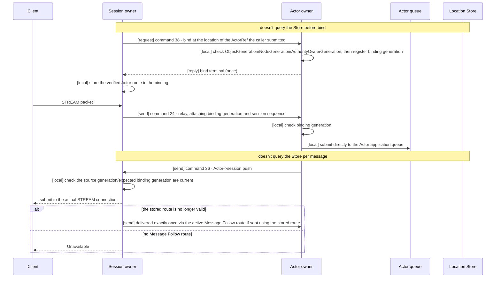
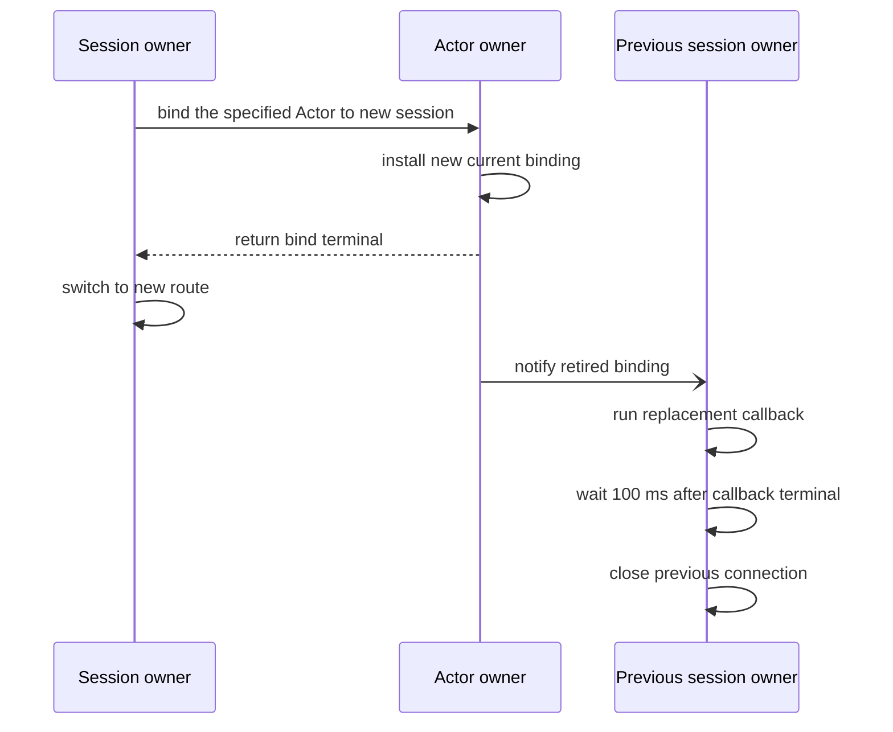
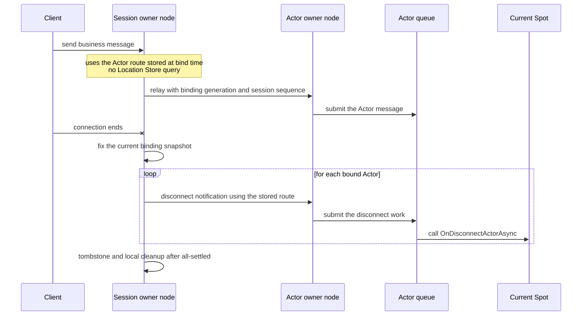
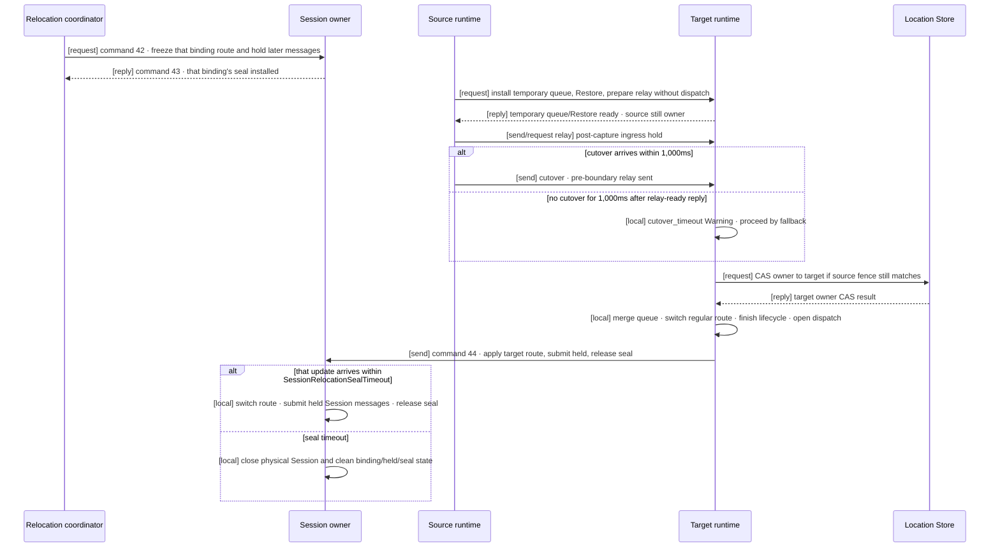

# Session and Actor Binding

[Session topic table of contents](README.en.md) · [Spec table of contents](../README.en.md) · [Previous: 01. STREAM Server Session](01-stream-session.en.md)

> This document defines the typed dispatch, binding, owner handoff, and
> execution order connecting a STREAM session and the Actor runtime. It
> describes the responsibility boundaries of the Application, Runtime, Actor
> owner, and relocation runtime, and the normal flow and failure rules, as
> the contract a caller depends on, and together carries the
> execution-engine structure and swap order that satisfy that contract as
> implementation rules every language runtime must follow.

## 1. Session–Actor Binding Overview

The application only uses the session object, `ActorRef`, typed
payload/reply, and the bound-session API. It doesn't directly assemble or
hold Node RID, STREAM transport handle, raw relay envelope, request
sequence, [AuthorityOwnerGeneration](../00-foundation/02-glossary.en.md#authorityownergeneration),
or endpoint.

This document calls the number that distinguishes different incarnations of the same
Actor [ObjectGeneration](../00-foundation/02-glossary.en.md#objectgeneration); it stays
the same when an Actor relocates to another node as long as it's the same
incarnation, and once an Actor is destroyed, an incarnation created later under the
same ActorId gets a new value that invalidates the previous binding. The logical
instance an Actor belongs to is called a
[Spot](../00-foundation/02-glossary.en.md#spot), and different Actors aren't
serialized into a session's execution context, so that processing a packet from
one client doesn't hold that whole Spot. Execution order between Actors is determined by
the Actor model's execution mode. The current owner location of a Spot and an
Actor is kept by the [Location Store](../00-foundation/02-glossary.en.md#location-store)
so multiple nodes can check it together; as shown below, this document's binding
doesn't re-query that store on every message.

The overall flow has the following five steps.

1. A session callback authenticates the client and decides the domain Actor
   identity and type.
2. Using the global ActorId, it looks up an `ActorRef` that's finished creation and
   initialization and so can receive messages —
   [Ready](../00-foundation/02-glossary.en.md#ready) — or explicitly creates an Actor
   according to application policy.
3. It binds the session and Actor via a
   [binding token](../00-foundation/02-glossary.en.md#binding-token).
4. The session handler submits typed payload to the current Actor route.
5. The Actor handler returns a typed reply, or sends a one-way push to the
   current bound session.

| Question to check | Contract |
|---|---|
| How many Actors can one session bind | It can bind multiple Actors. |
| How many sessions can one Actor bind at once | One. Once a new binding is confirmed, the previous binding is invalidated. |
| How Actor location is found for each message | Uses the route confirmed at bind time. The Location Store isn't re-queried when relaying. |
| Route and location after an Actor moves to another node | After a relocation commit, the framework updates the Actor route and bound-session current Actor location snapshot kept in the session to the target. `ActorId`/`ObjectGeneration` are kept. |
| How an Actor can learn a connection dropped | The framework automatically notifies every Actor in the current binding snapshot. |

## 2. Roles and Responsibilities

| Party | Responsibility |
|---|---|
| Application | Decides the domain identity in the session callback and binds an `ActorRef`. Doesn't directly build a [binding route](../00-foundation/02-glossary.en.md#binding-route) (the Actor delivery path a session owner keeps), a Location row, or a global proxy between sessions. |
| Session owner | Keeps the binding token, route, and generation, and performs relay, rebind, disconnect, and the route switch during relocation. |
| Actor owner | Validates bind/rebind requests, registers the binding generation, and keeps exactly one current binding. |
| Relocation runtime | Chooses the target for Actor/Spot moves, decides readiness, and accesses the Location Store. Only requests seal installation and route application from the Session owner. |

Validating the same value twice can produce a different result per language,
depending on when the value changes during a retry. `SessionBindingAggregate`
is the name for the collection of Session-side validation that handles
physical Session identity, binding generation, `ActorId`/`ObjectGeneration`,
relocation identity, and route change in one serial execution span. This
aggregate doesn't select a relocation target, doesn't read or write the
Location Store, and doesn't revalidate Actor authority. Validation
responsibility is placed once per boundary, as follows.
[Message Follow](../00-foundation/02-glossary.en.md#message-follow), named in the table
below, is the action of forwarding, on behalf of the new owner, a message that
arrives at the previous owner after a relocation; this boundary doesn't revalidate
it either.

| Boundary | Value validated once | Where it isn't revalidated |
|---|---|---|
| Transport ingress | Authenticated peer RID/node generation, frame shape | Target queue, Session owner |
| Target handoff (relocation) | Source owner fence, target fence, Store version, Restore and cutover or the 1,000 ms fallback | Source, Message Follow, Session owner |
| Session owner (`SessionBindingAggregate`) | Physical Session identity/SessionRid, binding generation and the `ActorId`/`ObjectGeneration` it points to, relocation identity | Actor Join, host relocation, Message Follow, route cache |

## 3. Startup Conditions

`EnableActorDispatch()` doesn't take a
[`MeshName`](../00-foundation/02-glossary.en.md#meshname), the name identifying one of
several physical connection groups; it enables global object dispatch capability. Startup confirms that the same process has at least one Object `Client` or
`Server` role and a Location Store configured.

Having multiple Meshes configured isn't an error. Global ActorId authority
finds the current Mesh and owner. A MeshNode isn't needed if a STREAM-only
node doesn't use Actor dispatch.

| Condition | Result |
|---|---|
| There's no Object `Client`/`Server` role. | Fails startup as a configuration error. |
| There's no Location Store. | Fails startup as a configuration error. |
| A handler with the same packet key was registered twice. | Fails startup as a configuration error. |

If object role is `None` or there's no Location Store, Actor dispatch
enablement is rejected at startup. It doesn't provide a hidden same-process
Actor [authority](../00-foundation/02-glossary.en.md#authority) or local-only binding
meaning.

## 4. What Binding Connects and What It Stores

A binding is a runtime relationship linking the following values.

- The bound `ActorRef`'s `ActorId` and `ObjectGeneration`
- The current `AuthorityOwnerGeneration` and
  [OwnerLeaseGeneration](../00-foundation/02-glossary.en.md#ownerleasegeneration)
- [STREAM session](../00-foundation/02-glossary.en.md#stream-session) identity
- Binding generation and token. Binding generation distinguishes the order
  in which a binding was replaced within the same session owner lifecycle.

One Actor has only one session binding at a time. One session can bind
multiple Actors, so a session keeps its binding and route separately per
Actor.

An Actor direct send/request targets the current Ready Actor a global
ActorId points to, but a Session relay first checks the current binding
token. Destroying an Actor also ends that incarnation's binding. Even if a
new incarnation is later created under the same ActorId, the previous
binding token doesn't become valid again. A late-arriving
relay/unbind/disconnect is rejected not because `ObjectGeneration` is
compared against the application message target, but because it's a
terminated or replaced binding identity. The application must start a new
bind with the new `ActorRef`.

A route and current-location-snapshot update during an Actor relocation that keeps
the same `ObjectGeneration` doesn't create a new binding identity and isn't
a rebind. Once a new `ObjectGeneration` is created under the same ActorId
after Destroy, the previous binding is invalid, so the application must
explicitly bind the new `ActorRef`.

The session owner keeps the following information as one binding per Actor.

| Information | Reason it's used |
|---|---|
| `ActorId`, `ObjectGeneration` | Used to avoid sending to a different Actor re-created under the same ID. |
| `MeshName`, owner `NodeRid` | Used as the address to send relay and disconnect notifications to after bind. |
| `NodeGeneration`, `AuthorityOwnerGeneration`, `OwnerLeaseGeneration` | Verified to avoid sending to a node before restart or a previous owner. |
| Session owner RID and lifecycle generation, binding generation and token | Rejects late messages from a previous connection or a replaced binding. |
| [Session sequence](../00-foundation/02-glossary.en.md#session-sequence) | Preserves the order of messages accepted on the same session. |

Binding identity uses the session owner Node RID, that node's lifecycle
generation, and an owner-local binding generation together. Comparing
binding generation magnitude is only valid within the same session owner
lifecycle. If a different MeshNode binds, or the session owner restarts, it
can register a new lifecycle identity even if the owner-local counter is
smaller than the previous value.

## 5. Bind and Relay

A STREAM packet is first dispatched to the session's typed handler
registry. If the handler chooses Actor dispatch, the framework preserves
the following values in the internal envelope.

- The original request correlation
- The registered binding generation. The binding token is a handle the
  session owner uses locally to point to the current binding, and isn't
  carried on the record.
- Actor `ObjectGeneration`
- `AuthorityOwnerGeneration`
- `OwnerLeaseGeneration`: distinguishes the current owner host process
  lifecycle.
- Session sequence: indicates the order of messages accepted on the current
  session.

Bind sends one control request using the location of the `ActorRef` the
caller submitted as the initial route. If the Actor and STREAM session are
on different MeshNodes, the session owner sends a
`boundSessionBind(38)` control request to the Actor owner. The Actor owner
checks the Actor `ObjectGeneration`, target `NodeGeneration` (the generation
identifying the target node's process lifecycle), and
`AuthorityOwnerGeneration`, all together, then registers a
[binding generation](../00-foundation/02-glossary.en.md#binding-generation) and returns a
terminal reply exactly once. **The admission decision uses these three values
only.** `OwnerLeaseGeneration` is a value preserved in the envelope, not an
input to the bind admission decision — a bind is never rejected because the
lease copy carried by the caller-side lookup or projection differs from the
Actor owner's current lease. The lease belongs to route-fence
verification ([routing](../03-spot-actor/08-routing.en.md)); using it in bind
admission would turn a derived-copy mismatch into grounds for a stale verdict,
conflicting with the judging-authority principle of §8.1.

Payload going from session to Actor is delivered to the Actor owner as an
`actorSend(24)` record including the registered binding generation and
session sequence. The payload is
added directly to the target Actor's application queue, regardless of local
or remote. The current Spot is used for authority verification but isn't
the callback execution context. The Actor handler doesn't run on the
session callback thread, and different Actors aren't serialized into a
session's execution context. Execution order between Actors is determined by
the [Actor model](../03-spot-actor/04-actor-model.en.md)'s execution mode
(`PerActor` or `SpotWide`) — Actors belonging to a `SpotWide` User Spot share
that Spot's common gate.

- **A session's execution authority and an Actor's execution authority are
  different authorities.** The context that runs a session callback doesn't
  run the Actor handler. Not separating them means processing a packet sent
  by one client could hold the whole
  Spot that Actor belongs to, or conversely,
  when the Spot is busy, even that connection's keepalive processing gets
  delayed. Connection-lifetime management and business processing differ in
  both frequency and latency requirements.
- **A control record the runtime uses isn't put into the application
  queue.** If a keep-alive signal waits in the same queue as business
  messages, business backlog can cause the connection to be misjudged as
  dropped.

A push sent by the Actor to the session is delivered to the session owner as
a `boundSessionSend(36)` record. The session owner only submits it to the
actual STREAM connection when the source Actor `ObjectGeneration`, source
`NodeGeneration`, `AuthorityOwnerGeneration`, and expected binding
generation are all current.

**Binding completion and its recognition are defined by two linearization
points that leave no room for interpretation. A push's current judgment never
uses a copy outside those linearization points.**

1. **Actor-owner-side completion — before returning the terminal reply.** The
   Actor owner finishes the validated binding registration — including every
   piece of state the Actor-to-session send path on that node consults —
   **within one owning turn, before returning the terminal reply.** Once the
   reply is observable, no component on that node remains unaware of this
   binding. A push sent by an Actor handler that runs after the binding is
   established (including a join callback) is therefore always observed
   against the registered binding on that node.
2. **Session-owner-side completion = the point at which binding completion is
   recognized.** After receiving the reply, the session owner publishes the
   registry's binding commit and **every derived state the push-judgment and
   STREAM-submission paths consult (projections, route copies) together at one
   linearization point.** That linearization point is when "the binding is
   complete" is recognized, and the bind caller's successful completion is
   observable only after it. A record that arrives after the commit became
   observable is never judged against derived state that has not yet been
   updated.
3. **There is one judging authority.** A push's current judgment uses only the
   session-owner validation items enumerated by
   [§8.1](#81-seal-held-messages-and-route-switchover) (the four generation
   values above). A derived copy being stale or mismatched is never grounds
   for judging the binding stale. The source side likewise requires no field
   agreement beyond the binding identity (SessionRid, binding generation) and
   the enumerated items as a condition for sending — after the binding is
   established, a refresh of owner-lifecycle fields still sends the same
   binding's push over the currently registered route.
4. **A rejection never disappears silently.** A push refused submission
   because it is not current is recorded with the existing closed vocabulary
   of [flow tracing](../06-observability/03-message-flow-tracing.en.md).

This contract does not require a delivery acknowledgement (ack), retransmission,
or a client-delivery guarantee. The public completion meaning
of a one-way push follows the one-way contract of
[Submit And Completion](../01-execution/01-submit-and-completion.en.md) as-is.

The following diagram shows the normal path. It only shows
the logical order of bind, relay, and push, and the validating party at each
step. The node boundary and where the physical socket lives are shown by
the diagram in
[STREAM Server Session "8. From Session To Actor"](01-stream-session.en.md#8-from-session-to-actor).



The source doesn't pre-query the current route from the Store before bind.
It also doesn't provide an overload that takes a local Actor instance.

Once bind succeeds, the session owner stores the verified Actor route in
the binding. Afterward, relay, disconnect notifications, and pushes from
Actor to session use this binding information, and the Location Store isn't
queried again on every message send. If the stored route is no longer
valid, it either delivers exactly once via the active Message Follow route,
or ends with `Unavailable`. It doesn't automatically find a new `ActorRef`
from the Location Store and resend the same message to a different owner.

The stored route is only valid within the current owner lease and local
admission deadline. Even if the Location Store is temporarily unavailable,
this lease or deadline isn't extended. So even after a Store failure, the
framework doesn't guess a new route or indefinitely use a previous binding.

If the specified Actor doesn't exist on the target and there's an active
committed Message Follow route, the original bind control request and reply
route are relayed to that route's target. If there's no Message Follow
route or it has expired, it's `Unavailable`; if the same ActorId's
`ObjectGeneration` differs, `InvalidOperation`; during a relocation
pre-commit seal, `Unavailable`. The source doesn't find a new route from
the Store and silently retry the same bind. `BindOrGet`'s Get only returns
the same session's specified ActorId/
ObjectGeneration binding, and
doesn't return a different generation or a directory Actor.

The binding route is managed by the framework. The application doesn't
build a separate Location row, proxy, session RID, or endpoint.

The bound-session API sends a one-way push using the current binding or
requests a connection close. It doesn't provide a global proxy that
specifies an arbitrary session. Disconnect releases the binding but doesn't
destroy the Actor or change Spot membership.

The control commands this section and §8.2 use are as follows.

| Command | Name | Direction and use | How it completes |
|---|---|---|---|
| 38 | `boundSessionBind` | Session owner → Actor owner: bind request | request/reply, terminal once |
| 24 | `actorSend` | Session owner → Actor owner: session→Actor payload (includes bound-session tail) | send or request relay — the existing correlation/deadline contract as-is |
| 36 | `boundSessionSend` | Actor owner → Session owner: Actor→session push | send |
| 51 | `boundSessionReplaced` | Actor owner → previous Session owner: binding-replacement notification | one-way, at most once |
| 42 | `sessionRelocationSeal` | Relocation coordinator → Session owner: request to install a seal on the relocation-target binding | request |
| 43 | `sessionRelocationSealed` | Session owner → Relocation coordinator: seal-installation result | reply |
| 44 | `sessionRelocationRoute` | Target runtime or relocation coordinator → Session owner: route apply or abort | one-way (send), no response |
| 45 | (reserved) | Reserved | Neither sent nor accepted |

A public interface excerpt is in §13.

## 6. Rebind and Replacing the Previous Connection

When an Actor already bound to another session is connected to a new
session, the two physical connections may briefly remain open. But the
Actor owner's current binding must always be exactly one.

- **The new connection is confirmed immediately, and the previous
  session is notified one-way of the replacement.** The new identity is
  first registered atomically with the Actor owner, and the new session
  owner that receives a successful reply stores the new route. From the
  moment the Actor owner's registration finishes, only the new session
  exists as the Actor's current binding. Ingress from the previous session
  is rejected because it carries the previous binding generation, and
  pushes from Actor to session are delivered only to the new session. The
  new bind's terminal is returned once the new session owner stores the
  route, and doesn't wait for a response, callback, or connection close
  from the previous session. Only when the new bind itself fails does the
  existing binding route remain.



The framework applies a `boundSessionReplaced(51)` one-way record at most
once to the replaced previous binding. The record carries an Actor-authority
source fence together with the previous session owner's Node RID, lifecycle
generation, owner ID, owner lease generation, session RID, and retired
binding generation. The sending node must match the record's Actor-authority
target. The receiving node runs the session's duplicate-Actor-connection
callback only when every previous session-owner value matches the current
replacement target exactly. The Actor-authority source fence isn't used by
the receiving node to look up a local Actor.

- **A connection relationship is identified not by a single value but by a
  `(connection identifier, swap sequence number)` pair.** During a swap, a
  response sent to the previous connection may arrive late, and comparing
  the sequence number is the only way to judge whether that response
  belongs to the current connection.

The callback is the application's final lifecycle turn in which it can send
a duplicate-connection notice to the client. The application doesn't
request connection close directly from the callback. Before starting the
callback, the previous session transitions to closing state, rejecting new
inbound application dispatch while still allowing outbound sends submitted
by the callback.

Once the callback reaches a successful or failed terminal, the framework
schedules a non-blocking timer to close the previous connection `100 ms`
after the previous session callback terminal, and immediately
returns the callback turn. It doesn't wait out the 100 ms with `sleep`, a
blocking wait, or occupation of a session serial lane or worker. Before
closing, the timer callback revalidates whether the session owner
lifecycle, session RID, and retired binding generation captured at
scheduling time are still the replacement target. An empty outbound queue
doesn't shorten this delay. If the callback doesn't reach a terminal within
the server-configured `SessionReplacementCallbackTimeout`, the framework
force-closes the previous connection when that timeout expires. Its default
is `30,000 ms`. A deployment where the application needs more or less time
to send a duplicate-connection notice can adjust this setting.

Failure to deliver the previous-session notification, callback failure, and
delayed connection close are recorded with bounded diagnostics, but they
never restore or remove the new binding. This notification's send follows the
ordinary rule: when the queue is full, it waits for admission until the send
timeout, and ends with `DeadlineExceeded` if it is not admitted by then. The
Framework adds no separate retry and does not delay the bind terminal. Core
reconnect handles recovery after the connection is lost. If the previous
owner remains unreachable after all, the physical close is left to that
owner's ordinary connection liveness and shutdown, and the new binding isn't
rolled back. Even when the notification isn't delivered, ingress carrying the
retired binding generation continues to be rejected at the Actor owner. A late or duplicate
`boundSessionReplaced(51)` applies only to the retired identity and
never closes the new session. Unbind and ordinary disconnect remove exactly
the corresponding previous identity via a tombstone transition of
`boundSessionBind(38)` after the callback terminal. A late-arriving
push/ingress/close from a previous owner lifecycle, a previous Actor
`ObjectGeneration`, a previous authority owner, or a pre-restart
`NodeGeneration` isn't applied to the current binding or connection. A
malformed control or one-way record isn't put on the application queue,
and a one-way record doesn't get a separate terminal route.

Resubmitting the already-current binding from the same physical session
is an idempotent success; it neither sends `boundSessionReplaced(51)` to
itself nor closes the connection. Closing the previous connection also
cleans up, once each via the ordinary physical-disconnect procedure, every
other Actor binding still held by that session. This cleanup must not
remove the replaced Actor's new binding identity.

When rebinding to a different owner or a different Actor generation, the
new Actor owner also registers the new identity atomically and returns the
bind terminal reply. It then sends `boundSessionReplaced(51)` one-way to
the previous binding route. No acknowledgment or request/reply waits
for the previous owner to finish. If a new identity under the same owner
has already replaced the previous identity, a late notification or
tombstone for the previous identity doesn't remove the new identity.

## 7. Disconnect Notification

When the framework observes a physical connection disconnect, it captures the
current binding snapshot and automatically submits a disconnect notification to each
binding identity. The application's session disconnect callback
doesn't iterate bound Actors itself. The framework verifies the route and
generation stored in the binding and delivers the notification to the
Actor queue, without querying the Location Store in this process either.

Even if one Actor's submission or callback fails, the framework uses an
all-settled rule that continues notifying the remaining Actors and session
cleanup. When the automatic notification and a public
`NotifyDisconnectedAsync(...)` logical notification race, they're deduped
by the same binding identity, and the current Spot's callback runs at most
once. The automatic notification waits for the callback terminal within the
lifecycle deadline before proceeding with tombstone and local cleanup. Even
on a deadline or callback failure, the remaining binding cleanup continues.

A public logical notification also waits for that callback terminal, then
removes that binding with a tombstone. Callback failure is recorded in
diagnostics but doesn't restore the binding, and the callback isn't run
again for the same identity. The physical connection and Actor/Spot
membership remain unchanged.

The current Entry Spot or User Spot an Actor belongs to receives this
notification as `OnDisconnectActorAsync(...)`. Public
`NotifyDisconnectedAsync(...)` is an operation that explicitly sends the
same logical notification to one Actor the application chooses, while the
physical connection is kept. This language-neutral operation is called
`NotifyDisconnected`, expressed in the `.NET` interface document as
`NotifyDisconnectedAsync(...)`.

Both notifications only announce the fact that the connection ended — they
don't destroy the Actor or change Spot membership.



## 8. The Session's Responsibility During Actor Relocation

Even when an Actor moves to another MeshNode, the physical STREAM
connection and Session scope remain in the Session owner process. The
socket, transport handle, and Session callback state aren't moved or
copied to the target Actor process. The Session's responsibility is to
keep the binding closed during the move, change its route once according
to the relocation result, and reopen it. The Session doesn't choose the
relocation target, judge Actor or Spot readiness, or read or change the
Location Store.

The complete order of temporary queue installation, Restore, cutover,
Location Store CAS, and queue merge that source and target perform is owned
by
[Complete Actor And Spot Relocation Flow "4. Normal Processing Order"](../05-location-relocation/04-relocation-flow.en.md#4-normal-processing-order).
This section defines only the seal, held messages, and route switchover
the Session owner handles within that flow.

- **A relocation seal and retired-binding rejection are different
  transitions.** §6's retired-binding rejection blocks ingress of a
  previous generation after replacing the current binding with a new
  session. A relocation seal holds Session messages while moving the same
  binding's Actor route. The two rules apply together and don't substitute
  for each other.

### 8.1 Seal, Held Messages, and Route Switchover

All Session-binding validation is performed in one place, by the Session
owner. The Session owner only validates these values.

- The current physical Session identity and SessionRid
- The current binding generation and the `ActorId`/`ObjectGeneration` the
  binding points to
- The relocation identity distinguishing the same relocation
- Whether the binding the seal was installed on matches the binding whose
  route is being changed

Transport validates the authenticated peer, node generation, and frame
shape at the transport boundary. After finishing preparation, the target
relocation runtime performs the Location Store CAS using the expected
source owner and generation. Actor join, host relocation, Message Follow,
and the Session owner don't repeat these two checks or reconsider one
another's result. Session route change doesn't use a numeric high-water,
per-message ACK journal, or relocation-specific capacity condition. A
message arriving during the seal is held by the aggregate, but the per-
message size, transport, deadline, and cancellation limits still apply
unchanged.



The Session owner applies a configurable `SessionRelocationSealTimeout`
from the moment the seal is installed. Its default is 3,000 ms and can be
changed by server configuration; it applies to the time from seal
installation to command 44 arriving for that binding. If
command 44 doesn't arrive within it, the physical Session is closed
and the binding, held message, and seal state are cleaned up. Timeout and
command 44 processing run in the same serial execution span, and only
whichever is processed first takes effect. A late command 44, or an update
for a different relocation, only records a `late_session_route_update`
Warning and is ignored. Receiving the same update again is a no-op that
doesn't change state.

Cutover and command 44 are one-way, so they don't create a response-loss
state. Server-to-server delivery during the short handoff relies on TCP
ordering and retransmission. `send` adds no separate application ACK, and
`request` uses the existing correlation, deadline, and caller-retry
contract as-is.

If the target explicitly fails before the relay-ready reply becomes
accepted, the source remains owner. The relocation coordinator first
confirms a durable abort and source queue restoration, then sends the
command 44 abort one-way. The Session owner releases the matching seal and
resubmits held Session messages to the source route, and sends no reply.
Once the relay-ready reply becomes accepted, a CAS or cutover-submit
failure doesn't reopen the source route, and
`SessionRelocationSealTimeout` cleans up the physical Session and held
state.

### 8.2 Control Messages 42, 43, 44

Commands 42 and 43 carry the Session seal's install request and reply.
Command 43 carries only the seal-installation result, with no
Session message sequence or high-water.

Command 44 is a one-way control that carries the target runtime's commit,
or the relocation coordinator's abort before relay-ready becomes accepted.
The `sessionRelocationRoute` commit carries relocation identity, ActorId,
ObjectGeneration, target MeshName/NodeRid, Session identity, SessionRid,
and binding generation. The Session owner compares only the values needed
for the current Session and binding it owns. When applying it, the route
and current `ActorRef` location snapshot are changed together. Route
application, submission of held messages, and release of the seal all occur
in the same serial execution span, so **held messages are submitted to the
target route before messages arriving after the seal is released.** The
execution order of those three actions within that span is not observable
and is **left to each language**. No response is sent.

An abort carries only the matching seal identity and the abort action. The
Session owner releases only the matching seal and submits the held
messages to the source route, and sends no reply.

The commands are internal messages for coordinating relocation, not a
protocol that decides the Location Store owner. Whether target authority is
valid has already been decided by the target-only Location Store CAS, so
the Session owner doesn't re-query the Store or an Actor authority mirror.
The reserved command 45 is neither sent nor accepted. Each command's
direction, use, and completion style are in §5's command table.

## 9. Distinguishing Reconnection from Relocation

These two look similar on the surface but are handled in opposite ways.

| Situation | Connection relationship | What the application must do |
|---|---|---|
| Client reconnects | Built fresh | Redo authentication and connection |
| Actor moves to a different node | Kept | Nothing. The runtime just refreshes the route |

Reconnection creates a new session, and the previous connection's responses
and updates aren't applied to the new session
([Failure Response And Failover Scope "7. Store Failure"](../05-location-relocation/06-failure-failover-policy.en.md#7-store-failure)).
The reconnection attempt itself is the client library's own job.

- **It doesn't attempt to carry over a previous connection relationship
  into a new session.** Retaining previous connection information and
  restoring it into a new session could let an unauthenticated connection
  inherit previous authority, and it also conflicts with the formal
  contract.

To keep a connection to a moved Actor, the path that forwards a message
arriving at the old address to the new owner must be kept
([Message Continuity During A Move](../05-location-relocation/04-relocation-flow.en.md)).
Without that path, even if the move itself succeeds, the session silently
drops.

After switching from the previous owner to the new owner, a server message
arriving at the previous address is delivered to the target by Message Follow. Global order across messages
arriving on different connections isn't guaranteed. A physical Session
disconnect isn't evidence of relocation success or failure, and if the
Session owner process terminates, the connection is closed rather than
recovered in another process.

## 10. Execution and Lifetime

The session owner serializes the same session's handler turn, binding
mutation, close, and relocation barrier. Once submitted to the Actor, the
Actor queue owns the order. Session turn and Actor turn aren't merged via a
shared lock or callback stack.

Request and binding-operation completion, binding update, relocation
barrier, and disconnect cleanup proceed on an infrastructure task. This
must proceed even while a session or Actor application callback is
awaiting an async operation.

The Actor owner host's Relocate uses the §8 barrier. The session owner
host's Relocate and Shutdown reject new sessions/bindings and process
accepted callbacks/replies/cleanup up to the
[deadline](../00-foundation/02-glossary.en.md#deadline), then close the connection. The
physical connection isn't moved to a different process.

The internal confirmation condition for the above rule — that two session
callbacks of the same connection don't run at the same time, and the Actor
handler doesn't run in the context that runs a session callback — is
confirmed as a white-box invariant.

The host permit rule shared by Session application records and ordinary
control is owned by
[Application Job Queue And Backpressure "3. Ordinary Ingress Permit Order"](../01-execution/04-application-job-queue-and-backpressure.en.md#3-ordinary-ingress-permit-order).

## 11. Execution Engine and Lane Policy Types

If separate serial-execution primitive types are built for Spot, session,
and Actor delivery, and for each of the two domain mailboxes, the rules for
managing order, admission, and the ready set also get scattered across
those types.

- **Keep only one execution engine that manages order, admission, and the
  ready set.** Building separate types would mean each type has to
  reimplement the limit handling and ready-set management of
  [Handler Turn And Execution Gate](../01-execution/02-handler-turn-and-execution-gate.en.md).
  Then the same defect would have to be fixed in several places.
- **Express the difference per use site as a lane policy type, not as
  several boolean settings.** The states the three lanes need to express
  are as follows.

| Site | States it has | States it doesn't have |
|---|---|---|
| Spot lane | Return-wait, move sealing | Connection closed |
| session lane | Connection closed | Return-wait, move sealing |
| Actor-delivery lane | None | Return-wait, move sealing, connection closed |

The reason this should not be expressed with two or three booleans is that
most combinations are meaningless. A combination like "move sealing on in
a session" or "return-wait on in Actor delivery" is a state that can't
exist, but if the type allows it, the caller has to know which combinations
are valid. Sealing, return-wait, and closing are each domain concepts with
different lifecycles and different transition rules, not feature switches.

A policy type expressing only the valid states for each lane is passed to
the common engine. **Language-specific discretion** — whether it's a
sealed hierarchy or a tagged union depends on the language. The criterion
is whether a meaningless combination can be constructed. As long as that
condition is satisfied, the observable execution order and lane state
transitions are the same regardless of representation.

There are two internal confirmation conditions. The condition that there is exactly one
serial-execution primitive type within the runtime is confirmed as a
white-box invariant, and that the lane policy type can't express a
combination not in the table (for example, move sealing on the session
lane) is confirmed by static inspection.

This lane policy operates on top of the separation of queue and execution
gate, and the ready-set management, defined by
[Handler Turn And Execution Gate](../01-execution/02-handler-turn-and-execution-gate.en.md)
defines.

## 12. Failure and Errors

A request reply/error completes the original STREAM correlation
terminal-once. If a timeout, cancellation, or route failure happens after a
request is submitted to the target Actor route, whether the target already
ran the work may be undetermined. After such a failure, the framework
doesn't automatically resend the same request by picking a different
Actor, a new owner, or a different
[MeshNode](../00-foundation/02-glossary.en.md#meshnode). A reply arriving late after the
session has closed isn't used as a reply for a new session or a new
binding either. This is a boundary preventing requests from different
sessions from sharing the same business result.

| Condition | Result |
|---|---|
| The `ActorRef` location is stale and there's no Message Follow route. | Ends with `Unavailable`. |
| `ObjectGeneration` differs. | Ends with `InvalidOperation`. |
| The Actor is in a relocation pre-commit seal state. | Ends with `Unavailable`. |
| There's no Actor factory. | Ends with `NotFound`. Because the type is not registered, retrying cannot resolve it. |
| Push or close was requested with no current binding. | Ends with a session-not-bound error. The public kind is `InvalidOperation`. It isn't that no target exists — it's an ordering issue where a binding must be made first, and the same call succeeds once one exists. |
| The Actor/owner/binding fence is stale. | Ends with `Unavailable`, without falling back to a different target. |

## 13. Public Interface Excerpt

The following .NET excerpt shows the public surface where a session binds
an `ActorRef` and relays payload to the Actor queue. It doesn't
require the same signature in other languages; the .NET contract is
defined by the
[.NET STREAM session interface](../languages/dotnet/interfaces/07-stream-session.en.md).

```csharp
// Obtained from the session object. Handles all of this session's Actor bindings.
public interface IZLinkSessionActors
{
    // Provides every Actor currently bound to this session.
    IReadOnlyCollection<IZLinkSessionActor> Bound { get; }

    // Binds the specified ActorRef (ActorId + ObjectGeneration) to this session. One control
    // request; the terminal is when the route is stored. Unavailable if the location is
    // stale, InvalidOperation if the generation differs (§5, §12).
    ValueTask<IZLinkSessionActor> BindAsync(
        ActorRef actor,
        CancellationToken cancellationToken = default);
    // Returns the same binding if it already exists on this session, otherwise
    // behaves like BindAsync. Doesn't return a different generation or a directory Actor.
    ValueTask<IZLinkSessionActor> BindOrGetAsync(
        ActorRef actor,
        CancellationToken cancellationToken = default);

    // Finds only the current session's binding, not the global Actor directory. Null if absent.
    IZLinkSessionActor? Find(string actorId);
}

// One binding. Uses the route stored at bind time and doesn't query the Location Store per message.
public interface IZLinkSessionActor
{
    // The ActorRef this is bound to. ActorId/ObjectGeneration stay the same even after relocation.
    ActorRef Ref { get; }
    // Submits to the current Actor route, preserving the original request info and session sequence (command 24).
    ValueTask RelayAsync(
        ZLinkSessionDispatchContext dispatch,
        ZLinkMessage payload,
        CancellationToken cancellationToken = default);
    // Sends a logical disconnect notification to this one Actor while the connection is kept.
    // Doesn't destroy the Actor or change Spot membership (§7).
    ValueTask NotifyDisconnectedAsync(
        CancellationToken cancellationToken = default);
}
```

```csharp
var boundActor = await session.Actors
    .BindAsync(actorRef, cancellationToken); // pins this incarnation and session together.

await boundActor.RelayAsync(
    dispatch,
    payload,
    cancellationToken); // submits while preserving the original request info and session sequence.
```

## 14. Verification Requirements

The following is confirmed using only the public surface —
`EnableActorDispatch()`, the bind/`BindOrGet`/relay/push/close/
`NotifyDisconnected` operations and their `ErrorKind`, the Spot's
`OnDisconnectActorAsync(...)` call, queries arriving at the Location Store
provider, the connection state a client observes, and the inter-node wire
records. Each item leads to one contract test. Conditions that can only be
confirmed by internal structure (one execution engine, the lane policy
type, a single validation point) are owned, together with the rule, by
[§10](#10-execution-and-lifetime) and
[§11](#11-execution-engine-and-lane-policy-types), and aren't restated
here.

**Startup and bind**

- `EnableActorDispatch()` doesn't take a `MeshName`. Without an object role
  or Location Store, startup fails as a configuration error.
- Binding two Actors on one session binds both, and each is relayed with
  its own independent route and binding token.
- Binding an `ActorRef` whose location is stale relays exactly once via a
  Message Follow route if one exists, and otherwise ends with
  `Unavailable`. It doesn't re-read the Store and retry.
- Binding an `ActorRef` with a different `ObjectGeneration` ends with
  `InvalidOperation`.
- Requesting push or close without a binding ends with `InvalidOperation`
  (session-not-bound), and the same call succeeds after binding.

**Relay and reply**

- Relaying after bind causes no query to the Location Store provider, and
  the payload reaches the Actor handler. It doesn't go through a Spot
  callback.
- Binding, relaying, and pushing to an Actor on a different MeshNode
  exchanges command 38, command 24 (including the bound-session tail), and
  command 36 records, respectively, each over the raw ROUTER path between
  nodes.
- The reply the Actor handler returns completes exactly once with the
  original STREAM request correlation.
- Even after a timeout/cancellation following request submission, the same
  request isn't resent to a different Actor/owner/MeshNode.
- A reply arriving after the session has closed isn't delivered to a new
  session or a new binding.

**Rebind and replacement**

- Binding an already-bound Actor from a new session completes the new bind
  without waiting for the previous session's callback or termination, and
  afterward pushes arrive only on the new session.
- After replacement, relay from the previous session is rejected, and the
  current binding doesn't change.
- Once the replacement callback reaches a terminal, the previous connection
  closes `100 ms` later. It doesn't close sooner even if the outbound queue
  empties first.
- If the same session binds the current binding again, it's an idempotent
  success, and neither a replacement callback nor a connection close
  occurs.
- A response arriving late on the previous connection isn't applied to the
  current connection.

**Disconnect**

- Disconnecting a connection with two bound Actors calls
  `OnDisconnectActorAsync(...)` exactly once on each Actor's current Spot,
  and one Actor's callback failing doesn't stop the other Actor from being
  notified.
- Even when `NotifyDisconnected` and a physical disconnect race, the
  callback for the same binding runs at most once.
- After a disconnect notification, the Actor isn't destroyed and Spot
  membership stays the same.
- When a client reconnects, the previous binding isn't restored and a new
  bind is required.

**Actor relocation**

- Relocating a bound Actor to another node keeps the client connection,
  the relay is processed on the target after commit, and the bound
  session's current Actor location snapshot changes to the target.
  `ActorId`/`ObjectGeneration` stay the same.
- A message the client relays during relocation is processed on the target
  as either saved work or an ingress hold, depending on when it was
  accepted. It's neither lost nor processed twice.
- If command 44 doesn't arrive within `SessionRelocationSealTimeout`
  (default 3,000 ms), the physical session closes and that binding's held
  messages aren't delivered.
- A command 44 arriving after the timeout, or a duplicate one, doesn't
  change the route again and only leaves a Warning.
- If the target explicitly fails before relay-ready, the held messages are
  processed via the source route and the connection is kept.
- If a CAS or cutover submit fails after relay-ready, it doesn't fall back
  to the source route and is cleaned up by the seal timeout.
- On the wire, command 43 has no sequence/high-water, command 44 has no
  response, and command 45 isn't exchanged.

---

[Session topic table of contents](README.en.md) · [Spec table of contents](../README.en.md) · [Previous: 01. STREAM Server Session](01-stream-session.en.md)
