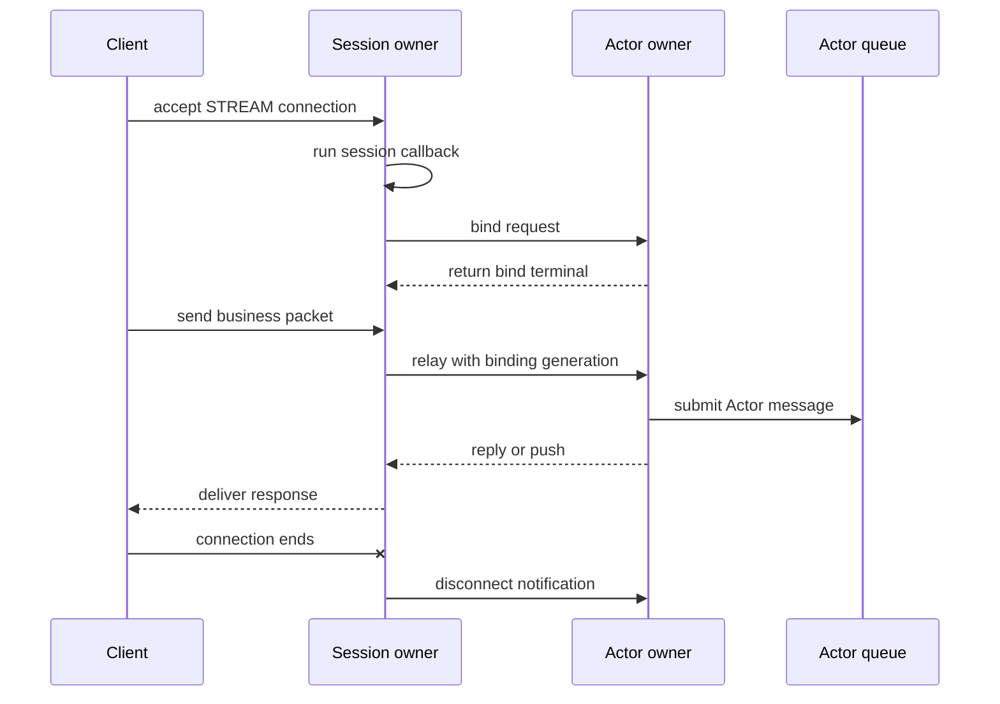

# Session

[Spec table of contents](../README.en.md) · [Next: 01. STREAM Server Session](01-stream-session.en.md)

> One external client connection enters the server and is joined to an
> Actor, then goes through replacement, disconnection, and relocation
> until it closes — this topic covers that one connection's lifecycle and
> the path leading to the Actor.

## 1. Session Overview

The application doesn't read the STREAM connection directly. When a client
connects, the framework builds one
[STREAM session](../00-foundation/02-glossary.en.md#stream-session) and hands packets to
the session callback. The application decides the domain identity in this
callback and finds or creates an [Actor](../03-spot-actor/04-actor-model.en.md) to bind
to the session. Once bind finishes, the session relays payload to that
Actor, and returns the reply or push the Actor sends back over the same
connection. Even if the Actor moves to a different
[MeshNode](../00-foundation/02-glossary.en.md#meshnode), the connection isn't dropped —
only the route is refreshed — and when the connection drops, the
[Spot](../00-foundation/02-glossary.en.md#spot) the Actor belongs to is notified.

## 2. Who Decides What

| Party | Decides/owns |
|---|---|
| Application | Decides the domain identity in the session callback and binds `ActorRef`. Doesn't directly build a route or a global proxy between sessions. |
| Framework (session owner) | Handles header framing and queue admission, retains the binding token, route, and generation, and performs route switches during relay, rebind, disconnect, and relocation. |
| Actor owner | Validates bind/rebind requests, registers the binding generation, and keeps exactly one current binding. |
| Relocation runtime | Chooses the target for Actor/Spot moves, decides readiness, and accesses the [Location Store](../00-foundation/02-glossary.en.md#location-store) — the store holding each Spot's current owner and state. Only requests seal installation and route application from the session owner. |
| Core | Handles the actual STREAM transport send/receive and the receive pipe HWM. |

## 3. Seeing One Flow

This diagram shows only one normal path. Rebind, where a new connection
attaches to the same Actor, is defined by
[Session And Actor Binding "6. Rebind And Replacing The Previous Connection"](02-session-actor-binding.en.md#6-rebind-and-replacing-the-previous-connection),
relocation, where the Actor moves to a different node, is defined by
[Session And Actor Binding "8. The Session's Responsibility During Actor Relocation"](02-session-actor-binding.en.md#8-the-sessions-responsibility-during-actor-relocation),
and failures at each step are defined by the sections that [§5](#5-find-by-question)
points to.

## 4. Documents in This Topic

| Document | Covers | Layer |
|---|---|---|
| [STREAM Server Session](01-stream-session.en.md) | Accepting one connection, registration, packet framing, and the codec and error boundaries — the contract the application observes | Contract |
| [Session And Actor Binding](02-session-actor-binding.en.md) | The bind/relay/rebind/disconnect/relocation contract connecting a session to an Actor, and the execution-structure decisions every language runtime follows so the result is the same everywhere | Contract + implementation spec (decisions every language runtime follows) |

## 5. Find by Question

| Question | Section with the answer |
|---|---|
| What is a session, and what does the application see | [STREAM Server Session "1. STREAM Session Overview"](01-stream-session.en.md#1-stream-session-overview) |
| What path does a packet take from one connection to the callback | [STREAM Server Session "4. From Connection Accept To The Session Callback"](01-stream-session.en.md#4-from-connection-accept-to-the-session-callback) |
| What's rejected at startup | [STREAM Server Session "3.2 Startup Validation"](01-stream-session.en.md#32-startup-validation) · [Session And Actor Binding "3. Startup Conditions"](02-session-actor-binding.en.md#3-startup-conditions) |
| How are a session and an Actor connected, and how many sessions can one Actor have | [Session And Actor Binding "1. Session–Actor Binding Overview"](02-session-actor-binding.en.md#1-sessionactor-binding-overview) · ["4. What Binding Connects And What It Stores"](02-session-actor-binding.en.md#4-what-binding-connects-and-what-it-stores) |
| What happens to the previous connection when a new one arrives for the same Actor | [Session And Actor Binding "6. Rebind And Replacing The Previous Connection"](02-session-actor-binding.en.md#6-rebind-and-replacing-the-previous-connection) |
| How does the Actor learn when a connection drops | [Session And Actor Binding "7. Disconnect Notification"](02-session-actor-binding.en.md#7-disconnect-notification) |
| Is the connection kept when the Actor moves to another node | [Session And Actor Binding "8. The Session's Responsibility During Actor Relocation"](02-session-actor-binding.en.md#8-the-sessions-responsibility-during-actor-relocation) · ["9. Distinguishing Reconnection From Relocation"](02-session-actor-binding.en.md#9-distinguishing-reconnection-from-relocation) |
| Which control commands cross between nodes | [Session And Actor Binding "5. Bind And Relay"](02-session-actor-binding.en.md#5-bind-and-relay)'s command table · ["8.2 Control Messages 42, 43, 44"](02-session-actor-binding.en.md#82-control-messages-42-43-44) |
| When is something complete | [STREAM Server Session "5. Reply Correlation"](01-stream-session.en.md#5-reply-correlation) · [Session And Actor Binding "5. Bind And Relay"](02-session-actor-binding.en.md#5-bind-and-relay) |
| What's left when something fails | [STREAM Server Session "7. Error Boundary"](01-stream-session.en.md#7-error-boundary) · [Session And Actor Binding "12. Failure And Errors"](02-session-actor-binding.en.md#12-failure-and-errors) |
| Who guarantees execution order and concurrency | [Session And Actor Binding "10. Execution And Lifetime"](02-session-actor-binding.en.md#10-execution-and-lifetime) · ["11. Execution Engine And Lane Policy Types"](02-session-actor-binding.en.md#11-execution-engine-and-lane-policy-types) |
| What limits apply | [STREAM Server Session "9. Numbers And Limits"](01-stream-session.en.md#9-numbers-and-limits) · [Session And Actor Binding "6. Rebind And Replacing The Previous Connection"](02-session-actor-binding.en.md#6-rebind-and-replacing-the-previous-connection) · ["8.1 Seal, Held Messages, And Route Switchover"](02-session-actor-binding.en.md#81-seal-held-messages-and-route-switchover) |

## 6. Reading Order

**A developer reading this for the first time**

1. Read §1–§3 of this document to get the whole picture.
2. Read
   [STREAM Server Session "1. STREAM Session Overview"](01-stream-session.en.md#1-stream-session-overview) ·
   ["2. Roles And Responsibilities"](01-stream-session.en.md#2-roles-and-responsibilities) ·
   ["4. From Connection Accept To The Session Callback"](01-stream-session.en.md#4-from-connection-accept-to-the-session-callback)
   to follow a connection's path to the callback.
3. Read
   [Session And Actor Binding "1. Session–Actor Binding Overview"](02-session-actor-binding.en.md#1-sessionactor-binding-overview) ·
   ["2. Roles And Responsibilities"](02-session-actor-binding.en.md#2-roles-and-responsibilities) ·
   ["5. Bind And Relay"](02-session-actor-binding.en.md#5-bind-and-relay)
   to follow the path leading to the Actor.

**A developer porting to a new language** — the following sections hold the
rules and verification requirements that every runtime must follow in the
same structure, so read them before implementing a language runtime. Wherever
languages may differ, the body marks such differences only as **Language-specific
discretion**.

- [STREAM Server Session "2. Roles And Responsibilities"](01-stream-session.en.md#2-roles-and-responsibilities) (recv mode),
  ["4. From Connection Accept To The Session Callback"](01-stream-session.en.md#4-from-connection-accept-to-the-session-callback) (managed queue),
  ["10. Verification Requirements"](01-stream-session.en.md#10-verification-requirements)
- [Session And Actor Binding "2. Roles And Responsibilities"](02-session-actor-binding.en.md#2-roles-and-responsibilities) (validation boundary),
  ["5. Bind And Relay"](02-session-actor-binding.en.md#5-bind-and-relay) (execution-authority separation, control records),
  ["6. Rebind And Replacing The Previous Connection"](02-session-actor-binding.en.md#6-rebind-and-replacing-the-previous-connection) (rebind),
  ["8. The Session's Responsibility During Actor Relocation"](02-session-actor-binding.en.md#8-the-sessions-responsibility-during-actor-relocation) ·
  ["8.1 Seal, Held Messages, And Route Switchover"](02-session-actor-binding.en.md#81-seal-held-messages-and-route-switchover) (seal),
  ["11. Execution Engine And Lane Policy Types"](02-session-actor-binding.en.md#11-execution-engine-and-lane-policy-types),
  ["14. Verification Requirements"](02-session-actor-binding.en.md#14-verification-requirements)

**An application developer**

1. Read
   [STREAM Server Session "1. STREAM Session Overview"](01-stream-session.en.md#1-stream-session-overview) through
   ["3. Registration And Startup Validation"](01-stream-session.en.md#3-registration-and-startup-validation)
   to learn how to register a session and receive packets.
2. Read
   [Session And Actor Binding "1. Session–Actor Binding Overview"](02-session-actor-binding.en.md#1-sessionactor-binding-overview) ·
   ["4. What Binding Connects And What It Stores"](02-session-actor-binding.en.md#4-what-binding-connects-and-what-it-stores) ·
   ["13. Public Interface Excerpt"](02-session-actor-binding.en.md#13-public-interface-excerpt)
   for the public interface to bind and relay to an Actor.
3. Read
   [Session And Actor Binding "9. Distinguishing Reconnection From Relocation"](02-session-actor-binding.en.md#9-distinguishing-reconnection-from-relocation)
   to confirm the difference between reconnection and relocation.

## 7. What This Topic Does Not Define

| Content | Owning document |
|---|---|
| The client-side connector contract | [Stream Connector Common Spec](../../stream-connector/32-stream-connector.en.md) |
| The relocation source/target procedure | [Complete Actor And Spot Relocation Flow](../05-location-relocation/04-relocation-flow.en.md) |
| The Actor model and its queue | [Actor Model](../03-spot-actor/04-actor-model.en.md) |
| Shared permits and the byte HWM | [Application Job Queue And Backpressure](../01-execution/04-application-job-queue-and-backpressure.en.md) |
| Error kind definitions | [Framework Error Model](../00-foundation/07-framework-error-model.en.md) |

---

[Spec table of contents](../README.en.md) · [Next: 01. STREAM Server Session](01-stream-session.en.md)
