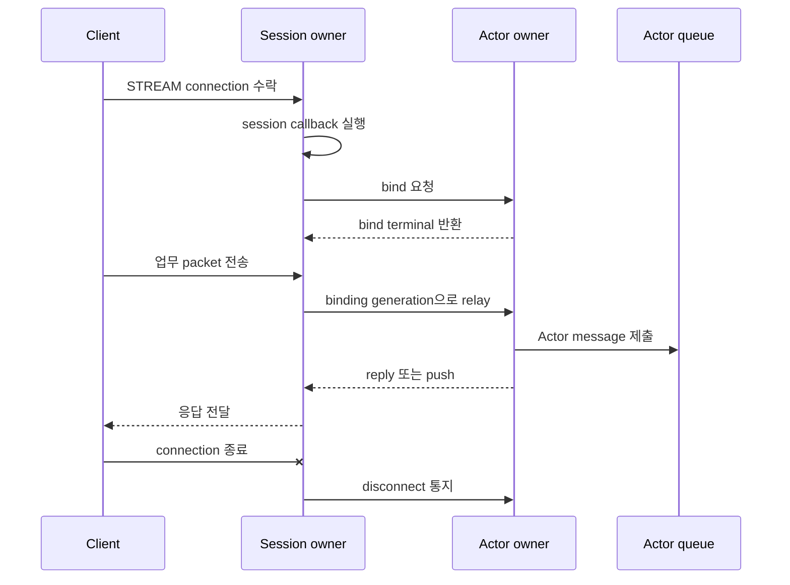

# Session

[스펙 목차](../README.ko.md) · [다음: 01. STREAM 서버 session](01-stream-session.ko.md)

> 외부 client connection 하나가 서버에 들어와 Actor와 이어지고, 교체·끊김·이동을
> 거쳐 닫힐 때까지 — 이 주제는 그 연결 하나의 lifecycle과 Actor로 이어지는 경로를
> 다룬다.

## 1. Session 개요

Application은 STREAM connection을 직접 읽지 않는다. Client가 접속하면 Framework가
[STREAM session](../00-foundation/02-glossary.ko.md#stream-session) 하나를 만들고, packet을 session
callback에 넘겨준다. Application은 이 callback에서 domain identity를 정하고
[Actor](../03-spot-actor/04-actor-model.ko.md)를 찾거나 만들어 session과 bind한다. Bind가 끝나면
session은 그 Actor로 payload를 relay하고, Actor가 돌려주는 reply나 push를 같은
connection으로 되돌린다. Actor가 다른 [MeshNode](../00-foundation/02-glossary.ko.md#meshnode)로
옮겨가도 connection은 끊기지 않고 route만 갱신되며, connection이 끊기면 Actor가 속한
[Spot](../00-foundation/02-glossary.ko.md#spot)이 통지를 받는다.

## 2. 누가 무엇을 결정하는가

| 주체 | 결정·소유하는 것 |
|---|---|
| Application | Session callback에서 domain identity를 정하고 `ActorRef`를 bind한다. Route나 session 간 global proxy를 직접 만들지 않는다. |
| Framework(session owner) | Header framing, queue admission, binding token·route·generation 보관, relay·rebind·disconnect·relocation 중 route 전환을 수행한다. |
| Actor owner | Bind·rebind 요청을 검증해 binding generation을 등록하고 current binding을 하나로 유지한다. |
| relocation runtime | Actor·Spot 이동의 target 선택, 준비 판정과, Spot의 현재 owner·상태를 보관하는 [Location Store](../00-foundation/02-glossary.ko.md#location-store) 접근을 수행한다. Session owner에는 seal 설치와 route 적용만 요청한다. |
| Core | STREAM transport의 실제 송수신과 receive pipe HWM을 담당한다. |

## 3. 한 흐름으로 보기

이 그림은 정상 경로 하나만 보여준다. 같은 Actor에 새 connection이 붙는 rebind는
[Session과 Actor binding 「6. Rebind와 이전 연결 교체」](02-session-actor-binding.ko.md#6-rebind와-이전-연결-교체)가,
Actor가 다른 node로 옮겨가는 relocation은
[Session과 Actor binding 「8. Actor relocation 중 Session의 책임」](02-session-actor-binding.ko.md#8-actor-relocation-중-session의-책임)이,
각 단계의 실패는 [§5](#5-질문으로-찾기)가 가리키는 절이 정의한다.

## 4. 이 주제의 문서

| 문서 | 다루는 것 | 층 |
|---|---|---|
| [STREAM 서버 session](01-stream-session.ko.md) | Connection 하나의 수락, 등록, packet framing, codec 경계와 오류 경계 — Application이 관찰하는 계약 | 계약 |
| [Session과 Actor binding](02-session-actor-binding.ko.md) | Session과 Actor를 잇는 bind·relay·rebind·disconnect·relocation 계약과, 모든 언어 runtime이 그 결과를 같게 내도록 따르는 실행 구조 결정 | 계약 + 구현 스펙(모든 언어 runtime이 따르는 결정) |

## 5. 질문으로 찾기

| 질문 | 답이 있는 절 |
|---|---|
| Session이 무엇이고 Application은 무엇을 보는가 | [STREAM 서버 session 「1. STREAM session 개요」](01-stream-session.ko.md#1-stream-session-개요) |
| 연결 하나에서 packet은 어떤 경로로 callback까지 오는가 | [STREAM 서버 session 「4. 연결 수락부터 session callback까지」](01-stream-session.ko.md#4-연결-수락부터-session-callback까지) |
| startup에서 무엇이 거부되는가 | [STREAM 서버 session 「3.2 Startup 검증」](01-stream-session.ko.md#32-startup-검증) · [Session과 Actor binding 「3. Startup 조건」](02-session-actor-binding.ko.md#3-startup-조건) |
| Session과 Actor는 어떻게 연결되고, 한 Actor는 몇 개 session을 가질 수 있는가 | [Session과 Actor binding 「1. Session–Actor binding 개요」](02-session-actor-binding.ko.md#1-sessionactor-binding-개요) · [「4. Binding이 잇는 값과 보관하는 정보」](02-session-actor-binding.ko.md#4-binding이-잇는-값과-보관하는-정보) |
| 같은 Actor에 새 연결이 오면 이전 연결은 어떻게 되는가 | [Session과 Actor binding 「6. Rebind와 이전 연결 교체」](02-session-actor-binding.ko.md#6-rebind와-이전-연결-교체) |
| 연결이 끊기면 Actor는 어떻게 아는가 | [Session과 Actor binding 「7. Disconnect 통지」](02-session-actor-binding.ko.md#7-disconnect-통지) |
| Actor가 다른 node로 이동하면 연결은 유지되는가 | [Session과 Actor binding 「8. Actor relocation 중 Session의 책임」](02-session-actor-binding.ko.md#8-actor-relocation-중-session의-책임) · [「9. 재접속과 이동의 구분」](02-session-actor-binding.ko.md#9-재접속과-이동의-구분) |
| 어떤 control command가 node 사이를 오가는가 | [Session과 Actor binding 「5. Bind와 relay」](02-session-actor-binding.ko.md#5-bind와-relay)의 command 표 · [「8.2 Control message 42·43·44」](02-session-actor-binding.ko.md#82-control-message-424344) |
| 완료는 언제인가 | [STREAM 서버 session 「5. Reply 상관관계」](01-stream-session.ko.md#5-reply-상관관계) · [Session과 Actor binding 「5. Bind와 relay」](02-session-actor-binding.ko.md#5-bind와-relay) |
| 실패하면 무엇이 남는가 | [STREAM 서버 session 「7. 오류 경계」](01-stream-session.ko.md#7-오류-경계) · [Session과 Actor binding 「12. 실패와 오류」](02-session-actor-binding.ko.md#12-실패와-오류) |
| 실행 순서와 동시성은 누가 보장하는가 | [Session과 Actor binding 「10. 실행과 수명」](02-session-actor-binding.ko.md#10-실행과-수명) · [「11. 실행 engine과 lane 정책 타입」](02-session-actor-binding.ko.md#11-실행-engine과-lane-정책-타입) |
| 어떤 제한이 적용되는가 | [STREAM 서버 session 「9. 수치와 제한」](01-stream-session.ko.md#9-수치와-제한) · [Session과 Actor binding 「6. Rebind와 이전 연결 교체」](02-session-actor-binding.ko.md#6-rebind와-이전-연결-교체) · [「8.1 Seal, held message와 route 전환」](02-session-actor-binding.ko.md#81-seal-held-message와-route-전환) |

## 6. 읽는 순서

**처음 읽는 개발자**

1. 이 문서 §1~§3으로 전체 그림을 잡는다.
2. [STREAM 서버 session 「1. STREAM session 개요」](01-stream-session.ko.md#1-stream-session-개요) ·
   [「2. 역할과 책임」](01-stream-session.ko.md#2-역할과-책임) ·
   [「4. 연결 수락부터 session callback까지」](01-stream-session.ko.md#4-연결-수락부터-session-callback까지)로
   connection이 callback까지 오는 경로를 읽는다.
3. [Session과 Actor binding 「1. Session–Actor binding 개요」](02-session-actor-binding.ko.md#1-sessionactor-binding-개요) ·
   [「2. 역할과 책임」](02-session-actor-binding.ko.md#2-역할과-책임) ·
   [「5. Bind와 relay」](02-session-actor-binding.ko.md#5-bind와-relay)로 Actor로 이어지는 경로를 읽는다.

**새 언어로 porting하는 개발자** — 아래 절이 모든 runtime이 같은 구조로 따라야 하는 규칙과
검증 요구를 담고 있으므로, 언어별 구현 전에 반드시 읽는다. 언어마다 달라도 되는 곳은 본문에
**언어별 재량**으로만 표시한다.

- [STREAM 서버 session 「2. 역할과 책임」](01-stream-session.ko.md#2-역할과-책임)(recv mode),
  [「4. 연결 수락부터 session callback까지」](01-stream-session.ko.md#4-연결-수락부터-session-callback까지)(managed queue),
  [「10. 검증 요구」](01-stream-session.ko.md#10-검증-요구)
- [Session과 Actor binding 「2. 역할과 책임」](02-session-actor-binding.ko.md#2-역할과-책임)(검증 경계),
  [「5. Bind와 relay」](02-session-actor-binding.ko.md#5-bind와-relay)(실행 권한 분리·제어 record),
  [「6. Rebind와 이전 연결 교체」](02-session-actor-binding.ko.md#6-rebind와-이전-연결-교체)(rebind),
  [「8. Actor relocation 중 Session의 책임」](02-session-actor-binding.ko.md#8-actor-relocation-중-session의-책임) ·
  [「8.1 Seal, held message와 route 전환」](02-session-actor-binding.ko.md#81-seal-held-message와-route-전환)(seal),
  [「11. 실행 engine과 lane 정책 타입」](02-session-actor-binding.ko.md#11-실행-engine과-lane-정책-타입),
  [「14. 검증 요구」](02-session-actor-binding.ko.md#14-검증-요구)

**application 개발자**

1. [STREAM 서버 session 「1. STREAM session 개요」](01-stream-session.ko.md#1-stream-session-개요) ~
   [「3. 등록과 startup 검증」](01-stream-session.ko.md#3-등록과-startup-검증)으로 session을 등록하고
   packet을 받는 방법을 읽는다.
2. [Session과 Actor binding 「1. Session–Actor binding 개요」](02-session-actor-binding.ko.md#1-sessionactor-binding-개요) ·
   [「4. Binding이 잇는 값과 보관하는 정보」](02-session-actor-binding.ko.md#4-binding이-잇는-값과-보관하는-정보) ·
   [「13. Public interface 발췌」](02-session-actor-binding.ko.md#13-public-interface-발췌)로 Actor를
   bind하고 relay하는 public interface를 읽는다.
3. [Session과 Actor binding 「9. 재접속과 이동의 구분」](02-session-actor-binding.ko.md#9-재접속과-이동의-구분)으로
   재접속과 이동의 차이를 확인한다.

## 7. 이 주제가 정의하지 않는 것

| 내용 | 소유 문서 |
|---|---|
| Client 쪽 connector 계약 | [Stream Connector 공통 스펙](../../stream-connector/32-stream-connector.ko.md) |
| Relocation source·target 절차 | [Actor와 Spot relocation 전체 흐름](../05-location-relocation/04-relocation-flow.ko.md) |
| Actor model과 queue | [Actor 모델](../03-spot-actor/04-actor-model.ko.md) |
| Shared permit과 byte HWM | [Application job queue와 backpressure](../01-execution/04-application-job-queue-and-backpressure.ko.md) |
| Error kind 정의 | [Framework 오류 모델](../00-foundation/07-framework-error-model.ko.md) |

---

[스펙 목차](../README.ko.md) · [다음: 01. STREAM 서버 session](01-stream-session.ko.md)
