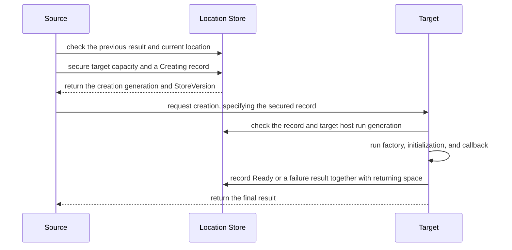
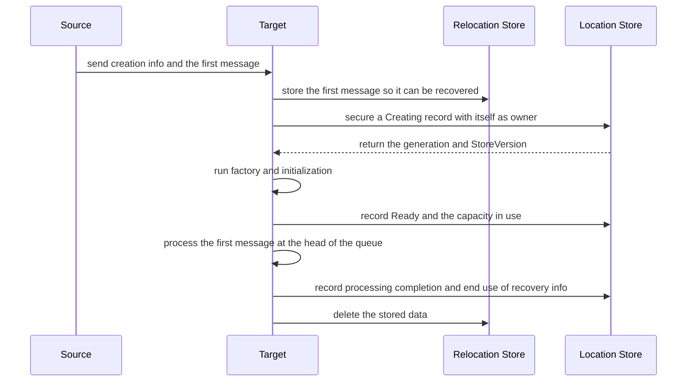
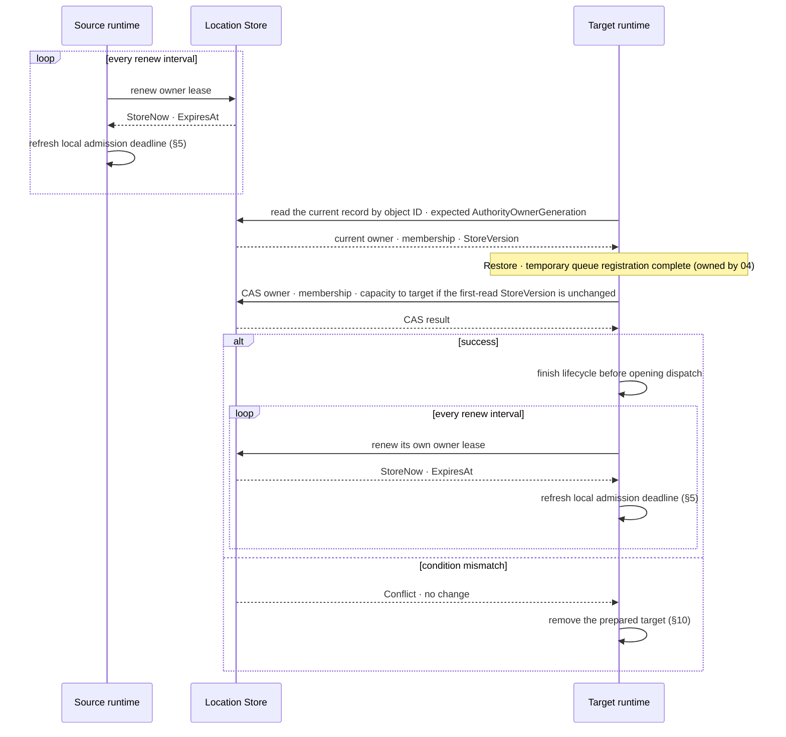

# Location Runtime

[Location And Relocation Topic Table Of Contents](README.en.md) · [Spec Table Of Contents](../README.en.md) · [Next: 02. Location Store (Redis)](02-location-store-redis.en.md)

> Defines how the Framework finds an application object's current location and moves it to another node.

## 1. Location Overview — Responsibilities of the Two Stores

The unit that runs message handlers and Actors is called a
[Spot](../00-foundation/02-glossary.en.md#spot). An Actor can belong to an Entry Spot or a User Spot.
The Spot created as the server entry point when the Framework starts is called an
[Entry Spot](../00-foundation/02-glossary.en.md#entry-spot-user-spot-and-instance-spot). A Spot the
application explicitly creates and manages is a
[User Spot](../00-foundation/02-glossary.en.md#entry-spot-user-spot-and-instance-spot). A Spot created
by its first message, without a separate create call, is an
[Instance Spot](../00-foundation/02-glossary.en.md#entry-spot-user-spot-and-instance-spot).

The node currently processing one Actor/Spot is called the
[owner](../00-foundation/02-glossary.en.md#owner). **The Framework manages this so there are never two
owners at once.** The store holding the current owner and location so multiple nodes can
check it together is called the [Location Store](../00-foundation/02-glossary.en.md#location-store).
Creating and initializing a new Instance Spot from its first message when no instance is
running is called
[cold activation](../00-foundation/02-glossary.en.md#cold-activation). The store holding this
cold activation's creation record and the completion records of requests that finish after
relocation is called the [Relocation Store](../00-foundation/02-glossary.en.md#relocation-store).
The Actor/Spot relocation handoff payload — application state, queue, and timers — doesn't
pass through either Store; the source sends it to the target directly.

The SPI a store implementer must follow is defined by the
[Location Store provider](02-location-store-redis.en.md) and
[Relocation Store provider](03-relocation-store-redis.en.md) documents. This document
explains the order in which the Framework uses the two Stores and the state it must keep
on failure.

### 1.1 Results the Framework Guarantees

The Framework guarantees the following results.

- It finds the service and connection address that can handle the current request.
- It recognizes only one current owner per Actor/Spot.
- It secures the needed capacity in advance on the node that will create or move an
  Actor/Spot.
- It doesn't create the same Actor/Spot twice at once.
- It prevents a previous owner from belatedly changing the location.
- It restores application state and not-yet-executed work on another node during a host
  replacement.

**Relocation proceeds only while the source and the chosen target process are running.**
Once a process terminates, a different runtime doesn't take over the relocation, and there
is no automatic failover to a different target — creating automatic failover would open a
new path to two owners if the previous process belatedly came back to life.
Re-confirming the actual owner when a Location Store response is lost is, for this reason,
not failover but a required check to avoid creating two owners.

The Core transport only carries bytes — it doesn't interpret Actor/Spot location,
creation, or relocation state.

### 1.2 Information the Two Stores Store Separately

The Framework stores location-decision information and recovery payloads in different
Stores.

| Store | Information stored | How the Framework uses it |
|---|---|---|
| Location Store | Current owner and location, generation number, Spot membership, secured capacity, and relocation progress state | Makes the final decision on which node to recognize as the current owner. |
| Relocation Store | The Instance Spot cold activation's creation info and first message, and the reply payload and completion result of pending requests that finish after relocation | Provides the data needed for cold-activation recovery and reply delivery through the previous owner. |

The application state, unexecuted queue, and timers a new owner restores during
Actor/Spot relocation aren't stored in either Store. The source keeps them in memory and
sends them to the target directly (§8).

The relationship of which Actor belongs to which User Spot is called
[Actor membership](../00-foundation/02-glossary.en.md#actor-membership). The list of relocation targets
stored in the Location Store is the source of truth for membership. The payload the
Restore conversation carries can't change this relationship.

**Even with many Actors, the whole list isn't put into a single record.** The Framework
splits this list into multiple pages.

| Limited item | Value |
|---|---|
| System-wide Actor/Spot count | No fixed cap in this contract. |
| Total Actors belonging to one User Spot | No fixed cap in this contract. |
| One page of the relocation target list | At most 1,024 Actor/Spot entries; stored size at most 1 MiB. |

One entry in the list only states "which object needs to move." It records object
identity, generation, membership, and the change to apply during relocation. Here,
generation is the generation number distinguishing an object re-created under the same ID
from a previous owner's belated request (§3). Actor state and message payload aren't
included — the actual application state and unexecuted work are kept in source memory and
sent to the target directly through the Restore conversation (§8).

For example, if a User Spot has 10,000 Actors, roughly 10 list pages are created. The
last page holds only the remaining entries.

```text
User Spot object list
|
+-- Page 1  : User Spot + Actor 1..1023
+-- Page 2  : Actor 1024..2047
+-- ...
+-- Page 10 : Remaining Actors
```

With many pages, the upper-level list for finding pages is also split across multiple
pages. **The Location Store keeps the whole list's start position, total entry count, and
content checksum.** The Framework uses these three values to confirm no page was dropped
or changed.

The restore data itself doesn't pass through a store. The target verifies the directly
transmitted payload against the total length, chunk count, and checksum the Restore
request declared, and verifies the relocation target list against the Location Store's
total entry count and content checksum. **Restore only begins once both verifications
succeed.** Separate Stores aren't created for Actors versus Spots.

**An external Store provider implements only the Location Store SPI and Relocation Store
SPI — it doesn't directly implement the Framework's Actor/Spot rules.**

| Responsibility | Owner |
|---|---|
| Reads and, only when a specified version is unchanged, writes keys and bytes whose meaning it doesn't interpret. | Location Store provider |
| Stores, reads, and deletes a payload that, once stored, doesn't change. | Relocation Store provider |
| Interprets running node information, owner expiry, and the meaning of the current location record. | Framework |
| Computes remaining capacity, moves multiple objects together, and cleans up failure results. | Framework |

For example, the Location Store provider doesn't need to know whether the bytes it stores
are an Actor owner or capacity. The Framework builds the needed record and only asks the
provider for reads and "all-or-nothing" writes.

A runtime node that sends or receives messages within a connection group of several
participating runtime nodes is called a
[MeshNode](../00-foundation/02-glossary.en.md#meshnode). Among the registration info a host
publishes to the Location Store with its network address and running state, the information
for the MeshNode itself is called the
[MeshNode descriptor](../00-foundation/02-glossary.en.md#meshnode-descriptor), and what a
classic fanout publisher publishes is the
[fanout publisher descriptor](../00-foundation/02-glossary.en.md#fanout-publisher-descriptor).

**The Redis key/byte representation of the MeshNode descriptor, owner lease, ClientServer
descriptor, fanout publisher descriptor, and authority record isn't a provider's free
internal choice in this contract — it's the public contract the
[Location Store provider's official Redis implementation](02-location-store-redis.en.md#8-official-redis-provider--counter-issuance)
defines.** Because runtimes in different languages must read and write the same logical
record, a different provider implementation per language must still produce the same
Redis key and the same byte representation for interop to hold. §3.4 summarizes this
format. The Redis key/storage format for payloads the Relocation Store holds is also a
separately versioned public contract, defined by the
[Relocation Store's official Redis implementation](03-relocation-store-redis.en.md#8-the-official-redis-provider).
Language-private secondary indexes a provider adds aren't part of this public contract.

Beyond this public contract, a Redis provider can internally use Lua scripts or change
detection features. The Framework doesn't convert to a Redis implementation and call these
features directly. So a different database provider can also implement the same two Store
SPIs and the record format §3.4 summarizes.

The location-lookup and readiness APIs an application uses aren't Store implementation
APIs. The application uses Framework runtime APIs and doesn't call the Store provider
directly.

### 1.3 Normal Move Order — Overview

Moving an Actor or Spot to another node follows the order below. Each step's detailed
mechanics — payload chunk transfer, the temporary queue, the ingress hold, and backlog
merge order — are defined by
[Complete Actor And Spot Relocation Flow](04-relocation-flow.en.md). This document only
restates, in §8–§9, the records and conditions the Location Store records among them.

1. The Framework confirms the currently running node's information, the owner's expiry,
   and the location record.
2. It secures the capacity the target node will use in the Location Store.
3. After finishing the current application turn, the source captures application state
   and not-yet-executed work and keeps them in memory. It records capture completion in
   the Location Store as `Captured`.
4. The source sends a Restore request to the target. The request carries the payload's
   total length, chunk count, and checksum, and the source sends the payload directly,
   split into chunks, on the same ordered connection.
5. On receiving the request, the target first registers a relocation temporary queue,
   assembles the transmitted chunks, verifies the checksum, and restores the payload into
   an instance not yet exposed externally. Once Restore finishes, it reports relay
   reception ready. The source then relays its ingress hold and sends cutover one-way on
   the same ordered connection.
6. After receiving cutover, or 1,000ms after the relay-ready reply, the target changes
   owner, membership, and capacity together in one step, only if the version first read
   is unchanged. This method is called compare-and-set, abbreviated
   [CAS](../00-foundation/02-glossary.en.md#compare-and-set).
7. After owner change, saved existing work, pre-cutover relay, and remaining temporary
   work enter the real object queue in order. The temporary registration is removed and
   the regular route is installed while dispatch stays closed. Required lifecycle
   callbacks finish before application message processing starts.
8. The source waits for no completion reply after sending cutover and keeps Message
   Follow. The original payload kept in memory is cleaned up after cutover submit
   finishes.

**The handoff payload and the owner change aren't bundled into one distributed transaction
or 2PC.** The Restore request, each chunk, and the target's owner CAS are bound by the
same `RelocationId`, target attempt, and source fence, and a single Location Store owner
CAS exposes the new owner — instead of synchronizing two systems, the design makes a
single CAS the only point that fixes the owner.

Relocation Store usage depends on the kind of move. The Actor/Spot relocation handoff
payload doesn't pass through this Store.

| Work | Framework behavior |
|---|---|
| Same-node Actor join | Changes only membership in the Location Store and creates no payload. |
| `DisableRelocation` cross-node move | Rejected before Capture. |
| `RecreateOnRelocation` cross-node Actor/Spot move | Captures the not-yet-executed queue/timers without application state and sends them to the target directly. Nothing is stored in the Relocation Store. |
| `PreserveStateWith` cross-node Actor/Spot move | Captures application state and the not-yet-executed queue/timers and sends them to the target directly. Nothing is stored in the Relocation Store. |
| Actor/User Spot move for host maintenance | Sends per-target state and incomplete work to the target directly. Only the completion records of pending requests that finish after relocation are stored in the Relocation Store (§9.3). |
| Cross-node Actor `JoinSpot`/`JoinEntrySpot` | Sends a payload matching the moving Actor's policy to the target directly. |
| Processing a message while first creating an Instance Spot | Stores creation info and the first message together in the Relocation Store. Used even when policy is `DisableRelocation`. |

Information announcing a running node stops being used once that host's owner expiry
ends. An Actor/Spot's current location record is kept until deleted under a defined
condition. Transport readiness to send a message, the existence of node information, and
an Actor/Spot's current owner are different conditions. The Framework confirms every
needed condition before sending a request or placing a new object.

## 2. Roles and Responsibilities — Provider vs. Framework

Location Store and Relocation Store are each registered exactly once in the Framework
configuration. **The two Stores aren't bundled into one interface or a Redis-only
registration function.**

A connection group where several runtime nodes exchange messages is called a
[RouteMesh](../00-foundation/02-glossary.en.md#routemesh). A MeshNode participates in a RouteMesh to
send or receive messages. The
[Object Client role](../00-foundation/02-glossary.en.md#object-client-and-object-server-role) can
request Spot creation/lookup and messages. The
[Object Server role](../00-foundation/02-glossary.en.md#object-client-and-object-server-role) provides,
in addition to this, a function for creating a Spot and the associated lifecycle. This function,
which the application registers and the Framework calls when creating an object, is
called a [factory](../00-foundation/02-glossary.en.md#factory).

**A MeshNode with object role `Client` or `Server` requires a Location Store.** Without a
Store, startup fails with a configuration error before a network socket is opened. The
Framework doesn't create a substitute in-process Store. A MeshNode with role `None`
doesn't provide object create, find, message, or factory.

The mechanism that determines how application state is restored when moving an object to
another node is called a [relocation policy](../00-foundation/02-glossary.en.md#relocation-policy).
`RecreateOnRelocation` creates a new instance without application state, and
[PreserveStateWith](../00-foundation/02-glossary.en.md#preserve-state-relocation-policy) restores stored
application state.

**A Framework configuration with even one `RecreateOnRelocation` or `PreserveStateWith`
policy registered on an Object Server factory, or even one Instance Spot factory
registered, must register exactly one Relocation Store.** Registering none or more than one
is a startup configuration error before socket bind. A Relocation Store is only unnecessary
when there's no Instance Spot factory and every factory is `DisableRelocation`.

Once registration succeeds, the Framework is responsible for terminating the Store
instance. It first finishes work that uses the Store, then disposes of the instance exactly
once. If the two Stores share the same database connection, the provider decides when to
close the connection.

The following .NET example registers the two Stores separately. Other languages follow
the same registration rules.

```csharp
services.AddZLinkFramework(options =>
{
    options.AddLocationStore(locationStore);     // makes the final decision on the current owner and location.
    options.AddRelocationStore(relocationStore); // stores the actual data to restore.
});
```

### 2.1 Package Principles Shared by the Two SPIs

The operation lists for the Location Store SPI and the Relocation Store SPI are
defined by [02](02-location-store-redis.en.md#2-responsibilities-of-the-public-spi) and
[03](03-relocation-store-redis.en.md#2-public-spi-and-responsibility-boundary)
respectively. The package boundary the two SPIs share is as follows.

- **The SPI types and interfaces are owned by a provider abstraction package or module
  separate from the core Framework API.** The core Framework package depends on this
  abstraction but doesn't re-expose Store operations as an application API.
- **An external provider must be able to implement only the abstraction, without
  depending on the application/Actor/Spot package.** This lets a provider developer write
  a provider that satisfies the SPI without pulling in the Framework's entire Actor/Spot
  implementation.
- Public methods or DTOs specific to descriptor, authority, reservation, capacity,
  aggregate, lease, or change-stamp aren't added to the SPI. Redis commands, key layout,
  scripts, and private record encoding aren't exposed on the SPI either — this boundary
  is what makes §1.2's "the provider doesn't interpret meaning" hold.

## 3. Values Distinguishing Re-Creation of the Same ID from an Owner Change

### 3.1 Distinguishing Whether the Host Process Restarted

For as long as one host process runs, the Framework uses the `(OwnerId, LeaseGeneration)`
combination. **On a process restart, it issues a combination different from the previous
value.**

| Value | Issuance and purpose |
|---|---|
| `OwnerId` | A non-reusable value the Framework creates. |
| [LeaseGeneration](../00-foundation/02-glossary.en.md#ownerleasegeneration) | Issued by conditionally incrementing a counter kept in the Location Store. `0` isn't used. Used to reject a previous process's late request; unrelated to how many times an object owner changed. |

Whether a host is currently valid is judged by the expiration time recorded in the Store.
This valid period is called the [owner lease](../00-foundation/02-glossary.en.md#owner-lease). Every
MeshNode, ClientServer, fanout publisher, and Actor/Spot location record uses the same
host-run combination and owner lease.

The Framework directly reads the needed `OwnerId` record. It doesn't judge change
authority merely from enumerating owner leases across the whole Store.

A new `LeaseGeneration` is only issued when a new host acquires owner eligibility or takes
over an expired one. Extending expiry and normal release don't change the value. If the
counter reaches `2^63-1`, it's `GenerationExhausted`. Retrying this result doesn't
succeed, and it doesn't change the Store record or counter.

### 3.2 Object Re-Creation and Owner Change Use Different Generation Numbers

The formal record in the Location Store deciding an Actor/Spot's current owner and change
generation is called [authority](../00-foundation/02-glossary.en.md#authority). Authority uses the
following values for different purposes.

The number distinguishing an object deleted and re-created under the same ID from the
previous object is called
[ObjectGeneration](../00-foundation/02-glossary.en.md#objectgeneration). This number doesn't change when
moving an object to another node, since it's the same object continuing.

| Value | Meaning |
|---|---|
| `ObjectGeneration` | Distinguishes whether an object under the same ID was deleted and re-created. Relocation moves the same object, so the value is kept. |
| [AuthorityOwnerGeneration](../00-foundation/02-glossary.en.md#authorityownergeneration) | Indicates the order in which the same object's owner changed. |
| `StoreVersion` | A provider-issued value CAS uses to check whether a different caller changed the record since it was first read. The Framework doesn't interpret its internal makeup. |
| `OwnerLeaseGeneration` | Indicates which process run the current owner host belongs to. |

**The Framework issues object and owner generations as increasing counters. Only
`StoreVersion` is issued by the provider.** ActorRef and SpotRef use ObjectGeneration.

The stored generation range is `1..2^63-1`; `2^63-1` is the exhausted sentinel and is
never issued. The issued range is therefore `1..2^63-2`. Once the stored counter is the
sentinel, a further issuance is `GenerationExhausted`, and the Store isn't changed.
Repeated calls give the same result. The Framework records that authority as an error
state and doesn't send a network command. The counter isn't reset to 0 or reused past the
range.

### 3.3 Values Stored in the Current Location Record

Nodes registered under the same name participate in one RouteMesh connection group. This
group name is called a [MeshName](../00-foundation/02-glossary.en.md#meshname). It's used to choose
which Mesh to place an object on initially, but isn't part of the SpotId.

The global string address used to find a Spot system-wide is called a
[Spot ID](../00-foundation/02-glossary.en.md#spot-id). It's noted as `SpotId` in the public interface.

**Authority's key is a global ActorId or SpotId.** Both IDs are UTF-8 `1..255` bytes and
must match exactly, including case, to be the same ID. Unicode normalization and case
conversion aren't applied. Spot kind is one of `Entry | User | Instance`. MeshName is the
current placement location and isn't part of the identity key.

A string chosen when registering a factory to identify the same object type regardless of
language is called a [stable type](../00-foundation/02-glossary.en.md#stable-type).

| Stored item | Contract |
|---|---|
| Values preventing change conflicts | `StoreVersion`, `ObjectGeneration`, `AuthorityOwnerGeneration`, current `OwnerId`, and `OwnerLeaseGeneration` |
| Placement information | `Reserved \| Active`, object kind, stable type, target node run generation, and per-kind capacity |
| Time the Store read the record | `StoreNow` |
| Framework-internal data | Initial placement request, creation request, and relocation progress state |

Key and placement information aren't put again into the Framework-internal data. The
provider doesn't interpret the meaning of the stored bytes.

| Object | Required capacity (slots in range `0..2^31-1`) |
|---|---|
| Actor | 1 Actor slot |
| User/Instance Spot | 1 Spot slot plus 1 slot of that Spot kind/stable type |
| Relocation of a User Spot and its member Actors | 1 Spot slot, 1 slot of that Spot type, and one Actor slot per member Actor |

A bundle secured at once must have at least one positive slot. The capacity secured at
creation and relocation, current usage, and the Store counter all use the same kind
categorization.

**An authority record has no automatic expiration time.** The record is kept even after
the owner lease ends. Only a Framework task responsible for recovery replaces the owner
or deletes the record, conditioned on the first-read `StoreVersion`. If the record
doesn't exist, only the time the Store read is returned. A temporary `StoreVersion` or
generation isn't created for a nonexistent record.

### 3.4 How Different Languages Read and Write the Same Redis Record

MeshNode descriptor, owner lease, ClientServer server descriptor, fanout publisher
descriptor, and authority record (§4, §3.2, §3.3) must be written to Redis through the
same storage scheme regardless of language, so a runtime in one language can read a
record another language wrote. This storage scheme is defined by the
[Location Store provider's official Redis implementation](02-location-store-redis.en.md#8-official-redis-provider--counter-issuance),
which the Framework calls an "opaque record." For each record, the Framework builds a
fixed string that is byte-for-byte identical across languages (the "logical key
preimage") and uses the lowercase hex
representation of its SHA-256 hash as the last segment of the Redis key. The name that
identifies which Channel a message goes to, referenced by the ClientServer server
descriptor's and fanout publisher descriptor's key, is called a
[ChannelName](../00-foundation/02-glossary.en.md#channelname).

| Record | Logical key preimage (UTF-8, values separated by `\0`) |
|---|---|
| MeshNode descriptor | `mesh-node\0{MeshName}\0{hex(RoutingId)}` |
| Owner lease | `owner-lease\0{OwnerId}` |
| ClientServer server descriptor | `client-server\0{ChannelName}\0{hex(RoutingId)}` |
| Fanout publisher descriptor | `fanout-publisher\0{ChannelName}\0{hex(RoutingId)}` |
| Authority | `authority\0{actor \| spot}\0{Id}` |

`{hex(RoutingId)}` is the lowercase hex representation of the RoutingId's raw bytes.
`{MeshName}`, `{ChannelName}`, `{OwnerId}`, and the authority's `{Id}` (the global ActorId
or SpotId, §3.3) are UTF-8 bytes concatenated as-is, without a length prefix — only the
`\0` bytes in the preimage fix the boundary between values, so `MeshName`, `ChannelName`,
and `Id` themselves must not contain a `\0` byte (§3.3 already imposes this constraint on
ActorId/SpotId). The authority preimage's second segment is the literal `actor` or `spot`
naming the object kind — the same string Id is a different key for an actor than for a
spot (e.g. `authority\0actor\0user:42` and `authority\0spot\0user:42` are different
keys), and the Spot kinds (`Entry | User | Instance`) share this segment, so one Id has
exactly one authority row (§3.3). The
[store record golden fixture](../../../../../../runtime/protocol/golden/store-record-v1.json)
pins the key-derivation vectors for this preimage shape.

Each record's value is a canonical JSON value the provider stores and compares only as
bytes, without interpreting its meaning. It includes at least the following fields.

| Field | Meaning |
|---|---|
| `recordVersion` | The JSON structure version of this record. The current value is `1`. The Framework, not the provider, checks this value; on an unrecognized value it fails explicitly instead of guessing how to read it. |
| `ownerId`, `leaseGeneration` | The `(OwnerId, LeaseGeneration)` (§3.1) of the host that published this record. The authority record instead uses the names `ownerId`/`ownerLeaseGeneration` (table below). |
| `descriptorRevision` | The Revision from §4. Absent from the owner lease record and the authority record. |
| `descriptor` | The MeshNode/ClientServer/fanout publisher descriptor content (§4). Absent from the owner lease record and the authority record. |

`descriptor`'s field list follows this document's §3.3/§4 contract and the .NET
notation the [glossary](../00-foundation/02-glossary.en.md#meshnode-descriptor) already pins. Generation
and revision kinds of integer fields are written as JSON strings rather than JSON
numbers, the same as the generation fields on other records; magnitude values such as
weight, limit, and capacity counts are written as JSON numbers — the golden fixture's
pinned shape is authoritative. RoutingId is a lowercase hex string; timestamps are
strings carrying a Unix epoch millisecond value. All three records carry their own
`ownerId`/`leaseGeneration`/`descriptorRevision` again inside `descriptor` — these are the
same values the same publish operation writes at the record's top level, so they must
always match (written in two places, but CAS treats the whole record as one opaque byte
string, so there's no intermediate state where the two copies diverge). A
provider-internal storage-row version counter some implementations manage internally (for
example, one some implementations put inside the descriptor under the name `generation`)
isn't added to this canonical JSON again, because the opaque record's own cmsgpack
`version` member ([02 §8](02-location-store-redis.en.md#8-official-redis-provider--counter-issuance))
already fills that role — keeping a store version in two places would require redefining
which one is authoritative.

**MeshNode descriptor** — derived from
[the glossary](../00-foundation/02-glossary.en.md#meshnode-descriptor)'s `ZLinkMeshNodeDescriptor`.

| Field | Meaning |
|---|---|
| `meshName` | The RouteMesh group name. |
| `routingIdHex` | The RoutingId's raw bytes as lowercase hex. |
| `lifecycleGeneration` | Distinguishes the current MeshNode run. |
| `descriptorRevision` | Same value as the top-level field above. |
| `endpoint` | The actual advertised ROUTER endpoint to connect to. |
| `entrySpotId` | The Entry Spot ID for an Object Server lifecycle. `null` unless the role is `Server`. |
| `channelWeights` | Selection weight per ClientServer ChannelName. Key is the ChannelName; value is a `0..10000` integer. |
| `applicationVersion` | The application deployment sequence number. |
| `objectCapabilities` | The list of registered object-kind placement capabilities. Each entry has `objectKind` (`actor \| userSpot \| instanceSpot`), `stableType`, `policy` (`unspecified \| disabled \| recreate \| snapshot`), `hasSnapshotAdapter` (boolean), and `limit` (integer, `0` means unlimited). At most 1,024 entries. |
| `objectRole` | One of `none \| client \| server`. |
| `placementWeight` | `0..10000`, default 100 (§4). |
| `capacity` | The "descriptor's count is a copy for operators to check status" projection from §4. `actors` and `spots` are each `{active, reserved, limit}`. `spotTypes` is an array of `{objectKind, stableType, active, reserved, limit}`. Entry Spot isn't included (§4). |
| `activationConcurrency` | The concurrent Instance Spot factory execution limit. `{active, limit}`. |
| `maintenanceWave` | Optional maintenance wave stable ID. `null` if absent. |
| `state` | One of `preparing \| serving \| relocating \| relocated \| draining \| stopped \| error`. |
| `securityIdentity` | The identity that verifies the connecting peer. |
| `ownerId`, `leaseGeneration` | Same values as the top-level fields above. |
| `updatedAtEpochMs` | The time recorded in the Store at update. |

**ClientServer server descriptor** — derived from
[the glossary](../00-foundation/02-glossary.en.md#clientserver-server-descriptor)'s
`ZLinkClientServerServerDescriptor`.

| Field | Meaning |
|---|---|
| `channelName` | The service Channel name Clients query. |
| `serverRoutingIdHex` | The Server's RoutingId as lowercase hex. |
| `lifecycleGeneration` | Distinguishes the current Server run. |
| `descriptorRevision` | Same value as the top-level field above. |
| `endpoint` | The actual advertised endpoint to connect to. |
| `weight` | `0..10000`, default 100. The relative selection weight for new requests and sends. |
| `state` | The same value set as the MeshNode descriptor's `state`. |
| `securityIdentity` | The transport admission identity. |
| `ownerId`, `leaseGeneration` | Same values as the top-level fields above. |
| `updatedAtEpochMs` | The time recorded in the Store at update. |

**Fanout publisher descriptor** — derived from
[the glossary](../00-foundation/02-glossary.en.md#fanout-publisher-descriptor)'s
`ZLinkFanoutPublisherDescriptor`. The same fields as the ClientServer server descriptor
minus `weight`.

| Field | Meaning |
|---|---|
| `channelName` | The Fanout Channel name. |
| `publisherRoutingIdHex` | The Publisher's RoutingId as lowercase hex. |
| `lifecycleGeneration` | Distinguishes the current publisher run. |
| `descriptorRevision` | Same value as the top-level field above. |
| `endpoint` | The advertised PUB endpoint subscribers connect to. |
| `state` | The same value set as the MeshNode descriptor's `state`. |
| `securityIdentity` | The connection admission identity. |
| `ownerId`, `leaseGeneration` | Same values as the top-level fields above. |
| `updatedAtEpochMs` | The time recorded in the Store at update. |

**The authority record** (§3.2, §3.3) is stored as one opaque-record row addressed by one
logical key in all four languages. `objectGeneration` is issued from a Store-wide
monotonic sequence, which also guarantees per-identity monotonicity; this sequence's
counter keys and issuance contract are defined by
[02 §8](02-location-store-redis.en.md#8-official-redis-provider--counter-issuance).

The authority record's canonical JSON includes at least the following fields. Except for
`payload`, integer fields are written as JSON strings rather than JSON numbers, the same
as the generation fields on the other records (because 64-bit values can exceed JSON
number precision).

| Field | Meaning |
|---|---|
| `recordVersion` | Same as above. The current value is `1`. |
| `payload` | Application-defined opaque bytes whose meaning the Framework doesn't interpret. Encoded in JSON as base64 in all four languages. |
| `objectGeneration` | The object's (§3.2) current generation. Issued from the Store-wide monotonic sequence defined above. |
| `authorityOwnerGeneration` | The value distinguishing owner changes (§3.2). |
| `ownerId`, `ownerLeaseGeneration` | The current owner's `(OwnerId, LeaseGeneration)` (§3.1). |
| `allocation` | Placement information (§3.3), derived from dotnet's internal `ZLinkPlacementAllocation`. Includes `state` (`reserved \| active`), `objectKind` (`actor \| userSpot \| instanceSpot` — no Entry Spot; an Entry Spot's Actor is counted as `actor`, §4), `stableType`, `descriptor` (`{meshName, routingIdHex}`, the same shape as a MeshNode descriptor key), `descriptorLifecycleGeneration` (the target MeshNode's `lifecycleGeneration`, CAS-checked against it), and `capacity`. `capacity` is `{actors, spots, spotType}`: `actors`/`spots` are the integer slot counts this allocation secured, and `spotType` is `null` unless the object is a Spot, in which case it's `{objectKind, stableType, count}` (§3.3's "1 Spot slot plus 1 slot of that Spot kind/stable type" — a single flat counter can't express which `(spotKind, stableType)` pair was secured). |
| `pendingCreation` | Creation-in-progress state (§7). `null` when absent; when present, includes `reservationId`, `requestContentReference`, `requestSha256` (hex, 64 characters), and `requestEncodedSize` (integer). |

Payloads the Relocation Store holds (the cold-activation envelope, completion records)
don't use this opaque record. A separately versioned key space and raw-bytes storage
format is defined by the
[Relocation Store's official Redis implementation](03-relocation-store-redis.en.md#8-the-official-redis-provider).

Each language implementation must run a conformance test against the shared golden
fixture that verifies the opaque record's key derivation and value byte representation
(§12).

## 4. Finding Running Nodes and Their Capabilities

A host publishes its network address, running state, and capabilities to the Store. This
information is called a [descriptor](../00-foundation/02-glossary.en.md#descriptor). A MeshNode,
ClientServer server, and fanout publisher each publish their own descriptor, which
includes the current host-run combination.

The feature that lets the Framework read this information from the Store and
automatically configure the necessary connections is called
[automatic discovery](../00-foundation/02-glossary.en.md#automatic-discovery). After reading a
descriptor page, the Framework directly checks whether that host's owner lease is still
valid.

| Descriptor item | Contract |
|---|---|
| Revision | A non-zero increasing value the host issues per descriptor. Not a counter shared across the whole provider. If the next value would exceed `2^63-1`, the host switches to `Error` and stops publishing. |
| Page | `1..1000` entries; stored size at most 4 MiB. The next-page value is issued by the provider and isn't interpreted by the Framework. |
| One descriptor | Stored size at most 1 MiB. The registered-type list and state-adapter-support list are each at most 1,024 entries. |

The Framework checks the change number before and after reading the list. It only uses
the whole page when the two numbers match. The provider doesn't build the whole list in
Lua memory at once, or expose a Redis `SCAN` cursor to the Framework.

**A publisher's `RENEW` that carries the same Revision already stored is a harmless
no-op.** The Store reports it as ignored/stale and doesn't re-store the descriptor. A
publisher must increment Revision to change published content — a replayed `RENEW` at an
unchanged Revision never errors and never overwrites the stored descriptor, even if
replayed more than once.

The host builds the whole descriptor during startup first. If it exceeds the size limit,
it doesn't publish a truncated or split version — the whole startup fails instead. The
format and version of application state aren't put in the descriptor.

A descriptor existing alone doesn't mean a message can be sent. RouteMesh and
ClientServer must finish the actual connection's handshake and usage admission too. This
state is called [ready](../00-foundation/02-glossary.en.md#ready). A fanout subscriber becomes ready
once it receives, on the per-publisher connection, either the first normal application
record or a well-formed
[liveness beacon](../00-foundation/02-glossary.en.md#liveness-and-liveness-beacon). The liveness beacon
is a dedicated record the publisher sends to check connection state — it isn't an
application message.

An Object Server descriptor has the `Server` role, node-wide placement weight, per-node
Actor/Spot count and limit, supported Spot stable types, and Entry Spot ID.

The relative share deciding how a new object is assigned among several target candidates
is called [weight](../00-foundation/02-glossary.en.md#weight). A larger value means it's selected more
often than a candidate with otherwise-equal conditions — it doesn't mean the number of
concurrent jobs it can handle.

| Setting | Range and meaning |
|---|---|
| Weight | `0..10000`, default 100. `0` excludes it from being chosen as a node to place a new object or to relocate to. |
| Overall Actor/Spot limit | Default 0 means no limit. A positive value is `1..2^31-1`. |
| User/Instance Spot type limit | Default 0 means no limit. A positive value is `1..2^31-1`. |
| Negative limit | A startup configuration error. |

Entry Spot isn't included in Spot count. The Entry Spot's Actor is included in the
overall Actor usage. There's no per-Actor-type limit. Current usage and secured capacity
recorded in the Location Store are the final source of truth. The descriptor's count is a
copy for operators to check status.

When placing an Actor or sending it to an Entry Spot, the target descriptor, host run
generation, and Entry Spot ID are fixed together. This relationship isn't computed by
parsing the SpotId string.

The Framework checks owner lease, `Serving` state, and remaining capacity. It checks
current usage and the amount other operations secured in the Location Store all at once,
then picks a target by weight ratio. Even if weight changes to 0, an already-Ready object
or a completed reservation isn't canceled.

Topology enumeration only targets MeshNode descriptors. The status of ClientServer
channels and fanout channels is checked via
[Runtime Status Query And Operational Diagnostics "5. Topology State — RouteMesh, ClientServer, Automatic Fanout"](../06-observability/01-runtime-monitoring.en.md#5-topology-state--routemesh-clientserver-automatic-fanout)
(quoted again in §7.4).

## 5. Blocking a Previous Owner's New Work When the Store Connection Drops

If a host that fails to renew its owner lease keeps accepting new work, it can process
concurrently with the new owner. To prevent this, each host computes "the last time it
can accept new work" from the timestamp returned by the Store. This time is called the
[local admission deadline](../00-foundation/02-glossary.en.md#deadline).

**Every host using a Location Store validates the following relationship at startup**,
regardless of the routing ID allocation method.

```text
renew interval + renew timeout < owner lease TTL - owner lease fencing margin
```

| Setting (per host) | Default |
|---|---:|
| Renew interval | 5 seconds |
| Owner lease TTL | 15 seconds |
| Renew timeout | 3 seconds |
| Owner lease fencing margin | 5 seconds |

Every value must be positive. Violating the relationship above is a startup error.
Automatic RID descriptor registration also uses the same host-run combination and
deadline.

The Framework computes remaining time from the `StoreNow` and `ExpiresAt` of a
successful register/read/renew result. It uses the local monotonic time before and after
the Store request together to account for network delay. **A single owner-lease renewal
refreshes the host-wide local admission deadline. A per-object deadline can't extend this
time.**

Once the deadline passes, or the current host-run combination differs from the Store
value, the following new work isn't accepted.

| Blocked target |
|---|
| Descriptor publishing and automatic RID owner change |
| Starting Actor/Spot/Instance messages and timer callbacks |
| Work confirming factory/restore results in the Store |
| Relocation source/target state changes and capacity reservation |

Processing and cleanup of results from work already accepted into the local queue can
proceed within a separate deadline. But no new Store change is made with expired owner
eligibility.

## 6. Reading and Changing the Current Location Record

`Reserve`, `Preserve`, `NewOwner`, `Commit`, and `Abort` are names of the operations the
Framework uses internally to change a location record. They aren't public methods on the
Store provider. The Framework builds the needed conditions and change content and runs
them as an all-or-nothing Store request.

### 6.1 Read and CAS

Reading authority returns `Missing(StoreNow)` if the record doesn't exist, or
`Found(currentRecord, StoreNow)` with the current value. Changing an existing record uses
CAS to confirm the first-read `StoreVersion` is unchanged.

| Operation | Allowed change |
|---|---|
| `Reserve` | `Missing → Reserved`. Issues ObjectGeneration, the first AuthorityOwnerGeneration, and capacity. |
| `Commit` | That reservation's `Reserved → Active`. |
| `Abort` | That reservation's `Reserved → Missing`. |
| `Preserve` | Keeps the Active owner, generation, and capacity in use; changes only `StoreVersion` and Framework-internal data. Target information must be absent. |
| `NewOwner` | Changes an Active record to the target owner. Keeps ObjectGeneration and increments AuthorityOwnerGeneration. Uses the pre-secured target capacity. |
| `Delete` | Removes the Active record and lookup index, and decreases capacity in use in the same request. |

Applying `Preserve`, `NewOwner`, or `Delete` to a Reserved record is `Conflict` and
changes nothing. An Active owner change is only done via `NewOwner` or the final change of
a whole User Spot move. There's no separate create operation name.

The Framework puts the expected version, counter, record, and lookup-index changes into
one Store request. `Preserve` and `Delete` verify the current owner lease. `NewOwner`
verifies the target lease and the capacity that relocation pre-secured. If the record
doesn't exist or the lease is stale, it's `Conflict` and nothing changes. If the target
information combination itself is invalid, it ends as a Framework-internal error before
calling the Store.

A regular `Preserve` has no relocation reservation information. Only for a standalone
relocation, when updating the completion-record payload location or recording target
readiness, can pre-secured reservation information be passed along. The Framework checks
the authority key, first-read `StoreVersion`, source/target owner, and current capacity,
all together. On success, the `StoreVersion` the reservation expects is also updated in
the same request. Owner, capacity, and reservation state are kept.

### 6.2 Reading Multiple Pages as a List from the Same Point in Time

A recovery task reads a Store record across multiple pages. **The list as it existed when
reading of the first page began must be preserved through the last page.** One page is
`1..1000` entries and stored size is at most 4 MiB.

The first request has no next-page value. Subsequent values are non-empty, at most 4,096
bytes, and the Framework doesn't interpret or assemble their content. A value that's
expired, or used for a different list read, is `ScanExpired`.

The provider returns records in key byte order. A record found on a page is only a
candidate for change. The Framework re-reads that key and only changes it if the version
first read is unchanged. How the provider manages a same-point-in-time list, delete
markers, and cleaning up stale data isn't part of the public contract.

## 7. Creating an Actor or User Spot

Actor and User Spot are created via the Manager's `Create` or `GetOrCreate`. Instance
Spot doesn't use a separate create API. When there's no Instance Spot, the node that
receives the first message creates the Spot and processes that same message. This
behavior is described in §7.1.

| Object | How ID is decided |
|---|---|
| Actor | The caller specifies the global ActorId. |
| User Spot `Create` | The Framework issues a lowercase canonical UUID v4 string as SpotId. |
| User Spot `GetOrCreate` | The caller specifies the global SpotId and stable type. |
| Entry Spot | Only the Framework issues the ID. |

Specifying `InMesh` picks a node from that Mesh. If omitted, when there's exactly one
object-role Mesh, that Mesh is used. With no candidate, `NotConfigured`; with two or more,
`InvalidOperation`; if the specified Mesh doesn't exist, `NotFound`.

A Create call can only be submitted once. Submission uses one deadline spanning from
location lookup through `Ready` confirmation. Specifying the same option twice, or
resubmitting the same call, is `InvalidOperation`.

The creation request's stored size is at most 1 MiB. Actor and User Spot requests are
stored in the Location Store's in-progress creation record. They aren't stored in the
Relocation Store.



The target must be in `Serving` state, have registered the requested stable type, and
have a valid owner lease and remaining capacity. The Framework picks one candidate with
weight greater than 0.

The Location Store's `Reserve` records a `Creating` record together with the capacity to
use only when no record exists. It also issues `ObjectGeneration` and
`AuthorityOwnerGeneration` at this point. If it fails because target state or capacity
changed, that host run generation is excluded and a different candidate can be picked up
to the deadline. If a different request already created the record, the current record's
result is followed and a second factory isn't run.

Remote User Spot creation uses command 47; Actor creation uses command 49. The target
checks that the source's and target's host run generation, ID, type, first-secured
record, and `StoreVersion` all match.

| Callback result | Result also recorded in the Location Store |
|---|---|
| Approved | `Creating → Ready`, converts secured space to in-use, and records `Created`. |
| Application decline | Deletes `Creating`, returns the space, and records `Rejected`. |
| Exception | Deletes `Creating`, returns the space, and records a typed `Failed`. |
| Framework processing failure before the callback | Cancels the same creation record and returns the space. Doesn't create a final application result. |

Actor creation is decided by the Entry Spot callback; User Spot creation by that User
Spot's callback. An application-returned `Rejected` and a callback exception are
different results. If the process terminates mid-way, the factory may run again for the
same ID and same generation. So the factory must not break state if the same request
runs again.

| Current record | `Create` | `GetOrCreate` |
|---|---|---|
| `Ready` of the same type | `AlreadyExists` | existing ref |
| `Creating` of the same type | `AlreadyExists` | waits for the in-progress creation result. |
| A different Actor type | `TypeMismatch` | `TypeMismatch` |
| A different Spot kind or type | `TypeMismatch` | `TypeMismatch` |

If the deadline passes while waiting without the creation-completion condition being met,
it's [`DeadlineExceeded`](../00-foundation/02-glossary.en.md#deadlineexceeded). The next call re-reads
the Location Store.

Even if a response is lost, the same request's result must be re-checkable. The Framework
uses the source Node RID, source host run generation, and a 128-bit `OperationId` as the
request identifier. It first checks whether a stored result for the same identifier
exists before creation.

| Stored final result | Contract |
|---|---|
| Format | Uses `creation-operation-terminal-v1` and SHA-256. Network correlation and reply route aren't stored. |
| Size | At most 1,048,576 bytes. |
| Retention | Up to 5 minutes after the original deadline. Uses the Store time the provider returned. |
| Re-response | Only the same request can be read. The response is freshly built with the current connection's correlation and reply route. |

The Location Store handles the `Ready` change and final-result recording in one step. On
conflict, the stored result is re-read. **Cancellation, timeout, or response loss alone
isn't judged as creation failure.** The current record is re-read to confirm the result,
and the original request isn't automatically resubmitted to a different owner. Remote
creation only completes once it receives command 20's `Existing | Created | Rejected`,
the correct ref, and an optional application reply.

### 7.1 First-Creating an Instance Spot on the Node That Received the Message

A regular message sent to a Spot address only targets an already-`Ready` Spot. Only when
it's marked as an Instance Spot request and the Spot doesn't exist does the target node
that received the message create the Spot through cold activation.

| Current location and option | Behavior |
|---|---|
| A `Ready` record exists | Uses the stored Spot kind, type, and Mesh. The request option doesn't change the current owner. |
| No record, `InMesh` specified | Picks a target node from that Mesh. |
| No record, `InMesh` omitted | `NotConfigured` if there's no object-role Mesh; `InvalidOperation` if there are two or more. |
| Type omitted | Auto-selected if there's exactly one available Instance Spot type. `NotFound` if there are 0; `InvalidOperation` if there are two or more. |

Even if multiple nodes register the same type, it's treated as one type with multiple
target candidates.



The identifying information linking a request and reply to the same call is called
[reply correlation](../00-foundation/02-glossary.en.md#reply-correlation).

The creation info the source sends includes type, Mesh, target descriptor, SpotId, source
Node RID and host run generation, an optional source SpotId, operation ID, reply
correlation, deadline, command 39 information, and the first message. The source doesn't
pre-create an owner or generation.

The target checks the Location Store and the in-process Instance Spot list together. If
it's already the `Ready` owner of the same generation, it uses the existing queue. Only
when no record exists does it store the first message in the Relocation Store and secure
a `Creating` record together with capacity. If multiple targets try at the same time, only
the one that succeeds runs the factory.

Even after recording `Ready`, the stored data is kept until the first message's execution
completion is recorded. The Framework restores the first message to the head of the
queue before receiving new messages. Putting it on the queue alone doesn't delete the
stored data. Only after the handler-completion record is stored does it record the end of
use in the Location Store and delete the payload. The source doesn't resend the first
message.

This recovery info may remain only during the initial creation of a `Ready` Instance Spot.
It isn't used for Actor, other Spot kinds, `Creating`, `Closing`, `Relocating`, or host relocation.

| When the process terminated | Handling by the restarted Framework |
|---|---|
| After storing payload, before recording `Creating` | Data pointed to by no location record, so it's deleted once retention ends. |
| After recording `Creating`, before `Ready` | Continues creation with the same record and generation, or cancels the same record. |
| After `Ready`, before restoring the first message | Restores starting from the first message using the stored data. No new message is received before that. |

If already `Ready`, the original request is delivered once to the current owner. If
`Creating`, it waits for the same creation result. A message isn't run on an in-process
instance of a previous generation. If it's a User Spot or a different type, it's
`TypeMismatch`. No separate owner change is allowed between location confirmation and
message delivery.

### 7.2 Finding the Current Object and Changing Only the Matching Generation

The Manager's `Find(global ID)` returns only the current `Ready` object and doesn't
create a new one. ActorRef and SpotRef contain the global ID, `ObjectGeneration`,
`MeshName`, and `NodeRid`. `ObjectGeneration` is a non-zero 63-bit unsigned value,
represented as a decimal string in JSON. `MeshName` and `NodeRid` show the location at
lookup time and aren't used as a regular-message target or a new-placement condition. The
ActorRef snapshot a bound-session accessor returns is updated to the target
MeshName/NodeRid after a relocation route switch, but the binding route itself isn't
stored or selected by the Location Store.

`Destroy` and `Close` target only the generation of the ref the caller passed. If that
generation doesn't exist, `false`; if a different generation of the same ID exists, a
stale-generation error; if moving, a typed moving error. The Framework doesn't
arbitrarily find the latest ref and terminate a newly created object.

Remote User Spot termination uses command 48 `userSpotClose`. It fixes the source's and
target's host run generation, operation ID, `SpotRef`, `AuthorityOwnerGeneration`,
`StoreVersion`, and deadline. The target only changes to `Closing` if the current record,
Actor membership, and move state all match. Command 20 returns the `closed` result
exactly once. This result isn't replaced by a separate Store query or application packet.

### 7.3 Delivering a Message Arriving at a Previous Owner to the New Owner

The Framework can briefly cache a `Ready` location. The cache stores ID,
`ObjectGeneration`, `AuthorityOwnerGeneration`, `StoreVersion`, owner lease, node run
generation, and route. `RouteCacheMaxAge` defaults to 15 seconds and can't exceed the
last time the owner can accept new work. `Missing`, `Creating`, and Store errors aren't
cached. It's removed immediately on confirming a higher `StoreVersion` or owner lease
expiry.

A message arriving at the previous owner right after a move can be delivered to the new
owner. This feature is called Message Follow, and its period, `MessageFollowDuration`,
defaults to 30 seconds. A value of 0 disables caching or delivery, respectively. Using both
features, the cache retention time must be at least 5 seconds shorter than the delivery
period. An invalid configuration is a configuration error.

**The previous owner only uses the source→target information recorded when the move
completed — it doesn't re-read the Store.** The new owner's `AuthorityOwnerGeneration`
must be greater than the previous value, and forwarding continues for at most 8 hops.
There's no cap on the amount retainable per move. The existing operation ID,
`ObjectGeneration`, payload, and reply route are kept unchanged. A cycle is
`Unavailable`, and a generation mismatch is `InvalidOperation`.

### 7.4 Querying the Current Location from Operational Tools

Operational tools can query the current location by ActorId or SpotId. A list per object
kind and stable type can also be read by page. This result is for checking operational
status and isn't used as an application message's target list or placement condition.

- Lookup by ID distinguishes Actor and Spot. A missing record returns empty and does not
  build a `Missing` entry.
- A paged list requires object kind as a filter, and accepts stable type and MeshName as
  optional filters.
- One page returns `1..1000` entries.
- One encoded page is at most 4 MiB. If adding the next entry would cross the limit, that
  entry begins the next continuation page. Existing field-length limits keep one entry
  within this bound.
- Each entry has the global ID, `ObjectGeneration`, `MeshName`, Node RID, state, and
  stable type.
- The continuation token is opaque and is neither interpreted nor modified by the
  application. One page cycle does not return a duplicate ID; a change completed during a
  cycle may first appear in the next cycle.
- A function returning the whole set at once with no limit isn't provided.
- `Missing`, `Creating`, and Store errors aren't cached as "the object doesn't exist."

Query results use the following states.

| Stored state | Lookup by ID | Paged list |
|---|---|---|
| No record | Empty | No entry |
| `Creating` | A `Creating` entry | Includes a `Creating` entry |
| `Ready` | A `Ready` entry | Includes a `Ready` entry |
| Current owner unavailable after commit | An `Unavailable` entry | Includes an `Unavailable` entry |
| Store query failure | An `Unavailable` Framework error | Ends the whole page as an error and returns no partial successful entries |

Topology enumeration only targets MeshNode descriptors. Since ClientServer channels and
classic fanout channels aren't MeshNodes, they don't appear in this list; their status is
checked via
[Runtime Status Query And Operational Diagnostics "5. Topology State — RouteMesh, ClientServer, Automatic Fanout"](../06-observability/01-runtime-monitoring.en.md#5-topology-state--routemesh-clientserver-automatic-fanout)
(§4). Object location lookup is separate from this enumeration and answers only by
ActorId/SpotId.

## 8. What This Store Does When Moving an Actor or Spot to Another Node

The single source of truth for the source/target handoff and queue order that Actors and Spots
share is [Complete Actor And Spot Relocation Flow](04-relocation-flow.en.md). This
section specifies only the records, generations, and target-only CAS conditions the
Location Store owns among them. It covers moving an Entry Spot Actor, a `PerActor` User
Spot's Actor, or a `SpotWide` User Spot aggregate from a source node to a target node.

The state where the runtime is proceeding with shutdown and not accepting new work is
called [`Shutdown`](../00-foundation/02-glossary.en.md#shutdown). Host-wide target selection and the
completion conditions for `Relocate` and `Shutdown` are defined by
[Complete Host Relocation Flow](05-host-relocation-flow.en.md).

**Only the prepared target performs the Location Store CAS that changes ownership from
source to target.** Neither the source nor the Session owner writes the Location Store
based on target selection or a timeout. The target doesn't start the CAS until Restore
and temporary queue registration have finished and it has received cutover or 1,000ms has
passed. If the CAS fails, it doesn't open application dispatch.

The following diagram shows the flow in which, while §5's owner-lease renewal maintains
§3.1's host-run combination, the target reads the current record and changes owner via
CAS — it draws only the part the Location Store owns; payload chunk transfer and backlog
merge are defined by [04](04-relocation-flow.en.md).



### 8.1 Values Distinguishing the Same Move and Target Request

| Value | Purpose |
|---|---|
| `RelocationId` | A non-zero 128-bit random number identifying one move. Used only by the runtime. |
| `TargetAttemptGeneration` | A non-zero value distinguishing a duplicate or previous Restore request sent to the same target. Not used to select a different target. Always compared only for equality, never ordered numerically ([51 §9](../02-channel-transport/06-wire-protocol.en.md#9-maintenance-capture-and-relocation-envelope)). Must not be derived from the target node's lifecycle generation — that value cannot distinguish a second attempt sent to the same target node from the first. |
| [Reservation ID](../00-foundation/02-glossary.en.md#reservation-id) | A non-zero 128-bit value identifying the request that secured target capacity. Separate from the creation ID. |

The Location Store's per-object location record is at most 1 MiB. Large lists are split
into multiple records, and completion-record payloads are stored in the Relocation Store.

| Storage location | Content stored |
|---|---|
| Per-object location record | Source and target, current stage, application version, completion-record payload location and checksum, completion count |
| Location Store's relocation target list | Sorted object ID, generation, membership, and the change to apply during the move |
| `SpotWide` User Spot whole-move record | Owner, whole-change generation, total entry count, list start position, and content checksum |
| `PerActor` User Spot move record | Spot authority source/target, relocation operation ID, total Actor count, and source/target Actor counts |
| Relocation Store | The reply payload and per-object completion result of pending requests that finish after relocation |

The application state, queue, and timers to restore exist only in source memory and
aren't stored in either Store. Which Actor belongs to which User Spot is judged by the
Location Store's total entry count and list content checksum.

Securing target space fixes together the object ID, `StoreVersion`, kind and stable type,
source's and target's host run generation, owner information, and needed capacity.

| Check result | Handling |
|---|---|
| Current owner and space in use match the request | Continue target checking. |
| Source descriptor or owner lease has expired | Doesn't automatically take over the relocation. Leaves remaining staging records and payload for cleanup. |
| Target host run generation, owner lease, offered type, and remaining space are all valid | Secures target space in the same Store request. |
| Same Reservation ID, same content | Returns the previously issued value. |
| Same ID with different content, or target expired | `Conflict` and nothing changes. |

Securing space alone doesn't change the owner or allow new work on the source. Space
isn't returned merely because time passed. Only after the running source and target
confirm that record in the Location Store can they continue or cancel.

Moving a whole `SpotWide` User Spot allows only two kinds of Store change.

| Change purpose | Allowed content |
|---|---|
| Move to a new owner | Changes one or more object owners, securing the sum of all needed target space. |
| Remove unneeded progress info after the move completes | Keeps every object's owner, generation, membership, and space in use; erases only progress info. |

A space or membership change that doesn't fit either purpose is `Conflict` and changes
nothing. On successful preparation, it records `(AggregateId, AggregateGeneration)` and
`Prepared` state. The same request is `AlreadyPrepared`; a different request is
`Conflict`.

`SpotWide`'s final change re-checks the relocation target list's start position, total
entry count, and content checksum. When changing owner, it converts the secured target
space to in-use. This single CAS must succeed for the User Spot and every Actor to follow
the new owner. On cancellation, only the space secured for the whole User Spot is
returned.

A `PerActor` User Spot changes Spot authority and Actor owner separately. It prepares a
runtime-private Spot shell and capacity on the target, then finishes the Spot queue's
current turn and any in-progress Create/Join. Then, keeping the same public SpotId and
ObjectGeneration, it CASes only the Spot authority to the target. After this CAS, new
`ToSpot`, Create, and Join are handled by the target.

Member Actors each keep their current owner. The Framework prepares Actors left on the
source as independent relocation units and runs a per-Actor owner CAS. The Location
Store updates the relocation operation ID and source/target Actor counts together to
confirm the sum matches the total membership count. `PerActor` User Spot relocation is
only recorded as `Completed` once the last Actor and source relay finish.

### 8.2 Which Node Is Owner at Each Stage

Neither the source nor the Session owner writes the Location Store based on target
selection or a timeout.

| Stage | Recognized owner and target condition |
|---|---|
| `Preparing`, `Captured` | Source is owner. The first `Captured` has no target information. After capture finishes, target information that passed normal host admission can be linked to the same move. |
| `Prepared` | Source is owner. Target attempt number, target owner lease, and target node must all be present. No relocation-specific capacity reservation is recorded. |
| `Committed` through `Completed` | The exactly recorded target is owner. Keeps the same target attempt number. |

An Actor move that doesn't change User Spot membership changes owner with a single
`NewOwner` CAS. Re-preparing on the same target process only replaces the target attempt
number and prep info — it doesn't swap in a different target. A previous attempt can't
change the owner.

| Move kind | Values changed together in the Location Store |
|---|---|
| One Actor's host relocation | Actor owner and `AuthorityOwnerGeneration`. If it's an Entry Spot member, source and target Entry membership also change. |
| Cross-node `JoinSpot`/`JoinEntrySpot` | Actor owner, source/target membership, capacity, and whole-change generation |
| `SpotWide` User Spot host relocation | Owner, membership, and capacity of the Spot and all member Actors |
| `PerActor` User Spot authority transition | Spot owner and generation, target Spot capacity, relocation operation ID |
| `PerActor` member Actor move | Actor owner and generation, source/target Actor counts, Actor capacity |

Relocation keeps `ObjectGeneration` and only increments `AuthorityOwnerGeneration`.
Before a `SpotWide` owner change completes, some objects aren't looked up as belonging to
the target owner. In `PerActor` relocation, since per-Actor current owner is looked up
after the Spot authority transition, a state where some Actors are on the source and some
on the target is allowed. This state is only valid within that relocation operation.

There's no fixed cap on the number of relocation targets for a `SpotWide` User Spot. As
described in §1.2, one list page applies a limit of at most 1,024 entries and 1 MiB, and
with many pages an upper-level list is built. If even one Actor fails to satisfy the
relocation policy, adapter, or target support condition, the whole User Spot move is
rejected before storing state.

Target factory and `Restore` finish before recording `Prepared`. The order of queue
merge, regular-route switch, callback, and dispatch opening is defined by
[04 "4. Normal Processing Order"](04-relocation-flow.en.md).

## 9. Restore, Completion Records, and Their Relationship to the Store

Queue stopping, the number of concurrent moves, payload composition, and timer/Session
handling are defined by
[05 "7. Relocation Units And Batch Order"](05-host-relocation-flow.en.md#7-relocation-units-and-batch-order). Payload
chunking, the transfer budget, and transfer failure rules are defined by
[Complete Actor And Spot Relocation Flow](04-relocation-flow.en.md). This section only
defines which data the Location Store recognizes as the basis for restore.

### 9.1 When Restore Data Becomes the Official Data

The Restore conversation establishes that "these bytes are this move's official
snapshot." The Restore request declares the payload's total length, chunk count, and
CRC-32C checksum, and this request, each chunk, and the target's Location Store CAS are
bound by the same `RelocationId`, target attempt, and source fence. The target discards,
without linking to assembly, any Restore or chunk whose values aren't exactly the same,
so a late-arriving previous attempt's payload never mixes into the current move. The
Location Store doesn't point at the payload's location or checksum.

| Stage | Value recorded in the Location Store | Condition for next stage |
|---|---|---|
| `Preparing` | Source owner information and the relocation target list's content checksum | Must match the current source exactly. |
| `Captured` | Capture completion and the list content checksum. No payload location is recorded. | The source must be keeping the whole payload in memory. |
| `Prepared` | Target attempt number and target owner information | Target's payload assembly and checksum verification, Restore, and relocation temporary queue registration must finish. |
| Owner change | Target owner and membership | Restore must finish and the CAS for one object or the whole User Spot must succeed. The same authority CAS owns normal host-capacity accounting, but there is no relocation-specific reservation handshake. |
| `Completed` | Target dispatch and required lifecycle are open, and required Session route updates were sent | There is no separate target completion reply, and it doesn't wait for all relay through the previous address to end. Message Follow handles late relay (§7.3). The recording condition also includes [§9.3](#93-handling-a-request-that-finished-after-the-source-changed): stored completion results for accepted requests and zero pending deliveries. |

The target puts into assembly only chunks whose binding values match the Restore
request. If the assembled payload's checksum differs from the declared value, or the
relocation target list's content checksum differs, it doesn't start Restore or the owner
change — it responds with an explicit failure and never restores from a partially
assembled payload. Even for the same `RelocationId`, a different target attempt doesn't
use a previous attempt's temporary queue or assembly state. A retransmitted Restore with
the same binding values reuses the existing assembly state only when the declared length
and checksum equal the first values. If a different length or checksum arrives for the
same binding values, the existing assembly state is neither reused nor overwritten — it
ends as an explicit conflict failure.

**The authority commit (the CAS in the "Owner change" row above) only fences the
authority row's own identity — the reservation id and the generations
(`AuthorityOwnerGeneration`, target attempt) that identify which move this CAS belongs
to.** It doesn't validate target-node liveness or the target's lifecycle generation; that
validation belongs to the admission/join path (§7) that ran before Restore, not to the
Store commit itself. A Store commit that succeeds under matching identity fences is
authoritative regardless of whether the target node it points to is still live at that
instant.

| Failure point | Handling |
|---|---|
| Source terminates during `Preparing` or capture | Confirms the current source owner, then cancels the move. |
| Target explicitly fails after `Captured` and before the relay-ready reply is accepted | Cancels the move and keeps the source owner. The source restores its queue from the payload kept in memory. Doesn't automatically pick a different target. |
| Assembled payload's checksum mismatch | The target doesn't start restore and responds with an explicit failure. No retry; the source restores as above. |
| Required information disappears right before `Captured` or `Prepared` | Cancels the move without changing owner. |

A request failure before `Captured` is treated as a normal connection failure, timeout,
or cancellation. It doesn't guarantee that already-accepted work automatically runs on a
different node. After `Captured`, the payload in source memory is used as the basis for
the currently running source and target processes to continue a normal handoff. It isn't
used for automatic recovery after a process restart.

The target reads the current location directly by object ID and the expected
`AuthorityOwnerGeneration`. This gets it the kind, stable type, membership, capacity, and
`StoreVersion`. If the record doesn't exist or the generation differs, factory and
restore preparation aren't started. The whole location-information object isn't copied
into a network command.

### 9.2 When the Target Starts Accepting New Messages

While running factory and `Restore`, the target holds new messages in the relocation
temporary queue and doesn't deliver them to the application handler. If Restore is
retried within the same target process, the failed instance is discarded and a new one
is created. An application callback must not break state even if it receives the same
input again. The Framework doesn't guarantee that a change a callback made to an external
system occurs exactly once. If the target process terminates, a different runtime doesn't
automatically resume Restore with the same payload.

**The target only becomes `Ready` once all of the following conditions are met.**

- The owner and membership change is complete.
- Incomplete-work and timer restore are complete.
- Saved work, pre-boundary relay, and remaining temporary work have entered the real
  execution queue in order.
- The temporary queue registration has been removed and switched atomically to the
  regular route.
- Required lifecycle callbacks have finished and application dispatch is open.

Removing the original source ingress hold, changing the location record to `Completed`,
and applying the Session Actor command 44 route update don't block target application
message processing. The running source and target runtime each continue this follow-up
work independently.

The resolver doesn't return a moving object as `Ready` until all the `Ready` conditions
above are met. Keeping the completion-record payload location — for reply delivery
through the previous owner and the `Completed` record after target dispatch switchover —
doesn't block `Ready`.

A `PerActor` User Spot's target shell becomes Ready for `ToSpot`, Create, and Join once
the Spot authority CAS, source Spot queue relay, and target Spot admission preparation
finish. It doesn't wait for every member Actor's move. Actor direct resolve uses each
Actor's current owner and Ready state, and doesn't guess an Actor still on the source as
being on the target.

### 9.3 Handling a Request That Finished After the Source Changed

| Value | Purpose |
|---|---|
| `OperationId` | Distinguishes an already-accepted request to avoid processing it twice. |
| Source request information | Records the source `OwnerId`, `LeaseGeneration`, Node RID, and node run generation together. |
| `ReplyRouteId` | Distinguishes the route to send the original request's reply on. Absent for Send and event. |
| Key for the stored completion result | Uses `RelocationId`, source request information, and `OperationId` together. |

`OperationId` and `ReplyRouteId` are non-zero and not reused within the same source host
run. Exhausting all values is an error from which the runtime cannot proceed.

The Framework stores each object's completion result in object order. It doesn't insert
the same source request information and `OperationId` twice. **It stores the new
completion result and payload in the Relocation Store first, then changes the Location
Store's payload location, checksum, completion count, and delivery-pending count in a
single CAS.**

`Completed` is only recorded when the accepted request count equals the completion
result count and the delivery-pending count is 0. Otherwise it's a recovery error.

| State | Basis for confirming completion |
|---|---|
| `TerminalReceived` | The source that sent the original request responded that it received the first completion result. |
| `AlreadyTerminal` | The source responded that it already received the same completion result. |
| `SourceLeaseExpired` | The Location Store confirmed the source owner lease has ended. |

Connection closure or reconnection alone isn't judged as having received the completion
result. The target keeps delivering on the current route. If the `Relocate` deadline
passes while the source owner lease is still valid, it's `ForceStopped`. In this case
payload and reply bytes are retained for 24 hours.

### 9.4 Cancellation Before Relay-Ready Is Accepted

Explicit cancellation before the relay-ready reply is accepted follows this order.

1. The source keeps not accepting new work.
2. The Framework discards the target temporary queue's work without running it. It restores
   the original source ingress hold and saved existing work to the source queue in original order.
3. If a bound Session exists, sends command 44 abort one-way. What the Session owner
   does in this abort — releasing the matching seal and the order it submits held
   messages — is defined by
   [Session and Actor Binding "8. The Session's Responsibility During Actor Relocation"](../04-session/02-session-actor-binding.en.md#8-the-sessions-responsibility-during-actor-relocation).
   All that matters here is that it doesn't wait for an apply reply.
4. Cleans up secured target space and the target's in-progress chunk-assembly staging.
5. Without reading or writing the Location Store, the Framework keeps source owner,
   generation, and space in use; it removes only the move's progress info.
6. The source starts accepting new work again.

The source must not accept new work before the cleanup above finishes.

**After the relay-ready reply is accepted, this procedure doesn't restore the source
regardless of the cutover-submit result.** If the target CAS fails, it removes the target
object and queue, and the Session cleans up under its own timeout.

## 10. When a Store Response Isn't Received

If the Framework doesn't receive the result of a Store request, it doesn't guess success
or failure. It re-checks the Store with the same key and first-read version. This rule
applies to the Location Store CAS performed by the target. Cutover and Session route
update are one-way, so the target sends no completion reply to the source, and the
source doesn't update the Location Store on the target's behalf. The return values
and input limits of provider functions are defined by
[Location Store](02-location-store-redis.en.md) and
[Relocation Store](03-relocation-store-redis.en.md).

The retry deadline for relocation CAS is the Restore operation's absolute deadline. A
stored payload's retention period isn't used as a separate criterion. On a retryable
failure or indeterminate response, the target repeats read/CAS with the same source
fence and `RelocationId`. Confirming ownership by that specific target converges to
success. A different valid owner or generation ends the stale relocation immediately.

If target ownership isn't confirmed before Restore validity expires, the target records a
`location_update_failed` Error and removes the prepared Actor or Spot, temporary queue,
and relocation state. It neither opens application dispatch nor sends a Session route
update. A late Store response for a terminal `RelocationId` doesn't reactivate the
object.

During `StoreFailureGrace`, the last fully-read descriptor list is kept. The connection
intents for the targets in that list (including targets not yet connected) are kept and
connection-status judgment for existing connections continues, but no connect is made to a
new target outside that list. Even after grace ends, that list isn't changed until the
whole descriptor set is re-read as a same-point-in-time list.

This grace period doesn't extend the owner lease or relocation deadline. Once the §5
time passes, it blocks state-changing messages and timer starts, factory-completion
recording, relocation changes, and capacity reservation. Once the Store connection
recovers, it re-checks owner information and the full descriptor list, then applies only
the needed connection changes.

If cancellation happens before starting a provider request, the Store may not be called
at all. If cancellation, timeout, or a provider error happens after starting the request,
whether the Store changed is unknown. In this case the Framework re-reads the same key
and expected `StoreVersion` to confirm the result, and only retries if needed.

A Relocation Store write must support being read or stored again using the same reference
the Framework fixed in advance. Payload not pointed to by the Location Store is deleted
after retention ends. If a provider keeps input bytes even after an async request finishes,
it must make a copy. Bytes returned as a success result must not change afterward.

**Payloads stored in the Relocation Store — the Instance Spot cold-activation record and
pending-request completion records — are stored first and re-verified. Only afterward
does the Location Store CAS to point at that reference.** When replacing a payload,
the new payload is stored and verified first, then reference, checksum, and entry count
are changed together. On deletion, the Location Store first records the end of reference
use, then the payload is deleted. The two Stores don't need to be bundled in a
distributed transaction or 2PC, and can live on different Redis instances.

If the payload the Location Store points to is temporarily invisible, it's re-read only
a limited number of times, and the current location record is also re-checked. If the
payload is permanently missing or the checksum differs, it's `DataLost`. The runtime
records the error in the current location record. It doesn't roll back an already-changed
owner and membership to the source, or guess and use a different payload.

## 11. Cleaning Up Store Records When a Host Shuts Down

The state and final result of host commands are defined by
[Complete Host Relocation Flow](05-host-relocation-flow.en.md). This section only
defines the order in which the Location runtime cleans up Store records and in-process
resources.

The Framework finds descriptor and owner-lease deletion candidates via a
same-point-in-time list read. It re-reads each key and only deletes multiple records
together if the version first read is unchanged.

An Actor/Spot's current location record is only removed by an explicit `Delete`.
`Delete` verifies `StoreVersion`, current owner, and space in use. An object's location
record isn't deleted merely because the host descriptor disappeared.

**The owner-cleanup sweep (`removeAllByOwner`) reclaims authority rows only** — the rows
matching the shutting-down host's owner id and lease generation. **It never reclaims
descriptors.** A descriptor is reclaimed only through its own lease expiry and
`TAKEOVER`, never by the owner sweep; the two cleanup paths are independent and run on
different lifetimes.

If the deadline passes, a `ForceStopped` result completes exactly once. Timers, Store
callbacks, reconnection work, and observers must not outlive the runtime resources the
Framework owns.

## 12. Implementation and Contract-Test Verification Requirements

The following is confirmed using only the public surface — the results of the Location
Store SPI (`ReadAsync`/`WriteAsync`/`ScanAsync`) and the Relocation Store SPI
([03 §2](03-relocation-store-redis.en.md#2-public-spi-and-responsibility-boundary)), the
results of the Manager's `Create`/`GetOrCreate`/`Find`/`Destroy`/`Close`, the responses of
remote commands 20/47/48/49, and the key/value bytes a provider conformance test observes
against the store record golden fixture. Each item maps to one test.

**Generation And Owner Lease**

- The values distinguishing object re-creation, owner change, and host restart
  (`ObjectGeneration`, `AuthorityOwnerGeneration`, `OwnerLeaseGeneration`) never swap with
  each other.
- Issuing the next generation after `2^63-1` is always `GenerationExhausted` and doesn't
  change the Store.
- Every Location host checks §5's time relationship at startup; a violation is a startup
  error.
- Once the last time it can accept new work passes, descriptor publishing, starting
  object messages/timers, and relocation changes are all blocked together.

**Descriptor And Location Lookup**

- Exceeding the descriptor count or size limit fails startup entirely instead of
  publishing a partial set.
- Reading a nonexistent record returns `Missing` without creating a generation, and a
  location record doesn't auto-expire.
- A location looked up by global ID returns the same result independent of MeshName.
- The next-page value for a list read is at most 4,096 bytes; one page is at most 1,000
  entries and 4 MiB, and every page is from the same-point-in-time list.

**Creation**

- Even concurrent requests for the same ID create only one `Creating`, and only one
  target runs the factory.
- When creation finishes, it records `Ready`, capacity, and the final result together, or
  record deletion, space return, and a failure result together.
- The same request can re-read the stored final result for 5 minutes from the original
  deadline.
- Commands 47/48 verify source and target run generation, `OperationId`, the creation
  record, `StoreVersion`, and object generation, and command 20's result is returned
  exactly once.
- The `Creating` record and securing/using/returning space are each handled as one Store
  request, and the same space info isn't duplicated in Framework-internal bytes.
- During the initial creation of an Instance Spot, the source doesn't pre-create an owner, only
  one target runs the factory, and the first message and recovery info are stored before
  `Ready` (§7.1).

**Relocation Space And Stages**

- Even if the source descriptor expires, recovery is possible using the Location Store's
  current owner and space in use. An expired target is rejected without changing the
  Store.
- When changing owner for a whole User Spot move, only the space the new owner will use
  is secured; when clearing completion info, owner, generation, membership, and space
  are kept. An invalid combination doesn't change the Store.
- Deletion confirms the current owner lease and space in use, and handles
  location-record deletion and space reduction together.
- Follows §8.2's owner rules and target attempt number — a previous target attempt can't
  change owner or receive new messages.
- The target keeps receiving source messages even after registering the current target
  attempt's temporary queue. Only an abort before the relay-ready reply is accepted
  discards the temporary queue and keeps the source original (§9.4).
- An Entry Spot member Actor move and a whole User Spot move each change the needed
  owner and membership together, in one step.

**Location Cache And Completion Results**

- `Missing`, `Creating`, and Store errors aren't left in the location cache. The cache
  doesn't exceed the owner's new-work-acceptance deadline. Delivery through the previous
  owner is at most 8 hops, with no cap on the retained amount (§7.3).
- Completion results are distinguished by `OperationId` and `ReplyRouteId`; the stored
  entry count must equal the Location Store's entry count, and payload use doesn't end
  before reply delivery through the previous owner or owner-lease termination (§9.3).
- For a payload stored in the Relocation Store, its storage and verification are
  observed before the Location Store CAS, and the Location Store's ending of reference
  use is observed before payload deletion (§10).
- If a payload stored in the Relocation Store is permanently missing or its checksum
  differs, `DataLost` is observed. A checksum mismatch on a directly transmitted handoff
  payload is observed as an explicit failure before restore, and it's never restored
  from a partially assembled payload. An already-changed owner never reverts to the
  source.
- On an explicit cancellation before the relay-ready reply is accepted, the Location
  Store doesn't change and only the target temporary queue is discarded. If a bound
  Session exists, command 44 abort is sent one-way before the source queue reopens, and
  it doesn't wait for an apply reply. After that point, the source queue doesn't reopen
  regardless of the cutover-submit result.

**Store Failure And Interoperability**

- During the Store failure grace period, only new discovery connections are blocked, and
  the owner deadline isn't extended. Relocation CAS retries with the same key, version,
  and fence until Restore validity expires; on expiry, the target object and queue are
  removed and no Session update is sent.
- Per-language implementations of the MeshNode descriptor, owner lease, ClientServer
  server descriptor, fanout publisher descriptor, and authority record build the same
  Redis key from the same logical key preimage, and produce the same canonical JSON
  value. The authority's `objectGeneration` is observed as a value issued from the
  Store-wide monotonic sequence.
- Each language verifies with a conformance test that directly consumes the
  key-derivation vectors and value byte vectors the store record golden fixture defines,
  and fails explicitly on an unrecognized `recordVersion`.

Permit, queue, timer, Session handoff, and host final-result verification are defined by
[05 "17. Implementation And Contract-Test Verification Requirements"](05-host-relocation-flow.en.md#17-implementation-and-contract-test-verification-requirements).

---

[Location And Relocation Topic Table Of Contents](README.en.md) · [Spec Table Of Contents](../README.en.md) · [Next: 02. Location Store (Redis)](02-location-store-redis.en.md)
